# Vector Database Design

10 questions covering vector database internals, index types, scaling, and production deployment.

---

## Q1: What is a vector database and how does it differ from a traditional database?
**Role:** Mid / ML Engineer | **Difficulty:** 🟡 | **Priority:** P0 | **Format:** Quick Answer

> **What the interviewer is testing:** Whether you understand the fundamental semantic shift from exact-match (SQL) to approximate nearest-neighbor (ANN) search.

### Answer in 60 seconds
- **Traditional database:** Stores structured data; queries use exact match, range, or join — `WHERE user_id = 123`
- **Vector database:** Stores high-dimensional numerical vectors; queries find the K vectors most similar to a query vector (nearest neighbor search)
- **Core operation:** `find top-K vectors WHERE cosine_similarity(vec, query_vec) > threshold` — no exact match possible at scale
- **Why exact KNN is impractical:** Exhaustive comparison of 1M × 1536-dim vectors = 1.5B float multiplications per query → 500ms+ — needs Approximate Nearest Neighbor (ANN) indexing for <10ms
- **What vector DBs add:** ANN index (HNSW, IVF, etc.), metadata filtering, hybrid search, embedding management, replication

| Dimension | Postgres (SQL) | Pinecone (Vector DB) |
|-----------|----------------|----------------------|
| Query type | Exact match / range | Approximate nearest neighbor |
| Index type | B-tree, Hash | HNSW, IVF-PQ |
| Query latency | <1ms (indexed) | 5–50ms (ANN) |
| Scale | Billions of rows | Hundreds of millions of vectors |
| Primary use | Structured data | Semantic similarity |

### Diagram

```mermaid
graph LR
  Q[Query: embed('fast cars')] --> VEC[Query Vector<br/>512-dim float]
  VEC --> ANN[ANN Search<br/>HNSW index]
  ANN --> K[Top-5 Nearest<br/>by cosine similarity]
  K --> META[Metadata Lookup<br/>doc_id, source, text]
```

### Pitfalls
- ❌ **Using a vector DB as a general-purpose database:** No transactions, no complex joins, no exact-match efficiency — use alongside a relational DB, not instead of one
- ❌ **Conflating "vector DB" and "embedding model":** Vector DB stores and searches vectors; the embedding model creates vectors — they're separate components

### Concept Reference

---

## Q2: What is HNSW and how does it enable fast ANN search?
**Role:** Mid | **Difficulty:** 🟡 | **Priority:** P1 | **Format:** Quick Answer

> **What the interviewer is testing:** Understanding of the dominant ANN index algorithm used in production vector databases.

### Answer in 60 seconds
- **HNSW (Hierarchical Navigable Small World):** A graph-based ANN index organized into layers — upper layers have long-range connections for fast navigation; lower layers have dense local connections for precision
- **Search process:** Start at top layer with few nodes; greedily traverse toward the query vector; descend to next layer; repeat — O(log n) hops to find approximate nearest neighbor
- **Performance:** 1M vectors, 1536 dims: <10ms ANN search, ~95% recall@10 — 50–100× faster than exhaustive KNN
- **Memory cost:** ~100 bytes per vector for graph edges (M=16 typical). 1M vectors = ~100 MB extra overhead vs just storing the vectors
- **Build time:** Indexed incrementally (unlike IVF which requires full rebuild) — can insert new vectors in O(log n) time
- **Key parameters:** `M` (edges per node, typically 8–64) and `ef_construction` (quality during build) trade build time/memory for recall quality

### Diagram

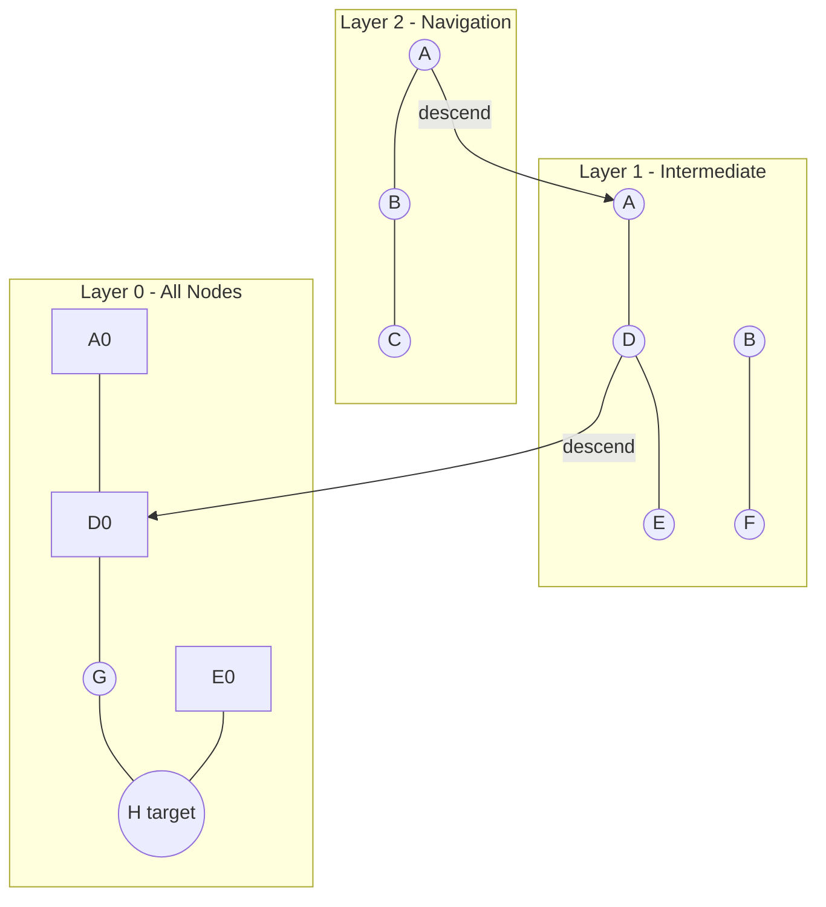

### Pitfalls
- ❌ **Assuming HNSW is always best:** HNSW uses ~100 bytes/vector extra memory for graph; at 1B vectors = 100 GB just for index edges — IVF-PQ uses far less memory at the cost of recall
- ❌ **Default HNSW parameters for production:** Default M=16, ef=64 gives 90% recall; for RAG retrieval where missing the right document is costly, tune to 98% recall (M=32, ef=128) — 2× memory, 50% slower but ~8% more relevant answers

### Concept Reference

---

## Q3: How do IVF-PQ indexes trade accuracy for speed and memory in vector search?
**Role:** Senior | **Difficulty:** 🔴 | **Priority:** P1 | **Format:** Deep Dive

> **What the interviewer is testing:** Understanding of the compression-based ANN index that enables billion-scale vector search with limited memory.

### Problem Constraints
| Dimension | Value |
|-----------|-------|
| Corpus | 1B vectors, 1536 dims |
| Memory budget | 64 GB GPU RAM |
| Target recall | >85%@10 |
| Target latency | <100ms at batch=1 |

### Approach A — Flat Index (Brute Force)
Exhaustive comparison. No indexing.

| Dimension | Flat |
|-----------|------|
| Memory | 1B × 1536 × 4 bytes = **6 TB** |
| Recall@10 | 100% |
| Latency | ~30 seconds at batch=1 |
| Verdict | Not viable at 1B scale |

### Approach B — HNSW
Graph index stored in memory.

| Dimension | HNSW |
|-----------|------|
| Memory | 6 TB vectors + 100 bytes/vec = **6.1 TB** |
| Recall@10 | 98% |
| Latency | 10–50ms |
| Verdict | Memory doesn't fit 64 GB |

### Approach C — IVF-PQ (Inverted File + Product Quantization)
Two-stage compression: IVF partitions space; PQ compresses vectors within partitions.

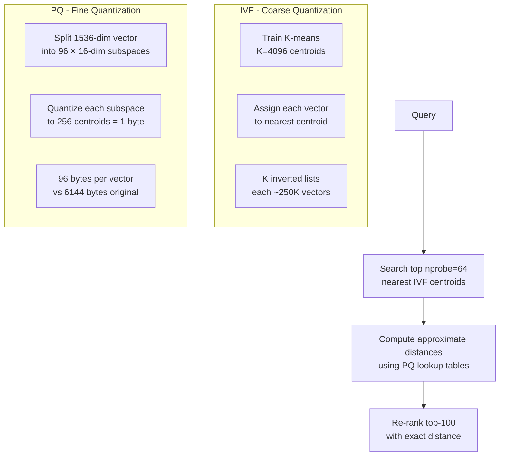

| Dimension | IVF-PQ |
|-----------|--------|
| Memory | 1B × 96 bytes = **96 GB** _(→ tune PQ to 48 bytes = 48 GB, fits!)_ |
| Recall@10 | 85–92% (tunable) |
| Latency | 20–80ms |
| Build time | 4–8 hours (K-means + PQ training on 1B vecs) |
| Verdict | **Viable — fits budget with tuning** |

### Comparison

| Dimension | Flat | HNSW | IVF-PQ |
|-----------|------|------|--------|
| Memory at 1B | 6 TB | 6.1 TB | 48–96 GB |
| Recall@10 | 100% | 98% | 85–92% |
| Latency | 30s | 10–50ms | 20–80ms |
| Incremental insert | No rebuild | O(log n) | Requires IVF list update |

### Recommended Answer
**IVF-PQ** is the only viable approach at 1B vectors within a 64 GB memory budget. Configure: nlist=4096, M=96, nbits=8 (1 byte per subspace). This achieves 48 GB memory + 88% recall@10 at 50ms latency. Add a re-ranking step with exact distances on top-100 PQ candidates to recover 5% additional recall.

### What a great answer includes
- [ ] Calculate exact memory: IVF-PQ = nlist centroids × dim (small) + vectors × bytes_per_vec
- [ ] Explain the two-stage: coarse quantization (IVF) + fine quantization (PQ)
- [ ] Define key parameters: nlist (number of IVF partitions), nprobe (partitions searched at query time), M (PQ sub-quantizers)
- [ ] Note the recall-speed trade-off: increasing nprobe from 1 to 64 increases latency 5× but improves recall 15%
- [ ] Mention FAISS as the reference implementation

### Pitfalls
- ❌ **Building IVF-PQ without training data:** IVF and PQ centroids are learned from a sample of the data — building on untrained centroids gives random partitioning and 50% worse recall
- ❌ **nprobe=1 in production:** Only searching the single nearest centroid misses 30–50% of true neighbors — nprobe=64 (search 64/4096 = 1.5% of data) balances recall and latency

### Concept Reference

---

## Q4: How do you implement filtered vector search?
**Role:** Senior | **Difficulty:** 🔴 | **Priority:** P1 | **Format:** Quick Answer

> **What the interviewer is testing:** Understanding of the technical challenge when combining semantic similarity with metadata filters — a common production requirement.

### Answer in 60 seconds
- **Problem:** "Find semantically similar products AND only in category=electronics AND price<$100" — ANN index doesn't know about metadata
- **Approaches:**
  - *Pre-filter:* Filter metadata first (e.g., SQL query for electronics < $100 → 50K IDs), then ANN search within that subset. Problem: if subset is small (<1K), ANN index is bypassed and you get brute-force search on the subset.
  - *Post-filter:* ANN search for top-1000 by similarity, then filter by metadata. Problem: if only 1% of vectors match metadata, you retrieve 1000 but return 10 — poor recall.
  - *In-filter (segment-based):* Create separate ANN indexes per metadata value (e.g., one index per category). Route query to appropriate index. Problem: index explosion for high-cardinality metadata.
  - *Filtered HNSW (Weaviate/Qdrant approach):* Maintain a dynamic candidate filter during HNSW graph traversal — only traverse nodes that pass metadata filter. Achieves good recall with correct implementation.
- **Production recommendation:** Use a vector DB with native filtered HNSW (Qdrant, Weaviate) — they handle the recall/efficiency trade-off automatically. Expect 20–50% higher latency vs unfiltered search.

### Diagram

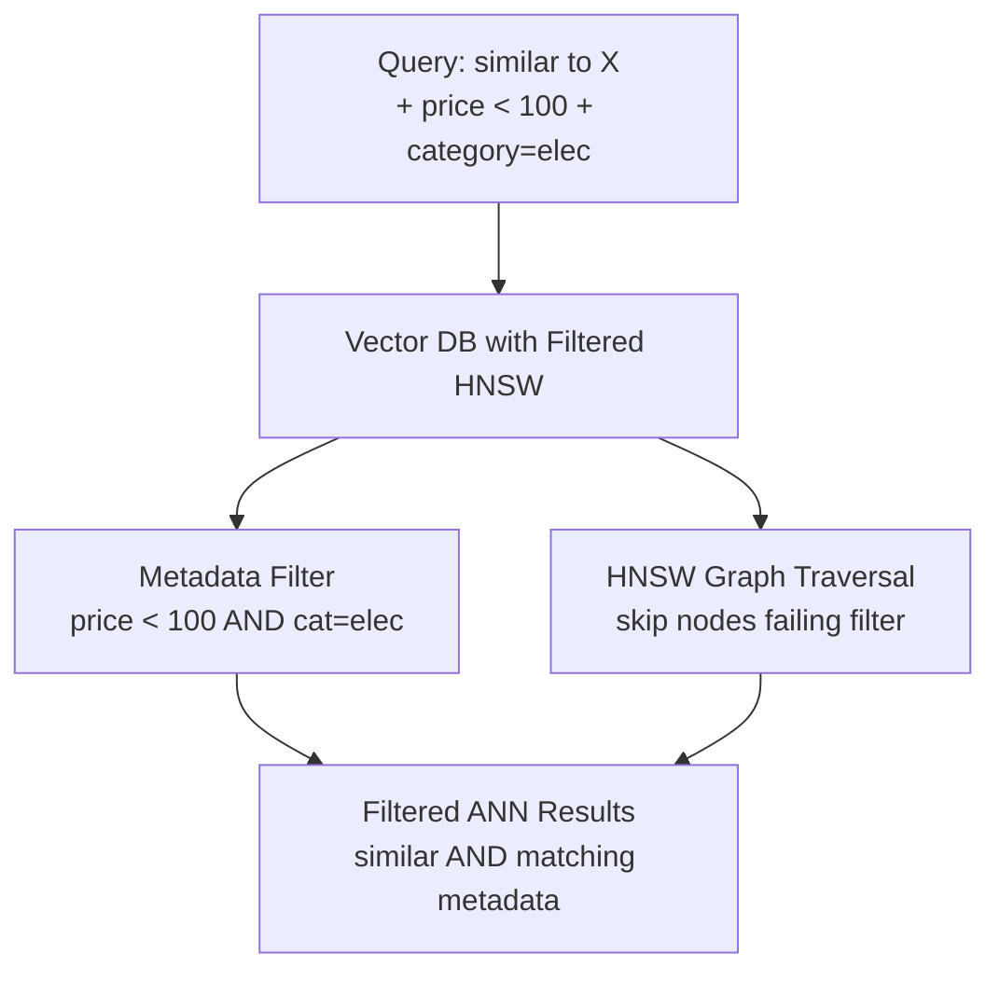

### Pitfalls
- ❌ **Post-filtering with small result ratios:** ANN returns top-1000; only 5 match the filter → effective recall@10 is maybe 3/10 — must increase the ANN candidate pool 20× for high-selectivity filters
- ❌ **Bitmap filter size for large N:** Pre-filtering for 1B vectors requires a 1B-bit bitmap (125 MB) to encode which vectors pass — manageable but must be transferred to GPU for each query

### Concept Reference

---

## Q5: How do you scale a vector database to 1B vectors across multiple nodes?
**Role:** Senior | **Difficulty:** 🔴 | **Priority:** P2 | **Format:** Deep Dive

> **What the interviewer is testing:** Ability to design distributed vector search that partitions data while maintaining good recall and low latency.

### Problem Constraints
| Dimension | Value |
|-----------|-------|
| Total vectors | 1B, 768-dim |
| Memory per node | 64 GB RAM |
| Target recall@10 | >90% |
| Target latency | P99 <100ms |
| Write rate | 10K inserts/sec |

### Approach A — Vertical Scaling (Single Node, High-Memory)
Use a single machine with 1+ TB RAM. AWS r7z.48xlarge: 1.5 TB RAM, $12/hour.

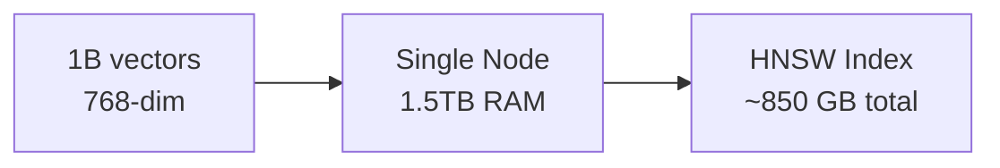

| Dimension | Single Node |
|-----------|------------|
| Memory needed | ~850 GB (HNSW) |
| Recall | 98% |
| Cost | $288/day (r7z.48xlarge) |
| Single point of failure | Yes |

### Approach B — Horizontal Sharding (Partitioned Vector Space)
Partition vectors across N nodes by vector ID range or hash. Each node holds ~1B/N vectors. Query fans out to all shards.

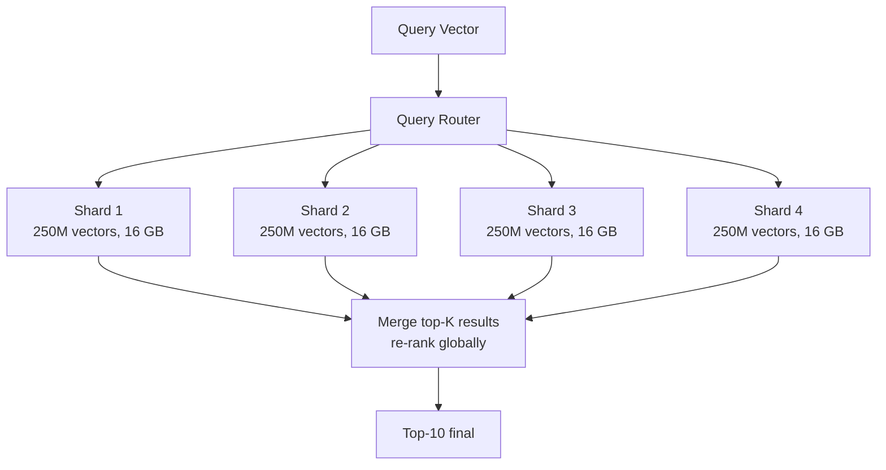

| Dimension | Horizontal Sharding |
|-----------|---------------------|
| Memory per node | 16–20 GB (manageable) |
| Recall | 90–95% (global top-K from per-shard top-K) |
| Latency | 30–60ms (parallel fan-out + merge) |
| Cost | 4× smaller nodes, similar total cost |
| Write | Route to correct shard by hash |

### Approach C — Hierarchical: IVF-PQ Shards + HNSW Re-ranking
Tier 1: 4 shard nodes with IVF-PQ (compressed, fast coarse search). Tier 2: 1 re-ranking node with full-precision vectors for final re-ranking.

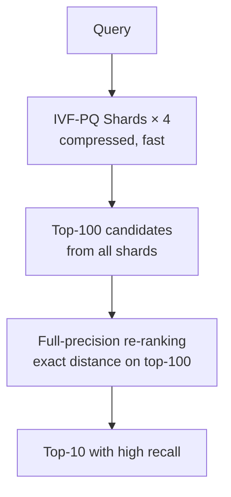

| Dimension | Hierarchical IVF-PQ + Rerank |
|-----------|------------------------------|
| Memory | 4× 12 GB (IVF-PQ) + 1× 16 GB (rerank) = 64 GB total |
| Recall@10 | 93–96% |
| Latency | 50–80ms |
| Cost | Lowest (compressed IVF-PQ = 8× memory savings) |

### Recommended Answer
**Approach B** for teams using managed vector DBs (Pinecone, Weaviate Cloud) — sharding is handled automatically. **Approach C** for self-hosted cost-sensitive deployments. Key: always fan out to all shards, collect top-K per shard (K ≥ 50 to ensure global top-10 recall), then globally re-rank.

### What a great answer includes
- [ ] Calculate that 1B × 768-dim × 4 bytes = 3 TB base storage → must use compression or sharding
- [ ] Explain scatter-gather query pattern: fan out to all shards, merge top-K from each
- [ ] Address the over-fetch requirement: each shard returns top-50, global merge gives top-10 with good recall
- [ ] Discuss write routing: hash(vector_id) mod N_shards for even distribution
- [ ] Name replication factor for HA: each shard with 2 replicas = 8 nodes total for 4-shard setup

### Pitfalls
- ❌ **Each shard returns only top-10:** If shard 1 holds the actual #1 result but it ranks #11 on shard 1, it's lost. Each shard must return top-K (K ≥ 50) for reliable global top-10
- ❌ **No replication for shards:** A single shard failure takes down 25% of the index — critical vectors become unretrievable

### Concept Reference

---

## Q6: Pinecone vs Weaviate vs pgvector — when do you choose each?
**Role:** Senior | **Difficulty:** 🔴 | **Priority:** P2 | **Format:** Quick Answer

> **What the interviewer is testing:** Practical decision-making about vector database selection based on operational, scale, and capability requirements.

### Answer in 60 seconds

| Dimension | Pinecone | Weaviate | pgvector |
|-----------|----------|----------|---------|
| Type | Managed SaaS | Self-hosted / Cloud | Postgres extension |
| Scale ceiling | 1B+ vectors | 100M–1B vectors | 10M–100M vectors |
| Latency (p99) | 10–30ms | 15–50ms | 50–200ms |
| Filtered search | Good | Excellent (native) | Limited (post-filter) |
| Data model | Flat, vectors only | Rich schema + vectors | Full SQL + vectors |
| Cost (1M vecs/month) | $70 | Self-host: $30/mo GPU | Existing Postgres: $0 extra |
| Hybrid search | Limited | Excellent (BM25 + vector) | Via pg_bm25 extension |
| Ops burden | None | Medium | None (if already on Postgres) |

- **Choose Pinecone:** Startup, no ML infra team, time-to-market priority, <$500/month spend
- **Choose Weaviate:** Need hybrid search, rich metadata filtering, or open-source control; have DevOps capacity
- **Choose pgvector:** Already on Postgres, corpus <10M vectors, don't want another service; teams with <5 ML engineers

### Diagram

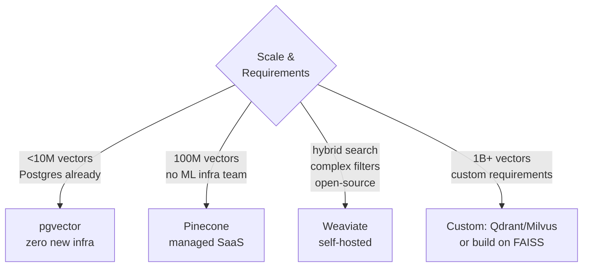

### Pitfalls
- ❌ **Using Pinecone for analytical workloads:** Pinecone is optimized for high-QPS point queries — it has no SQL, no aggregations, no data export. If you need to analyze your vector corpus (clustering, statistics), you need a separate store
- ❌ **pgvector at 100M+ vectors:** pgvector's HNSW is single-node; at 100M+ 1536-dim vectors, memory exceeds most Postgres instance limits and index build takes 12+ hours

### Concept Reference

---

## Q7: How does Spotify use vector embeddings for music recommendations?
**Role:** Staff | **Difficulty:** ⚫ | **Priority:** P2 | **Format:** Quick Answer

> **What the interviewer is testing:** Ability to connect vector database concepts to a real-world recommendation system at massive scale.

### Answer in 60 seconds
- **Scale:** 100M+ users, 80M+ tracks, 5B+ recommendation requests/day
- **Embeddings used:** Track embeddings (from audio features + listening behavior), user embeddings (from listen history), playlist embeddings
- **Training:** Word2vec-style model (called "Track2Vec") trained on listening sequences — tracks listened to in sequence are embedded close together in vector space
- **Serving:** Pre-compute user embedding from recent listening history (updated daily). At request time: ANN search for top-500 similar tracks → apply business rules (already heard, explicit content) → rank with collaborative filtering signal → return top-50
- **ANN infrastructure:** Spotify uses a custom Annoy index (tree-based ANN, built internally) — prioritizes low memory over best recall since music recommendations tolerate 85–90% recall (missing 1 good song is OK)
- **Latency:** User embedding lookup <5ms; ANN search in 80M track space <20ms; total recommendation <100ms

### Diagram

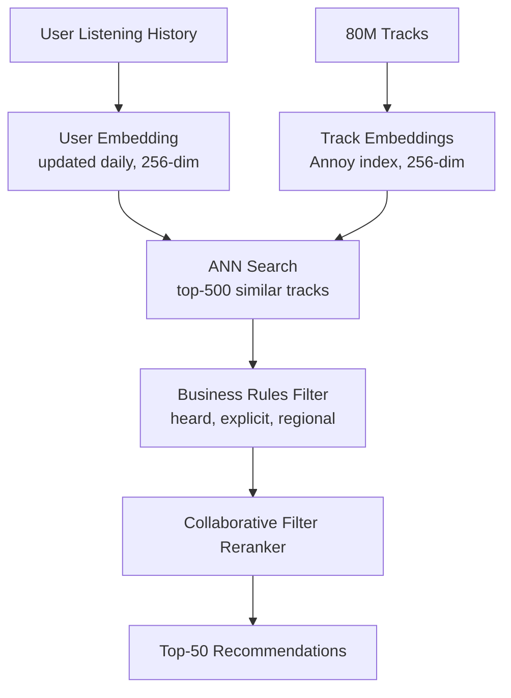

### Pitfalls
- ❌ **Real-time user embedding for every request:** Computing a fresh user embedding from 10K listen events at request time is too slow — batch-update user embeddings nightly, serve from Redis at <5ms
- ❌ **Same embedding space for all recommendation contexts:** "Driving music" and "study music" require different embeddings — Spotify uses context-aware embeddings with a context vector injected at query time

### Concept Reference

---

## Q8: How do you handle embedding drift — when your embedding model changes?
**Role:** Staff | **Difficulty:** ⚫ | **Priority:** P2 | **Format:** Deep Dive

> **What the interviewer is testing:** Ability to manage the operational challenge of model upgrades for systems with large pre-computed embedding stores.

### Problem Constraints
| Dimension | Value |
|-----------|-------|
| Corpus | 10M documents, currently indexed with text-embedding-ada-002 (1536-dim) |
| New model | text-embedding-3-large (1536-dim, +5% NDCG) |
| Downtime tolerance | Zero — search must be available |
| Re-embedding time | 10M docs × 500 tokens × $0.13/1M = $650, ~4 hours at 100K tokens/sec |

### Approach A — Big Bang Migration
Stop writes, re-embed all 10M docs, swap index atomically. Zero parallel operation.

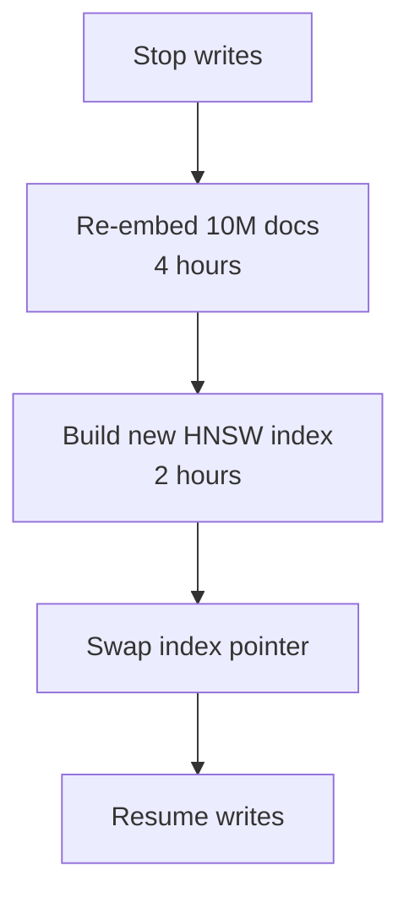

| Dimension | Big Bang |
|-----------|---------|
| Downtime | 6 hours |
| Risk | If re-embedding fails mid-way, rollback to old |
| Complexity | Low |

### Approach B — Shadow Index
Build new index in parallel. Queries served from old index. Switch over atomically when new index is ready.

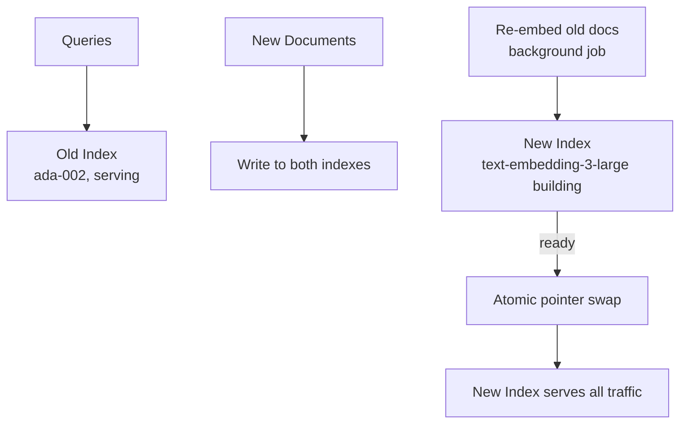

| Dimension | Shadow Index |
|-----------|-------------|
| Downtime | Zero |
| Storage overhead | 2× during migration (~12 GB → 24 GB) |
| Duration | 6 hours background re-embedding |
| Risk | New and old results differ for 6 hours during dual-write |

### Approach C — Dual Model Search
Run both models simultaneously indefinitely. Combine results from both indexes with RRF. Decommission old index after validation.

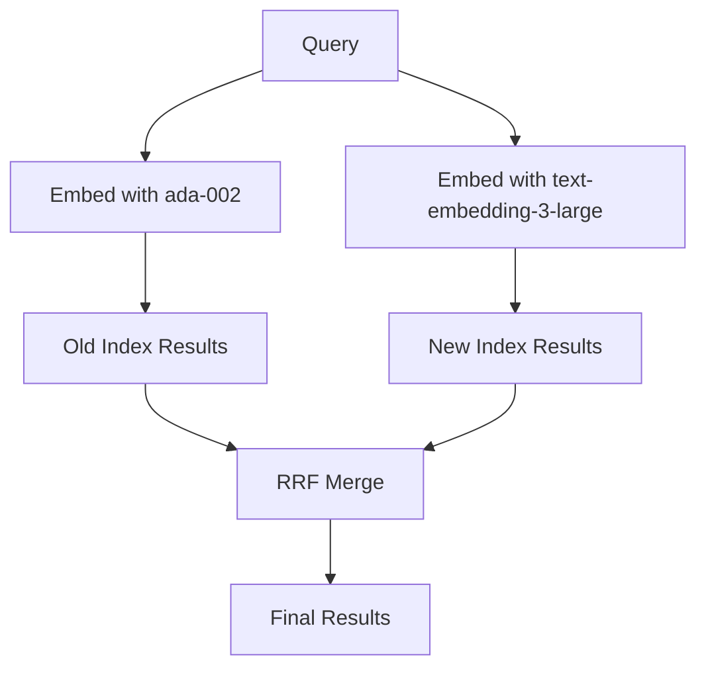

| Dimension | Dual Model |
|-----------|-----------|
| Quality | Best (combines both models) |
| Cost | 2× embedding cost at query time |
| Migration path | Gradually sunset old index after 30 days of validation |

### Recommended Answer
**Approach B (Shadow Index)** for production zero-downtime migration. Steps: (1) new writes go to both indexes immediately, (2) background job re-embeds existing 10M docs with new model (4–6 hours), (3) validate new index quality on 1% traffic canary, (4) atomic pointer swap to new index, (5) decommission old index after 48h of stable serving.

### What a great answer includes
- [ ] Identify the two sources of drift: model upgrade AND data distribution change over time
- [ ] Quantify re-embedding cost and time for the given corpus
- [ ] Address dual-write during migration: new documents must be indexed in both old and new indexes
- [ ] Mention quality validation before full cutover: run 200 test queries against both indexes, compare NDCG
- [ ] Note that if dimensions change (e.g., 768 → 1536), old and new vectors are not comparable — shadow index is mandatory

### Pitfalls
- ❌ **Forgetting about real-time writes during migration:** Documents written during the 6-hour re-embedding window must be written to the new index immediately — failing to dual-write creates a gap
- ❌ **No quality gate before cutover:** Simply re-embedding and assuming it's better — measure NDCG on held-out test queries before exposing to users

### Concept Reference

---

## Q9: What is the cost of storing 1B 1536-dimension float32 vectors and how do you reduce it?
**Role:** Staff | **Difficulty:** ⚫ | **Priority:** P3 | **Format:** Quick Answer

> **What the interviewer is testing:** Ability to reason about vector storage costs and apply compression techniques.

### Answer in 60 seconds
- **Raw storage:** 1B × 1536 dims × 4 bytes (float32) = **6,144 GB = 6 TB** raw vectors
- **With HNSW graph edges:** +~100 bytes/vector = **6.1 TB total**
- **Cloud cost:** At $0.023/GB/month (AWS S3) = $140/month storage. But querying from S3 doesn't work — you need RAM: 64 GB DDR5 server = ~$5,000/month
- **Reduction strategies:**

| Technique | Memory | Recall loss | How |
|-----------|--------|-------------|-----|
| BF16 (2 bytes) | 3 TB | ~0% | Half-precision floating point |
| INT8 quantization | 1.5 TB | <0.5% | 8-bit integer quantization |
| PQ (48 bytes/vec) | 48 GB | 5–12% | Product quantization |
| Matryoshka (512-dim) | 2 TB | ~2% | Truncate to 512 dims |
| PQ (48 bytes) + BF16 full vectors (top-100 rerank) | 48 GB + 0.6 GB | 2–5% | Two-tier |

- **Practical answer:** Use IVF-PQ for candidate retrieval (48 GB), store BF16 full vectors for top-100 re-ranking (600 GB on SSD). Total: 48 GB RAM + 600 GB SSD — feasible on a $3,000/month server.

### Diagram

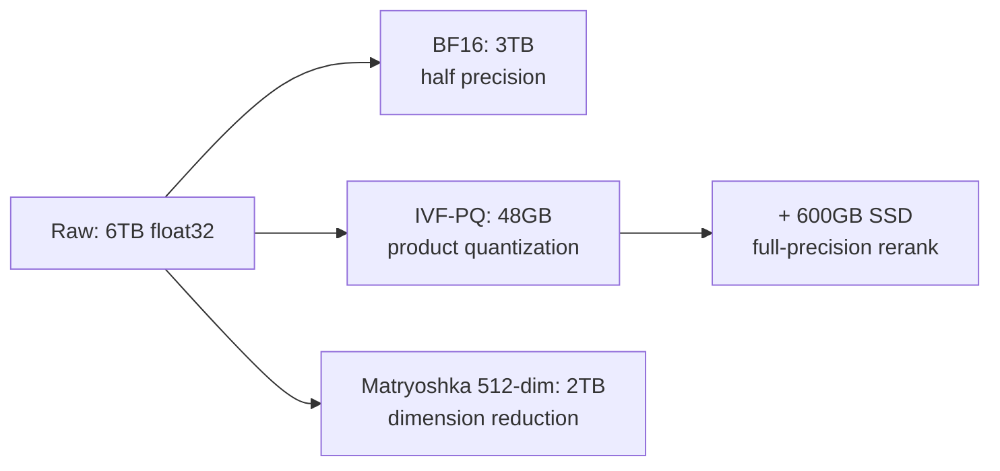

### Pitfalls
- ❌ **Forgetting HNSW graph memory is extra:** Storing 1B vectors in HNSW adds 100 GB+ of graph structure on top of vector data — not just the raw vectors
- ❌ **Using PQ without validation:** Product quantization with aggressive compression (8 bytes/vec) can drop recall@10 from 95% to 70% — always validate recall on your specific data distribution

### Concept Reference

---

## Q10: Design a semantic product search system for 10M products
**Role:** Senior | **Difficulty:** 🔴 | **Priority:** P1 | **Format:** Scenario

**Real Company:** Amazon / Shopify / eBay

### The Brief
> "Design a semantic product search for an e-commerce platform with 10M products. Users search with natural language ('comfortable running shoes for wide feet'). Target: <200ms response, top-10 relevant results, supports filters (price, brand, category), handles 1,000 QPS."

### Clarifying Questions
1. Does ranking need to incorporate business signals (revenue, inventory, margin) or just semantic relevance?
2. How often does product catalog update? (Real-time new listings vs daily batch?)
3. Are product descriptions in one language or multilingual?
4. Should "click + purchase" behavior feed back to improve ranking over time?
5. What is the acceptable recall target — is it OK to miss a perfect result if 5 good ones are shown?

### Back-of-Envelope Estimation
| Metric | Calculation | Result |
|--------|-------------|--------|
| Vector storage | 10M × 512-dim × 4 bytes | 20 GB |
| With HNSW index | +100 bytes/vec overhead | 21 GB — fits in 32 GB RAM |
| Embedding cost (initial) | 10M × 100 tokens avg × $0.02/1M | $20 one-time |
| Re-embed on update | 10K daily updates × 100 tokens × $0.02/1M | $0.02/day |
| Query embedding (1K QPS) | 1K × 30 tokens × $0.02/1M → self-host | Self-host on 1× A10G: 1K QPS < 10ms |
| ANN search latency | 10M HNSW, nprobe=64 | <20ms |

### High-Level Architecture

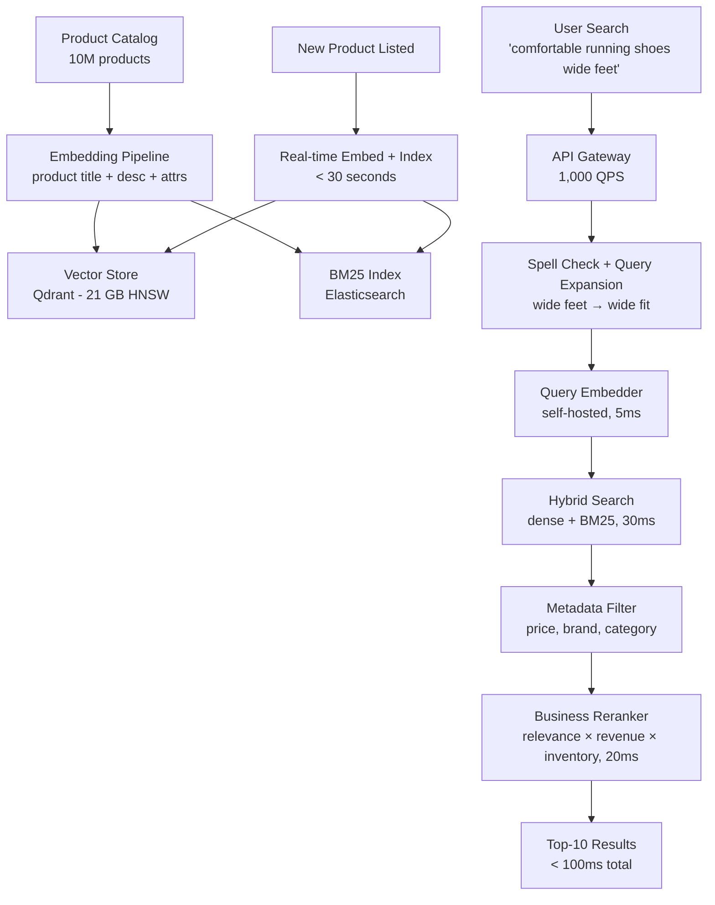

### Trade-off Decisions
| Decision | Option A | Option B | Chosen | Why |
|----------|----------|----------|--------|-----|
| Embedding dimension | 1536-dim (text-embedding-3-large) | 512-dim (text-embedding-3-small) | 512-dim | 10M × 512 = 20 GB fits in 32 GB RAM; MTEB quality drop from 64.6 to 62.3 acceptable for product search |
| Product representation | Title only | Title + description + attributes | Title + key attributes (100 tokens) | Description has too much noise (HTML, SEO spam); title + structured attributes best |
| Filters | Post-filter | In-filter (Qdrant native) | In-filter | Product search has high-selectivity filters (category = 1% of corpus) — post-filter recall collapses |
| Business signals | Separate ranking model | Score blend (relevance × business) | Score blend | Full ranking model adds 50ms latency; multiplicative blend (sim × sqrt(revenue_rank)) adds <5ms |
| Index freshness | Nightly batch | Real-time on product create | Real-time | New product listings must be searchable immediately — 30-second indexing SLA |

### Failure Modes
| Failure | Impact | Mitigation |
|---------|--------|------------|
| Vector store unavailable | No semantic search — degrade to BM25 only | Elasticsearch BM25 as always-available fallback; circuit breaker switches automatically |
| Query embedding model crash | All searches blocked | Cached embeddings for top-10K queries; BM25 fallback for uncached |
| Embedding quality degradation (model update) | Recall drops 10–15% | Shadow index for new model; A/B test before cutover |
| Product catalog data quality (wrong attributes) | Semantic embeddings misaligned | Attribute normalization pipeline; validation before indexing |
| Search latency spike (HNSW rebalancing) | P99 exceeds 200ms SLA | Pre-warm replicas before rebalancing; blue-green deployment for index updates |

