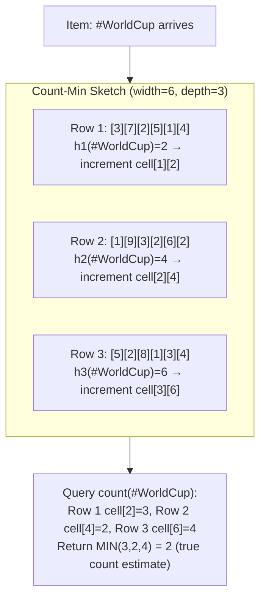
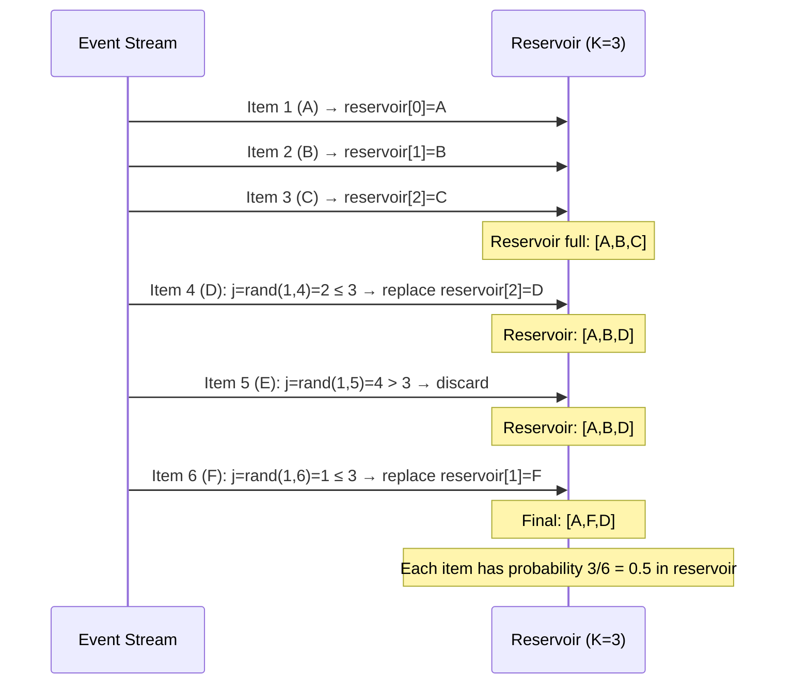
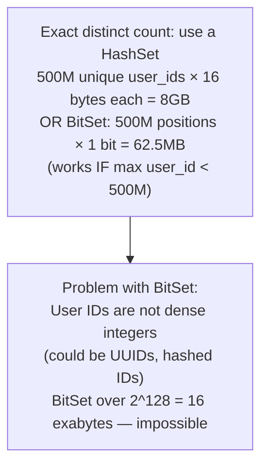
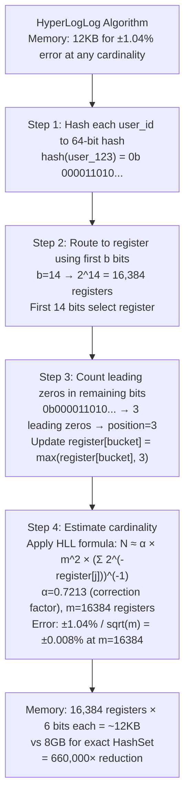
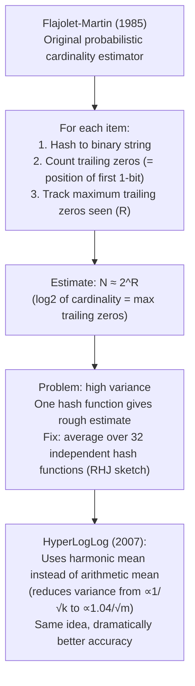
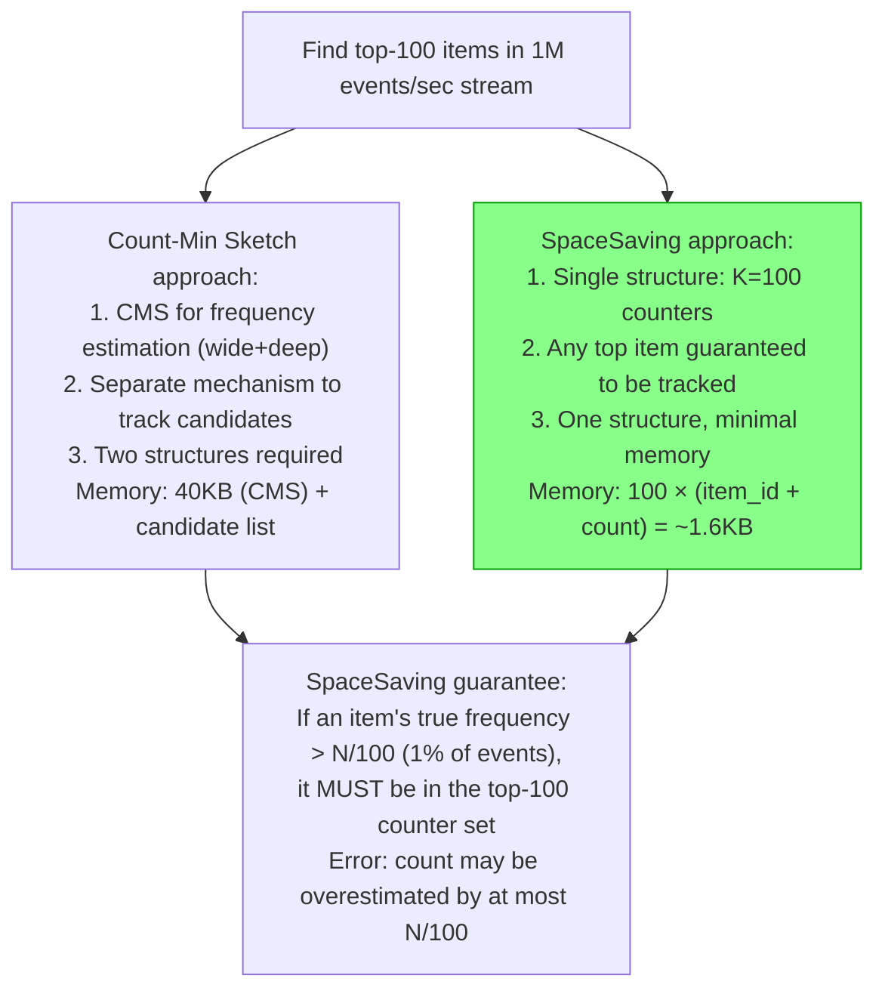
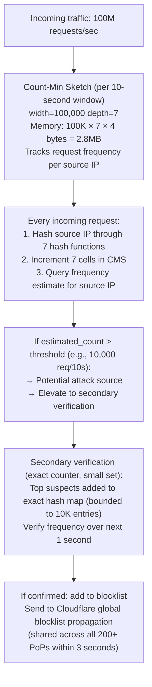
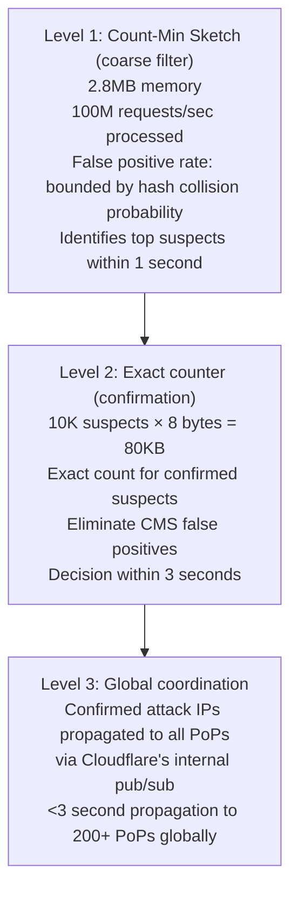

# Approximation Algorithms for Scale

5 questions covering probabilistic algorithms from Count-Min Sketch fundamentals to Cloudflare's real-time DDoS detection.

---

## Q1: What is Count-Min Sketch and how does it estimate frequencies?

**Role:** Mid | **Difficulty:** 🟡 | **Priority:** P0 | **Format:** Quick Answer

> **What the interviewer is testing:** Whether you understand the Count-Min Sketch data structure — its space trade-off, error bounds, and appropriate use cases.

### Answer in 60 seconds
- **Problem:** Count how many times each of N distinct items appears in a stream of events, using sub-linear memory. For N=10M items, exact counting requires 10M counters × 8 bytes = 80MB. Count-Min Sketch does it in ~40KB with bounded error.
- **Structure:** A 2D array of width W and depth D (D = number of hash functions). Each cell is an integer counter. Memory = W × D × 4 bytes.
- **Update:** When item X arrives, for each of D rows, hash X using row-specific hash function → increment that cell.
- **Query:** For item X, for each of D rows, hash X → read that cell value. Return the **minimum** across all D rows.
- **Why minimum:** Hash collisions can only *increase* a cell's count (another item maps to the same cell). The true count is always ≤ any cell value. The minimum is the tightest upper bound.
- **Error bound:** Estimate ≥ true count. Overestimate bounded by: `true_count + ε × total_events` with probability `1 - δ`. Setting W=ceil(e/ε) and D=ceil(ln(1/δ)) gives the optimal size.
- **Typical values:** W=1,000, D=7, error: estimated count ≤ true_count + (total_events/1000) with 99.9% probability. At total_events=1M: overestimate ≤ 1,000.

### Diagram



### Pitfalls
- ❌ **Using Count-Min Sketch for exact counting:** CMS only overestimates — it cannot return exact counts. For exact frequency counting, use a hash map. CMS is for when a hash map is too large (billions of unique items).
- ❌ **Setting W too small:** Error = total_events / W. At W=100 and total_events=10M: error ≤ 100,000 per estimate — useless for items with frequency < 100K. Size W based on acceptable error relative to total traffic volume.
- ❌ **Forgetting that CMS only handles insertions (not deletions):** Decrementing a cell can create values below the true count. For streams with deletions, use CMS with conservative updates or Count sketch (supports subtraction).

### Concept Reference

---

## Q2: How does reservoir sampling work for an unknown-size stream?

**Role:** Mid | **Difficulty:** 🟡 | **Priority:** P0 | **Format:** Quick Answer

> **What the interviewer is testing:** Whether you understand the guarantee of reservoir sampling and why it's necessary for uniform random sampling from a stream whose size is unknown in advance.

### Answer in 60 seconds
- **Problem:** Sample K items from a stream of N items where N is not known in advance (could be 1M or 1B). Every item must have exactly equal probability (K/N) of being in the final sample. Cannot buffer all N items (N is too large).
- **Algorithm (Algorithm R, Vitter 1985):**
  1. Fill reservoir with first K items.
  2. For item i (i > K): generate random integer j = uniform(1, i). If j ≤ K: replace reservoir[j] with item i. Else: discard item i.
  3. After all items processed, reservoir contains K items with equal probability.
- **Why it works:** At step i, the probability of any item being in the reservoir is K/i. When a new item arrives at position i+1, it joins with probability K/(i+1) — and each existing reservoir item is replaced with probability 1/(i+1), giving each item final probability K/(i+1). The invariant holds at every step.
- **Example:** K=3, stream=[A,B,C,D,E].
  - Reservoir=[A,B,C].
  - D arrives (i=4): j=uniform(1,4). If j≤3, replace. j=2 → reservoir=[A,D,C].
  - E arrives (i=5): j=uniform(1,5). If j≤3, replace. j=4 → keep. reservoir=[A,D,C].
- **Use cases:** Random log sampling, clickstream sampling, A/B test event sampling, data pipelines where the stream size is unknown.

### Diagram



### Pitfalls
- ❌ **Sampling only the first K items:** Taking the first K items is biased toward early-stream items. Early items in a log file (e.g., midnight traffic) are not representative of peak traffic. Reservoir sampling ensures uniform probability.
- ❌ **Not using a cryptographically random generator:** If `j = uniform(1,i)` uses a weak pseudo-random generator, the sampling distribution is biased. Use a cryptographically strong RNG for security-sensitive sampling.
- ❌ **Reservoir sampling for weighted sampling:** Algorithm R gives equal probability to all items. For weighted sampling (some events are more important), use weighted reservoir sampling (Algorithm A-Res) which replaces with probability proportional to weight.

### Concept Reference

---

## Q3: How do you count distinct values in a 1TB log file using only 100MB of memory?

**Role:** Senior | **Difficulty:** 🔴 | **Priority:** P1 | **Format:** Deep Dive

> **What the interviewer is testing:** Whether you know HyperLogLog and the Flajolet-Martin algorithm for probabilistic cardinality estimation and can apply them to a concrete capacity-constrained problem.

### Problem Constraints
| Dimension | Value |
|-----------|-------|
| Log file | 1TB, 10B lines, each line = unique user_id (16 bytes) |
| Distinct user_ids | ~500M (unknown a priori) |
| Memory budget | 100MB |
| Acceptable error | ±2% |
| Time budget | Single-pass over the file |

### Exact Approach (Why It Fails)



### HyperLogLog Approach



### Flajolet-Martin (Predecessor to HyperLogLog)



### Recommended Answer
For 1TB log file with 100MB budget and ±2% error, use HyperLogLog with m=16,384 registers (12KB memory — 8,000× within budget).

**Single-pass algorithm:**
1. Stream through 1TB file line by line (or in parallel chunks).
2. For each user_id line: compute 64-bit hash.
3. Extract first 14 bits → register bucket index (0–16383).
4. Count leading zeros in remaining 50 bits → position value.
5. Update `registers[bucket] = max(registers[bucket], position)`.
6. After full pass: apply HLL estimation formula to registers.

**Parallelisation:** Split 1TB into 100 × 10GB chunks, process in parallel, merge sketches by taking element-wise maximum of registers (HLL merge is O(m)). 100 chunks × 10GB on 100 machines = process all 1TB in the time to process 10GB on one machine.

**Result:** 12KB memory, ±1% error, single-pass O(N) time, parallelisable. Estimate: 500M ± 5M distinct users.

### What a great answer includes
- [ ] Why exact approaches fail: HashSet = 8GB, BitSet impractical for non-dense IDs
- [ ] HyperLogLog: leading-zero counting into registers, harmonic mean estimation
- [ ] Memory: 12KB for ±1% error — 660,000× reduction vs HashSet
- [ ] Parallelisation: split file, merge sketches via element-wise max
- [ ] Flajolet-Martin as historical predecessor (demonstrates algorithmic depth)

### Pitfalls
- ❌ **Confusing HyperLogLog with Count-Min Sketch:** HLL counts distinct elements (cardinality). CMS estimates frequency of individual elements. They solve different problems.
- ❌ **Not knowing Redis PFADD / PFCOUNT:** Redis implements HyperLogLog natively. For production use: `PFADD mykey element` and `PFCOUNT mykey`. 12KB per counter in Redis.
- ❌ **Assuming HLL is exact for small cardinalities:** For very small sets (< 5 × m / 30), HLL uses linear counting for better accuracy. Redis handles this automatically with the small-representation optimisation.

### Concept Reference

---

## Q4: How does the SpaceSaving algorithm find top-K heavy hitters at 1M events/sec?

**Role:** Senior | **Difficulty:** 🔴 | **Priority:** P1 | **Format:** Deep Dive

> **What the interviewer is testing:** Whether you know a modern heavy-hitter algorithm that provides guaranteed error bounds with only K counters — more space-efficient than Count-Min Sketch for the top-K problem.

### Problem Constraints
| Dimension | Value |
|-----------|-------|
| Event stream | 1M events/sec |
| Distinct items | 50M unique items |
| Requirement | Top-100 most frequent items |
| Memory budget | Only 100 × counter structs (K=100) |
| Accuracy | Overestimate bounded by N/K |

### SpaceSaving Algorithm

```mermaid
graph TD
  SA["SpaceSaving Algorithm\nMaintains exactly K counters\nGuarantees: any item with frequency > N/K is in the top-K set"]

  Step1["New item X arrives"]
  Step1 --> Check{X in counter set?}

  Check -->|Yes| Increment["Increment counter[X] by 1\nO(1) — hash table lookup"]

  Check -->|No| Full{Counter set full (K items)?}

  Full -->|No| Insert["Insert X with count=1\nO(1)"]

  Full -->|Yes| Evict["Evict item Y with minimum count\nReplace with X, count = min_count + 1\n(guaranteed to not miss true top-K)"]

  Note["Why count = min_count + 1 (not 1):\nX may have had many previous occurrences when Y occupied the slot\nThe overestimate bound accounts for this"]

  Increment & Insert & Evict --> Note
```

### SpaceSaving vs Count-Min Sketch for Top-K



| Dimension | Count-Min Sketch | SpaceSaving |
|-----------|-----------------|-------------|
| Memory | W × D × 4 bytes (~40KB) | K × (key + count) (~1.6KB for K=100) |
| Top-K identification | Requires separate candidate tracking | Built-in — K counters = K candidates |
| Error type | Frequency overestimate | Count overestimate bounded by N/K |
| Guaranteed coverage | No | Yes (any item with freq > N/K is tracked) |
| Update speed | O(D) hash functions | O(1) amortised |

### Recommended Answer
SpaceSaving (Metwally et al., 2005) is the most space-efficient algorithm for the top-K heavy hitter problem. It maintains exactly K counter structs — one per potential top-K item — with O(1) amortised update cost.

**Key guarantee:** Any item with true frequency > N/K MUST appear in the K-counter set. For K=100 and N=1M events in a window: any item appearing >10,000 times is guaranteed to be tracked.

**At 1M events/sec:** Updates are O(1) — hash table lookup (O(1)) or eviction of minimum counter (maintained in a sorted structure, O(log K)). At K=100: log K = 7 — negligible. 1M updates/sec easily handled in a single thread.

**Production use:** SpaceSaving is used in Redis's built-in top-K implementation (`TOPK.ADD` command, since Redis 4.0 with the RedisBloom module) and in many distributed stream processing systems for finding heavy hitters.

**Distributed:** Run SpaceSaving on each partition independently (each with K counters). Merge by summing counts for items appearing in multiple partitions, take global top-K. Error: bounded by N/K where N = total global events.

### What a great answer includes
- [ ] SpaceSaving uses exactly K counters — single structure for candidates and counts
- [ ] Guarantee: any item with frequency > N/K is tracked
- [ ] Eviction: replace minimum counter item, new item gets min_count+1 (not 1)
- [ ] O(1) amortised update — suitable for 1M events/sec
- [ ] Compare to Count-Min Sketch: SpaceSaving needs 1.6KB vs CMS 40KB for K=100

### Pitfalls
- ❌ **Confusing SpaceSaving with Count-Min Sketch:** Both handle frequency estimation but SpaceSaving is specifically designed for top-K with minimal memory. CMS is general-purpose frequency estimation. For top-K alone, SpaceSaving is more appropriate.
- ❌ **Not understanding the overestimate:** SpaceSaving counts may be overestimates. The error bound = N/K, not 0. For K=100 and N=1B total events: counts can be off by 10M — significant for items with frequency close to the threshold.
- ❌ **Using K too small:** K=10 only guarantees items with frequency > 10% of all events. For "top 100 of 1M items" problems, K must be at least 100. Larger K gives better accuracy but more memory.

### Concept Reference

---

## Q5: How does Cloudflare use Count-Min Sketch for real-time DDoS detection?

**Role:** Staff | **Difficulty:** ⚫ | **Priority:** P2 | **Format:** Deep Dive

> **What the interviewer is testing:** Whether you understand a production application of Count-Min Sketch for anomaly detection at network scale and can reason about the operational constraints.

### Problem Constraints
| Dimension | Value |
|-----------|-------|
| Cloudflare network traffic | 100M+ requests/sec at peak |
| DDoS detection requirement | Identify attack traffic within 3 seconds |
| Source IPs to track | 4.3B (IPv4) + billions of IPv6 |
| Memory per edge server | Cannot dedicate >100MB to DDoS detection |
| False positive tolerance | <0.1% (legit traffic incorrectly blocked) |

### DDoS Detection with Count-Min Sketch



### Two-Level Detection Architecture



| Dimension | Exact HashSet | Count-Min Sketch |
|-----------|--------------|-----------------|
| Memory for all IPs | 4.3B × 8 bytes = 34GB | 2.8MB |
| False positives | 0% | <0.01% (tunable) |
| Update speed | O(1) | O(D) = O(7) |
| Works for IPv6 | Requires 128-bit keys | Hash-independent (works for any key) |
| Distributed merge | Complex (gossip or sync) | Element-wise max (trivial) |

### Recommended Answer
Cloudflare uses Count-Min Sketch as the first stage of a two-level DDoS detection pipeline. The CMS runs on each edge server independently, consuming only 2.8MB of memory while processing 100M+ requests/sec.

**Per-edge detection:** CMS with width=100K, depth=7 tracks IP request rates in 10-second sliding windows. Any IP with estimated frequency > 10,000 requests/10s is flagged as a suspect. The CMS's overestimate-only property is beneficial here — false positives (legitimate IPs flagged) are caught by the second stage; false negatives (attack IPs missed) are bounded by the CMS error rate.

**Second-stage confirmation:** Flagged IPs are added to an exact hash map (bounded to 10K entries). Exact counts confirm or reject the CMS's suspicion. This eliminates false positives from hash collisions. Only confirmed attack sources are added to the blocklist.

**Global propagation:** Confirmed attack IPs are propagated to all 200+ PoPs via Cloudflare's internal control plane (similar to BGP route announcements but faster). Within 3 seconds, all PoPs are blocking the attack source.

**Time-windowed sketches:** Two sketches run in parallel (odd-second and even-second windows). When one window closes, it's analysed for patterns; the other continues accumulating. This provides continuous coverage with no detection gap at window boundaries.

### What a great answer includes
- [ ] CMS as first-stage coarse filter: 2.8MB for 100M req/sec processing
- [ ] Two-level approach: CMS (fast, approximate) → exact counter (slow, precise)
- [ ] Why CMS overestimate is acceptable: false positives caught by stage 2
- [ ] Time-windowed sketches to avoid detection gaps at boundaries
- [ ] Global propagation: <3 seconds to all PoPs via internal pub/sub

### Pitfalls
- ❌ **Single-level CMS without confirmation stage:** CMS false positives block legitimate users. The two-level approach is mandatory for a production DDoS system where false positives have real business impact.
- ❌ **Static threshold for DDoS detection:** A threshold of 10,000 req/10s blocks during normal operation for high-volume legitimate APIs. Use adaptive thresholds: baseline + N × standard_deviations, computed per IP reputation tier.
- ❌ **Not resetting sketches frequently enough:** A 24-hour CMS window accumulates 8.64T events (at 100M/sec). The total_events term in the CMS error bound grows with window size — error becomes enormous. Use short windows (10 seconds) and reset frequently.

### Concept Reference
