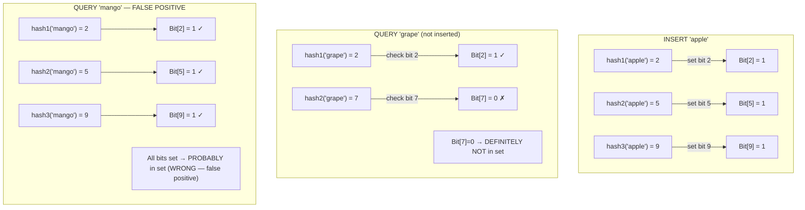
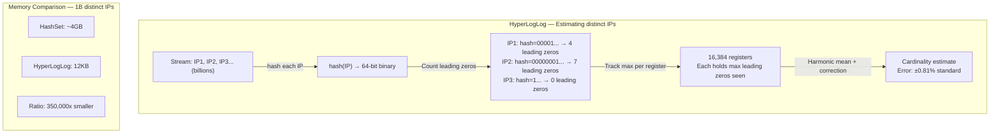
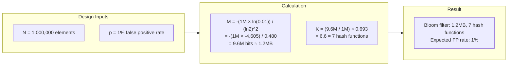
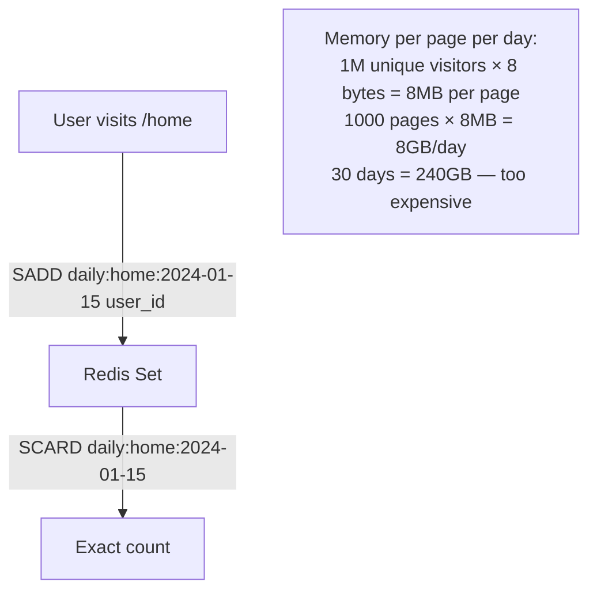
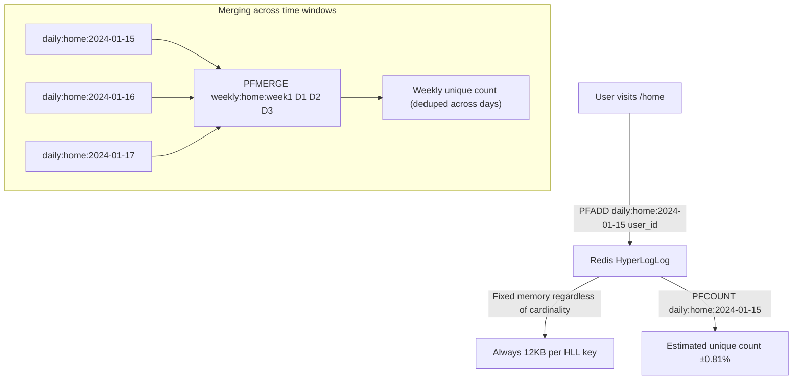
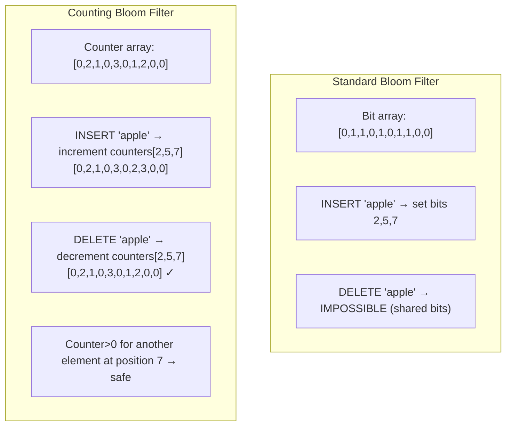
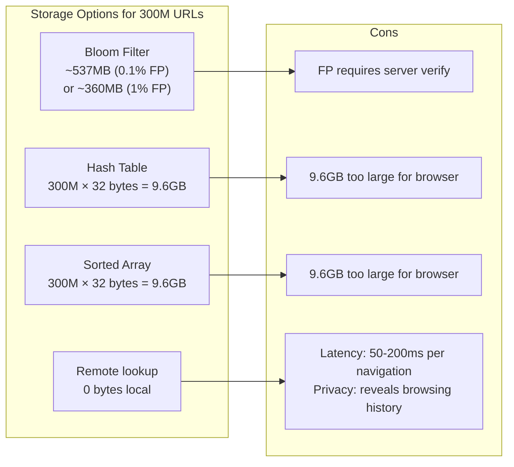

# Bloom Filters & HyperLogLog

6 questions covering probabilistic data structures from fundamentals to Staff-level production applications.

---

## Q1: What is a Bloom filter and what are its false positive/negative guarantees?

**Role:** Mid, Backend | **Difficulty:** 🟡 | **Priority:** P0 | **Format:** Quick Answer

> **What the interviewer is testing:** Whether you understand the probabilistic trade-off of Bloom filters and can state precisely what guarantees they provide.

### Answer in 60 seconds
- **Definition:** A Bloom filter is a space-efficient probabilistic data structure that tests set membership. Uses a bit array of size M and K independent hash functions.
- **Inserting:** Hash the element with all K hash functions → set K bits to 1.
- **Querying:** Hash the element → if *all* K bits are 1 → "probably in set". If *any* bit is 0 → "definitely not in set".
- **False positives:** Possible — a new element may collide with bits set by other elements → incorrectly reports "in set". Tunable via M and K.
- **False negatives:** Impossible — if an element was inserted, its K bits are always set. "Definitely not in set" is always correct.
- **Practical use:** Anywhere you want to avoid expensive lookups for elements that don't exist. Cache layer, DB prefix guard.

### Diagram



### Guarantees Table

| Property | Guarantee |
|----------|-----------|
| False negative | 0% — impossible by design |
| False positive | Tunable — typically 1% at recommended M/N ratio |
| Deletion | Not supported (standard Bloom filter) |
| Space | ~10 bits per element for 1% FP rate |
| Lookup time | O(K) — constant, independent of set size |

### Pitfalls
- ❌ **"Bloom filters can tell you an element is definitely in the set":** They can only say "probably in" or "definitely not in". There is always a configurable false positive rate.
- ❌ **"You can delete from a Bloom filter":** Standard Bloom filters don't support deletion — you'd need a Counting Bloom filter (see Q5).
- ❌ **Forgetting that FP rate grows as the filter fills:** If you insert more elements than designed for, the FP rate increases beyond target.

### Concept Reference

---

## Q2: What is HyperLogLog and how does it estimate cardinality with 1.6% error using <1KB?

**Role:** Mid, Backend | **Difficulty:** 🟡 | **Priority:** P0 | **Format:** Quick Answer

> **What the interviewer is testing:** Whether you understand how HyperLogLog uses probabilistic counting to estimate cardinality at a tiny fraction of the memory a HashSet would require.

### Answer in 60 seconds
- **Problem HyperLogLog solves:** Count distinct elements in a stream without storing all elements. A HashSet for 1B unique IP addresses needs ~4GB (8 bytes per entry × 500M entries). HyperLogLog uses <1.5KB for the same estimate.
- **Core idea:** Hash each element and observe the maximum number of leading zeros in any hash. More leading zeros → more elements likely seen (probability reasoning).
- **Multiple registers:** Split into 2^B sub-streams (registers). HyperLogLog++ uses 2^14 = 16,384 registers. Each register tracks the max leading zeros seen in its sub-stream.
- **Estimation:** Combine register values using harmonic mean with bias correction → cardinality estimate.
- **Error rate:** ±1.04/√(2^B). With B=14: ±1.04/128 ≈ 0.81% standard error. Practical p99 error: ~1.6%.
- **Redis HyperLogLog:** 12KB per HLL structure (uses 16,384 registers), consistent 0.81% standard error, max cardinality ~2^64.

### Diagram



### Memory vs Error Trade-off

| Registers (2^B) | Memory | Standard Error | Use Case |
|----------------|--------|---------------|----------|
| 2^10 = 1,024 | ~1KB | 3.25% | Low precision |
| 2^12 = 4,096 | ~3KB | 1.63% | General use |
| 2^14 = 16,384 | 12KB | 0.81% | High precision (Redis default) |
| HashSet (exact) | ~4GB (1B elements) | 0% | Small N only |

### Pitfalls
- ❌ **"HyperLogLog counts exactly":** It's an estimate with ~0.81% standard error. For exact counting at small N (<1M), use a HashSet.
- ❌ **"The error rate is always 1.6%":** 1.6% is the p99 error. The standard error is 0.81%. It can be higher for very small cardinalities (<100 elements).
- ❌ **Confusing HyperLogLog with Bloom filter:** HLL counts how many distinct elements; Bloom filter checks if a specific element was seen. Different problems.

### Concept Reference

---

## Q3: How do you choose Bloom filter size given error rate and element count?

**Role:** Senior | **Difficulty:** 🔴 | **Priority:** P1 | **Format:** Quick Answer

> **What the interviewer is testing:** Whether you can derive or recall the sizing formula and reason about the memory vs accuracy trade-off in a production context.

### Answer in 60 seconds
- **Formula for bit array size M:**
  `M = −(N × ln(p)) / (ln(2))^2`
  Where N = expected element count, p = desired false positive rate.
- **Formula for optimal hash function count K:**
  `K = (M/N) × ln(2)`
- **Rule of thumb:** For 1% FP rate, use ~10 bits per element. For 0.1% FP rate, use ~15 bits per element.
- **Example — Chrome Safe Browsing (300M URLs, 0.1% FP):**
  M = −(300M × ln(0.001)) / (ln(2))^2 = −(300M × −6.9) / 0.48 = **4.3 billion bits ≈ 537MB**
  K = (4.3B / 300M) × 0.693 = **10 hash functions**
- **Practical target:** Most systems use 1% FP rate for cache guards — 10 bits/element is the sweet spot.

### Sizing Reference Table



| N (elements) | p (FP rate) | M (bits) | M (bytes) | K (hashes) |
|-------------|------------|---------|-----------|-----------|
| 1M | 1% | 9.6M | 1.2MB | 7 |
| 10M | 1% | 96M | 12MB | 7 |
| 100M | 1% | 960M | 120MB | 7 |
| 1M | 0.1% | 14.4M | 1.8MB | 10 |
| 1B | 0.1% | 14.4B | 1.8GB | 10 |

### Pitfalls
- ❌ **"More hash functions always improves accuracy":** There is an optimal K. Too many hash functions fills the bit array faster, increasing FP rate.
- ❌ **Not accounting for growth:** Size the filter for 2x your expected N — Bloom filters can't be resized without rebuilding. A Scalable Bloom Filter chains multiple filters to handle growth.

### Concept Reference

---

## Q4: How does Redis use HyperLogLog for counting unique visitors at 1B+ scale?

**Role:** Senior | **Difficulty:** 🔴 | **Priority:** P1 | **Format:** Deep Dive

> **What the interviewer is testing:** Whether you understand Redis HyperLogLog's API, memory model, and how to apply it to a real-world cardinality problem.

### Problem Constraints
| Dimension | Value |
|-----------|-------|
| Scale | 1B daily active users, 10B page views/day |
| Goal | Count unique visitors per page per day |
| Memory constraint | Cannot store all user IDs per page |
| Accuracy requirement | ±2% acceptable |
| Redis throughput | 100K commands/sec per node |

### Approach A — Naive Set-based Counting (fails at scale)



### Approach B — HyperLogLog (production choice)



| Dimension | Redis Set | Redis HyperLogLog |
|-----------|-----------|-------------------|
| Memory per 1M unique visitors | 8MB | 12KB (650x smaller) |
| 1000 pages × 30 days | 240GB | 360MB |
| Accuracy | 100% exact | ±0.81% standard error |
| PFADD time complexity | O(1) | O(1) |
| PFMERGE (union) | O(N) elements | O(K) registers |
| Supported operations | Union, intersection | Union only |

### Recommended Answer
Use `PFADD key user_id` on every page view. Query with `PFCOUNT key`. For weekly unique visitors, `PFMERGE weekly:page D1 D2 D3 D4 D5 D6 D7`. Memory: 12KB per key regardless of cardinality — 1000 pages × 30 days = 30,000 keys × 12KB = 360MB total, vs 240GB with Redis Sets.

### What a great answer includes
- [ ] State Redis HyperLogLog uses 12KB per key at all cardinalities
- [ ] Mention PFADD, PFCOUNT, PFMERGE commands
- [ ] Calculate memory savings (360MB vs 240GB)
- [ ] Note that PFMERGE gives union cardinality (unique across multiple time windows)
- [ ] State 0.81% standard error rate

### Pitfalls
- ❌ **"HyperLogLog supports intersection":** PFMERGE only supports union. Estimating intersection requires inclusion-exclusion with multiple PFCOUNTs — with compounded error.
- ❌ **Using HLL when exact counts are required:** For billing or legal compliance, use exact counting (Redis Set with expiry, or a dedicated counting database).

### Concept Reference

---

## Q5: What is a Counting Bloom filter and when does it fix standard Bloom filter limits?

**Role:** Senior | **Difficulty:** 🔴 | **Priority:** P1 | **Format:** Quick Answer

> **What the interviewer is testing:** Whether you know the standard Bloom filter's inability to support deletion and how Counting Bloom filters solve it at the cost of increased memory.

### Answer in 60 seconds
- **Problem with standard Bloom filter:** Bits can only be set to 1, never reset to 0. Two elements may share a bit — clearing it for one element would break membership testing for the other. **Deletion is impossible.**
- **Counting Bloom filter (CBF):** Replace each bit with a small counter (typically 4-bit integer). Insert = increment K counters. Delete = decrement K counters. Membership = all K counters > 0.
- **Memory cost:** 4x more memory (4 bits per slot vs 1 bit). For 1M elements, 1% FP: standard = 1.2MB, CBF = 4.8MB.
- **Counter overflow:** With 4-bit counters, max count = 15. If an element is inserted 16+ times, counter saturates and deletion breaks correctness. Solution: use 8-bit counters for high-frequency elements.
- **Use cases:** CDN cache invalidation (need to remove expired URLs), rate limiting (need to remove expired tokens), network middleboxes tracking active connections.

### Diagram



| Feature | Standard Bloom Filter | Counting Bloom Filter |
|---------|----------------------|----------------------|
| Deletion | Not supported | Supported |
| Memory (1M elements, 1% FP) | 1.2MB | 4.8MB (4x) |
| False positive rate | Same at same fill | Same at same fill |
| False negative | Impossible | Possible if counter underflows |
| Counter overflow risk | N/A | Yes (use 8-bit for high frequency) |

### Pitfalls
- ❌ **"CBF guarantees no false negatives":** Counter underflow (incorrect decrement of a non-inserted element) can cause false negatives. Protect delete operations.
- ❌ **Choosing CBF by default:** If you don't need deletion, standard Bloom filter is 4x more memory-efficient. Use CBF only when deletion is required.

### Concept Reference

---

## Q6: How does Chrome use a Bloom filter for Safe Browsing (1B+ malicious URLs)?

**Role:** Staff | **Difficulty:** ⚫ | **Priority:** P2 | **Format:** Deep Dive

> **What the interviewer is testing:** Whether you can analyze a real-world Bloom filter deployment — its sizing decisions, false positive handling, and why a Bloom filter is better than alternatives at this scale.

### Problem Constraints
| Dimension | Value |
|-----------|-------|
| Malicious URL database | ~300M entries (2024) |
| Client constraint | Must run in browser — no server roundtrip for every URL |
| False positive budget | ~1% (acceptable: sends to server for verification) |
| False negative budget | 0% — missing a malicious URL is a security failure |
| Download size | Must be < 100MB for browser download |
| Update frequency | Multiple times per day |

### Architecture

```mermaid
graph TD
  User[User navigates to URL] -->|Every navigation| Chrome[Chrome Browser]
  Chrome -->|hash(URL)| Local["Local Bloom Filter<br/>~100MB on disk<br/>300M URLs, 1% FP rate"]
  Local -->|MISS → definitely safe| Allow["Allow navigation"]
  Local -->|HIT → probably malicious| Server["Google Safe Browsing API<br/>Exact lookup"]
  Server -->|Confirmed malicious| Block["Block + Warning page"]
  Server -->|False positive| Allow2["Allow navigation"]
  subgraph Update["Background Update"]
    Delta["Delta update (new URLs only)<br/>Size: 1-10MB per update<br/>Frequency: Every 30 minutes"]
    Delta -->|Rebuild or patch| Local
  end
```

### Why Bloom Filter (not Hash Table, not Binary Search)?



| Option | Local storage | Privacy | Latency | FP rate |
|--------|-------------|---------|---------|---------|
| Bloom filter (1% FP) | ~360MB | Full (no server) | 0ms | 1% → server verify |
| Full hash table | ~9.6GB | Full | 0ms | 0% |
| Remote lookup | 0MB | None (server sees URLs) | 50–200ms | 0% |
| Bloom filter (0.1% FP) | ~537MB | Full | 0ms | 0.1% → server verify |

### Recommended Answer
Chrome downloads a ~100MB Bloom filter locally (uses hash prefix compression, not raw URLs). Every URL navigated is checked locally in ~1ms. False positive rate ≈ 1% triggers a server-side exact lookup (verifying a 32-byte hash prefix, not the full URL — for privacy). False negatives are impossible by design — a malicious URL always sets all K bits during filter construction. The 1% FP budget is acceptable because: (1) server verification is fast (50ms, happens in background), (2) the alternative (no local filter) sends every single URL to Google — a massive privacy violation.

### What a great answer includes
- [ ] State that false negatives are impossible — the security guarantee
- [ ] Explain why remote-only lookup is unacceptable (privacy + latency)
- [ ] Calculate filter size: 300M × 10 bits/element = 3B bits ≈ 375MB
- [ ] Explain the two-level architecture: local Bloom → server verify on FP
- [ ] Mention delta updates (not full re-download) for efficiency

### Pitfalls
- ❌ **"1% FP means 1% of safe sites are blocked":** FP sends to server for verification — safe sites are not blocked, just incur a 50ms server roundtrip. The user experience impact is minimal.
- ❌ **Sending full URLs to server for verification:** Chrome sends only a 32-byte hash prefix — not the full URL — to protect user privacy while still enabling exact matching.

### Concept Reference
