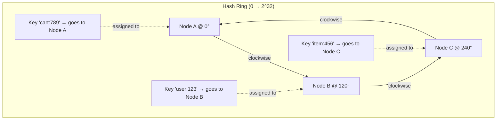
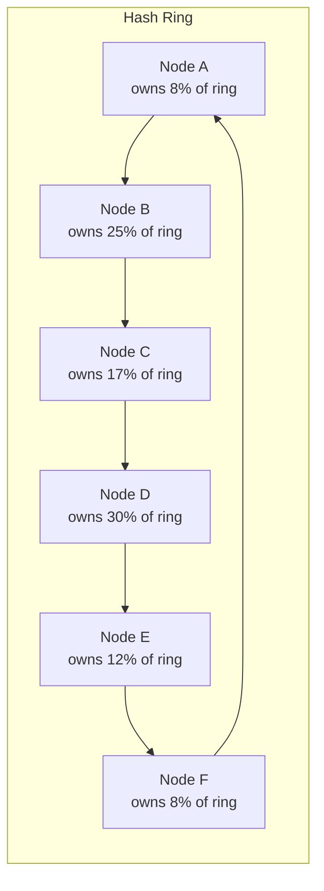
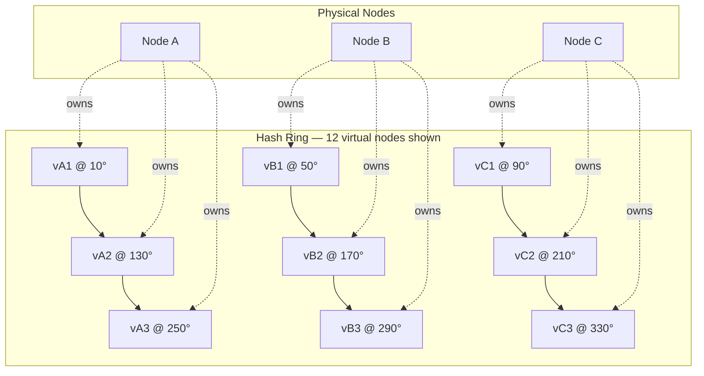
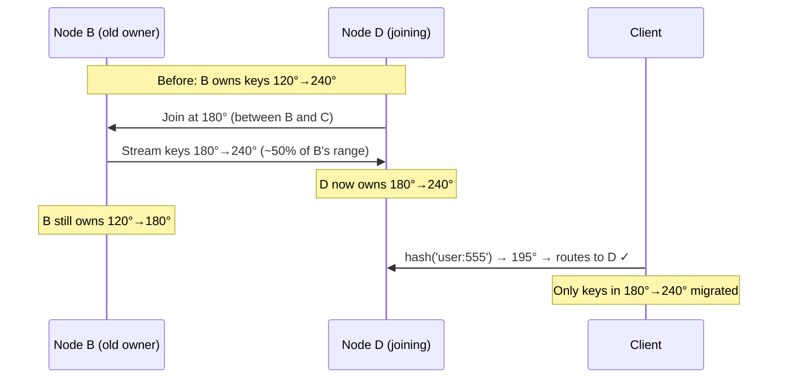
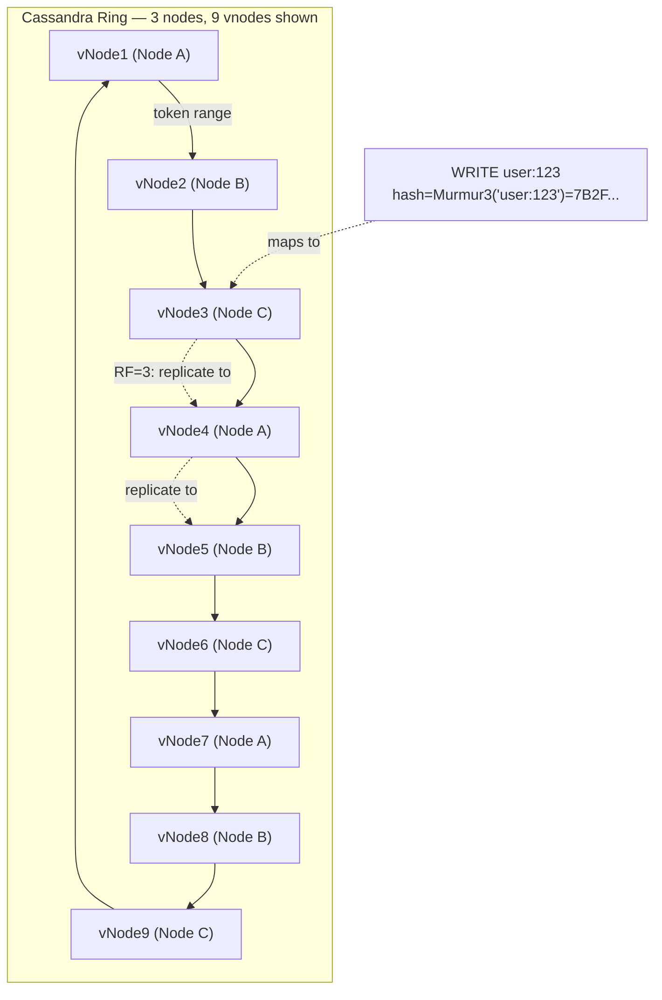
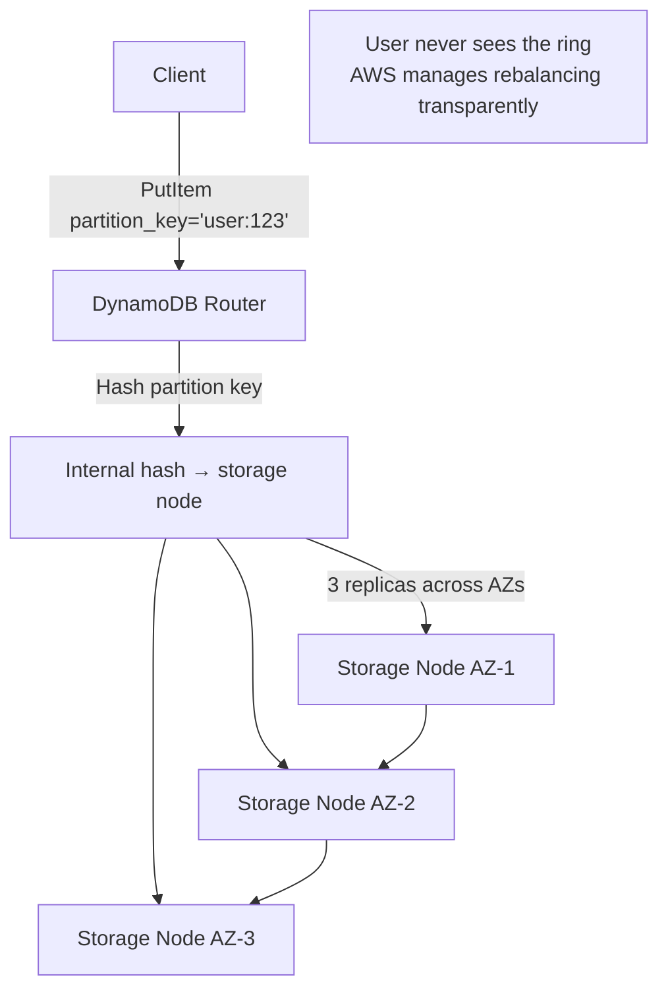
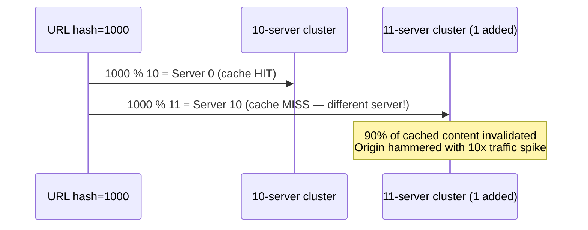

# Consistent Hashing

5 questions covering consistent hashing from fundamentals to Staff-level CDN and database applications.

---

## Q1: What is consistent hashing and what problem does it solve vs modulo hashing?

**Role:** Mid, Backend | **Difficulty:** 🟡 | **Priority:** P0 | **Format:** Quick Answer

> **What the interviewer is testing:** Whether you understand why naive modulo hashing breaks down when nodes are added or removed, and how consistent hashing solves the remapping problem.

### Answer in 60 seconds
- **Modulo hashing:** `node = hash(key) % N`. Simple, but when N changes (node added/removed), almost every key remaps to a new node. With 10 nodes, removing 1 causes ~90% of keys to move — catastrophic for cache systems.
- **Consistent hashing:** Map both keys and nodes onto a fixed ring (0 to 2^32−1). A key is assigned to the first node clockwise from its hash position. When a node is added/removed, only ~1/N of keys migrate on average.
- **Scale impact:** Adding 1 node to a 10-node cluster migrates ~10% of keys (not 90%). At 1M cache entries, that's 100K misses vs 900K misses.
- **Real usage:** Cassandra, DynamoDB, Riak, Memcached (ketama), Akamai CDN, Redis Cluster.
- **Ring size:** Typically 2^32 slots (4 billion positions), giving fine-grained placement.

### Diagram



### Modulo vs Consistent Comparison

| Dimension | Modulo hash(key) % N | Consistent Hashing |
|-----------|----------------------|--------------------|
| Keys remapped on node add | ~(N−1)/N ≈ 90% (10 nodes) | ~1/N ≈ 10% |
| Keys remapped on node remove | ~(N−1)/N ≈ 90% | ~1/N ≈ 10% |
| Cache miss storm on node change | Catastrophic | Minimal |
| Implementation complexity | Trivial | Moderate |
| Load distribution | Perfectly even | Uneven without vnodes |

### Pitfalls
- ❌ **"Consistent hashing distributes load evenly":** Without virtual nodes, load is highly uneven — a node placed between two others owns a large arc.
- ❌ **"Modulo is fine if nodes never change":** Cloud environments have frequent scaling events and node failures. Assume nodes change.
- ❌ **Forgetting replication:** In practice, a key is assigned to the next N nodes clockwise (replication factor RF=3), not just one.

### Concept Reference

---

## Q2: How do virtual nodes (vnodes) solve the hot spot problem in consistent hashing?

**Role:** Senior | **Difficulty:** 🔴 | **Priority:** P0 | **Format:** Deep Dive

> **What the interviewer is testing:** Whether you understand that raw consistent hashing has uneven load, and that vnodes are the standard production fix.

### Problem Constraints
| Dimension | Value |
|-----------|-------|
| Cluster | 6 physical nodes |
| Without vnodes | Each node owns ~1/6 of the ring but actual arcs vary ±40% |
| With vnodes | Each node owns 128–256 virtual positions; deviation < 5% |
| Cassandra default | 256 vnodes per node (`num_tokens: 256`) |

### Approach A — Raw Consistent Hashing (no vnodes)



Problem: Node D holds 30% of data while Node A holds only 8%. Node D is a hot spot — 3.75x the writes.

### Approach B — Virtual Nodes (vnodes)



| Dimension | Without vnodes | With 256 vnodes/node |
|-----------|---------------|----------------------|
| Load deviation | ±40% | < 5% |
| Node addition (data migration) | Move 1 contiguous arc | Move 256 small arcs (smoother) |
| Failure redistribution | All load to 1 neighbor | Spread across all nodes |
| Bootstrap time for new node | Fast (1 transfer) | Slower (256 small transfers) |

### Recommended Answer
Virtual nodes assign each physical node multiple positions on the ring — Cassandra uses 256 by default. With 6 nodes × 256 vnodes = 1536 ring positions interleaved, load variance drops below 5% vs ±40% with raw consistent hashing. The secondary benefit: when a node fails, its 256 vnodes scatter load across all remaining nodes instead of dumping everything on one neighbor.

### What a great answer includes
- [ ] State that without vnodes, ring arc size is random and highly uneven
- [ ] Give Cassandra's default: 256 vnodes per node (`num_tokens`)
- [ ] Explain that failure load is spread, not concentrated, with vnodes
- [ ] Mention the trade-off: more complex membership tracking (1536 entries instead of 6)

### Pitfalls
- ❌ **"More vnodes = always better":** Too many vnodes (>512) increases gossip protocol overhead — Cassandra's ring state requires O(vnodes × nodes) gossip messages.
- ❌ **Ignoring heterogeneous nodes:** With vnodes, a node with 2x memory should get 2x vnodes — otherwise it's underutilized while smaller nodes are overloaded.

### Concept Reference

---

## Q3: How does consistent hashing enable adding/removing nodes with minimal key migration?

**Role:** Senior | **Difficulty:** 🔴 | **Priority:** P1 | **Format:** Quick Answer

> **What the interviewer is testing:** Whether you can explain exactly which keys migrate and how rebalancing works without full cluster disruption.

### Answer in 60 seconds
- **Adding a node:** New node joins the ring at position X. Only keys between the new node's predecessor and X are reassigned to the new node. All other keys stay untouched. Migration: ~1/N of total keys.
- **Removing a node:** Node at position X leaves. Its keys transfer to the next node clockwise. Only X's keys move. Migration: ~1/N of total keys.
- **With RF=3 (Cassandra):** A key is stored on 3 consecutive nodes. Adding a node affects the key ranges of up to 3 neighboring nodes — but still only ~3/N of keys total.
- **Real numbers (10-node cluster, 10M keys):** Modulo hash moves ~9M keys on node add; consistent hashing moves ~1M keys. Cache miss rate during rebalance: 10% vs 90%.
- **Streaming rebalance:** Cassandra streams data between nodes at ~100 MB/s. 1M keys × 1KB avg = 1GB takes ~10 seconds vs 9GB = ~90 seconds with modulo.

### Diagram



### Key Migration Formula

| Scenario | Modulo hashing | Consistent hashing |
|----------|---------------|-------------------|
| Add 1 node to N-node cluster | (N−1)/N keys move | 1/N keys move |
| Remove 1 node from N-node cluster | (N−1)/N keys move | 1/N keys move |
| 10-node cluster, 10M keys | ~9M migrate | ~1M migrate |
| Cache miss window (100 MB/s rebalance) | ~90 seconds | ~10 seconds |

### Pitfalls
- ❌ **"Zero migration during node changes":** Consistent hashing minimizes migration, it doesn't eliminate it. Some keys always move.
- ❌ **Ignoring replication during migration:** With RF=3, adding a node requires copying data from up to 3 neighbors simultaneously — plan for network bandwidth spike.

### Concept Reference

---

## Q4: How do Cassandra and DynamoDB implement consistent hashing with vnodes?

**Role:** Senior | **Difficulty:** 🔴 | **Priority:** P1 | **Format:** Deep Dive

> **What the interviewer is testing:** Whether you know how two major NoSQL databases differ in their consistent hashing implementation — token assignment vs partition key design.

### Problem Constraints
| Dimension | Cassandra | DynamoDB |
|-----------|-----------|----------|
| Ring approach | Vnodes (256 per node default) | Consistent hashing managed by AWS |
| Partition key hashing | Murmur3 | Internal (not published) |
| Replication factor | Configurable RF (typically 3) | Always 3 replicas |
| Token assignment | Manual or automatic (`num_tokens`) | Fully managed — no user config |
| Rebalancing | Streams between nodes | Automatic, transparent |

### Cassandra Implementation



### DynamoDB Implementation



| Dimension | Cassandra | DynamoDB |
|-----------|-----------|----------|
| Vnode visibility | Operator sees token ranges | Hidden — managed by AWS |
| Hot partition detection | Manual (`nodetool tpstats`) | CloudWatch `ConsumedCapacity` |
| Rebalancing trigger | Node add/remove, repair | Automatic, continuous |
| Partition key design impact | High — bad key = hot vnode | High — bad key = throttling |
| Operations burden | High | Near zero |

### Recommended Answer
Cassandra exposes the ring — operators see token ranges, can adjust vnode counts, and run `nodetool status` to see load per node. DynamoDB hides the ring entirely — AWS manages sharding and rebalancing transparently. The critical shared principle: **the partition key design matters enormously in both**. In Cassandra, a hot partition key overloads specific vnodes. In DynamoDB, a hot partition key triggers `ProvisionedThroughputExceededException` — DynamoDB's throughput limit is 3,000 RCU and 1,000 WCU per partition (10GB storage limit per partition).

### What a great answer includes
- [ ] Cassandra uses Murmur3 hash for token assignment
- [ ] Cassandra's `num_tokens` (default 256) controls vnode count
- [ ] DynamoDB's partition limit: 3,000 RCU, 1,000 WCU, 10GB
- [ ] Both systems suffer from hot partition problems with sequential keys (timestamps as partition keys)
- [ ] Solution: add random suffix or bucket prefix to distribute hot keys

### Pitfalls
- ❌ **Using timestamps as DynamoDB partition keys:** All writes land on the same partition — 100% of traffic to one shard. Use `user_id` or add random salt prefix.
- ❌ **Confusing Cassandra partitions with vnodes:** One vnode owns a token range, which holds many partition keys. A single partition key with many clustering keys is a wide partition problem.

### Concept Reference

---

## Q5: How does Akamai use consistent hashing to assign URLs to CDN cache servers?

**Role:** Staff | **Difficulty:** ⚫ | **Priority:** P2 | **Format:** Deep Dive

> **What the interviewer is testing:** Whether you can apply consistent hashing in a CDN context — where cache hit rate, server capacity, and geographic distribution matter.

### Problem Constraints
| Dimension | Value |
|-----------|-------|
| Akamai scale | 300,000+ servers, 4,000+ PoPs globally |
| URL space | Billions of unique URLs per day |
| Cache hit rate target | > 90% globally |
| Server addition frequency | Hundreds per month (auto-scaling) |
| Key insight | Adding a server must not invalidate most of the cache |

### Approach — URL-to-Server Consistent Hashing

```mermaid
graph TD
  Client[User in NYC] -->|Request: cdn.example.com/video.mp4| DNS[Akamai DNS]
  DNS -->|Anycast routing| PoP[NYC PoP - 500 servers]
  PoP -->|hash(URL) → ring position| Ring[Consistent Hash Ring<br/>500 server positions + vnodes]
  Ring -->|Assign to Server #47| S47[Cache Server #47]
  S47 -->|Cache HIT| Client
  S47 -->|Cache MISS → fetch origin| Origin[Origin Server]
  Origin -->|Response cached on S47| S47
  Note1["Same URL always → Server #47<br/>Cache hit rate: 92%"]
```

### Why Not Modulo for CDN?



| Dimension | Modulo hashing | Consistent hashing |
|-----------|---------------|-------------------|
| Cache invalidation on server add | 90% of URLs remap | ~10% of URLs remap |
| Origin traffic spike on node add | 10x normal | ~1.1x normal |
| Cache hit rate stability | Drops from 92% → 20% transiently | Stays at ~83% transiently |
| Recovery time | 30–60 min (cache warm) | 5–10 min |

### Recommended Answer
Akamai hashes the URL (or URL + path, stripping query params) to a position on the ring. Each PoP runs its own local ring with the servers in that PoP. The same URL always maps to the same server, achieving >90% cache hit rate. When a server is added (auto-scaling during peak), only the 1/N URLs that map to that server's ring range experience cache misses — the origin sees a 10% traffic increase rather than 10x. Akamai also uses **weighted vnodes** — servers with 2x disk capacity get 2x vnodes and handle 2x the URL space proportionally.

### What a great answer includes
- [ ] Explain why cache coherence requires the same URL to always go to the same server
- [ ] Quantify the origin traffic spike with modulo vs consistent hashing (10x vs 1.1x)
- [ ] Mention weighted vnodes for heterogeneous server capacity
- [ ] Note that consistent hashing happens at the PoP level — geographic routing (DNS anycast) happens first

### Pitfalls
- ❌ **"Consistent hashing alone achieves 90% CDN hit rate":** Cache hit rate also depends on content TTL, cache size, content popularity distribution (Zipf). Consistent hashing prevents *unnecessary* cache misses from remapping.
- ❌ **Including query parameters in the hash key:** `video.mp4?token=abc123` and `video.mp4?token=xyz456` should map to the same cache entry — strip auth tokens from the cache key.

### Concept Reference
