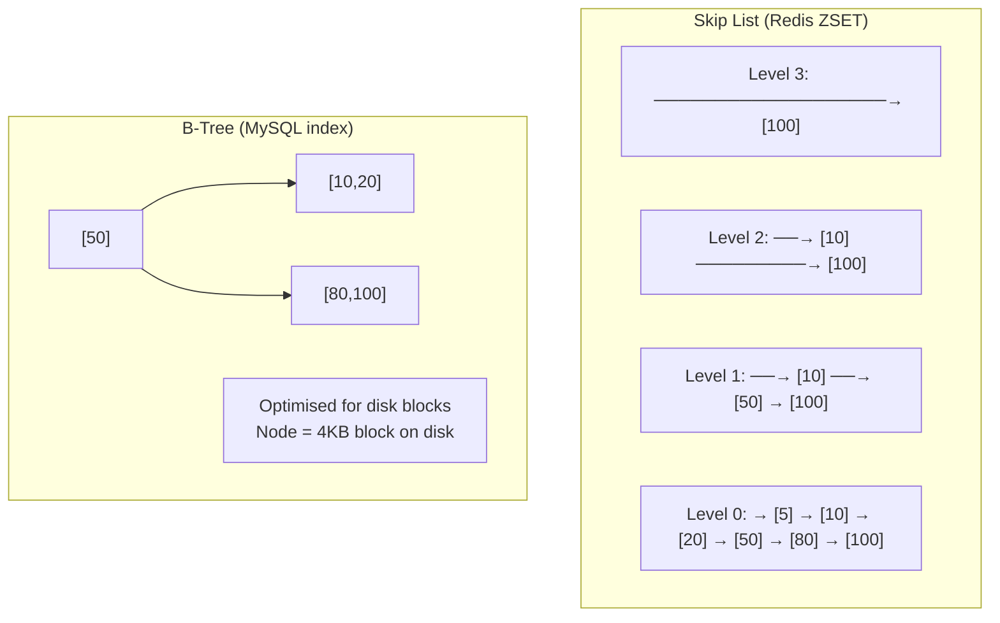
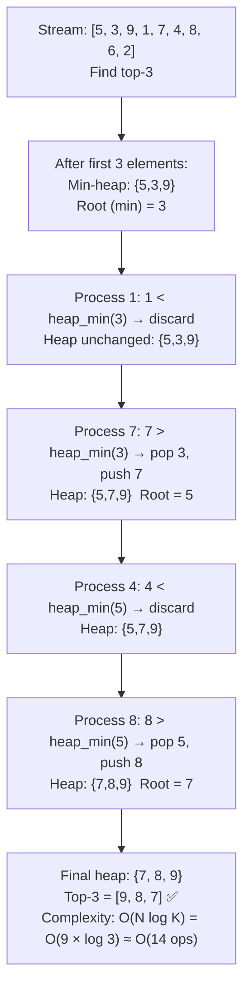
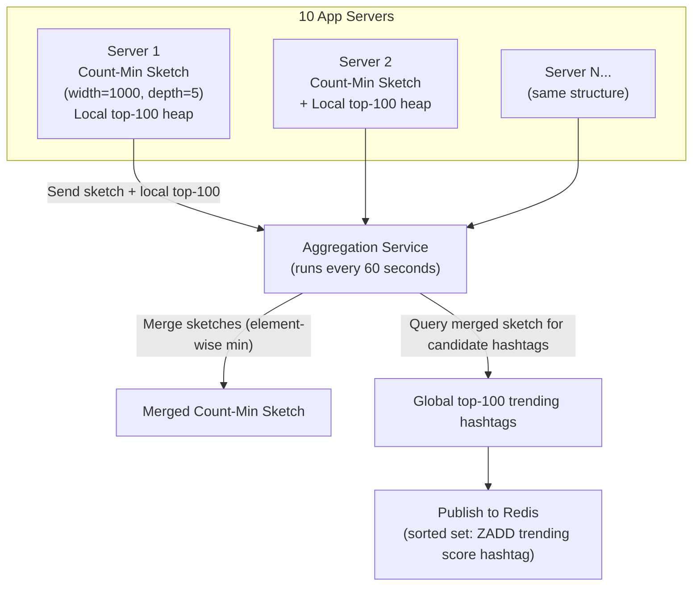
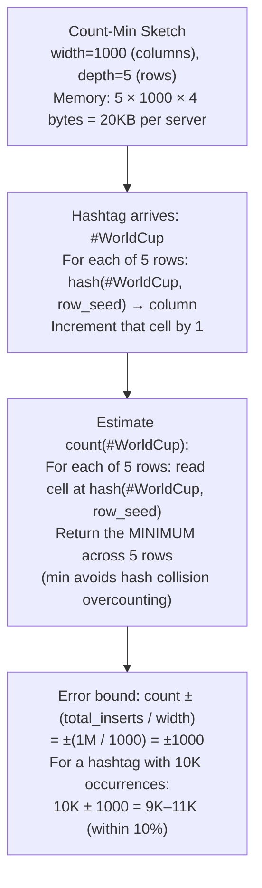
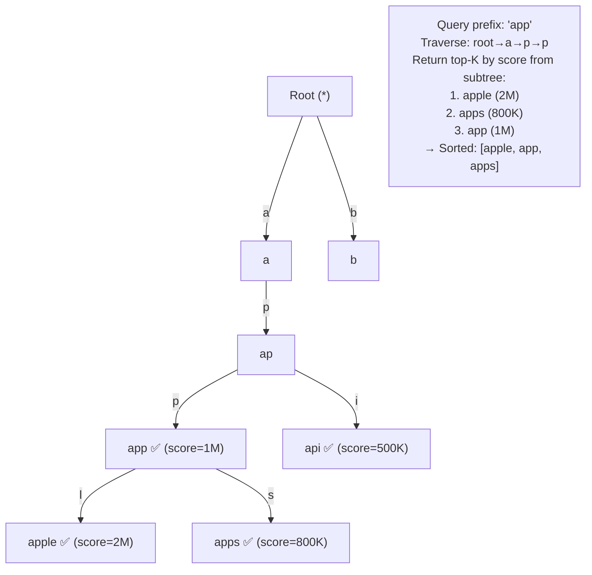
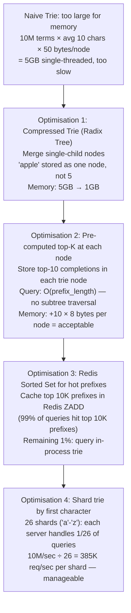
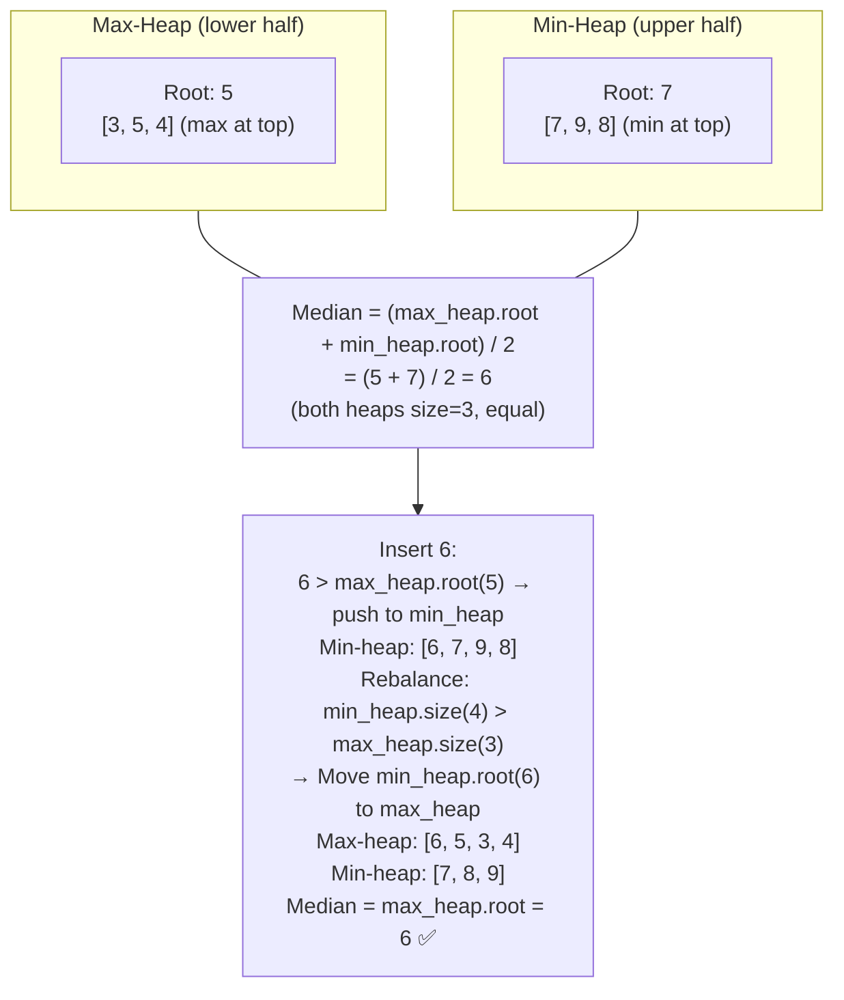
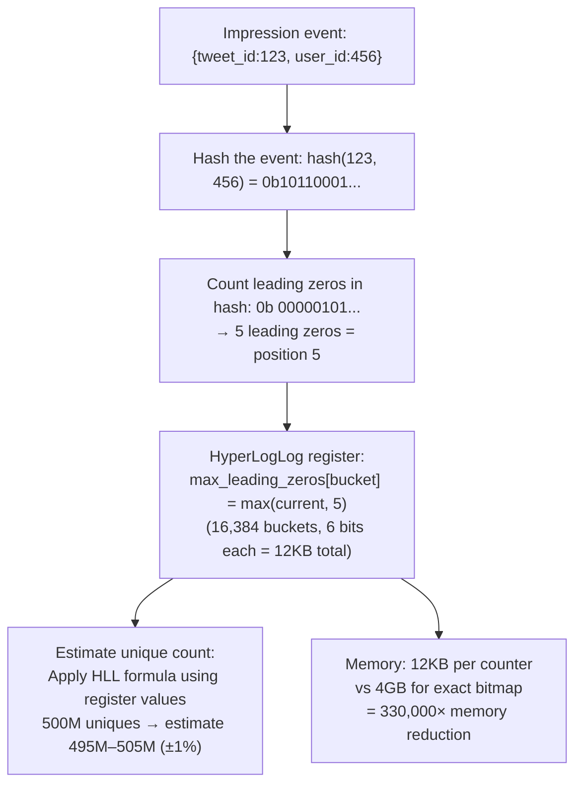
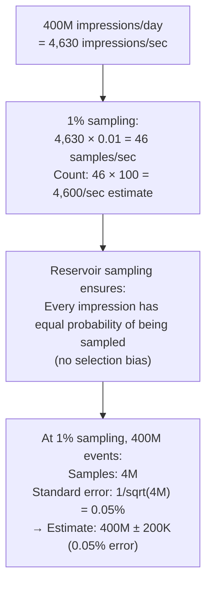
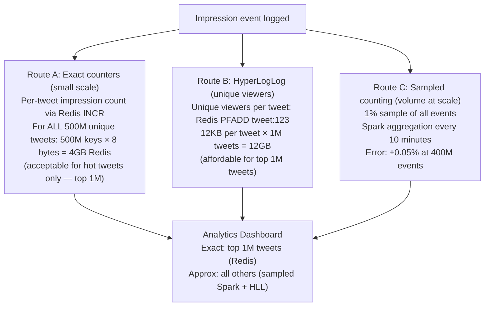

# Data Structures at Scale

6 questions covering data structures from skip lists to Twitter's HyperLogLog counting at 400M impressions/day.

---

## Q1: Why does Redis use a skip list for sorted sets instead of a B-tree?

**Role:** Mid | **Difficulty:** 🟡 | **Priority:** P0 | **Format:** Quick Answer

> **What the interviewer is testing:** Whether you understand the operational characteristics of skip lists vs B-trees and can articulate why skip lists are preferable for an in-memory ordered structure.

### Answer in 60 seconds
- **Skip list:** A probabilistic data structure with multiple levels of linked lists. Each level is a "skip" over nodes — allows O(log N) search, insert, and delete by skipping over non-matching nodes. Implementation: each node has a random number of forward pointers (height); higher levels cover more elements.
- **B-tree:** A balanced tree structure optimised for block I/O (disk pages). Each node contains K keys and K+1 child pointers, sized to fit in a disk block (typically 4KB). O(log N) operations but designed around disk access patterns.
- **Why skip list wins for in-memory sorted sets:**
  - **Simpler concurrent modification:** B-trees require complex rebalancing (rotations, splits) that are hard to make lock-free. Skip lists support lock-free or fine-grained locking more easily — critical for Redis's single-threaded but future multi-threaded plans.
  - **Range queries:** Skip list supports `ZRANGE` (get elements from rank A to rank B) in O(log N + K) — walk forward from the found node. B-tree range queries require in-order traversal, not significantly different.
  - **Memory efficiency:** Each skip list node is a variable-size array of pointers. No wasted space from half-full B-tree nodes (B-trees must stay ≥50% full).
  - **Predictable performance:** Skip lists have O(log N) expected performance for all operations with very low constant factors for in-memory use.
- **B-tree wins for:** Disk-based sorted structures (MySQL InnoDB indexes), systems where block-aligned access is critical.

### Diagram

### Pitfalls
- ❌ **"Skip list is always better than B-tree":** For disk-backed sorted indexes, B-trees are clearly superior — their node size matches disk page size (4KB), minimising I/O. Skip lists are better for in-memory use cases only.
- ❌ **Confusing skip list with hash table:** Redis ZSETs use BOTH a skip list (for ordered operations: ZRANGE, ZRANK) AND a hash table (for O(1) ZSCORE lookups by member). Both data structures coexist per ZSET.
- ❌ **Not knowing the complexity:** Skip list operations are O(log N) expected, not O(log N) worst-case. Worst case is O(N) with astronomically low probability. For practical purposes, treat as O(log N).

### Concept Reference
→ [Data Structures](../../../algorithms/concepts/data-structures-fundamentals)

---

## Q2: How does a min-heap solve the top-K problem?

**Role:** Mid | **Difficulty:** 🟡 | **Priority:** P0 | **Format:** Quick Answer

> **What the interviewer is testing:** Whether you understand the heap-based top-K algorithm and its O(N log K) complexity advantage over sorting the full dataset.

### Answer in 60 seconds
- **Problem:** Find the top K largest elements from a stream or list of N elements. Naive: sort all N elements → O(N log N). Heap-based: O(N log K) — significantly faster when K << N.
- **Algorithm with min-heap:**
  1. Insert the first K elements into a min-heap (smallest element at root).
  2. For each remaining element: if it's larger than the heap's minimum (root), pop the root and push the new element.
  3. At the end, the heap contains the top-K elements. The root is the Kth-largest.
- **Why min-heap, not max-heap:** Min-heap lets you quickly discard the smallest of the K candidates (pop the root — O(log K)). Max-heap would require O(K) to find the minimum.
- **Complexity:** N elements processed, each heap operation O(log K). Total: O(N log K). At N=1B and K=100: O(1B × log 100) ≈ O(7B) operations vs O(1B log 1B) ≈ O(30B) for full sort — 4× faster.
- **Distributed top-K:** Each shard computes its local top-K (using min-heap). A merge step combines the K results from each shard and takes the global top-K. Final merge: K×S elements into one top-K = O(K×S × log K) — very fast.

### Diagram

### Pitfalls
- ❌ **Using a max-heap for top-K:** With a max-heap, you'd sort all elements into the heap (O(N log N)), then pop K times. This is no better than sorting. The min-heap's key advantage is discarding non-candidates in O(log K) per element.
- ❌ **Forgetting distributed merge step:** In a distributed system, each shard computes its local top-K. You cannot take top-K from one shard — the globally top element might be on a different shard. Always merge.
- ❌ **Heap-based approach for streaming with frequency (not value):** Top-K by access frequency (trending items) is not solvable with a simple min-heap because items can be processed multiple times. Use SpaceSaving or Count-Min Sketch + heap instead (see Q6 in approximation-algorithms).

### Concept Reference
→ [Data Structures](../../../algorithms/concepts/data-structures-fundamentals)

---

## Q3: How do you count the top-100 trending hashtags in real time across 10 servers?

**Role:** Senior | **Difficulty:** 🔴 | **Priority:** P1 | **Format:** Deep Dive

> **What the interviewer is testing:** Whether you can design a distributed real-time frequency aggregation system that handles skewed data efficiently without centralised counting bottlenecks.

### Problem Constraints
| Dimension | Value |
|-----------|-------|
| Traffic | 1M tweets/min across 10 app servers |
| Hashtags | 50M unique hashtags |
| Requirement | Top 100 trending hashtags, updated every 60 seconds |
| Memory budget | 100MB per server |
| Accuracy | Approximate (99% precision acceptable) |

### Approach — Count-Min Sketch + Distributed Merge

### Count-Min Sketch for Frequency Estimation

### Recommended Answer
A Count-Min Sketch (CMS) is the right data structure for this problem — it provides frequency estimation for 50M unique items using O(width × depth) space, with error bounded by `total_events / width`.

**Per-server:** Each app server maintains a Count-Min Sketch (width=10,000, depth=7, memory=280KB) and a local top-100 min-heap. The heap tracks candidates: any hashtag seen 100+ times in the last 60-second window is a candidate. Every 60 seconds, the server freezes the sketch, sends it + local top-100 to the aggregation service, then starts a fresh sketch.

**Aggregation:** The aggregation service merges all 10 sketches by taking the element-wise minimum across corresponding cells (standard CMS merge). Queries all local top-100 candidates against the merged sketch to get global frequency estimates. Selects the global top-100 by frequency. Publishes to a Redis sorted set: `ZADD global:trending score hashtag`.

**Result:** Top-100 trending hashtags available globally within 60 seconds. Memory: 280KB per server vs 50M × ~20 bytes = 1GB if stored exactly. 3,500× memory reduction.

### What a great answer includes
- [ ] Count-Min Sketch: frequency estimation with bounded error and sub-linear memory
- [ ] Per-server local sketch + candidate heap reduces aggregation network traffic
- [ ] Merge strategy: element-wise minimum for combining sketches
- [ ] Two-phase: candidates from local top-100, frequencies from merged sketch
- [ ] Quantify memory: 280KB per server vs 1GB exact counting

### Pitfalls
- ❌ **Exact counter for 50M hashtags:** 50M × 8 bytes (int64) = 400MB per server, synchronised across 10 servers via Redis — creates a Redis ZADD bottleneck at 1M updates/min. CMS is the correct approach.
- ❌ **Not resetting sketches:** A Count-Min Sketch accumulates counts indefinitely. Without periodic reset (every 60s window), hashtags popular 6 months ago dominate the top-100 forever. Always reset per time window.
- ❌ **Sending full sketches to aggregator every second:** A CMS with width=10,000 × depth=7 × 4 bytes = 280KB per snapshot. At 10 servers × 1 snapshot/sec = 2.8MB/sec. Acceptable at 60-second aggregation; too much at 1-second.

### Concept Reference
→ [Data Structures](../../../algorithms/concepts/data-structures-fundamentals)

---

## Q4: How do you design autocomplete at 10M prefix queries/sec using a trie?

**Role:** Senior | **Difficulty:** 🔴 | **Priority:** P1 | **Format:** Deep Dive

> **What the interviewer is testing:** Whether you can design a production trie-based autocomplete that handles high throughput, hot prefixes, and memory constraints.

### Problem Constraints
| Dimension | Value |
|-----------|-------|
| Query rate | 10M prefix queries/sec |
| Vocabulary | 10M unique terms |
| Response time | p99 < 50ms |
| Suggestion count | Top 10 completions per prefix |
| Memory budget | 10GB across 10 servers |

### Trie Structure for Autocomplete

### Optimisations for 10M req/sec

### Recommended Answer
For 10M queries/sec, a pure in-process trie is insufficient without optimisation. Strategy:

**1. Compressed trie (radix tree):** Merge single-child nodes. "apple" becomes one node, not 5. Memory reduction: 5× for typical English vocabulary. Store pre-computed top-10 completions at every node — eliminates subtree traversal on query (O(prefix_length) instead of O(subtree_size)).

**2. Redis sorted set for hot prefix cache:** 99% of queries hit the same popular prefixes ("the", "app", "new"). Cache the top 50K prefixes in Redis ZSETs: `ZREVRANGE prefix:app 0 9 WITHSCORES`. Query Redis first — 0.5ms response. Miss falls through to in-process trie.

**3. Sharding:** Shard by first character(s). 10 servers × 1M req/sec each handles the full load. Prefix routing: API gateway extracts first character and routes to the appropriate trie shard.

**4. Trie updates:** New terms and score updates (based on user selection frequency) happen in a background batch job every 5 minutes — no real-time trie modification. Write-through to the serialised trie snapshot on S3 for restart recovery.

### What a great answer includes
- [ ] Compressed trie (radix tree) to reduce memory 5×
- [ ] Pre-computed top-K at each node to avoid subtree traversal
- [ ] Redis cache layer for the hot prefix working set (top 50K prefixes)
- [ ] Shard by first character for horizontal scaling
- [ ] Background batch updates (not real-time trie modification)

### Pitfalls
- ❌ **Real-time trie modification:** Modifying a trie under query load requires locks or immutable data structure techniques. Batch updates with periodic snapshot swap are far simpler and sufficient.
- ❌ **No prefix caching:** At 10M req/sec, the top 100 prefixes receive millions of queries each. Trie traversal at 1ms each = 1M req/sec per core saturated. Redis cache for hot prefixes is mandatory.
- ❌ **Full trie in a single process:** 10M terms × 50 bytes/node (compressed trie) = 500MB — fits. But 10M req/sec against a single process = Python GIL or Node.js event loop saturation. Shard.

### Concept Reference
→ [Data Structures](../../../algorithms/concepts/data-structures-fundamentals)

---

## Q5: How do you find the median of a stream using two heaps?

**Role:** Senior | **Difficulty:** 🔴 | **Priority:** P1 | **Format:** Quick Answer

> **What the interviewer is testing:** Whether you know the classic two-heap median-of-stream algorithm and can reason about its invariants and edge cases.

### Answer in 60 seconds
- **Problem:** Numbers arrive in a stream one at a time. After each number, return the current median. Constraints: cannot store all numbers (unbounded stream). O(log N) per insertion, O(1) for median query.
- **Two-heap approach:**
  - **Max-heap (lower half):** Stores the bottom half of the numbers. Root = the largest of the lower half.
  - **Min-heap (upper half):** Stores the upper half of the numbers. Root = the smallest of the upper half.
  - **Invariant:** Max-heap size = min-heap size (even count) or max-heap size = min-heap size + 1 (odd count).
  - **Median:** If sizes equal: median = (max_heap.root + min_heap.root) / 2. If max-heap has 1 more: median = max_heap.root.
- **Insertion algorithm:**
  1. If new number ≤ max_heap.root (or max_heap is empty): push to max_heap. Else: push to min_heap.
  2. Rebalance: if max_heap.size > min_heap.size + 1: move max_heap.root to min_heap. If min_heap.size > max_heap.size: move min_heap.root to max_heap.
- **Complexity:** Insert O(log N), median query O(1).

### Diagram

### Pitfalls
- ❌ **Not maintaining the size invariant on every insert:** If the invariant breaks (one heap has 2+ more elements), the roots are no longer at the median boundary — the median calculation returns wrong results.
- ❌ **Using sorted array instead of heaps:** Sorted array insertion is O(N) (shift elements). At N=1M stream elements, this becomes O(1T) total operations. Heaps are O(log N) per insert.
- ❌ **Not handling duplicates:** Duplicates work correctly — equal values go to max-heap (≤ condition). The algorithm handles duplicates naturally.

### Concept Reference
→ [Data Structures](../../../algorithms/concepts/data-structures-fundamentals)

---

## Q6: How does Twitter count 400M impressions/day without counting each one?

**Role:** Staff | **Difficulty:** ⚫ | **Priority:** P2 | **Format:** Deep Dive

> **What the interviewer is testing:** Whether you understand probabilistic counting algorithms (HyperLogLog) and sampling-based approximation for counting distinct events at massive scale.

### Problem Constraints
| Dimension | Value |
|-----------|-------|
| Impressions per day | 400M |
| Unique tweets shown | 500M unique tweet_id + user_id pairs |
| Exact count storage | 500M × 8 bytes = 4GB per day |
| Acceptable error | ±2% |
| Memory budget | <10MB per counter |

### HyperLogLog for Unique Count

### Sampling for Impression Volume (Not Distinct Count)

### Combined Architecture

### Recommended Answer
Twitter uses HyperLogLog for counting distinct viewers per tweet and reservoir sampling for total impression volume — both probabilistic but with known, bounded error.

**HyperLogLog:** Counts distinct elements using O(1) memory per register (12KB for standard HLL with 1% error). `PFADD tweet:123 user:456` in Redis. `PFCOUNT tweet:123` returns estimated unique viewer count. Error: ±1.04% / sqrt(m) where m=16,384 registers. Memory: 12KB per tweet counter vs 500M bytes for an exact bitmap.

**Why not exact counting:** 500M unique (tweet, user) pairs × 8 bytes = 4GB of Redis per day. For 1M tweets, this is 500GB — unsustainable. HLL provides 1% accuracy at 12KB per tweet — 40,000× memory reduction.

**Sampling:** Total impression volume (not distinct count) uses 1% reservoir sampling. 400M events → 4M samples, standard error 0.05%. Aggregated in Spark batch jobs every 10 minutes. For near-real-time dashboards, 1-minute micro-batches with slightly higher error (0.15% at 10% sampling rate of 1-minute traffic).

### What a great answer includes
- [ ] HyperLogLog for distinct count: 12KB vs 500M bytes — 40,000× memory reduction
- [ ] Reservoir sampling for total volume with quantified error (0.05% at 1% sampling of 400M)
- [ ] Redis `PFADD` / `PFCOUNT` as the production HLL implementation
- [ ] When to use exact counting (top 1M tweets in Redis) vs approximation (rest)
- [ ] Tradeoff: ±1% error is acceptable for analytics; not acceptable for billing

### Pitfalls
- ❌ **HyperLogLog for total count (not distinct):** HLL counts distinct elements only. For total impression count (including repeats), use INCR or sampling. HLL of (tweet_id, user_id) pairs gives unique viewers, not total views.
- ❌ **Not knowing Redis PFADD / PFCOUNT:** Redis has built-in HyperLogLog commands. Mentioning a custom implementation signals unfamiliarity with production tooling.
- ❌ **Using HLL for billing:** ±1% error on 400M impressions = ±4M impressions. For analytics, acceptable. For billing at $0.001 per impression, ±$4,000 error per day — not acceptable. Use exact counting for billing-critical metrics.

### Concept Reference
→ [Data Structures](../../../algorithms/concepts/data-structures-fundamentals)
