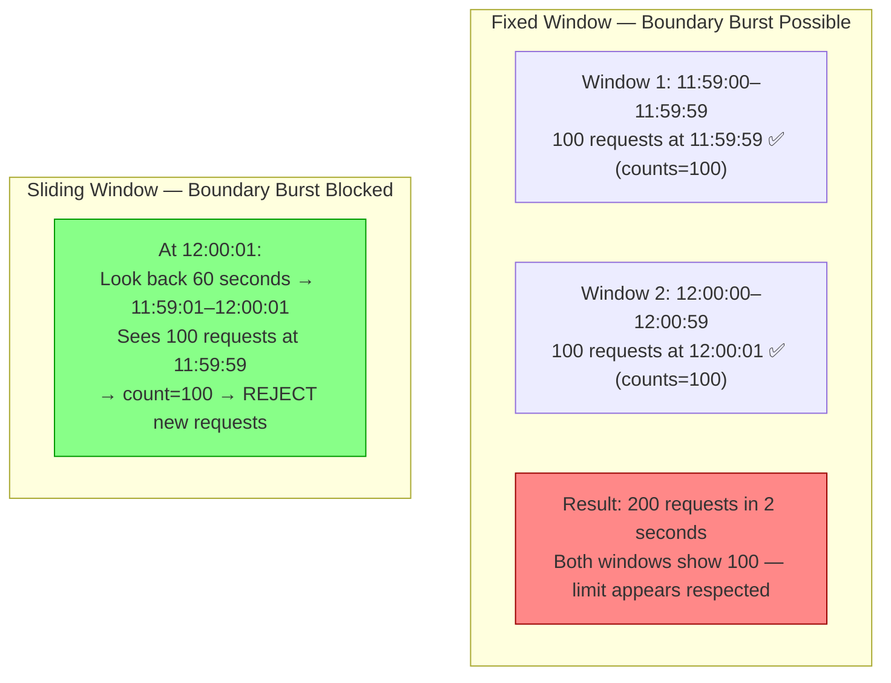
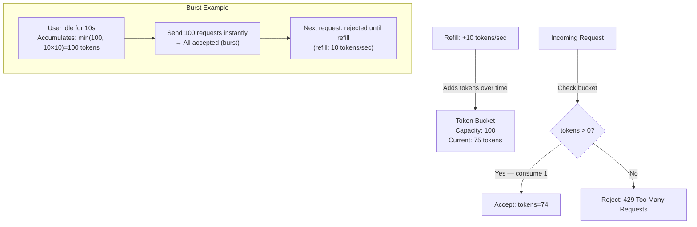
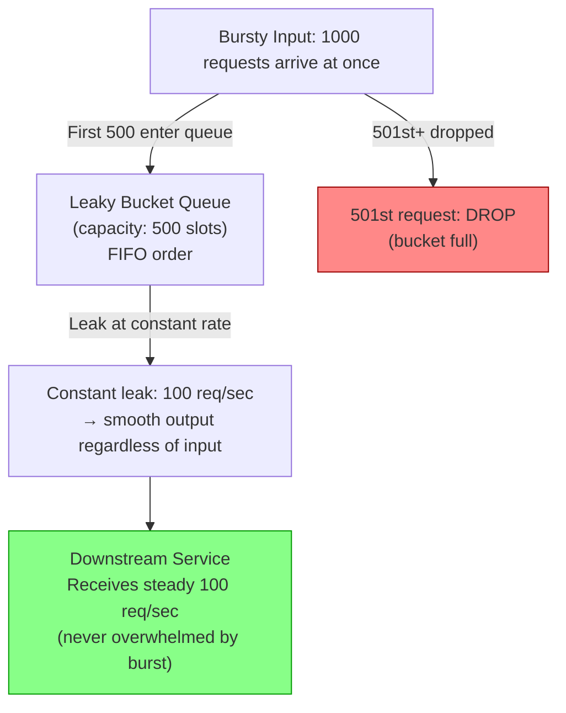
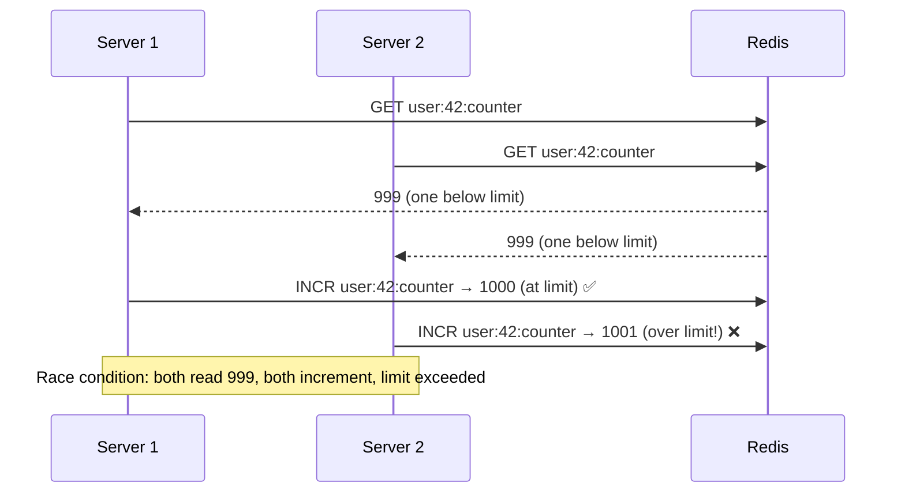
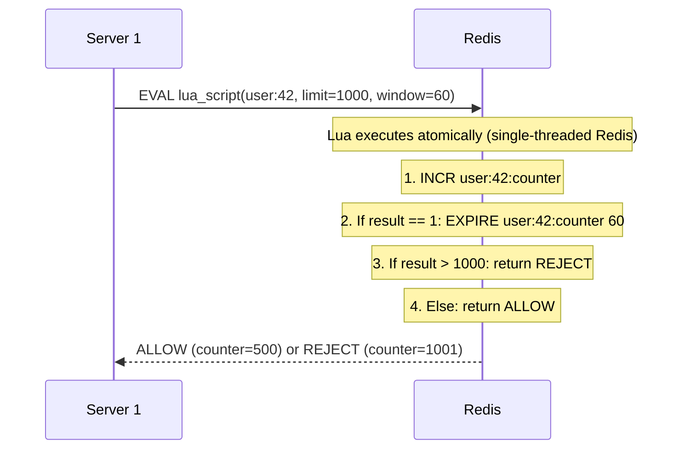
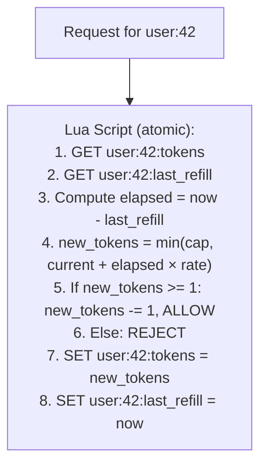
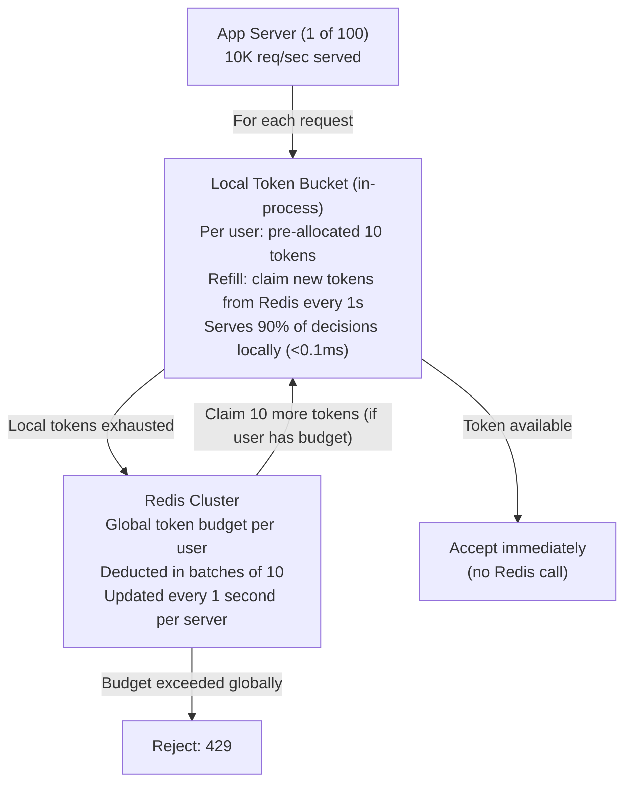
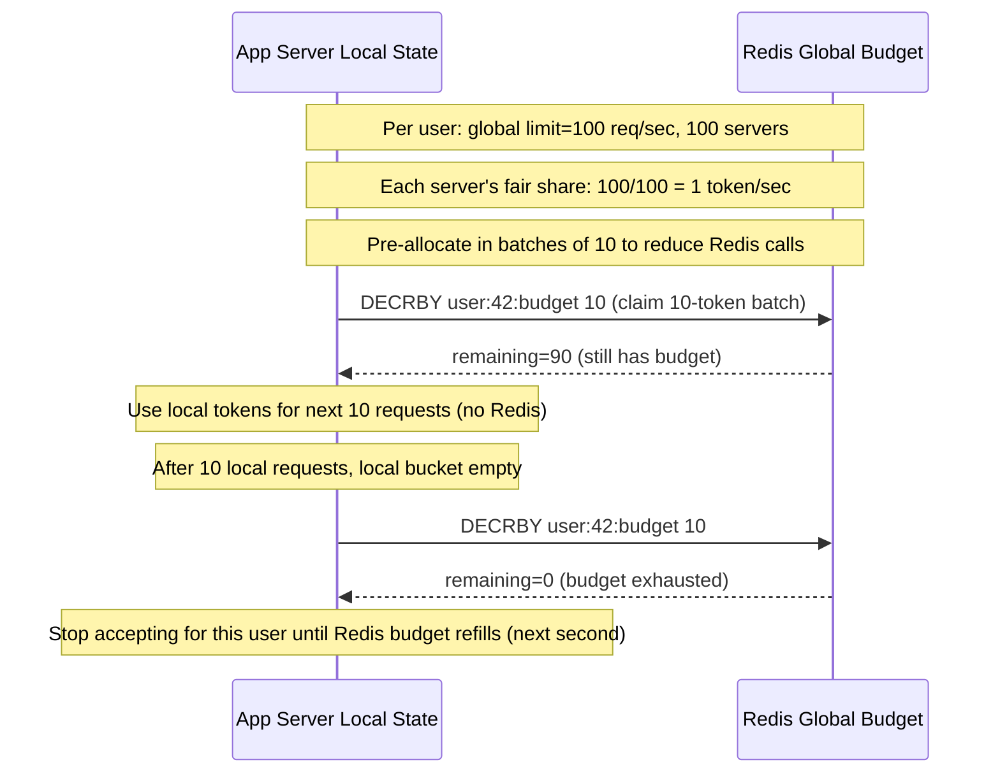
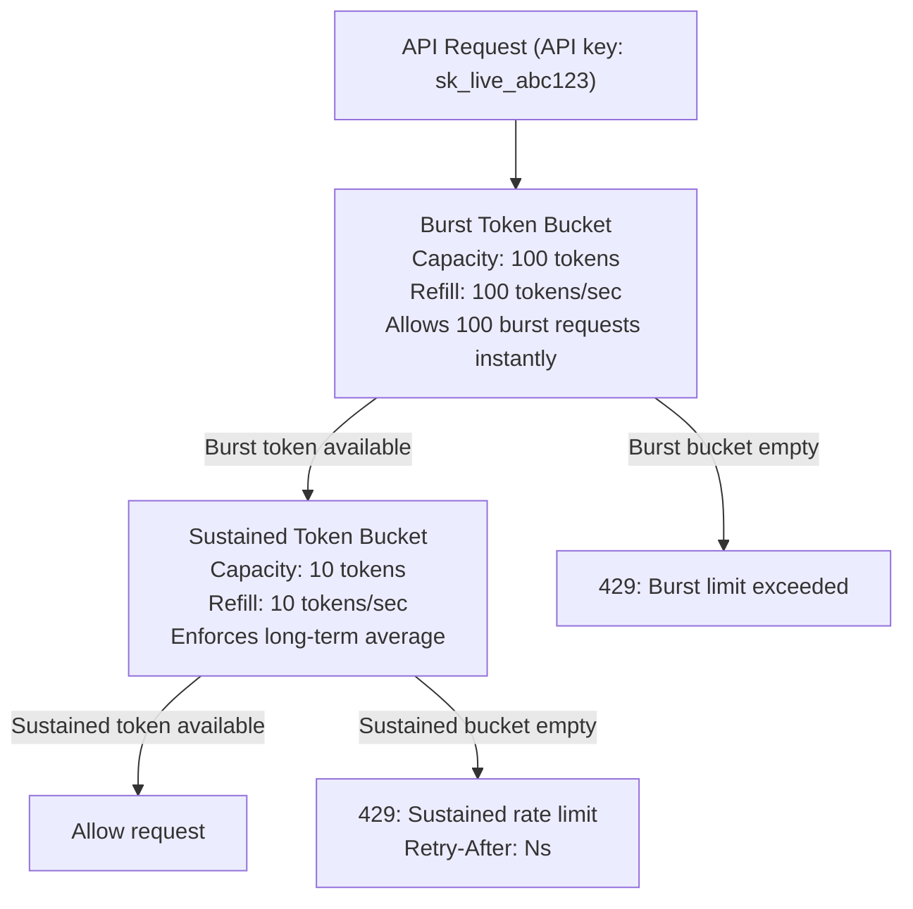
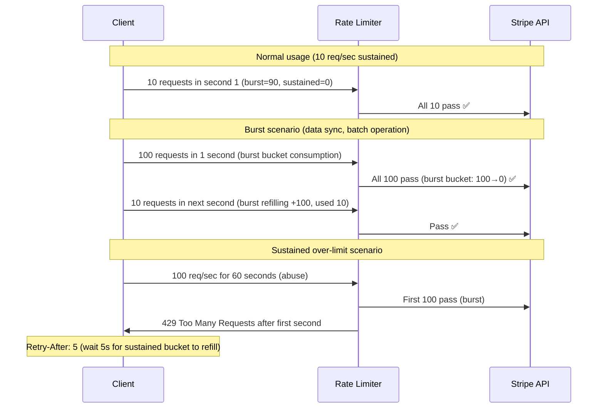

# Rate Limiting Algorithms

6 questions covering rate limiting from fixed window boundary attacks to Stripe's tiered rate limiting at scale.

---

## Q1: Fixed window vs sliding window — what is the boundary burst attack?

**Role:** Mid | **Difficulty:** 🟡 | **Priority:** P0 | **Format:** Quick Answer

> **What the interviewer is testing:** Whether you understand the fundamental limitation of fixed window rate limiting and can articulate the exact failure mode.

### Answer in 60 seconds
- **Fixed window:** Divide time into fixed 1-minute windows. Allow N requests per window. Counter resets at the start of each window. Simple to implement: one Redis counter per user per minute.
- **The boundary burst attack:** A user sends N requests at 00:00:59 (end of window 1) and N requests at 00:01:01 (start of window 2). They've sent 2N requests in a 2-second span — but both windows show only N requests, so both pass. Effective throughput: 2N requests in 2 seconds = N req/sec.
- **Example:** Limit = 100 req/min. Attack: 100 requests at 11:59:59 PM + 100 requests at 12:00:01 AM = 200 requests in 2 seconds. Both windows report 100 — limit appears respected.
- **Sliding window solution:** Track every request timestamp in a sorted set. Count requests in the last 60 seconds before each incoming request. If count ≥ limit, reject. Boundary burst is impossible — the sliding window always covers exactly the last 60 seconds regardless of clock alignment.
- **Sliding window log cost:** O(N) storage per user per window (store every request timestamp). For N=1,000 requests/window per user, this is manageable; for N=1,000,000, use sliding window counter (approximation) instead.

### Diagram



### Pitfalls
- ❌ **"Fixed window is always wrong":** Fixed window is acceptable for non-critical rate limiting where a 2N burst at boundaries is tolerable (e.g., internal APIs). The choice depends on how exploitable the boundary is.
- ❌ **Implementing sliding window log at very high N:** Storing every timestamp at N=100,000 requests/window per user = 100,000 entries per user in Redis. Use sliding window counter (aggregated per sub-window) for high-N limits.
- ❌ **Not resetting on clock boundary for fixed window:** If the counter reset logic runs at 00:01:00 but requests are allowed through between 00:00:59.5 and the reset — the window overlaps. Ensure atomic increment-and-check with precise window boundary.

### Concept Reference
→ [Rate Limiting Patterns](../../../06-scalability/concepts/rate-limiting-algorithms)

---

## Q2: How does the token bucket algorithm work?

**Role:** Mid | **Difficulty:** 🟡 | **Priority:** P0 | **Format:** Quick Answer

> **What the interviewer is testing:** Whether you understand token bucket mechanics — burst handling, refill rate, and how it models real-world rate limits.

### Answer in 60 seconds
- **Concept:** A "bucket" holds tokens. Each request consumes 1 token. Tokens are added at a constant rate (the refill rate). If the bucket is full, new tokens are discarded. If the bucket is empty, requests are rejected (or queued).
- **Parameters:** Max capacity (burst size), refill rate (tokens/second).
- **Burst handling:** If a user hasn't made requests for 10 seconds and the refill rate is 10 tokens/sec, they accumulate up to `min(capacity, 10×10)` = up to `capacity` tokens. They can then send a burst of `capacity` requests instantly. This is intentional — token bucket allows controlled bursting.
- **Example:** Capacity=100 tokens, refill=10 tokens/sec. A user can send 100 requests instantly (burst), then 10 requests/sec sustained. An inactive user accumulates tokens up to 100, enabling another burst.
- **Implementation (Redis + Lua):** Use a Lua script to atomically: (1) calculate tokens since last check using elapsed time × rate, (2) cap at max capacity, (3) decrement by 1 for this request, (4) store updated count and timestamp. Lua ensures atomicity without distributed locks.
- **vs Leaky bucket:** Token bucket allows bursts (variable output rate). Leaky bucket smooths output to a constant rate (no bursts allowed, explained in Q3).

### Diagram



### Pitfalls
- ❌ **Not capping tokens at max capacity:** Without a cap, a user idle for 1 hour accumulates 36,000 tokens (at 10/sec). They can then send 36,000 requests in one burst. Always cap: `tokens = min(tokens + elapsed × rate, capacity)`.
- ❌ **Not using atomic operations:** A non-atomic read-then-write allows race conditions under concurrent requests — two requests both read `tokens=1`, both decrement to 0, both succeed — effectively allowing 2× the limit. Use Redis Lua scripts or Redis atomic commands.
- ❌ **Setting capacity = refill_rate:** This disallows all bursting — every second the user gets exactly 1 token and can send exactly 1 request/sec. Token bucket's burst capability is its primary feature; if you don't want bursting, use leaky bucket.

### Concept Reference
→ [Rate Limiting Patterns](../../../06-scalability/concepts/rate-limiting-algorithms)

---

## Q3: What is the leaky bucket algorithm and when do you use it over token bucket?

**Role:** Mid | **Difficulty:** 🟡 | **Priority:** P0 | **Format:** Quick Answer

> **What the interviewer is testing:** Whether you understand the smoothing semantics of leaky bucket and can identify the use cases where constant output rate is required.

### Answer in 60 seconds
- **Concept:** Requests enter a queue (the "bucket"). The queue drains at a constant rate (the "leak rate"). If the bucket is full (queue overflow), new requests are dropped. Output rate is always constant — regardless of burst input.
- **Key property:** Leaky bucket enforces a strictly constant output rate. A burst of 1,000 requests fills the queue and is served at exactly `leak_rate` requests/second. No instant burst is possible at the output.
- **vs Token bucket:** Token bucket allows bursting (useful for APIs that serve users who need to do a lot quickly). Leaky bucket smooths traffic (useful for protecting downstream services that cannot handle bursts).
- **When leaky bucket wins:**
  - **Database writes:** DB can handle 1,000 writes/sec consistently. A burst of 10,000 writes/sec would overload it. Leaky bucket buffers excess writes and drains at 1,000/sec.
  - **External API calls with rate limits:** If a third-party API allows 100 requests/sec, a leaky bucket ensures you never exceed 100/sec regardless of your internal traffic pattern.
  - **SMS/email sending:** Sending 10,000 SMS in 1 second triggers spam filters. Leaky bucket smooths to 10/sec.
- **Implementation:** Queue (Redis list) + consumer that pops 1 item every `1/leak_rate` seconds.

### Diagram



### Pitfalls
- ❌ **Leaky bucket for user-facing APIs:** Users expect burst capability — sending 20 API requests in 2 seconds for a data export should be allowed. Leaky bucket would queue them and serve at 10/sec, adding unwanted latency. Use token bucket for user-facing APIs.
- ❌ **No overflow feedback to caller:** If the queue is full and requests are dropped silently, the caller has no signal. Always return 429 with `Retry-After` header so callers can back off rather than re-sending immediately.
- ❌ **Setting queue capacity too small:** If the bucket fills in 100ms of normal burst traffic, legitimate requests are dropped. Size the queue as: `capacity = leak_rate × acceptable_burst_duration`. For 100 req/sec leak and 5-second acceptable burst: `capacity = 500`.

### Concept Reference
→ [Rate Limiting Patterns](../../../06-scalability/concepts/rate-limiting-algorithms)

---

## Q4: How do you implement distributed rate limiting across 10 servers using Redis?

**Role:** Senior | **Difficulty:** 🔴 | **Priority:** P1 | **Format:** Deep Dive

> **What the interviewer is testing:** Whether you understand the race conditions in naive distributed rate limiting and how Redis Lua scripts or INCR + TTL patterns solve them correctly.

### Problem Constraints
| Dimension | Value |
|-----------|-------|
| Architecture | 10 app servers, single Redis cluster |
| Rate limit | 1,000 requests/minute per user |
| Request rate | 500K req/sec total across all servers |
| Consistency requirement | Limit must be globally enforced (not per-server) |

### Approach A — Naive: INCR + EXPIRE (has a race condition)



### Approach B — Correct: Lua Script (Atomic)



```
# Lua script (pseudo-code)
FUNCTION rate_limit(key, limit, window_seconds):
  count = INCR(key)
  IF count == 1:
    EXPIRE(key, window_seconds)  # Set TTL only on first increment
  IF count > limit:
    RETURN {allowed: false, remaining: 0}
  RETURN {allowed: true, remaining: limit - count}
```

### Approach C — Token Bucket in Redis



| Approach | Race condition safe | Burst support | Redis ops/request |
|----------|-------------------|--------------|------------------|
| GET + INCR (naive) | ❌ | ❌ | 2 (not atomic) |
| Lua INCR (fixed window) | ✅ | ❌ | 1 (atomic) |
| Lua token bucket | ✅ | ✅ | 1 (atomic) |

### Recommended Answer
Use a Redis Lua script for atomicity. Lua scripts execute atomically in Redis's single-threaded command processing — no other command runs between the steps, eliminating the race condition.

**Fixed window (Lua):** Single Lua script: `INCR key` → if result==1 set `EXPIRE key window` → if result>limit reject. Cost: 1 Lua eval per request. At 500K req/sec: Redis at 500K ops/sec — requires a Redis cluster (each shard at ~50K req/sec with 10 shards).

**Token bucket (Lua):** More complex script computing elapsed time and refill. Requires two fields per user (token count + last refill time). Allows burst capability. Slightly higher Lua computation cost.

**Avoiding Redis as bottleneck:** At 500K req/sec, a single Redis node becomes the bottleneck (max ~500K simple ops/sec, lower with Lua). Shard by user_id: `hash(user_id) % N_shards`. 10 shards × 50K req/sec each handles the load.

### What a great answer includes
- [ ] Identify the GET-then-INCR race condition explicitly
- [ ] Lua script as the atomic solution (single-threaded Redis execution)
- [ ] Sharding the rate limit keys across multiple Redis nodes
- [ ] Return `429 Too Many Requests` with `Retry-After` header and remaining count
- [ ] Quantify: at 500K req/sec, need 10-shard Redis cluster

### Pitfalls
- ❌ **Per-server rate limiting:** If each server enforces 1,000 req/min independently, a user can make 10,000 req/min by spreading requests across 10 servers. Rate limits must be shared via Redis, not local.
- ❌ **EXPIRE without checking if key is new:** Setting EXPIRE on every INCR call (not just when count==1) resets the TTL on every request — a user making constant requests never resets. Check `if result==1: EXPIRE`.
- ❌ **Not returning `Retry-After` header:** Without `Retry-After`, rate-limited clients retry immediately — creating a denial-of-service retry storm. Always include `Retry-After: N` (seconds until next request allowed).

### Concept Reference
→ [Rate Limiting Patterns](../../../06-scalability/concepts/rate-limiting-algorithms)

---

## Q5: How do you implement per-user rate limiting at 1M req/sec without Redis bottleneck?

**Role:** Senior | **Difficulty:** 🔴 | **Priority:** P1 | **Format:** Deep Dive

> **What the interviewer is testing:** Whether you can design a hybrid local + distributed rate limiting architecture that avoids making Redis the single-threaded bottleneck at extreme throughput.

### Problem Constraints
| Dimension | Value |
|-----------|-------|
| Traffic | 1M req/sec across 100 app servers |
| Rate limit | 100 req/sec per user |
| Users | 10M users (1,000 active users at any moment per server) |
| Redis capacity | 500K simple ops/sec per node (max) |
| Consistency tolerance | 5–10% over-limit is acceptable |

### Approach — Token Budget Pre-Allocation (Local + Distributed)



### Token Budget Calculation



| Approach | Redis calls/request | Consistency | Throughput |
|----------|-------------------|-------------|------------|
| Pure Redis (all decisions) | 1 | Exact | 500K req/sec max |
| Local pre-allocation (10-token batch) | 0.1 (1 per 10 requests) | ±10% | 10M req/sec |
| Local pre-allocation (100-token batch) | 0.01 | ±50% | 100M req/sec |

### What a great answer includes
- [ ] Identify that 1M req/sec exceeds single-node Redis capacity
- [ ] Pre-allocation: each server claims a token batch from Redis, serves locally until exhausted
- [ ] Consistency trade-off: larger batch = lower Redis load but higher over-limit risk
- [ ] Global budget in Redis, refilled every 1 second per the global rate limit
- [ ] Quantify Redis load reduction: from 1M calls/sec to 100K calls/sec (10× reduction with batch=10)

### Pitfalls
- ❌ **Ignoring the over-limit error budget:** Pre-allocation inherently allows some over-limit requests (up to batch_size × n_servers). For 100-server deployment with batch=10: 100×10=1,000 extra requests could be allowed. Communicate this trade-off explicitly.
- ❌ **Not handling Redis failure mode:** If Redis is unavailable, pre-allocated local tokens continue serving until exhausted — after which all requests are rejected (fail-safe) or all accepted (fail-open). Choose based on use case.
- ❌ **Fixed batch size for all users:** Active users exhaust batches in milliseconds; inactive users hold pre-allocated tokens indefinitely. Use adaptive batch size: `batch = max(1, last_request_rate × 0.1s)`.

### Concept Reference
→ [Rate Limiting Patterns](../../../06-scalability/concepts/rate-limiting-algorithms)

---

## Q6: How does Stripe implement tiered rate limiting — 100 req/sec burst, 10 req/sec sustained?

**Role:** Staff | **Difficulty:** ⚫ | **Priority:** P2 | **Format:** Deep Dive

> **What the interviewer is testing:** Whether you understand how production API providers implement dual-tier rate limiting that allows short-term bursting while enforcing long-term throughput constraints.

### Problem Constraints
| Dimension | Value |
|-----------|-------|
| Burst limit | 100 req/sec for up to 10 seconds |
| Sustained limit | 10 req/sec long-term average |
| Customer types | Free (100 req/min), Standard (1K req/min), Enterprise (custom) |
| Rate limit window | Sliding window, not fixed |

### Dual-Tier Token Bucket Architecture



### How Tiered Limits Work in Practice



| Scenario | Burst Bucket | Sustained Bucket | Result |
|----------|-------------|-----------------|--------|
| Normal use 10 req/sec | Stays full | Drains/refills at rate | Always allowed |
| Burst: 100 req in 1s | Empties fully | Drains 10 (sustained alloc) | Allowed (burst is expected) |
| Continuous 100 req/sec | Empty after 1s | Empty after 1s | Rejected — abuse |
| Idle for 10s then 100 req | Full (100) | Full (10, capped) | 10 sustained + 100 burst allowed |

### Recommended Answer
Stripe's rate limiting uses two token buckets layered in series (confirmed from their engineering blog and API documentation):

**Burst bucket:** Capacity=100, refill=100/sec. Allows any short burst up to 100 requests instantly. Designed for: SDK auto-retry on network errors, batch operations, startup synchronisation. Burst bucket is consumed first.

**Sustained bucket:** Capacity=10, refill=10/sec. Enforces the long-term average. Every request that passes the burst bucket must also take a token from the sustained bucket. The sustained bucket refills at the target sustained rate.

**Result:** A client can send 100 requests instantly (emptying burst bucket) but the sustained bucket only had 10 tokens — so only 10 requests pass immediately, 90 are rejected with `429 + Retry-After`. The client must wait 9 seconds for 90 more sustained tokens at 10/sec.

**Tier differentiation:** Stripe's free tier has smaller capacities; enterprise tiers have custom limits configured per API key. The same dual-bucket mechanism applies at all tiers.

**Response headers:** Stripe returns `Stripe-Ratelimit-Limit`, `Stripe-Ratelimit-Remaining`, and `Retry-After` headers so clients can implement proper backoff.

### What a great answer includes
- [ ] Two-token-bucket in series: burst bucket → sustained bucket
- [ ] Burst bucket allows spikes; sustained bucket enforces long-term average
- [ ] Both buckets must have a token for a request to pass
- [ ] Rate limit response headers for client backoff: `Retry-After`, `X-RateLimit-Remaining`
- [ ] Per-tier customisation: different capacities/refill rates per customer tier

### Pitfalls
- ❌ **Setting burst = sustained:** If both buckets have the same capacity and refill rate, the dual-bucket provides no burst benefit. Burst capacity must be significantly higher than sustained.
- ❌ **No Retry-After header:** Clients that don't receive `Retry-After` retry immediately on 429 — creating a thundering herd effect against the rate limiter. Always return `Retry-After`.
- ❌ **Rate limiting by IP in a multi-tenant shared NAT environment:** Corporate offices and cloud environments share NAT IPs. Rate limiting by IP penalises all users behind the same IP. Rate limit by API key or authenticated user ID.

### Concept Reference
→ [Rate Limiting Patterns](../../../06-scalability/concepts/rate-limiting-algorithms)
