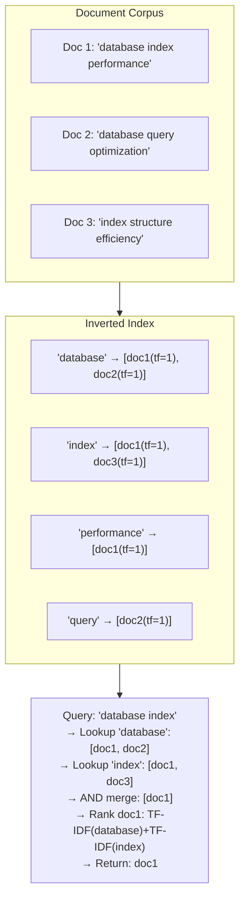
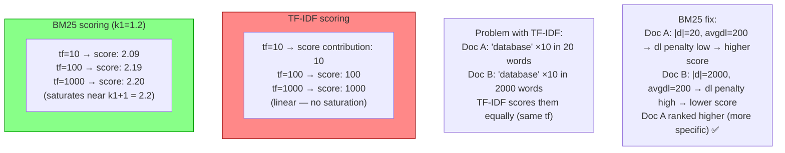
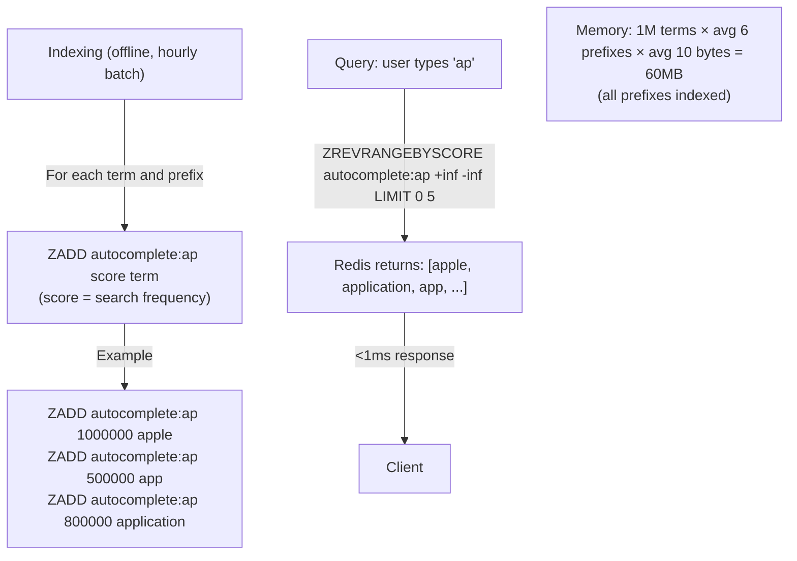
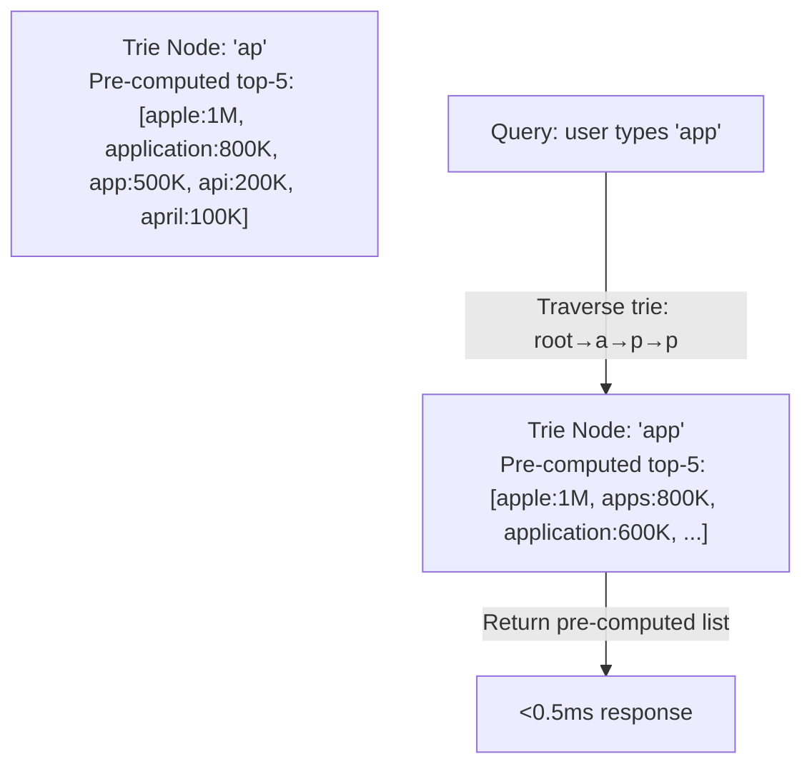
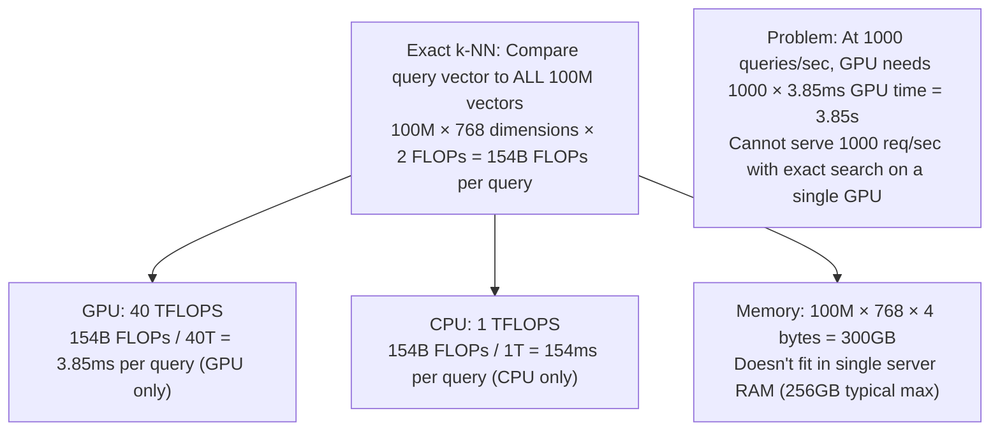
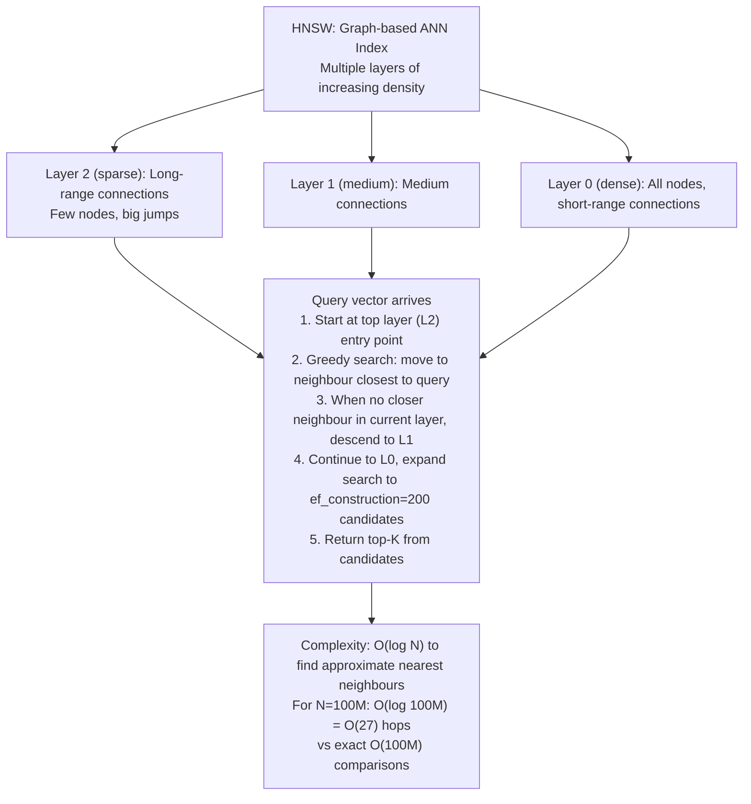
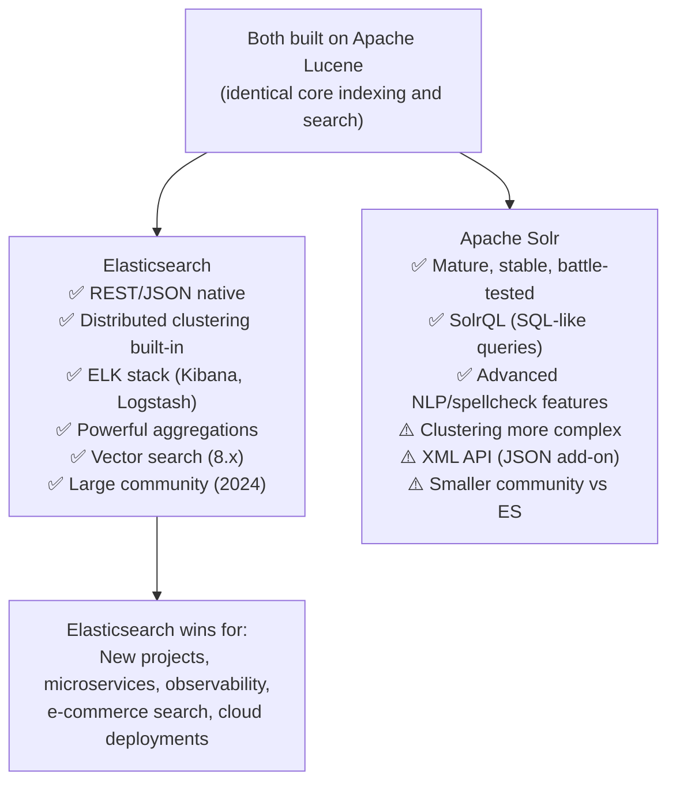
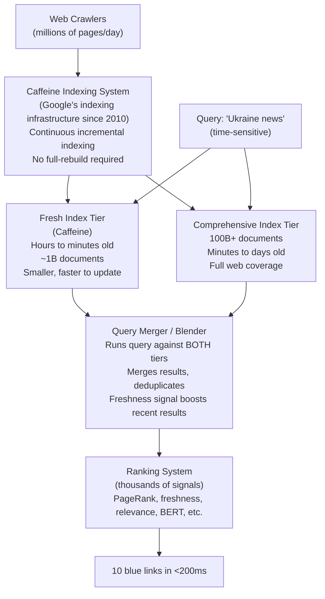
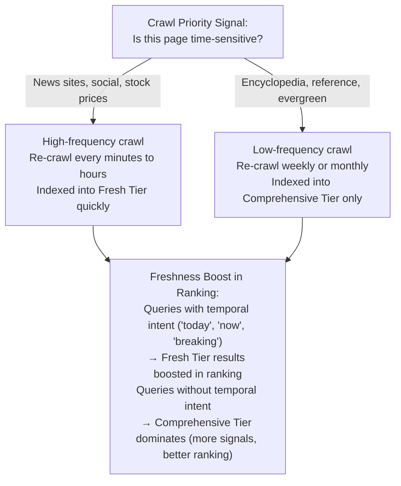

# Search Algorithms & Systems

6 questions covering search from inverted index fundamentals to Google's 8.5B searches/day freshness guarantee.

---

## Q1: How does an inverted index work — posting lists, TF-IDF scoring?

**Role:** Mid | **Difficulty:** 🟡 | **Priority:** P0 | **Format:** Quick Answer

> **What the interviewer is testing:** Whether you understand the core data structure powering every search engine and can explain relevance scoring.

### Answer in 60 seconds
- **Inverted index:** A mapping from each unique term (word) to the list of documents containing that term. Opposite of a forward index (document → words). "Inverted" because you look up by word to find documents.
- **Posting list:** For each term, the ordered list of (document_id, term_frequency, position_list) tuples. Example: `"database" → [(doc_5, tf=3, pos=[12,45,67]), (doc_12, tf=1, pos=[8])]`.
- **TF-IDF scoring:**
  - **TF (Term Frequency):** How many times the query term appears in the document. More occurrences → more relevant. TF(t,d) = count(t in d) / total_words(d).
  - **IDF (Inverse Document Frequency):** How rare is the term across all documents? Rare terms are more informative. IDF(t) = log(N / docs_containing_t). The word "the" (appears in every doc) has IDF≈0; "eigenvalue" (rare) has high IDF.
  - **TF-IDF = TF × IDF:** Balances frequency in the specific document with rarity across all documents. A document that uses a rare term frequently is highly relevant for that term.
- **Query execution:** Tokenise query → look up each term's posting list → intersect/union lists → rank by TF-IDF sum → return top-K.
- **Storage:** Posting lists are stored sorted by document_id for efficient merge (intersection). Compressed with delta encoding (store differences between consecutive doc IDs, not absolute IDs).

### Diagram

### Pitfalls
- ❌ **TF without normalisation:** A 10,000-word document naturally uses "database" more times than a 100-word document. Without dividing by document length, TF favours long documents. Always normalise: TF = count/doc_length.
- ❌ **Not knowing why IDF uses log:** IDF = log(N/df) rather than N/df. The log function compresses the scale — a term in 1 doc vs 10 docs is more different than 1M docs vs 10M docs. Logarithmic scaling reflects this diminishing differentiation.
- ❌ **Inverted index stores full documents:** Inverted index stores only term metadata (doc_id, tf, position). Full documents are in a separate document store. The index is for lookup; the store is for retrieval.

### Concept Reference
→ [Search Systems](../../../12-interview-prep/question-bank/algorithms-patterns/search-algorithms-systems)

---

## Q2: How does BM25 improve on TF-IDF?

**Role:** Mid | **Difficulty:** 🟡 | **Priority:** P0 | **Format:** Quick Answer

> **What the interviewer is testing:** Whether you know the dominant practical ranking function and can articulate its improvements over raw TF-IDF.

### Answer in 60 seconds
- **BM25 (Best Match 25):** The standard ranking function in Elasticsearch, Solr, and most production search engines (since the 1990s, still standard in 2025). Empirically outperforms TF-IDF on document retrieval benchmarks.
- **Improvement 1 — Term frequency saturation:** Raw TF-IDF grows linearly with term frequency — a document using "database" 100 times scores 100× higher than one using it once, even if both are equally relevant. BM25 applies a saturation function: `TF_sat = (k1 + 1) × tf / (tf + k1 × (1 - b + b × dl/avgdl))`. As tf → ∞, TF_sat → (k1 + 1). Typical k1=1.2: max TF contribution = 2.2 regardless of raw count.
- **Improvement 2 — Document length normalisation:** BM25 penalises long documents for high term frequency. A short document with `tf=5` for "database" is more relevant than a long document with `tf=5` because the ratio is higher. Parameter `b=0.75` controls length normalisation strength.
- **Formula (simplified):** `BM25(t,d) = IDF(t) × (k1+1) × tf(t,d) / (tf(t,d) + k1 × (1 - b + b × |d|/avgdl))`
- **Default parameters:** k1=1.2–2.0, b=0.75. Elasticsearch uses k1=1.2, b=0.75.
- **When BM25 struggles:** Semantic meaning (BM25 is keyword-based — "car" and "automobile" are different terms). Use dense vector embeddings (ANN/HNSW) for semantic search.

### Diagram

### Pitfalls
- ❌ **Tuning k1 and b without evaluation:** The defaults (k1=1.2, b=0.75) are good starting points but not universal. Measure NDCG (Normalized Discounted Cumulative Gain) against a labelled test set before changing parameters.
- ❌ **BM25 for semantic search:** "I need a vehicle" does not match "car rental" well with BM25 — no keyword overlap. For semantic relevance, use BM25 + dense vector hybrid search (Elasticsearch 8.x supports this natively).
- ❌ **Not knowing Elasticsearch uses BM25 by default:** Elasticsearch switched from TF-IDF to BM25 as the default similarity in version 5.0 (2016). Saying "Elasticsearch uses TF-IDF" in a 2025 interview is outdated.

### Concept Reference
→ [Search Systems](../../../12-interview-prep/question-bank/algorithms-patterns/search-algorithms-systems)

---

## Q3: How do you design search autocomplete at 10K queries/sec with p99 < 50ms?

**Role:** Senior | **Difficulty:** 🔴 | **Priority:** P1 | **Format:** Deep Dive

> **What the interviewer is testing:** Whether you can design a production autocomplete system that combines a fast trie (or Redis sorted set) with completion ranking and latency guarantees.

### Problem Constraints
| Dimension | Value |
|-----------|-------|
| Query rate | 10K prefix queries/sec |
| Latency SLA | p99 < 50ms |
| Vocabulary | 1M search terms |
| Suggestion count | Top 5 completions |
| Ranking signal | Search frequency (last 30 days) |

### Approach A — Redis Sorted Set Autocomplete

### Approach B — Trie with Pre-computed Top-K

| Dimension | Redis Sorted Set | Trie + Pre-computed |
|-----------|-----------------|---------------------|
| Query latency | 0.5–1ms | <0.1ms (in-process) |
| Memory | 60MB (all prefixes) | 200MB (trie + top-K) |
| Update frequency | Hourly batch ZADD | Daily rebuild |
| Horizontal scaling | Redis cluster | Shard by prefix character |
| Typo tolerance | ❌ | ❌ (needs Levenshtein) |

### Recommended Answer
For 10K req/sec with p99 < 50ms, use a two-tier approach:

**L1 — In-process trie with pre-computed top-5 per node:** The trie is built from 1M terms × their 30-day search frequency. Each node stores its top-5 completions as a pre-computed sorted list. Query: traverse trie for the prefix, return the node's pre-computed top-5. Latency: <1ms including serialisation.

**L2 — Redis sorted set fallback for prefix miss:** Prefixes not in the trie (rare terms, new terms) fall through to Redis. `ZREVRANGEBYSCORE autocomplete:{prefix} +inf 0 LIMIT 0 5`. Latency: 2–5ms.

**Update pipeline:** Every hour, a Spark job aggregates search logs → term frequency counts → top-5 per prefix → serialise trie → hot-swap in-process (swap reference atomically after build completes). No downtime during update.

**Typo tolerance:** Fuzzy matching (Levenshtein distance) is too expensive at 10K req/sec for prefix matching. Use a separate suggestion API for typos (activated after 2+ seconds of no matching prefix) backed by Elasticsearch fuzzy queries.

### What a great answer includes
- [ ] In-process trie for p50/p99 < 1ms on L1 hit (no network round trip)
- [ ] Pre-computed top-5 at each trie node to avoid subtree traversal
- [ ] Redis fallback for prefix misses
- [ ] Hourly batch rebuild + atomic hot-swap (no downtime)
- [ ] Separate typo-tolerance path (not mixed with prefix completion)

### Pitfalls
- ❌ **Full trie traversal at query time:** Without pre-computed top-K at each node, returning top-5 requires traversing the subtree under the matched prefix — O(subtree_size) per query. Pre-compute at index time.
- ❌ **Too-frequent trie rebuilds:** Rebuilding 1M-term trie every second is expensive. Hourly is sufficient — autocomplete suggestions do not need second-level freshness.
- ❌ **Not considering prefix-key explosion:** Indexing all prefixes of "application" (a, ap, app, appl, appli, applic, applica, applicat, applicati, applicatio, application = 11 entries). 1M terms × 8 avg chars = 8M Redis keys. Memory: 8M × 50 bytes = 400MB — manageable but must be planned.

### Concept Reference
→ [Search Systems](../../../12-interview-prep/question-bank/algorithms-patterns/search-algorithms-systems)

---

## Q4: What is vector similarity search, HNSW, and why is exact search too slow?

**Role:** Senior | **Difficulty:** 🔴 | **Priority:** P1 | **Format:** Deep Dive

> **What the interviewer is testing:** Whether you understand the shift from keyword search to semantic search and why approximate nearest neighbour (ANN) algorithms are necessary at scale.

### Problem Constraints
| Dimension | Value |
|-----------|-------|
| Corpus | 100M documents, each a 768-dimensional embedding |
| Query | Find 10 most semantically similar documents |
| Exact search complexity | O(N × D) = O(100M × 768) = 76.8B multiply-add operations per query |
| Target latency | p99 < 100ms |

### Why Exact Search is Too Slow

### HNSW (Hierarchical Navigable Small World)

| Dimension | Exact k-NN | HNSW (ANN) |
|-----------|-----------|-----------|
| Recall@10 | 100% | 95–99% |
| Latency p99 (100M vectors) | 150ms (GPU) | 5–20ms |
| Index size | O(N × D) | O(N × M) where M=connections per node |
| Index build time | None | Hours for 100M vectors |
| Query throughput | Low | High (100× faster) |

### Recommended Answer
Vector similarity search finds semantically similar items using dense embedding vectors (typically 384–1536 dimensions from models like text-embedding-ada-002 or sentence-transformers).

**Why approximate:** Exact exhaustive search over 100M × 768-dim vectors is 76.8B operations per query — even on a GPU, handling 1,000 queries/sec requires 77 GPUs. HNSW (used by pgvector, Pinecone, Qdrant, Weaviate) achieves 95–99% recall at 20–100× faster query speed.

**HNSW structure:** A multi-layer graph where the top layer has a few nodes with long-range connections (like major highways), and the bottom layer has all nodes with short-range connections (like local roads). Search starts at the top layer, greedily navigates toward the query vector, then descends to denser layers for refinement.

**Parameters:**
- `M=16`: number of connections per node (higher = better recall, more memory)
- `ef_construction=200`: candidates considered during index build (higher = better recall, slower build)
- `ef_search=100`: candidates considered at query time (tune recall vs speed trade-off at runtime)

**Production deployment:** Pinecone, Weaviate, and Qdrant are managed vector databases using HNSW internally. Elasticsearch 8.x supports vector search via HNSW natively. For hybrid search (keyword + semantic): run BM25 and HNSW in parallel, merge results using RRF (Reciprocal Rank Fusion).

### What a great answer includes
- [ ] Exact search cost: O(N × D) — too slow at 100M vectors
- [ ] HNSW: multi-layer navigable small world graph, O(log N) query
- [ ] Key parameters: M (connections), ef_construction (build quality), ef_search (runtime recall)
- [ ] Recall@K: ANN achieves 95–99% of exact recall at 100× speed
- [ ] Hybrid search: combine BM25 (keyword) + HNSW (semantic) via RRF

### Pitfalls
- ❌ **Flat FAISS for 100M vectors without partitioning:** FAISS flat index is exact — O(N) per query. Use IVF (inverted file index) or HNSW for approximate search at scale.
- ❌ **Not knowing the recall trade-off:** ANN is approximate — some relevant results are missed. For high-stakes retrieval (medical, legal), evaluate recall@K carefully and tune ef_search.
- ❌ **Confusing embedding dimensions with document length:** A 768-dimensional vector encodes semantic meaning — it is not the word count. Documents of 10 words and 10,000 words both produce 768-dim embeddings.

### Concept Reference
→ [Search Systems](../../../12-interview-prep/question-bank/algorithms-patterns/search-algorithms-systems)

---

## Q5: When does Elasticsearch beat Solr — distributed model, REST API, ease of use?

**Role:** Senior | **Difficulty:** 🔴 | **Priority:** P1 | **Format:** Quick Answer

> **What the interviewer is testing:** Whether you understand the practical differences between the two dominant open-source search platforms and can make a justified recommendation.

### Answer in 60 seconds
- **Shared foundation:** Both Elasticsearch and Solr are built on Apache Lucene — the same inverted index engine. Core relevance (BM25, TF-IDF), index structures, and tokenisation are identical.
- **Elasticsearch advantages:**
  - **REST/JSON API natively:** All operations via HTTP JSON — easy to integrate from any language without client libraries. Solr uses XML/HTTP with JSON as an add-on.
  - **Distributed by design:** Multi-node clustering is built-in from day one. Solr clustering (SolrCloud) was added later and remains more complex to operate.
  - **Kibana integration:** ELK stack (Elasticsearch + Logstash + Kibana) is the dominant observability stack — Elasticsearch is the natural choice for log analytics.
  - **Schema flexibility:** Schema-less JSON documents with dynamic field detection. Solr requires explicit schema definition (though schema-free mode exists).
  - **Aggregation API:** Elasticsearch's aggregation framework for analytics (date histograms, facets, percentiles) is more powerful and easier to use than Solr's faceting.
- **Solr advantages:** Older, more mature in some enterprise features (advanced spellcheck, query parsing). Some legacy deployments. Better when you need full SQL-like query syntax (Solr supports SQL via SolrQL).
- **Recommendation:** Choose Elasticsearch for new projects, log analytics, e-commerce search, and distributed deployments. Only choose Solr if you have an existing Solr deployment or require its specific enterprise query features.

### Diagram

### Pitfalls
- ❌ **"They're the same because both use Lucene":** While the core index engine is shared, the operational experience, API design, clustering model, and ecosystem differ significantly. Lucene is the engine; the car is different.
- ❌ **Ignoring Elasticsearch's split-brain risk:** Elasticsearch clusters require careful quorum configuration (`discovery.zen.minimum_master_nodes`). Misconfigured clusters suffer split-brain. Always set minimum_master_nodes = floor(N/2) + 1.
- ❌ **Recommending Elasticsearch without considering OpenSearch:** Since Elastic changed its licensing (SSPL) in 2021, many organisations use OpenSearch (AWS fork of Elasticsearch 7.x). In AWS environments, OpenSearch Service is the managed choice.

### Concept Reference
→ [Search Systems](../../../12-interview-prep/question-bank/algorithms-patterns/search-algorithms-systems)

---

## Q6: How does Google search handle 8.5B searches/day with freshness guarantees?

**Role:** Staff | **Difficulty:** ⚫ | **Priority:** P2 | **Format:** Deep Dive

> **What the interviewer is testing:** Whether you understand the architecture of a web-scale search index, the Caffeine indexing system, and how freshness is balanced with ranking quality.

### Problem Constraints
| Dimension | Value |
|-----------|-------|
| Daily search queries | 8.5B (100K queries/sec) |
| Web index size | 100B+ documents |
| Freshness requirement | News articles indexed within minutes |
| Index serving latency | p99 < 200ms per query |

### Google's Multi-Tier Index Architecture

### Freshness vs Comprehensiveness Trade-Off

| Dimension | Pre-Caffeine (BigTable-based) | Caffeine |
|-----------|------------------------------|---------|
| Index rebuild frequency | Complete rebuild every few days | Continuous incremental updates |
| Time to index new content | Hours to days | Minutes |
| Index freshness | Stale (1–3 day lag typical) | Near-real-time for crawled pages |
| Infrastructure | Batch MapReduce | Continuous stream processing |

### Recommended Answer
Google's search handles 8.5B/day (100K queries/sec) through a distributed architecture with multiple index tiers, continuous indexing, and a blended serving layer:

**Caffeine (2010+):** Replaced the old batch-rebuild index with continuous incremental indexing. New crawled content is processed by a stream processing pipeline (similar to Apache Beam/Dataflow) and available in the index within minutes. The 2010 paper described 50% fresher results and 3× more page inclusions vs the old system.

**Multi-tier index:** The Fresh Tier (~1B documents, updated continuously) handles time-sensitive queries. The Comprehensive Tier (100B+ documents) provides full web coverage. Every query is served from both — the Blender merges and de-duplicates results before final ranking.

**Freshness signals:** Google's ranking algorithm includes a freshness score (based on content change frequency, publication date, crawl recency). For queries detected as time-sensitive (news queries, trending topics), freshness is up-weighted in the final ranking model.

**Serving at 100K q/s:** Each query is distributed across thousands of index shards (parallelised lookup). A query returns partial results from each shard within 50ms; the Blender assembles results within 200ms total.

### What a great answer includes
- [ ] Caffeine: continuous incremental indexing (not batch rebuild) — enables minutes-level freshness
- [ ] Multi-tier index: fresh tier + comprehensive tier, both queried per request
- [ ] Blending/merging layer: combines tier results before ranking
- [ ] Freshness as a ranking signal: up-weighted for time-sensitive queries
- [ ] Sharded serving: thousands of index shards for parallel lookup within 200ms p99

### Pitfalls
- ❌ **"Google rebuilds its index nightly":** Pre-Caffeine this was approximately true. Post-2010 (Caffeine), Google uses continuous incremental indexing — no full rebuild. The 2010 announcement explicitly described this shift.
- ❌ **Confusing crawling and indexing freshness:** Crawling a page (fetching HTML) is different from indexing it (processing + making it searchable). Crawl can happen in minutes; indexing completes within minutes after crawl. But crawl priority varies — not every page is crawled frequently.
- ❌ **Not knowing PageRank is one of thousands of signals:** "Google uses PageRank" is technically true but severely incomplete. Modern Google Search uses thousands of ranking signals including BERT (query understanding), user behaviour, freshness, authority, and many others. PageRank is one component.

### Concept Reference
→ [Search Systems](../../../12-interview-prep/question-bank/algorithms-patterns/search-algorithms-systems)
