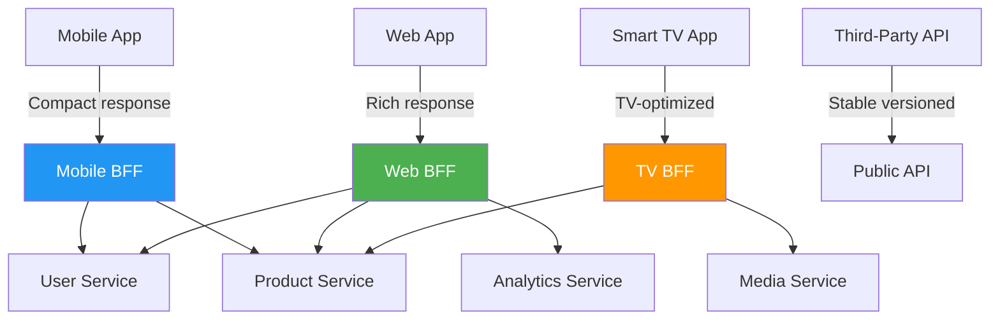
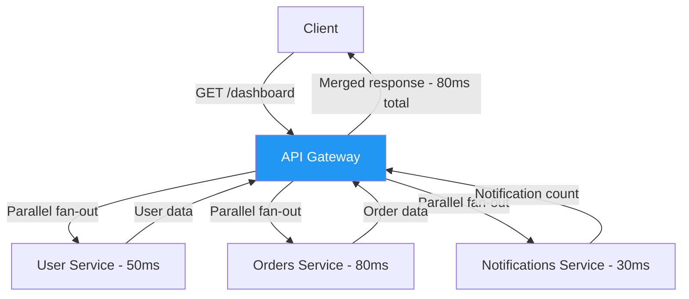
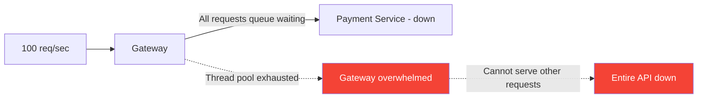
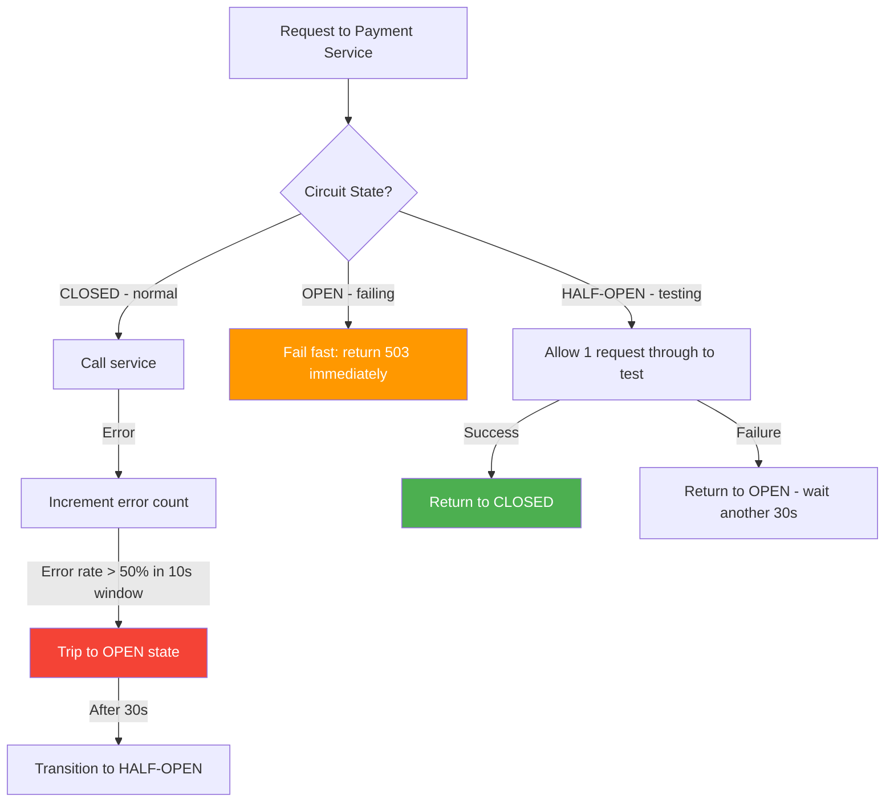
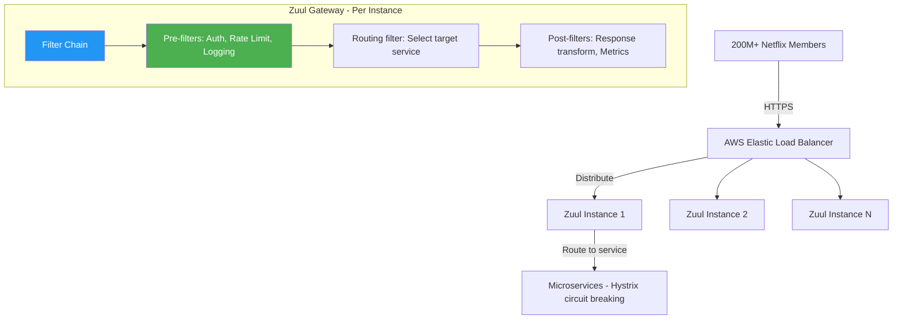
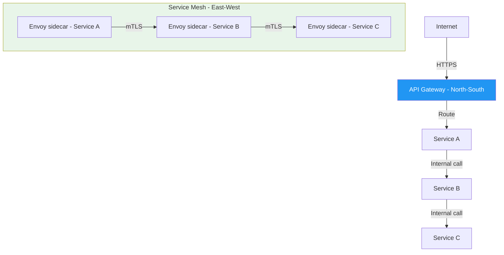
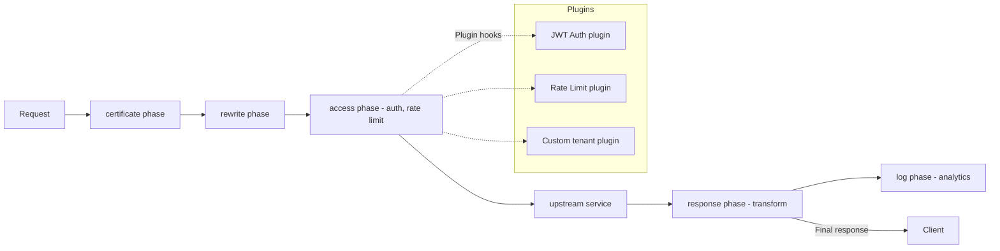
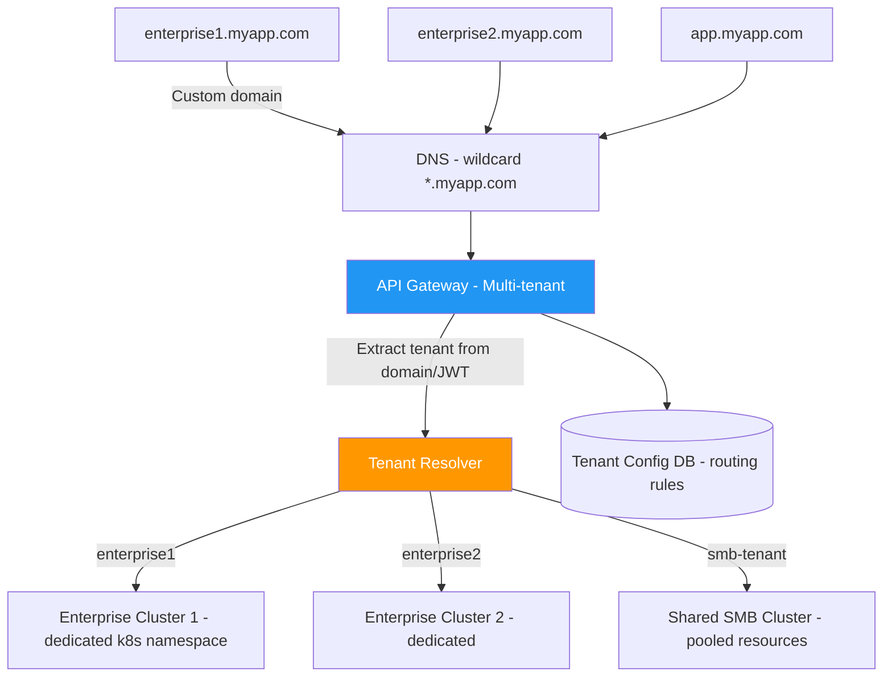
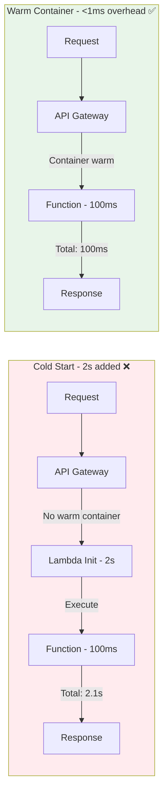
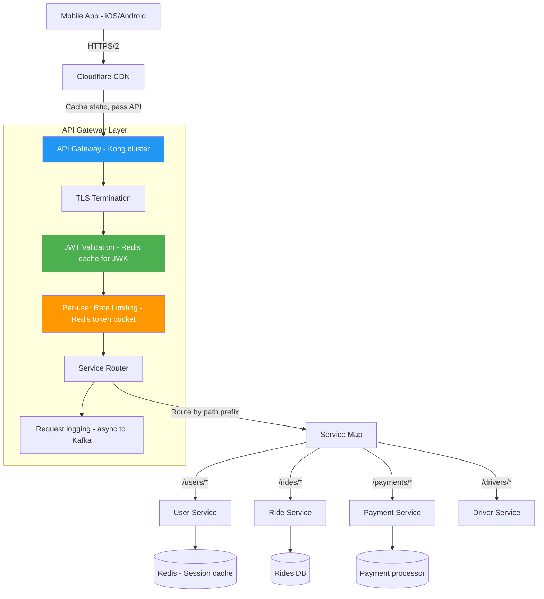

# API Gateway Patterns

10 questions covering BFF pattern, circuit breaking, protocol translation, Netflix Zuul, service mesh, and multi-tenant gateway design.

---

## Q1: What is the BFF (Backend for Frontend) pattern and when do you use it?
**Role:** Mid, Backend | **Difficulty:** 🟡 | **Priority:** P0 | **Format:** Quick Answer

> **What the interviewer is testing:** Whether you understand why a one-size-fits-all API doesn't scale across diverse client types.

### Answer in 60 seconds
**BFF (Backend for Frontend):** A dedicated API layer for each frontend client type (web, mobile, TV, third-party) that aggregates, filters, and reshapes data specifically for that client's needs.

**Why you need it:**
- Mobile apps need compact responses (low bandwidth, small screens) — general API returns 50 fields when mobile needs 5
- Web app needs rich data with related entities expanded — mobile needs IDs only
- TV/gaming app needs different data shape entirely
- Third-party API needs stable, versioned contract — internal clients can tolerate more change

**Who coined it:** Sam Newman (author of "Building Microservices") — each consumer has its own BFF that aggregates internal services.

**Without BFF:** Either over-fetch for mobile OR under-fetch for web — impossible to optimize for both.

**With BFF:** Mobile BFF aggregates 3 service calls into 1 compact response. Web BFF returns full data. Each BFF is owned by the frontend team.

### Diagram



### Pitfalls
- ❌ **One BFF for all clients:** The entire point is per-client customization; a shared BFF is just an API gateway.
- ❌ **BFF team ownership mismatch:** If backend team owns mobile BFF, frontend requirements get deprioritized. Mobile BFF should be owned by mobile team.
- ❌ **BFF as business logic layer:** BFF should aggregate and transform, not implement business logic — that belongs in services.

### Concept Reference

---

## Q2: What is API composition at the gateway level?
**Role:** Mid | **Difficulty:** 🟡 | **Priority:** P1 | **Format:** Quick Answer

> **What the interviewer is testing:** Understanding of how gateways reduce client-to-microservice chattiness.

### Answer in 60 seconds
**API composition:** The gateway makes multiple internal service calls and merges the results before returning a single response to the client.

Without composition: Client makes 4 API calls (user, orders, products, addresses) = 4× network round trips from client.

With composition: Client makes 1 call to gateway; gateway makes 4 internal calls in parallel; returns merged response.

**Trade-offs:**
- ✅ Reduces client-side network calls (mobile battery, latency)
- ✅ Client doesn't need to know about internal service topology
- ❌ Gateway becomes more complex and stateful
- ❌ One slow service delays the entire composed response (use timeout + partial response)
- ❌ Gateway coupling to downstream services — changes require gateway updates

**Parallel vs sequential composition:**
- Parallel: All internal calls fire simultaneously; total time = slowest service
- Sequential: When result of service A is needed to call service B (e.g., need user_id to get orders)

### Diagram



### Pitfalls
- ❌ **Sequential composition when parallel is possible:** 3 independent services composed sequentially = 50+80+30=160ms vs 80ms in parallel.
- ❌ **No timeout on individual service calls:** One slow service (30s timeout) blocks all other composed results.

### Concept Reference

---

## Q3: How do you implement circuit breaking at the API gateway layer?
**Role:** Senior | **Difficulty:** 🔴 | **Priority:** P1 | **Format:** Deep Dive

> **What the interviewer is testing:** Resilience patterns — preventing cascading failure when a downstream service degrades.

### Problem Constraints
| Dimension | Value |
|-----------|-------|
| Services behind gateway | 20 microservices |
| Failure scenario | Payment service returns 500 for 30 seconds |
| Risk without circuit breaking | Gateway threads exhausted waiting for payment service → all services become unavailable |
| Goal | Fail fast, recover automatically, isolate failure |

### Approach A — No Circuit Breaking



30 seconds × 100 req/sec = 3,000 pending requests. All threads blocked. Gateway crashes.

### Approach B — Circuit Breaker Pattern



**Circuit breaker states:**
- **CLOSED:** Normal operation; track error rates
- **OPEN:** Service failing; reject all requests immediately (fail fast) — prevents thread exhaustion
- **HALF-OPEN:** After recovery window (30s), allow probe requests to test if service recovered

**Configuration (per service):**
```yaml
circuit_breaker:
  payment_service:
    threshold: 50%          # error rate to trip
    window: 10s             # rolling window for error rate
    min_requests: 5         # minimum requests before tripping
    recovery_timeout: 30s  # time in OPEN before HALF-OPEN
    probe_requests: 1       # requests allowed in HALF-OPEN
```

**Fallback strategies when OPEN:**
1. Return cached response (last known good state)
2. Return degraded response (empty data, graceful degradation)
3. Return 503 with `Retry-After` header
4. Queue request for later processing

| Dimension | No Circuit Breaking | With Circuit Breaking |
|-----------|--------------------|-----------------------|
| Failure isolation | ❌ Cascades | ✅ Contained |
| Resource waste | High (threads blocked) | Low (fail fast) |
| Recovery time | Manual intervention | Automatic via HALF-OPEN |
| Caller experience | Timeout after 30s | Fail in <1ms |

### Recommended Answer
Implement circuit breakers **per downstream service** at the gateway layer. Use sliding window error rate (50% threshold) to trip to OPEN state. After 30s, HALF-OPEN state allows probe. Combine with fallback strategies — cached responses for read paths, queue for write paths. Netflix Hystrix, Resilience4j, and Envoy all implement this pattern.

### What a great answer includes
- [ ] Names all 3 states: CLOSED, OPEN, HALF-OPEN
- [ ] Explains threshold configuration (error rate, not just error count)
- [ ] Describes fallback strategies (not just failing)
- [ ] Notes per-service isolation as the key design
- [ ] Mentions Hystrix/Resilience4j/Envoy as implementations

### Pitfalls
- ❌ **Global circuit breaker:** One breaker for all services — one bad service takes down everything.
- ❌ **Tripping on single error:** Requires `min_requests` threshold; don't trip on first error during low traffic.
- ❌ **No fallback:** Circuit open with no fallback = worse UX than slow service; implement graceful degradation.

### Concept Reference

---

## Q4: What is protocol translation at the gateway (REST to gRPC)?
**Role:** Senior | **Difficulty:** 🟡 | **Priority:** P1 | **Format:** Quick Answer

> **What the interviewer is testing:** Understanding of gateway's role in bridging different communication protocols.

### Answer in 60 seconds
**Protocol translation:** Gateway accepts requests in one protocol (REST/JSON) and translates to another (gRPC/Protobuf) for internal services.

**Why needed:**
- External clients (browsers, third-party) can only use REST/JSON
- Internal services use gRPC for efficiency and type safety
- You don't want to rewrite all internal services to expose REST

**How it works at gateway:**
1. Gateway receives `POST /users/123/orders` (REST+JSON)
2. Gateway maps to internal gRPC call: `OrderService.CreateOrder(CreateOrderRequest{userId: "123", ...})`
3. Gateway serializes JSON → Protobuf, calls gRPC service
4. Gateway deserializes Protobuf response → JSON, returns to client

**Tools:**
- **gRPC-transcoding** (via Envoy `grpc_json_transcoder` filter): Auto-translates based on `.proto` file annotations
- **grpc-gateway** (Go): Generates REST proxy from `.proto` annotations
- **AWS API Gateway + Lambda:** Lambda translates REST → internal gRPC

**Benefits:**
- Internal services stay pure gRPC (type-safe, efficient)
- External interface stays REST (universal compatibility)
- Single protocol translation point — not scattered across services

### Diagram


### Pitfalls
- ❌ **Losing gRPC error codes in translation:** gRPC has rich error codes (PERMISSION_DENIED, NOT_FOUND); translate to correct HTTP status codes (403, 404), not generic 500.
- ❌ **Not handling gRPC streaming at gateway:** Server-streaming gRPC → SSE translation is possible but adds complexity; plan upfront.

### Concept Reference

---

## Q5: How does Netflix's Zuul handle API gateway at 2M req/sec?
**Role:** Senior | **Difficulty:** 🔴 | **Priority:** P2 | **Format:** Deep Dive

> **What the interviewer is testing:** Real-world gateway architecture and the engineering challenges at Netflix scale.

### Problem Constraints
| Dimension | Value |
|-----------|-------|
| Scale | 2M API requests/second at peak |
| Device types | TV, mobile, web, gaming consoles |
| Microservices | 500+ backend services |
| Regions | Multiple AWS regions for global availability |

### Zuul Architecture



**Zuul key design principles:**

1. **Filter-based architecture:** All logic implemented as filters in 3 phases: pre (auth, rate limit), routing (select upstream), post (response manipulation, logging). Filters are Groovy scripts deployable without server restart.

2. **Zuul 1 (blocking NIO) → Zuul 2 (non-blocking Netty):** Zuul 1 used one thread per request — at 2M RPS, thread count exploded. Zuul 2 (open-sourced 2018) moved to async non-blocking I/O via Netty — handles same load with 10× fewer threads.

3. **Hystrix integration:** Every service call goes through Hystrix circuit breakers. Service failure = gateway fails fast, not slow.

4. **Dynamic routing:** Service registry (Eureka) provides live list of service instances. Zuul uses ribbon load balancing across instances. No manual configuration needed for new service deploys.

5. **Canary releases:** Route 1% of traffic to new service version, monitor metrics, gradually increase. Implemented as Zuul filter.

**Scale techniques:**
- Zuul instances are stateless — scale horizontally; no session state
- In-memory caches for auth tokens (avoid auth service call on every request)
- Async push notification to invalidate cache on token revoke

| Dimension | Zuul 1 | Zuul 2 |
|-----------|--------|--------|
| I/O model | Blocking (1 thread/request) | Non-blocking (Netty event loop) |
| Thread count at 2M RPS | 2M threads (impractical) | ~100 threads |
| Latency | Higher (thread switching) | Lower |
| Complexity | Lower | Higher |

### Recommended Answer
Netflix Zuul succeeds at 2M RPS through: **non-blocking I/O (Netty)**, **filter-based extensibility**, **Hystrix circuit breaking per service**, and **stateless horizontal scaling**. The filter chain allows teams to add auth, rate limiting, A/B routing, and canary releases without touching core gateway code.

### What a great answer includes
- [ ] Distinguishes Zuul 1 blocking vs Zuul 2 non-blocking
- [ ] Explains filter chain architecture (pre/route/post)
- [ ] Notes Hystrix integration for failure isolation
- [ ] Describes stateless design enabling horizontal scaling
- [ ] Mentions dynamic routing via Eureka service registry

### Pitfalls
- ❌ **Zuul as stateful service:** Any session state in gateway = scaling bottleneck; keep gateway stateless.
- ❌ **No circuit breaking at gateway:** Without Hystrix/equivalent, one slow service blocks all Zuul threads.

### Concept Reference

---

## Q6: API gateway vs service mesh — when do you need both?
**Role:** Senior | **Difficulty:** 🔴 | **Priority:** P2 | **Format:** Quick Answer

> **What the interviewer is testing:** Clear mental model of two complementary but distinct infrastructure layers.

### Answer in 60 seconds

| Dimension | API Gateway | Service Mesh |
|-----------|-------------|-------------|
| Traffic direction | North-South (external → internal) | East-West (service → service) |
| Concerns | Auth, rate limiting, routing, versioning | mTLS, circuit breaking, observability |
| Operated by | Platform / API team | Infrastructure / DevOps team |
| Examples | Kong, AWS API Gateway, Nginx | Istio, Linkerd, Envoy |
| Client | External users | Internal services |

**API Gateway:** Handles requests from the outside world. Single entry point. Authenticates external tokens, enforces rate limits, routes to appropriate services.

**Service Mesh:** Handles internal service-to-service communication. Sidecar proxy (Envoy) injected into each pod. Provides mTLS encryption, distributed tracing, circuit breaking, retries — transparent to application code.

**When you need both:**
- Large microservices deployment (50+ services): mesh handles internal traffic; gateway handles external
- Compliance requirements: mTLS between all internal services (zero trust) + external API management
- Observability: mesh provides per-service metrics automatically; gateway provides edge metrics

**When gateway alone is sufficient:**
- Small system (< 10 services): gateway handles both external and internal routing
- Services trust each other (same VPC, same team): no mesh needed

### Diagram



### Pitfalls
- ❌ **Using gateway for service-to-service calls:** Routing all internal traffic through gateway creates bottleneck and adds latency.
- ❌ **Service mesh without gateway:** No external rate limiting, auth, or API management; external traffic has no control plane.

### Concept Reference

---

## Q7: How does Kong implement plugin architecture for gateway extensibility?
**Role:** Staff | **Difficulty:** 🔴 | **Priority:** P2 | **Format:** Quick Answer

> **What the interviewer is testing:** Understanding of extensible gateway design and how Kong enables customization without forking.

### Answer in 60 seconds
**Kong's plugin model:** Kong is built on OpenResty (Nginx + Lua). Every feature is a plugin that hooks into the request lifecycle at defined phases.

**Plugin execution phases:**
```
Request lifecycle:
certificate → rewrite → access → response → log

certificate: TLS termination, client cert verification
rewrite: URL rewriting, path manipulation
access: Auth, rate limiting, IP restriction
response: Response transformation, caching headers
log: Logging, metrics, analytics
```

Each plugin implements handlers for the phases it needs. Plugins can be applied globally, per service, or per route.

**Built-in plugins:** Rate limiting, JWT auth, OAuth2, HMAC auth, key auth, ACL, CORS, IP restriction, request size limiting, logging, Prometheus metrics.

**Custom plugin (pseudo-Lua):**
```lua
local MyPlugin = {}

function MyPlugin:access(config)
  -- Runs in access phase for every request
  local tenant_id = kong.request.get_header("X-Tenant-ID")
  if not tenant_id then
    return kong.response.exit(401, { message = "Missing tenant ID" })
  end
  kong.service.set_upstream(config.tenant_to_service[tenant_id])
end

return MyPlugin
```

**Why this matters:** Teams add custom auth, multi-tenancy routing, or request enrichment without modifying Kong core or deploying a custom gateway. Plugin updates deploy independently of Kong version.

### Diagram



### Pitfalls
- ❌ **Business logic in gateway plugins:** Plugins should be infrastructure concerns (auth, rate limit); business logic belongs in services.
- ❌ **No plugin versioning:** Updating a plugin without versioning can break all routes using it; test plugins in staging first.

### Concept Reference

---

## Q8: How do you design an API gateway for a multi-tenant SaaS with custom routing?
**Role:** Staff | **Difficulty:** 🔴 | **Priority:** P2 | **Format:** Deep Dive

> **What the interviewer is testing:** Ability to design tenant-aware infrastructure with routing isolation and customization.

### Problem Constraints
| Dimension | Value |
|-----------|-------|
| Tenants | 10,000 tenants |
| Scale | Enterprise tenants: dedicated infra; SMB: shared |
| Custom domains | Each enterprise tenant has their own domain (acme.myapp.com) |
| Isolation | Enterprise tenants must not share resources with SMB |
| Routing | Different service versions per tenant (A/B testing per customer) |

### Architecture Overview



**Tenant resolution:**
1. **Domain-based:** `acme.myapp.com` → tenant=acme (via wildcard DNS + cert)
2. **Header-based:** `X-Tenant-ID: acme` in request
3. **JWT claim:** Tenant embedded in auth token: `{ "sub": "user123", "tenant": "acme" }`

**Tenant config (stored in DB + cached in gateway):**
```
{
  "tenant_id": "acme",
  "tier": "enterprise",
  "routing": {
    "service_overrides": {
      "payment-service": "payment-service-v2-beta",  // A/B test
      "analytics-service": "analytics-service-acme"   // custom instance
    }
  },
  "rate_limits": {
    "requests_per_second": 10000,   // enterprise: higher limit
    "burst": 50000
  },
  "features": ["advanced_analytics", "custom_webhooks"],
  "custom_domain": "acme.myapp.com",
  "ssl_cert": "acme-cert-id"
}
```

**Isolation levels:**

| Tier | Routing | Compute | DB | Limit |
|------|---------|---------|----|----- |
| Enterprise | Dedicated namespace | Dedicated pods | Dedicated schema | Custom |
| Business | Shared cluster | Dedicated pods | Shared schema | High |
| SMB | Shared everything | Shared pods | Shared schema | Standard |

### Recommended Answer
**Tenant resolution at gateway** (from domain or JWT), **tenant config in Redis** (low-latency lookup for every request), **tier-based routing** (enterprise → dedicated cluster, SMB → shared), **per-tenant rate limits** stored in tenant config. Gateway handles isolation; services stay tenant-unaware via tenant context in headers.

### What a great answer includes
- [ ] Multiple tenant resolution methods (domain, header, JWT)
- [ ] Per-tenant rate limiting vs global limits
- [ ] Isolation tiers (enterprise dedicated vs SMB shared)
- [ ] Redis/cache for tenant config (not DB lookup per request)
- [ ] SSL termination for custom domains

### Pitfalls
- ❌ **DB lookup per request for tenant config:** With 10K tenants and thousands of RPS, DB lookup = bottleneck; cache tenant config in Redis with 5-min TTL.
- ❌ **Leaking tenant data between requests:** Always clear tenant context after request; async processing must carry tenant context explicitly.

### Concept Reference

---

## Q9: How does AWS API Gateway handle cold starts for Lambda-backed APIs?
**Role:** Staff | **Difficulty:** 🔴 | **Priority:** P3 | **Format:** Quick Answer

> **What the interviewer is testing:** Understanding of serverless API gateway trade-offs in production.

### Answer in 60 seconds
**Cold start problem:**
- Lambda function containers are created on-demand and recycled after ~15 minutes of inactivity
- New container initialization = cold start: 500ms–5s added latency depending on runtime (Java = 2–5s, Node.js = 100–500ms, Python = 100–500ms)
- For API Gateway + Lambda, cold starts happen after: first deployment, after idle period, during traffic burst (scale-out)

**Mitigation strategies:**

1. **Provisioned Concurrency (AWS feature):** Pre-warm N Lambda instances; they're always ready. Cost: you pay for provisioned capacity even when idle. Price: ~$0.005/GB-second (3× regular pricing). Target 10–20 provisioned instances for APIs with <100ms p99 requirement.

2. **Ping/keep-warm Lambda:** Scheduled EventBridge rule every 5 minutes that calls Lambda to prevent container recycling. Cheap but unreliable; doesn't help with burst scaling.

3. **Language selection:** Python/Node.js cold starts: 100–500ms. Java/Spring: 2–5s. Use lightweight runtimes or Lambda SnapStart (Java) to reduce init time.

4. **Minimize package size:** Lambda init time scales with deployment package size. 10MB package = 200ms init, 100MB = 2s init. Use layers for shared dependencies; keep function code < 5MB.

5. **AWS API Gateway caching:** For GET endpoints, cache at gateway layer (TTL 5–300 seconds) — Lambda not invoked at all for cache hits.

### Diagram



### Pitfalls
- ❌ **Provisioned concurrency for all endpoints:** Only apply to latency-sensitive endpoints; background jobs don't need it.
- ❌ **Java runtime without SnapStart:** Java Lambda cold starts of 5s are unacceptable for APIs; always use SnapStart or switch runtime.

### Concept Reference

---

## Q10: Design an API gateway for a mobile app serving 5M users
**Role:** Senior | **Difficulty:** 🟡 | **Priority:** P1 | **Format:** Scenario

**Real Company:** Uber, Airbnb, DoorDash mobile backends

### The Brief
> "Design an API gateway for a mobile app serving 5M daily active users. The gateway must handle authentication, per-user rate limiting, routing to 30+ microservices, and provide observability. Design for reliability and cost efficiency."

### Clarifying Questions
1. Is this iOS/Android native, React Native, or all three?
2. What are the auth mechanisms — JWT, OAuth, API keys?
3. What's the expected peak RPS vs average? (5M DAU doesn't directly translate)
4. Are there high-value endpoints (payment, ride request) that need different SLAs?
5. On-prem, AWS, GCP, or multi-cloud?

### Back-of-Envelope Estimation
| Metric | Calculation | Result |
|--------|-------------|--------|
| Daily active users | 5M | 5M |
| Avg sessions/day | 3 per user | 15M sessions |
| Avg requests/session | 20 API calls | 300M requests/day |
| Average RPS | 300M / 86400 | ~3,500 RPS |
| Peak RPS (10× average) | 3,500 × 10 | 35,000 RPS |
| Auth token validation/sec | 35,000 (every request) | Must cache JWT validation |

### High-Level Architecture



### Component Design

**Authentication layer:**
- JWT validation: Validate signature locally (no network call), check expiry
- JWK cache: Public keys cached in Redis for 1 hour; fetched from auth service only on cache miss
- Short-lived tokens: 15-minute access tokens, 30-day refresh tokens
- Device fingerprint in JWT: Detect token replay from different device

**Rate limiting (per-user, per-endpoint):**
```
Endpoints with different limits:
/rides/request: 10 req/min (prevent abuse)
/search/*: 100 req/min
/users/profile: 60 req/min
/payments/*: 5 req/min (fraud prevention)
Default: 300 req/min
```

**Routing configuration:**
```
Route rules:
/v1/rides/** → ride-service (current version)
/v2/rides/** → ride-service-v2 (canary, 10% traffic)
/payments/** → payment-service (circuit breaker: 50% error → open 30s)
/admin/** → admin-service (additional IP whitelist check)
```

### Trade-off Decisions
| Decision | Option A | Option B | Chosen | Why |
|----------|----------|----------|--------|-----|
| Gateway type | AWS API Gateway | Self-hosted Kong | Kong | AWS APIGW cost at 35K RPS = $150K/month; Kong on k8s = $15K/month |
| JWT validation | Validate every request via auth service | Cache JWK + validate locally | Local + cache | Auth service call per request = 35K RPS extra load on auth service |
| Rate limit storage | Redis (centralized) | Local in-memory | Redis | Need consistent limits across multiple gateway instances |
| Logging | Synchronous per-request | Async via Kafka | Async Kafka | Sync logging adds 5–20ms to every request |

### Failure Modes
| Failure | Impact | Mitigation |
|---------|--------|------------|
| Redis rate limit store down | No rate limiting | Fail open (allow traffic) or fail closed (deny all); choose based on abuse risk |
| JWK fetch fails | Cannot validate new tokens | Cache last known good JWK; set TTL + refresh on background thread |
| Single gateway instance crash | ~3% traffic loss (1 of 30 instances) | Health checks + ELB; failing instance removed in <15s |
| Payment service circuit open | Payment requests rejected | Return 503 + retry-after; queue for async retry |

