# API Versioning Strategies

10 questions covering versioning methods, breaking vs non-breaking changes, Stripe's versioning model, sunset headers, and gateway-level versioning.

---

## Q1: What are the 3 main API versioning strategies?
**Role:** Mid | **Difficulty:** 🟢 | **Priority:** P0 | **Format:** Quick Answer

> **What the interviewer is testing:** Whether you know the standard versioning approaches and their trade-offs.

### Answer in 60 seconds
1. **URL path versioning:** `/v1/users`, `/v2/users`
   - Most common; highly visible; CDN-friendly; URL changes = obvious breaking change signal
   - Downside: URLs should be stable identifiers; version in URL is "ugly" per REST purists

2. **Request header versioning:** `Accept: application/vnd.myapi.v2+json` or custom `API-Version: 2024-01-01`
   - Clean URLs; headers are for protocol negotiation; Stripe uses this for date-based versions
   - Downside: Not visible in browser/curl by default; caching requires `Vary: Accept` header

3. **Content negotiation (Accept header):** `Accept: application/vnd.mycompany.resource-v2+json`
   - REST-pure approach; per-resource versioning possible
   - Downside: Complex; poor tooling support; most developers don't know MIME type versioning

| Strategy | DX | Caching | REST purity | Visibility |
|----------|----|---------|-----------  |------------|
| URL path | ✅ | ✅ | ❌ | ✅ |
| Request header | 🟡 | ⚠️ needs Vary | ✅ | ❌ |
| Content negotiation | ❌ | ⚠️ | ✅✅ | ❌ |

**Pragmatic answer:** URL versioning wins in practice because it's immediately obvious, CDN-friendly, and works with every HTTP client.

### Diagram

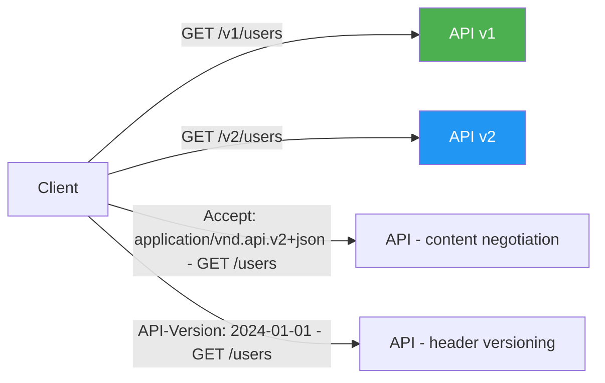

### Pitfalls
- ❌ **No versioning strategy at all:** "We'll never need to break the API" — famous last words; plan for versioning from day one.
- ❌ **Per-endpoint versioning:** `/v1/users` and `/v3/orders` in same API — impossible to know which combination is valid.

### Concept Reference
→ [API Design: REST, GraphQL, gRPC](../../../system-design/fundamentals/api-design-rest-graphql-grpc)

---

## Q2: What is a breaking change vs a non-breaking change in an API?
**Role:** Mid | **Difficulty:** 🟡 | **Priority:** P1 | **Format:** Quick Answer

> **What the interviewer is testing:** Practical knowledge of backward compatibility — essential for any public API team.

### Answer in 60 seconds
**Breaking changes (require new API version):**
- Removing a field from response
- Renaming a field (`user_id` → `userId`)
- Changing field type (`string` → `integer`)
- Changing HTTP status code for existing scenario (200 → 201)
- Making optional field required
- Removing an endpoint
- Changing URL structure
- Restricting enum values (removing a value clients may use)

**Non-breaking changes (safe to add without version bump):**
- Adding new optional field to response
- Adding new optional field to request body
- Adding new endpoint
- Adding new enum values (clients should handle unknown values gracefully)
- Relaxing validation (was required, now optional)
- Adding new HTTP methods to existing resource

**The rule:** If existing client code would break without changes after your deployment, it's a breaking change.

### Diagram

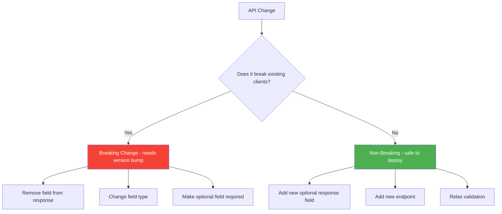

### Pitfalls
- ❌ **Treating new enum values as non-breaking:** If clients use exhaustive switch/if-else on enum values, a new value causes "unhandled case" errors. Document "ignore unknown enum values" as required client behavior.
- ❌ **Changing error message text:** While technically not structural, applications that parse error message strings will break.

### Concept Reference
→ [API Design: REST, GraphQL, gRPC](../../../system-design/fundamentals/api-design-rest-graphql-grpc)

---

## Q3: How does Stripe support API versions dating back to 2011 without breaking clients?
**Role:** Senior | **Difficulty:** 🔴 | **Priority:** P1 | **Format:** Deep Dive

> **What the interviewer is testing:** Deep understanding of API versioning at scale — one of the best-engineered API versioning systems in production.

### Problem Constraints
| Dimension | Value |
|-----------|-------|
| API versions | 35+ versions from 2011 to present |
| Active merchants | Millions using various versions |
| Version mechanism | Date-based: `2023-10-16`, `2011-09-14` |
| Backward compat | Every version works forever (no forced migrations) |

### How Stripe Versioning Works

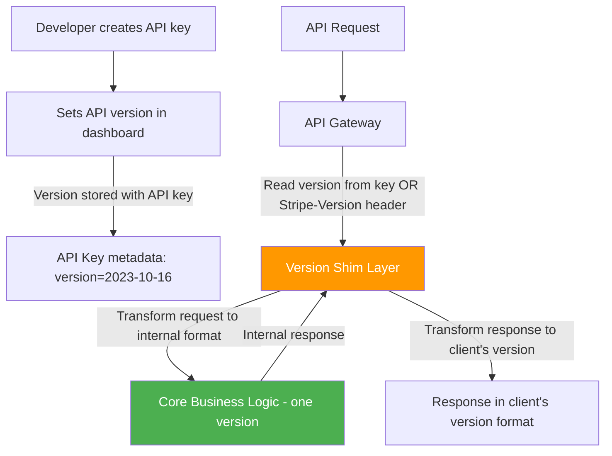

**Key design decisions:**

1. **Version stored per API key, not per request:** Developer sets their version once in the dashboard. Every API call uses that version automatically. They can optionally override with `Stripe-Version` header for testing.

2. **Shim/upgrade layer:** There is ONE canonical internal data model. The version shim translates between any external version and the internal model. Adding a new version = adding a new shim transformation.

3. **Date-based versions:** `2023-10-16` not `v3`. This communicates the exact day behavior changes. Developers know when they last reviewed the changelog.

4. **Changelog-driven development:** Every version change is documented in Stripe's API changelog. Before a new version is released, all changes are documented with migration guides.

5. **Test mode versions:** Developers can test against the latest version in test mode before committing their live keys.

**Shim example (pseudo-code):**
```
// Old version: { "card": { "last4": "4242" } }
// New version: { "payment_method": { "card": { "last4": "4242" } } }

shim_2022_01_01_to_2023_10_16(response):
  response.payment_method = { card: response.card }
  delete response.card
  return response
```

| Dimension | Stripe approach | Naive versioned endpoints |
|-----------|----------------|--------------------------|
| Code duplication | ❌ One codebase | ❌ N codebases |
| Maintenance | One shim per version change | Entire endpoint copy |
| Old version behavior | Guaranteed via shim | Drift over time |
| New feature availability | Per version | Only in new endpoint |

### Recommended Answer
Stripe's approach: **date-based versions, version stored per API key, single canonical internal model with shim layer per version change.** The shim layer is the key insight — it decouples the external API contract from the internal implementation. Adding a new version = adding a shim transformation file, not forking the entire codebase.

### What a great answer includes
- [ ] Explains version stored per API key (not per request)
- [ ] Describes the shim/translation layer concept
- [ ] Notes single internal canonical model
- [ ] References date-based versioning as informative for developers
- [ ] Mentions changelog-driven development discipline

### Pitfalls
- ❌ **Running separate codebases per major version:** v1 and v2 drift apart; v1 never gets security patches; v2 misses v1 bug fixes.
- ❌ **No automated tests for old versions:** Without integration tests per old version, shim layer regressions go undetected.

### Concept Reference
→ [API Design: REST, GraphQL, gRPC](../../../system-design/fundamentals/api-design-rest-graphql-grpc)

---

## Q4: How do you communicate API deprecation to consumers?
**Role:** Senior | **Difficulty:** 🟡 | **Priority:** P1 | **Format:** Quick Answer

> **What the interviewer is testing:** API stewardship skills — technical and communication aspects of deprecation.

### Answer in 60 seconds
**Technical signals:**
1. **`Deprecation` header (RFC 8594):** `Deprecation: Sun, 01 Jan 2025 00:00:00 GMT` — when this endpoint was deprecated
2. **`Sunset` header (RFC 8594):** `Sunset: Sun, 01 Jan 2026 00:00:00 GMT` — when it will stop working
3. **`Link` header:** `Link: <https://api.example.com/docs/migration>; rel="successor-version"` — links to replacement
4. **Response body warning field:** Include `"_warnings": ["This endpoint is deprecated. Migrate to /v2/users by 2026-01-01"]`
5. **HTTP 299 status code:** "Miscellaneous Persistent Warning" — not widely used but spec allows it

**Communication channels:**
- Email to all users who called the deprecated endpoint in last 90 days
- API changelog / release notes
- Dashboard banner for affected accounts
- Developer blog post with migration guide
- Direct account manager outreach for high-volume users

**Timeline recommendations:**
- Internal/private APIs: 3–6 months notice
- Public APIs with self-serve users: 12 months minimum
- Public APIs with large enterprise customers: 18–24 months

### Diagram

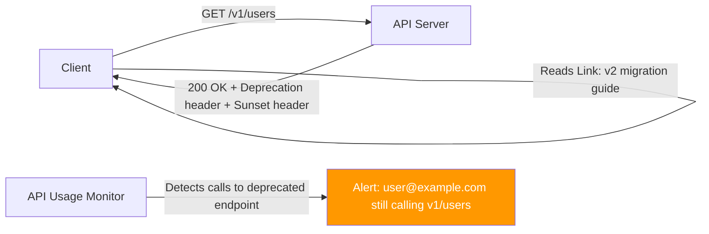

### Pitfalls
- ❌ **Deprecating without a sunset date:** "Deprecated" without a removal date means clients never migrate; set explicit dates.
- ❌ **No usage monitoring:** Without knowing who's still calling the deprecated endpoint, you can't proactively notify them or safely retire it.

### Concept Reference
→ [API Design: REST, GraphQL, gRPC](../../../system-design/fundamentals/api-design-rest-graphql-grpc)

---

## Q5: How do you implement API versioning at the gateway layer without touching services?
**Role:** Senior | **Difficulty:** 🔴 | **Priority:** P2 | **Format:** Deep Dive

> **What the interviewer is testing:** Ability to isolate versioning complexity at the infrastructure layer, keeping services clean.

### Problem Constraints
| Dimension | Value |
|-----------|-------|
| Services | 50+ microservices |
| Team structure | Each team owns their service |
| Versioning goal | External consumers see stable versioned API |
| Constraint | Don't require every service team to implement versioning |

### Approach A — Version Per Service (Decentralized)

```mermaid
graph LR
  C[Client v1] --> GW[Gateway]
  GW -->|/v1/users| US_V1[User Service v1]
  GW -->|/v1/orders| OS_V1[Order Service v1]

  Every service has its own v1 and v2 code
  style US_V1 fill:#f44336,color:#fff
```

Every team implements v1/v2. Inconsistent, duplicated effort, version drift between services.

### Approach B — Gateway-Level Request/Response Transformation

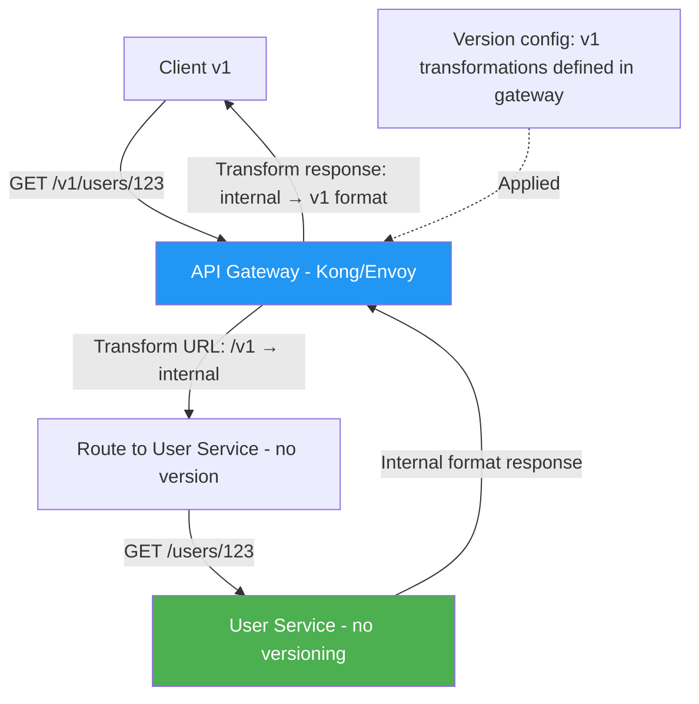

Gateway handles:
1. URL rewriting: `/v1/users` → `/users`
2. Request transformation: old field names → new field names
3. Response transformation: new format → old format
4. Header injection: add/remove headers per version

**Kong plugin example (pseudo-config):**
```yaml
# Kong route transformation plugin
plugins:
  - name: request-transformer
    config:
      rename.headers:
        - "X-Old-Header:X-New-Header"
      rename.body:
        - "old_field_name:new_field_name"
  - name: response-transformer
    config:
      rename.json:
        - "new_field_name:old_field_name"
```

### Approach C — API Gateway Routing with Version Adapter Services

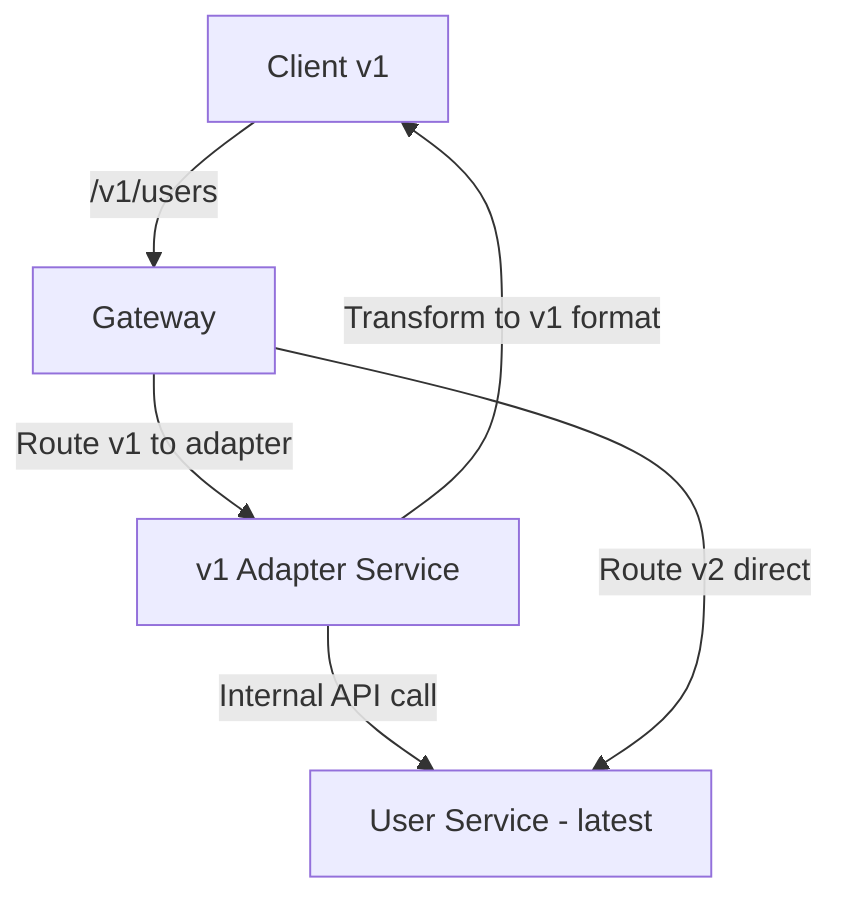

Dedicated lightweight adapter services per major version. More flexible than pure gateway transformation; can handle complex transformation logic. Adapter is the "shim" layer moved to its own service.

| Dimension | Per-service versioning | Gateway transformation | Adapter service |
|-----------|----------------------|----------------------|-----------------|
| Service team burden | High | None | Low |
| Transformation complexity | Unlimited | Limited (config-based) | Unlimited |
| Maintenance | Distributed | Centralized | Semi-centralized |
| Latency overhead | 0ms | ~1ms | ~2ms |

### Recommended Answer
**Approach B for simple transformations** (field renames, URL rewrites, header changes). **Approach C for complex business logic transformations** that can't be expressed in gateway config. Both keep individual services clean and free of version-awareness.

### What a great answer includes
- [ ] Distinguishes URL routing from response transformation
- [ ] Explains that gateway-level versioning keeps services clean
- [ ] Notes complexity limits of config-based transformation (gateway approach)
- [ ] Mentions adapter service pattern for complex transformations
- [ ] References real gateway tools (Kong, Envoy, AWS API Gateway)

### Pitfalls
- ❌ **Gateway as a bottleneck:** Complex transformations in gateway increase gateway latency and become a single point of failure.
- ❌ **Not testing old version transformations in CI:** Gateway transformation rules must be tested against old version contracts.

### Concept Reference
→ [API Design: REST, GraphQL, gRPC](../../../system-design/fundamentals/api-design-rest-graphql-grpc)

---

## Q6: What is a sunset header and when should you send it?
**Role:** Senior | **Difficulty:** 🟡 | **Priority:** P2 | **Format:** Quick Answer

> **What the interviewer is testing:** Knowledge of HTTP deprecation standards and responsible API lifecycle management.

### Answer in 60 seconds
**Sunset header (RFC 8594):** An HTTP response header indicating the date and time after which the resource or endpoint will no longer be available.

```
HTTP/1.1 200 OK
Deprecation: Mon, 01 Jan 2024 00:00:00 GMT
Sunset: Sun, 01 Jan 2026 00:00:00 GMT
Link: <https://docs.api.com/v2-migration>; rel="successor-version"
```

**When to send it:**
- On every response from deprecated endpoints — not just once
- Starting from the deprecation announcement date
- At minimum 12 months before the sunset date for public APIs

**What clients should do:**
- Parse `Sunset` header and alert developers: "Warning: This endpoint sunset on 2026-01-01"
- Many API client libraries (HTTPie, Postman) display sunset warnings automatically
- SDK generators can emit compilation warnings for deprecated API versions

**Monitoring approach:**
- Track API usage by version; send proactive email to developers still calling deprecated endpoints 3 months before sunset
- Cloudflare Workers / API Gateway can inject Sunset headers automatically on routes marked deprecated

### Diagram

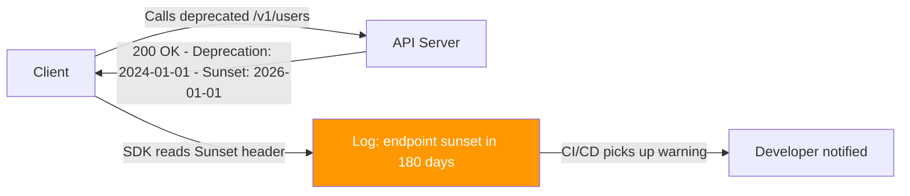

### Pitfalls
- ❌ **Sending Sunset header only once:** Clients miss it; send on every response from the deprecated endpoint.
- ❌ **Not honoring the sunset date:** Keeping the endpoint running past sunset makes future sunsets unbelievable; once you set a date, stick to it.

### Concept Reference
→ [API Design: REST, GraphQL, gRPC](../../../system-design/fundamentals/api-design-rest-graphql-grpc)

---

## Q7: How do you version GraphQL APIs (hint: you usually don't — how)?
**Role:** Staff | **Difficulty:** 🔴 | **Priority:** P2 | **Format:** Quick Answer

> **What the interviewer is testing:** Understanding of GraphQL's schema evolution approach vs REST versioning.

### Answer in 60 seconds
**GraphQL's approach:** No URL-based versioning. Instead, use **additive schema evolution**:

1. **Deprecate fields, don't remove them:**
   ```graphql
   type User {
     name: String @deprecated(reason: "Use displayName instead")
     displayName: String!
   }
   ```
   Old clients keep working; new clients use `displayName`. Monitor usage with analytics; remove field when usage hits 0.

2. **Add new fields without removing old ones:**
   GraphQL clients explicitly declare fields they want; new fields don't break old queries.

3. **Use nullable types for new required fields:**
   New fields must be nullable to not break old clients that don't select them.

**When REST-style versioning IS needed in GraphQL:**
- Major behavioral change (not just schema): `/graphql/v2` endpoint
- Federation: schema federation allows per-subgraph versioning
- Breaking type system changes (e.g., changing from Int to String for an ID type)

**GitHub's approach:** v3 was REST, v4 is GraphQL at new endpoint — they didn't version within GraphQL; they used a new endpoint for the paradigm shift.

### Diagram

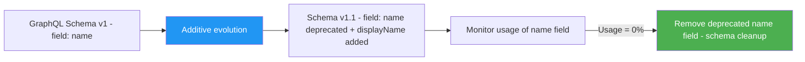

### Pitfalls
- ❌ **Removing deprecated fields before usage is zero:** Clients using `name` get null/error unexpectedly. Always instrument before removing.
- ❌ **Never cleaning up deprecated fields:** Schema becomes unmanageably large; set a deprecation → removal timeline (6–12 months).

### Concept Reference
→ [API Design: REST, GraphQL, gRPC](../../../system-design/fundamentals/api-design-rest-graphql-grpc)

---

## Q8: How do you version APIs in a microservices environment with 50+ services?
**Role:** Staff | **Difficulty:** 🔴 | **Priority:** P2 | **Format:** Deep Dive

> **What the interviewer is testing:** Enterprise-scale versioning strategy with team autonomy and governance.

### Problem Constraints
| Dimension | Value |
|-----------|-------|
| Services | 50+ independent microservices |
| Teams | 10+ teams, each owning 3–7 services |
| External API | Single versioned API surface presented to consumers |
| Internal APIs | Service-to-service — different versioning needs |

### Architecture Overview

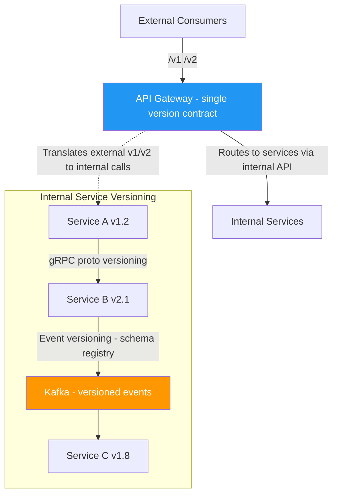

**External API versioning (consumer-facing):**
- Single gateway manages external versioning
- Internal services can evolve independently
- Gateway transformation handles external → internal API translation
- Breaking external changes require new external version

**Internal API versioning (service-to-service):**
1. **gRPC + Protobuf:** Field number-based, backward compatible by default. Package-level major versions (`payment.v1`, `payment.v2`) for breaking changes.
2. **REST internal APIs:** Treat as private; teams negotiate migration directly; use version headers, not URL versioning.
3. **Async events (Kafka/SNS):** Schema Registry (Confluent, AWS Glue) enforces schema compatibility on producer. Consumers must handle unknown fields. Event versioning: `order.placed.v1`, `order.placed.v2` as separate topics or `version` field in payload.

**Governance model:**
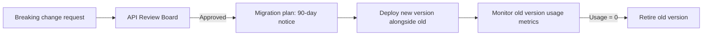

| API type | Versioning strategy | Breaking change process |
|----------|--------------------|-----------------------|
| External REST | URL versioning (/v1, /v2) | RFC process, 12-month notice |
| Internal REST | Header versioning | Team-to-team negotiation, 30-day notice |
| gRPC | Package versioning | Proto compatibility rules |
| Kafka events | Schema registry | Additive-only or new topic |

### Recommended Answer
**External API:** Central gateway owns the external versioning contract; teams deploy services independently. **Internal APIs:** Protobuf field compatibility for gRPC; schema registry enforcement for events; direct team negotiation for REST. API review board processes breaking changes. Monitor all version usage with metrics before retirement.

### What a great answer includes
- [ ] Distinguishes external vs internal versioning needs
- [ ] Identifies schema registry as key tool for event versioning
- [ ] Describes governance/review process for breaking changes
- [ ] Notes usage monitoring before retirement
- [ ] Mentions gateway as the isolation layer

### Pitfalls
- ❌ **Same versioning approach for external and internal APIs:** Internal APIs change faster; same strict process slows teams down.
- ❌ **No schema registry for events:** Kafka consumers silently break when producers change message format; schema registry catches this at deployment.

### Concept Reference
→ [Microservices Migration](../../../system-design/scale-and-reliability/microservices-migration)

---

## Q9: How does Twitter manage API versioning across millions of third-party integrations?
**Role:** Staff | **Difficulty:** 🔴 | **Priority:** P3 | **Format:** Quick Answer

> **What the interviewer is testing:** Real-world knowledge of large-scale API ecosystem management.

### Answer in 60 seconds
**Twitter API history:**
- **v1.0 (2006–2013):** No auth required for public data → massive ecosystem built
- **v1.1 (2013):** Required OAuth for all endpoints (breaking) → developer backlash but necessary for abuse prevention
- **v2 (2020–present):** Complete redesign with better filtering, conversation threads, annotation fields

**How Twitter managed the transitions:**

1. **Long parallel run:** v1.1 and v2 ran simultaneously for 2+ years; developers had time to migrate
2. **Tiered access model:** Free/Basic/Pro tiers on v2 with different rate limits — monetization while maintaining ecosystem
3. **Migration guides per endpoint:** Every v1.1 endpoint had a documented v2 equivalent or explicit "no equivalent" statement
4. **App whitelisting for extensions:** Academic Research access, Ads API access — different versions for different use cases
5. **Sunset via policy, not technical:** Twitter didn't break v1.1 technically; they changed rate limits to 0 RPM, effectively killing it

**Lesson:** At ecosystem scale, you can't force migration via technical means — you need business model incentives, extended timelines, and very clear migration paths.

### Diagram

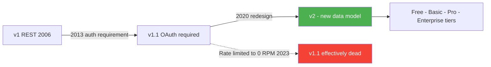

### Pitfalls
- ❌ **Abrupt retirement kills ecosystem trust:** Twitter's 2023 API changes (sudden paid-only) destroyed goodwill; plan changes months in advance.
- ❌ **No migration automation:** Providing a migration tool (API compatibility layer) dramatically increases migration rates.

### Concept Reference
→ [API Design: REST, GraphQL, gRPC](../../../system-design/fundamentals/api-design-rest-graphql-grpc)

---

## Q10: Design a versioning strategy for a public API with 10K developers
**Role:** Senior | **Difficulty:** 🟡 | **Priority:** P1 | **Format:** Scenario

**Real Company:** Stripe, Twilio, SendGrid

### The Brief
> "You're launching a public REST API that will have 10,000 developers building on it. Design a versioning strategy that lets you evolve the API over 5 years without breaking existing integrations, while efficiently communicating changes."

### Clarifying Questions
1. What is the release cadence? (monthly? quarterly? when ready?)
2. What types of breaking changes are anticipated? (new data model, auth changes, pricing?)
3. What's the team size managing API governance?
4. Are there enterprise customers with SLA requirements on API stability?
5. Will there be webhook/event API in addition to REST?

### Back-of-Envelope Estimation
| Metric | Calculation | Result |
|--------|-------------|--------|
| Developers | 10K | 10K |
| Integration changes per developer | 2/year average | 20K changes/year |
| Breaking changes per year | Aim: 0–1 per year | 1 max |
| Version overlap period | 18 months | 1.5 years of dual support |
| Support cost per old version | ~20% of API team capacity | 1 old version = 20% overhead |

### High-Level Versioning Architecture

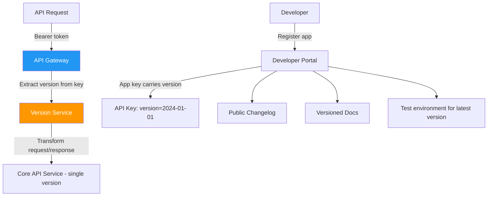

### Versioning Strategy Design

**Version scheme:** Date-based (`YYYY-MM-DD`) — communicates when you last reviewed changes. `2024-01-15` is more informative than `v3`.

**Version assignment:** Version stored per API key. Developers opt into new versions explicitly.

**Release process:**
```
1. Design breaking change → RFC document → 30-day public comment period
2. Publish new version in test environment → 60 days beta
3. Launch new version → set sunset date on old version (18 months out)
4. Monitor old version usage monthly → proactive outreach at 6 months before sunset
5. Retire old version on announced date
```

### Communication Strategy
| Channel | Timing | Audience |
|---------|--------|----------|
| Email announcement | Version launch | All registered developers |
| Dashboard banner | 6 months before sunset | Developers still on old version |
| API response headers | Every deprecated call | Programmatic notification |
| Direct outreach | 3 months before sunset | High-volume old-version users |
| Blog post + migration guide | Version launch | Community |

### Trade-off Decisions
| Decision | Option A | Option B | Chosen | Why |
|----------|----------|----------|--------|-----|
| Version in URL vs header | URL: /v1/ /v2/ | Header: API-Version | URL | Visible, CDN-friendly, most developer-friendly |
| Release cadence | Time-based quarterly | Feature-based when ready | Feature-based | Don't ship unnecessary breaking changes |
| Support window | 12 months | 24 months | 18 months | Balance stability vs maintenance burden |
| Forced migration | Hard cutoff | Soft (rate limit old version) | Hard cutoff | Soft cutoffs don't work; developers ignore rate limits |

### Failure Modes
| Failure | Impact | Mitigation |
|---------|--------|------------|
| Breaking change ships accidentally | Thousands of integrations break | Automated compatibility tests (Optic/Spectral) in CI/CD |
| Sunset date too aggressive | Developer backlash | Announce 18 months out; adjust if >1000 active users remain |
| No usage monitoring | Can't identify who to notify | Instrument every API call by version; store in analytics |
| Migration guide incomplete | Developers can't migrate | Changelog-driven: no version launches without migration guide for every breaking change |

### Concept References
→ [API Design: REST, GraphQL, gRPC](../../../system-design/fundamentals/api-design-rest-graphql-grpc)
→ [Rate Limiting](../../../system-design/fundamentals/rate-limiting)
