# DNS & Load Balancing

10 questions covering DNS resolution, TTL, GeoDNS, anycast routing, DNS failover, and global SaaS routing design.

---

## Q1: How does DNS resolution work (recursive resolver, authoritative nameserver)?
**Role:** Mid, Backend | **Difficulty:** 🟡 | **Priority:** P0 | **Format:** Quick Answer

> **What the interviewer is testing:** Understanding of the DNS hierarchy — essential for reasoning about caching, TTL, and DNS-based load balancing.

### Answer in 60 seconds
DNS resolution involves 4 types of servers in a hierarchy:

1. **Client stub resolver:** OS library that handles DNS. Checks local cache first. Queries recursive resolver if miss.

2. **Recursive resolver (DNS resolver):** Your ISP's or Google's (8.8.8.8) / Cloudflare's (1.1.1.1) DNS server. Does the actual work of resolving by walking the DNS tree. Caches results for TTL duration.

3. **Root nameserver:** 13 root server IP addresses (A through M). Knows which TLD nameservers to ask. "Who handles .com? → Verisign."

4. **TLD nameserver:** Handles top-level domains (.com, .io, .org). "Who handles example.com? → ns1.exampledns.com."

5. **Authoritative nameserver:** The source of truth for a domain. Holds actual DNS records (A, CNAME, MX, TXT). Returns the IP address.

**Full lookup (cold):**
```
Client → Recursive resolver (cache miss)
Recursive resolver → Root nameserver (who handles .com?)
Root → Verisign TLD (ns1.example.com is authoritative)
Recursive → Authoritative nameserver (what's api.example.com?)
Authoritative → 93.184.216.34
Recursive → Client (caches for TTL)
```
Total: 3–4 UDP round trips ≈ 100–300ms (cold). Cached: 0–1ms.

### Diagram

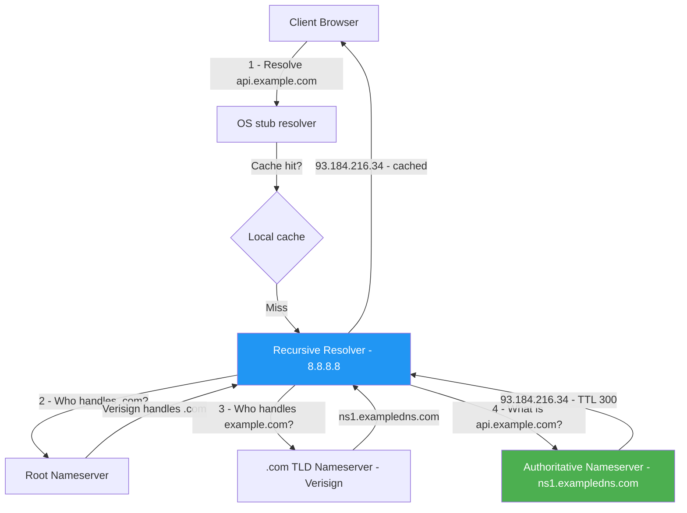

### Pitfalls
- ❌ **"DNS is just a phonebook":** DNS is a distributed system with caching, TTL, negative caching, and multiple record types — understanding the full resolution chain matters for failover design.
- ❌ **Confusing recursive resolver with authoritative nameserver:** The recursive resolver (ISP, 8.8.8.8) caches and walks the tree; the authoritative nameserver is the source of truth.

### Concept Reference

---

## Q2: What is DNS TTL and how does it affect failover speed?
**Role:** Mid | **Difficulty:** 🟡 | **Priority:** P0 | **Format:** Quick Answer

> **What the interviewer is testing:** Understanding the trade-off between caching efficiency and failover speed.

### Answer in 60 seconds
**TTL (Time To Live):** How long (in seconds) recursive resolvers cache a DNS record. After TTL expires, they re-query the authoritative nameserver.

**TTL values and their effects:**

| TTL | Cache duration | Failover speed | DNS query load |
|-----|---------------|----------------|----------------|
| 60s | 1 minute | ~1 min | High (60× more queries) |
| 300s | 5 minutes | ~5 min | Moderate |
| 3600s | 1 hour | ~1 hour | Low |
| 86400s | 1 day | ~24 hours | Very low |

**Failover scenario:**
- Your API server has TTL = 3600 (1 hour)
- Server fails; you change DNS record to new IP
- Users with cached old record continue sending to failed server for up to 1 hour
- Only users who query DNS after the change get the new IP

**Recommended strategy:**
- Normal operation: TTL = 300–3600s (5 min to 1 hour) — balance caching vs load
- Pre-failover preparation: Reduce TTL to 60s 1 hour before planned maintenance. After TTL propagates (wait 1 hour), perform maintenance — failover takes <60s.
- Post-failover: Restore TTL to 300s to reduce DNS query load.

**Negative TTL (NXDOMAIN TTL):** How long "domain not found" is cached. Set in SOA record. Short negative TTL means DNS flapping propagates quickly.

### Diagram

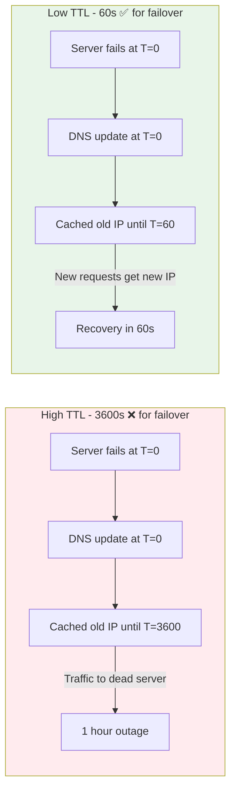

### Pitfalls
- ❌ **Always low TTL:** Extremely low TTL (< 60s) increases DNS query volume significantly — can overload authoritative nameserver; increases user latency (more cache misses).
- ❌ **Changing TTL during the outage:** The old TTL is what's cached; changing TTL now takes effect only for queries after current cache entries expire.

### Concept Reference

---

## Q3: How does DNS-based load balancing work and what are its limitations?
**Role:** Senior | **Difficulty:** 🔴 | **Priority:** P1 | **Format:** Deep Dive

> **What the interviewer is testing:** Understanding why DNS LB is simple but fundamentally limited at scale.

### Problem Constraints
| Dimension | Value |
|-----------|-------|
| Servers | 10 backend servers |
| Traffic | 100K requests/second |
| Goal | Distribute load evenly |
| Challenge | DNS caching prevents true per-request balancing |

### Approach A — Round-Robin DNS

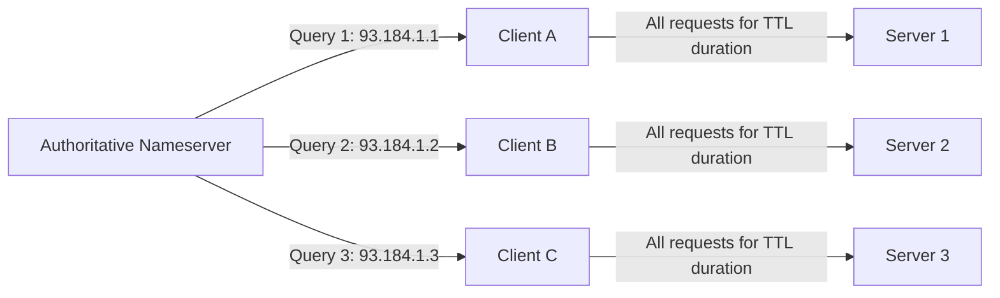

Authoritative nameserver cycles through A records. Different clients get different IPs. Simple round-robin at DNS query level.

**Critical limitation:** DNS doesn't know how many requests each IP handles. A client with 1 user and a client with 10,000 users get the same IP. TTL = 5 minutes → that 10,000-user client sends to same server for 5 minutes.

### Approach B — DNS with Health Checks (Route53 style)

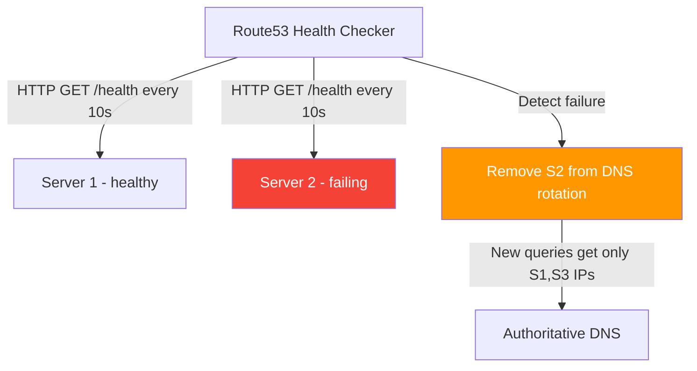

Health-checked DNS removes failed servers. Propagation delay = TTL + health check interval (10s + TTL).

### DNS LB Limitations

| Limitation | Impact | True Fix |
|-----------|--------|----------|
| No per-request routing | Hot clients overload one server | L7 load balancer |
| TTL caching | Failover takes 60s+ | Short TTL + health checks |
| No session affinity | Can't stick user to same server | L7 LB with session cookies |
| No connection count awareness | Can't route to least-loaded | L7 LB with real-time metrics |
| IPv4/IPv6 complexity | Different A/AAAA records needed | Use CNAME to managed LB |

**DNS LB best use cases:**
- Geographic routing (GeoDNS) — route US users to US cluster
- Global server load balancing (GSLB) — distribute across multiple data centers
- Initial tier before L7 LB (two-tier: DNS for data center → L7 LB for server)
- CDN edge selection (every CDN uses DNS-based routing)

### Recommended Answer
DNS LB works for **data center / region selection** but not for per-server load balancing. Use DNS to route to the nearest/healthiest cluster, then use a traditional L7 load balancer within the cluster for per-server distribution. This two-tier model is the standard pattern used by every major platform.

### What a great answer includes
- [ ] Explains TTL caching as the fundamental limitation (not per-request routing)
- [ ] Distinguishes DNS LB for region selection vs L7 LB for server selection
- [ ] Notes health-check integration for automatic failover
- [ ] Gives concrete failover timing (TTL + health check interval)
- [ ] Recommends two-tier model

### Pitfalls
- ❌ **Using DNS LB alone for production traffic distribution:** Without L7 LB, uneven load is guaranteed when some clients have much higher request rates.
- ❌ **Long TTL with health-check failover:** 1-hour TTL + health-check based failover = 1-hour outage window; set TTL to 60s for health-checked records.

### Concept Reference

---

## Q4: What is GeoDNS and how does it route users to the nearest region?
**Role:** Senior | **Difficulty:** 🟡 | **Priority:** P1 | **Format:** Quick Answer

> **What the interviewer is testing:** Understanding of DNS-based geographic routing and its implementation.

### Answer in 60 seconds
**GeoDNS:** Returns different DNS records based on the geographic location of the querying DNS resolver. Users in the US get US server IPs; EU users get EU IPs.

**How it works:**
1. User's DNS resolver sends query to authoritative nameserver
2. Authoritative nameserver checks resolver's IP → geolocates it (MaxMind, IP2Location databases)
3. Returns the A record for the closest/best region
4. User connects to nearest server — lower latency

**Implementation options:**
- **AWS Route53:** Latency-based routing, geolocation routing (by country/continent), geoproximity routing
- **Cloudflare:** Automatic geolocation-based routing; no configuration needed on Cloudflare CDN
- **NS1, Dyn:** Advanced DNS platforms with traffic management features
- **Self-hosted:** Bind9 + GeoIP module + MaxMind database (maintenance-heavy)

**Latency improvement:**
- User in Singapore to US West Coast server: 200ms RTT
- User in Singapore to Singapore server: 10ms RTT
- GeoDNS improvement: 190ms per request × 1000 RPS = 190s of latency saved per second

**Caveat:** GeoDNS uses resolver IP for geolocation, not client IP. Corporate VPN users geolocate to VPN server's location. Google Public DNS (8.8.8.8) passes EDNS client subnet (ECS) extension to improve geolocation accuracy.

### Diagram

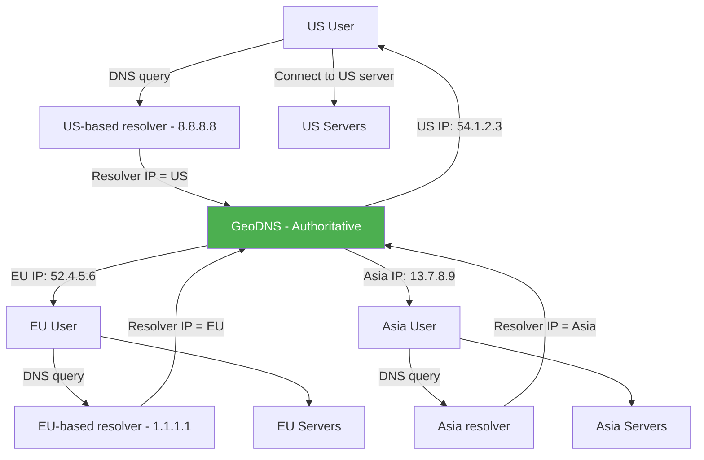

### Pitfalls
- ❌ **Geolocation by resolver IP (not client IP):** Corporate proxies, VPNs, and Google DNS with ECS disabled all cause inaccurate routing.
- ❌ **GeoDNS without health checks:** If the nearest region fails, GeoDNS still sends users there. Combine with health-checked failover.

### Concept Reference

---

## Q5: How does anycast routing work and how does Cloudflare use it?
**Role:** Senior | **Difficulty:** 🔴 | **Priority:** P2 | **Format:** Deep Dive

> **What the interviewer is testing:** Network-level routing knowledge — anycast is how CDNs and DDoS protection services achieve global scale.

### Problem Constraints
| Dimension | Value |
|-----------|-------|
| Cloudflare network | 300+ PoPs globally |
| DDoS attack size | Up to 2 Tbps |
| Goal | Route users to nearest PoP automatically |
| Constraint | Cannot use GeoDNS for every IP (too slow to update) |

### What is Anycast

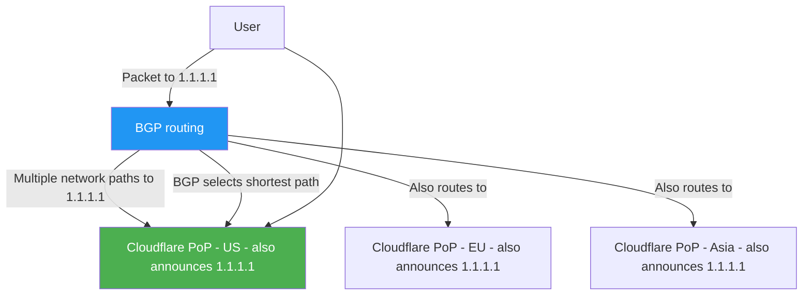

**Anycast:** Same IP address announced from multiple physical locations via BGP. Internet's BGP routing protocol routes each packet to the **nearest** location advertising that IP (measured in BGP path length, roughly geographic proximity).

Unlike GeoDNS (DNS-level routing), anycast routing happens at the **network layer** (Layer 3) — no DNS lookup needed, no caching delays.

**Cloudflare's anycast implementation:**
1. Cloudflare announces the same IP block (e.g., 104.16.0.0/12) from all 300+ data centers
2. BGP routing selects the shortest network path to each client
3. User's traffic goes to the geographically nearest Cloudflare PoP
4. PoP serves from cache or proxies to origin
5. No GeoDNS needed — routing is automatic via BGP

**DDoS absorption with anycast:**
- 2 Tbps DDoS attack against `104.16.0.0/12`
- Traffic is distributed across 300 PoPs → each PoP absorbs ~6.7 Gbps (manageable)
- Without anycast: 2 Tbps hits single origin → instant saturation
- Anycast effectively distributes DDoS attack capacity across the entire network

**Anycast vs GeoDNS:**

| Dimension | Anycast | GeoDNS |
|-----------|---------|--------|
| Routing layer | Network (BGP, L3) | Application (DNS) |
| Latency to take effect | Seconds (BGP propagation) | Minutes (DNS TTL) |
| Failover speed | BGP reconvergence ~30–60s | DNS TTL dependent |
| Granularity | Per-packet routing | Per-DNS-query routing |
| Use case | CDN, DNS resolvers, DDoS protection | Multi-region origin selection |

### Recommended Answer
Anycast uses **BGP to announce the same IP from multiple locations**. Internet routing automatically selects the nearest advertisement. Cloudflare announces all IPs from 300+ PoPs — users automatically connect to the nearest PoP without any application-layer routing. Anycast absorbs DDoS attacks by distributing attack traffic across the entire network rather than concentrating it on one target.

### What a great answer includes
- [ ] Explains BGP as the routing mechanism (not DNS)
- [ ] Distinguishes anycast from GeoDNS (network layer vs application layer)
- [ ] Describes DDoS absorption via traffic distribution
- [ ] Notes BGP convergence time as the failover window (~30–60s)
- [ ] Mentions use cases: CDN, DNS resolvers (1.1.1.1, 8.8.8.8), NTP servers

### Pitfalls
- ❌ **Anycast and GeoDNS are the same thing:** Anycast is IP-level routing via BGP; GeoDNS is DNS-level routing. Completely different mechanisms.
- ❌ **Anycast for stateful services:** TCP connections route to nearest PoP; if BGP path changes mid-session, connection resets. Anycast is best for stateless (UDP DNS, HTTP/3) or connection-short protocols.

### Concept Reference

---

## Q6: How do you implement DNS failover — what TTL do you set and why?
**Role:** Senior | **Difficulty:** 🟡 | **Priority:** P2 | **Format:** Quick Answer

> **What the interviewer is testing:** Practical DNS configuration knowledge for reliability engineering.

### Answer in 60 seconds
**DNS failover:** Automatically changing DNS records when a server fails, redirecting traffic to a healthy alternative.

**Standard implementation (AWS Route53 pattern):**
1. Primary A record: `api.example.com → 1.2.3.4` (primary server)
2. Secondary A record: `api.example.com → 5.6.7.8` (standby server)
3. Route53 health checks: HTTP GET `/health` every 10 seconds from 3+ AWS regions
4. If health check fails for 3 consecutive checks (30 seconds), promote secondary

**TTL strategy for failover records:**
- Set TTL = 60s for health-checked failover records
- Rationale: With 60s TTL, cached old IP expires within 1 minute after DNS update
- Total failover time: 30s (health check detection) + 60s (TTL expiry) = ~90s max
- Trade-off: 60s TTL = 60× more DNS queries than 3600s TTL; acceptable for critical endpoints

**TTL pre-staging for planned maintenance:**
- 24 hours before: Reduce TTL from 3600s → 60s
- Perform maintenance (DNS update takes <60s to propagate)
- After maintenance: Restore TTL to 300s

**Cost of short TTL:**
- 1M users × 60s TTL → each user queries DNS every 60s = 16,667 DNS queries/sec
- Route53 pricing: $0.40 per million queries → ~$580/month at this rate
- Compare: 300s TTL = $116/month. 60s = $580/month

### Diagram

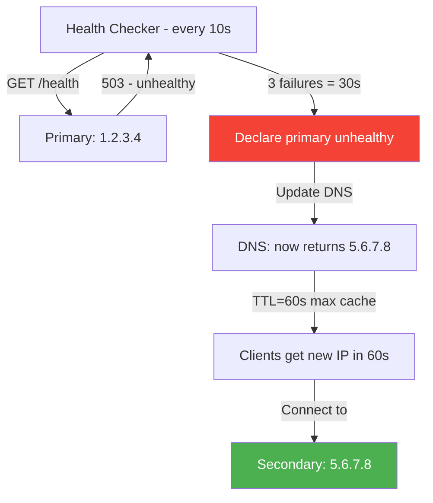

### Pitfalls
- ❌ **Health checks from single region:** A regional network issue may make your server appear down globally when it's fine. Use multi-region health checks (Route53 checks from 3+ regions).
- ❌ **Forgetting negative DNS caching:** NXDOMAIN (domain not found) is cached too. If you accidentally delete a DNS record, clients cache the "not found" for the negative TTL (from SOA record).

### Concept Reference

---

## Q7: What is split-horizon DNS and when do you use it?
**Role:** Staff | **Difficulty:** 🔴 | **Priority:** P2 | **Format:** Quick Answer

> **What the interviewer is testing:** Advanced DNS configuration knowledge for internal/external network separation.

### Answer in 60 seconds
**Split-horizon DNS (split-brain DNS):** Returning different DNS records for the same hostname depending on where the query originates (internal network vs external internet).

**Use case:**
- `api.example.com` — externally resolves to public load balancer IP (1.2.3.4)
- `api.example.com` — internally (within VPC) resolves to internal private IP (10.0.1.50)
- Result: Internal services talk directly to each other without going through NAT/load balancer

**Why it matters:**
- Without split-horizon: Internal service queries external DNS → gets public IP → traffic routes out through NAT → back in through load balancer → internal service. Adds 5–20ms latency and NAT gateway costs.
- With split-horizon: Internal query → private IP → direct connection. 0.5ms latency, no NAT cost.

**Implementation:**
- AWS Route53 Private Hosted Zones: Create private zone for `example.com` in VPC; queries from VPC use private records; public DNS unchanged
- Bind9: Different `view` blocks for internal/external resolvers
- CoreDNS (Kubernetes): Forward specific domains to internal DNS

**Security benefit:** Internal endpoints (admin API, database connections) don't appear in public DNS; reduces attack surface.

### Diagram

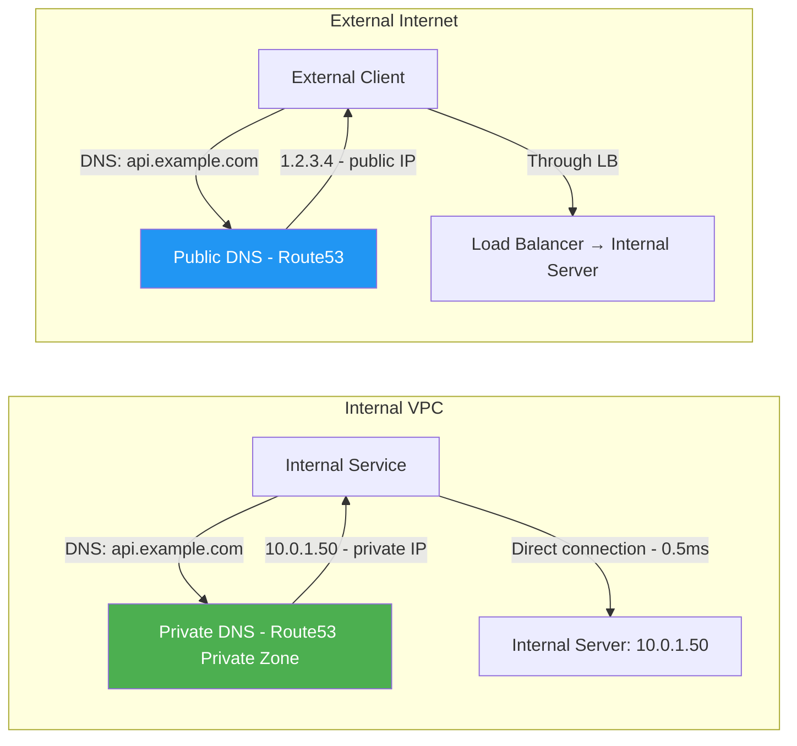

### Pitfalls
- ❌ **Split-horizon and VPN users:** Developers using VPN from home may get internal DNS (connected to VPN) OR external DNS depending on VPN split-tunneling config. Test both paths.
- ❌ **Forgetting to update both zones:** Changing the hostname requires updating both private and public DNS zones; easy to miss one.

### Concept Reference

---

## Q8: How does Cloudflare use DNS for DDoS protection (filtering at DNS layer)?
**Role:** Staff | **Difficulty:** 🔴 | **Priority:** P2 | **Format:** Deep Dive

> **What the interviewer is testing:** Understanding of how CDN/DDoS protection providers operate at the DNS + network layer.

### Problem Constraints
| Dimension | Value |
|-----------|-------|
| Attack size | Up to 2 Tbps (Cloudflare's peak mitigated) |
| Attack type | Volumetric (UDP flood), application (HTTP flood) |
| Goal | Absorb attack without exposing origin IP |
| Key insight | Must hide origin; if attacker finds origin IP, bypass Cloudflare |

### DNS Layer: The Entry Point

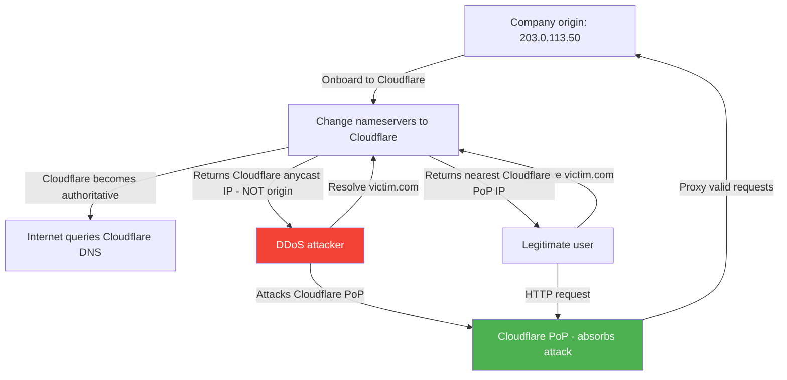

**DNS layer protection mechanisms:**

1. **IP hiding:** Cloudflare becomes the authoritative DNS and returns their own anycast IPs. Origin IP (`203.0.113.50`) never appears in public DNS. Attacker can't find origin IP to bypass Cloudflare.

2. **DNS flood protection:** Cloudflare's DNS resolvers (1.1.1.1, anycast) serve as public DNS infrastructure. Malicious DNS query floods are absorbed by Cloudflare's 300+ PoP network via anycast.

3. **DNSSEC:** Cloudflare adds DNSSEC signing to prevent DNS cache poisoning attacks (attacker injecting false DNS responses).

4. **DNS over HTTPS (DoH):** `1.1.1.1` supports DoH — DNS queries encrypted inside HTTPS. Prevents ISP surveillance and DNS hijacking.

5. **Rate limiting at DNS layer:** Cloudflare limits query rates per source IP at their resolvers, blocking DNS amplification attacks (tiny DNS query → massive response) before they hit targets.

**Origin IP leak prevention:**
- If origin IP leaks (historical records, SSL cert, email headers), attackers bypass Cloudflare entirely
- Cloudflare recommends: Only allow inbound traffic from Cloudflare IP ranges at firewall level
- Cloudflare Tunnels (Argo Tunnel): Origin makes outbound connection to Cloudflare — origin never needs to accept inbound connections; eliminates IP leak risk entirely

### Recommended Answer
Cloudflare's DNS-layer protection works by: **being the authoritative DNS** (hiding origin IP), **anycast distribution** (spreading attack traffic across 300 PoPs), **rate limiting at DNS resolvers**, and **Tunnels** (origin makes outbound connection — no inbound needed, no IP exposure). DDoS mitigation starts before packets even reach the application layer.

### What a great answer includes
- [ ] Explains why DNS onboarding (changing nameservers to Cloudflare) is the first step
- [ ] Describes IP hiding as the critical prerequisite
- [ ] Notes anycast distribution for attack absorption
- [ ] Mentions Cloudflare Tunnels for eliminating origin IP exposure
- [ ] References DNS amplification as a DNS-layer attack vector

### Pitfalls
- ❌ **"Just point DNS at Cloudflare to be fully protected":** If origin IP is discoverable (old DNS records, leaked emails), attacker bypasses protection.
- ❌ **Ignoring DNS amplification:** Public DNS resolvers can be used for amplification attacks; Cloudflare's resolver implements rate limiting to prevent this.

### Concept Reference

---

## Q9: Why does DNS propagation take "up to 48 hours" and how do you mitigate it during deployments?
**Role:** Staff | **Difficulty:** 🔴 | **Priority:** P3 | **Format:** Quick Answer

> **What the interviewer is testing:** Myth-busting DNS propagation and practical deployment strategies.

### Answer in 60 seconds
**The "48 hours" myth and reality:**
- "48 hours" comes from old ISP resolvers that cached records for 24–48 hours regardless of TTL
- Modern resolvers respect TTL; propagation time = TTL value
- With TTL = 60s, actual propagation = ~60–120s globally
- The 48-hour claim is outdated (mostly applies to very old Internet infrastructure)

**Why it can still be slow:**
1. **Recursive resolvers not respecting TTL:** Some ISP resolvers cache longer than specified TTL (violating RFC)
2. **Negative TTL:** NXDOMAIN cached for long periods
3. **Long TTL set before change:** If your record had TTL = 86400 before the change, old value cached for up to 24h
4. **Second-order caching:** Enterprise resolvers → corporate DNS caches → workstation caches — multiple layers, each with its own TTL tracking

**Mitigation strategies for deployments:**

| Strategy | How | When |
|----------|-----|------|
| Pre-staging | Reduce TTL to 60s 24h before deployment | Planned maintenance |
| Blue-green via DNS | Both old and new IPs in DNS simultaneously | Zero-downtime deploy |
| Weighted routing | Gradually shift traffic: 10% → 50% → 100% | Canary release |
| Monitoring | Check propagation via dnschecker.org or dig from multiple locations | After DNS change |

**The real deployment pattern:**
```
T-24h: Change TTL from 3600s to 60s
T-23h: Wait for old 3600s caches to expire
T-0: Deploy new server; update DNS A record
T+1m: 99% of users on new IP
T+1h: Restore TTL to 300s
```

### Diagram


### Pitfalls
- ❌ **Changing TTL at deployment time:** The old TTL is already cached; changing TTL only affects future queries after current cached entries expire.
- ❌ **Not monitoring propagation:** Use `dig @8.8.8.8 api.example.com` and `dig @1.1.1.1` to verify both major resolvers have updated; use dnschecker.org for global view.

### Concept Reference

---

## Q10: Design DNS routing for a global SaaS with US, EU, and Asia regions
**Role:** Senior | **Difficulty:** 🟡 | **Priority:** P1 | **Format:** Scenario

**Real Company:** Salesforce, Workday, Atlassian (Jira/Confluence Cloud)

### The Brief
> "Design the DNS routing strategy for a global SaaS application with infrastructure in US (us-east-1), Europe (eu-west-1), and Asia (ap-southeast-1). Design for: lowest latency routing, health-check-based failover, compliance (EU data stays in EU), and CDN integration."

### Clarifying Questions
1. Is EU data residency a hard compliance requirement? (GDPR data locality)
2. Are tenants locked to a region or can they migrate?
3. What latency SLA? (< 100ms for all regions?)
4. Is there a global control plane or is each region fully independent?
5. Static assets + API on same domain or separate?

### Back-of-Envelope Estimation
| Metric | Calculation | Result |
|--------|-------------|--------|
| Global DAU | 5M | 5M |
| API requests/user/day | 200 | 1B requests/day |
| Average RPS | 1B / 86400 | ~11,600 RPS |
| Peak RPS | 5× average | ~58,000 RPS |
| Regional split | 40% US, 40% EU, 20% Asia | 23K / 23K / 12K RPS |
| DNS queries/sec | 11,600 × 1/TTL_300 | ~38 DNS queries/sec |

### Architecture Overview

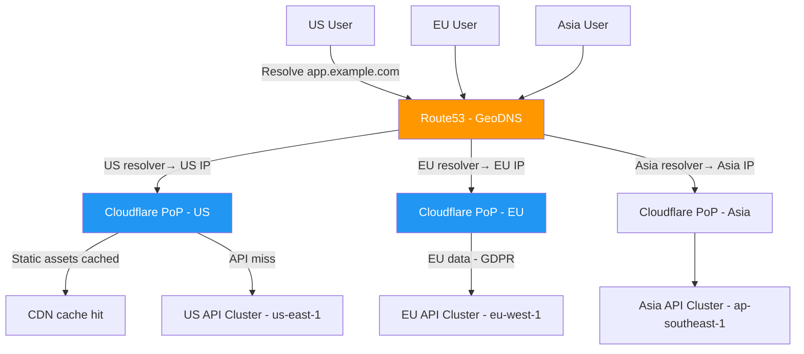

### DNS Configuration Design

**Hostname strategy:**
```
app.example.com          → GeoDNS → nearest CDN PoP
api.example.com          → GeoDNS → nearest API cluster
static.example.com       → Cloudflare CDN (global anycast)
eu.example.com           → Always EU cluster (for EU-locked tenants)
us.example.com           → Always US cluster (for US-locked tenants)
```

**Route53 routing policies:**
1. **Latency-based routing** for `api.example.com`: Route to region with lowest measured latency from client's resolver location
2. **Geolocation routing** for compliance: EU-country clients → eu.example.com; enforced at DNS level
3. **Health-check + failover**: If US API health check fails → failover US traffic to EU (degraded mode)

**Health check configuration:**
```yaml
health_check:
  endpoint: /health
  interval: 10s
  failure_threshold: 3      # 30s to detect failure
  success_threshold: 2      # 20s to confirm recovery
  regions: [us-east-1, eu-west-1, ap-southeast-1]  # multi-region checks
  ttl_during_failure: 30s   # reduce TTL automatically on failover
```

**TTL values:**
| Record type | Normal TTL | During failover |
|------------|-----------|----------------|
| CDN/static | 86400s (1 day) | N/A (CDN handles) |
| API endpoint | 300s (5 min) | 30s (auto-reduce) |
| Health-checked failover | 60s | 30s |
| Internal services | 30s | 10s |

### Failover Strategy

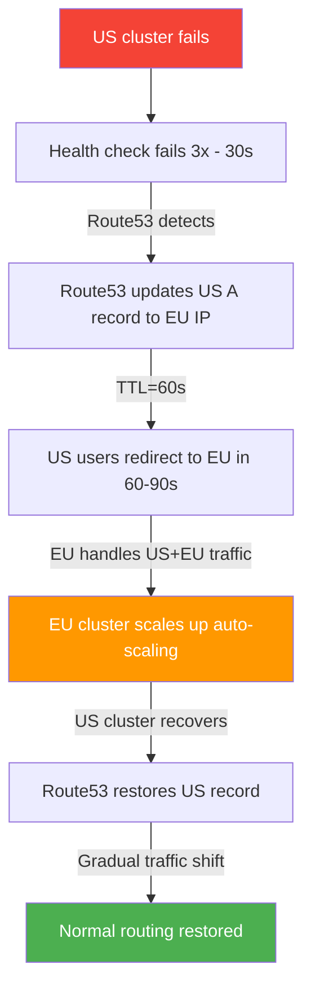

### Trade-off Decisions
| Decision | Option A | Option B | Chosen | Why |
|----------|----------|----------|--------|-----|
| Routing mechanism | GeoDNS (Route53) | Anycast (Cloudflare) | Both tiers | GeoDNS for compliance/control; Cloudflare anycast for CDN efficiency |
| EU compliance | Application-layer enforcement | DNS-level enforcement | DNS-level | DNS routing ensures EU users never hit non-EU servers — simpler audit |
| Failover scope | Region to region | DC to DC within region | Region to region | Cross-region failover is the high-impact scenario |
| API domain | Single domain + GeoDNS | Per-region subdomain | GeoDNS | Transparent to clients; region determined server-side |

### Failure Modes
| Failure | Impact | Mitigation |
|---------|--------|------------|
| DNS provider (Route53) outage | All DNS resolution fails globally | Secondary DNS provider (Cloudflare DNS) as backup nameserver |
| Regional health check false positive | Unnecessary failover | Require 3+ health check regions to agree before failover |
| EU users routed to US (compliance violation) | GDPR fine | Test EU routing monthly; alert on any EU user hitting US endpoints |
| Failover capacity | EU cluster cannot handle US+EU load | Pre-scale EU to 150% capacity; auto-scaling triggered on failover event |

