# GraphQL Design Patterns

10 questions covering the N+1 problem, schema design, federation, caching, and GitHub's REST-to-GraphQL migration.

---

## Q1: What is the N+1 problem in GraphQL and how does DataLoader solve it?
**Role:** Mid, Frontend | **Difficulty:** 🟡 | **Priority:** P0 | **Format:** Quick Answer

> **What the interviewer is testing:** Whether you understand the fundamental performance trap in GraphQL resolvers and its canonical solution.

### Answer in 60 seconds
**N+1 problem:** Fetching a list of N items where each item triggers a separate database query = N+1 queries total.

Example: Query returns 100 posts. Each post's `author` field calls `getUserById(authorId)` → 100 separate DB queries + 1 for the post list = **101 queries**.

**DataLoader solution:**
1. Collects all `getUserById` calls within a single event loop tick
2. Batches them into a single `SELECT ... WHERE id IN (1,2,3,...100)`
3. Distributes results back to each resolver

Result: 101 queries → **2 queries**. DataLoader also caches within a request — same user ID fetched twice returns cached result.

### Diagram

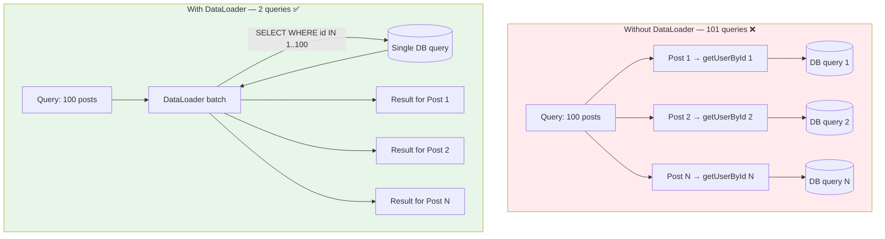

### Pitfalls
- ❌ **DataLoader per request, not global:** DataLoader cache is per-request to prevent cross-user data leaking between requests.
- ❌ **Assuming DataLoader is automatic:** It requires explicit wrapping of every resolver that fetches by ID.
- ❌ **Ignoring N+1 in nested queries:** Problem occurs at every level of nesting, not just top-level queries.

### Concept Reference

---

## Q2: What is the difference between GraphQL queries, mutations, and subscriptions?
**Role:** Mid | **Difficulty:** 🟢 | **Priority:** P1 | **Format:** Quick Answer

> **What the interviewer is testing:** Basic GraphQL operation types and their use cases.

### Answer in 60 seconds
- **Query:** Read data; executed in parallel if multiple top-level fields; analogous to HTTP GET
- **Mutation:** Write data; executed serially if multiple top-level mutations; analogous to HTTP POST/PUT/DELETE
- **Subscription:** Long-lived connection for real-time updates; server pushes events to client; typically over WebSocket

Key difference — **mutation execution order:**
```
mutation {
  createUser(input: {...})    # ← executes first
  sendWelcomeEmail(...)       # ← executes second (after first completes)
}
```
Multiple mutations are serial by spec — important for dependent writes.

Subscriptions use WebSocket transport (graphql-ws protocol) or SSE. They maintain a stateful connection, which has scaling implications — each subscription is a persistent server-side resource.

### Diagram

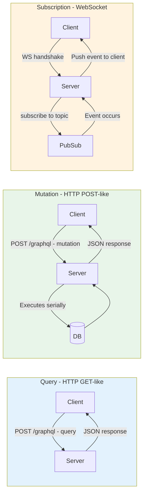

### Pitfalls
- ❌ **Using subscriptions for polling:** Subscriptions have connection overhead; if data changes infrequently, polling is simpler.
- ❌ **Stateful subscription servers:** Subscriptions require sticky sessions or shared pubsub (Redis) to scale horizontally.
- ❌ **Mutation side effects in queries:** Queries may be cached or batched; never perform writes inside query resolvers.

### Concept Reference

---

## Q3: How do you design a GraphQL schema for a product catalog with filtering and sorting?
**Role:** Senior | **Difficulty:** 🟡 | **Priority:** P1 | **Format:** Deep Dive

> **What the interviewer is testing:** Schema design skills — input types, connection pattern, filter/sort patterns, avoiding breaking changes.

### Problem Constraints
| Dimension | Value |
|-----------|-------|
| Products | 10M SKUs |
| Attributes | 50+ filterable attributes per category |
| Sort options | Price, rating, relevance, newest |
| Clients | Web, mobile, partner APIs |
| Response time | p99 < 200ms for catalog browsing |

### Approach A — Flat Arguments

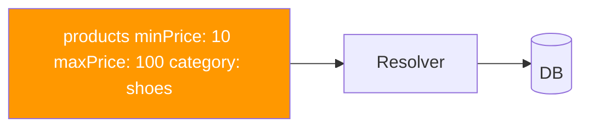

Schema grows unbounded with every new filter — breaking changes when adding new args to non-nullable positions.

### Approach B — Input Types with Connection Pattern (Recommended)

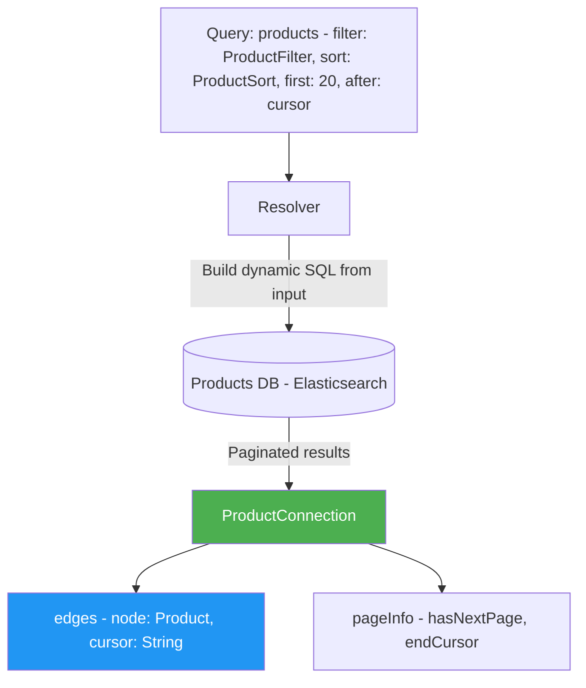

Schema design (pseudo-schema):
```
type Query {
  products(
    filter: ProductFilterInput
    sort: ProductSortInput
    first: Int = 20
    after: String
  ): ProductConnection!
}

input ProductFilterInput {
  priceRange: PriceRangeInput
  categories: [ID!]
  inStock: Boolean
  rating: RatingFilterInput
  attributes: [AttributeFilterInput!]  # dynamic EAV filtering
}

input AttributeFilterInput {
  key: String!
  values: [String!]!
}

input ProductSortInput {
  field: ProductSortField!
  direction: SortDirection!
}

enum ProductSortField {
  PRICE
  RATING
  RELEVANCE
  CREATED_AT
}

type ProductConnection {
  edges: [ProductEdge!]!
  pageInfo: PageInfo!
  totalCount: Int
}
```

| Dimension | Flat Args | Input Types |
|-----------|-----------|-------------|
| Extensibility | ❌ Each new filter = schema change | ✅ Add fields to input type (non-breaking) |
| Type safety | ❌ Many nullable args | ✅ Grouped, validated |
| Tooling support | ❌ IDE hints poor | ✅ Autocomplete works |
| Backward compat | ❌ Adding required args breaks | ✅ New optional input fields = safe |

### Recommended Answer
**Approach B — Input types with Relay Connection pattern.** Group filters in `ProductFilterInput`, sort in `ProductSortInput`. Use Relay-style cursor pagination (`ProductConnection` / `ProductEdge`). This is non-breaking as you add new filter fields and is compatible with DataLoader batching and response-level caching.

### What a great answer includes
- [ ] Uses input types (not flat args) for filter/sort
- [ ] Demonstrates Relay Connection pattern for pagination
- [ ] Explains that adding fields to input types is backward-compatible
- [ ] Notes totalCount has performance cost on large datasets (skip or make it optional)
- [ ] Mentions Elasticsearch or dedicated search for attribute filtering at 10M products

### Pitfalls
- ❌ **Returning raw lists instead of Connection types:** Loses ability to add pagination metadata without breaking schema.
- ❌ **Exposing every DB column as filterable:** Creates query performance nightmare; only expose indexed fields.
- ❌ **totalCount on every list:** `SELECT COUNT(*)` on 10M filtered rows without index = full table scan; make it opt-in.

### Concept Reference

---

## Q4: What are persisted queries and why do they matter for performance?
**Role:** Senior | **Difficulty:** 🟡 | **Priority:** P1 | **Format:** Quick Answer

> **What the interviewer is testing:** Understanding of GraphQL-specific performance and security optimizations.

### Answer in 60 seconds
**Persisted queries:** Instead of sending full query text on every request, client sends a hash (query ID) pre-registered with server.

Flow:
1. At build time: Client registers queries with server → receives hash `sha256:abc123`
2. At runtime: Client sends `{ "id": "sha256:abc123", "variables": {...} }` — tiny payload
3. Server looks up query by hash and executes

**Benefits:**
- **Bandwidth reduction:** Query text can be 2KB–20KB; hash is 64 bytes — 95%+ reduction on mobile
- **Security:** Server can reject any query not in the whitelist — prevents introspection attacks and resource exhaustion via complex queries
- **CDN caching:** GET request with query ID + variables = cacheable at edge (instead of POST)
- **APM/tracing:** Operations have stable IDs → better monitoring

**When to use:** Production GraphQL APIs with known clients (mobile app, web app). Not for public GraphQL APIs with unknown query shapes.

### Diagram

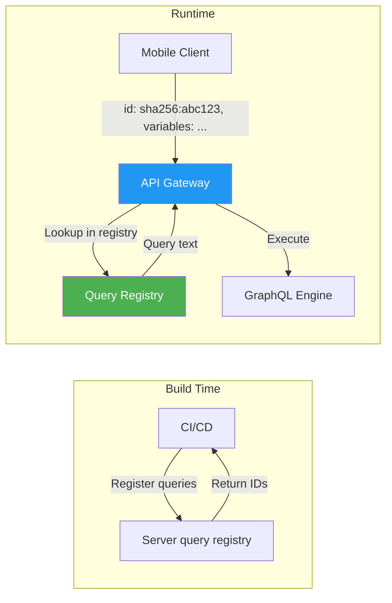

### Pitfalls
- ❌ **Persisted queries without version management:** Deploying new app versions without registering new queries causes 400 errors in production.
- ❌ **Using persisted queries for public APIs:** Third-party developers can't register queries; defeats the open API purpose.
- ❌ **Not expiring old queries:** Registry grows unbounded; add TTL or tie to app version lifecycle.

### Concept Reference

---

## Q5: What is schema federation and how does Apollo Federation work?
**Role:** Senior | **Difficulty:** 🔴 | **Priority:** P2 | **Format:** Deep Dive

> **What the interviewer is testing:** Ability to design a unified GraphQL API across a microservices architecture.

### Problem Constraints
| Dimension | Value |
|-----------|-------|
| Services | 10+ microservices (users, products, orders, payments, etc.) |
| Teams | Each team owns their service's schema |
| Client | Single GraphQL endpoint for all data |
| Consistency | Schema changes in one service must not break others |

### Approach A — Schema Stitching (Old Pattern)

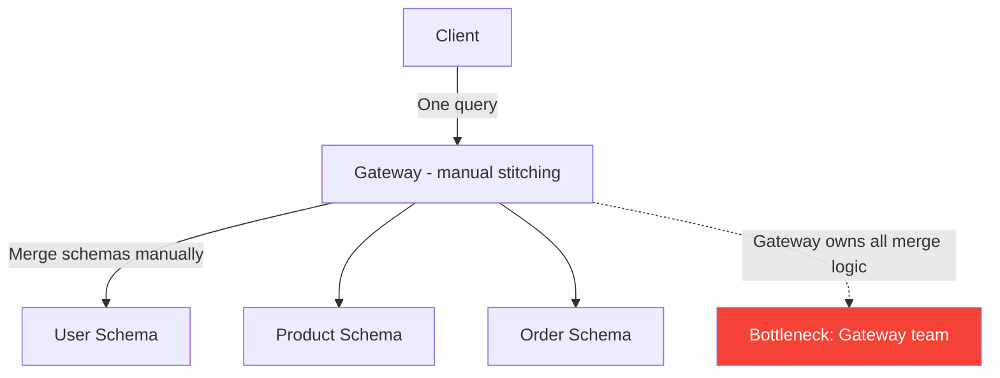

Problem: Gateway team becomes bottleneck for every cross-service type reference. Manual type merging is brittle.

### Approach B — Apollo Federation

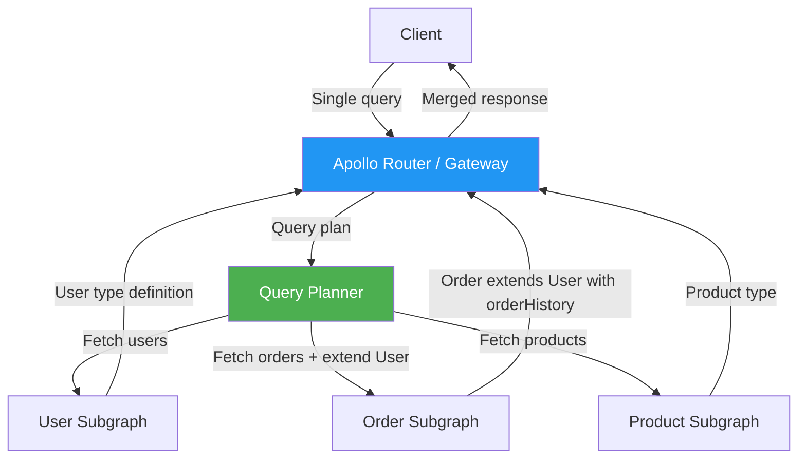

Key federation concepts:
1. **`@key` directive:** Defines the primary key for a type across subgraphs — `type User @key(fields: "id")`
2. **`@extends` / `extend type`:** One subgraph adds fields to a type owned by another — Orders adds `orderHistory` to User
3. **`@external`:** Marks fields from another subgraph needed for local computation
4. **Query planning:** Router auto-generates optimal query plan to fetch data from minimum subgraphs
5. **Schema composition:** `rover` CLI checks compatibility; incompatible changes fail CI before deployment

| Dimension | Schema Stitching | Federation |
|-----------|-----------------|------------|
| Cross-service type extension | Manual | Automatic via @key |
| Gateway coupling | High | Low (each team owns subgraph) |
| Breaking change detection | Manual | Automated (rover check) |
| Query planning | Manual | Automatic |
| Adoption complexity | Lower | Higher |

### Recommended Answer
**Apollo Federation** for teams at scale. Each service team owns their subgraph schema; Router composes them. `@key` enables cross-subgraph type references without a centralized stitching layer. Automated schema compatibility checking prevents cross-team breaking changes. Used by Netflix, Expedia, and Wayfair.

### What a great answer includes
- [ ] Explains `@key` directive and how it enables cross-subgraph references
- [ ] Describes query planning (not manual routing)
- [ ] Mentions schema registry and automated compatibility checks
- [ ] Notes scaling advantage: each subgraph team is autonomous
- [ ] Gives real-world example (Netflix, Expedia)

### Pitfalls
- ❌ **One team owns all subgraphs:** Defeats the purpose; federation is about team autonomy.
- ❌ **Circular subgraph dependencies:** Subgraph A depends on B depends on A — creates query planning loops.
- ❌ **No performance monitoring per subgraph:** The gateway hides which subgraph is slow; instrument each subgraph independently.

### Concept Reference

---

## Q6: How do you implement rate limiting in GraphQL when each query is different?
**Role:** Senior | **Difficulty:** 🔴 | **Priority:** P2 | **Format:** Quick Answer

> **What the interviewer is testing:** Awareness that GraphQL's flexibility makes standard rate limiting insufficient.

### Answer in 60 seconds
Standard rate limiting (N requests/min) fails for GraphQL because:
- `{ user { friends { posts { comments { ... } } } } }` = 1 request, but exponentially expensive
- A client can craft a deeply nested query that brings down the server with one request

**Solutions (in order of complexity):**

1. **Query depth limiting:** Reject queries deeper than N levels (e.g., max depth = 7). Simple, but misses wide queries.
2. **Query complexity scoring:** Assign cost to each field; reject if total cost > threshold. `user` = 1, `friends` = 10, `posts` = 5. Budget per query: 100 points.
3. **Query size limiting:** Reject queries where document size > X bytes (e.g., 10KB). Crude but fast.
4. **Persisted queries only:** Reject ad-hoc queries — only pre-registered query hashes allowed. Best security, limits public API flexibility.
5. **Token bucket per operation:** Rate limit by operation name, not raw request count.

GitHub uses complexity scoring: queries have a `rateLimit { cost remaining resetAt }` field developers can inspect.

### Diagram

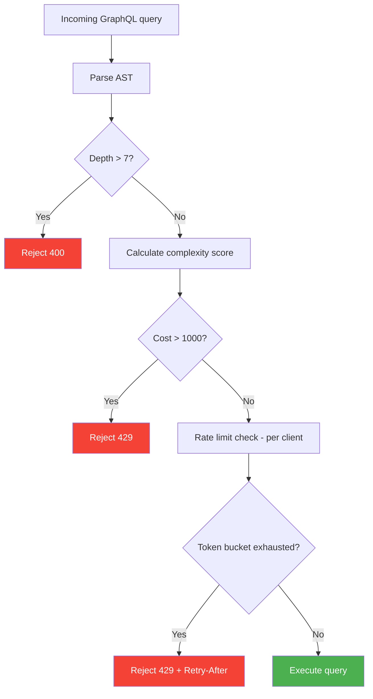

### Pitfalls
- ❌ **Only limiting by request count:** One malicious query can be more expensive than 1000 simple queries.
- ❌ **Over-aggressive depth limits:** Setting max depth = 3 breaks legitimate nested queries for product catalogs.
- ❌ **Not exposing rate limit info:** Developers can't optimize if they can't see their query cost (use `extensions.rateLimit` in response).

### Concept Reference

---

## Q7: How did GitHub migrate their API from REST to GraphQL?
**Role:** Staff | **Difficulty:** 🔴 | **Priority:** P2 | **Format:** Quick Answer

> **What the interviewer is testing:** Real-world knowledge of a major production GraphQL migration and lessons learned.

### Answer in 60 seconds
**GitHub's problem with REST v3:**
- Developers making 20–30 REST calls to assemble one page of data (over-fetching + multiple round trips)
- `GET /repos/{owner}/{repo}` returned 100+ fields when clients needed 5
- No way to batch related data without multiple requests
- REST v3 response payloads were 4–6x larger than what clients needed

**GraphQL v4 launch (2016):**
- Single endpoint `POST api.github.com/graphql`
- Clients declare exactly the fields they need — no over-fetching
- Connections for all list types (Relay pagination pattern)
- Strong typed schema with 400+ types published publicly
- Complexity scoring + rate limits exposed to clients as `rateLimit { cost remaining }`

**Migration strategy:**
1. GraphQL v4 launched alongside REST v3 (not replacement — still maintained)
2. Internal teams migrated first; dogfooding for 18 months before public launch
3. Schema-first design: wrote schema in SDL before writing resolvers
4. Datadog metrics showed 60% reduction in data transferred after migration
5. REST v3 deprecation announced with 2-year sunset window (still not fully retired)

### Diagram

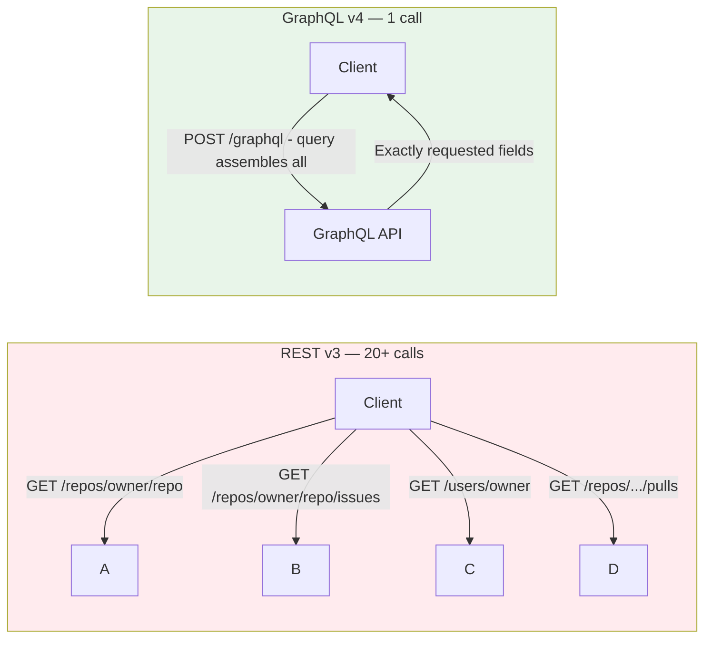

### Pitfalls
- ❌ **Big-bang migration:** GitHub ran REST and GraphQL in parallel for years; never forced clients to migrate overnight.
- ❌ **Ignoring schema governance:** GitHub published their full schema; consistency required a schema review process.

### Concept Reference

---

## Q8: How do you cache GraphQL responses when queries are dynamic?
**Role:** Staff | **Difficulty:** 🔴 | **Priority:** P2 | **Format:** Deep Dive

> **What the interviewer is testing:** Understanding that GraphQL's flexibility breaks standard HTTP caching, and the patterns to work around it.

### Problem Constraints
| Dimension | Value |
|-----------|-------|
| Cache strategy | CDN + application-level |
| Query variability | Infinite (ad-hoc queries) |
| Freshness requirement | Product prices: 5min, user data: real-time |
| Scale | 50K GraphQL requests/second |

### Approach A — No Caching (Common default)

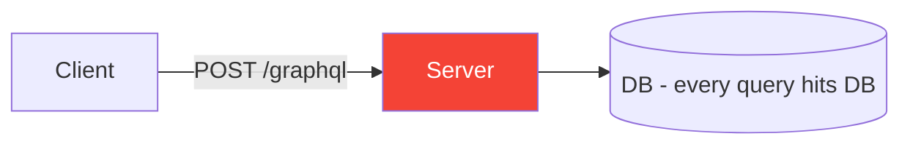

Every request hits the database. Works at low scale, fails at 50K RPS.

### Approach B — Response-Level Caching (Apollo Cache Control)

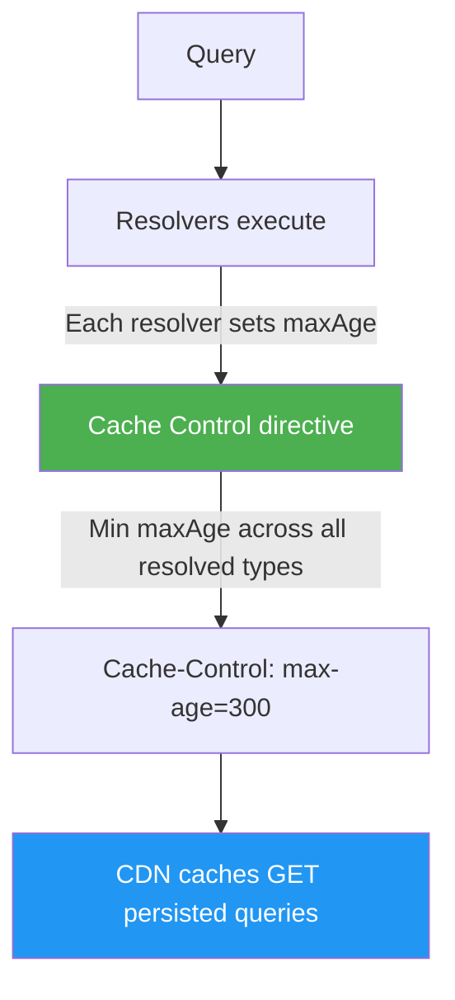

Apollo's `@cacheControl` directive: each type/field declares `maxAge`. Response `max-age` = minimum across all resolved fields. Only works for GET requests (persisted queries).

### Approach C — Normalized Client-Side Cache

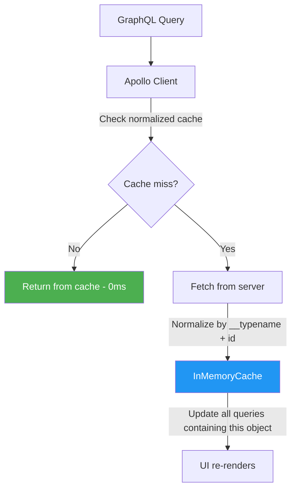

Apollo Client normalizes responses by `__typename` + `id`. When `Product:123` is updated anywhere, all queries containing that product re-render automatically.

### Approach D — Partial Query Caching (Persisted Query + CDN)

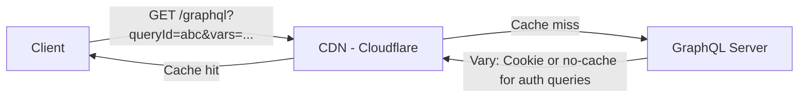

Only possible with persisted queries using GET method. Non-personalized queries (product catalog, public content) can be cached at CDN for 60–300 seconds. Authenticated/personalized queries bypass CDN.

| Dimension | No Cache | Response Cache | Client Cache | CDN Cache |
|-----------|----------|----------------|--------------|-----------|
| Cache hit rate | 0% | 30–50% | 60–80% | 85–95% |
| Real-time data | ✅ | ❌ | ❌ | ❌ |
| Infra complexity | Low | Medium | Client-side | Medium |
| Works for auth data | ✅ | ❌ | ✅ | ❌ |

### Recommended Answer
**Layered approach:** Client-side normalized cache (Apollo Client) for UX responsiveness + server-side `@cacheControl` for public data + CDN caching of persisted GET queries for non-personalized content. Authenticated queries never hit CDN.

### What a great answer includes
- [ ] Identifies that POST requests are not cacheable by default — persisted queries solve this
- [ ] Explains Apollo Client's normalized cache by `__typename` + `id`
- [ ] Notes cache-control minimum across field chain
- [ ] Separates public vs personalized data caching strategy
- [ ] Mentions field-level freshness requirements differ (price vs user profile)

### Pitfalls
- ❌ **Caching mutations:** Mutation responses should never be cached; they change state.
- ❌ **Missing `id` in queries:** Apollo Client's normalized cache requires `id` field on every object; omit it and caching breaks silently.
- ❌ **Uniform TTL across all types:** Product prices need 5-minute cache; stock levels need real-time; set per-type TTLs.

### Concept Reference

---

## Q9: What is GraphQL introspection and why should you disable it in production?
**Role:** Staff | **Difficulty:** 🔴 | **Priority:** P3 | **Format:** Quick Answer

> **What the interviewer is testing:** Security awareness around GraphQL's discovery features.

### Answer in 60 seconds
**Introspection:** Built-in GraphQL feature that allows any client to query the server's full schema:
```
{ __schema { types { name fields { name type { name } } } } }
```

This returns every type, field, argument, and relationship in your schema.

**Why it's a security concern:**
- Gives attackers a complete map of your API surface area — every field, every type, every mutation
- Enables automated attack tools to find injection points, sensitive fields (e.g., `adminUsers`, `deleteAll`)
- In 2022, several breaches started with introspection revealing undocumented admin endpoints
- Reduces effort for scraping attacks and API abuse

**When to disable:**
- **Production public APIs:** Disable introspection; ship your schema docs separately
- **Production authenticated APIs:** Consider allowing only for authenticated users
- **Development/staging:** Always enable for developer tooling (GraphiQL, Apollo Sandbox)

**Alternative to full disable:** Allow introspection only for authenticated users with a specific scope, or use schema filtering to hide sensitive types.

### Diagram

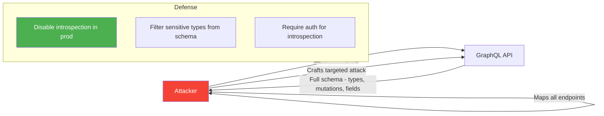

### Pitfalls
- ❌ **Disabling introspection as the only security measure:** It's security by obscurity; also implement auth, rate limiting, and query validation.
- ❌ **Breaking developer tooling in dev:** Developers need introspection in local/staging environments.

### Concept Reference
→ [API Security Patterns](../security-auth/api-security-patterns)

---

## Q10: Design the GraphQL schema for a social network
**Role:** Senior | **Difficulty:** 🟡 | **Priority:** P1 | **Format:** Scenario

**Real Company:** Facebook (GraphQL was invented here), Instagram, Twitter

### The Brief
> "Design the GraphQL schema for a social network with posts, users, comments, and likes. The API must support a feed, profile pages, and real-time like counts. Consider pagination, N+1 prevention, and schema evolution."

### Clarifying Questions
1. Is the feed algorithmic or chronological?
2. Can comments be nested (replies to replies)?
3. Are likes real-time (WebSocket) or near-real-time (30-second polling)?
4. Are there direct messages? (separate service vs same schema)
5. What is the expected read:write ratio? (feeds are typically 100:1)

### Back-of-Envelope Estimation
| Metric | Calculation | Result |
|--------|-------------|--------|
| DAU | 10M users | 10M |
| Posts per day | 10M × 2 posts | 20M posts/day |
| Feed reads/sec | 10M × 20 feeds/day / 86400 | ~2,300 RPS |
| Like events/sec | 20M posts × 50 likes × fanout | Complex; use counters |
| DataLoader batches | 100 posts → 2 DB queries | 50x reduction |

### High-Level Architecture

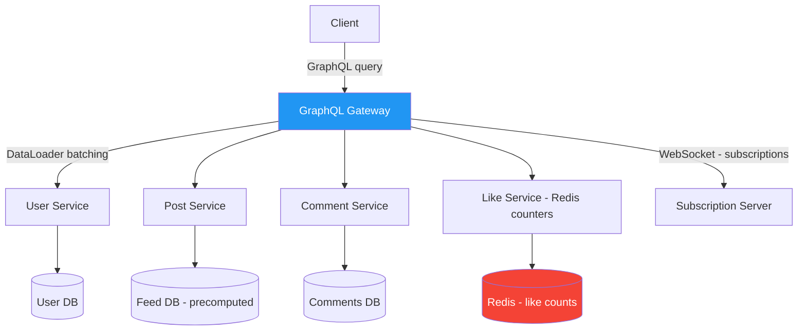

### Schema Design (pseudo-schema)

```
type Query {
  feed(userId: ID!, first: Int = 20, after: String): PostConnection!
  post(id: ID!): Post
  user(id: ID!): User
  userPosts(userId: ID!, first: Int, after: String): PostConnection!
}

type Mutation {
  createPost(input: CreatePostInput!): Post!
  likePost(postId: ID!): LikeResult!
  createComment(input: CreateCommentInput!): Comment!
}

type Subscription {
  likeCountUpdated(postId: ID!): LikeCountPayload!
  newComment(postId: ID!): Comment!
}

type User {
  id: ID!
  username: String!
  displayName: String!
  avatarUrl: String
  followerCount: Int!
  followingCount: Int!
  # NOT returning full followers list here - use separate paginated query
}

type Post {
  id: ID!
  author: User!      # DataLoader batches these
  content: String!
  mediaUrls: [String!]!
  likeCount: Int!    # Redis counter, not DB count
  commentCount: Int!
  createdAt: String!
  viewerHasLiked: Boolean!  # personalized - cannot cache at CDN
  comments(first: Int = 10, after: String): CommentConnection!
}

type Comment {
  id: ID!
  author: User!      # DataLoader batches these
  content: String!
  createdAt: String!
  likeCount: Int!
  replies(first: Int = 5, after: String): CommentConnection!  # max 1 level deep
}

type PostConnection {
  edges: [PostEdge!]!
  pageInfo: PageInfo!
}
```

### Trade-off Decisions
| Decision | Option A | Option B | Chosen | Why |
|----------|----------|----------|--------|-----|
| Like count source | DB COUNT(*) | Redis counter | Redis | COUNT(*) on 100M likes = slow; Redis INCR is O(1) |
| Comment nesting | Unlimited | Max 1 level deep | Max 1 level | Avoids recursive resolver chains |
| Feed source | Real-time query | Pre-computed feed | Pre-computed | Fan-out on write cheaper at scale |
| Subscription transport | WebSocket | SSE | WebSocket | Bidirectional needed for multi-sub |
| viewerHasLiked field | On Post type | Separate query | On Post type | Convenient, but prevents CDN caching |

### Failure Modes
| Failure | Impact | Mitigation |
|---------|--------|------------|
| DataLoader cache miss | N+1 regression | Test with query logging; alert on N DB queries per request |
| Redis like counter drift | Inaccurate like counts | Periodic reconciliation job against DB |
| Subscription connection storm | Server OOM on Redis publish to 1M subscribers | Fan-out via message queue, not direct Redis publish |
| Deep comment nesting attack | Resolver stack overflow | Max depth = 7; reject deeper queries |

