# gRPC and Protobuf

10 questions covering gRPC communication patterns, protobuf encoding, load balancing, schema evolution, and payment API design.

---

## Q1: What is gRPC and when should you use it over REST?
**Role:** Mid, Backend | **Difficulty:** 🟢 | **Priority:** P0 | **Format:** Quick Answer

> **What the interviewer is testing:** Whether you understand gRPC's strengths and the trade-offs that make REST still the right choice in many scenarios.

### Answer in 60 seconds
**gRPC** = Google Remote Procedure Call. An open-source RPC framework using HTTP/2 as transport and Protocol Buffers as the serialization format.

**Use gRPC when:**
- Service-to-service communication (internal microservices) — not browser-to-server
- Low latency is critical: protobuf is 5–10× smaller than JSON, 3–5× faster to serialize
- Bidirectional streaming needed (e.g., real-time data feeds)
- Strong typing across languages: `.proto` file generates client + server stubs in 10+ languages
- High throughput: HTTP/2 multiplexing means one TCP connection handles thousands of concurrent RPCs

**Use REST when:**
- Public-facing API consumed by browsers, third-party developers
- Team unfamiliar with protobuf toolchain
- Simple CRUD with no performance bottleneck
- Caching at CDN layer needed (HTTP/2 caching is possible but harder)

| Dimension | gRPC | REST/JSON |
|-----------|------|-----------|
| Payload size | ~5–10× smaller | Larger |
| Browser support | Needs gRPC-web proxy | Native |
| Type safety | Strong (generated stubs) | Weak (JSON schema optional) |
| Streaming | Native (4 patterns) | Limited (SSE, chunked) |
| Debuggability | Harder (binary) | Easy (curl, browser) |

### Diagram

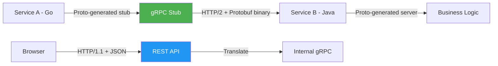

### Pitfalls
- ❌ **Using gRPC for public APIs:** Browsers can't use gRPC natively; requires gRPC-web proxy which adds latency.
- ❌ **Ignoring load balancing complexity:** gRPC over HTTP/2 requires L7 (application-layer) load balancing; L4 TCP load balancers don't distribute individual RPCs.
- ❌ **No schema registry:** Without a schema registry, proto files drift between services and cause silent deserialization failures.

### Concept Reference

---

## Q2: How does protobuf binary encoding differ from JSON?
**Role:** Mid | **Difficulty:** 🟡 | **Priority:** P1 | **Format:** Quick Answer

> **What the interviewer is testing:** Understanding of why protobuf is faster and smaller than JSON, and what that costs.

### Answer in 60 seconds
**JSON is self-describing:** Field names travel with every message.
```
{"user_id": 123, "name": "Alice", "active": true}
→ 45 bytes
```

**Protobuf is schema-driven:** Only field numbers + values travel; names stay in the `.proto` schema.
```
field 1 (user_id): varint 123
field 2 (name): string "Alice"
field 3 (active): bool true
→ ~12 bytes (73% smaller)
```

**Encoding specifics:**
- Each field = tag (field number + wire type, 1 byte) + value
- Varint encoding: small integers (< 128) take 1 byte; numbers grow with value
- Strings: length-prefixed UTF-8
- No field names in wire format — lost if you don't have the `.proto` file
- No nulls: absent field = default value (0, empty string, false)

**Trade-off:** Binary = not human-readable. `curl | jq` workflow doesn't work; need `grpc_cli` or Wireshark with protobuf dissector for debugging.

### Diagram

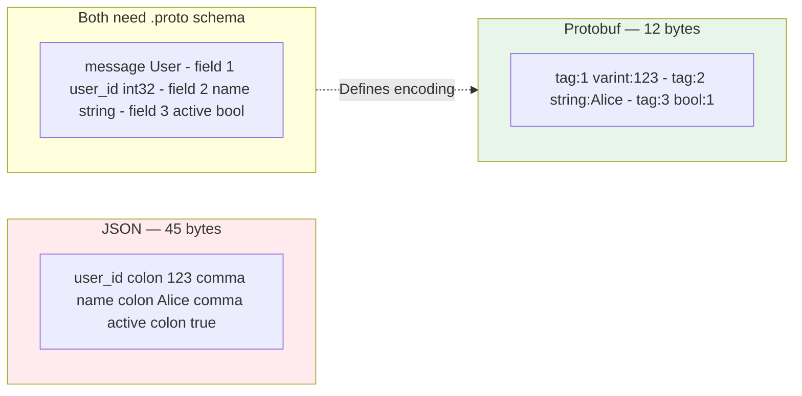

### Pitfalls
- ❌ **Assuming protobuf is always faster:** For very small payloads (< 100 bytes), JSON parsing overhead is negligible. The gap matters at scale.
- ❌ **Forgetting default values:** Protobuf v3 drops fields set to their default (0 for int, "" for string). You can't distinguish "unset" from "set to zero" without wrapper types.
- ❌ **No schema = unusable binary:** Unlike JSON, protobuf messages without their schema are opaque blobs. Always version and distribute schemas.

### Concept Reference

---

## Q3: What are the 4 gRPC communication patterns?
**Role:** Senior | **Difficulty:** 🟡 | **Priority:** P1 | **Format:** Deep Dive

> **What the interviewer is testing:** Deep understanding of gRPC streaming capabilities and when to apply each pattern.

### Problem Constraints
| Dimension | Value |
|-----------|-------|
| Use cases | One-shot RPC, file upload, live telemetry, chat |
| Transport | HTTP/2 (all patterns over one connection) |
| Latency target | <10ms for unary, real-time for streaming |

### Approach A — Unary RPC (Request-Response)


```
rpc GetUser(GetUserRequest) returns (User);
```
One request, one response. Equivalent to REST GET/POST. Most common pattern. ~2ms round trip on LAN.

### Approach B — Server Streaming

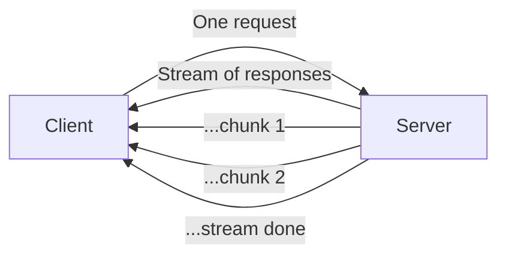

```
rpc ListAllOrders(ListOrdersRequest) returns (stream Order);
```
Client sends one request, server streams back many responses. Use for: large result sets, real-time feeds, log streaming, live price tickers.

### Approach C — Client Streaming

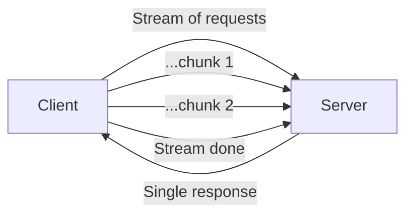

```
rpc UploadFile(stream FileChunk) returns (UploadResult);
```
Client streams multiple messages, server returns one response. Use for: file upload, sensor data ingest, batch inserts where total size is unknown upfront.

### Approach D — Bidirectional Streaming

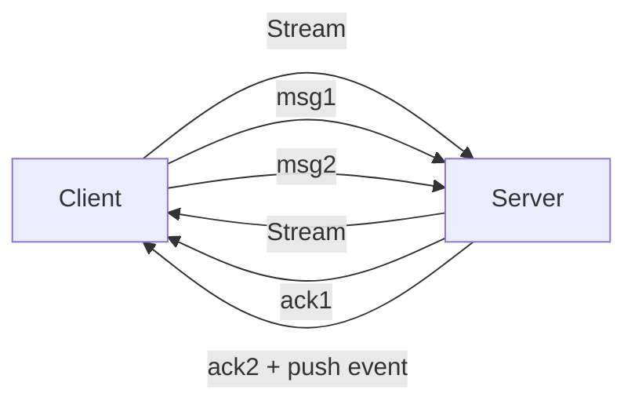

```
rpc Chat(stream ChatMessage) returns (stream ChatMessage);
```
Both sides stream independently. Use for: real-time chat, live collaboration, multiplayer game state, bidirectional telemetry. Both streams are independent — server can respond before all client messages arrive.

| Pattern | Client sends | Server sends | Use case |
|---------|-------------|-------------|----------|
| Unary | 1 | 1 | Standard RPC |
| Server stream | 1 | N | Live feeds, large results |
| Client stream | N | 1 | File upload, batch ingest |
| Bidirectional | N | N | Chat, collaboration |

### Recommended Answer
Start with **Unary** for all standard request-response RPCs. Add **Server Streaming** for live data or large datasets where buffering the full response is expensive. Use **Client Streaming** for file uploads or sensor telemetry. **Bidirectional** for real-time collaboration — but note it complicates load balancing (sticky connection needed for session).

### What a great answer includes
- [ ] Names all 4 patterns correctly with `.proto` syntax
- [ ] Explains that all 4 patterns run over the same HTTP/2 connection
- [ ] Notes bidirectional streaming complicates horizontal scaling (sticky sessions)
- [ ] Gives concrete real-world examples for each pattern
- [ ] Mentions flow control and back-pressure in streaming patterns

### Pitfalls
- ❌ **Bidirectional for everything:** Most RPCs are unary; streaming adds complexity for no benefit in simple cases.
- ❌ **Ignoring back-pressure:** If server streams faster than client processes, buffer overflow occurs; gRPC flow control is automatic but needs to be understood.
- ❌ **Missing deadline propagation in streaming:** Long-lived streams need explicit timeouts; default is no timeout.

### Concept Reference

---

## Q4: How do you handle gRPC load balancing — why is it different from HTTP load balancing?
**Role:** Senior | **Difficulty:** 🔴 | **Priority:** P1 | **Format:** Quick Answer

> **What the interviewer is testing:** Understanding that HTTP/2 persistent connections break traditional L4 load balancing for gRPC.

### Answer in 60 seconds
**The problem:** HTTP/2 (gRPC's transport) multiplexes all RPCs over **one long-lived TCP connection**. An L4 load balancer (like AWS NLB) routes by connection, not by RPC. Result: all traffic goes to one backend server.

**Solutions:**

1. **L7 (Application-layer) load balancing:** Use a proxy that understands HTTP/2 framing (Envoy, Nginx, AWS ALB with gRPC support). Routes each individual RPC to a backend. Envoy adds ~1ms overhead.

2. **Client-side load balancing:** gRPC client maintains a list of backend IPs and distributes calls (round-robin, least-requests). No proxy overhead. Client must handle discovery (Kubernetes DNS returns pod IPs, not virtual IP).

3. **Lookaside load balancing:** Client queries a central load balancer service for backend assignment. Used by Google internally at billion-RPC scale.

**In Kubernetes:** Use a headless Service (returns pod IPs directly) + gRPC client-side LB, OR deploy Envoy as sidecar (service mesh like Istio).

### Diagram

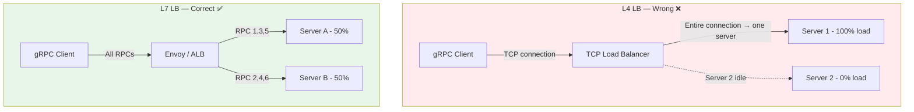

### Pitfalls
- ❌ **Using NLB (L4) for gRPC:** All traffic concentrates on the first server selected per connection; others starve.
- ❌ **Client-side LB without service discovery:** Client caches IP list; new pods not discovered without restart.
- ❌ **Not configuring keepalive:** Long-idle connections get killed by network infrastructure; configure `keepalive_time=20s` to keep connections alive.

### Concept Reference

---

## Q5: How do deadlines propagate across a chain of gRPC service calls?
**Role:** Senior | **Difficulty:** 🔴 | **Priority:** P2 | **Format:** Deep Dive

> **What the interviewer is testing:** Production gRPC operations knowledge — preventing cascading timeouts and deadline budgeting.

### Problem Constraints
| Dimension | Value |
|-----------|-------|
| Call chain depth | Service A → B → C → D |
| Initial deadline | Client sets 5s total |
| Network overhead per hop | ~2ms |
| Target behavior | Cancel entire chain when deadline expires |

### Approach A — No Deadline Propagation


Problem: Client times out at 5s, but A, B, C continue running for 30s — wasting resources, holding DB connections, filling thread pools. Called "zombie requests."

### Approach B — Manual Deadline at Each Hop

Each service hardcodes its own timeout: A=4s, B=3s, C=2s. Problem: not coordinated; if upstream already spent 4s, downstream gets a fresh 2s for no reason.

### Approach C — Deadline Propagation (Correct)

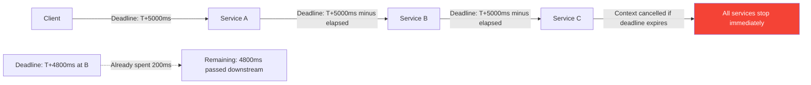

gRPC propagates the **absolute deadline** in the `grpc-timeout` header on each call. Each service passes the context (with remaining deadline) to downstream calls. If deadline expires at any point, the entire context is cancelled — all goroutines/threads unblock via context cancellation.

**Deadline budgeting rules:**
- Reserve time for each hop: if total = 5s, budget A=1s, B=2s, C=1.5s, buffer=0.5s
- Always check `ctx.Err()` before expensive operations
- Log when remaining budget < 10% at each service boundary
- Never start expensive work if deadline is already past

| Dimension | No Deadline | Manual Hop | Propagated |
|-----------|-------------|-----------|------------|
| Zombie requests | ❌ Many | ⚠️ Reduced | ✅ None |
| Resource waste | High | Medium | Low |
| Implementation effort | None | Medium | Low (framework) |
| Debugging | Hard | Medium | ✅ Correlated traces |

### Recommended Answer
Always use **context-based deadline propagation** (Approach C). Pass the deadline from the original request context through every downstream gRPC call. Set the initial deadline at the outermost entry point based on your SLA. Each intermediate service subtracts elapsed time before passing downstream. Cancel signals propagate instantly via gRPC context cancellation.

### What a great answer includes
- [ ] Explains "zombie request" problem — work continuing after client gave up
- [ ] Describes absolute deadline vs relative timeout (pass deadline, not duration)
- [ ] Mentions context cancellation propagation in gRPC
- [ ] Notes deadline budgeting as an operational discipline
- [ ] References how to observe deadline propagation in distributed traces

### Pitfalls
- ❌ **Creating new contexts without propagating deadline:** `context.Background()` at each service loses the propagated deadline.
- ❌ **Setting deadline too tight:** If p99 processing time is 200ms and you set 100ms deadline, 1% of requests always fail — measure before setting.
- ❌ **Not handling context cancellation in DB queries:** Even if gRPC context is cancelled, the DB query continues holding a connection; pass context to `db.QueryContext(ctx, ...)`.

### Concept Reference

---

## Q6: How do you evolve protobuf schemas without breaking existing clients?
**Role:** Senior | **Difficulty:** 🟡 | **Priority:** P2 | **Format:** Quick Answer

> **What the interviewer is testing:** Understanding of protobuf backward/forward compatibility rules.

### Answer in 60 seconds
Protobuf uses **field numbers** (not field names) for encoding. Compatibility rules:

**Safe (backward/forward compatible):**
- Add new optional fields with new field numbers
- Rename a field — wire format unchanged (only field number matters)
- Change `required` to `optional` (proto2 only)

**Unsafe (breaking):**
- Delete a field number — old clients may send data that new server ignores; new clients get default value for deleted field
- Change a field's type (e.g., `int32` to `string`) — wire type changes, causes deserialization errors
- Reuse a field number for a different field — catastrophic; old clients send wrong data

**Best practices:**
1. Reserve deleted field numbers: `reserved 5, 10;` prevents reuse
2. Reserve deleted field names: `reserved "old_field_name";`
3. Never use `required` in proto3 — all fields are optional by default
4. Use `oneof` for mutually exclusive fields — saves space + prevents setting multiple
5. Semantic versioning in package name: `package payment.v1;` — allows parallel major versions

### Diagram

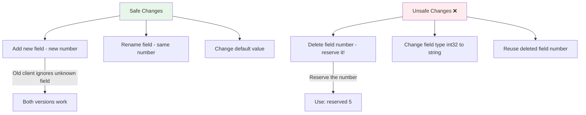

### Pitfalls
- ❌ **Forgetting to reserve deleted field numbers:** Another developer adds a new field using the deleted number; old serialized data corrupts new field.
- ❌ **Changing enum values:** Renaming an enum value is safe (number unchanged); adding is safe; removing causes default fallback in old clients.
- ❌ **No schema registry enforcement:** Without CI checks, engineers break compatibility accidentally. Use Buf CLI to catch compatibility violations.

### Concept Reference

---

## Q7: How does gRPC-web enable gRPC in browsers?
**Role:** Staff | **Difficulty:** 🔴 | **Priority:** P2 | **Format:** Quick Answer

> **What the interviewer is testing:** Understanding of the browser constraints that prevent native gRPC and how gRPC-web works around them.

### Answer in 60 seconds
**Why browsers can't use native gRPC:**
1. Browsers have no control over HTTP/2 framing at the level gRPC requires
2. The `fetch` API and `XMLHttpRequest` don't expose HTTP/2 trailers (gRPC sends status code in trailers, not headers)
3. No raw TCP socket access for custom framing

**gRPC-web solution:**
1. Client uses gRPC-web JavaScript client (generated from `.proto` files)
2. Requests go to an **Envoy proxy** (or grpc-web-proxy) that acts as translator
3. Proxy translates gRPC-web (HTTP/1.1 + base64 or binary) → native gRPC (HTTP/2)
4. Backend sees standard gRPC — no changes needed to server code

**Two encoding modes:**
- `application/grpc-web+proto` — binary framing, more efficient
- `application/grpc-web-text` — base64 encoded, works with older proxies, 33% larger

**Limitation:** gRPC-web supports unary and server-streaming only. Client streaming and bidirectional streaming are not supported in gRPC-web (browser limitation).

### Diagram

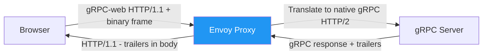

### Pitfalls
- ❌ **Expecting bidirectional streaming from browser:** gRPC-web cannot do bidirectional streaming; use WebSockets for that use case.
- ❌ **Forgetting CORS configuration on Envoy:** gRPC-web from browser requires proper CORS headers on the Envoy proxy.

### Concept Reference

---

## Q8: How does Google use gRPC internally to handle billions of RPCs per second?
**Role:** Staff | **Difficulty:** 🔴 | **Priority:** P2 | **Format:** Deep Dive

> **What the interviewer is testing:** Understanding of gRPC at Google-scale: traffic management, observability, and the origins of the framework.

### Problem Constraints
| Dimension | Value |
|-----------|-------|
| Scale | ~10B RPCs/day across 2B+ users |
| Services | Thousands of internal microservices |
| Languages | Go, C++, Java, Python, more |
| Latency target | p99 <10ms for most internal calls |

### Architecture Overview

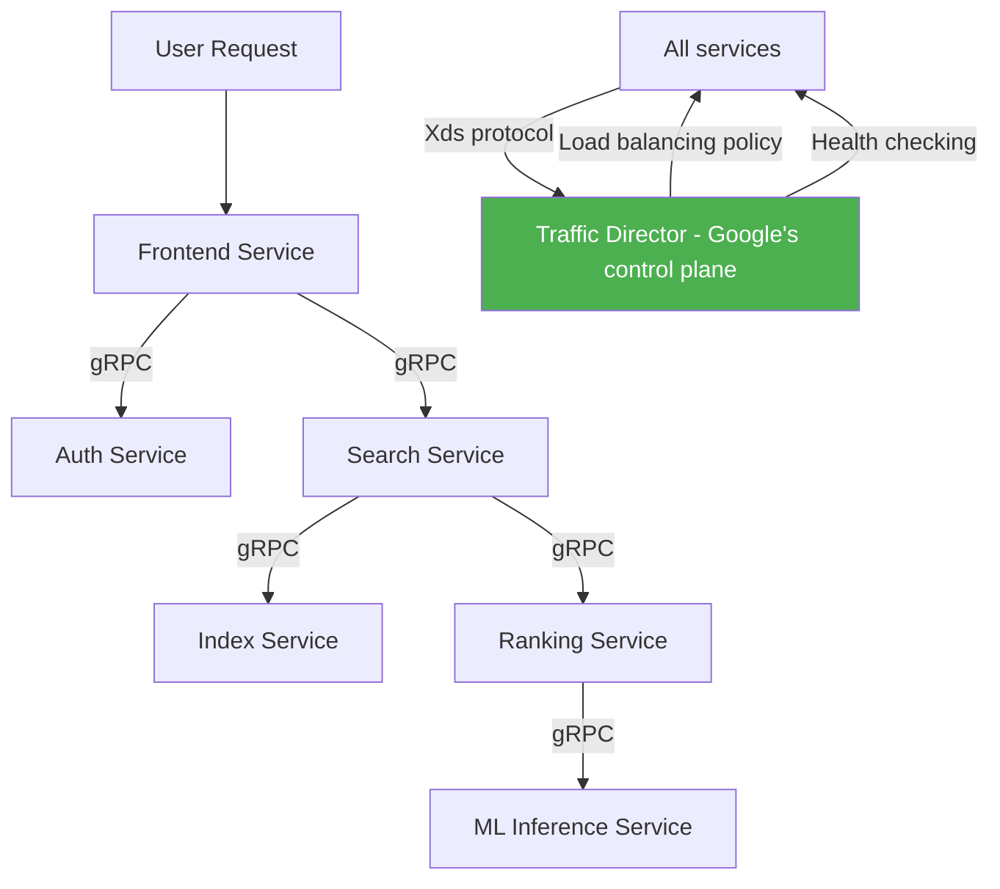

**Key Google innovations in gRPC:**

1. **Stubby → gRPC:** Google's internal RPC framework (Stubby) open-sourced as gRPC in 2015. Stubby had been running at scale for 10+ years.

2. **xDS API:** gRPC supports Envoy's xDS (Discovery Service) protocol — allows a control plane (Traffic Director) to push routing, load balancing, and health check config to all gRPC clients dynamically, without proxies.

3. **Proxyless service mesh:** gRPC clients communicate directly with backends; Traffic Director pushes load balancing decisions. Eliminates sidecar proxy overhead (~0.5ms per hop saved).

4. **Protocol Buffers:** All Google services define APIs in `.proto` files; Piper (Google's monorepo) has a schema registry. Breaking changes caught at code review via proto linting.

5. **Deadline propagation:** Every Google RPC propagates the original deadline through the full call chain — no zombie requests.

6. **Distributed tracing:** Every gRPC call generates a trace span; Dapper (Google's tracing system) correlates across services using a `trace-id` header propagated in gRPC metadata.

| Dimension | Traditional Proxy Mesh | Google Proxyless gRPC |
|-----------|----------------------|----------------------|
| LB latency per hop | ~0.5–1ms (Envoy) | ~0ms (client-side) |
| Resource overhead | High (sidecar per pod) | Low (library in process) |
| Traffic control | Per-request at proxy | Per-request at client |
| Debugging | Proxy logs | gRPC interceptors |

### Recommended Answer
Google uses **proxyless gRPC with xDS traffic management** — the gRPC client library itself handles load balancing, health checking, and traffic splitting via the xDS API from Traffic Director. This eliminates sidecar proxy overhead while maintaining centralized traffic control. Combined with strict `.proto` schema governance and deadline propagation, it handles 10B+ RPCs per day across thousands of services.

### What a great answer includes
- [ ] Mentions Stubby as gRPC's predecessor at Google
- [ ] Explains xDS API and proxyless service mesh concept
- [ ] Notes proto schema governance at scale (monorepo + linting)
- [ ] References deadline propagation as a first-class concern
- [ ] Compares proxy-based vs proxyless approaches

### Pitfalls
- ❌ **Assuming you need proxies for gRPC service mesh:** gRPC's xDS support enables proxyless meshes — important cost/latency optimization.
- ❌ **Missing observability:** At Google scale, every RPC generates metrics and traces. Instrument gRPC with interceptors from day one.

### Concept Reference

---

## Q9: What is the gRPC reflection API and when do you use it?
**Role:** Staff | **Difficulty:** 🔴 | **Priority:** P3 | **Format:** Quick Answer

> **What the interviewer is testing:** Awareness of gRPC's runtime discovery mechanism and its security implications.

### Answer in 60 seconds
**gRPC reflection** is a standard service that exposes the server's proto schema at runtime:
```
service ServerReflection {
  rpc ServerReflectionInfo(stream ServerReflectionRequest)
    returns (stream ServerReflectionResponse);
}
```

**When to use:**
- Development and debugging: `grpcurl` uses reflection to discover available services without needing the `.proto` file
- API explorers (like Postman, gRPC UI) use reflection to build request forms dynamically
- Health check tools that need to verify a service's schema at runtime

**When NOT to use:**
- Production with untrusted clients — same security concern as GraphQL introspection; exposes your full API surface
- Reflection should be **disabled in production** or restricted to internal networks/authenticated callers

**Reflection vs static proto files:**
- Reflection: dynamic, always up-to-date, no file distribution needed
- Static `.proto` file: pre-compiled into client stub, version-controlled, no server dependency

### Diagram

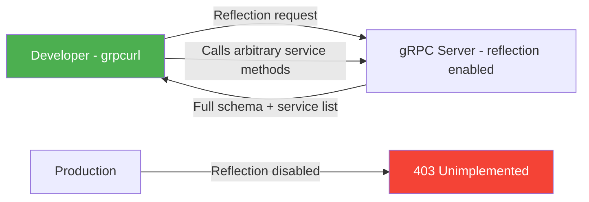

### Pitfalls
- ❌ **Leaving reflection enabled in production:** An attacker with network access can discover every gRPC method and test them.
- ❌ **Not using grpcurl in development:** It's the `curl` of gRPC; essential for debugging without a full client.

### Concept Reference

---

## Q10: Design a gRPC service definition for a payment processing API
**Role:** Senior | **Difficulty:** 🟡 | **Priority:** P1 | **Format:** Scenario

**Real Company:** Stripe (uses gRPC internally), Google Pay, Adyen

### The Brief
> "Design a gRPC service definition for a payment processing API. Include: charge creation, refunds, payment status streaming, and webhook delivery confirmation. Handle errors, idempotency, and schema evolution."

### Clarifying Questions
1. Is this internal service-to-service or externally facing?
2. What latency SLA for payment authorization? (typically <2s)
3. Do we need partial refunds or only full refunds?
4. What are the failure modes — network timeout during charge, partial processing?
5. How do downstream services get notified of payment events?

### Back-of-Envelope Estimation
| Metric | Calculation | Result |
|--------|-------------|--------|
| Transactions/sec | 100K merchants × 1 TPS average | 100K TPS peak |
| Status streaming connections | 5% of TPS = watching live | 5K concurrent streams |
| Proto message size | Charge request ~500 bytes | 0.5KB vs ~2KB JSON |
| Bandwidth savings | 100K TPS × 1.5KB saved | 150MB/s saved |

### High-Level Architecture

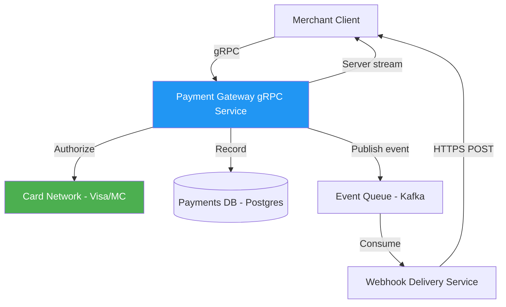

### Service Definition (pseudo-proto)

```proto
syntax = "proto3";
package payment.v1;

service PaymentService {
  // Unary: Create a charge
  rpc CreateCharge(CreateChargeRequest) returns (Charge);

  // Unary: Get charge by ID
  rpc GetCharge(GetChargeRequest) returns (Charge);

  // Unary: Create refund
  rpc CreateRefund(CreateRefundRequest) returns (Refund);

  // Server streaming: Stream payment status updates in real-time
  rpc WatchChargeStatus(WatchChargeRequest) returns (stream ChargeStatusEvent);

  // Client streaming: Batch confirm webhook deliveries
  rpc ConfirmWebhookDeliveries(stream WebhookDeliveryConfirmation)
    returns (BatchConfirmResult);
}

message CreateChargeRequest {
  string idempotency_key = 1;  // UUID - server deduplicates for 24h
  int64 amount_cents = 2;       // In smallest currency unit
  string currency = 3;          // ISO 4217: "USD", "EUR"
  string payment_method_id = 4; // Tokenized card reference
  string merchant_id = 5;
  string description = 6;
  map<string, string> metadata = 7;  // Arbitrary key-value pairs
}

message Charge {
  string id = 1;                     // ch_xxx
  ChargeStatus status = 2;
  int64 amount_cents = 3;
  string currency = 4;
  string merchant_id = 5;
  int64 created_at_unix = 6;
  string failure_code = 7;           // Empty string if success
  string failure_message = 8;

  // Field added in v1.1 - safe, old clients ignore
  string processor_transaction_id = 9;

  // Reserved for deleted fields
  reserved 20, 21;
  reserved "old_card_number";
}

enum ChargeStatus {
  CHARGE_STATUS_UNSPECIFIED = 0;
  CHARGE_STATUS_PENDING = 1;
  CHARGE_STATUS_SUCCEEDED = 2;
  CHARGE_STATUS_FAILED = 3;
  CHARGE_STATUS_REFUNDED = 4;
  CHARGE_STATUS_PARTIALLY_REFUNDED = 5;
}

message ChargeStatusEvent {
  string charge_id = 1;
  ChargeStatus new_status = 2;
  int64 timestamp_unix = 3;
  string reason = 4;
}
```

### Error Handling Design

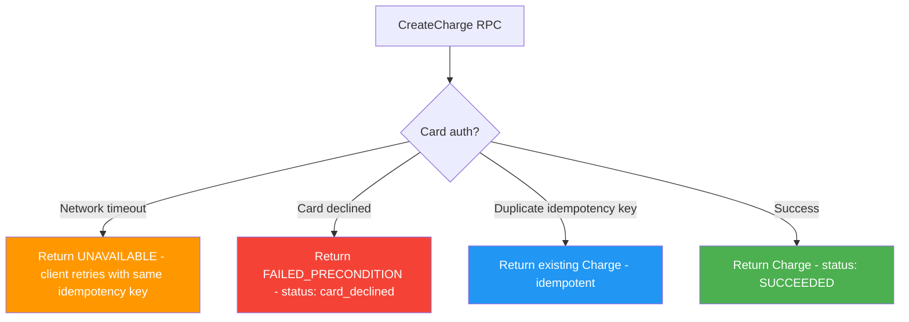

**gRPC error codes for payments:**
- `UNAVAILABLE` — card network timeout; safe to retry with same idempotency key
- `FAILED_PRECONDITION` — card declined, insufficient funds; do NOT retry
- `ALREADY_EXISTS` — idempotency key already used for different request
- `INVALID_ARGUMENT` — bad currency code, negative amount
- `RESOURCE_EXHAUSTED` — rate limit hit

### Trade-off Decisions
| Decision | Option A | Option B | Chosen | Why |
|----------|----------|----------|--------|-----|
| Idempotency | Client-generated key | Server auto-dedup | Client key | Client controls dedup window; server stores key for 24h |
| Status updates | Polling GetCharge | Server streaming | Streaming | Reduces polling load; merchant knows immediately |
| Webhook confirm | Individual RPCs | Client streaming | Client streaming | Batch confirms reduce RPC overhead |
| Amount type | float | int64 cents | int64 cents | Floating point precision bugs = financial loss |

### Failure Modes
| Failure | Impact | Mitigation |
|---------|--------|------------|
| Charge timeout at card network | Client unsure if charge succeeded | Return UNAVAILABLE; client retries with same idempotency key; server deduplicates |
| gRPC deadline expires mid-stream | Status stream drops | Client reconnects with last received event timestamp; server replays from there |
| Duplicate idempotency key different request | Ambiguous state | Return ALREADY_EXISTS; force client to use new key |
| Schema evolution breaks old merchant | Field type changed | Never change field type; only add new optional fields; reserve deleted numbers |

