# HTTP Internals

10 questions covering HTTP version differences, TLS handshake, multiplexing, QUIC, server push, and latency diagnosis.

---

## Q1: What are the key differences between HTTP/1.1, HTTP/2, and HTTP/3?
**Role:** Mid, Backend | **Difficulty:** 🟡 | **Priority:** P0 | **Format:** Quick Answer

> **What the interviewer is testing:** Protocol evolution knowledge and the practical impact on API performance.

### Answer in 60 seconds

| Feature | HTTP/1.1 | HTTP/2 | HTTP/3 |
|---------|---------|--------|--------|
| Transport | TCP | TCP | QUIC (UDP) |
| Multiplexing | ❌ (one request/connection) | ✅ (many streams per connection) | ✅ (many streams per connection) |
| Head-of-line blocking | ❌ At HTTP layer | ✅ Fixed at HTTP layer | ✅ Fixed completely |
| Header compression | ❌ Repeated headers | ✅ HPACK | ✅ QPACK |
| Server push | ❌ | ✅ (now deprecated by Chrome) | ✅ (rarely used) |
| Connection setup | 1 RTT (TCP) + TLS | 1 RTT + TLS (reused) | 0–1 RTT (QUIC 0-RTT) |
| Adoption | 100% | ~65% of web | ~30% of web |
| Browser support | Universal | Universal | Modern browsers |

**HTTP/1.1:** 6 connections per domain, each handles 1 in-flight request. Workarounds: domain sharding, request bundling (CSS sprites), inlining.

**HTTP/2:** One connection, 100+ concurrent streams. Binary framing. Header compression. 35% latency improvement over HTTP/1.1 in typical workloads.

**HTTP/3:** Built on QUIC (UDP-based). Eliminates TCP head-of-line blocking. 0-RTT connection resumption. Better on lossy networks (mobile). Deployed by Google, Facebook: 15–20% latency improvement on mobile.

### Diagram

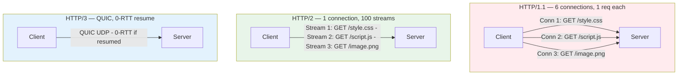

### Pitfalls
- ❌ **"HTTP/2 solves all performance problems":** HTTP/2 still has TCP-level head-of-line blocking; only HTTP/3/QUIC fixes it completely.
- ❌ **HTTP/2 push deprecated:** Chrome deprecated HTTP/2 server push in 2022 (2% usage, often harmful); don't design around it.

### Concept Reference
→ [API Design: REST, GraphQL, gRPC](../../../system-design/fundamentals/api-design-rest-graphql-grpc)

---

## Q2: What is head-of-line blocking and how does HTTP/2 solve it (and where it still exists)?
**Role:** Mid | **Difficulty:** 🟡 | **Priority:** P0 | **Format:** Quick Answer

> **What the interviewer is testing:** Deep understanding of why HTTP/2 helps but doesn't fully solve HOL blocking.

### Answer in 60 seconds
**Head-of-line (HOL) blocking:** A single slow/lost packet blocks all subsequent packets/requests from being processed.

**HTTP/1.1 HOL blocking:** Within one TCP connection, requests must be answered in order (HTTP pipelining). If response 1 is slow, responses 2, 3, 4 wait. Workaround: 6 parallel connections — but each has its own HOL.

**HTTP/2 solves HTTP-level HOL:** Multiplexing uses streams — responses can arrive out of order. Slow request 1 doesn't block request 2 from being returned on a different stream.

**BUT HTTP/2 still has TCP-level HOL:** HTTP/2 streams all share one TCP connection. If a TCP packet is lost, ALL streams stall until that packet is retransmitted (TCP requires in-order delivery). On 1% packet loss networks (mobile), TCP retransmission stalls all 100 HTTP/2 streams simultaneously.

**HTTP/3 (QUIC) fixes TCP-level HOL:** QUIC is built on UDP. Each QUIC stream handles its own retransmission independently. Packet loss on stream 1 doesn't block streams 2, 3, 4.

### Diagram

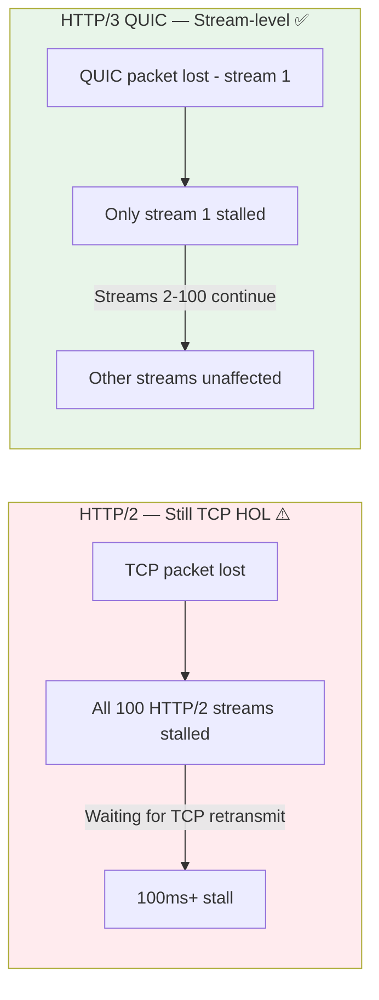

### Pitfalls
- ❌ **"HTTP/2 eliminated HOL blocking":** It eliminated application-level HOL; TCP-level HOL remains.
- ❌ **Dismissing HTTP/2 benefits:** Even with TCP HOL, HTTP/2 is a major improvement over HTTP/1.1 for most networks (low packet loss).

### Concept Reference
→ [API Design: REST, GraphQL, gRPC](../../../system-design/fundamentals/api-design-rest-graphql-grpc)

---

## Q3: How does HTTP/2 multiplexing work — how can one connection serve 100 streams?
**Role:** Senior | **Difficulty:** 🔴 | **Priority:** P1 | **Format:** Deep Dive

> **What the interviewer is testing:** Binary framing layer understanding — the core innovation in HTTP/2.

### Problem Constraints
| Dimension | Value |
|-----------|-------|
| HTTP/1.1 limit | 6 connections × 1 request = 6 concurrent requests |
| HTTP/2 goal | 1 connection, 100+ concurrent requests |
| Mechanism | Binary framing + streams |

### HTTP/2 Binary Framing

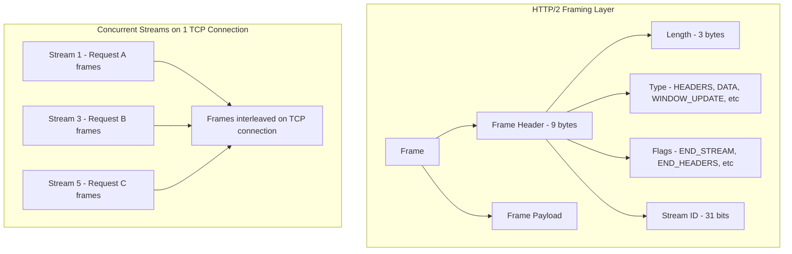

**How it works:**

1. **Binary frames (not text):** HTTP/2 breaks all communication into small binary frames (default max 16KB). No more text parsing.

2. **Stream IDs:** Every frame has a stream ID (odd numbers for client-initiated: 1, 3, 5...). Frames from different requests are interleaved on the wire; receiver reassembles by stream ID.

3. **Parallel streams:** Stream 1 can be mid-response (waiting for DB) while stream 3 returns immediately. No ordering constraint between streams.

4. **Flow control:** Each stream and the entire connection has independent flow control windows. Prevents fast sender from overwhelming slow receiver. Default window = 65KB; can be expanded via WINDOW_UPDATE frames.

5. **Stream prioritization:** Client can assign weights to streams (1–256) and dependencies. Browser prioritizes HTML > CSS > images.

**Example wire format (simplified):**
```
Frame 1: length=100, type=HEADERS, stream_id=1 [GET /api/users]
Frame 2: length=50, type=HEADERS, stream_id=3 [GET /api/orders]
Frame 3: length=16384, type=DATA, stream_id=3 [orders response - large]
Frame 4: length=500, type=DATA, stream_id=1 [users response - small]
Frame 5: END_STREAM, stream_id=3
Frame 6: END_STREAM, stream_id=1
```
Stream 3 (large response) and stream 1 (small response) are interleaved — both arrive concurrently.

| Dimension | HTTP/1.1 | HTTP/2 |
|-----------|---------|--------|
| Concurrency mechanism | Multiple TCP connections | Multiple streams on 1 connection |
| Request ordering | Sequential per connection | Parallel, any order |
| Header format | Text + repeated | Binary + HPACK compressed |
| Frame size | Unlimited (chunked) | Max 16MB (configurable) |

### Recommended Answer
HTTP/2 multiplexing works via the **binary framing layer**: all HTTP messages are split into frames tagged with a Stream ID. The server interleaves frames from different streams on one TCP connection. The receiving side reassembles frames by stream ID. Flow control per stream prevents any one stream from monopolizing the connection.

### What a great answer includes
- [ ] Explains binary framing (not text) as the fundamental change
- [ ] Describes stream IDs and how they enable concurrent in-flight requests
- [ ] Notes flow control windows per stream and connection
- [ ] Contrasts with HTTP/1.1's one-request-per-connection limitation
- [ ] Mentions HPACK header compression as bonus optimization

### Pitfalls
- ❌ **"HTTP/2 is just HTTP over multiple connections":** No — it's multiple logical streams over ONE TCP connection.
- ❌ **Ignoring flow control:** Without flow control, a slow client receiving a large response would block faster requests on the same connection.

### Concept Reference
→ [API Design: REST, GraphQL, gRPC](../../../system-design/fundamentals/api-design-rest-graphql-grpc)

---

## Q4: What is the TLS handshake process (TLS 1.3 vs 1.2)?
**Role:** Mid | **Difficulty:** 🟡 | **Priority:** P1 | **Format:** Quick Answer

> **What the interviewer is testing:** Security protocol knowledge and why TLS 1.3 is faster.

### Answer in 60 seconds

**TLS 1.2 handshake (2 RTTs):**
1. Client → Server: ClientHello (cipher suites, random)
2. Server → Client: ServerHello, Certificate, ServerHelloDone
3. Client → Server: KeyExchange, ChangeCipherSpec, Finished
4. Server → Client: ChangeCipherSpec, Finished
Total: 2 RTTs before data transfer

**TLS 1.3 handshake (1 RTT, or 0-RTT for resumption):**
1. Client → Server: ClientHello + KeyShare (includes DH public key upfront)
2. Server → Client: ServerHello, KeyShare, Certificate, Finished (encrypted)
3. Client → Server: Finished + first data (can send immediately after server's message)
Total: 1 RTT before data transfer

**0-RTT (Session Resumption):** Client caches session ticket from previous connection. Next connection: client sends data immediately with the first packet — 0 round trips for resumption. Trade-off: vulnerable to replay attacks for non-idempotent requests.

**TLS 1.3 security improvements:**
- Removed insecure cipher suites (RSA key exchange, MD5, SHA-1, 3DES)
- All cipher suites provide **forward secrecy** (ECDHE mandatory)
- Certificates encrypted (eavesdropper can't see which site you're visiting)

### Diagram

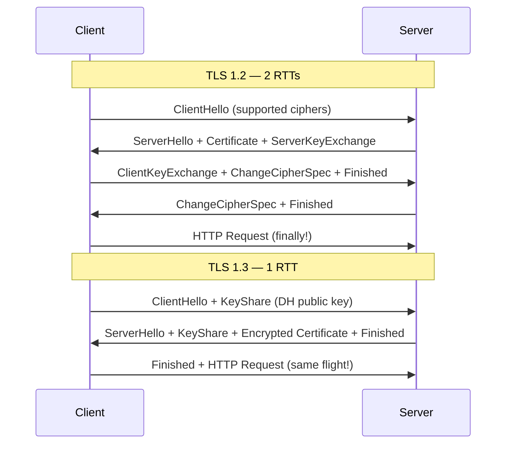

### Pitfalls
- ❌ **0-RTT for POST requests:** 0-RTT data can be replayed by attackers; only use for idempotent GETs.
- ❌ **Not disabling TLS 1.0/1.1:** Outdated versions have known vulnerabilities (BEAST, POODLE); disable at load balancer level.

### Concept Reference
→ [Security Quick Reference](../../../quick-reference/security-encryption/)

---

## Q5: How does QUIC (HTTP/3) eliminate head-of-line blocking that HTTP/2 still has?
**Role:** Senior | **Difficulty:** 🔴 | **Priority:** P2 | **Format:** Deep Dive

> **What the interviewer is testing:** Understanding of why QUIC rebuilt TCP semantics on UDP.

### Problem Constraints
| Dimension | Value |
|-----------|-------|
| HTTP/2 weakness | TCP packet loss stalls all streams |
| Packet loss on mobile networks | 1–5% common |
| Observed impact | 1% packet loss → 50% throughput reduction on HTTP/2 |
| Goal | Maintain stream independence even under packet loss |

### TCP HOL Blocking in HTTP/2

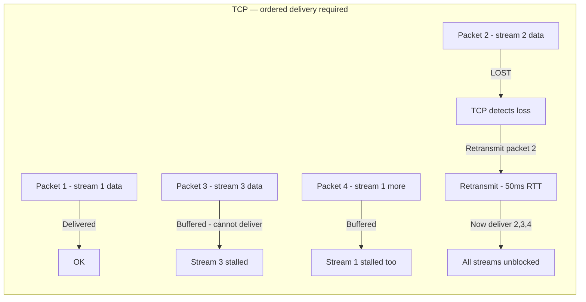

TCP delivers packets in-order to the application. Even if packets 3 and 4 arrived, TCP buffers them until the lost packet 2 is retransmitted. HTTP/2 streams are unaware of this — all streams stall.

### QUIC Stream Independence

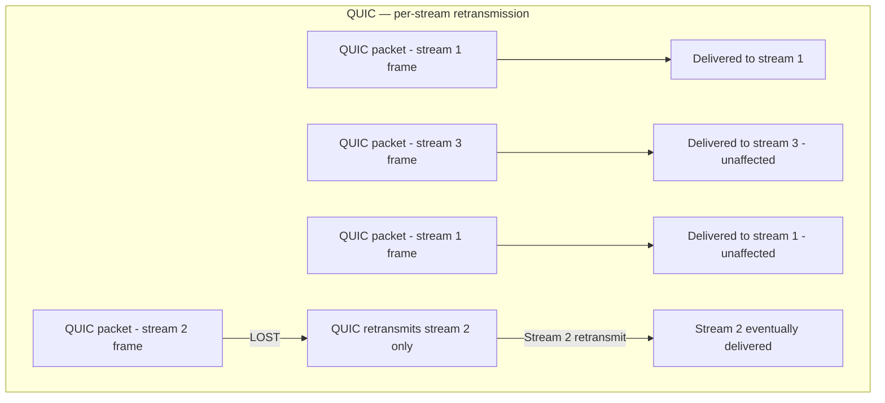

QUIC delivers frames per-stream to the application. Loss on stream 2 triggers retransmission only for stream 2's packets. Streams 1 and 3 continue receiving data immediately.

**Other QUIC innovations:**
1. **Connection migration:** QUIC connections are identified by Connection ID (not IP:port). If user's IP changes (switching from WiFi to LTE), connection continues without TLS re-handshake.
2. **0-RTT connection setup:** QUIC combines transport and TLS handshake; resuming connections cost 0 RTTs.
3. **Congestion control:** QUIC implements congestion control in user space — upgradeable without OS kernel changes (TCP congestion changes require OS updates).
4. **No kernel bottleneck:** QUIC runs in user space; TCP is in OS kernel. Google's QUIC implementation ships new features in 6 weeks vs years for TCP in Linux kernel.

| Dimension | HTTP/2 over TCP | HTTP/3 over QUIC |
|-----------|----------------|-----------------|
| HOL blocking | TCP-level (all streams stall) | None |
| Connection migration | ❌ IP change = reconnect | ✅ Transparent migration |
| Connection setup | 1–2 RTTs (TCP + TLS) | 0–1 RTT |
| Packet loss handling | All streams stall | Per-stream |
| Firewall support | ✅ TCP everywhere | ⚠️ UDP blocked in some networks |

### Recommended Answer
QUIC eliminates TCP HOL blocking by building multiplexing directly into the transport protocol. Each QUIC stream handles its own retransmission; packet loss on one stream doesn't stall others. On top of that, QUIC's connection migration and 0-RTT make mobile networks dramatically better — Google reports 15–20% latency improvement on mobile vs HTTP/2.

### What a great answer includes
- [ ] Explains why TCP causes HOL blocking (in-order delivery requirement)
- [ ] Describes QUIC per-stream retransmission
- [ ] Mentions connection migration (Connection ID vs IP:port)
- [ ] Notes 0-RTT connection resumption
- [ ] Acknowledges UDP firewall concern as a real deployment challenge

### Pitfalls
- ❌ **QUIC everywhere immediately:** ~5% of corporate networks block UDP; HTTP/2 fallback is essential.
- ❌ **QUIC in user space = insecure:** User-space doesn't mean unencrypted; QUIC mandates TLS 1.3 — always encrypted.

### Concept Reference
→ [API Design: REST, GraphQL, gRPC](../../../system-design/fundamentals/api-design-rest-graphql-grpc)

---

## Q6: How do keep-alive connections reduce latency and server load?
**Role:** Senior | **Difficulty:** 🟡 | **Priority:** P2 | **Format:** Quick Answer

> **What the interviewer is testing:** Understanding of TCP connection reuse and its importance for high-throughput APIs.

### Answer in 60 seconds
**Without keep-alive:** Every HTTP request = new TCP connection = SYN, SYN-ACK, ACK (3-way handshake = 1 RTT) + TLS handshake (1-2 RTTs more). Total overhead per request: 2–3 RTTs ≈ 50–200ms on WAN.

**HTTP/1.1 keep-alive:** Single TCP connection reused for multiple requests. Subsequent requests skip TCP + TLS handshake. Header: `Connection: keep-alive` (default in HTTP/1.1).

**HTTP/2 multiplexing:** One TCP connection for all requests. Keep-alive concept built-in.

**Server-side configuration (Nginx):**
```nginx
keepalive_timeout 65s;        # Close idle connection after 65s
keepalive_requests 1000;      # Max requests per connection
```

**Client connection pooling:**
- HTTP client libraries maintain a pool of persistent connections
- Pool size matters: too few = connection establishment latency on burst; too many = server connection limit exceeded
- Typical pool size: 10–50 connections per host

**Impact:**
- API gateway to backend services: connection pooling reduces latency by 50–100ms per cold request
- 10K req/sec with 1ms connection setup = 10s of overhead/sec saved with pooling

### Diagram

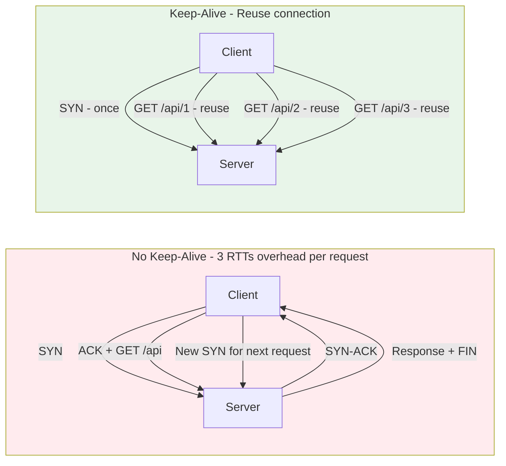

### Pitfalls
- ❌ **Keep-alive with too long timeout:** Server holds 100K idle connections; each costs ~10KB file descriptor and memory.
- ❌ **No keep-alive between services:** Internal service-to-service calls benefit just as much as client-to-server; always pool connections in microservices.

### Concept Reference
→ [API Design: REST, GraphQL, gRPC](../../../system-design/fundamentals/api-design-rest-graphql-grpc)

---

## Q7: What is chunked transfer encoding and when is it used?
**Role:** Staff | **Difficulty:** 🟡 | **Priority:** P2 | **Format:** Quick Answer

> **What the interviewer is testing:** Understanding of streaming HTTP responses and when Content-Length can't be set upfront.

### Answer in 60 seconds
**Chunked transfer encoding:** HTTP/1.1 mechanism to send responses in pieces without knowing total size upfront.

Header: `Transfer-Encoding: chunked` (replaces `Content-Length` when size is unknown)

Wire format:
```
HTTP/1.1 200 OK
Transfer-Encoding: chunked

5\r\n
Hello\r\n
7\r\n
 World\r\n
0\r\n
\r\n
```
Each chunk prefixed with its size in hex. `0` terminates the stream.

**When you need it:**
- Streaming database query results (don't buffer 1M rows — stream as they come)
- Server-sent events (SSE)
- Large file downloads where total size isn't known
- Proxy responses where upstream doesn't set Content-Length

**HTTP/2 equivalent:** HTTP/2 DATA frames with `END_STREAM` flag — same concept, different framing. `Transfer-Encoding: chunked` header is stripped by HTTP/2 (built into framing).

**Performance implication:** Clients can start rendering/processing before full response arrives. Browser progressive rendering depends on chunked transfer of HTML.

### Diagram

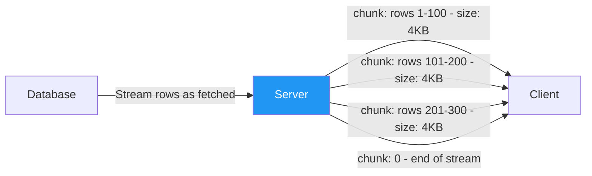

### Pitfalls
- ❌ **Using chunked for small responses:** For responses < 1KB, the overhead of chunked framing vs Content-Length is unnecessary.
- ❌ **Not handling chunked in API clients:** Some HTTP client libraries need explicit configuration to process chunked streams incrementally vs buffering the whole response.

### Concept Reference
→ [API Design: REST, GraphQL, gRPC](../../../system-design/fundamentals/api-design-rest-graphql-grpc)

---

## Q8: How does HTTP/2 server push work and why did browsers deprecate it?
**Role:** Staff | **Difficulty:** 🔴 | **Priority:** P2 | **Format:** Deep Dive

> **What the interviewer is testing:** Why a theoretically good optimization failed in practice — an important lesson in complexity vs real-world behavior.

### Problem Constraints
| Dimension | Value |
|-----------|-------|
| Original goal | Eliminate round trips for known dependencies (CSS, JS) |
| Theoretical gain | 1 RTT saved per pushed resource |
| Chrome deprecation | November 2022 |
| Actual usage | <1% of HTTPS responses used push |

### How Server Push Works

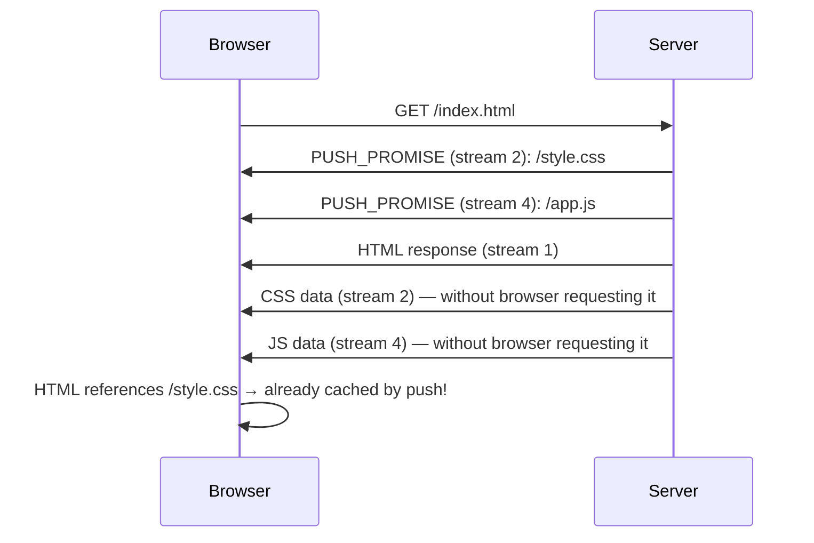

HTTP/2 `PUSH_PROMISE` frame: server proactively sends resources before browser knows it needs them.

### Why It Mostly Failed

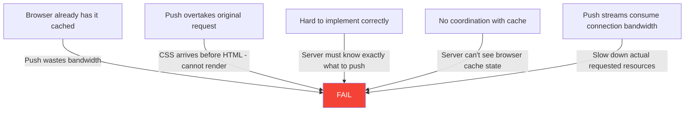

**Core problem:** Server doesn't know what's in the browser cache. If it pushes `/style.css` but the client has it cached, you've wasted bandwidth and connection capacity. This is the most fundamental issue.

**Alternative that works better:** `<link rel="preload">` hints — browser controls what it prefetches based on its own cache state. `103 Early Hints` HTTP status code: server sends early hints response before full response — browser starts fetching dependencies with full cache awareness.

**`103 Early Hints` (modern replacement):**
```
HTTP/1.1 103 Early Hints
Link: </style.css>; rel=preload; as=style
Link: </app.js>; rel=preload; as=script
```
Browser receives early hints, checks cache, requests missing resources, all before server finishes generating the main response. Works with HTTP/1.1 and HTTP/2.

### Recommended Answer
Server push was deprecated because it couldn't solve the cache coordination problem — server pushes resources the client already has, wasting bandwidth. The replacement pattern (`103 Early Hints` + `<link rel="preload">`) achieves the same latency benefit without the waste, because the browser controls prefetching based on its own cache state.

### What a great answer includes
- [ ] Explains the core push mechanism (PUSH_PROMISE frame)
- [ ] Names the cache coordination problem as the fundamental flaw
- [ ] Mentions 103 Early Hints as the practical replacement
- [ ] Notes Chrome's deprecation (2022)
- [ ] Acknowledges that push had legitimate narrow use cases (custom non-caching proxies)

### Pitfalls
- ❌ **Designing HTTP/2 push into new systems:** Chrome deprecated it; don't implement it for new systems.
- ❌ **Confusing push with WebSocket push:** HTTP/2 server push is a one-time connection-setup feature; WebSocket push is ongoing; completely different.

### Concept Reference
→ [API Design: REST, GraphQL, gRPC](../../../system-design/fundamentals/api-design-rest-graphql-grpc)

---

## Q9: What is HPACK header compression in HTTP/2 and why does it matter?
**Role:** Staff | **Difficulty:** 🔴 | **Priority:** P3 | **Format:** Quick Answer

> **What the interviewer is testing:** Understanding of HTTP/2's header optimization and the CRIME attack that motivated it.

### Answer in 60 seconds
**HPACK** (Header Compression for HTTP/2): A compression format specifically designed for HTTP headers that avoids the security vulnerability of gzip compression on headers (CRIME attack).

**Why headers are a performance problem:**
- HTTP/1.1 headers are text, repeated on every request: `Cookie: session=abc123` might be 500 bytes, sent identically on every request
- At 1,000 req/sec, sending 500-byte cookie header = 500KB/s just in cookies
- HTTP/2 multiplexes 100 requests over one connection — all headers amplified

**HPACK mechanism:**
1. **Static table:** 61 predefined headers (`:method GET`, `:status 200`, `content-type text/html`, etc.) encoded as 1–2 bytes
2. **Dynamic table:** Both sides maintain a synchronized table of recently seen headers. New header = literal encoding + add to dynamic table. Repeated header = 1-byte index reference.
3. **Huffman encoding:** Header values Huffman-encoded for additional ~30% compression

**Result:** After first request, repeated headers (Cookie, Authorization, Accept-Encoding) compressed to 1–3 bytes. Reduces header overhead by 85–95%.

**Why not gzip?** CRIME attack (2012): Adaptive compression + chosen plaintext → extract secrets from compressed headers. HPACK uses static Huffman codes (non-adaptive) that are immune to CRIME.

### Diagram

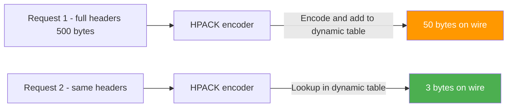

### Pitfalls
- ❌ **Forgetting HPACK is stateful between client and server:** Dynamic table must be synchronized; resetting connection = lose dynamic table entries, cold-start compression again.
- ❌ **HTTP/3 uses QPACK, not HPACK:** QPACK is HPACK adapted for QUIC's stream ordering (out-of-order frames in QUIC would corrupt HPACK state).

### Concept Reference
→ [API Design: REST, GraphQL, gRPC](../../../system-design/fundamentals/api-design-rest-graphql-grpc)

---

## Q10: Your API has 80ms p99 latency but clients report 400ms — diagnose using HTTP internals
**Role:** Senior | **Difficulty:** 🔴 | **Priority:** P1 | **Format:** Scenario

**Real Company:** Common problem at any company with distributed clients

### The Brief
> "Your API server-side logs show p99 = 80ms. Client-side monitoring reports p99 = 400ms. The 320ms gap is unexplained. Walk through your diagnosis using your knowledge of HTTP internals."

### Clarifying Questions
1. What HTTP version? (HTTP/1.1 vs 2 changes analysis significantly)
2. Is this a global issue or specific geographic region?
3. Are these mobile clients or server-to-server?
4. What is measured — time-to-first-byte or full response time?
5. Does the gap increase with payload size?

### Back-of-Envelope Estimation
| Component | Typical latency | Plausible culprit |
|-----------|----------------|-------------------|
| DNS lookup | 20–200ms (cold) | First request after TTL expiry |
| TCP handshake | 50–150ms (WAN) | New connection per request |
| TLS handshake | 50–200ms (1.2) / 30ms (1.3) | TLS version or no session resumption |
| TCP HOL blocking | 50–500ms | HTTP/2 on lossy mobile network |
| CDN miss | 20–100ms | Edge cache miss going to origin |
| Client processing | 5–20ms | JSON parsing of large payload |

**320ms gap candidates = ~2 RTTs on a 150ms WAN connection.** Likely DNS + TCP + TLS cold start.

### Diagnosis Flowchart

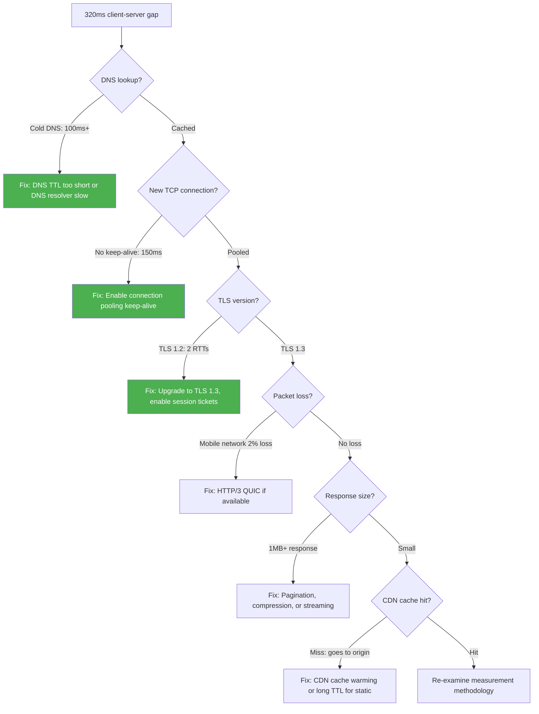

### Investigation Steps

**Step 1 — Client-side timing breakdown:**
Use browser Performance API or mobile HTTP client timing:
```
DNS: t_dns_end - t_dns_start
Connect: t_connect_end - t_connect_start
TLS: t_tls_end - t_tls_start
TTFB: t_first_byte - t_request_start
Transfer: t_response_end - t_first_byte
```
If 200ms is in `Connect` time → TCP/TLS cold start is the issue.

**Step 2 — Check HTTP version:**
- HTTP/1.1: Likely seeing connection establishment overhead per request
- Switch to HTTP/2: Persistent multiplexed connection eliminates repeated TCP/TLS setup

**Step 3 — Geography:**
- 320ms ≈ 2 RTTs. If clients are 160ms from server (cross-continent), this is expected
- Fix: CDN edge nodes closer to users; Cloudflare edge in 200 cities

**Step 4 — Client sampling bias:**
- Server p99 measured at server process
- Client p99 includes scheduling jitter, background process interruption, garbage collection
- Mobile clients: GC pause can add 50–200ms intermittently

### Trade-off Analysis

| Root Cause | Fix | Impact | Effort |
|------------|-----|--------|--------|
| DNS cold start | Increase DNS TTL to 300s | -100ms cold | Low |
| No connection pooling | Enable HTTP/2 keep-alive | -150ms | Medium |
| TLS 1.2 | Upgrade to TLS 1.3 + session tickets | -100ms warm | Medium |
| Geographic distance | CDN edge nodes | -150ms | High |
| No compression | gzip/brotli response body | -50ms transfer | Low |

### Concept References
→ [API Design: REST, GraphQL, gRPC](../../../system-design/fundamentals/api-design-rest-graphql-grpc)
→ [Load Balancing](../../../system-design/fundamentals/load-balancing)
