# REST API Design Principles

10 questions covering REST constraints, HTTP verbs, resource naming, pagination, and real-world API design from companies like Stripe.

---

## Q1: What makes an API RESTful? Name the 5 constraints.
**Role:** Junior, Backend | **Difficulty:** 🟢 | **Priority:** P0 | **Format:** Quick Answer

> **What the interviewer is testing:** Whether you understand REST as an architectural style, not just "an API over HTTP."

### Answer in 60 seconds
- **Client-Server:** UI and data storage concerns are separated; they evolve independently
- **Stateless:** Each request contains all information needed; server holds no session state between requests
- **Cacheable:** Responses must define themselves as cacheable or non-cacheable (via `Cache-Control`)
- **Uniform Interface:** Resources identified via URIs, manipulated through representations, self-descriptive messages, HATEOAS
- **Layered System:** Client cannot tell whether it talks to origin server or intermediary (proxy, CDN); enables scaling

*Bonus 6th constraint:* Code on Demand (optional) — server can return executable code (JavaScript) to clients.

### Diagram

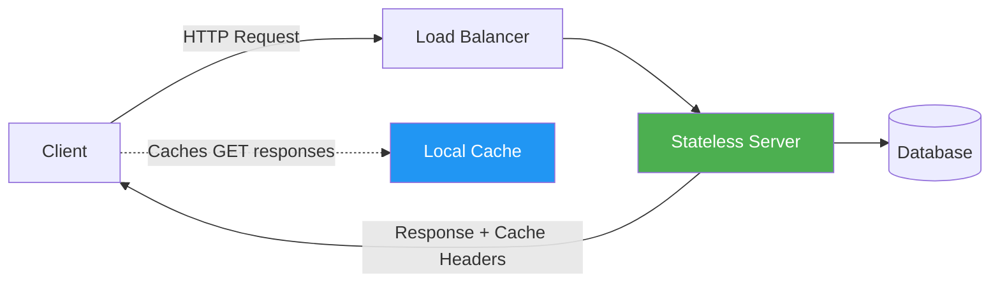

### Pitfalls
- ❌ **"REST means JSON over HTTP":** REST is protocol-agnostic; you can use XML, Protobuf, or plain text. JSON is common, not required.
- ❌ **Ignoring Stateless constraint:** Storing session state server-side (e.g., sticky sessions) violates REST and kills horizontal scaling.
- ❌ **Confusing REST with CRUD:** REST resources map to domain objects, not database tables; one endpoint can trigger complex business logic.

### Concept Reference

---

## Q2: How do you choose the right HTTP verb (GET/POST/PUT/PATCH/DELETE)?
**Role:** Mid, Backend | **Difficulty:** 🟢 | **Priority:** P0 | **Format:** Quick Answer

> **What the interviewer is testing:** Understanding of idempotency, safety, and semantic correctness of HTTP verbs.

### Answer in 60 seconds
- **GET:** Read resource; safe (no side effects) + idempotent; response should be cacheable
- **POST:** Create resource or trigger action; NOT idempotent — calling twice creates two resources
- **PUT:** Full replacement of resource; idempotent — same result if called multiple times
- **PATCH:** Partial update; NOT guaranteed idempotent (depends on implementation; JSON Patch is idempotent, "increment by 1" is not)
- **DELETE:** Remove resource; idempotent — deleting an already-deleted resource returns 404 or 204, not an error

| Verb | Safe | Idempotent | Cacheable |
|------|------|------------|-----------|
| GET | ✅ | ✅ | ✅ |
| POST | ❌ | ❌ | ❌ |
| PUT | ❌ | ✅ | ❌ |
| PATCH | ❌ | ⚠️ | ❌ |
| DELETE | ❌ | ✅ | ❌ |

### Diagram

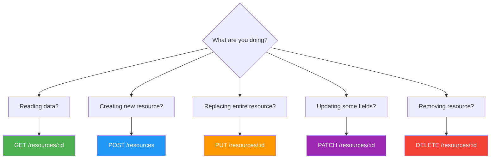

### Pitfalls
- ❌ **Using POST for everything:** Loses idempotency guarantees; retry logic becomes dangerous.
- ❌ **GET with request body:** Technically allowed but many proxies/CDNs strip GET bodies; use query params instead.
- ❌ **PUT with partial data:** PUT must send the full representation; fields omitted in PUT are deleted/nulled.

### Concept Reference

---

## Q3: How do you design resource naming for a complex domain (orders, line items, products)?
**Role:** Senior | **Difficulty:** 🟡 | **Priority:** P0 | **Format:** Deep Dive

> **What the interviewer is testing:** Ability to model domain objects as REST resources, handle nested relationships, and balance purity with pragmatism.

### Problem Constraints
| Dimension | Value |
|-----------|-------|
| Domain objects | Orders, Line Items, Products, Customers, Fulfillments |
| Nesting depth | Max 2 levels recommended |
| Relationship type | Order contains LineItems (parent-child); LineItem references Product (cross-reference) |
| Team size | 5 backend engineers, multiple client teams |

### Approach A — Deep Nesting

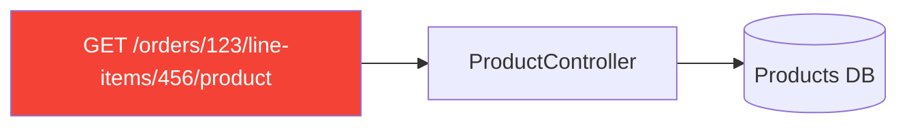

URI: `/orders/{orderId}/line-items/{lineItemId}/product/{productId}`

| Dimension | Deep Nesting |
|-----------|-------------|
| Discoverability | Low — clients must know parent IDs |
| Coupling | High — URI encodes parent chain |
| Flexibility | Low — product appears in multiple contexts |
| URL length | Long, hard to bookmark/share |

### Approach B — Flat Resources with Filters

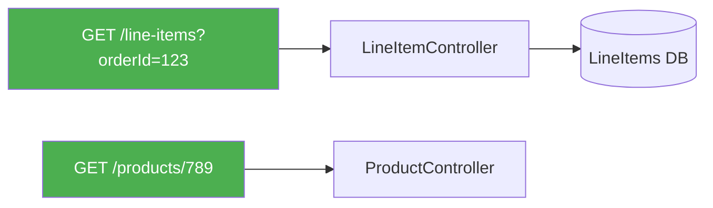

URI: `/line-items?order_id=123` and separately `/products/{productId}`

| Dimension | Flat Resources |
|-----------|---------------|
| Discoverability | High — each resource has canonical URL |
| Coupling | Low — product URL is stable |
| Multiple fetches | Required for related data |
| Cacheability | High — product responses cacheable |

### Approach C — Shallow Nesting (Recommended)

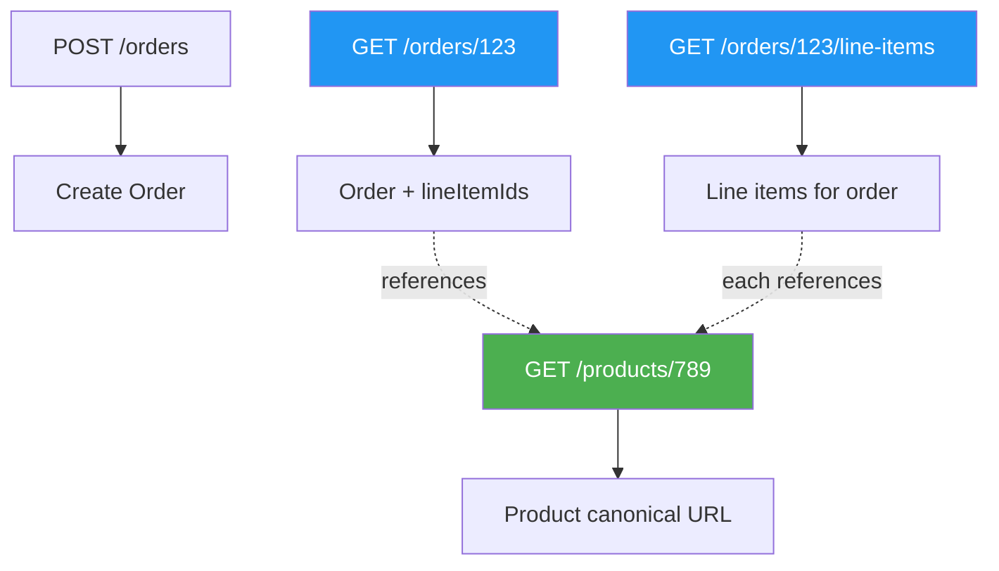

Rules:
1. Max 2 levels: `/orders/{id}/line-items` ✅, `/orders/{id}/line-items/{id}/product` ❌
2. Child-only resources can nest: line items only exist within an order
3. Cross-domain references use canonical URL: `product_url: "/products/789"`
4. Use query params for filtering: `GET /line-items?order_id=123&status=shipped`

### Recommended Answer
**Approach C — Shallow Nesting.** Use `/orders/{id}/line-items` for child resources owned by the parent. Use canonical flat URIs (`/products/{id}`) for shared resources. Depth beyond 2 should be flattened with query params. This aligns with how Stripe (charges/invoices), Twilio, and GitHub (repos/issues) design their APIs.

### What a great answer includes
- [ ] States max 2 levels of nesting as a rule
- [ ] Distinguishes parent-child ownership vs cross-reference relationships
- [ ] Mentions at least one real API (Stripe, GitHub, Twilio) as a reference
- [ ] Addresses HATEOAS or link headers for related resource discovery
- [ ] Considers plural nouns: `/orders` not `/order`

### Pitfalls
- ❌ **3+ levels deep:** `/a/{id}/b/{id}/c/{id}` — becomes unreadable and couples clients to parent hierarchy.
- ❌ **Verbs in URLs:** `/orders/123/processPayment` — use `POST /orders/123/payment-intents` instead.
- ❌ **Inconsistent naming:** mixing `camelCase`, `snake_case`, and `kebab-case` across endpoints confuses SDK generators.

### Concept Reference

---

## Q4: How do you handle pagination — cursor-based vs offset-based?
**Role:** Mid, Backend | **Difficulty:** 🟡 | **Priority:** P1 | **Format:** Quick Answer

> **What the interviewer is testing:** Understanding of pagination trade-offs and which to use at scale vs small datasets.

### Answer in 60 seconds
- **Offset-based:** `GET /orders?page=3&limit=20` — skip N rows, take 20. Simple, supports jumping to page N. Breaks on inserts (items shift pages). Slow at deep pages (OFFSET 1M scans 1M rows).
- **Cursor-based:** `GET /orders?cursor=eyJpZCI6MTAwfQ&limit=20` — cursor encodes last-seen position (e.g., base64 of `{id: 100}`). Stable under inserts. Cannot jump to arbitrary page. Used by Twitter, Facebook, Stripe.

| Dimension | Offset | Cursor |
|-----------|--------|--------|
| Jump to page N | ✅ | ❌ |
| Stable under inserts | ❌ | ✅ |
| DB performance at depth | ❌ O(offset) scan | ✅ index seek |
| Implementation complexity | Low | Medium |
| Best for | Admin panels, small datasets | Feeds, infinite scroll, large tables |

Stripe cursor: next `starting_after=ch_xyz` — opaque, encodes last object ID.

### Diagram

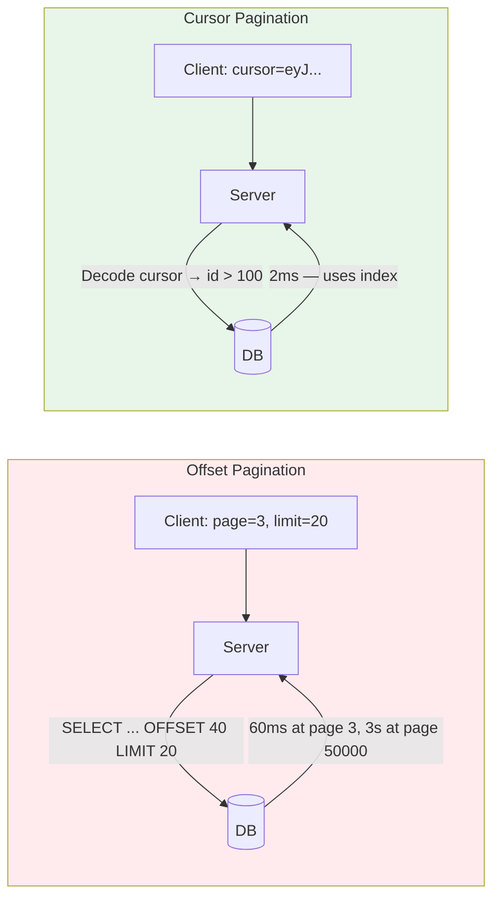

### Pitfalls
- ❌ **Offset pagination on large tables:** `OFFSET 100000 LIMIT 20` scans and discards 100K rows every time.
- ❌ **Cursor leaking PII:** Don't base64 encode email addresses or user IDs directly; use opaque cursor tokens or encrypt.
- ❌ **No total count with cursors:** Clients can't show "page 3 of 47" — design UI for infinite scroll instead.

### Concept Reference

---

## Q5: Which HTTP status codes do you return for which scenarios?
**Role:** Mid, Backend | **Difficulty:** 🟢 | **Priority:** P1 | **Format:** Quick Answer

> **What the interviewer is testing:** Correct semantic use of HTTP status codes, not just 200/400/500.

### Answer in 60 seconds

**2xx — Success**
- `200 OK` — successful GET, PUT, PATCH
- `201 Created` — successful POST that creates a resource; include `Location` header with new resource URL
- `202 Accepted` — async operation started; include status polling URL
- `204 No Content` — successful DELETE or PUT with no response body

**4xx — Client Error**
- `400 Bad Request` — malformed JSON, missing required field
- `401 Unauthorized` — not authenticated (no/invalid token)
- `403 Forbidden` — authenticated but not authorized
- `404 Not Found` — resource doesn't exist
- `409 Conflict` — duplicate create, optimistic lock failure
- `422 Unprocessable Entity` — syntactically valid but semantically invalid (e.g., end date before start date)
- `429 Too Many Requests` — rate limit hit; include `Retry-After` header

**5xx — Server Error**
- `500 Internal Server Error` — unexpected exception
- `502 Bad Gateway` — upstream service failed
- `503 Service Unavailable` — intentional shutdown / circuit open; include `Retry-After`

### Diagram

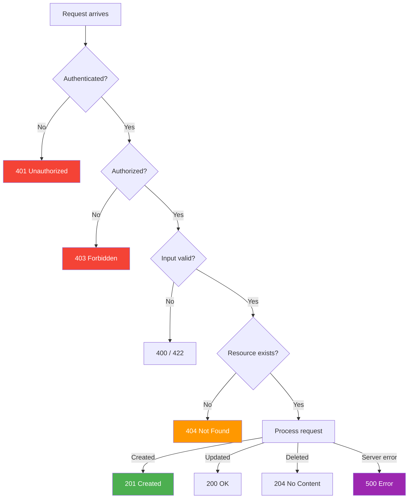

### Pitfalls
- ❌ **401 vs 403 confusion:** 401 = "who are you?", 403 = "I know who you are, you can't do this."
- ❌ **Returning 200 with error body:** `{ "status": "error" }` in a 200 response — breaks HTTP clients and monitoring.
- ❌ **Never using 202:** Async operations (video processing, email sending) should return 202 + polling URL, not make the client wait.

### Concept Reference

---

## Q6: How did Stripe design their API for maximum developer experience?
**Role:** Senior | **Difficulty:** 🟡 | **Priority:** P1 | **Format:** Deep Dive

> **What the interviewer is testing:** Ability to reason about API design as a product, not just a technical interface.

### Problem Constraints
| Dimension | Value |
|-----------|-------|
| API age | 2011 to present (15+ years backward compatible) |
| Clients | Millions of businesses, 8+ official SDK languages |
| Version count | 35+ API versions maintained simultaneously |
| Uptime requirement | 99.9999% for payment processing |

### Approach A — Version in URL, Break Freely

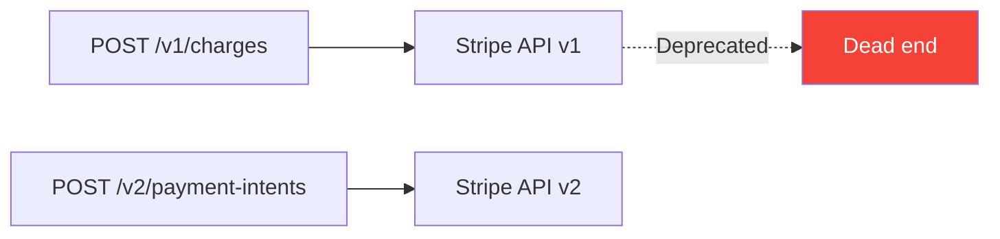

Result: Developers must migrate — costly, creates churn.

### Approach B — Stripe's Actual Design

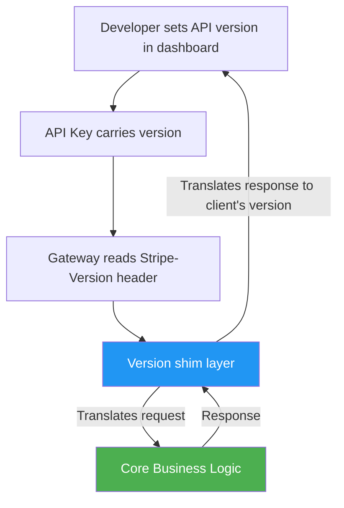

Key design decisions Stripe made:

1. **Idempotency keys:** `POST /charges` with `Idempotency-Key: uuid` — safe to retry on network failure. Server deduplicates for 24 hours.
2. **Consistent error objects:** Every error has `type`, `code`, `message`, `param` — machine-parseable, not just human-readable strings.
3. **Expand syntax:** `GET /charges/ch_123?expand[]=customer` — avoids N+1 round trips without GraphQL complexity.
4. **Pagination consistency:** Every list endpoint uses `has_more`, `data[]`, `starting_after` cursor — same shape everywhere.
5. **Webhook retries with exponential backoff:** Events retry for 3 days, with signing via `Stripe-Signature` header.
6. **Version pinning per API key:** Developers pin their version in dashboard; Stripe's shim layer translates.

### Recommended Answer
Stripe's DX excellence comes from **treating API consistency as a product feature**. Same pagination shape, same error shape, idempotency keys on all writes, expand syntax for related resources, and version pinning so developers never get surprised by breaking changes. The shim layer is the secret — it allows internal models to evolve while external contracts stay stable.

### What a great answer includes
- [ ] Mentions idempotency keys with specific behavior (24h dedup window)
- [ ] Explains versioning strategy (header + shim layer, not URL path)
- [ ] Notes consistent error format across all endpoints
- [ ] Mentions expand syntax as alternative to GraphQL for related data
- [ ] References Stripe's changelog/API versioning philosophy

### Pitfalls
- ❌ **Ignoring developer experience as a first-class concern:** DX = adoption = revenue for API-first companies.
- ❌ **Inconsistent error shapes:** `{ "error": "..." }` vs `{ "message": "..." }` vs `{ "errors": [] }` forces SDK authors to handle every case.
- ❌ **No idempotency on writes:** Without idempotency keys, network retries create duplicate charges/records.

### Concept Reference

---

## Q7: What is HATEOAS and is it practical?
**Role:** Senior | **Difficulty:** 🟡 | **Priority:** P2 | **Format:** Quick Answer

> **What the interviewer is testing:** Understanding of REST Level 3 and the trade-off between theoretical purity and engineering pragmatism.

### Answer in 60 seconds
**HATEOAS** = Hypermedia As The Engine Of Application State. The response includes links to valid next actions, so clients don't hardcode URLs or state machines.

Example response:
```
GET /orders/123
{
  "id": 123,
  "status": "pending",
  "_links": {
    "self": "/orders/123",
    "cancel": "/orders/123/cancel",
    "pay": "/orders/123/payment",
    "items": "/orders/123/line-items"
  }
}
```

**Is it practical?** Rarely in practice:
- Server controls valid actions (not client) — good for security
- Client doesn't need to hardcode state machine transitions
- **But:** Clients still need to understand link semantics ("what does `cancel` mean?")
- **And:** Most clients hardcode URLs anyway; type-safe SDKs can't use dynamic links
- **Reality:** GitHub API, PayPal v2, HAL, and JSON:API implement it; most enterprise REST APIs skip it

Richardson Maturity Model: Level 0 = one endpoint, Level 1 = resources, Level 2 = HTTP verbs, Level 3 = HATEOAS.

### Diagram

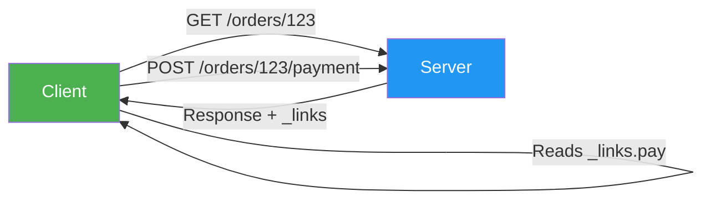

### Pitfalls
- ❌ **Dismissing HATEOAS entirely:** It does solve state machine coupling; understand the trade-off before rejecting.
- ❌ **Implementing HATEOAS without semantic link types:** Returning `{"href": "/foo"}` without `rel` type is useless.
- ❌ **Over-engineering:** For internal APIs with controlled clients, HATEOAS adds complexity with no benefit.

### Concept Reference

---

## Q8: How do you design an API that must be backward-compatible for 5+ years?
**Role:** Staff | **Difficulty:** 🔴 | **Priority:** P2 | **Format:** Deep Dive

> **What the interviewer is testing:** Long-term API stewardship: versioning strategy, deprecation policy, and the organizational discipline to sustain it.

### Problem Constraints
| Dimension | Value |
|-----------|-------|
| API lifespan | 5–10 years |
| External developers | 10,000+ integrations |
| Deployment model | Multi-version support simultaneously |
| Breaking change tolerance | Zero for existing clients |

### Approach A — URL Versioning with Major Versions

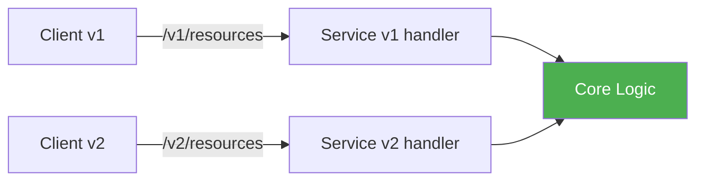

Each major version is a new URL prefix; breaking changes require new version. Clients migrate at their pace.

| Dimension | URL Versioning | Header Versioning |
|-----------|---------------|------------------|
| Discoverability | ✅ visible in URL | ❌ hidden in header |
| CDN caching | ✅ easy | ❌ Vary header needed |
| SDK generation | ✅ clear | ⚠️ complex |
| API explorer UX | ✅ | ❌ |

### Approach B — Additive-Only with Sunset Policy

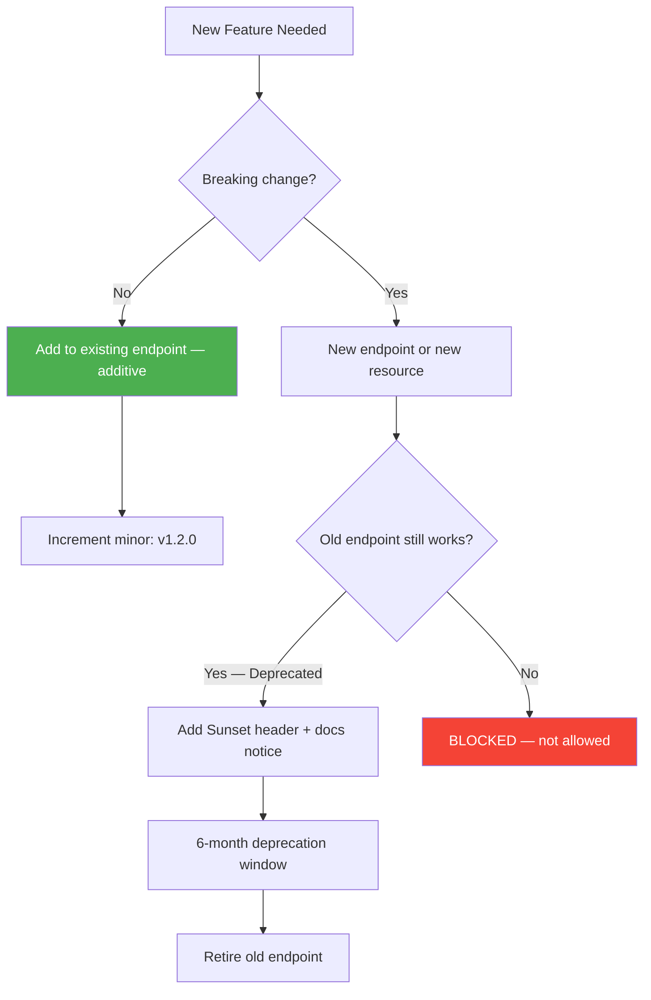

Rules for 5-year compatibility:
1. **Never remove fields** — only add new optional fields (old clients ignore unknown fields)
2. **Never change field types** — `order_id: string` cannot become `order_id: integer`
3. **Enum extension policy** — adding enum values can break exhaustive switch statements; document and version
4. **Sunset header:** `Sunset: Sat, 01 Jan 2027 00:00:00 GMT` in deprecated responses
5. **Deprecation notice period:** Minimum 12 months for external APIs (Stripe: 18 months)
6. **Consumer-driven contract tests:** Each consumer publishes their expected contract; CI blocks breaking changes

### Recommended Answer
**Combination of URL versioning for major breaks + additive-only policy for minor changes.** Pin clients to a specific version at key creation time (Stripe pattern). Any breaking change requires a new major version with 12–18 month overlap. Enforce with automated breaking-change detection (Optic, Spectral) in CI.

### What a great answer includes
- [ ] Defines "breaking change" precisely: removing fields, changing types, changing semantics
- [ ] Mentions sunset headers (RFC 8594) with specific timeframes (12–18 months)
- [ ] References consumer-driven contract testing (Pact, Swagger)
- [ ] Distinguishes additive-only from full versioning
- [ ] Notes organizational discipline required (API review process, changelog discipline)

### Pitfalls
- ❌ **Treating minor releases as breaking:** Adding new optional fields is NOT a breaking change; clients must tolerate unknown fields.
- ❌ **No deprecation warning period:** Removing endpoints without notice destroys developer trust permanently.
- ❌ **Infinite version accumulation:** Plan sunset dates up front; maintaining v1 through v8 simultaneously is unsustainable.

### Concept Reference

---

## Q9: What are the top 5 REST API design anti-patterns you see in the wild?
**Role:** Staff | **Difficulty:** 🔴 | **Priority:** P2 | **Format:** Quick Answer

> **What the interviewer is testing:** Whether you've operated APIs at scale and accumulated hard-won lessons.

### Answer in 60 seconds

1. **Verbs in URLs:** `POST /createUser`, `GET /getOrders` — use nouns + HTTP verbs: `POST /users`, `GET /orders`
2. **Single `/api` endpoint with action in body:** `POST /api { "action": "create_user" }` — RPC in REST clothing; loses cacheability, discoverability, and HTTP semantics
3. **Returning 200 with error in body:** `{ "success": false, "error": "..." }` with HTTP 200 — breaks monitoring, retry logic, and every HTTP client library
4. **No idempotency on writes:** Retry after network failure creates duplicate records — add idempotency keys or make endpoints naturally idempotent
5. **Inconsistent field naming:** `userId` in one endpoint, `user_id` in another, `uid` in a third — API consumers build workarounds that become permanent

**Bonus anti-pattern:** Leaking internal implementation: `GET /mysql/users`, `GET /v1/postgres-table/orders` — exposes DB schema, impossible to refactor.

### Diagram

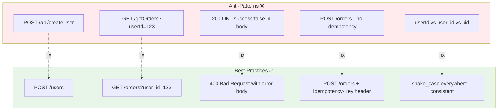

### Pitfalls
- ❌ **Fixing anti-patterns mid-flight:** Breaking changes to fix anti-patterns can be worse than leaving them; plan for versioning.
- ❌ **Security through obscurity:** Hiding admin endpoints under obscure names — not a substitute for proper auth.

### Concept Reference

---

## Q10: Design the API for a multi-tenant task management system
**Role:** Senior | **Difficulty:** 🟡 | **Priority:** P1 | **Format:** Scenario

**Real Company:** Asana, Jira, Linear

### The Brief
> "Design the REST API for a multi-tenant task management SaaS. Users belong to workspaces, can create projects, tasks, and sub-tasks. Tasks can be assigned, tagged, and have attachments. Design the resource model, pagination, error format, and authentication."

### Clarifying Questions
1. Is workspace-level auth (user is member of workspace) handled by API gateway or service?
2. Do tasks support arbitrary nesting depth or just parent-child (task/sub-task)?
3. What attachment sizes? (determines sync vs async upload)
4. Public API (external developers) or internal only?
5. What is the expected scale? (tasks/day, concurrent users/workspace)

### Back-of-Envelope Estimation
| Metric | Calculation | Result |
|--------|-------------|--------|
| Tasks created/day | 50K workspaces × 100 tasks | 5M tasks/day |
| API requests/sec | 5M / 86400 × 50x read:write | ~3,000 RPS |
| Attachment storage | 5M tasks × 2 attachments × 2MB | 20TB/day |
| Pagination depth | 95th percentile workspace: 10K tasks | Cursor required |

### High-Level Architecture

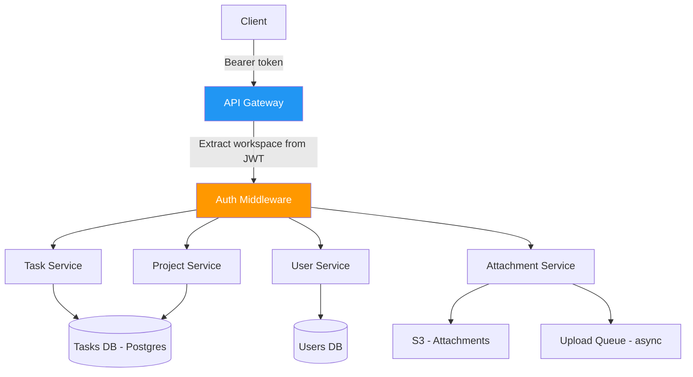

### Resource Design

```
# Workspace-scoped resources
GET  /workspaces/{wsId}/projects
POST /workspaces/{wsId}/projects
GET  /workspaces/{wsId}/projects/{projId}
PUT  /workspaces/{wsId}/projects/{projId}

GET  /workspaces/{wsId}/tasks?project_id=&assignee_id=&tag_id=&cursor=&limit=
POST /workspaces/{wsId}/tasks
GET  /workspaces/{wsId}/tasks/{taskId}
PATCH /workspaces/{wsId}/tasks/{taskId}
DELETE /workspaces/{wsId}/tasks/{taskId}

# Sub-tasks (shallow nesting - child of task only)
GET  /workspaces/{wsId}/tasks/{taskId}/sub-tasks
POST /workspaces/{wsId}/tasks/{taskId}/sub-tasks

# Attachments (async upload flow)
POST /workspaces/{wsId}/tasks/{taskId}/attachments → 202 Accepted + presigned S3 URL
GET  /workspaces/{wsId}/tasks/{taskId}/attachments

# Assignments (relationship resource)
POST /workspaces/{wsId}/tasks/{taskId}/assignees
DELETE /workspaces/{wsId}/tasks/{taskId}/assignees/{userId}
```

### Pagination Format
```
GET /workspaces/ws_123/tasks?limit=50&cursor=eyJpZCI6MTAwfQ

{
  "data": [...],
  "pagination": {
    "cursor": "eyJpZCI6MTUwfQ",
    "has_more": true,
    "limit": 50
  }
}
```

### Error Format
```
{
  "error": {
    "type": "validation_error",
    "code": "TASK_TITLE_TOO_LONG",
    "message": "Task title exceeds 255 characters",
    "param": "title",
    "request_id": "req_abc123"
  }
}
```

### Trade-off Decisions
| Decision | Option A | Option B | Chosen | Why |
|----------|----------|----------|--------|-----|
| Workspace in URL vs JWT | URL: `/workspaces/{id}/...` | JWT claim | URL | Explicit, cacheable, debuggable |
| Sub-task depth | Unlimited nesting | Max 1 level | Max 1 level | Avoids recursive query complexity |
| Attachment upload | Sync in API | Async + presigned S3 URL | Async | Files can be 100MB+; don't block API thread |
| Pagination | Offset | Cursor | Cursor | Workspace can have 100K+ tasks |

### Failure Modes
| Failure | Impact | Mitigation |
|---------|--------|------------|
| Workspace isolation bug | Tenant A sees Tenant B's data | Row-level security in DB + workspace_id on every query |
| Attachment upload timeout | Client retries, duplicate | Presigned URL with unique key; deduplicate by key |
| Task assignment race | Two users assigned simultaneously | Database constraint + 409 Conflict response |
| Cursor staleness | Task deleted mid-pagination | Cursor by created_at + id; deleted tasks just skip |

