# WebSockets & Long Polling

10 questions covering real-time connection patterns, scaling challenges, CSRF prevention, message ordering, and collaborative whiteboard design.

---

## Q1: WebSockets vs SSE vs long-polling — when do you use each?
**Role:** Mid, Backend | **Difficulty:** 🟡 | **Priority:** P0 | **Format:** Quick Answer

> **What the interviewer is testing:** Whether you know the actual differences and trade-offs, not just buzzword recognition.

### Answer in 60 seconds

| Feature | Long Polling | SSE | WebSocket |
|---------|-------------|-----|-----------|
| Direction | Server → Client (simulated) | Server → Client | Bidirectional |
| Protocol | HTTP/1.1 | HTTP/1.1 or HTTP/2 | WS upgrade |
| Browser support | Universal | Universal (not IE11) | Universal |
| Proxy/firewall friendliness | ✅ | ✅ | ⚠️ |
| Auto-reconnect | Manual | Built-in | Manual |
| Max connections (browser) | 6/domain | 6/domain (HTTP/1.1) | Unlimited |
| Server complexity | Low | Low | High |

- **Long polling:** Client sends HTTP request, server holds it open until event occurs (max 30s), then responds. Client immediately sends new request. Use for: fallback, simple notifications, low-frequency updates (1/min).
- **SSE (Server-Sent Events):** Persistent HTTP connection; server pushes `data: ...\n\n` frames. Auto-reconnect with `Last-Event-ID`. Use for: live dashboards, stock tickers, notifications where client doesn't need to send.
- **WebSocket:** Full duplex TCP-like tunnel over HTTP upgrade. Use for: chat, collaborative editing, multiplayer games — any scenario requiring client-to-server push without HTTP overhead.

### Diagram

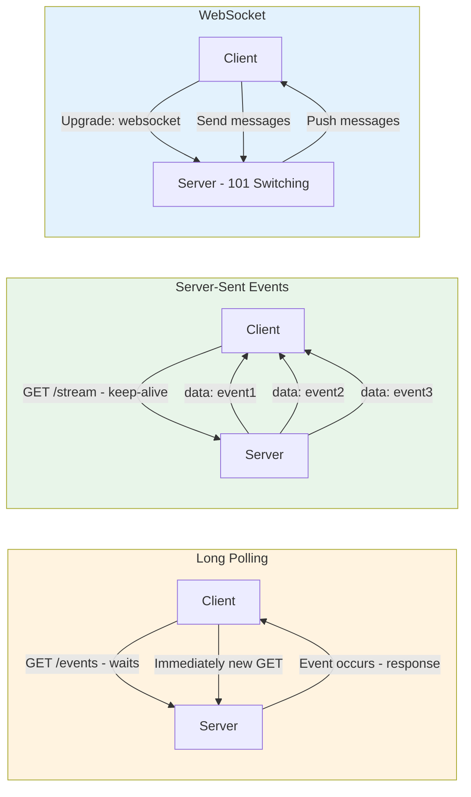

### Pitfalls
- ❌ **WebSocket for everything:** WebSockets consume persistent server resources; for low-frequency push (daily digest), SSE or polling is simpler.
- ❌ **SSE over HTTP/1.1 with browser connection limits:** HTTP/1.1 browser limit is 6 connections per domain; 3 SSE tabs = 18 connections. Use HTTP/2 to multiplex SSE (one TCP connection, many SSE streams).
- ❌ **Long polling without max wait timeout:** Server-held requests without a max 30s timeout can exhaust thread pools.

### Concept Reference

---

## Q2: How does the WebSocket handshake work (HTTP Upgrade)?
**Role:** Mid | **Difficulty:** 🟢 | **Priority:** P0 | **Format:** Quick Answer

> **What the interviewer is testing:** Protocol-level understanding of how WebSocket establishes its connection.

### Answer in 60 seconds
WebSocket starts as an HTTP request and upgrades to a persistent bidirectional tunnel:

**Step 1 — Client sends HTTP Upgrade request:**
```
GET /chat HTTP/1.1
Host: example.com
Upgrade: websocket
Connection: Upgrade
Sec-WebSocket-Key: dGhlIHNhbXBsZSBub25jZQ==  ← Random base64 nonce
Sec-WebSocket-Version: 13
```

**Step 2 — Server responds with 101 Switching Protocols:**
```
HTTP/1.1 101 Switching Protocols
Upgrade: websocket
Connection: Upgrade
Sec-WebSocket-Accept: s3pPLMBiTxaQ9kYGzzhZRbK+xOo=  ← SHA-1 hash of key + GUID
```

`Sec-WebSocket-Accept` = Base64(SHA1(clientKey + "258EAFA5-E914-47DA-95CA-C5AB0DC85B11"))
This prevents cache poisoning — a non-WS-aware proxy would generate the wrong accept key.

**Step 3 — TCP tunnel established:**
From this point, the connection is a raw bidirectional TCP tunnel. HTTP is gone. Data is sent as WebSocket frames (2–14 byte header + payload).

Handshake adds ~1 RTT overhead. On TLS (wss://), add TLS handshake overhead (~1 additional RTT for TLS 1.3).

### Diagram

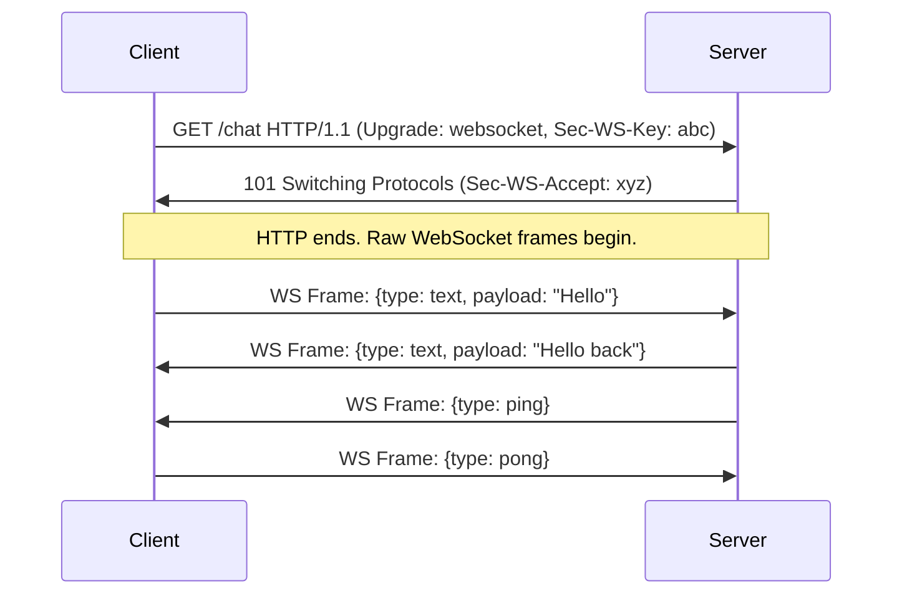

### Pitfalls
- ❌ **Not validating Origin header:** Without checking `Origin`, any website can open a WebSocket to your server from a user's browser — CSRF risk.
- ❌ **Forgetting load balancer WebSocket support:** Many HTTP load balancers don't proxy the `Connection: Upgrade` header correctly; test WS routing explicitly.

### Concept Reference

---

## Q3: How do you handle sticky sessions when load balancing WebSocket connections?
**Role:** Senior | **Difficulty:** 🔴 | **Priority:** P1 | **Format:** Deep Dive

> **What the interviewer is testing:** Understanding of the stateful nature of WebSockets and strategies to scale them horizontally.

### Problem Constraints
| Dimension | Value |
|-----------|-------|
| Connections | 1M concurrent WebSocket connections |
| Server capacity | 50K connections per server instance |
| Required instances | 20+ servers |
| Challenge | Client must reconnect to same server OR state must be shared |

### Approach A — Sticky Sessions (IP/Cookie Affinity)

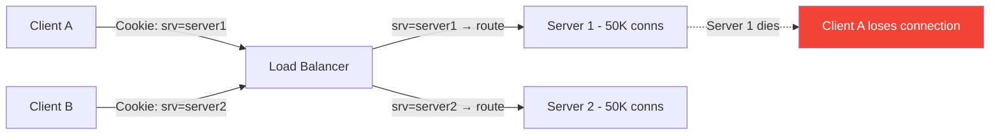

Load balancer uses `SERVERID` cookie or IP hash to route a client to the same server. Simple. Problem: if server dies, all 50K clients reconnect simultaneously — thundering herd.

### Approach B — Shared State (Redis Pub/Sub)

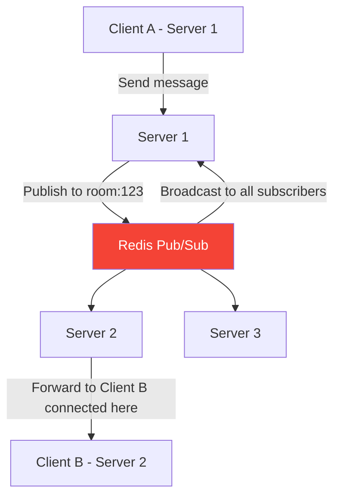

No sticky sessions needed. Any server can accept any client. Messages published to Redis PubSub channels; all servers subscribed to the channel receive and forward to their local connections. Socket.IO uses this pattern with the Redis adapter.

| Dimension | Sticky Sessions | Shared State (Redis) |
|-----------|----------------|---------------------|
| Server coupling | High | Low |
| Failover | Poor (loses connections on death) | Good (reconnect to any server) |
| Redis dependency | None | Yes — Redis is now critical path |
| Message latency | 0ms overhead | +1ms Redis hop |
| Scaling | Limited to session server | Horizontal |

### Approach C — Dedicated Connection Tier

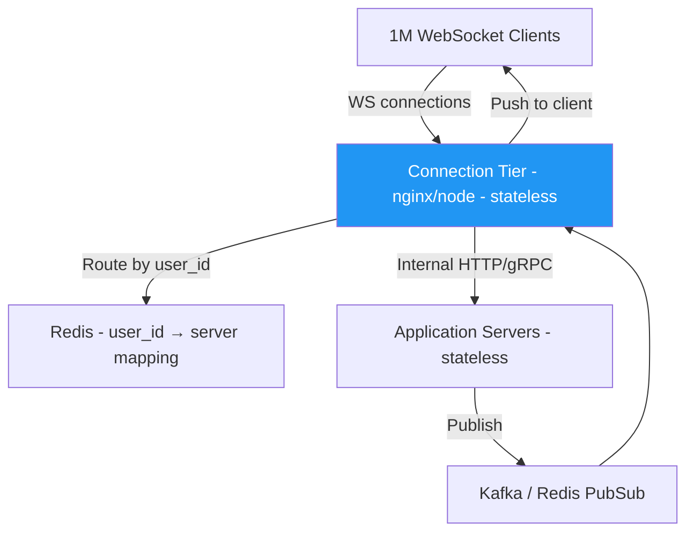

Separate "connection servers" that only manage WebSocket connections. Application logic is stateless and handles business logic. Connection tier forwards messages via internal RPC.

### Recommended Answer
For production at scale, **Approach C (dedicated connection tier) is best**. For simpler setups, **Approach B (Redis Pub/Sub)** with Socket.IO is practical. Sticky sessions work only for small-scale stateful use cases where session data doesn't need to be shared.

### What a great answer includes
- [ ] Explains why WebSockets are stateful (ongoing connection vs request-response)
- [ ] Describes Redis Pub/Sub as the standard scale-out solution
- [ ] Notes thundering herd on server restart with sticky sessions
- [ ] Mentions Socket.IO's Redis adapter as real-world implementation
- [ ] Discusses dedicated connection tier for very large scale

### Pitfalls
- ❌ **Sticky sessions at 20+ servers:** Uneven load distribution; one hot user or viral event fills one server while others are idle.
- ❌ **Redis as single point of failure:** If Redis goes down with Approach B, no messages are delivered; use Redis Sentinel or Cluster.

### Concept Reference

---

## Q4: How do you scale WebSocket servers to 1M concurrent connections?
**Role:** Senior | **Difficulty:** 🔴 | **Priority:** P1 | **Format:** Quick Answer

> **What the interviewer is testing:** Systems-level thinking about connection limits, OS tuning, and architecture at scale.

### Answer in 60 seconds
**Linux OS limits (must tune):**
- Default max file descriptors: 1,024 per process → set to 1M+: `ulimit -n 1048576`
- Default ephemeral ports: 28K → tune `net.ipv4.ip_local_port_range = 1024 65535`
- Default TCP buffer: 4KB per socket × 1M = 4GB RAM just for buffers → tune socket buffer sizes

**Per-server capacity:**
- Modern server (32GB RAM): ~50K–100K WebSocket connections depending on message rate
- Most cost: **memory per connection** (~40KB per idle WS connection in Node.js)
- 1M connections / 50K per server = **20 servers minimum**

**Architecture to reach 1M:**

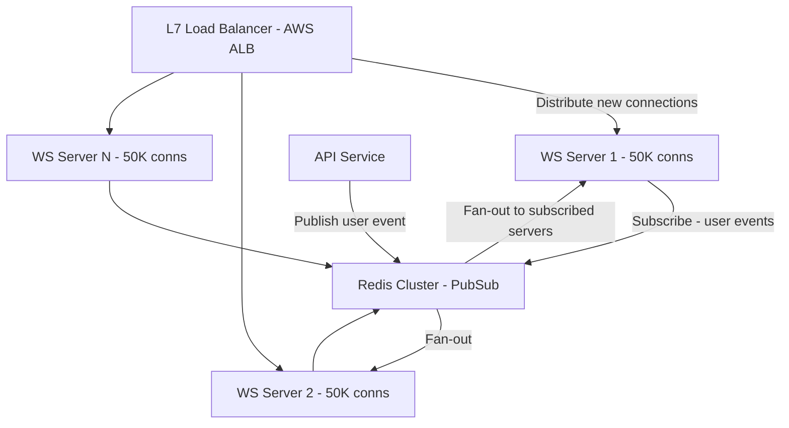

**Practical numbers:**
- Nginx: 1M+ connections, ~100MB RAM, requires `worker_connections 1048576` and `worker_rlimit_nofile 1048576`
- Node.js: ~100K connections per process, need multiple processes + cluster
- Go: ~500K connections per process (smaller goroutine stack)
- Redis PubSub: handles ~50K messages/sec; above that, use Kafka for fan-out

### Diagram

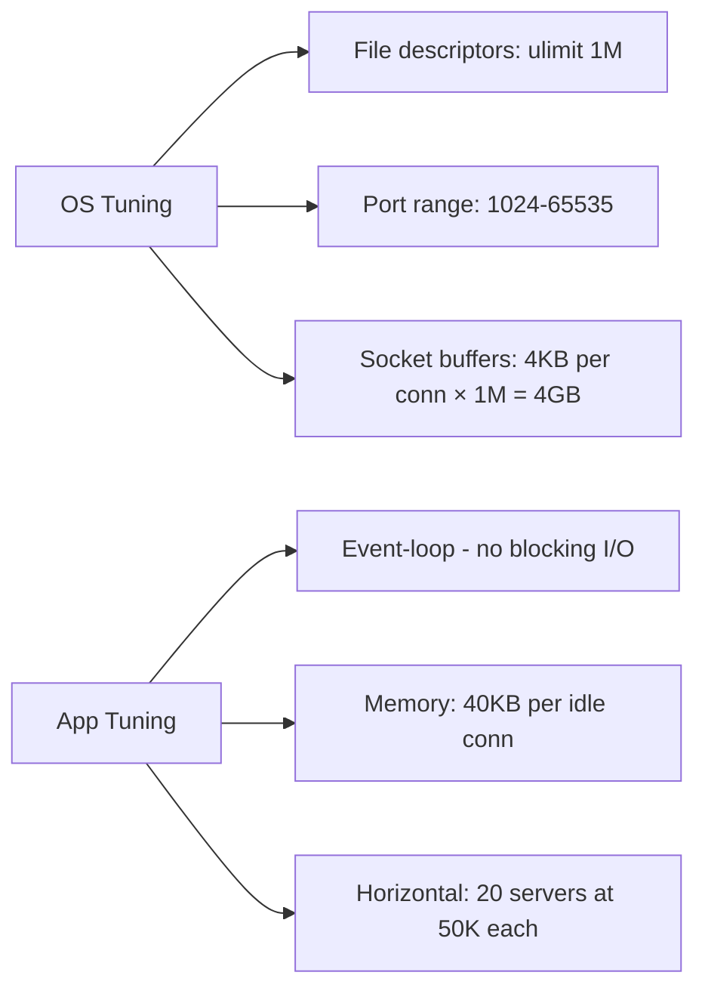

### Pitfalls
- ❌ **Forgetting OS limits:** Default 1,024 file descriptors kills the server at 1,024 connections — always tune before load testing.
- ❌ **Blocking I/O in connection handler:** One blocking DB call = entire thread stuck; Node.js or Go event loops required.
- ❌ **Redis Pub/Sub at 1M subscribers:** Publishing to a channel with 1M subscribers is O(N); use sharded channels or Kafka.

### Concept Reference

---

## Q5: How do you implement reconnection with backoff for WebSocket clients?
**Role:** Senior | **Difficulty:** 🟡 | **Priority:** P2 | **Format:** Deep Dive

> **What the interviewer is testing:** Client-side resilience design and thundering herd prevention.

### Problem Constraints
| Dimension | Value |
|-----------|-------|
| Client count | 500K simultaneous connections |
| Server restart time | 10–30 seconds |
| Risk | Thundering herd — 500K reconnect simultaneously |
| Target | Reconnection spread over 60+ seconds |

### Approach A — Constant Retry

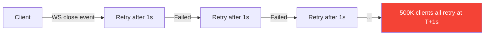

Problem: 500K clients × 1 SYN packet/sec = 500K connections/sec — kills recovering server.

### Approach B — Exponential Backoff with Jitter (Recommended)

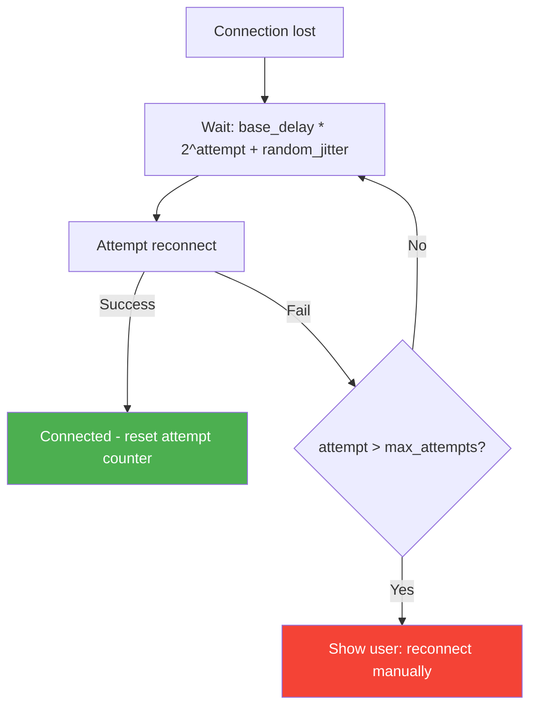

**Algorithm (pseudo-code):**
```
base_delay = 1000ms
max_delay = 30000ms
attempt = 0

function reconnect():
  delay = min(base_delay * 2^attempt, max_delay)
  jitter = random(0, delay * 0.3)  // 30% jitter
  wait(delay + jitter)
  attempt++
  try connect()
  if success: attempt = 0
  else: reconnect()
```

**With 500K clients:**
- Without jitter: all retry at 1s, 2s, 4s — synchronized spikes
- With 30% jitter: reconnections spread uniformly → server sees ~8K reconnects/sec instead of 500K

| Attempt | Base delay | Jitter range | Actual delay |
|---------|-----------|-------------|-------------|
| 0 | 1s | 0–0.3s | 1–1.3s |
| 1 | 2s | 0–0.6s | 2–2.6s |
| 2 | 4s | 0–1.2s | 4–5.2s |
| 3 | 8s | 0–2.4s | 8–10.4s |
| 4 | 16s | 0–4.8s | 16–20.8s |
| 5+ | 30s (cap) | 0–9s | 30–39s |

### Recommended Answer
**Exponential backoff with jitter** is the standard pattern (used by AWS SDKs, Socket.IO, all major WS libraries). Add a maximum retry count with a "give up" state that shows users an explicit "Reconnecting..." UI rather than silently failing for minutes.

### What a great answer includes
- [ ] Names "thundering herd" as the key problem to solve
- [ ] Explains jitter specifically as the solution to synchronized retries
- [ ] Provides concrete numbers (30% jitter, 30s cap)
- [ ] Mentions resetting attempt counter on successful connection
- [ ] Notes UX — show reconnecting status to users

### Pitfalls
- ❌ **No maximum delay cap:** Clients wait minutes before reconnecting; UX suffers. Cap at 30–60s.
- ❌ **No max attempts:** Clients retry indefinitely after server shuts down permanently; add explicit "give up" state.

### Concept Reference

---

## Q6: How do you prevent CSRF attacks on WebSocket connections?
**Role:** Senior | **Difficulty:** 🔴 | **Priority:** P2 | **Format:** Quick Answer

> **What the interviewer is testing:** Security awareness specific to WebSocket protocol — most engineers miss that cookies are sent on WS handshake too.

### Answer in 60 seconds
**Why WebSocket is vulnerable to CSRF:**
- Browser sends cookies with WebSocket upgrade requests (same as HTTP)
- `SameSite` cookie attribute helps but is NOT enforced for WS upgrade by all browsers
- Malicious website can open `new WebSocket("wss://bank.com/ws")` from victim's browser using their session cookie

**Mitigations (in order of strength):**

1. **Validate `Origin` header (primary defense):**
   Server checks `Origin` header on upgrade request. Only allow known origins.
   ```
   if request.headers["Origin"] not in ALLOWED_ORIGINS:
       reject with 403
   ```
   Origin header cannot be spoofed by JavaScript (set by browser, not script).

2. **CSRF token in WS URL or first message:**
   Client sends a CSRF token (from cookie or meta tag) as a query parameter or in the first message payload.
   ```
   new WebSocket("wss://app.com/ws?csrf_token=abc123")
   ```

3. **Use `SameSite=Strict` cookies:**
   Cookies with `SameSite=Strict` are not sent from cross-site requests including WS upgrade.
   Not universally supported by all older browsers.

4. **Require JWT in Authorization header (impossible from browser):**
   Pure JWT auth via `Authorization` header eliminates cookie-based CSRF. But browsers can't set custom headers on WS upgrade — use first-message auth pattern instead.

### Diagram

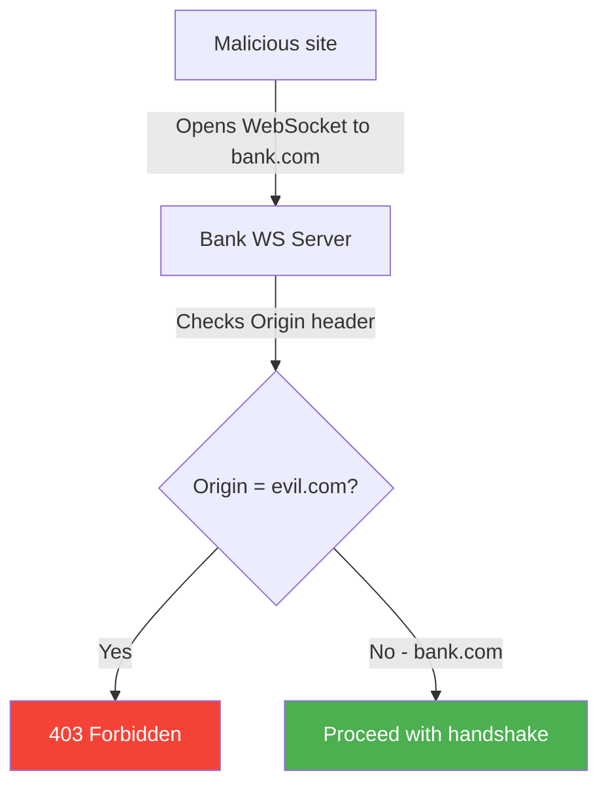

### Pitfalls
- ❌ **Relying on SameSite alone:** Older browsers (iOS Safari < 12) don't enforce SameSite for WebSocket; validate Origin header explicitly.
- ❌ **Not validating Origin at all:** Many tutorials show WebSocket examples without Origin validation — insecure for auth-protected WS endpoints.

### Concept Reference
→ [API Security Patterns](../security-auth/api-security-patterns)

---

## Q7: How does Slack use WebSockets for real-time messaging at 20M DAU?
**Role:** Staff | **Difficulty:** 🔴 | **Priority:** P2 | **Format:** Quick Answer

> **What the interviewer is testing:** Real-world knowledge of production WebSocket architecture at large scale.

### Answer in 60 seconds
**Slack's RTM (Real-Time Messaging) API architecture:**

- **20M DAU** with concurrent connections in the millions; Slack maintains one persistent WebSocket per client
- **Gateway tier:** Dedicated "channel servers" or connection gateways manage WebSocket connections, separate from business logic services
- **Message fan-out:** When a message is sent to a channel, Slack determines all users currently online and connected to which gateway server, then delivers via their connection
- **Presence system:** Separate service tracks which users are online and on which server — key for efficient fan-out
- **Workspace partitioning:** Users in the same Slack workspace tend to connect to the same region/cluster — reduces cross-datacenter fan-out

**Key design choices:**
1. **Slack RTM API → Events API migration:** Slack deprecated persistent WebSocket RTM API for bots in favor of HTTP Events API (webhook delivery). Stateless webhooks are cheaper to scale than persistent connections.
2. **Connection compression:** WebSocket permessage-deflate extension compresses message payloads — 50–70% size reduction for text-heavy channel messages.
3. **Heartbeat/ping:** Server sends `{"type": "ping", "id": 1}` every 30s; client responds with `{"type": "pong", "reply_to": 1}`. Dead connections detected in ~35s.

### Diagram

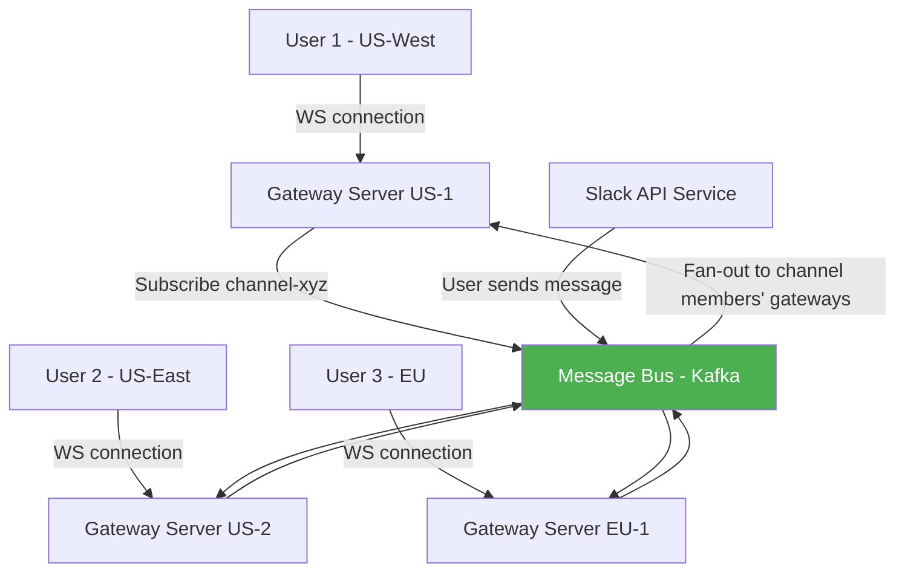

### Pitfalls
- ❌ **One WS connection per team member per channel:** Slack uses one connection per user, not per channel — channels are multiplexed over the connection.
- ❌ **Fan-out without presence check:** Fanning out to offline users wastes resources; presence service filters to only online users' connections.

### Concept Reference

---

## Q8: How do you implement message ordering guarantees over WebSockets?
**Role:** Staff | **Difficulty:** 🔴 | **Priority:** P2 | **Format:** Deep Dive

> **What the interviewer is testing:** Distributed systems thinking applied to WebSocket messaging — ordering is hard even with persistent connections.

### Problem Constraints
| Dimension | Value |
|-----------|-------|
| Clients | A and B in same chat room |
| Problem | Client A sends msg1 and msg2 nearly simultaneously; B sees them out of order |
| Root cause | Network jitter, server processing parallelism |
| Goal | Strict ordering OR causal ordering |

### Approach A — Sequence Numbers (Strict Ordering)

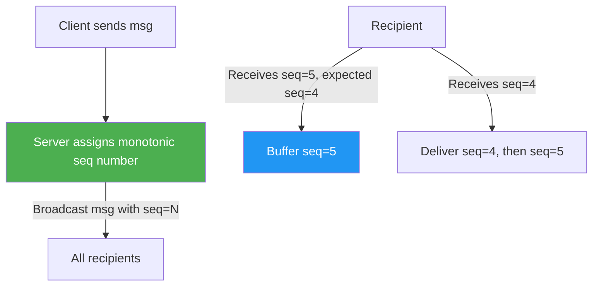

Server assigns monotonically increasing sequence numbers to all messages in a channel. Clients buffer out-of-order messages and deliver in sequence order. Requires a single point of sequence generation per channel (Redis INCR or DB sequence).

**Gap detection:** If client expects seq=5 but receives seq=7, request missing messages: `{type: "replay", from_seq: 5, to_seq: 6}`.

### Approach B — Vector Clocks (Causal Ordering)

```mermaid
graph LR
  A[Alice - VC: {A:1, B:0}] -->|msg1 with VC| S[Server]
  B[Bob - VC: {A:0, B:1}] -->|msg2 with VC| S
  S -->|Detect: msg2 knows nothing of msg1| S
  S -->|Deliver: msg1 first if causal dependency| ALL[Broadcast to room]
```

Vector clocks track causal dependencies: msg2 replying to msg1 must be delivered after msg1 even if received first. More complex; used in distributed systems like Riak.

### Approach C — Server-Side Serialization (Simplest)

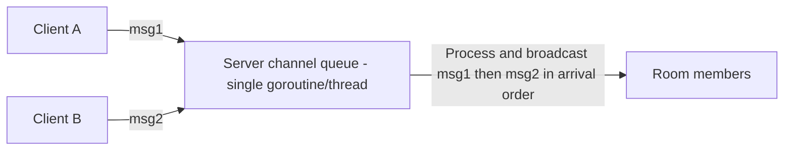

Route all messages for a channel through a single processing goroutine or actor. No sequence numbering needed; arrival order at server = delivery order. Problem: only works when server is not distributed. Use consistent hashing to route channel to same server.

| Dimension | Sequence Numbers | Vector Clocks | Server Serialization |
|-----------|-----------------|--------------|---------------------|
| Ordering guarantee | Strict | Causal | Arrival order |
| Complexity | Medium | High | Low |
| Distributed support | ✅ | ✅ | ⚠️ (single server per channel) |
| Gap recovery | Yes (replay) | Complex | N/A |
| Use case | Chat, collaborative docs | Distributed write conflict resolution | Simple chat |

### Recommended Answer
For most chat/collaboration applications, **Approach A (sequence numbers)** with server-side assignment is the practical choice. Use a Redis INCR per channel for sequence generation. Implement gap detection + replay for reconnection scenarios. Causal ordering (vector clocks) is only necessary for systems with concurrent writes that must be conflict-resolved.

### What a great answer includes
- [ ] Identifies that WebSocket delivery order ≠ send order due to network jitter
- [ ] Describes sequence number assignment with a single authoritative source
- [ ] Explains gap detection and replay mechanism for reconnections
- [ ] Distinguishes strict vs causal ordering
- [ ] Notes consistent hashing for channel-to-server routing

### Pitfalls
- ❌ **Assuming TCP order means application order:** TCP delivers frames in order, but multiple WebSocket connections or message sources can interleave.
- ❌ **Sequence per user instead of per channel:** Users need to see all messages in channel order, not just their own messages in order.

### Concept Reference

---

## Q9: What is the maximum number of WebSocket connections a single Linux server can hold?
**Role:** Staff | **Difficulty:** 🔴 | **Priority:** P3 | **Format:** Quick Answer

> **What the interviewer is testing:** Low-level systems knowledge about Linux networking limits.

### Answer in 60 seconds
**Theoretical maximum:** ~1M+ connections per server (with tuning)

**Key constraints:**

1. **File descriptors:** Each WebSocket = 1 file descriptor. Default limit: 1,024/process. Tuned: `ulimit -n 1048576` (1M). System max: `/proc/sys/fs/file-max` (tune to 4M+).

2. **Memory:** Each idle WebSocket connection costs ~40–100KB in kernel + application buffers.
   - 1M connections × 80KB = **80GB RAM** — memory is the real bottleneck.
   - Nginx with 1M idle connections: ~200MB (very lean C implementation).
   - Node.js with 1M connections: ~40GB (higher per-connection overhead).

3. **Port numbers:** The server socket listens on a fixed port (e.g., 443). Clients use ephemeral source ports (16K–64K range). A server with `n` IP addresses can handle `n × 64K` connections per destination port. One IP = 64K limit only applies to **outgoing connections**; WebSocket server accepts inbound = no port exhaustion.

4. **CPU:** 1M idle connections = minimal CPU. Active connections (sending messages) are the bottleneck. At 10 msgs/sec per connection × 10K active users = 100K messages/sec — requires event-loop or async I/O.

**Practical benchmarks:**
- nginx: 1M connections documented in production
- Erlang/Phoenix: 2M+ connections (lightweight process model)
- Node.js + ws library: ~100K connections before needing cluster mode

### Diagram

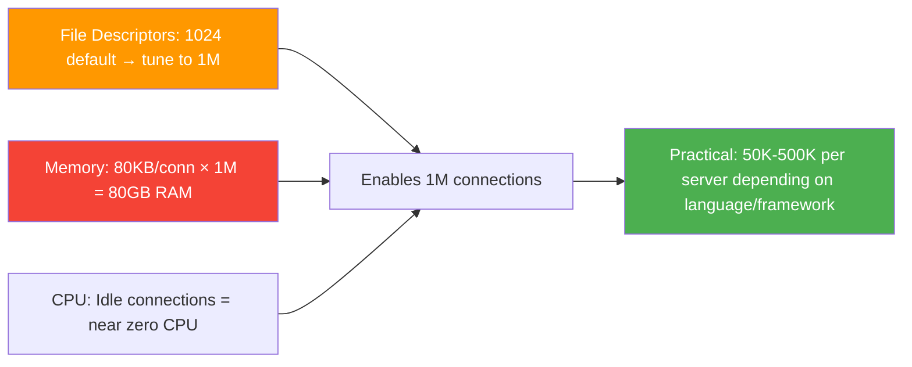

### Pitfalls
- ❌ **Confusing client-side port exhaustion with server-side:** Servers accepting inbound connections don't exhaust ephemeral ports; only outbound connectors do.
- ❌ **Ignoring kernel tuning:** `net.core.somaxconn` (backlog), `net.ipv4.tcp_tw_reuse`, `vm.swappiness` all affect connection capacity.

### Concept Reference

---

## Q10: Design a real-time collaborative whiteboard backend
**Role:** Senior | **Difficulty:** 🔴 | **Priority:** P1 | **Format:** Scenario

**Real Company:** Miro, Figma, Google Jamboard

### The Brief
> "Design the backend for a real-time collaborative whiteboard where multiple users can draw simultaneously. Handle connection management, message routing, persistence, and conflict resolution when two users edit the same shape."

### Clarifying Questions
1. How many concurrent collaborators per board? (10s vs 1000s changes architecture)
2. Is the conflict model last-write-wins acceptable, or do we need CRDT?
3. What persistence durability is needed — can we lose last 5 seconds of changes?
4. Do we need offline support / sync on reconnect?
5. What's the canvas model — objects (shapes, text) vs pixel raster?

### Back-of-Envelope Estimation
| Metric | Calculation | Result |
|--------|-------------|--------|
| Boards | 1M active boards | 1M |
| Users/board average | 3 concurrent | 3M WS connections |
| Operations/sec | 3M users × 5 ops/sec | 15M ops/sec |
| Message size | Shape update ~200 bytes | 200B |
| Bandwidth | 15M × 200B | 3 GB/s |
| Storage | 200B × 15M ops/sec × 86400 | ~250TB/day (delta compression critical) |

### High-Level Architecture

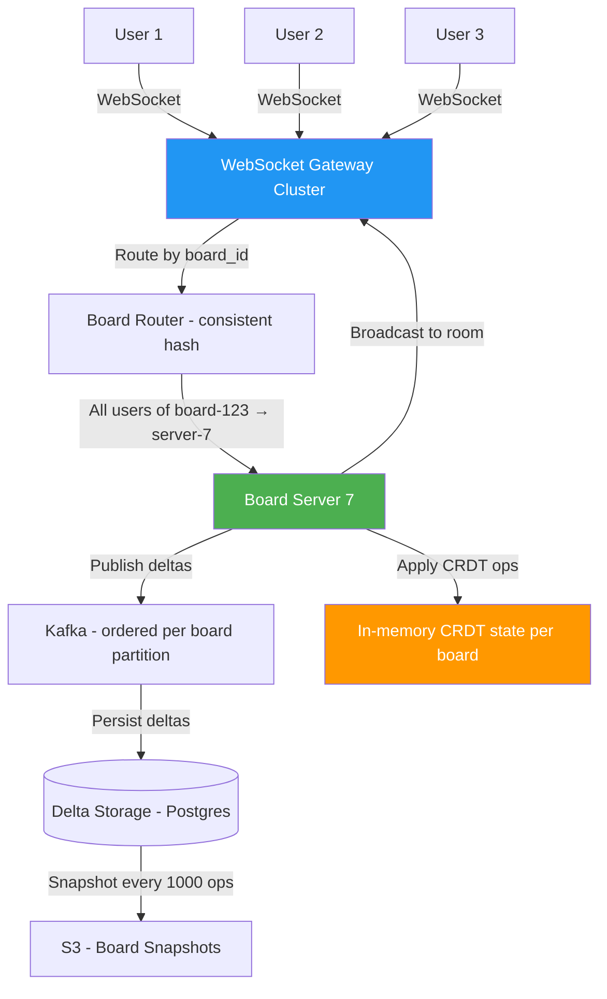

### Message Protocol Design

```
// Client → Server: user moves shape
{
  type: "operation",
  board_id: "board-123",
  op: {
    kind: "MOVE_SHAPE",
    shape_id: "shape-abc",
    dx: 10, dy: -5,
    vector_clock: {user1: 5, user2: 3}
  }
}

// Server → all clients: broadcast with sequence number
{
  type: "operation",
  seq: 1042,
  user_id: "user-1",
  op: { ... }
}

// Server → reconnecting client: replay missing ops
{
  type: "replay",
  ops: [...],
  snapshot_seq: 1000,
  snapshot_url: "s3://boards/board-123/snapshot-1000.json"
}
```

### Conflict Resolution Strategy

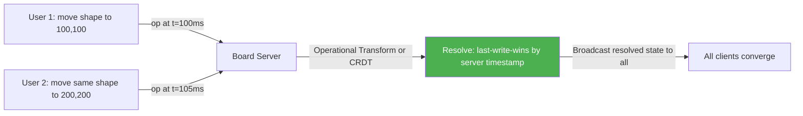

**Conflict resolution options:**
- **Last-write-wins (LWW):** Server timestamp wins. Simple. Shapes "teleport" — poor UX.
- **Operational Transform (OT):** Transform operations against concurrent operations. Used by Google Docs. Complex to implement correctly.
- **CRDT (Conflict-free Replicated Data Types):** Operations are designed to commute — any order produces same result. Used by Figma for multi-player editing. Most robust.

### Trade-off Decisions
| Decision | Option A | Option B | Chosen | Why |
|----------|----------|----------|--------|-----|
| Routing model | Any server + Redis PubSub | Consistent hash to board server | Consistent hash | All ops for a board serialized on one server — simplifies conflict resolution |
| Conflict resolution | LWW | CRDT | CRDT | LWW causes shape teleport; CRDTs give smooth multi-cursor experience |
| Persistence | Real-time DB write | Batch + snapshots | Batch + snapshots | 15M ops/sec cannot all hit Postgres individually |
| Reconnection | Full board reload | Delta replay from last seq | Delta replay | Reconnect in <1s vs multi-second full reload |

### Failure Modes
| Failure | Impact | Mitigation |
|---------|--------|------------|
| Board server crash | All users on that board lose connection | Reconnect to new server; load snapshot + replay Kafka log |
| CRDT state divergence | Users see different board states | Periodic state hash comparison; force re-sync on mismatch |
| Kafka partition full | Operations dropped | Alert at 80% retention; ops are lost if not persisted before eviction |
| Network partition (split brain) | Two board servers for same board | Consistent hash + ZooKeeper/etcd leadership ensures single server per board |

