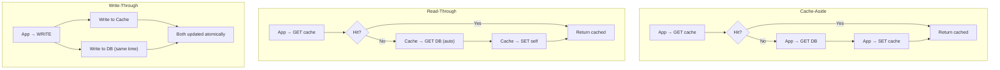
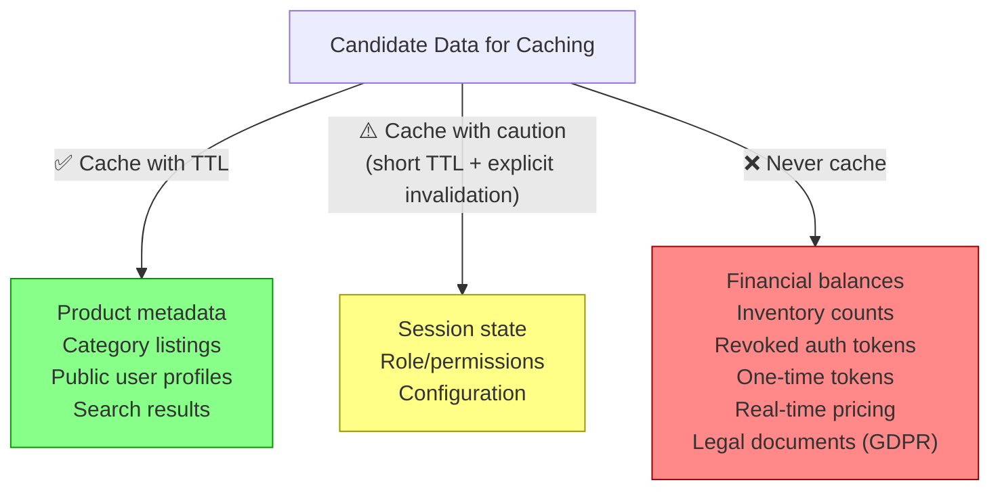
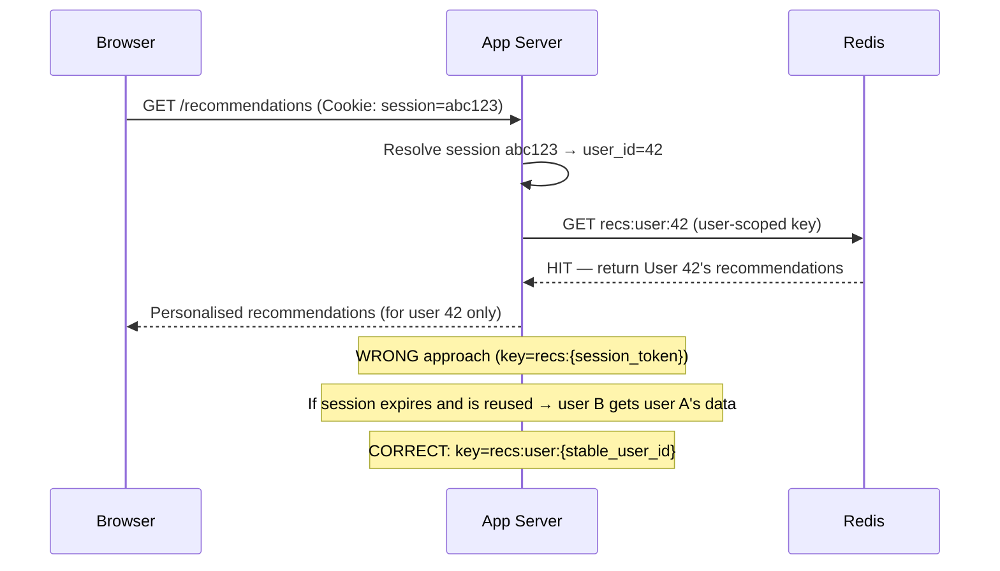
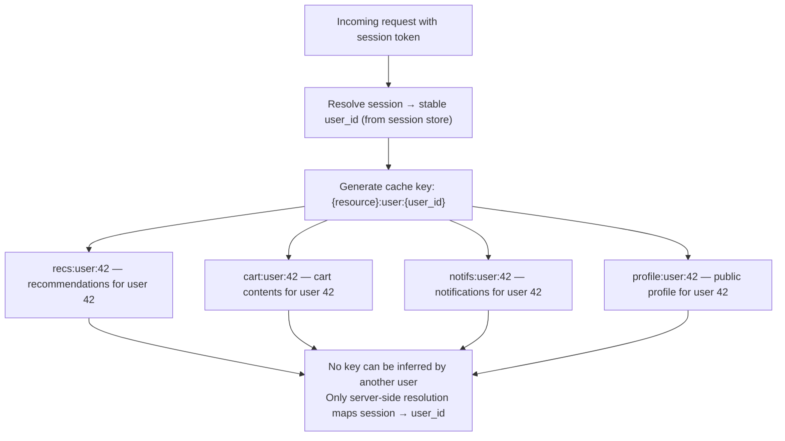
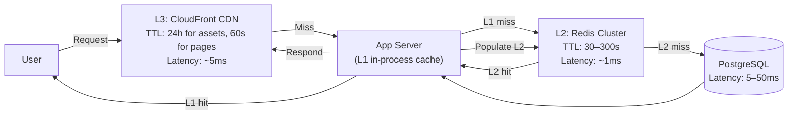
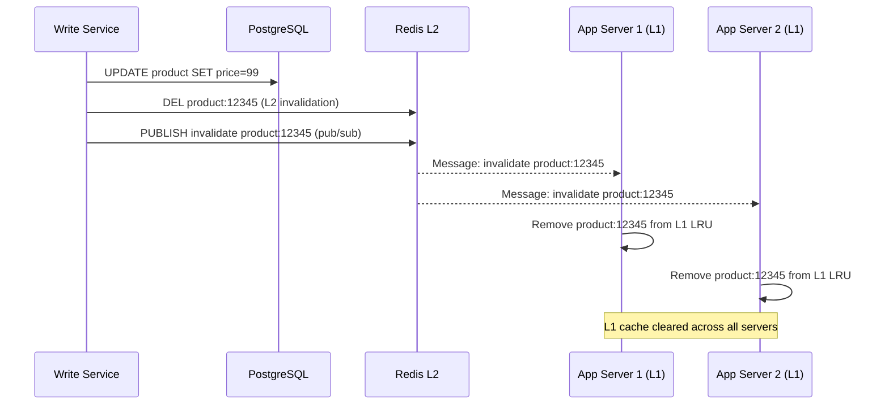
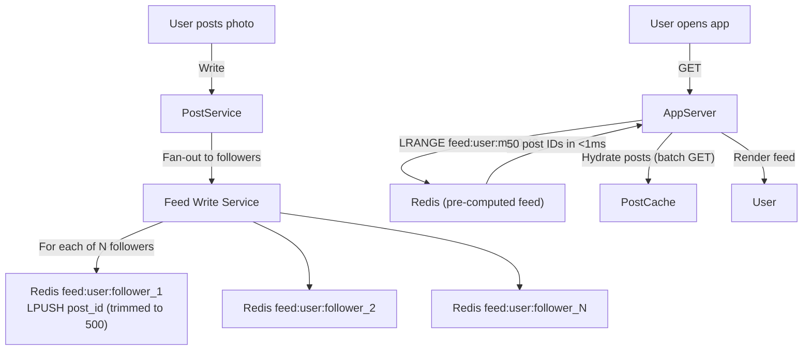
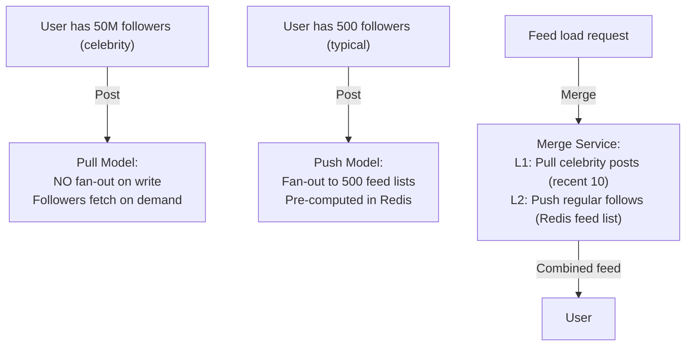

# Application Layer Caching

5 questions covering application-layer caching patterns from fundamentals to Instagram's 1B-user feed design.

---

## Q1: Cache-aside vs read-through vs write-through — what's the decision matrix?

**Role:** Mid | **Difficulty:** 🟡 | **Priority:** P0 | **Format:** Quick Answer

> **What the interviewer is testing:** Whether you know the three primary caching patterns and can articulate the operational trade-offs to select the right one.

### Answer in 60 seconds
- **Cache-aside (lazy loading):** Application checks cache first. On miss, app fetches from DB, populates cache, returns data. Application owns cache population logic. Most common pattern. Works with any cache store. Cache is only populated for data that is actually requested — no wasted memory.
- **Read-through:** Cache sits in front of DB. On miss, the *cache layer itself* fetches from DB and populates (app never touches DB directly). Consistent population logic, but requires cache to understand the DB schema. Used by: Ehcache + Hibernate second-level cache, AWS ElastiCache with DAX (DynamoDB).
- **Write-through:** On every write, app writes to *both* cache and DB simultaneously (or cache writes to DB). Cache is always consistent — no stale data. Write latency doubles (two writes). Used when read performance is critical and write latency is acceptable.
- **Write-behind (write-back):** App writes only to cache; cache asynchronously flushes to DB. Lowest write latency, highest durability risk. Covered separately.

### Diagram

| Dimension | Cache-Aside | Read-Through | Write-Through |
|-----------|------------|--------------|--------------|
| Cold start | Slow (lazy populate) | Slow (lazy populate) | Warm (always updated) |
| Consistency | Eventual (TTL-based) | Eventual (TTL-based) | Strong (always in sync) |
| Write latency | DB only | DB only | 2× (cache + DB) |
| Cache utilisation | High (only hot data) | High (only hot data) | Low (cold keys also cached) |
| Best for | General reads | Managed cache layers | Read-heavy, write-acceptable |

### Pitfalls
- ❌ **Cache-aside without TTL:** Without TTL, stale data lives forever. A product price updated in DB remains old in cache until TTL expiry or explicit invalidation.
- ❌ **Write-through for low-read data:** Writing every record into cache wastes memory — 90% of write-through cached data may never be read. Cache utilisation drops to 10%.
- ❌ **Read-through without understanding the cache layer's DB access pattern:** If the cache layer has no connection pooling, each miss creates a new DB connection. Read-through requires the cache to have a tuned DB connection pool.

### Concept Reference
→ [Caching Strategies](../../../01-databases/concepts/write-ahead-log)

---

## Q2: What data should never be cached?

**Role:** Mid | **Difficulty:** 🟡 | **Priority:** P0 | **Format:** Quick Answer

> **What the interviewer is testing:** Whether you understand the categories of data that are dangerous to cache and can articulate the failure modes clearly.

### Answer in 60 seconds
- **Auth state (sessions, tokens):** A cached session for a logged-out user will grant access after logout. A cached JWT that has been revoked will still pass validation for the TTL duration. Solution: store session state in Redis with explicit invalidation on logout — not passive TTL.
- **Financial balances and account totals:** A cached account balance may not reflect the most recent debit. Serving stale balance data can allow overdrafts or double payments. Never cache — always query DB with strong consistency.
- **Distributed counters (inventory stock, available seats):** "3 items in stock" from cache may be stale — concurrent buyers decrement past zero. Inventory must be managed with DB-level atomic operations (`SELECT ... FOR UPDATE` or Redis `DECR` with boundary check).
- **Security-sensitive access control (ACLs, permissions):** A cached "user X has admin role" survives the role revocation for TTL duration. Revoked permissions that are cached grant unauthorised access. Use short TTL (≤30 seconds) or bypass cache for permission checks.
- **One-time-use tokens (password reset, email verification):** Caching these tokens risks replay after invalidation.

### Diagram

### Pitfalls
- ❌ **Caching payment card data even encrypted:** Even encrypted PAN (card number) cached in Redis violates PCI-DSS scope requirements unless Redis is in-scope. Avoid entirely.
- ❌ **"We cache permissions for performance — it's fine":** A disgruntled employee's access revoked in IAM but cached for 5 minutes can exfiltrate data in that window. For high-security actions, always bypass cache.
- ❌ **Caching aggregate counters in application memory:** In-process cached stock count is per-server. 10 app servers each cache "5 items in stock" → accept 50 orders for 5 items. Never cache inventory in-process.

### Concept Reference
→ [Caching Strategies](../../../01-databases/concepts/write-ahead-log)

---

## Q3: How do you cache personalised content without cross-user data leakage?

**Role:** Senior | **Difficulty:** 🔴 | **Priority:** P1 | **Format:** Deep Dive

> **What the interviewer is testing:** Whether you can design a caching strategy that handles user-specific data safely at scale — the primary risk being user A receiving user B's data.

### Problem Constraints
| Dimension | Value |
|-----------|-------|
| Personalised data | User profile, recommendations, notifications, cart |
| Traffic | 100K req/sec across 500K daily active users |
| Risk | Cache key collision: User A reads User B's data |
| Requirement | No cross-user data leakage under any circumstance |

### Approach — User-Scoped Cache Keys with Session Validation

### User-Scoped Key Taxonomy

### Recommended Answer
The root cause of cross-user leakage is using an unsafe value in the cache key — typically a session token, request parameter, or client-supplied value — that can be guessed or reused.

**Rule 1 — Always resolve to stable user_id server-side:** Never use the session token as a cache key. Session tokens rotate (logout, expiry). If user B gets the same session token after user A's session expires, they receive user A's cached data. Resolve session → user_id before forming the cache key.

**Rule 2 — Validate user ownership before serving:** After a cache hit, verify that the cached object's `user_id` field matches the authenticated `user_id`. If they differ (should never happen but acts as defence-in-depth), reject the cache hit and re-fetch.

**Rule 3 — Scope keys explicitly:** Format: `{resource}:user:{user_id}` — e.g., `cart:user:42`, `recs:user:42`. Prevents namespace collision between resource types.

**Rule 4 — Invalidate on logout:** On user logout, delete or expire all user-scoped keys: `DEL cart:user:42 recs:user:42 notifs:user:42`. Use Redis pipeline to batch-delete in one round-trip.

**Rule 5 — Never log or expose cache keys:** Cache keys containing user_id are not sensitive, but logging them creates a PII audit trail. Log only key prefixes in debug mode.

### What a great answer includes
- [ ] Resolve session → stable user_id server-side before keying
- [ ] User-scoped key format: `{resource}:user:{user_id}`
- [ ] Defence-in-depth: validate owner field in cached object
- [ ] Logout invalidation: delete all user-scoped keys atomically
- [ ] Mention the session reuse attack vector as the primary risk

### Pitfalls
- ❌ **Using `request.headers['X-User-ID']` as the cache key:** Client-supplied user IDs allow any user to request another user's cached data. Always resolve user identity from a verified server-side session.
- ❌ **Shared cache entries for "public" data that includes personalised fields:** A "user profile" page that includes private fields (email, phone) should never be cached at the CDN level, only at the app level with user-scoped keys.
- ❌ **Forgetting multi-device logout:** Logging out on mobile should invalidate the same user-scoped cache keys that the web session uses. Use user_id (not device or session) as the key scope.

### Concept Reference
→ [Caching Strategies](../../../01-databases/concepts/write-ahead-log)

---

## Q4: How does multi-level caching work — L1 in-process, L2 Redis, L3 CDN?

**Role:** Senior | **Difficulty:** 🔴 | **Priority:** P1 | **Format:** Deep Dive

> **What the interviewer is testing:** Whether you can design a coherent multi-tier caching strategy and reason about consistency, invalidation propagation, and latency at each tier.

### Problem Constraints
| Dimension | Value |
|-----------|-------|
| Target p99 latency | <10ms for API responses |
| Traffic | 500K req/sec |
| Content types | Static (JS/CSS), semi-static (product data), dynamic (user feed) |
| Cache tiers | L1 (in-process HashMap), L2 (Redis cluster), L3 (CloudFront CDN) |

### Cache Tier Architecture

### Coordination on Update

| Tier | Latency | Capacity | TTL | Invalidation |
|------|---------|----------|-----|--------------|
| L1 in-process | <0.1ms | 1,000–10,000 entries/server | 1–30s | Redis pub/sub |
| L2 Redis | 0.5–2ms | 100GB+ cluster | 30–300s | Explicit DEL/EXPIRE |
| L3 CDN | 5–30ms (cache hit) | Unlimited | 60s–24h | Cache tag purge |

### Pitfalls
- ❌ **L1 cache without invalidation mechanism:** 100 app servers each have their own L1 cache. A write that updates L2 (Redis) leaves 100 stale L1 caches. Use Redis pub/sub to broadcast invalidation to all app servers.
- ❌ **L1 cache with long TTL:** L1 is in-process — size is bounded by app heap. At 10,000 entries × 1KB average = 10MB per server: fine. At 100,000 entries × 10KB = 1GB: app OOM. Keep L1 small with aggressive TTL (1–30s).
- ❌ **Inconsistent TTL hierarchy:** If L1 TTL > L2 TTL, L1 serves data after L2 has already expired it — defeating the invalidation. Always: L1 TTL ≤ L2 TTL ≤ L3 TTL.

### Concept Reference
→ [Caching Strategies](../../../01-databases/concepts/write-ahead-log)

---

## Q5: How does Instagram cache the home feed for 1B users?

**Role:** Staff | **Difficulty:** ⚫ | **Priority:** P2 | **Format:** Deep Dive

> **What the interviewer is testing:** Whether you know the fan-out-on-write (push model) vs fan-out-on-read (pull model) architecture and can reason about the trade-offs at billion-user scale.

### Problem Constraints
| Dimension | Value |
|-----------|-------|
| Scale | 1B+ monthly active users |
| Follows per user | Average 500, celebrities 100M+ followers |
| Posts per day | 100M+ |
| Feed load latency SLA | p99 < 200ms |
| Feed size | Most recent 500 posts from followed accounts |

### Approach A — Fan-Out on Write (Push, Pre-computed Feed)

### Approach B — Hybrid (Push for regular users, Pull for celebrities)

| Dimension | Fan-Out on Write | Fan-Out on Read | Hybrid |
|-----------|-----------------|----------------|--------|
| Feed load latency | <5ms (pre-computed) | 200ms+ (compute at read) | <20ms |
| Post write cost | O(followers) fan-out | O(1) write | O(followers) for non-celebrities |
| Storage | 1B user lists × 500 IDs = 4TB | None | Reduced (skip celebrity fan-out) |
| Celebrity problem | 100M write ops per celebrity post | Query 100M follow edges | Solved (celebrity → pull) |

### Recommended Answer
Instagram uses a **hybrid push-pull model** (described in their 2022 engineering blog):

**Regular users (< ~50K followers) — Push (fan-out on write):** When a post is created, the system enqueues fan-out jobs to each follower's feed list in Redis. Each feed is a Redis sorted set (score = post timestamp, member = post_id), trimmed to the most recent 500. Feed reads: O(1) `ZRANGE` on the user's sorted set.

**Celebrity users (> ~50K followers) — Pull (fan-out on read):** No fan-out write job. Instead, at feed-load time, the Merge Service queries "recent posts from this user" directly and injects them into the feed. This avoids 100M write operations per Beyoncé post.

**Feed hydration:** Feed lists store only post IDs. A separate batch step hydrates the IDs into full posts using a multi-key `MGET` from a separate post cache (Redis hash, TTL=1h). The feed IDs are small (8 bytes each); hydration is a single network round trip.

**Memory footprint:** 500M active users × 500 post IDs × 8 bytes = 2TB of Redis storage — manageable on a Redis cluster.

### What a great answer includes
- [ ] Fan-out on write for regular users (O(followers) write, O(1) read)
- [ ] Fan-out on read for celebrities to avoid 100M write ops per post
- [ ] Redis sorted set as the feed data structure (post_id, timestamp score)
- [ ] Separate feed ID list from post hydration (avoid storing full objects in feed list)
- [ ] Memory estimate: 500M × 500 × 8 bytes = 2TB

### Pitfalls
- ❌ **Storing full post objects in the feed list:** A feed list with 500 full posts × 1KB each = 500KB per user × 500M users = 250TB. Store only post IDs (8 bytes each) and hydrate separately.
- ❌ **Fan-out on write for celebrities:** Kylie Jenner has 400M followers. A single post triggering 400M Redis ZADD operations would take minutes and overload the queue.
- ❌ **No fan-out backpressure:** If a viral post creates a spike in fan-out jobs, the queue must have a max-depth and the writer must have a rate limit. Unbounded fan-out can starve other queue consumers.

### Concept Reference
→ [Caching Strategies](../../../01-databases/concepts/write-ahead-log)
