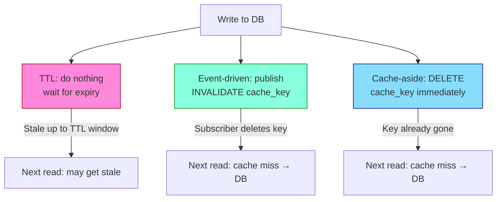
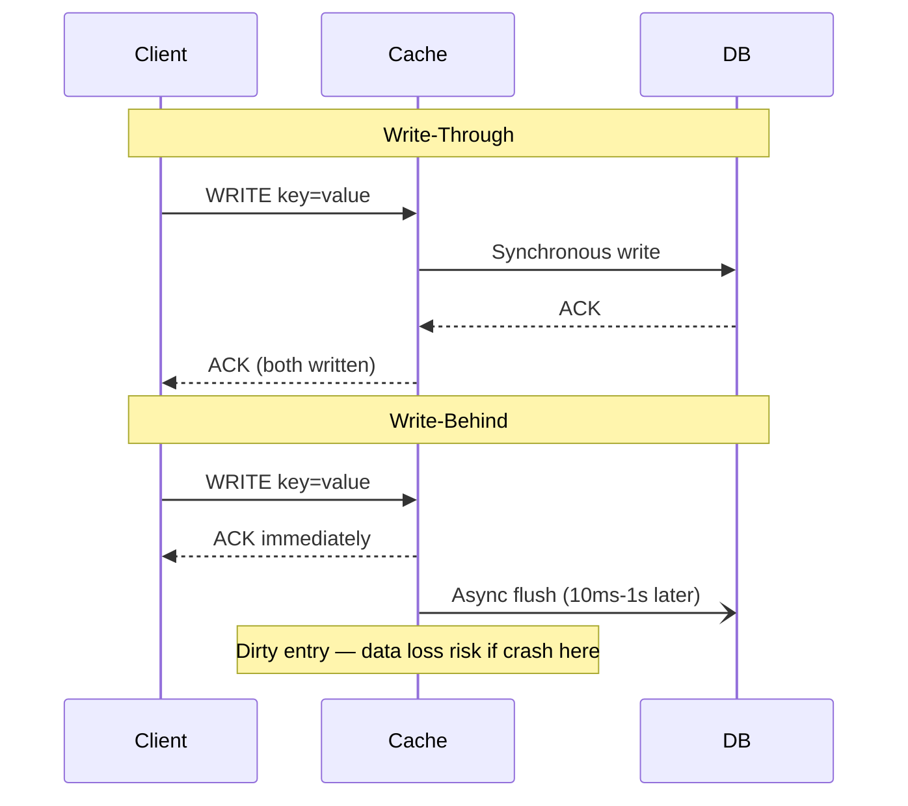
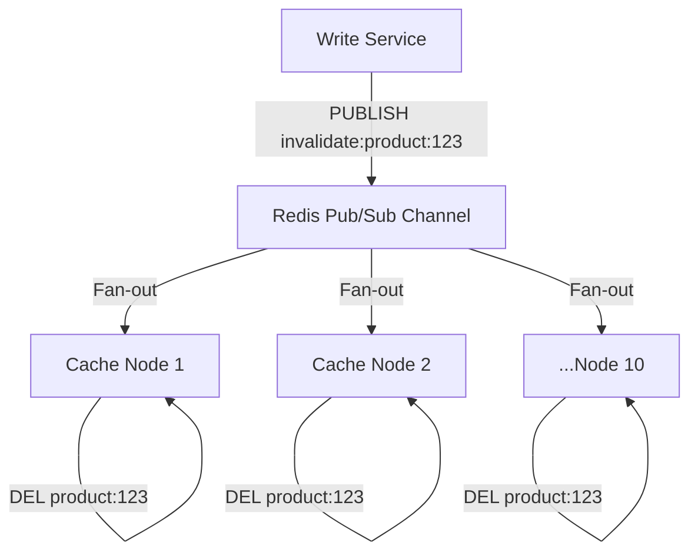
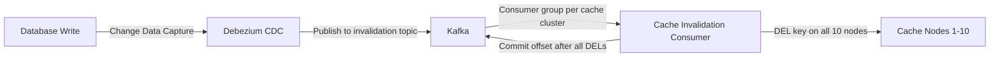
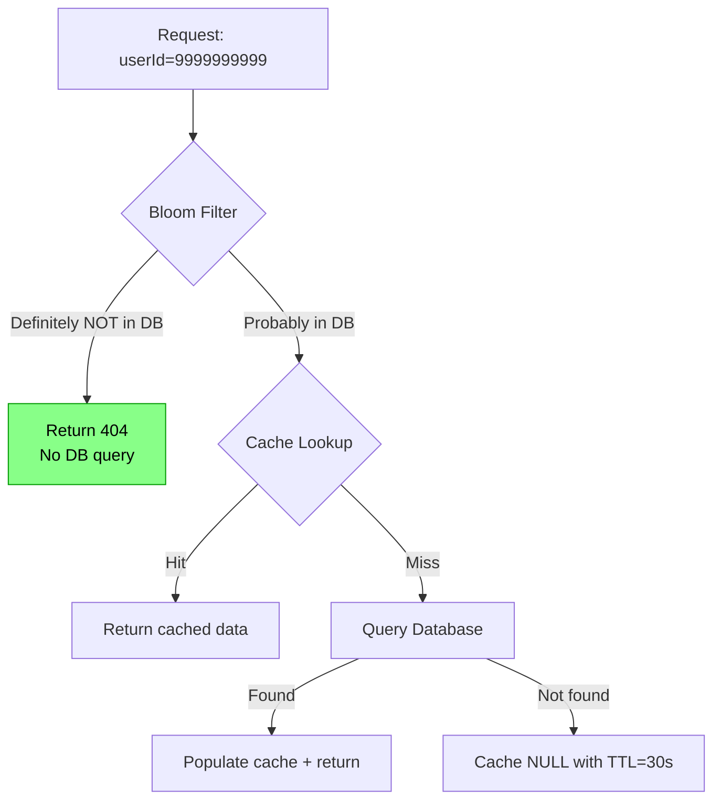
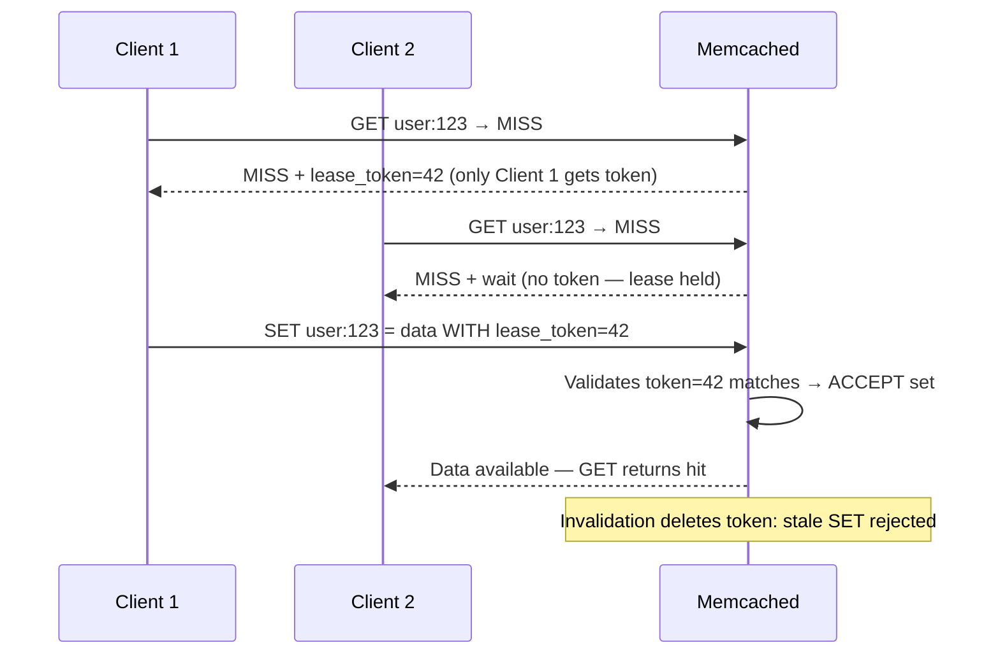
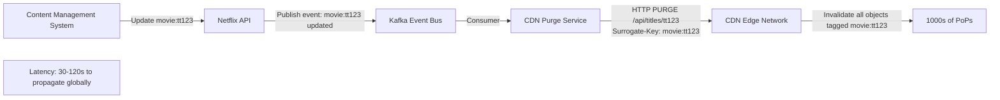
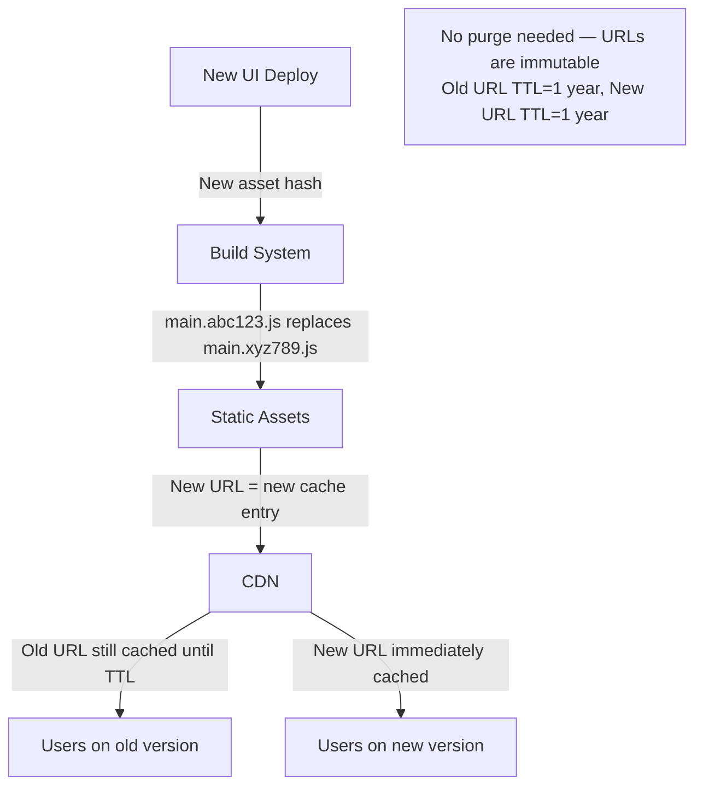

# Cache Invalidation Strategies

6 questions covering cache invalidation from TTL basics to Facebook-scale lease mechanisms.

---

## Q1: What are the 3 main cache invalidation strategies?

**Role:** Mid, Backend | **Difficulty:** 🟡 | **Priority:** P0 | **Format:** Quick Answer

> **What the interviewer is testing:** Whether you understand the trade-offs between time-based, event-driven, and read-on-miss invalidation strategies.

### Answer in 60 seconds
- **TTL (Time-to-Live):** Each cache entry expires after a fixed duration. Set TTL=60s → stale data accepted for up to 60s. Simplest, lowest overhead, but can serve stale data for the full TTL window.
- **Event-driven invalidation:** Application emits an event (DB write, message publish) that explicitly deletes or updates the cache key. Stale window ~0ms but requires messaging infrastructure and tight coupling between write and cache layer.
- **Cache-aside (lazy invalidation):** On read miss, fetch from DB and populate cache. On write, delete the cache key (not update) — next read repopulates. Avoids cache poisoning from write races but every invalidation triggers 1 cache miss + 1 DB read.
- **Numbers that matter:** TTL=60s → up to 60s stale. Event-driven → typically <100ms stale (pub/sub latency). Cache-aside → 0ms stale but 1 extra DB read per invalidation.

### Diagram



### Trade-off Table

| Strategy | Stale Window | Complexity | Infrastructure |
|----------|-------------|------------|----------------|
| TTL | Up to TTL value (1s–24h) | Low | None |
| Event-driven | <100ms (pub/sub lag) | High | Kafka/Redis pub/sub |
| Cache-aside (lazy) | 0ms after delete | Medium | None extra |

### Pitfalls
- ❌ **Setting TTL too long for financial data:** Account balances with TTL=300s can serve 5-minute-old balances. Use event-driven for anything money-related.
- ❌ **Updating cache on write instead of deleting:** Write-then-cache races cause the old value to overwrite the newer one if a second request races in. Always DELETE on write, let reads repopulate.
- ❌ **No TTL as a backstop on event-driven systems:** If the invalidation event is lost (broker outage), the cache entry lives forever. Always set a long-TTL (e.g., 1 hour) as a backstop even with event-driven invalidation.

### Concept Reference
→ [Caching Strategies](../../../system-design/fundamentals/caching-strategies)

---

## Q2: What is write-through vs write-behind caching — when do you choose each?

**Role:** Mid, Senior | **Difficulty:** 🟡 | **Priority:** P0 | **Format:** Quick Answer

> **What the interviewer is testing:** Whether you can reason about durability, performance, and data loss risk across write caching strategies.

### Answer in 60 seconds
- **Write-through:** Every write goes to cache AND database synchronously before ACKing the client. Latency = cache write time + DB write time (typically 1ms + 5ms = 6ms). Zero data loss. Cache is always consistent with DB.
- **Write-behind (write-back):** Write goes to cache only, ACK client immediately (<1ms). A background process flushes dirty cache entries to DB asynchronously (every 10ms–1s). Latency improves 5–10x but data in cache-only state can be lost if cache crashes before flush.
- **When to choose write-through:** Financial transactions, inventory updates, any write that cannot be lost. Accept the latency cost.
- **When to choose write-behind:** High-frequency writes where some loss is tolerable — analytics counters, activity logs, social media likes. Instagram uses write-behind for like counts (approximate counts accepted).
- **Numbers:** Write-through p99 latency: 10–20ms. Write-behind p99 latency: 1–3ms. Write-behind throughput ceiling: 10x higher than write-through for same hardware.

### Diagram



### Pitfalls
- ❌ **Using write-behind for user account data:** Cache crash before flush = lost profile update. Users report "my change disappeared."
- ❌ **Unbounded dirty queue in write-behind:** If DB is slow, dirty entries accumulate. Set max dirty threshold (e.g., 10K entries) and fall back to synchronous writes when exceeded.

### Concept Reference
→ [Caching Strategies](../../../system-design/fundamentals/caching-strategies)

---

## Q3: How do you invalidate a distributed cache across 10 nodes simultaneously?

**Role:** Senior | **Difficulty:** 🔴 | **Priority:** P1 | **Format:** Deep Dive

> **What the interviewer is testing:** Whether you understand fan-out invalidation, consistency windows across nodes, and practical coordination mechanisms.

### Problem Constraints
| Dimension | Value |
|-----------|-------|
| Cache topology | 10 Redis nodes, consistent hashing |
| Invalidation latency SLA | <500ms all nodes |
| Write rate | 1K invalidation events/sec |
| Consistency requirement | All nodes stale-free within 500ms |

### Approach A — Broadcast via Pub/Sub



| Dimension | Pub/Sub | Polling TTL | Kafka Fan-out |
|-----------|---------|-------------|---------------|
| Invalidation latency | <50ms | Up to TTL (seconds) | 100–500ms |
| Delivery guarantee | At-most-once | N/A | At-least-once |
| Infrastructure | Redis pub/sub (built-in) | None | Kafka cluster |
| Message loss on node restart | Yes | N/A | No (offset replay) |

### Approach B — Kafka-based Invalidation Bus



### Recommended Answer
Use **Redis Pub/Sub for low-latency invalidation** with a **TTL backstop** for reliability. The pub/sub message is at-most-once — acceptable if you have TTL=300s as a backstop. For mission-critical invalidation (pricing, inventory), switch to Kafka CDC (Change Data Capture with Debezium): every DB row change emits an invalidation event with at-least-once delivery. Cache consumer processes the event, executes `DEL key` on all affected nodes, then commits the Kafka offset. At 1K invalidations/sec, Kafka consumer lag stays <100ms with a 3-partition topic and 3 consumers.

### What a great answer includes
- [ ] Pub/Sub fan-out with <50ms propagation
- [ ] TTL as a durability backstop for message loss
- [ ] CDC-based approach for at-least-once delivery
- [ ] Version-stamping keys to handle out-of-order invalidation messages

### Pitfalls
- ❌ **Relying solely on pub/sub with no TTL backstop:** Redis pub/sub is fire-and-forget. A node restart during publish means it misses the invalidation and serves stale data until TTL.
- ❌ **Invalidating in a loop one-by-one:** `for node in nodes: DEL key` is sequential. Use pipeline or multi-exec for parallel DEL across nodes.
- ❌ **Not handling out-of-order invalidations:** Two rapid writes can produce invalidations in reversed order. Include a version/timestamp; skip invalidation if cached version is newer.

### Concept Reference
→ [Caching Strategies](../../../system-design/fundamentals/caching-strategies)

---

## Q4: What is cache penetration and how do you prevent it with bloom filters?

**Role:** Senior | **Difficulty:** 🔴 | **Priority:** P1 | **Format:** Quick Answer

> **What the interviewer is testing:** Whether you understand negative caching patterns and how bloom filters short-circuit DB queries for non-existent keys.

### Answer in 60 seconds
- **Cache penetration:** Requests for keys that don't exist in cache AND don't exist in DB. Every request bypasses cache and hammers the DB. At 10K req/sec, this is 10K unnecessary DB queries per second.
- **Attack vector:** Malicious clients send random user IDs (e.g., userId=9999999999) — guaranteed cache miss + DB miss every time.
- **Bloom filter solution:** A probabilistic data structure that answers "definitely not in DB" (0% false negatives) or "probably in DB" (small false positive rate, e.g., 1%). If bloom filter says "not in DB" → return 404 immediately, no DB query. False positive → DB query happens (rare, acceptable).
- **Numbers:** Bloom filter for 100M keys: ~200MB RAM (2 bytes/key). False positive rate: 1% with 10 hash functions. Bloom filter check: O(1), <1µs.
- **Null caching (simpler alternative):** Cache the DB miss result as `NULL` with short TTL (30s). Protects against organic missing keys but not random-key attacks.

### Diagram



### Pitfalls
- ❌ **Bloom filter without TTL rotation:** Once a key is deleted from DB, the bloom filter still says "probably in DB" — causing unnecessary DB queries. Rebuild bloom filter nightly or use Cuckoo filters (support deletion).
- ❌ **Null caching with long TTL:** Cache `NULL` for 24 hours means a legitimately created user isn't visible for 24 hours. Keep null TTL ≤ 60 seconds.
- ❌ **No rate limiting alongside bloom filter:** Bloom filter reduces DB load but doesn't stop the attack at the network level. Pair with IP-based rate limiting (100 req/min/IP).

### Concept Reference
→ [Caching Strategies](../../../system-design/fundamentals/caching-strategies)

---

## Q5: How does Facebook's Lease mechanism solve cache invalidation thundering herd?

**Role:** Staff | **Difficulty:** ⚫ | **Priority:** P1 | **Format:** Deep Dive

> **What the interviewer is testing:** Whether you understand the specific race condition that makes cache invalidation hard at Facebook scale — and the lease-based solution from their 2013 Memcached paper.

### Problem Constraints
| Dimension | Value |
|-----------|-------|
| Scale | 1B+ users, Memcached clusters with 1000s of servers |
| Problem | Cache invalidation under heavy concurrent load |
| Race condition | Stale sets: outdated data overwrites fresh data |
| Thundering herd | 100s of requests hit DB simultaneously on cache miss |

### The Two Problems Leases Solve

```mermaid
sequenceDiagram
  participant C1 as Client 1
  participant C2 as Client 2
  participant MC as Memcached
  participant DB

  Note over C1,DB: Problem 1 — Thundering Herd
  C1->>MC: GET user:123 → MISS
  C2->>MC: GET user:123 → MISS
  C1->>DB: SELECT user 123
  C2->>DB: SELECT user 123 (duplicate!)
  DB-->>C1: {name: Alice}
  DB-->>C2: {name: Alice}

  Note over C1,DB: Problem 2 — Stale Set Race
  C1->>MC: GET user:123 → MISS (old value)
  C1->>DB: Reads stale value v1
  DB write: v1 → v2
  MC->>MC: Invalidation: DELETE user:123
  C1->>MC: SET user:123 = v1 (stale! overwrites)
```

### Lease Solution



### Recommended Answer
Facebook's 2013 NSDI paper introduced leases to solve two Memcached problems simultaneously. A **lease** is a token issued by Memcached to exactly one client on a cache miss. Only the lease holder can SET the key — all other clients wait (10–50ms) or receive a "try again" response. This serializes DB reads, cutting thundering-herd DB load by 99% (100 simultaneous readers → 1 DB query). For the stale-set problem: when Memcached processes an invalidation (DELETE), it also invalidates the current lease token. If a slow client tries to SET with a stale token, Memcached rejects it. Result: no stale data can enter the cache through a race.

Lease TTL is 10 seconds — if the lease holder crashes, the lease expires and the next client gets a new token.

### What a great answer includes
- [ ] Name both problems leases solve: thundering herd AND stale sets
- [ ] Explain lease token invalidation on DELETE (prevents stale set race)
- [ ] Mention 10-second lease TTL and crash recovery
- [ ] Quantify DB query reduction (100 readers → 1 DB query)

### Pitfalls
- ❌ **Confusing leases with locks:** Leases are not distributed locks — they have no two-phase protocol. A lease holder simply has priority to write; others wait briefly then proceed.
- ❌ **Forgetting the wait strategy for non-lease-holders:** Clients waiting for a lease don't spin — they retry after a short sleep (10–50ms). Without this, you still have a thundering herd on the retry side.

### Concept Reference
→ [Caching Strategies](../../../system-design/fundamentals/caching-strategies)

---

## Q6: How does Netflix invalidate CDN caches for 300M users globally?

**Role:** Staff | **Difficulty:** ⚫ | **Priority:** P2 | **Format:** Deep Dive

> **What the interviewer is testing:** Whether you understand CDN cache invalidation at global scale — surrogate keys, cache-tag-based purging, and the trade-offs between purge-on-write and TTL-based strategies.

### Problem Constraints
| Dimension | Value |
|-----------|-------|
| Users | 300M globally, 190+ countries |
| CDN PoPs | 1000s of edge nodes (Open Connect Appliances) |
| Content types | Video metadata, UI assets, personalized recommendations |
| Invalidation SLA | Video metadata stale <5 minutes; UI assets stale <30 seconds |

### Approach A — Surrogate Key Purging



### Approach B — Versioned URLs (Cache-busting)



| Content Type | Strategy | Stale Window | Mechanism |
|-------------|----------|-------------|-----------|
| Static assets (JS/CSS) | Versioned URL | 0ms | Content hash in filename |
| Video metadata | Surrogate key purge | 30–120s | CDN tag-based purge |
| Personalized recommendations | Short TTL | 5–60min | TTL expiry only |
| Movie thumbnails | Versioned URL | 0ms | URL includes version |

### Recommended Answer
Netflix uses **different invalidation strategies per content type**. Static UI assets use **versioned URLs** (content-addressed filenames like `main.abc123.js`) — CDN serves them with TTL=1 year, and a new deploy creates new URLs with no invalidation needed. Video metadata uses **surrogate key purging**: each CDN object is tagged with entity IDs (e.g., `movie:tt123`). When metadata updates, Netflix fires an HTTP PURGE request with the surrogate key, and the CDN propagates the purge to all PoPs within 30–120 seconds. For personalized content (home screen rows), Netflix uses short TTLs (5–15 minutes) because purging 300M personalized objects is impractical.

Netflix's Open Connect CDN (their own CDN) has a cache hit ratio target of 95%+. Too-aggressive purging drops this ratio, increasing origin load. They model purge frequency vs cache hit ratio impact before making invalidation policy changes.

### What a great answer includes
- [ ] Segment content types: static assets vs metadata vs personalized
- [ ] Versioned URL strategy for static assets (no purge needed)
- [ ] Surrogate key / cache-tag purging for structured content
- [ ] TTL-only strategy for personalized content (purge impractical at scale)
- [ ] Cache hit ratio as the key metric

### Pitfalls
- ❌ **Purging everything on any change:** At 300M users, purging personalized rows invalidates billions of cache objects. Cache hit ratio collapses, origin servers get overwhelmed.
- ❌ **Ignoring propagation time:** CDN purges are not instant. 30–120s propagation means some users see old content during the window — build UIs that handle this gracefully.

### Concept Reference
→ [Caching Strategies](../../../system-design/fundamentals/caching-strategies)
