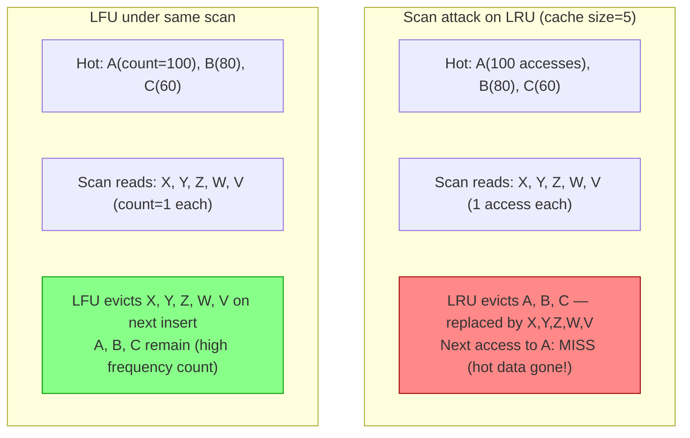
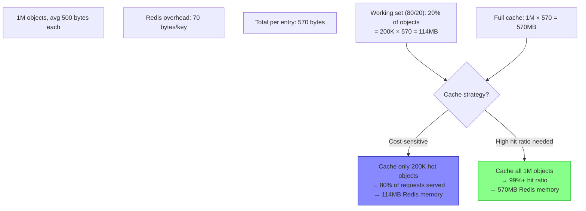
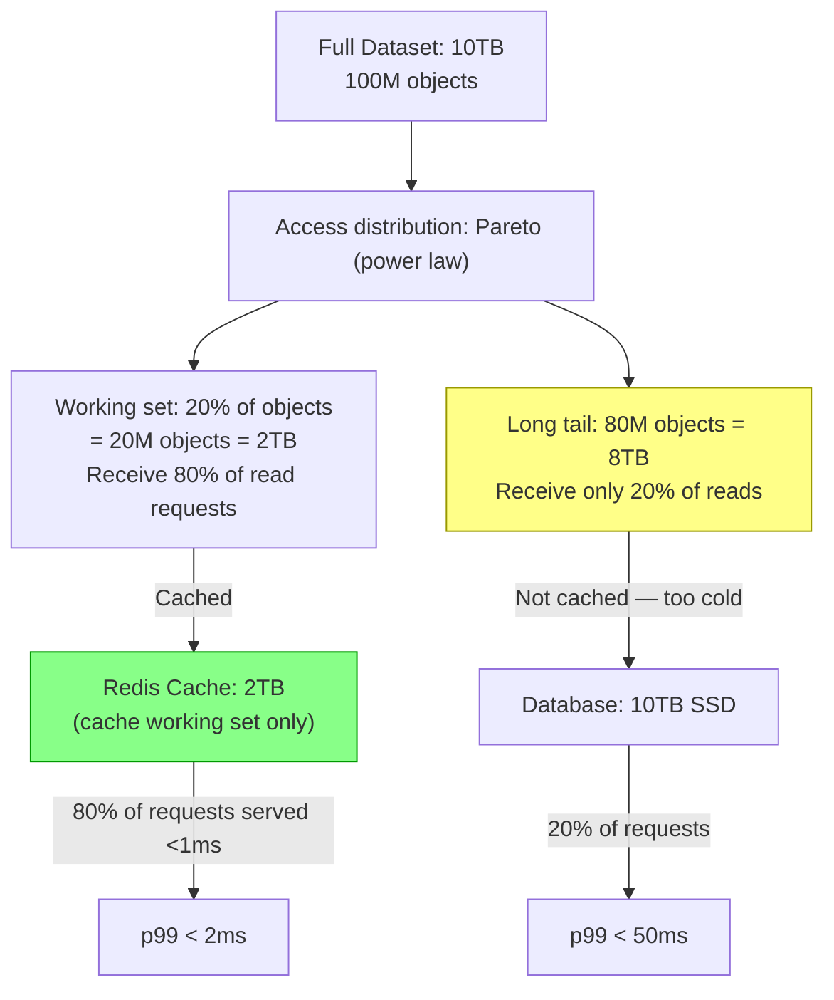
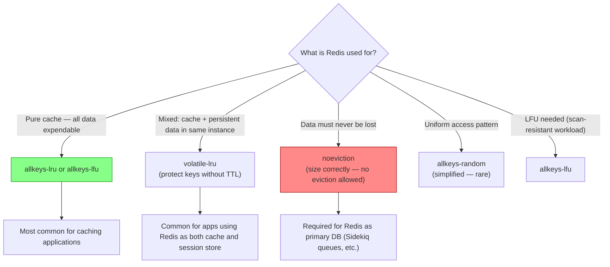
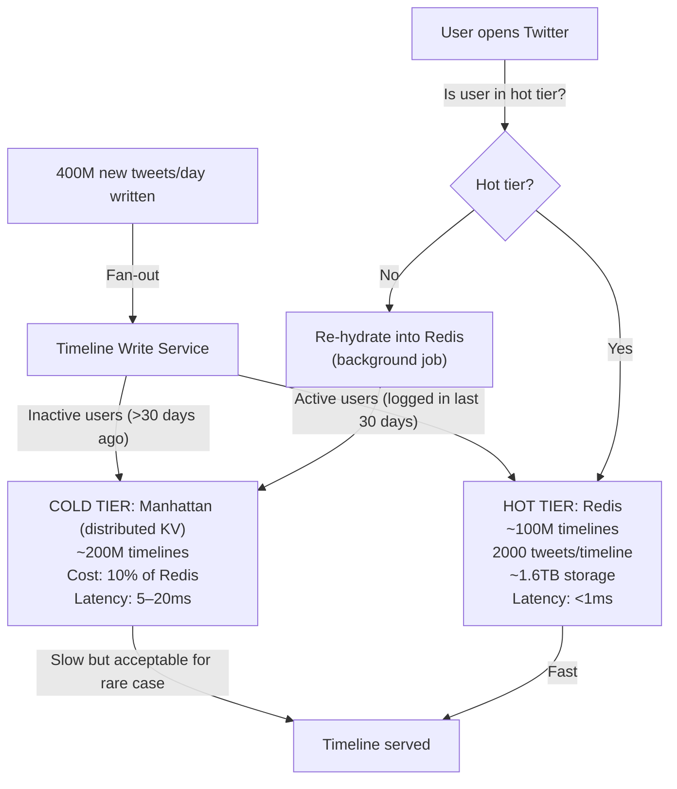
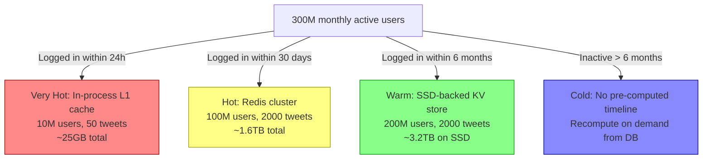

# Cache Sizing & Eviction

5 questions covering cache sizing and eviction algorithms from LRU vs LFU to Twitter's hot/cold tiering strategy.

---

## Q1: When does LFU outperform LRU, and what is scan resistance?

**Role:** Mid | **Difficulty:** 🟡 | **Priority:** P0 | **Format:** Quick Answer

> **What the interviewer is testing:** Whether you understand the access pattern assumptions behind LRU and LFU and can identify when each is appropriate.

### Answer in 60 seconds
- **LRU (Least Recently Used):** Evicts the item not accessed for the longest time. Assumes that recently used items are more likely to be accessed again — temporal locality. Fast to implement (doubly linked list + hash map, O(1) operations).
- **LFU (Least Frequently Used):** Evicts the item with the fewest total accesses. Assumes that frequently accessed items are more valuable. More complex to implement — requires frequency counters and a min-heap or sorted set.
- **When LFU wins:** Workloads with persistent "hot" items that are always in demand. If product ID 1 is accessed 10M times and product ID 999 is accessed once, LRU may evict product ID 1 if it wasn't accessed in the last N minutes — LFU never evicts it because its count is highest.
- **Scan resistance — LFU's key advantage:** A "scan" is a one-time sequential read of many items (e.g., a DB backup, a batch job reading all products). Under LRU, a scan evicts all hot items from cache because each scanned item becomes the most recent. LFU is immune — the scanned items have count=1 and are evicted before any high-count hot item.
- **ARC (Adaptive Replacement Cache):** Balances LRU and LFU dynamically. Tracks both recently used and frequently used items with two sub-lists. Adapts to access patterns automatically. Used in ZFS. 10–30% better hit ratio than pure LRU or LFU on mixed workloads.

### Diagram

### Pitfalls
- ❌ **Using LFU for recency-sensitive workloads:** If hot items change over time (trending topics, news), LFU keeps stale "historically popular" items indefinitely. Add time-decay to frequency counts: `count = count × decay_factor_per_minute`.
- ❌ **Assuming Redis uses pure LRU:** Redis 4.0+ uses an approximation algorithm sampling 5 keys (configurable via `maxmemory-samples`). It is not exact LRU — it is probabilistic. The default sample of 5 provides near-LRU behaviour at lower CPU cost.
- ❌ **Implementing LFU without frequency decay:** Without decay, an item popular 3 months ago (count=10M) will never be evicted even if not accessed since — cache fills with stale "historically hot" items.

### Concept Reference
→ [Caching Strategies](../../../01-databases/concepts/write-ahead-log)

---

## Q2: How do you size a Redis cache for 1M objects at 10K req/sec?

**Role:** Mid | **Difficulty:** 🟡 | **Priority:** P0 | **Format:** Quick Answer

> **What the interviewer is testing:** Whether you can perform working set analysis and arrive at a realistic Redis memory allocation rather than saying "just add more RAM."

### Answer in 60 seconds
- **Step 1 — Object size analysis:**
  - Average object size: 500 bytes (serialised JSON)
  - Redis overhead per key: ~70 bytes (Redis object metadata, hash table entry, jemalloc allocator overhead)
  - Total per entry: ~570 bytes
- **Step 2 — Working set estimation (80/20 rule):**
  - 1M total objects, but 80% of requests hit 20% of objects
  - Working set = 200K hot objects × 570 bytes = 114MB
  - Cache all hot objects (200K): 114MB — easily fits in a single Redis instance
  - Caching all 1M objects: 1M × 570 bytes = 570MB — still manageable
- **Step 3 — Throughput validation:**
  - Redis single-threaded commands: 100K–1M ops/sec per core (depending on command type)
  - 10K req/sec: well within single-instance capacity
  - For 100K req/sec: consider Redis cluster or pipelining
- **Step 4 — Memory configuration:**
  - Set `maxmemory` to 80% of available RAM (e.g., 1GB RAM → `maxmemory 800mb`)
  - Reserve 20% for Redis internal buffers, replication, and `BGSAVE` fork overhead
  - At 570MB working set: a 1GB Redis instance is sufficient with 40% headroom
- **Recommendation:** 1 × 2GB Redis instance for 1M objects with 2× headroom. Add a replica for HA. At 10K req/sec, single-threaded Redis is not a bottleneck.

### Diagram

### Pitfalls
- ❌ **Ignoring Redis metadata overhead:** Raw object size is not Redis memory size. The 70-byte overhead per key means 1M empty-string keys consume 70MB just in metadata.
- ❌ **Setting `maxmemory` to 100% of RAM:** Redis needs overhead for replication buffers, AOF rewrite, and BGSAVE COW (copy-on-write) which can briefly 2× memory usage. At 100%, Redis OOM-kills the OS process.
- ❌ **Not accounting for expiry (TTL) overhead:** Each key with a TTL adds an entry to Redis's expires dictionary — ~80 additional bytes. At 1M TTL-bearing keys: 80MB extra.

### Concept Reference
→ [Caching Strategies](../../../01-databases/concepts/write-ahead-log)

---

## Q3: Explain the 80/20 rule for cache sizing and working set analysis.

**Role:** Mid | **Difficulty:** 🟡 | **Priority:** P1 | **Format:** Quick Answer

> **What the interviewer is testing:** Whether you can apply Pareto analysis to cache sizing rather than proposing "cache everything."

### Answer in 60 seconds
- **The 80/20 rule (Pareto principle) for caching:** 80% of read traffic accesses 20% of the data. Caching that 20% (the "working set") captures 80% of the cache benefit at 20% of the storage cost.
- **Working set definition:** The subset of data that accounts for the vast majority of read traffic. Determined by access frequency analysis from query logs, not intuition.
- **How to identify the working set:**
  1. Sample 24 hours of read queries
  2. Group by cache key (or query ID)
  3. Sort by access count descending
  4. The top 20% of keys by access count = the working set
- **Cache sizing formula:** `Cache size = working_set_count × avg_object_size × (1 + overhead_ratio)`. Overhead ratio ≈ 0.2 (Redis metadata, eviction structures).
- **Practical result:** A 10TB dataset with a 20% working set requires 2TB of cache, not 10TB. At $0.10/GB for Redis memory vs $0.02/GB for SSD, this 5× size reduction saves significant cost.
- **When 80/20 doesn't hold:** Uniform access distributions (scientific data, log ingestion) have no hot keys — all keys equally accessed. For these workloads, caching provides minimal hit ratio improvement and is not worth the cost.

### Diagram

### Pitfalls
- ❌ **Applying 80/20 without measuring:** The actual ratio may be 90/10 or 60/40. Query your access logs before sizing. Assume nothing.
- ❌ **Working set shifts over time:** An e-commerce site's working set during Black Friday is completely different from its off-peak working set. Size the cache for peak working set, not average.
- ❌ **Caching the full dataset "just in case":** If 80% of objects are never requested, they waste cache memory that could be better used for hot keys with higher replication or larger object buffers.

### Concept Reference
→ [Caching Strategies](../../../01-databases/concepts/write-ahead-log)

---

## Q4: What are Redis maxmemory-policy options and when do you use each?

**Role:** Senior | **Difficulty:** 🔴 | **Priority:** P1 | **Format:** Quick Answer

> **What the interviewer is testing:** Whether you know Redis eviction configuration and can select the correct policy based on the application's data characteristics.

### Answer in 60 seconds
- **`noeviction` (default):** When memory is full, Redis returns an error for write commands. Reads still work. Use when: data must never be lost (primary database, not cache). Risk: application receives OOM errors if cache is not sized correctly.
- **`allkeys-lru`:** Evict the least recently used key from ALL keys. Use when: all keys are cache entries with equal value, and recency indicates future access likelihood. Best general-purpose policy for pure cache use cases.
- **`volatile-lru`:** Evict the least recently used key from keys with a TTL set. Keys without TTL are never evicted. Use when: Redis stores both cache data (with TTL) and persistent data (without TTL) in the same instance — protect persistent data from eviction.
- **`allkeys-lfu`:** Evict the least frequently used key from ALL keys. Use when: access patterns follow power-law distribution with persistent hot items and infrequent scan workloads.
- **`volatile-ttl`:** Evict keys with the shortest remaining TTL first. Use when: keys are differentiated by urgency of expiry — evict the "nearest-to-expired" items first.
- **`allkeys-random`:** Evict a random key. Use when: access distribution is uniform and LRU overhead is undesirable. Rarely the right choice.

### Diagram

### Pitfalls
- ❌ **Running `noeviction` as a cache:** When cache fills up, Redis returns errors for all writes. Application crashes or degrades. Use `allkeys-lru` for cache deployments.
- ❌ **`volatile-lru` without setting TTL on cache keys:** If all cache keys have no TTL, `volatile-lru` behaves like `noeviction` — no keys are eligible for eviction, writes fail when memory is full.
- ❌ **Not setting `maxmemory` at all:** Without `maxmemory`, Redis consumes all available system memory — crowding out the OS, other processes, and eventually triggering OOM kill from the kernel. Always set `maxmemory`.

### Concept Reference
→ [Caching Strategies](../../../01-databases/concepts/write-ahead-log)

---

## Q5: How does Twitter size the Timeline cache for 400M tweets/day using hot/cold tiering?

**Role:** Staff | **Difficulty:** ⚫ | **Priority:** P2 | **Format:** Deep Dive

> **What the interviewer is testing:** Whether you understand tiered cache architectures where not all data can fit in memory and you must make principled decisions about what to keep in which tier.

### Problem Constraints
| Dimension | Value |
|-----------|-------|
| Tweets per day | 400M new tweets |
| Total tweet storage | Petabytes |
| Timeline cache | Pre-computed per-user timeline in Redis |
| Active users | 300M monthly / 100M daily |
| Target timeline load | p99 < 100ms |

### Hot/Cold Tier Architecture

### Tier Classification

| Tier | Users | Storage | Latency | Cost per TB |
|------|-------|---------|---------|-------------|
| L1 in-process | 10M | ~25GB | <0.1ms | High (RAM) |
| L2 Redis (hot) | 100M | ~1.6TB | <1ms | High (RAM) |
| L3 SSD KV (warm) | 200M | ~3.2TB | 5–20ms | Medium |
| L4 Recompute | Inactive | 0 | 200ms–2s | Low (compute) |

### Recommended Answer
Twitter's Timeline Service (described in their engineering blog) pre-computes each user's timeline and stores it in a tiered cache. The key insight: 90% of accesses come from 33% of users (daily actives) — the remaining 67% need only warm-or-cold storage.

**Hot tier (Redis):** Store the last 2,000 tweet IDs for each of the 100M monthly active users. Memory: 100M × 2,000 × 8 bytes (ID) = 1.6TB. Redis cluster with 12 shards × 256GB = ~3TB capacity with 2× headroom.

**Cold tier (Manhattan, Twitter's distributed KV):** Store timelines for users inactive for 30+ days on SSD-backed storage. 200M users × 2,000 tweet IDs = 3.2TB. SSD cost is ~10% of RAM cost per GB.

**Tier migration:** Background job checks last login timestamp. Users returning after inactivity trigger timeline recomputation (fan-out from scratch) and promotion to hot tier. Takes 1–5 seconds for recomputation — acceptable one-time cost.

**Eviction from hot tier:** When a user is inactive for 30+ days, their Redis timeline entry is evicted (or migrated to cold tier) to free hot tier space for newly active users.

### What a great answer includes
- [ ] Hot/cold tiering: Redis for 100M actives, SSD KV for 200M inactives
- [ ] Memory estimate: 100M × 2,000 × 8 bytes = 1.6TB for hot tier
- [ ] Tier migration mechanism: background job based on last login timestamp
- [ ] Cost comparison: SSD is ~10% the cost of RAM per GB
- [ ] Recomputation latency for cold users: 1–5s acceptable on first access

### Pitfalls
- ❌ **Caching all 300M timelines in Redis:** 300M × 1.6TB/100M = 4.8TB of Redis. At $5/GB for Redis cluster, this is $24M/year just for timeline caching. Tier appropriately.
- ❌ **No tier migration on re-activation:** Without promotion to hot tier, returning users always hit the cold tier — paying 5–20ms latency on every timeline request indefinitely.
- ❌ **Recomputing timelines synchronously on cold miss:** Recomputing a timeline (fan-out read of all follows) takes 200ms–2s. Do this asynchronously in the background, serving a partial timeline from cold storage immediately.

### Concept Reference
→ [Caching Strategies](../../../01-databases/concepts/write-ahead-log)
