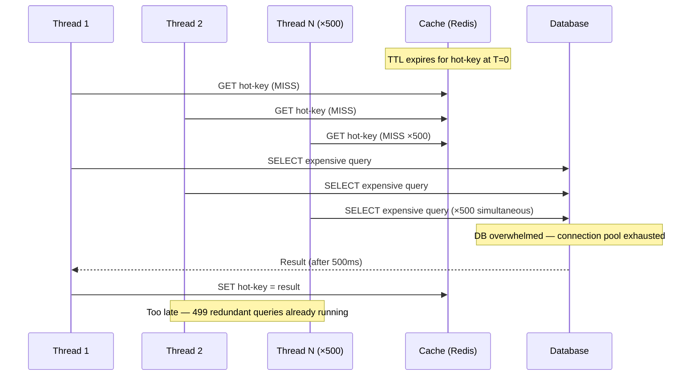
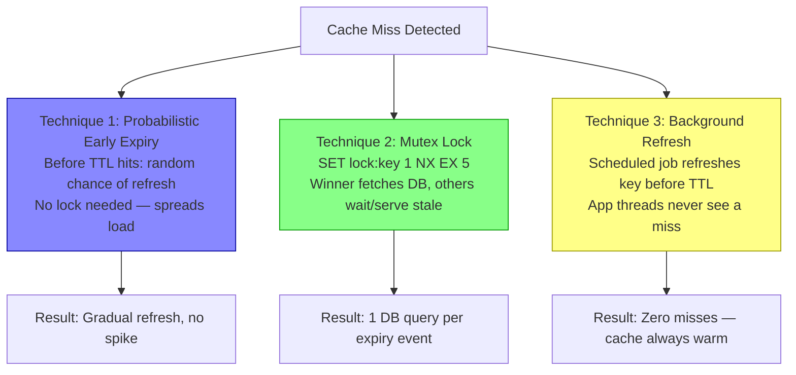
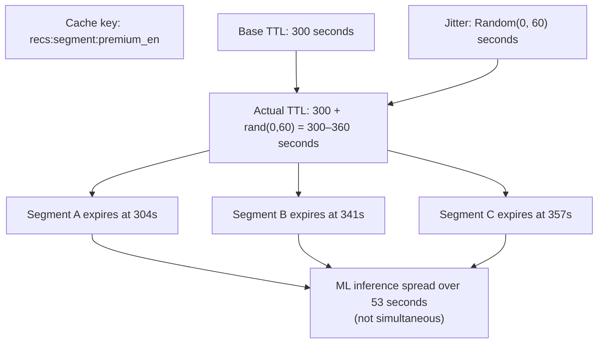
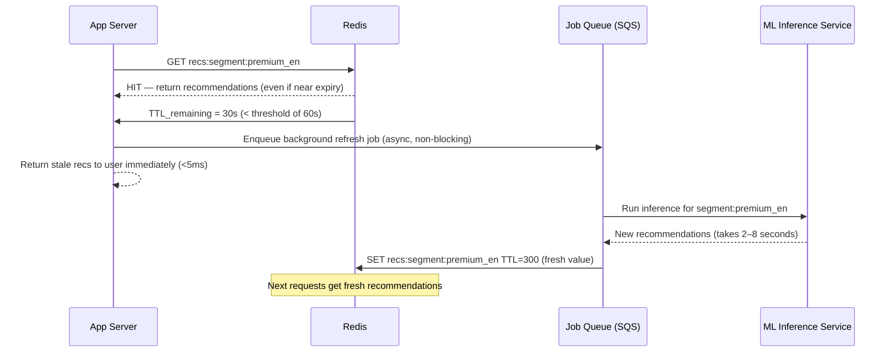
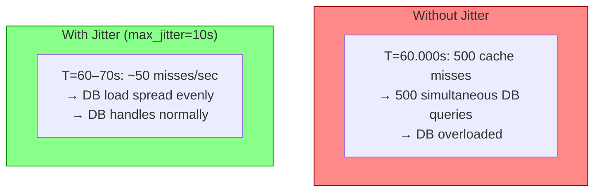
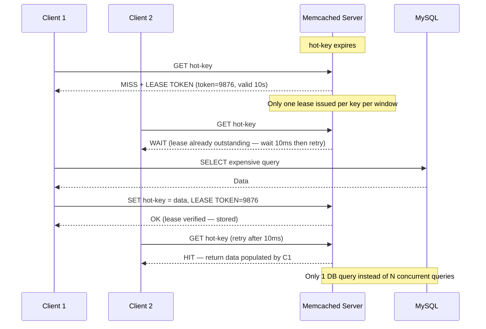
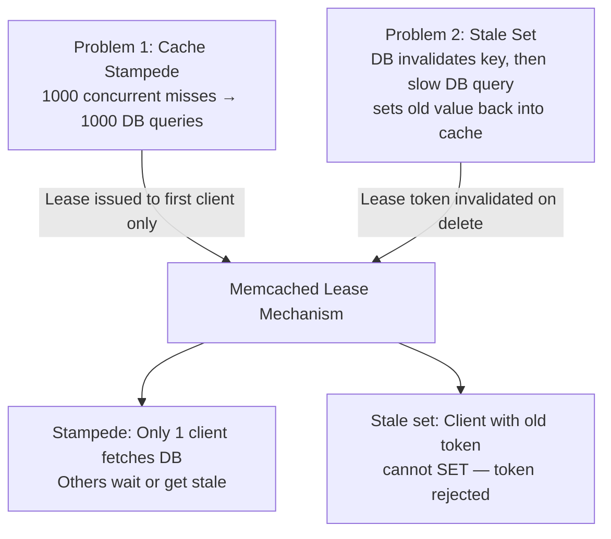

# Cache Stampede & Thundering Herd

5 questions covering cache stampede from fundamentals to Facebook's 1B-scale lease solution.

---

## Q1: What is cache stampede (thundering herd) and why does it happen?

**Role:** Mid | **Difficulty:** 🟡 | **Priority:** P0 | **Format:** Quick Answer

> **What the interviewer is testing:** Whether you can explain the failure mode precisely and articulate why TTL-based expiry makes it inevitable without mitigation.

### Answer in 60 seconds
- **Definition:** Cache stampede (also called thundering herd) occurs when a popular cached item expires and many concurrent requests — all finding the cache empty — simultaneously query the backing database to regenerate the entry.
- **Why it happens:** All concurrent requests check the cache at nearly the same moment. All find a miss. All proceed to the DB. None waits for another to finish. If 10,000 req/sec are hitting the same key, a TTL expiry triggers 10,000 simultaneous DB queries in the ~5ms window before any of them can populate the cache.
- **Impact:** A single cached item expiry can overload the database by 1000x the normal per-item query rate. If the DB query takes 500ms, all 10,000 requests hold a DB connection for 500ms simultaneously — likely exhausting the connection pool and triggering cascading failure.
- **Preconditions:** Requires (1) many concurrent clients, (2) a shared popular cache key, (3) synchronous cache miss handling. It worsens with higher traffic and more popular items.
- **Real example at scale:** A product page cached for 60 seconds. At 00:01:00.000 the cache expires. In the next 50ms, 500 app server threads simultaneously issue `SELECT * FROM products WHERE id=1` — 500x the normal DB load for that query.

### Diagram

### Pitfalls
- ❌ **"Just increase the TTL":** Longer TTL delays the problem but doesn't eliminate it. Every key will eventually expire — at higher traffic, the burst is larger.
- ❌ **"We use Redis so we're fine":** Redis itself is not the bottleneck. The problem is the simultaneous DB queries triggered by the cache miss — Redis is just the empty guard.
- ❌ **Confusing stampede with cache thrashing:** Thrashing is eviction under memory pressure. Stampede is the burst of DB queries on TTL expiry. Both cause DB overload but have different root causes and different fixes.

### Concept Reference
→ [Caching Strategies](../../../01-databases/concepts/write-ahead-log)

---

## Q2: What are the 3 main techniques to prevent cache stampede?

**Role:** Mid | **Difficulty:** 🟡 | **Priority:** P0 | **Format:** Quick Answer

> **What the interviewer is testing:** Whether you know multiple mitigation strategies and can select the appropriate one for a given context.

### Answer in 60 seconds
- **Technique 1 — Probabilistic early expiry (XFetch):** Before the TTL actually expires, each request has a small probability of triggering a background refresh proportional to how close the TTL is to expiry. The formula: refresh if `(TTL_remaining < β × delta × ln(rand()))` where `beta` is a tuning constant and `delta` is the expected recomputation time. This spreads recomputation across time instead of concentrating it at the exact expiry moment. No locks needed.
- **Technique 2 — Mutex/distributed lock:** When cache miss occurs, attempt to acquire a Redis lock (`SET lock:hot-key 1 NX EX 5`). Only one thread wins the lock and regenerates the cache. All other threads either wait (with a short sleep + retry) or serve a stale value if available. Simple to implement; 1 DB query per expiry event instead of N.
- **Technique 3 — Background refresh (proactive re-caching):** A separate background job refreshes the cache before TTL expires. App threads always read from the cache (which is always populated) and never trigger a DB query on miss. Tradeoff: requires a scheduler and increases complexity; eliminates the stampede entirely.
- **Best for each:** Probabilistic early expiry — high-read, low-write, stateless keys. Mutex — when recomputation is expensive and infrequent. Background refresh — when the key is always needed and freshness SLA is relaxed.

### Diagram

### Pitfalls
- ❌ **Mutex with no timeout:** A thread holds the lock and crashes — lock never released — all other threads wait forever. Always set lock TTL: `SET lock:key 1 NX EX 5` (5-second auto-expiry).
- ❌ **Background refresh without freshness awareness:** Refreshing a user-personalised cache key in the background for a user who logged out 6 months ago wastes resources. Use background refresh only for globally shared keys.
- ❌ **Probabilistic early expiry with β=0:** Setting beta too low means refresh only happens at expiry time — same as no protection. Tuning β=1 (recomputation time in seconds) is a safe starting point.

### Concept Reference
→ [Caching Strategies](../../../01-databases/concepts/write-ahead-log)

---

## Q3: How do you prevent cache stampede for an expensive ML model output?

**Role:** Senior | **Difficulty:** 🔴 | **Priority:** P1 | **Format:** Deep Dive

> **What the interviewer is testing:** Whether you can apply stampede prevention to a non-trivial case where recomputation is extremely expensive (ML inference) and staleness has a product impact.

### Problem Constraints
| Dimension | Value |
|-----------|-------|
| ML inference time | 2–8 seconds per user recommendation |
| Cache TTL | 300 seconds (5 minutes) |
| Concurrent users | 50K active sessions |
| Popular segments | Top 10 user segments receive 70% of requests |
| Staleness tolerance | Stale recommendations are acceptable for 30 seconds |

### Approach A — Staggered TTL with Jitter

### Approach B — Async Refresh with Stale-While-Revalidate

| Dimension | Staggered TTL | Async Refresh |
|-----------|--------------|--------------|
| Stampede prevention | Partial — distributes expiry | Full — cache always populated |
| Staleness window | 0–60s jitter | Up to 60s while job runs |
| ML inference triggered by | Cache miss | Background job |
| User latency impact | +2–8s on miss | 0 — always served from cache |
| Implementation complexity | Low | Medium |

### Recommended Answer
For expensive ML inference, **never allow a user request to trigger ML inference synchronously** — 2–8 seconds is far beyond any acceptable p99 latency SLA.

**Strategy: Always-warm cache with background refresh queue.**

1. Cache key per user segment (not per user — reduces cache entries from 50M to 10).
2. Background refresh job watches TTL via Redis `OBJECT IDLETIME` or a separate refresh-deadline sorted set. When TTL < 60 seconds, enqueue refresh.
3. App layer always reads from cache — if cache is cold (first deployment), serve a default recommendation set rather than blocking.
4. Staggered TTL (base 300s + rand(0,60)) prevents all segments from expiring simultaneously.
5. For individual user recommendations (not segments): pre-compute during off-peak hours (02:00–06:00 UTC) and store results with TTL=86400 (24 hours). Refresh hourly for most-active users.

**Result:** 0 user-facing ML inference calls. Cache hit ratio: 99.9%. ML service load: predictable, off-peak.

### What a great answer includes
- [ ] Never let user requests trigger synchronous ML inference (2–8s latency is unacceptable)
- [ ] Segment-level caching to reduce cache space from 50M to 10 entries
- [ ] Background job queue for proactive cache refresh
- [ ] Staggered TTL to prevent simultaneous segment expiry
- [ ] Default/fallback recommendations for cold start

### Pitfalls
- ❌ **Per-user ML inference on cache miss:** 50K concurrent users × 2-second inference = ML service needs 100K concurrent inference requests. ML service crashes at 1,000 concurrent — 100x overload.
- ❌ **Synchronous cache-aside for ML:** Even a mutex lock means 1 user waits 8 seconds. Not acceptable — always decouple inference from the request path.
- ❌ **Forgetting cold start:** On first deployment or cache flush, no cache entries exist. Without a fallback (default recs or popular-items list), all users see errors while ML precomputes.

### Concept Reference
→ [Caching Strategies](../../../01-databases/concepts/write-ahead-log)

---

## Q4: How does random TTL jitter prevent synchronised cache expiry?

**Role:** Mid | **Difficulty:** 🟡 | **Priority:** P1 | **Format:** Quick Answer

> **What the interviewer is testing:** Whether you understand why clock-synchronised TTL expiry is a root cause of thundering herd and how statistical spreading resolves it.

### Answer in 60 seconds
- **The problem without jitter:** If all app servers set the same key at the same moment (e.g., on application startup or after a cache flush), they all expire at the same moment — triggering a stampede at that exact second.
- **How jitter works:** Add a random value to the base TTL before storing: `TTL = base_TTL + random(0, max_jitter)`. Each request that populates the cache will expire at a slightly different time, spreading DB load over the jitter window instead of concentrating it at one instant.
- **Example without jitter:** 500 servers all set `product:1` with TTL=60 at T=0. At T=60, all 500 instances expire simultaneously → 500 simultaneous DB queries.
- **Example with jitter (max_jitter=10):** 500 servers set TTL between 60 and 70 seconds. Expiry is spread uniformly over a 10-second window → ~50 DB queries per second instead of 500 in one moment. Same total load, zero spikes.
- **Where to apply jitter:** Apply jitter when multiple processes or servers independently cache the same key. Not needed when a single process writes to cache (no synchronisation problem).
- **Appropriate jitter range:** 10–20% of the base TTL is a common heuristic. TTL=300s → jitter=0–60s.

### Diagram

### Pitfalls
- ❌ **Jitter without seeding the random number generator:** If all servers use the same random seed (e.g., constant seed in a poorly initialised library), they all generate the same "random" jitter — no spread at all.
- ❌ **Jitter alone on a single-server write:** If only one server sets the cache entry, there's no synchronisation problem — jitter provides no benefit. Jitter is for cases where multiple servers simultaneously write the same key.
- ❌ **Too-large jitter violating freshness SLA:** If data must be fresh within 60 seconds, adding 60-second jitter means some clients see 120-second-old data. Keep jitter ≤ 20% of base TTL or within the staleness tolerance.

### Concept Reference
→ [Caching Strategies](../../../01-databases/concepts/write-ahead-log)

---

## Q5: How did Facebook's Memcached leases solve cache stampede at 1B-user scale?

**Role:** Staff | **Difficulty:** ⚫ | **Priority:** P2 | **Format:** Deep Dive

> **What the interviewer is testing:** Whether you know the landmark 2013 Facebook Memcached paper and can explain the lease mechanism as a principled solution to both stampede and stale sets.

### Problem Constraints
| Dimension | Value |
|-----------|-------|
| Scale | 1B users, Facebook circa 2013 |
| Memcached pool | 1000s of servers per region |
| Peak read traffic | Hundreds of millions of requests/sec |
| Two problems solved | Cache stampede AND stale sets after invalidation |

### Approach — Memcached Leases

### What Leases Solve — Two Problems

| Dimension | No Protection | Mutex (Redis) | Memcached Leases |
|-----------|--------------|--------------|-----------------|
| Stampede prevention | ❌ | ✅ (single winner) | ✅ (single winner) |
| Stale set prevention | ❌ | ❌ | ✅ (token invalidated) |
| External dependency | — | Redis lock TTL | Built into Memcached |
| Implementation | None | App-level | Memcached-native |
| Scale | — | Limited by lock contention | Millions/sec |

### Recommended Answer
Facebook's 2013 NSDI paper "Scaling Memcache at Facebook" introduced leases to solve two correlated problems simultaneously.

**Lease mechanism:** On a cache miss, Memcached issues a lease token (a 64-bit integer) to the first requesting client. Subsequent clients requesting the same missing key receive a "wait" response instead of a miss — they sleep 10ms and retry. The lease-holding client fetches from MySQL and sets the value using the token: `set key value lease_token`. Memcached validates the token — if valid, stores; if not (because the key was deleted/invalidated between the miss and the set), rejects.

**Why it solves stale sets:** If a write invalidates the key between the lease issue and the set, the invalidation deletes the outstanding lease token. The client's delayed SET arrives with a now-invalid token — Memcached rejects it. The stale value is never stored.

**Scale:** Lease tokens are issued and validated inside Memcached in microseconds with no external coordination. The 10ms client wait time is short enough to be transparent to users at p50 but adds up to a 99.9th percentile that remains <50ms.

**Facebook's deployment:** Across Facebook's thousands of Memcached servers serving hundreds of millions of requests per second, leases eliminated stampede-caused MySQL overloads that had previously required manual mitigation (traffic throttling, database kill queries) during high-traffic events.

### What a great answer includes
- [ ] Explain the two problems (stampede + stale set) leases solve simultaneously
- [ ] Token mechanism: issued on miss, validated on set, invalidated on delete
- [ ] Wait behaviour for non-lease-holding clients (10ms sleep + retry)
- [ ] Why token rejection prevents stale sets on invalidation race
- [ ] Reference the 2013 Facebook NSDI paper

### Pitfalls
- ❌ **Confusing leases with locks:** A Redis mutex lock is acquired and released by the application. A Memcached lease is issued by the cache server and validated on SET — the cache server is the authority, not the client.
- ❌ **"Leases only solve stampede":** This misses half the paper's contribution. The stale-set problem (a race between invalidation and a slow DB read) is equally important at Facebook's scale and was the primary motivation.
- ❌ **Not knowing the paper:** Saying "Facebook uses leases" without knowing the mechanism or the paper signals that you are name-dropping rather than understanding. Know the token lifecycle.

### Concept Reference
→ [Caching Strategies](../../../01-databases/concepts/write-ahead-log)
