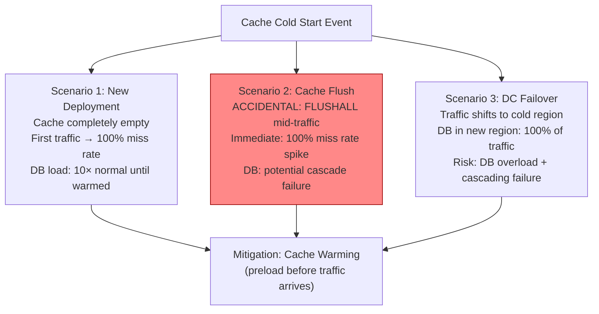
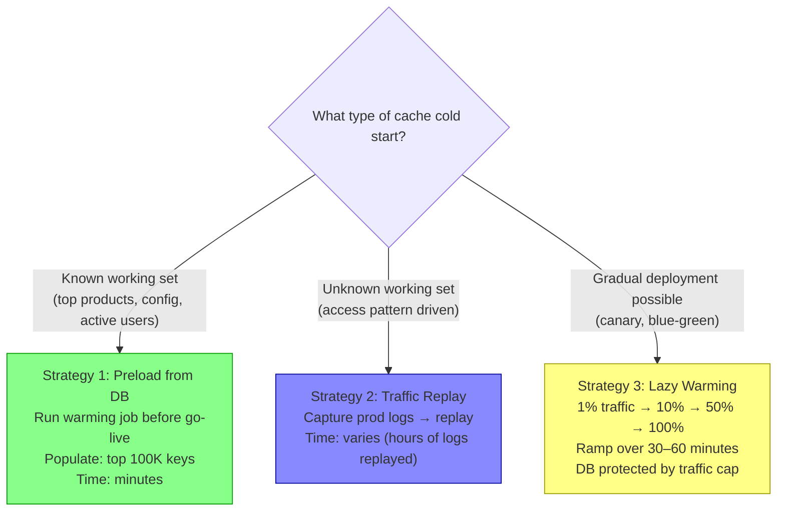
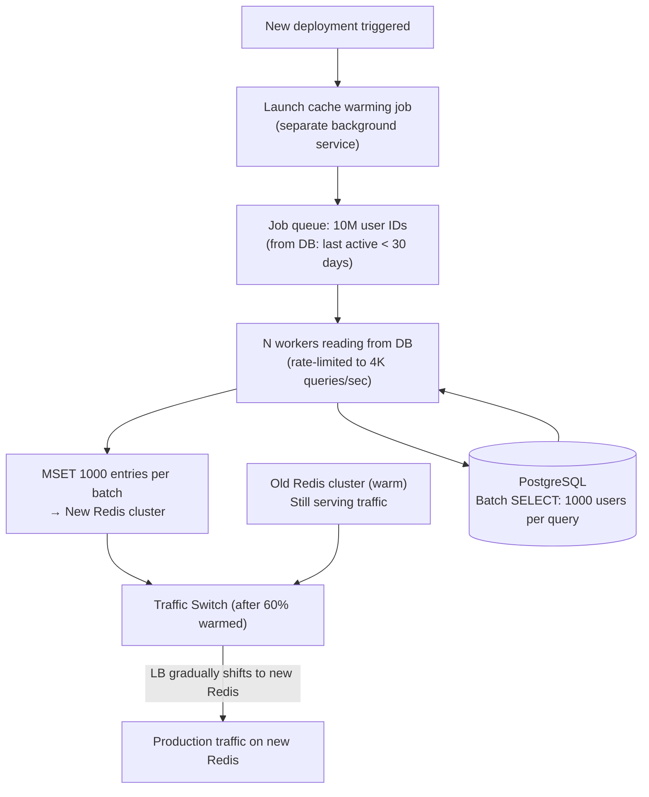
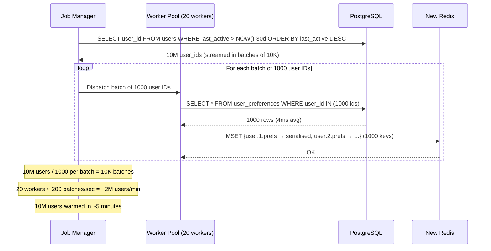
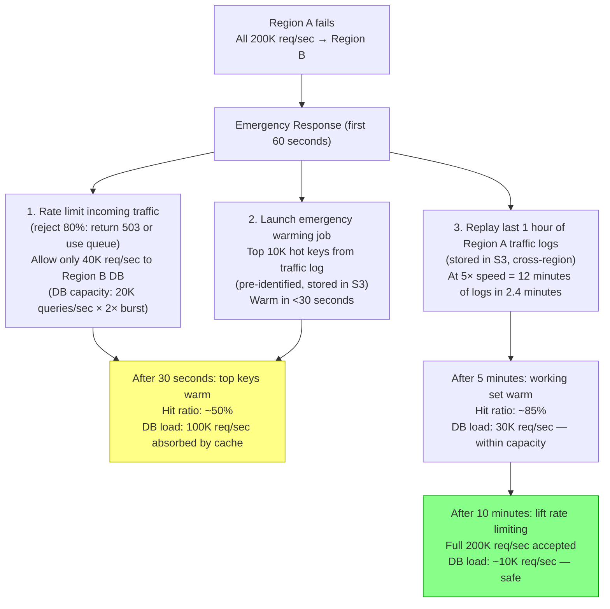
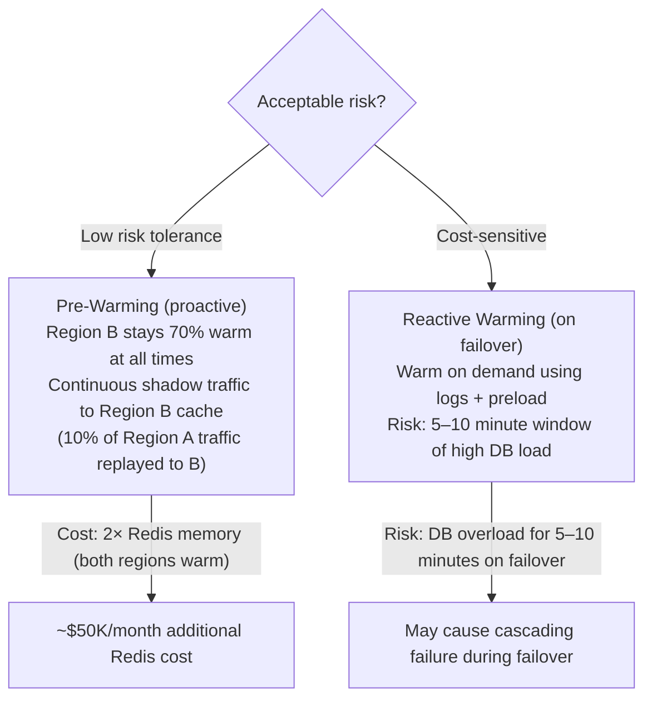
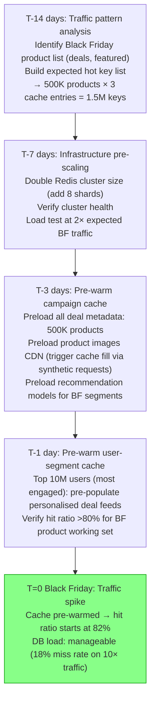
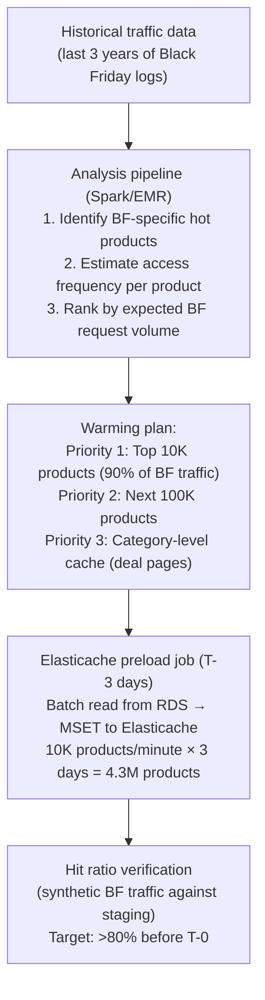

# Cache Warming Strategies

5 questions covering cache warming from cold start fundamentals to Amazon's predictive pre-warming for Black Friday.

---

## Q1: What is the cold start problem in caching?

**Role:** Mid | **Difficulty:** 🟡 | **Priority:** P0 | **Format:** Quick Answer

> **What the interviewer is testing:** Whether you can identify the three cold-start scenarios and articulate their impact in terms of latency and database load.

### Answer in 60 seconds
- **Definition:** A cold start is any scenario where a cache is empty (cold) and must be populated through actual user requests, during which every request is a cache miss — database is hit at full traffic rate until the cache warms.
- **Scenario 1 — New deployment:** First deployment of a service. Cache is completely empty. All traffic hits the DB for the first N minutes until the working set is cached. At 10K req/sec and 95% eventual hit ratio, the DB absorbs 10K req/sec instead of 500 — 20× overload risk.
- **Scenario 2 — Cache flush:** Accidental or intentional `FLUSHALL` on Redis. Identical to new deployment but potentially mid-traffic. Most dangerous scenario — can occur while traffic is at peak.
- **Scenario 3 — Data center failover:** Traffic shifted from Region A to Region B during an outage. Region B's cache is cold (it had different working set or was unused). DB in Region B now absorbs 100% of redirected traffic.
- **Time to warm:** Depends on traffic rate and working set size. A cache serving 10K req/sec for 1M unique keys with power-law distribution (80/20) will have 80% hit ratio within the first 10–20 minutes as the hot 200K keys are populated by natural traffic.
- **Impact:** Every 1-second delay in warming = 1M extra DB queries (at 1M req/sec traffic). At 10ms per DB query, the DB connection pool (typically 200 connections) saturates within milliseconds.

### Diagram

### Pitfalls
- ❌ **Assuming warm-up happens fast enough:** Traffic-driven warming takes 10–30 minutes for the working set to populate. During that window, production DB is under extreme stress. Do not rely on natural warming for time-sensitive deployments.
- ❌ **Ignoring cache flush protection:** Restrict `FLUSHALL` and `FLUSHDB` commands using Redis ACL: `COMMAND: DENY FLUSHALL`. Production Redis should not allow this command from application accounts.
- ❌ **Confusing cold start with cache stampede:** Cold start is about an empty cache across all keys. Cache stampede is about simultaneous misses for a single popular key on TTL expiry. Both cause DB overload but have different mitigations.

### Concept Reference
→ [Caching Strategies](../../../01-databases/concepts/write-ahead-log)

---

## Q2: What are the 3 main cache warming strategies?

**Role:** Mid | **Difficulty:** 🟡 | **Priority:** P0 | **Format:** Quick Answer

> **What the interviewer is testing:** Whether you know the three approaches to cache warming and can select the appropriate one based on data size, deployment timeline, and traffic pattern.

### Answer in 60 seconds
- **Strategy 1 — Preload from DB:** Before accepting production traffic, a warming job reads the expected hot working set from the database and populates the cache. Best for: known working set (top 10K products, configuration data, user profiles for active users). Limitation: requires knowing what to preload — doesn't work for purely access-pattern-driven caches.
- **Strategy 2 — Replay traffic logs:** Capture production request logs and replay them against the new cache instance. The cache populates based on actual real production access patterns. Best for: unknown working set — let the access logs define what's hot. Requires a traffic replay infrastructure (e.g., GoReplay, Shadowtraffic). Limitation: takes time proportional to log replay speed; logs may be hours old.
- **Strategy 3 — Lazy warming (natural fill):** Accept that the cache will be cold initially. Rate-limit traffic to the new deployment (e.g., send 1% of traffic first, ramp up over 30 minutes). DB absorbs the initial cold traffic at 1% of full load. Cache fills naturally. Gradually increase traffic as hit ratio rises. Best for: deployments where a gradual ramp-up is possible (canary deployments). Limitation: requires traffic routing control; not usable for sudden failover.

### Diagram

### Pitfalls
- ❌ **Preloading without access frequency data:** Loading 10M products into cache when only 10K are ever accessed wastes Redis memory and adds hours to warming time. Use query log analysis to identify the actual working set before preloading.
- ❌ **Traffic replay without rate limiting:** Replaying 24 hours of production logs at 100× speed overwhelms both the cache and the DB during warming. Rate-limit replay to 2–3× production request rate.
- ❌ **Lazy warming for sudden failovers:** A datacenter failover cannot be canary'd — traffic shifts instantly. Lazy warming is only suitable for planned deployments with traffic control.

### Concept Reference
→ [Caching Strategies](../../../01-databases/concepts/write-ahead-log)

---

## Q3: How do you warm a Redis cache for 10M users during a zero-downtime deployment?

**Role:** Senior | **Difficulty:** 🔴 | **Priority:** P1 | **Format:** Deep Dive

> **What the interviewer is testing:** Whether you can design a concrete warming strategy that respects Redis throughput limits, DB connection limits, and zero-downtime deployment constraints simultaneously.

### Problem Constraints
| Dimension | Value |
|-----------|-------|
| Users to warm | 10M active users |
| Cache data per user | User session + preferences = 2KB average |
| Total cache data | 10M × 2KB = 20GB |
| Deployment type | Blue-green (new Redis instance, zero downtime) |
| DB capacity | 5K queries/sec before saturation |
| Redis write throughput | 100K ops/sec |

### Warming Architecture — Background Preload Job

### Warming Job Design

### Calculation

| Parameter | Value |
|-----------|-------|
| Users to warm | 10M |
| Batch size | 1,000 users |
| DB query rate | 20 workers × 5 queries/sec = 100 queries/sec |
| DB rows/sec | 100 × 1,000 = 100K rows/sec |
| Redis writes/sec | 100K MSET entries/sec |
| Estimated warming time | 10M / 100K = ~100 seconds (under 2 minutes) |
| DB load during warming | 100 queries/sec = 2% of 5K capacity |

### What a great answer includes
- [ ] Batch reads from DB (1,000 users per query) to avoid N+1 during warming
- [ ] Rate-limit DB read rate to a fraction of DB capacity (e.g., 20% = 1K queries/sec)
- [ ] Priority ordering: warm most-recently-active users first (they're most likely to hit the cache)
- [ ] Traffic switch after partial warm (60–80%): don't wait for 100% — long tail of inactive users not worth the wait
- [ ] Monitor hit ratio on new Redis during warming; switch traffic when hit ratio exceeds 70%

### Pitfalls
- ❌ **Warming all 10M users before switching:** The last 2M inactive users add 2 minutes of warming but provide near-zero hit ratio improvement. Switch traffic when hit ratio reaches 70–80%.
- ❌ **Unbounded worker count:** 1,000 workers each making DB queries can saturate the DB with 5K concurrent connections. Cap workers at a number that keeps DB load under 50%.
- ❌ **Not using Redis pipelining/MSET during warming:** Individual SET commands at 1 per round trip = 100K network round trips for 100K keys. MSET batches 1,000 keys per round trip — 1,000× fewer Redis connections required.

### Concept Reference
→ [Caching Strategies](../../../01-databases/concepts/write-ahead-log)

---

## Q4: How do you warm the cache for a data center failover?

**Role:** Senior | **Difficulty:** 🔴 | **Priority:** P1 | **Format:** Deep Dive

> **What the interviewer is testing:** Whether you can design a warming strategy for the most time-critical cold-start scenario — unexpected failover where warming must happen faster than traffic arrives.

### Problem Constraints
| Dimension | Value |
|-----------|-------|
| Failover scenario | Region A unavailable — all traffic shifted to Region B |
| Region B cache state | Cold (served only 5% of traffic before) |
| Traffic volume | 200K req/sec redirected instantly |
| DB in Region B | Can handle 20K queries/sec (10% of traffic) |
| Goal | Warm cache fast enough to prevent DB overload |

### Approach — Prioritised Preload with Traffic Shaping

### Pre-Warming vs Reactive Warming

### What a great answer includes
- [ ] Rate limit traffic immediately on failover to protect DB from cold-cache flood
- [ ] Pre-identified hot key list stored durably (S3) for emergency preload in <30 seconds
- [ ] Traffic log replay as the systematic warming strategy
- [ ] Proactive shadow warming as the highest-reliability approach (trade cost for reliability)
- [ ] Quantify DB load at each warming stage and the timeline to safe operation

### Pitfalls
- ❌ **Accepting full traffic on a cold cache:** 200K req/sec with 0% hit ratio = 200K DB queries/sec against a DB with 20K capacity — immediate cascade failure. Always rate-limit during cold cache periods.
- ❌ **No pre-identified hot key list:** Relying entirely on traffic replay means the first 30–60 seconds of failover have no fast preload path. Store the top 10K cache keys as a snapshot in S3, updated every 5 minutes.
- ❌ **Not testing failover cache warming:** Failover warming is a complex multi-step procedure. It must be tested quarterly under realistic load (Game Day / Chaos Engineering) — untested procedures fail when they matter most.

### Concept Reference
→ [Caching Strategies](../../../01-databases/concepts/write-ahead-log)

---

## Q5: How does Amazon pre-warm Elasticache before Black Friday?

**Role:** Staff | **Difficulty:** ⚫ | **Priority:** P2 | **Format:** Deep Dive

> **What the interviewer is testing:** Whether you understand predictive pre-scaling and pre-warming as operational disciplines for known high-traffic events — a Staff-level concern that combines infrastructure, data engineering, and operational planning.

### Problem Constraints
| Dimension | Value |
|-----------|-------|
| Event | Black Friday (known date, known traffic pattern) |
| Expected traffic | 10× normal peak |
| Pre-warning lead time | 2 weeks |
| Cache infrastructure | Elasticache Redis cluster (auto-scaling disabled during event) |
| Working set change | Black Friday working set ≠ normal working set (different products) |

### Pre-Event Warming Timeline

### Predictive Warming via Historical Data

| Phase | Action | Expected Hit Ratio | Risk Mitigated |
|-------|--------|-------------------|----------------|
| T-14 | Traffic analysis + cluster scaling | N/A | Infrastructure SPOF |
| T-7 | Load testing at 2× traffic | N/A | Capacity gaps |
| T-3 | Preload deal product cache | 50% (BF products) | Cold start on deals |
| T-1 | Preload user-segment feeds | 80% | Personalisation miss |
| T=0 | Black Friday live | 82% baseline | DB overload |
| T+2h | Natural warming complete | 95% | — |

### Recommended Answer
Black Friday is the canonical example of a predictive scaling + warming strategy because the traffic spike is known days in advance with reasonable predictability.

**Infrastructure:** 2 weeks before, add capacity to Elasticache cluster. Disable auto-scaling during the event — scale-out during peak traffic causes cluster resharding, which can briefly disrupt read traffic. Pre-scale to handle 10–12× normal traffic with headroom.

**Working set identification:** Use Spark/EMR jobs on 3 years of Black Friday traffic logs to identify BF-specific hot products. Black Friday's working set differs dramatically from normal operation — deal products, category pages, and featured items replace the standard popular products. This analysis cannot be skipped.

**Preload execution:** Starting T-3 days, run a rate-limited preload job: batch read product metadata from RDS in groups of 1,000, MSET to Elasticache. Rate limit to 20% of DB capacity to avoid impacting pre-BF production traffic. For CDN: send synthetic HEAD requests to pre-fill CDN edge caches for deal product images.

**Verification:** At T-1 day, run synthetic Black Friday traffic patterns (from last year's logs) and verify hit ratio exceeds 80% on the expected hot key set. If below 70%, run emergency preload for the missing keys.

**Result:** Black Friday traffic begins with 80%+ cache hit ratio rather than 0%, protecting the database from the cold-start overload that would otherwise occur at 10× normal traffic.

### What a great answer includes
- [ ] Predictive capacity scaling 2 weeks before (not auto-scaling on day-of)
- [ ] BF-specific working set analysis: BF hot keys differ from normal hot keys
- [ ] T-3 days preload: rate-limited batch read from DB → Elasticache
- [ ] CDN warming for product images (synthetic HEAD requests)
- [ ] Hit ratio verification at T-1 against synthetic BF traffic

### Pitfalls
- ❌ **Relying on auto-scaling during the event:** Elasticache scale-out requires data resharding — a 30–60 second disruption per shard. During peak Black Friday traffic, this causes a thundering herd on the DB. Pre-scale before the event.
- ❌ **Using normal-traffic working set for BF warming:** The top 10K products on a normal Tuesday are not the top 10K on Black Friday. Warming the wrong working set provides no hit ratio benefit for BF traffic.
- ❌ **No hit ratio verification before go-live:** Preloading 4.3M products and assuming it worked correctly without verification is a mistake. Measure the actual hit ratio against simulated BF traffic the day before — you have time to fix gaps.

### Concept Reference
→ [Caching Strategies](../../../01-databases/concepts/write-ahead-log)
