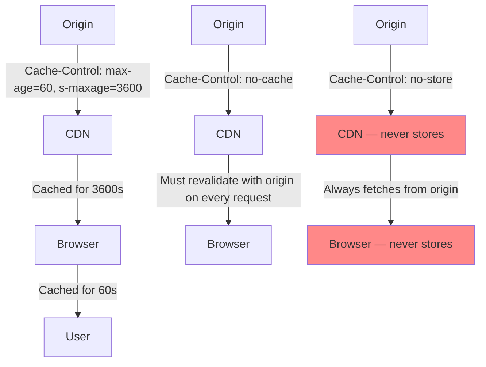
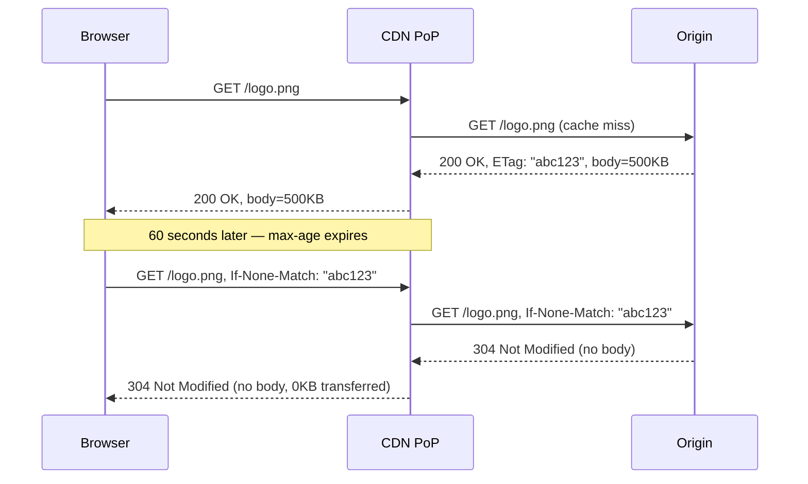
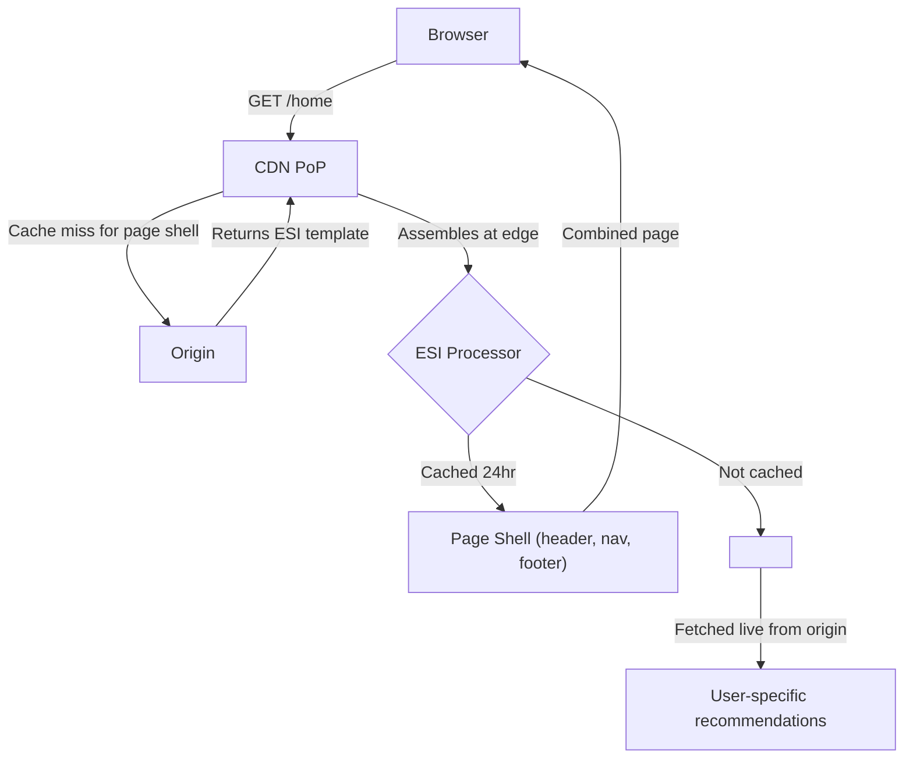
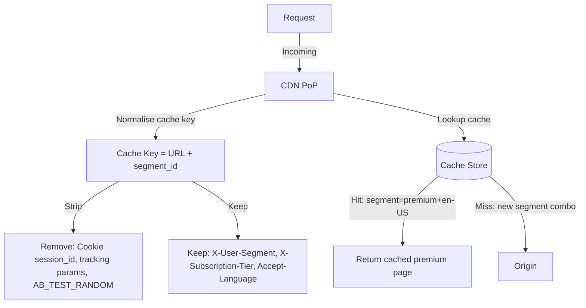
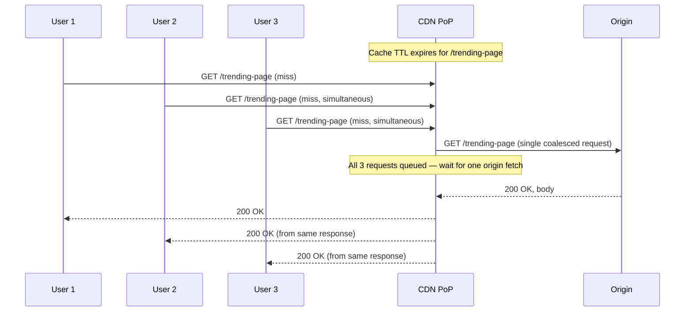
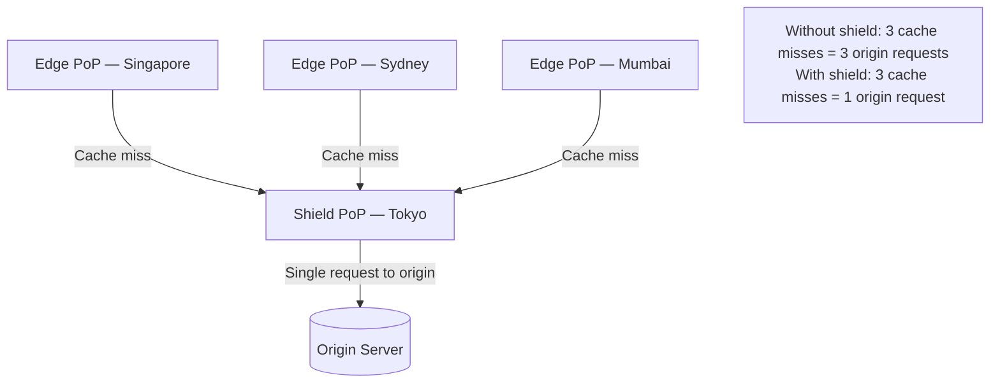
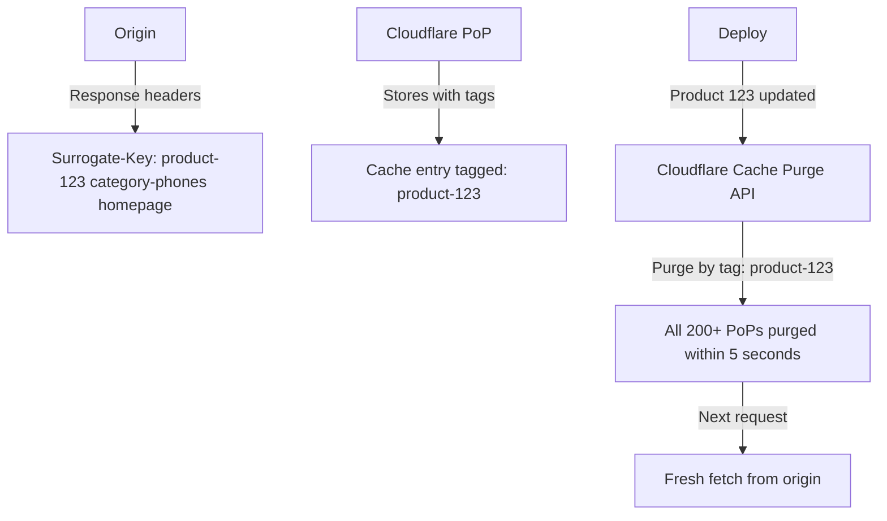
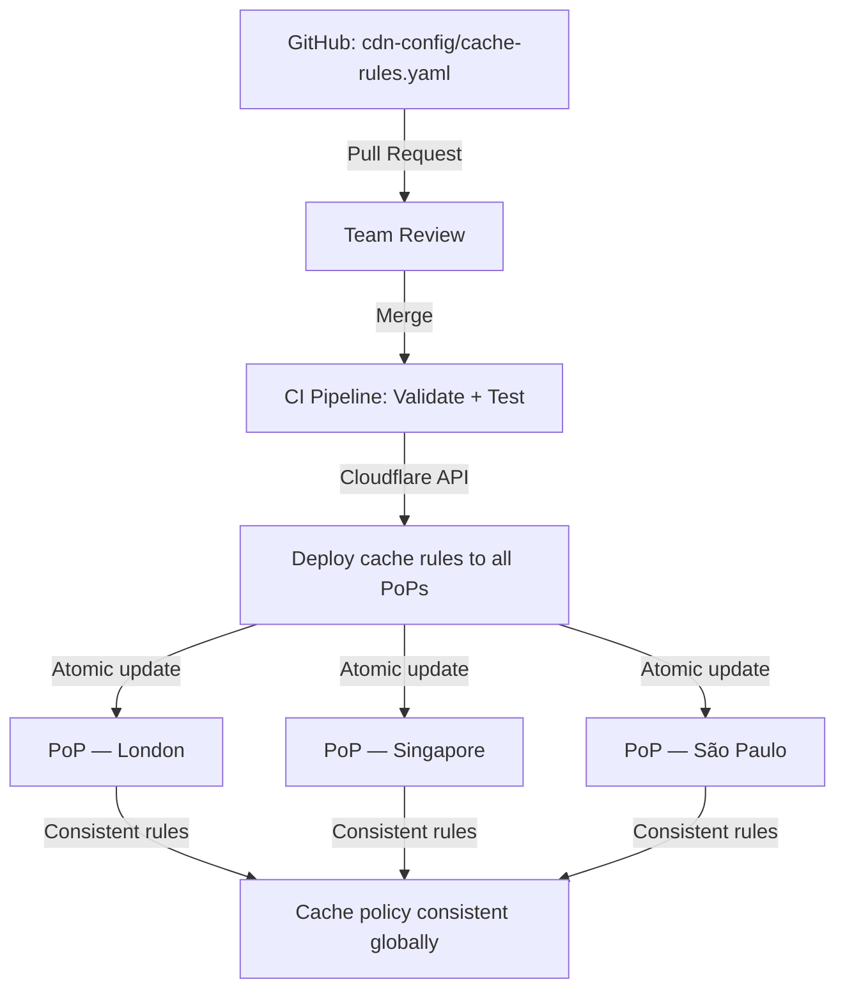

# CDN Caching Strategies

5 questions covering CDN caching from HTTP headers to Staff-level multi-PoP consistency.

---

## Q1: What do Cache-Control headers do — max-age, s-maxage, no-cache, no-store?

**Role:** Junior, Mid | **Difficulty:** 🟢 | **Priority:** P0 | **Format:** Quick Answer

> **What the interviewer is testing:** Whether you understand the HTTP caching contract between browsers, CDNs, and origin servers.

### Answer in 60 seconds
- **`max-age=N`:** Cache the response for N seconds in both browser and CDN. After expiry, browser must revalidate with origin.
- **`s-maxage=N`:** Overrides `max-age` for shared caches (CDN/proxy) only. Browser still uses `max-age`. Typical pattern: `Cache-Control: max-age=60, s-maxage=3600` — browser revalidates in 60s, CDN holds for 1 hour.
- **`no-cache`:** Do NOT serve from cache without revalidating with origin first. The response *is* stored, but must always be validated via a conditional request (ETag or `If-Modified-Since`). Effectively 0 TTL but with 304 optimisation.
- **`no-store`:** Never store the response anywhere — not in CDN, not in browser. Used for sensitive data (bank statements, auth tokens). No 304 optimisation possible.
- **`public`:** Allows any shared cache (CDN) to store the response even if request had an `Authorization` header.
- **`private`:** Only the user's browser may cache — CDN must not store. Required for personalised responses.

### Diagram

### Pitfalls
- ❌ **Confusing `no-cache` with `no-store`:** `no-cache` allows storing but requires revalidation — it is NOT the same as "don't cache." `no-store` is the true "don't cache."
- ❌ **Omitting `s-maxage`:** Without it, CDNs inherit `max-age` which may be too short. A 60-second `max-age` intended for browsers will also flush CDN every 60 seconds — killing your cache hit ratio.
- ❌ **`private` on public assets:** CSS/JS/images marked `private` bypass CDN entirely, adding 80–200ms of origin latency to every request.

### Concept Reference
→ [Caching Strategies](../../../01-databases/concepts/write-ahead-log)

---

## Q2: How do ETags and Last-Modified enable 304 Not Modified conditional requests?

**Role:** Mid | **Difficulty:** 🟡 | **Priority:** P0 | **Format:** Quick Answer

> **What the interviewer is testing:** Whether you understand HTTP conditional caching mechanics and how they reduce bandwidth without sacrificing freshness.

### Answer in 60 seconds
- **The problem:** After `max-age` expires, the client must revalidate — but if the content hasn't changed, re-sending the full body wastes bandwidth. A 500KB image transferred again is 500KB wasted.
- **ETag mechanism:** Origin sends `ETag: "abc123"` (a content hash or version ID) with the response. On revalidation, client sends `If-None-Match: "abc123"`. If content unchanged, origin returns `304 Not Modified` (no body, just headers). Saves 100% of body bandwidth.
- **Last-Modified mechanism:** Origin sends `Last-Modified: Thu, 01 Jan 2026 00:00:00 GMT`. Client sends `If-Modified-Since: Thu, 01 Jan 2026 00:00:00 GMT`. Server compares timestamps and returns 304 if unchanged.
- **ETag vs Last-Modified:** ETags are preferred — `Last-Modified` has 1-second resolution and can produce false positives when files are regenerated with identical content. ETags use content hashing (MD5, SHA1).
- **CDN behaviour:** CDNs also use ETags when revalidating their own cache with origin. The chain is: browser → CDN → origin, with each tier using conditional requests.
- **Performance numbers:** A 304 response is typically 200–500 bytes vs 10–500KB for a full response. At 10M requests/day, this can save 10TB+ of egress per day.

### Diagram

### Pitfalls
- ❌ **Strong vs weak ETags:** Weak ETags (`W/"abc123"`) indicate semantic equivalence, not byte-for-byte identity. Range requests require strong ETags — mixing them causes range request failures.
- ❌ **Load balancer ETag mismatch:** If 5 app servers generate ETags independently (e.g., based on PID + timestamp), each server produces a different ETag for identical content — conditional requests always get 200, never 304. Use content-hash-based ETags.
- ❌ **Disabling ETags "for performance":** Some guides recommend removing ETags under the assumption that they're overhead — wrong. The 304 mechanism saves far more bandwidth than the small ETag header costs.

### Concept Reference
→ [Caching Strategies](../../../01-databases/concepts/write-ahead-log)

---

## Q3: How do you maximise CDN cache hit ratio for dynamic or personalised content?

**Role:** Senior | **Difficulty:** 🔴 | **Priority:** P1 | **Format:** Deep Dive

> **What the interviewer is testing:** Whether you can design a caching architecture that achieves high hit ratios even when content varies by user, A/B test bucket, or real-time data.

### Problem Constraints
| Dimension | Value |
|-----------|-------|
| Traffic | 500K req/sec globally across 15 PoPs |
| Personalisation | 50 user segments (geography, subscription tier, A/B bucket) |
| Freshness requirement | Product prices updated within 30 seconds |
| Target hit ratio | >90% CDN cache hit (current: 45%) |

### Approach A — Edge-Side Includes (ESI)

| Dimension | Without ESI | With ESI |
|-----------|------------|---------|
| Hit ratio | 45% | 85–92% |
| Origin load | 500K req/sec | 45K req/sec |
| Page assembly latency | 0ms (or full miss) | +5ms edge assembly |
| Personalisation support | Poor | Strong |

### Approach B — Vary Header + Cache Key Normalisation

### Recommended Answer
The key insight: personalisation reduces hit ratio because each unique user creates a unique cache key. Recover hit ratio by **decomposing pages into cacheable and non-cacheable fragments**.

**Strategy 1 — Segment-level caching:** Instead of per-user cache keys, reduce to N user segments (e.g., `free|premium|enterprise` × `geo_region` = 3 × 5 = 15 combinations). Cache one page per segment. Hit ratio: 45% → 85%.

**Strategy 2 — Edge-Side Includes (ESI):** Cache the page shell (header, footer, nav, product grid layout) at CDN for 24 hours. Fetch only the personalised block (recommendations, user name) live from origin. Akamai and Varnish support ESI natively. Fastly has its own VCL-based equivalent.

**Strategy 3 — Cache key normalisation:** Strip irrelevant request parameters (UTM tags, session tokens, A/B randomisation cookies) from the cache key. A URL with `?utm_source=email&ref=newsletter` and the same URL without should hit the same cache entry.

**Strategy 4 — Stale-while-revalidate:** `Cache-Control: max-age=10, stale-while-revalidate=30` — serve stale for up to 30 seconds while asynchronously refreshing. Keeps hit ratio high during rapid content change.

Target: achieve >90% CDN hit ratio, reducing origin load from 500K to <50K req/sec.

### What a great answer includes
- [ ] Segment-level caching instead of per-user keys
- [ ] ESI or page fragment decomposition strategy
- [ ] Cache key normalisation (strip irrelevant parameters)
- [ ] `stale-while-revalidate` for content freshness without cache flushes
- [ ] Quantify hit ratio improvement and resulting origin load reduction

### Pitfalls
- ❌ **Per-user cache keys:** 1M users = 1M distinct cache entries, each hit once — effective hit ratio near 0%.
- ❌ **Using cookies in cache keys without normalisation:** Session cookies change every login; any cookie in the cache key creates unique keys per session.
- ❌ **Over-segmenting:** 50 segments × 50 geo-regions × 10 device types = 25,000 combinations — most never populated. Start with 3–5 segments maximum.

### Concept Reference
→ [Caching Strategies](../../../01-databases/concepts/write-ahead-log)

---

## Q4: What is a cache stampede at the CDN PoP level and how do you prevent it?

**Role:** Senior | **Difficulty:** 🔴 | **Priority:** P1 | **Format:** Deep Dive

> **What the interviewer is testing:** Whether you understand that thundering herd problems occur at CDN PoPs, not just application servers, and whether you know CDN-native mitigation techniques.

### Problem Constraints
| Dimension | Value |
|-----------|-------|
| CDN PoP throughput | 50K req/sec per PoP |
| Cache TTL | 60 seconds |
| Stampede window | First 200ms after cache expiry |
| Origin capacity | 2K req/sec (easily overloaded) |

### Approach A — Request Collapsing (Shield / Request Coalescing)

### Approach B — CDN Shield (Origin Shield / Tiered Caching)

| Dimension | No Shield | With Shield |
|-----------|-----------|-------------|
| Origin requests on global cache expiry | 200 (all PoPs) | 1 (shield only) |
| Additional latency | 0ms | +20–40ms (shield → origin) |
| Origin load reduction | — | 99.5% |
| Cost | Lower CDN bill | Small shield egress fee |

### Recommended Answer
Cache stampede at CDN level is more severe than at application level because a single PoP may collapse 50K simultaneous requests into one cache miss — but across 200 PoPs globally, a single TTL expiry can trigger 200 simultaneous origin requests.

**Mitigation 1 — Request coalescing (collapse):** CDN-native feature (Fastly, Cloudflare). When the cache is cold, only one request goes to origin; all others wait and receive the same response. Implemented in Fastly VCL as `return(pass)` with a mutex.

**Mitigation 2 — Origin Shield / Tiered caching:** Configure a single "shield" PoP per region that all edge PoPs route cache misses through. Shield hits origin at most once per object. Cloudflare calls this "Argo Tiered Caching"; Fastly calls it "Shielding." Reduces origin requests by 95–99%.

**Mitigation 3 — Staggered TTL with jitter:** Set cache TTL with per-PoP jitter so not all PoPs expire simultaneously. Fastly supports TTL variation via surrogate keys.

**Mitigation 4 — Serve stale on miss:** `Cache-Control: stale-while-revalidate=300` — serve the previous cached copy for up to 5 minutes while the CDN asynchronously fetches fresh content from origin. Zero-latency cache miss handling.

### What a great answer includes
- [ ] Explain stampede at CDN scale (200 PoPs × simultaneous expiry = 200 origin requests)
- [ ] Request coalescing as the first-line CDN-native defence
- [ ] Origin Shield as the architectural solution for multi-PoP deployments
- [ ] `stale-while-revalidate` as a user-facing latency fix
- [ ] Quantify: shield reduces origin requests from 200 to 1 on global cache expiry

### Pitfalls
- ❌ **Assuming CDN handles this automatically:** Request coalescing and shielding are opt-in features — they must be explicitly configured. Default CDN configuration does NOT coalesce.
- ❌ **Setting TTL=0 to avoid stampede:** TTL=0 means every request is a cache miss — origin load = 100% of CDN traffic. This defeats the purpose of a CDN.
- ❌ **Ignoring stale content risk with `stale-while-revalidate`:** If origin is down, the CDN will keep serving stale indefinitely unless you also set `stale-if-error=N`.

### Concept Reference
→ [Caching Strategies](../../../01-databases/concepts/write-ahead-log)

---

## Q5: How would you design consistent cache policies across 200+ Cloudflare PoPs?

**Role:** Staff | **Difficulty:** ⚫ | **Priority:** P2 | **Format:** Deep Dive

> **What the interviewer is testing:** Whether you understand the operational challenges of managing cache policy at global CDN scale — including cache purging, surrogate keys, and configuration drift across hundreds of PoPs.

### Problem Constraints
| Dimension | Value |
|-----------|-------|
| CDN | Cloudflare (200+ PoPs globally) |
| Content types | Static assets, API responses, HTML pages, media |
| Deployment frequency | 50 deployments/day |
| Cache purge SLA | New content visible globally within 5 seconds |
| Teams using CDN | 20 teams, each managing their own cache rules |

### Approach A — Surrogate Keys (Cache Tags)

### Approach B — Cache Rules as Code (GitOps)

| Dimension | Manual PoP Config | GitOps + Terraform |
|-----------|------------------|-------------------|
| Configuration drift risk | High (20 teams, ad-hoc changes) | Low (version-controlled) |
| Purge time | Varies by method | <5 seconds via Surrogate Keys |
| Rollback capability | Manual | Git revert + redeploy |
| Audit trail | None | Full Git history |

### Recommended Answer
At 200+ PoPs and 50 deployments/day, cache consistency is an operational discipline problem as much as a technical one.

**Policy layer — GitOps for cache rules:** Store all `Cache-Control` headers, cache bypass rules, and TTL overrides in a version-controlled YAML file deployed via Terraform + Cloudflare API. All 20 teams submit PRs to a central `cdn-config` repo. This prevents "works on my PoP" inconsistencies.

**Purge layer — Surrogate Keys (Cache Tags):** Tag every cacheable response at the origin with `Surrogate-Key` headers (e.g., `product-123`, `user-segment-premium`). On content update, purge by tag via Cloudflare API — all PoPs purge the tagged entries atomically within 5 seconds. Avoids URL-by-URL purge which is slow and error-prone for large sites.

**Deployment layer — Cache versioning:** For major deployments, use asset fingerprinting (`/app.abc123.js`) so new assets get new URLs — no purge needed. Cache old fingerprinted assets for 1 year (`max-age=31536000, immutable`).

**Observability:** Monitor cache hit ratio per PoP via Cloudflare Analytics. Alert when any PoP drops below 80% hit ratio for >5 minutes — indicates purge storm, misconfigured rules, or origin health issue.

### What a great answer includes
- [ ] GitOps approach to prevent configuration drift across 20 teams
- [ ] Surrogate keys for atomic multi-PoP cache purge in <5 seconds
- [ ] Asset fingerprinting to eliminate purge entirely for static assets
- [ ] Hit ratio monitoring per PoP with alerting threshold
- [ ] Separation of static asset policy (immutable, long TTL) vs dynamic content (short TTL + surrogate keys)

### Pitfalls
- ❌ **URL-by-URL cache purge:** A site with 10M URLs cannot purge page-by-page on every deployment — use surrogate keys or asset versioning instead.
- ❌ **Giving each team independent CDN access:** Without centralised policy, one team's misconfigured `no-store` rule can bypass CDN for all traffic — costing 100x the origin load.
- ❌ **Not monitoring per-PoP hit ratio:** A Cloudflare rules misconfiguration may affect only the Frankfurt PoP — without per-PoP metrics, it goes undetected until EMEA latency alerts fire.

### Concept Reference
→ [Caching Strategies](../../../01-databases/concepts/write-ahead-log)
