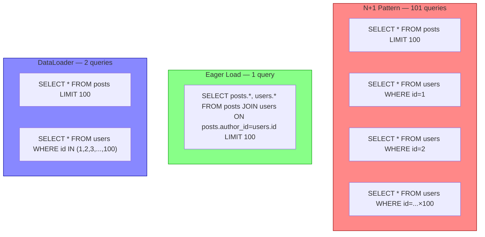
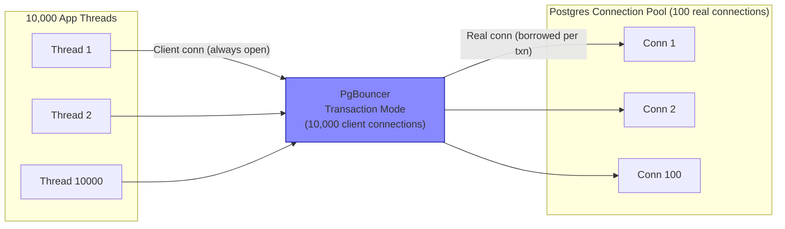
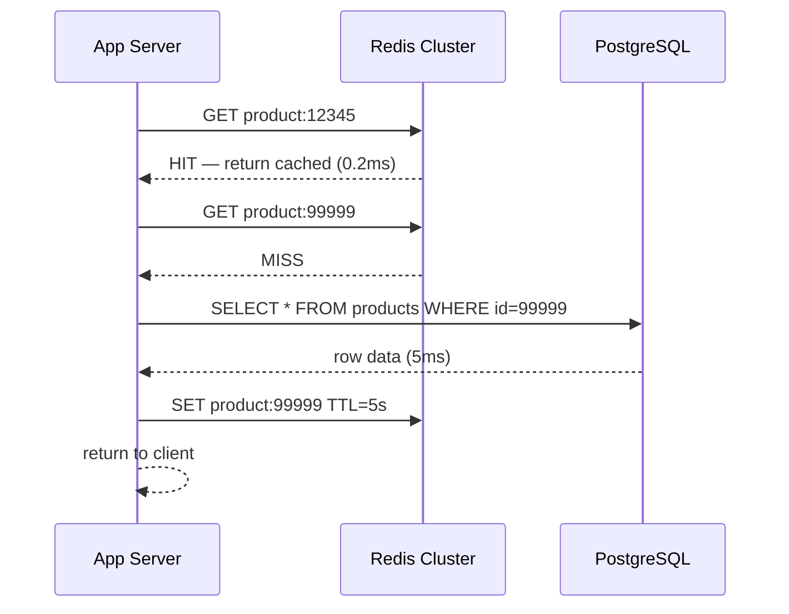
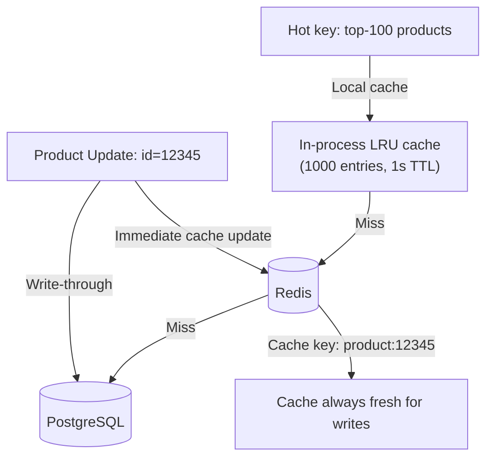
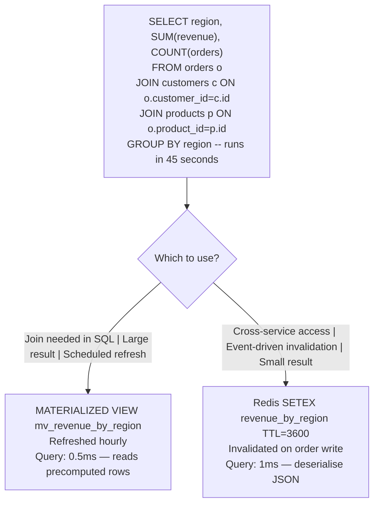
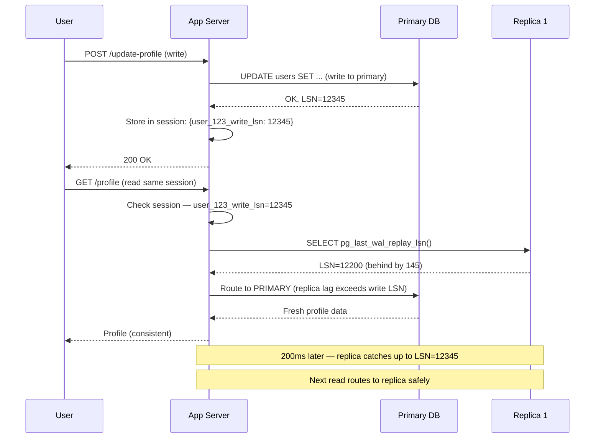

# Database Query Caching

5 questions covering database query caching from N+1 detection to Staff-level read replica architectures.

---

## Q1: What is the N+1 query problem and how do you fix it?

**Role:** Junior, Mid | **Difficulty:** 🟢 | **Priority:** P0 | **Format:** Quick Answer

> **What the interviewer is testing:** Whether you understand the most common ORM performance trap and can articulate the fix clearly.

### Answer in 60 seconds
- **The problem:** Load N parent records with 1 query, then issue 1 additional query *per record* to fetch its children = 1 + N queries. At N=1000, this is 1001 database round trips.
- **Example:** Fetch 100 blog posts, then for each post fetch its author (100 separate `SELECT * FROM users WHERE id=?`). Result: 101 queries, ~100ms extra latency at 1ms per query.
- **Fix 1 — Eager loading (JOIN):** `SELECT posts.*, users.* FROM posts JOIN users ON posts.author_id = users.id` — 1 query fetches everything. 100x fewer round trips.
- **Fix 2 — Batched loading (DataLoader):** For GraphQL and complex object graphs, DataLoader batches all individual `WHERE id=?` calls into a single `WHERE id IN (1,2,3,...,100)`. Works across resolver boundaries without restructuring queries.
- **Fix 3 — ORM includes:** Most ORMs support eager loading: `Post.includes(:author)` (Rails), `Post.query().eager('author')` (Objection.js), `findAll({ include: [User] })` (Sequelize).
- **Detection:** Query log analysis — any query pattern repeated N times with different ID values is an N+1. Tools: Bullet gem (Rails), `EXPLAIN ANALYZE` for individual queries.

### Diagram

### Pitfalls
- ❌ **Caching individual N+1 queries:** Caching 100 individual `SELECT * FROM users WHERE id=?` queries is not a fix — it's papering over the problem. Each still requires a cache lookup. Fix the query, then optionally cache the result.
- ❌ **Over-eager loading:** Loading all relationships eagerly when they are only used in 10% of requests wastes memory and DB CPU. Profile first — eager load only what is consistently needed.
- ❌ **N+1 in GraphQL:** GraphQL's per-field resolver pattern makes N+1 the default, not the exception. DataLoader is mandatory for any GraphQL API with relational data.

### Concept Reference
→ [Database Performance Patterns](../../../01-databases/concepts/write-ahead-log)

---

## Q2: How does connection pooling work — PgBouncer transaction mode vs session mode?

**Role:** Mid | **Difficulty:** 🟡 | **Priority:** P0 | **Format:** Quick Answer

> **What the interviewer is testing:** Whether you understand why raw database connections are expensive and how poolers like PgBouncer dramatically increase database throughput.

### Answer in 60 seconds
- **Problem:** PostgreSQL creates a new OS process per connection. At 10K concurrent app threads, 10K Postgres processes consume ~10GB RAM and degrade query throughput due to context switching. Max practical connections: 200–500.
- **PgBouncer role:** Sits between app and Postgres. App maintains 10K connections to PgBouncer; PgBouncer multiplexes them onto 50–200 real Postgres connections.
- **Session mode:** One real Postgres connection is assigned to one client for the entire session. Connection reused only when client disconnects. Good for: long-lived sessions using `SET`, temp tables, prepared statements. Effective multiplexing: low (1:1 during session lifetime).
- **Transaction mode:** One real Postgres connection is borrowed only for the duration of a single transaction (BEGIN → COMMIT). Returned to pool immediately after. Effective multiplexing: high (1 connection serves 100s of clients/sec). **Restrictions:** Cannot use session-level features (temp tables, advisory locks, `SET` without `RESET`).
- **Statement mode:** Each SQL statement gets a connection. Fastest multiplex ratio but cannot use transactions — unusable for most apps.
- **Typical config:** 10K app connections → PgBouncer (transaction mode) → 100 Postgres connections. Throughput: 50K–100K queries/sec.

### Diagram

### Pitfalls
- ❌ **Using session mode when transaction mode suffices:** Session mode provides near-zero multiplexing benefit. A 10K-app-connection pool with session mode still needs 10K Postgres connections.
- ❌ **Prepared statements with transaction mode:** Postgres prepared statements are session-scoped. In transaction mode, the same client may get a different server connection each transaction — prepared statements disappear. Disable `prepared_statements` in ORM config when using PgBouncer transaction mode.
- ❌ **Forgetting PgBouncer is a SPOF:** A single PgBouncer process handles all DB connections. Run at least 2 PgBouncer instances with a TCP load balancer (HAProxy, or use pgbouncer's own multi-process mode).

### Concept Reference
→ [Database Performance Patterns](../../../01-databases/concepts/write-ahead-log)

---

## Q3: How do you design a query result caching strategy for 1M req/sec?

**Role:** Senior | **Difficulty:** 🔴 | **Priority:** P1 | **Format:** Deep Dive

> **What the interviewer is testing:** Whether you can design a coherent caching layer that handles cache invalidation, TTL, and hot key problems at high traffic volume.

### Problem Constraints
| Dimension | Value |
|-----------|-------|
| Traffic | 1M req/sec (reads) / 10K writes/sec |
| DB capacity | 50K queries/sec (PostgreSQL cluster) |
| Cache layer | Redis cluster, 100GB total |
| Acceptable staleness | 5 seconds for product data, 0 for financial |
| Hot keys | Top 100 products receive 80% of reads |

### Approach A — Cache-Aside with TTL Bucketing

### Approach B — Write-Through with Selective Invalidation

| Dimension | Cache-Aside | Write-Through |
|-----------|------------|--------------|
| Cache freshness | Stale for TTL duration (up to 5s) | Always fresh |
| Write performance | Unchanged | +1 Redis write per DB write |
| Cache warm-up | Cold start problem | Pre-populated |
| Implementation complexity | Low | Medium |

### Recommended Answer
At 1M req/sec with 50K DB capacity, the cache must absorb 95% of reads. Strategy:

**Layer 1 — In-process LRU cache:** Top 1,000 hot product IDs cached in-process with 1-second TTL. Zero network latency for top products. Handles 80% of reads at <1ms without any Redis calls.

**Layer 2 — Redis cluster (cache-aside):** Remaining 20% of reads go to Redis. TTL: 5 seconds for product data, 30 seconds for category listings, 300 seconds for static config. Key format: `product:{id}:{version}` — version increment on write invalidates without explicit delete.

**TTL differentiation:**
- Financial data (prices, balances): TTL = 0 (no cache, always DB)
- Product metadata (title, description): TTL = 60 seconds
- Inventory counts: TTL = 5 seconds
- Category trees: TTL = 300 seconds

**Hot key mitigation:** For top-100 products, use local cache (L1) + cache replication across Redis replicas. Reads spread across 5 Redis replicas. Writes go to primary; replicas lag <1ms.

**Expected result:** DB load drops from 1M → 50K req/sec (95% cache hit ratio). Redis cluster handles 950K req/sec distributed across shards.

### What a great answer includes
- [ ] Two-tier caching (in-process + Redis) to handle hot keys without Redis saturation
- [ ] TTL differentiation by data type (financial = no cache, product = 5–60s)
- [ ] Cache key versioning as an alternative to explicit invalidation
- [ ] Quantify: 95% hit ratio required to stay within DB capacity at 1M req/sec
- [ ] Hot key spread across Redis replicas

### Pitfalls
- ❌ **Single TTL for all data:** Financial data cached for 5 seconds causes incorrect balance displays. Never cache mutable financial state.
- ❌ **No hot key strategy:** A single Redis node serving 1M req/sec for `product:1` (the most popular item) will saturate Redis long before DB is a problem.
- ❌ **Cache-aside without stampede protection:** 1000 simultaneous cache misses for the same cold key = 1000 simultaneous DB queries. Use mutex or probabilistic early expiry.

### Concept Reference
→ [Caching Strategies](../../../01-databases/concepts/write-ahead-log)

---

## Q4: When do materialized views win over query result caches?

**Role:** Senior | **Difficulty:** 🔴 | **Priority:** P1 | **Format:** Quick Answer

> **What the interviewer is testing:** Whether you understand the trade-offs between DB-native precomputation and application-layer caching for complex aggregations.

### Answer in 60 seconds
- **Materialized view:** A precomputed query result stored as a physical table inside the database. Refreshed on schedule (`REFRESH MATERIALIZED VIEW`) or via triggers. Query hits the materialized view, not the underlying tables.
- **Query result cache (Redis):** Application fetches the expensive query result and stores it in Redis with a TTL. Application is responsible for invalidation and refresh.
- **Materialized view wins when:**
  - The expensive query involves complex joins across 5+ tables that require DB-level execution planning
  - The data is refreshed on a known schedule (e.g., daily analytics, hourly summaries)
  - Other DB queries need to JOIN against the precomputed result (possible with materialized views, impossible with Redis cache)
  - You need full SQL expressiveness on the cached result (filtering, ordering, secondary aggregations)
  - Result size is large (>10MB) — impractical to serialise into Redis
- **Query result cache wins when:**
  - Results are small (<100KB) and easily serialisable
  - Multiple languages/services need the cached data (Redis is polyglot; materialized views are DB-internal)
  - Invalidation must be event-driven (can't wait for REFRESH schedule)
  - The DB is already at capacity — another view refresh adds write load

### Diagram

### Pitfalls
- ❌ **`REFRESH MATERIALIZED VIEW` locks the view:** Without `CONCURRENTLY`, a refresh blocks all reads on the view for seconds. Always use `REFRESH MATERIALIZED VIEW CONCURRENTLY` — requires a unique index but allows concurrent reads.
- ❌ **Treating materialized views as real-time:** A materialized view refreshed hourly is up to 60 minutes stale. Do not use for user-facing data that changes faster than the refresh interval.
- ❌ **Not indexing materialized views:** A materialized view is a physical table. Without indexes, queries against it do full table scans — no better than the original query. Create indexes after creation: `CREATE INDEX ON mv_revenue_by_region (region)`.

### Concept Reference
→ [Database Performance Patterns](../../../01-databases/concepts/write-ahead-log)

---

## Q5: How do you route reads to replicas while handling cache invalidation for stale reads?

**Role:** Senior | **Difficulty:** 🔴 | **Priority:** P1 | **Format:** Deep Dive

> **What the interviewer is testing:** Whether you can design a read replica routing system that avoids serving dangerously stale data while maintaining high read throughput.

### Problem Constraints
| Dimension | Value |
|-----------|-------|
| Architecture | 1 primary PostgreSQL + 3 read replicas |
| Replication lag | Typically 10–200ms, spikes to 2s under write load |
| Traffic split | 80% reads / 20% writes |
| Requirement | User must see their own writes immediately |

### Approach — Session Consistency with Read-Your-Writes

| Dimension | Always Primary | Always Replica | Session Consistency |
|-----------|---------------|----------------|---------------------|
| Read throughput | Low (1 DB) | High (3 DBs) | High (3 DBs, with primary fallback) |
| Stale read risk | None | High (0–2s lag) | Low (only non-write sessions see stale) |
| Implementation | Trivial | Simple | Medium |
| User experience | Consistent | "Why did my update disappear?" | Consistent for writes |

### Recommended Answer
The standard pattern is **read-your-writes consistency using LSN (Log Sequence Number) tracking**.

After every write, store the primary's LSN in the user's session (Redis-backed session store). On subsequent reads, check if the target replica's `pg_last_wal_replay_lsn()` has caught up to the stored LSN. If yes, route to replica. If no, route to primary.

Cache invalidation: Caching query results from replicas requires knowing when the cache is dangerously stale. Strategy: set cache TTL = max acceptable replication lag (e.g., 5 seconds). If replication lag exceeds 5 seconds (monitored via `pg_stat_replication`), pause caching from that replica until it catches up.

Alert thresholds: Page on-call if replica lag exceeds 30 seconds — indicates replication pipeline problem, not transient load.

### What a great answer includes
- [ ] LSN-based read-your-writes: track write LSN in session, compare to replica LSN
- [ ] Replication lag monitoring via `pg_stat_replication`
- [ ] Cache TTL tied to max acceptable replication lag
- [ ] Fallback to primary when replica is behind
- [ ] Alert if lag exceeds 30 seconds

### Pitfalls
- ❌ **Routing all writes to primary and all reads to replica without session consistency:** User updates profile → refreshes page → sees old data → files a bug. This is the most common "bug" in read-replica architectures.
- ❌ **Caching from a lagging replica without lag check:** If replica is 5 minutes behind and you cache its results for 60 seconds, users see 5-minute-old data — acceptable staleness becomes unacceptable.
- ❌ **Checking replica lag on every read request:** `SELECT pg_last_wal_replay_lsn()` is cheap but still a DB call. Cache the lag value for 1 second in the app tier to avoid thousands of lag-check queries per second.

### Concept Reference
→ [Database Replication](../../../01-databases/concepts/write-ahead-log)
