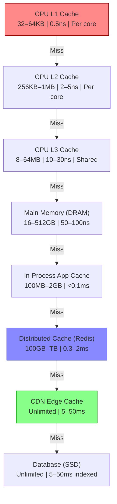
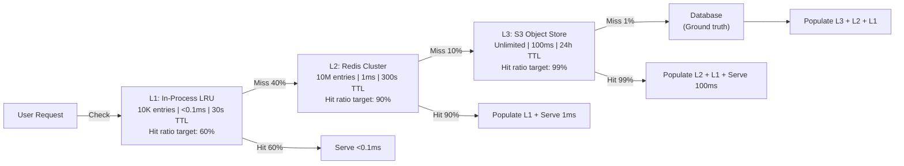
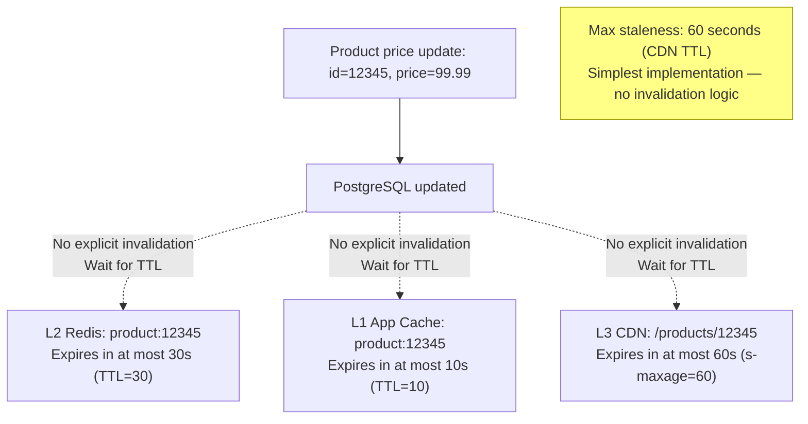
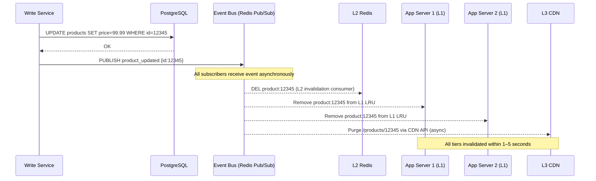
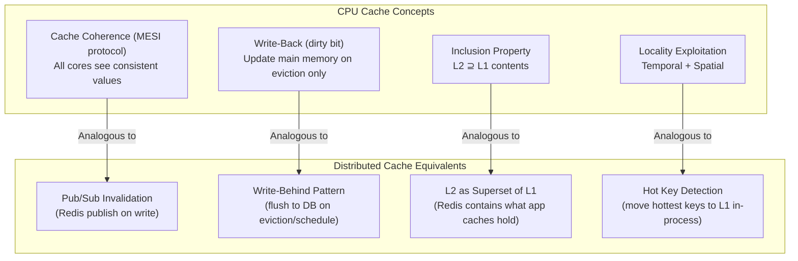
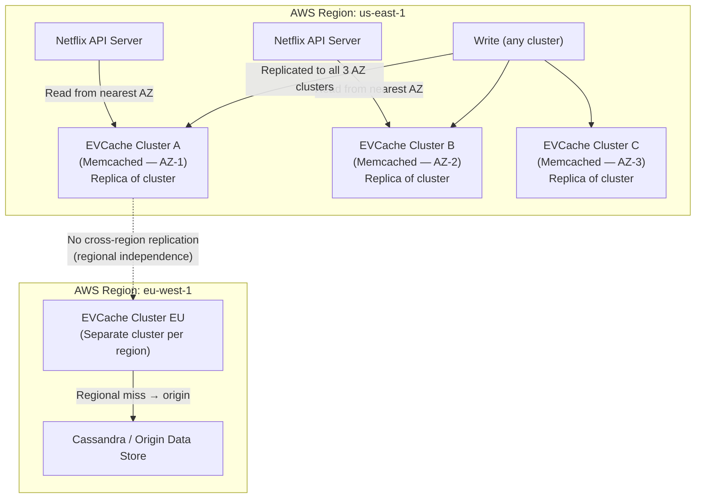
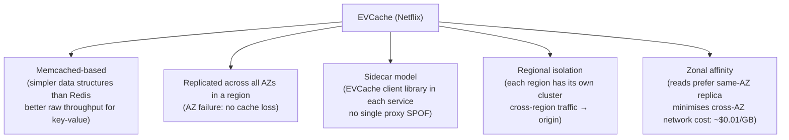

# Multi-Level Caching

5 questions covering multi-level caching from CPU hierarchy analogies to Netflix EVCache at 250M+ subscribers.

---

## Q1: What are the cache hierarchy levels from CPU to CDN?

**Role:** Mid | **Difficulty:** 🟡 | **Priority:** P0 | **Format:** Quick Answer

> **What the interviewer is testing:** Whether you understand that caching is a universal principle that applies at every layer of a computing system, and whether you can reason by analogy from CPU caches to distributed caches.

### Answer in 60 seconds
- **CPU L1 cache:** 32–64KB per core. Latency: 1–4 clock cycles (~0.5ns). Stores recently used machine instructions and data. Per-core, not shared.
- **CPU L2 cache:** 256KB–1MB per core. Latency: 4–12 cycles (~2–5ns). Larger, slightly slower than L1.
- **CPU L3 cache:** 8–64MB, shared across all cores. Latency: 30–40 cycles (~10–30ns). Last level before main memory.
- **Main memory (DRAM):** 16–512GB per server. Latency: 50–100ns. 100× slower than L1 cache.
- **In-process application cache:** Key-value HashMap in app heap. Latency: <0.1ms. Bounded by JVM/Node heap size (typically 100MB–2GB for cache).
- **Distributed cache (Redis/Memcached):** Network hop + cache lookup. Latency: 0.3–2ms. Capacity: 100GB–TB range per cluster.
- **CDN (Content Delivery Network):** Geographically distributed edge. Latency: 5–50ms (vs 100–300ms to origin). Capacity: effectively unlimited.
- **Database (origin):** SSD-backed. Latency: 5–50ms for indexed reads. The "ground truth" that all caches serve.

### Diagram

### Pitfalls
- ❌ **Treating all levels as independent:** The key insight of the hierarchy is that each level *exists to absorb misses from the level above*. If CDN hit ratio is 95%, only 5% of requests reach Redis — sizes must be coordinated.
- ❌ **Not knowing CPU cache sizes in system design:** While you won't configure CPU caches, demonstrating that you understand the latency spectrum (0.5ns to 300ms) shows architectural depth.
- ❌ **Conflating "low latency" with "cache hit":** Latency numbers assume a cache hit. A Redis cache miss still requires a DB query (5–50ms) plus Redis round-trip (0.3–2ms) — worse than going to DB directly.

### Concept Reference
→ [Multi-Level Caching](../../../02-caching/concepts/caching-fundamentals)

---

## Q2: How do you design a 3-tier cache — L1 app cache, L2 Redis, L3 object store?

**Role:** Mid | **Difficulty:** 🟡 | **Priority:** P0 | **Format:** Quick Answer

> **What the interviewer is testing:** Whether you can design a practical 3-tier cache that coordinates TTL, capacity, and miss handling across tiers without creating consistency issues.

### Answer in 60 seconds
- **L1 (in-process LRU):** 1,000–10,000 entries, 1–30s TTL, in application heap memory. Serves the hottest 0.01% of traffic with <0.1ms latency. Bounded to avoid heap OOM. Not shared across servers.
- **L2 (Redis cluster):** 10M–100M entries, 30–300s TTL, shared across all app servers. Serves the hot 10% of data with 0.5–2ms latency. Single source of truth for cache consistency.
- **L3 (object store — S3, GCS):** Infinite capacity, 24h–7d TTL, for large binary objects (images, videos, serialised models) too big for Redis. Latency: 20–200ms. Bypassed for data that fits in L2.
- **TTL hierarchy rule:** L1 TTL ≤ L2 TTL ≤ L3 TTL. Shorter TTL in closer tiers ensures invalidation propagates correctly.
- **Miss propagation:** L1 miss → check L2. L2 miss → check L3. L3 miss → fetch from DB/origin. Each miss populates the tier above on the way back.
- **Size selection:** L1: size to hottest data × expected app server heap budget. L2: size to the 80/20 working set. L3: size to anything that would saturate Redis (binary objects, large payloads).

### Diagram

### Pitfalls
- ❌ **L1 TTL longer than L2 TTL:** If L2 expires a key at 300s but L1 TTL is 600s, L1 continues serving stale data for 300s after L2 has invalidated. Always: L1 TTL < L2 TTL.
- ❌ **Putting large objects in L2 Redis:** A 10MB serialised model in Redis wastes 10MB of cluster RAM per object. Redis memory is expensive. Route objects >100KB to L3 (object store).
- ❌ **Not propagating L3 hits back to L2:** If an L3 hit doesn't populate L2, every request for that object pays L3 latency (100ms) instead of L2 (1ms). Always populate shallower tiers on deep-tier hits.

### Concept Reference
→ [Multi-Level Caching](../../../02-caching/concepts/caching-fundamentals)

---

## Q3: How do you maintain consistency across cache tiers when data is updated?

**Role:** Senior | **Difficulty:** 🔴 | **Priority:** P1 | **Format:** Deep Dive

> **What the interviewer is testing:** Whether you can solve the hardest problem in multi-tier caching: ensuring all tiers are invalidated when the source data changes, without complex distributed transactions.

### Problem Constraints
| Dimension | Value |
|-----------|-------|
| Write frequency | 10K updates/sec |
| Cache tiers | L1 (100 app servers) + L2 (Redis) + L3 (CDN) |
| Consistency SLA | All tiers stale for at most 30 seconds after write |
| Invalidation must not | Block the write request (async preferred) |

### Approach A — TTL-Based Eventual Consistency (Simplest)

### Approach B — Event-Driven Invalidation Cascade

| Dimension | TTL-Based | Event-Driven |
|-----------|-----------|-------------|
| Max staleness | TTL duration (30–60s) | 1–5 seconds |
| Write latency impact | None (no invalidation) | +5ms async (pub/sub) |
| Implementation complexity | Trivial | Medium |
| CDN purge | Not possible (TTL only) | Supported (tag purge) |
| L1 cross-server consistency | No | Yes (pub/sub broadcast) |

### Recommended Answer
Use **event-driven invalidation** for user-visible data where 30–60 seconds of staleness is not acceptable, and **TTL-only** for data where eventual consistency is fine.

**Event-driven design:**
1. After DB write, publish `{entity_type}:updated` event to Redis Pub/Sub (or Kafka for higher durability).
2. L2 invalidation consumer: `DEL product:12345` from Redis.
3. L1 invalidation: all app servers subscribe to the invalidation channel; remove from local LRU on event.
4. CDN invalidation: async call to CDN purge API by surrogate key (e.g., `Cloudflare-Cache-Tag: product-12345`). CDN purge takes 3–5 seconds.

**Consistency guarantee with this design:**
- L1 stale for: 1–2 seconds (pub/sub delivery latency)
- L2 stale for: <1 second (Redis pub/sub + DEL)
- L3 CDN stale for: 3–5 seconds (CDN API purge)

**Total max staleness: 5 seconds** — meeting the 30-second SLA with 6× headroom.

### What a great answer includes
- [ ] Separate strategies for L1 (pub/sub broadcast) vs L2 (explicit DEL) vs L3 (CDN API purge)
- [ ] Event-driven: publish after DB write, not before (don't invalidate if write fails)
- [ ] Acknowledge CDN purge delay: 3–5 seconds is unavoidable
- [ ] TTL as the safety net: even if pub/sub fails, stale data expires within TTL
- [ ] Idempotency: invalidation events must be safe to process twice (DEL on already-deleted key is a no-op)

### Pitfalls
- ❌ **Invalidating before DB write completes:** If `DEL cache:key` runs, then the DB write fails — cache is empty, DB has old data. Next read populates cache with old data. Always invalidate *after* confirmed write.
- ❌ **No TTL fallback for invalidation failures:** If pub/sub goes down, invalidation events are lost. Without TTL fallback, stale data persists indefinitely. Always keep a short TTL even with event-driven invalidation.
- ❌ **Synchronous CDN purge in the write request:** CDN purge APIs have latencies of 500ms–5s. Making the write request wait for CDN purge adds unacceptable write latency. Always purge CDN asynchronously.

### Concept Reference
→ [Multi-Level Caching](../../../02-caching/concepts/caching-fundamentals)

---

## Q4: What lessons from CPU cache hierarchy apply to distributed cache design?

**Role:** Senior | **Difficulty:** 🔴 | **Priority:** P1 | **Format:** Quick Answer

> **What the interviewer is testing:** Whether you can use first-principles reasoning from hardware architecture to inform distributed systems design — a signal of senior technical depth.

### Answer in 60 seconds
- **Locality of reference:** CPU caches exploit temporal locality (recently used → used again) and spatial locality (nearby memory → used next). Distributed caches must also exploit locality — popular items should be in the fastest tier (L1 in-process), not just any tier.
- **Cache coherence problem:** In multi-core CPUs, if Core 1 updates a cache line and Core 2 has a stale copy, coherence protocols (MESI) ensure Core 2 sees the update. In distributed caches, Redis pub/sub or TTL expiry play the role of cache coherence — without them, app servers have stale L1 caches indefinitely.
- **Inclusion property:** Many CPU hierarchies ensure L2 contains everything in L1 (inclusive cache). Distributed systems can use this: L2 Redis contains a superset of what L1 app caches hold — makes L1 invalidation cheaper (just check if in L2).
- **Miss penalty vs hit latency trade-off:** CPU designers size L1 at 32KB not 32MB because large caches have higher hit latency (more circuits to search). Similarly, in-process L1 caches must be bounded — 10,000 entries at 1ms lookup is better than 1,000,000 entries at 5ms.
- **Write-back vs write-through in CPU caches:** CPU L1/L2 often use write-back (dirty bit — data written to main memory only on eviction). Distributed write-behind caches use the same principle. The WAL (redo log) plays the role of DRAM — always consistent, always durable.

### Diagram

### Pitfalls
- ❌ **Taking the analogy too far:** CPU MESI protocol operates at nanosecond speed with hardware circuits. Network-based cache coherence (pub/sub) operates at milliseconds. The trade-off calculus is different — strong coherence at nanosecond cost is free; strong coherence at millisecond cost is expensive.
- ❌ **Forgetting that distributed caches have failure modes CPUs don't:** A CPU L1 cache never crashes independently. A Redis cluster can fail, leaving app servers with no L2 — they must fall back to DB without L1 warming.
- ❌ **Implementing strict cache inclusion unnecessarily:** Enforcing that L2 always contains everything in all L1 caches adds complexity. For most applications, TTL-based eventual consistency is sufficient — only enforce inclusion for systems with very strict consistency requirements.

### Concept Reference
→ [Multi-Level Caching](../../../02-caching/concepts/caching-fundamentals)

---

## Q5: How does Netflix EVCache provide multi-tier video metadata caching at 250M+ subscribers?

**Role:** Staff | **Difficulty:** ⚫ | **Priority:** P2 | **Format:** Deep Dive

> **What the interviewer is testing:** Whether you know EVCache's architecture, how Netflix handles global metadata caching with regional isolation, and what makes EVCache different from standard Redis.

### Problem Constraints
| Dimension | Value |
|-----------|-------|
| Scale | 250M+ subscribers, 220+ countries |
| Metadata requests | Billions per day |
| Metadata types | Title info, thumbnails, content ratings, availability per region |
| Latency SLA | p99 < 10ms for metadata |
| Availability requirement | 99.99% (43 minutes downtime/year maximum) |

### EVCache Architecture

### What Makes EVCache Different from Standard Redis

| Dimension | Standard Redis | EVCache |
|-----------|---------------|---------|
| Storage engine | Redis (rich data types) | Memcached (simple KV) |
| Replication model | Primary-replica | Full replica per AZ |
| AZ failure tolerance | Depends on replica AZ | Always — replicas in each AZ |
| Cross-region replication | Redis Global | Regional isolation (design choice) |
| Client model | Centralised proxy or client | Library embedded in each service |
| Throughput per node | 100K–1M ops/sec | 500K–2M ops/sec (Memcached faster for get/set) |

### Recommended Answer
EVCache is Netflix's distributed in-memory caching solution built on top of Memcached, open-sourced in 2013. Its key architectural decisions are:

**1. AZ replication:** Each cache cluster has a full replica in every AZ of the region (typically 3 AZs). Writes replicate synchronously to all AZ replicas. Reads prefer the same-AZ replica for lowest latency and to avoid cross-AZ data transfer costs ($0.01/GB). An AZ failure means no cache loss — other replicas serve all traffic.

**2. Regional isolation:** EVCache does not replicate across AWS regions. Each region (us-east-1, eu-west-1, ap-northeast-1) has an independent cluster. A cache miss in eu-west-1 goes to the European origin (Cassandra cluster), not to the US EVCache. This provides regional data sovereignty compliance and avoids cross-region latency.

**3. Sidecar library model:** Rather than a central Redis proxy, the EVCache client library is embedded in each microservice. It handles consistent hashing, AZ-affinity routing, and fallback to origin on cache miss. No single proxy SPOF.

**4. Metadata caching pattern:** Netflix pre-populates EVCache for all active titles (80K+ titles) with video metadata, images (thumbnail URLs), and regional availability flags. TTL: 24 hours for title metadata (changes infrequently), 1 hour for availability flags (regional licensing can change).

**Result:** Billions of metadata requests per day served at p99 < 5ms with 99.99% cache availability.

### What a great answer includes
- [ ] AZ replication: full replica per AZ for fault tolerance
- [ ] Zonal affinity: reads prefer same-AZ replica (latency + cost)
- [ ] Regional isolation: no cross-region replication — each region is self-contained
- [ ] Library sidecar model: no central proxy SPOF
- [ ] Differentiated TTLs: 24h for title metadata, 1h for availability flags

### Pitfalls
- ❌ **Saying "EVCache is just Redis":** EVCache is built on Memcached, not Redis. The choice of Memcached is intentional — simpler data model, higher raw throughput for pure get/set workloads, lower memory overhead per entry.
- ❌ **Assuming cross-region replication:** EVCache is explicitly regionally isolated. Cross-region consistency is solved at the origin (Cassandra multi-region replication), not at the cache layer.
- ❌ **Not knowing EVCache is open-source:** Netflix open-sourced EVCache on GitHub. Saying "we can't know how Netflix does it" misses that their architecture is publicly documented.

### Concept Reference
→ [Multi-Level Caching](../../../02-caching/concepts/caching-fundamentals)
