# Redis Advanced Patterns

6 questions covering Redis from distributed locks to Discord-scale message storage.

---

## Q1: How do you implement a distributed lock with Redis SETNX? What are the failure modes?

**Role:** Senior, Backend | **Difficulty:** 🔴 | **Priority:** P0 | **Format:** Deep Dive

> **What the interviewer is testing:** Whether you understand the Redlock algorithm, NX+PX atomic set, and the subtle failure modes that make distributed locking hard.

### Problem Constraints
| Dimension | Value |
|-----------|-------|
| Lock contention | 100s of processes competing for same resource |
| Lock duration | 5–30 seconds (job processing time) |
| Failure mode | Lock holder crashes mid-job |
| Correctness requirement | At-most-once execution (not at-least-once) |

### Approach A — Basic SETNX (Flawed)

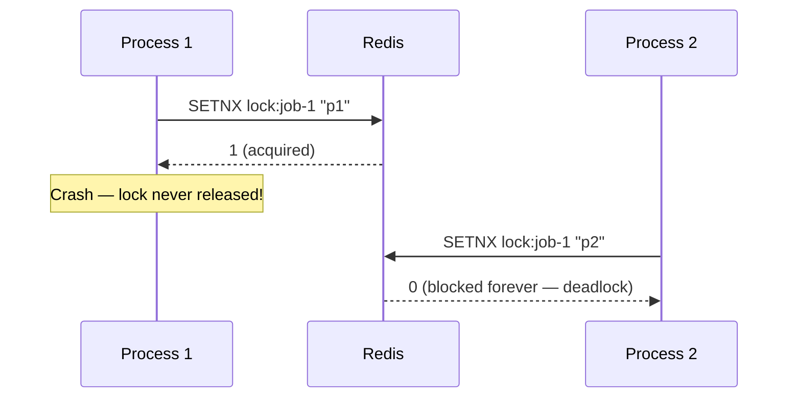

### Approach B — SET NX PX (Correct Single-Node)

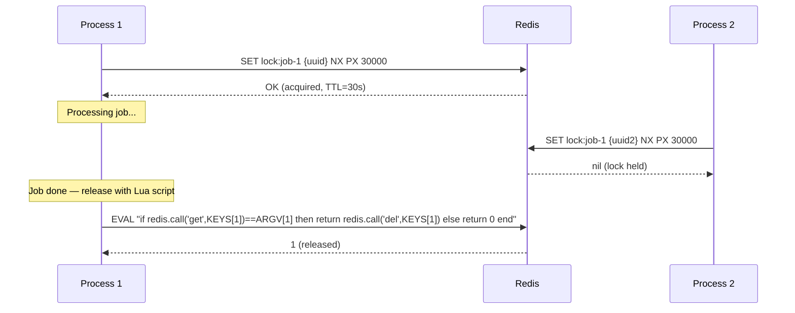

| Failure Mode | Basic SETNX | SET NX PX | Redlock (5 nodes) |
|--------------|-------------|-----------|-------------------|
| Lock holder crashes | Deadlock | Auto-expiry after TTL | Auto-expiry |
| Process releases wrong lock | Not prevented | Prevented by UUID check | Prevented |
| Redis node fails | Total failure | Total failure | Tolerates N/2 failures |
| Clock drift | N/A | Can extend TTL incorrectly | Drift < 10ms acceptable |

### Recommended Answer
Use `SET lock:key {uuid} NX PX {ttl_ms}` — a single atomic command that sets only if not exists (NX) with millisecond expiry (PX). The UUID ensures only the original lock holder can release it (checked via Lua script for atomicity). TTL prevents deadlock on crash.

**Critical failure modes:**
1. **Long GC pause:** JVM pauses for 30s GC → TTL expires → another process acquires lock → two processes hold lock simultaneously. Mitigation: use lock TTL > expected GC pause (set TTL=120s for JVM workloads, extend with background heartbeat).
2. **Releasing someone else's lock:** Process 1 checks UUID, then pauses, TTL expires, Process 2 acquires, Process 1 resumes and DELetes — but it's Process 2's lock now. Mitigation: check+delete in a single Lua script (atomic).

For multi-node HA, use **Redlock**: acquire on 5 Redis nodes, require majority (3/5) to succeed within `validity_time = TTL - (total_acquire_time + clock_drift_factor)`.

### What a great answer includes
- [ ] Use SET NX PX (not SETNX + EXPIRE which is two commands and non-atomic)
- [ ] UUID per lock acquisition to prevent releasing someone else's lock
- [ ] Lua script for atomic check-and-delete on release
- [ ] GC pause as the key failure mode for JVM-based services
- [ ] Redlock for multi-node HA (majority quorum on 5 nodes)

### Pitfalls
- ❌ **Two separate commands SETNX + EXPIRE:** Not atomic. If process crashes between the two commands, deadlock occurs. Always use single `SET NX PX`.
- ❌ **Not extending the lock (heartbeat):** Long jobs that exceed TTL have their lock stolen mid-execution. Implement a background thread that extends TTL every TTL/3 seconds.
- ❌ **Using Redlock for strong correctness guarantees:** Martin Kleppmann's analysis shows Redlock is not safe under clock drift or long GC pauses. For true fencing, use ZooKeeper with monotonic fence tokens.

### Concept Reference
→ [Distributed Locking Patterns](../../../system-design/fundamentals/distributed-coordination)

---

## Q2: What is Redis Pub/Sub vs Redis Streams — when do you use each?

**Role:** Mid, Senior | **Difficulty:** 🟡 | **Priority:** P0 | **Format:** Quick Answer

> **What the interviewer is testing:** Whether you understand message delivery guarantees and the persistence model differences between pub/sub and streams.

### Answer in 60 seconds
- **Redis Pub/Sub:** Fire-and-forget broadcast. Publisher sends to a channel; all currently-connected subscribers receive it. No persistence — if subscriber disconnects and reconnects, it misses messages. No replay capability. Max throughput: ~1M messages/sec on a single Redis node. Latency: <1ms.
- **Redis Streams:** Persistent append-only log (like a mini Kafka). Messages survive subscriber disconnection. Consumer groups track per-consumer offsets. Replay from any offset. Max throughput: ~500K messages/sec. Latency: 1–5ms. Retention controlled by `MAXLEN`.
- **Use Pub/Sub for:** Real-time notifications (chat presence, live scoreboards), cache invalidation fan-out, events where missing a message is acceptable.
- **Use Streams for:** Task queues, audit logs, event sourcing, anything where at-least-once delivery matters.

### Diagram

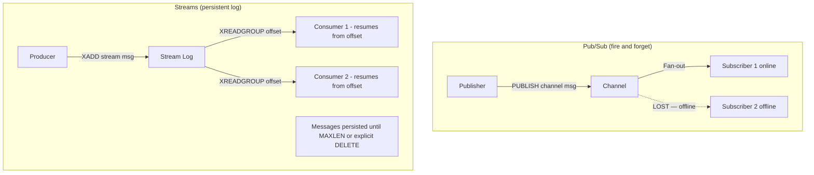

| Dimension | Pub/Sub | Streams |
|-----------|---------|---------|
| Persistence | No | Yes (configurable MAXLEN) |
| Delivery guarantee | At-most-once | At-least-once (with ACK) |
| Replay | No | Yes (from any offset) |
| Consumer groups | No | Yes |
| Use case | Live notifications | Task queues, event log |
| Latency | <1ms | 1–5ms |

### Pitfalls
- ❌ **Using Pub/Sub for task queues:** Task messages are lost if a worker restarts mid-message. Use Streams with consumer group ACKs.
- ❌ **Streams without MAXLEN:** Unbounded stream grows until Redis OOM. Set `MAXLEN ~ 1000000` (1M entries) and trim older entries.
- ❌ **Pub/Sub across Redis Cluster:** Pub/Sub does NOT fan out across Redis Cluster nodes — only subscribers on the same node receive messages. Use keyslot sharding or a dedicated single-node Redis for pub/sub.

### Concept Reference
→ [Message Queue Patterns](../../../system-design/messaging/message-queue-patterns)

---

## Q3: How do you use Redis sorted sets to implement a leaderboard for 10M users?

**Role:** Senior | **Difficulty:** 🔴 | **Priority:** P1 | **Format:** Deep Dive

> **What the interviewer is testing:** Whether you understand sorted set operations, score update patterns, and sharding strategies for large-scale leaderboards.

### Problem Constraints
| Dimension | Value |
|-----------|-------|
| Users | 10M active users |
| Score update rate | 50K updates/sec (game events) |
| Read patterns | Top 100 leaderboard + user's rank + surrounding 5 users |
| Memory | Sorted set: ~120 bytes/member → 10M users = 1.2GB |

### Core Operations

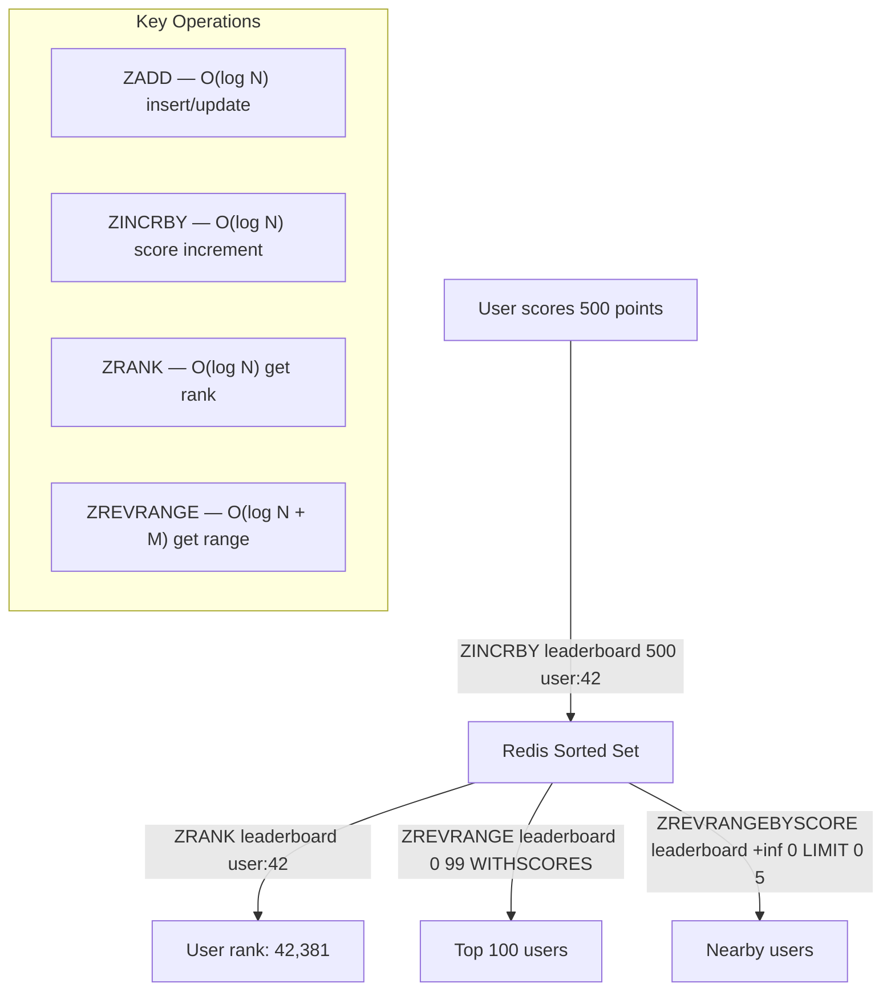

### Sharding Strategy for 10M+ Users

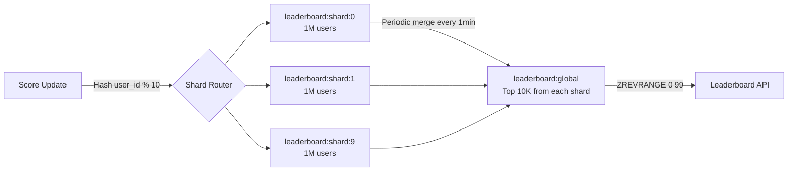

| Dimension | Single Sorted Set | Sharded Sets |
|-----------|------------------|--------------|
| Max users | ~100M (12GB RAM) | Unlimited |
| Read latency p99 | 1–3ms | 5–10ms (merge overhead) |
| Write latency p99 | <1ms | <1ms (per shard) |
| Global rank accuracy | Exact | Approximate (shard lag) |
| Complexity | Low | High |

### Recommended Answer
A single Redis sorted set handles 10M users with ~1.2GB memory and O(log N) for all operations. `ZINCRBY leaderboard {delta} {user_id}` increments score atomically — safe for concurrent updates from multiple game servers. `ZREVRANK` returns rank in O(log N) = ~23 comparisons for 10M entries, achieving <1ms p99 latency.

For user context ("you are rank 42,381 — here are the 5 players above and below you"), use: `ZREVRANK` to get rank, then `ZREVRANGE leaderboard {rank-5} {rank+5}`.

Beyond 100M users (12GB+ RAM), shard by user_id mod N into N sorted sets. Top-K is computed by merging the top-K from each shard using `ZUNIONSTORE` into a temporary key — run this as a background job every 60 seconds rather than on every read.

### What a great answer includes
- [ ] ZINCRBY for atomic score increment (concurrent-safe)
- [ ] ZREVRANK for user's rank (O(log N))
- [ ] ZREVRANGE with offset for "surrounding users" feature
- [ ] Memory estimate (120 bytes/member)
- [ ] Sharding strategy for 100M+ users

### Pitfalls
- ❌ **Using ZADD instead of ZINCRBY for score updates:** `ZADD` sets absolute score (race condition with concurrent updates). `ZINCRBY` atomically increments — always use ZINCRBY for score accumulation.
- ❌ **No TTL on temporary ZUNIONSTORE keys:** Background merge creates a temporary key every 60s. Without TTL, these accumulate. Set TTL=120s on merged keys.
- ❌ **Fetching full leaderboard on each request:** `ZREVRANGE 0 9999999` at 10M users is 10M entries — never do this. Always paginate with LIMIT.

### Concept Reference
→ [Redis Data Structures](../../../system-design/caching/redis-patterns)

---

## Q4: How does Redis Cluster work — consistent hashing, hash slots, resharding?

**Role:** Senior | **Difficulty:** 🔴 | **Priority:** P1 | **Format:** Quick Answer

> **What the interviewer is testing:** Whether you understand Redis Cluster's hash slot model, how nodes are assigned slots, and how resharding works without downtime.

### Answer in 60 seconds
- **Hash slots:** Redis Cluster divides the key space into 16,384 slots. Every key maps to a slot: `slot = CRC16(key) % 16384`. Each slot is assigned to exactly one master node.
- **Typical setup:** 3 masters + 3 replicas. Each master owns ~5,461 slots. Max cluster size: 1,000 nodes.
- **Key lookup:** Client queries any node. If that node owns the slot → serves the request. If not → returns `MOVED {slot} {host}:{port}` redirect. Smart clients cache the slot map and route directly (1 RTT, not 2).
- **Resharding:** Move slots between nodes without downtime. `CLUSTER SETSLOT {slot} MIGRATING {target}` → migrate keys one by one → `CLUSTER SETSLOT {slot} NODE {target}`. During migration, requests for keys still on source get `ASK` redirect (temporary, not cached by clients).
- **Numbers:** 16,384 slots allows 16,384 nodes max. Minimum cluster: 3 nodes. Resharding 1M keys: ~10 minutes at 100K keys/min migration rate.

### Diagram

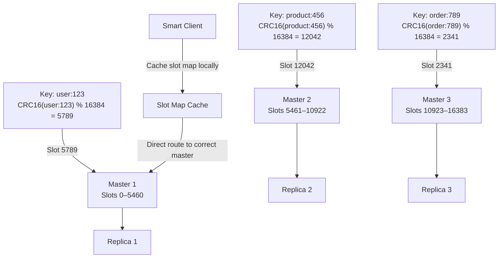

### Pitfalls
- ❌ **Multi-key commands across slots:** `MGET user:1 user:2` fails if the keys hash to different slots. Use hash tags `{user}:1` and `{user}:2` to force the same slot (CRC16 of the `{...}` portion only).
- ❌ **Lua scripts with cross-slot keys:** Same constraint — all keys in a Lua script must be in the same slot. Design key naming with hash tags from the start.
- ❌ **Ignoring ASK vs MOVED:** ASK is transient (during migration, don't cache). MOVED is permanent (update slot map). A client that caches ASK responses will route to the wrong node after resharding completes.

### Concept Reference
→ [Redis Clustering](../../../system-design/caching/redis-patterns)

---

## Q5: How do you implement a sliding window rate limiter with Redis?

**Role:** Senior | **Difficulty:** 🔴 | **Priority:** P1 | **Format:** Deep Dive

> **What the interviewer is testing:** Whether you understand the trade-offs between fixed window, sliding window log, and sliding window counter approaches — and can implement them with Redis primitives.

### Problem Constraints
| Dimension | Value |
|-----------|-------|
| Limit | 1,000 requests per user per 60 seconds |
| Scale | 100K users, 10M req/min total |
| Correctness | No burst allowed at window boundary |
| Latency budget | <5ms per rate limit check |

### Approach A — Fixed Window (Fast, but allows 2x burst)

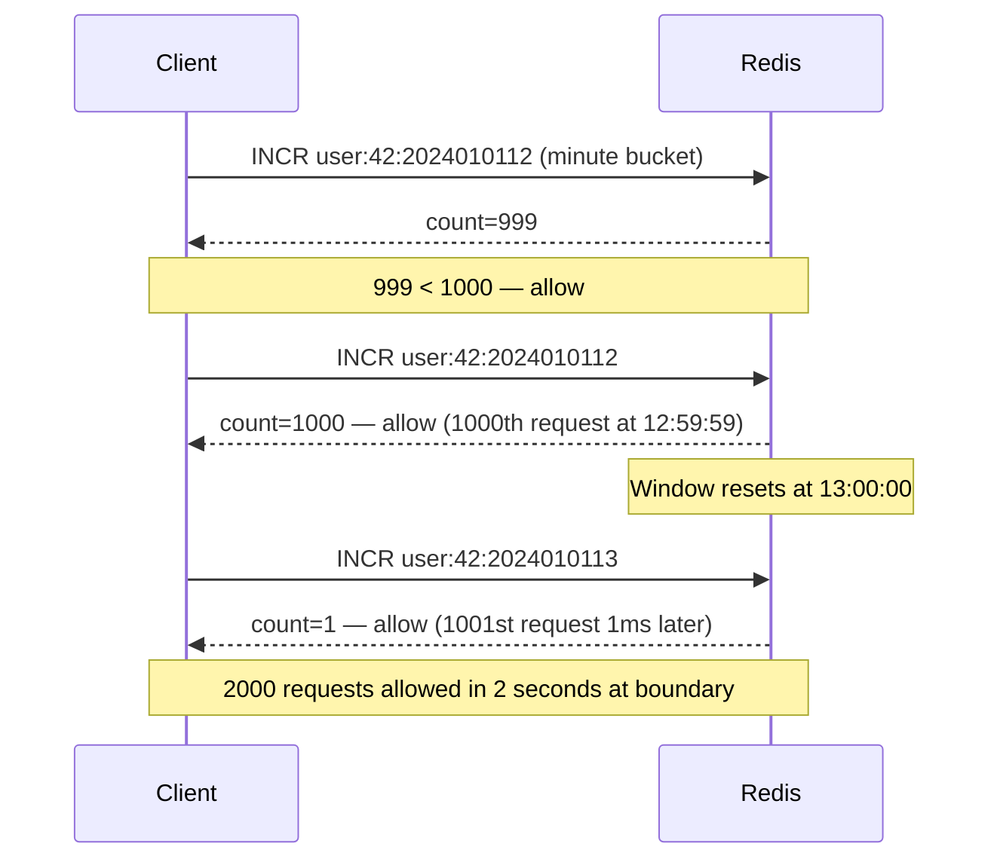

### Approach B — Sliding Window Log (Accurate, high memory)

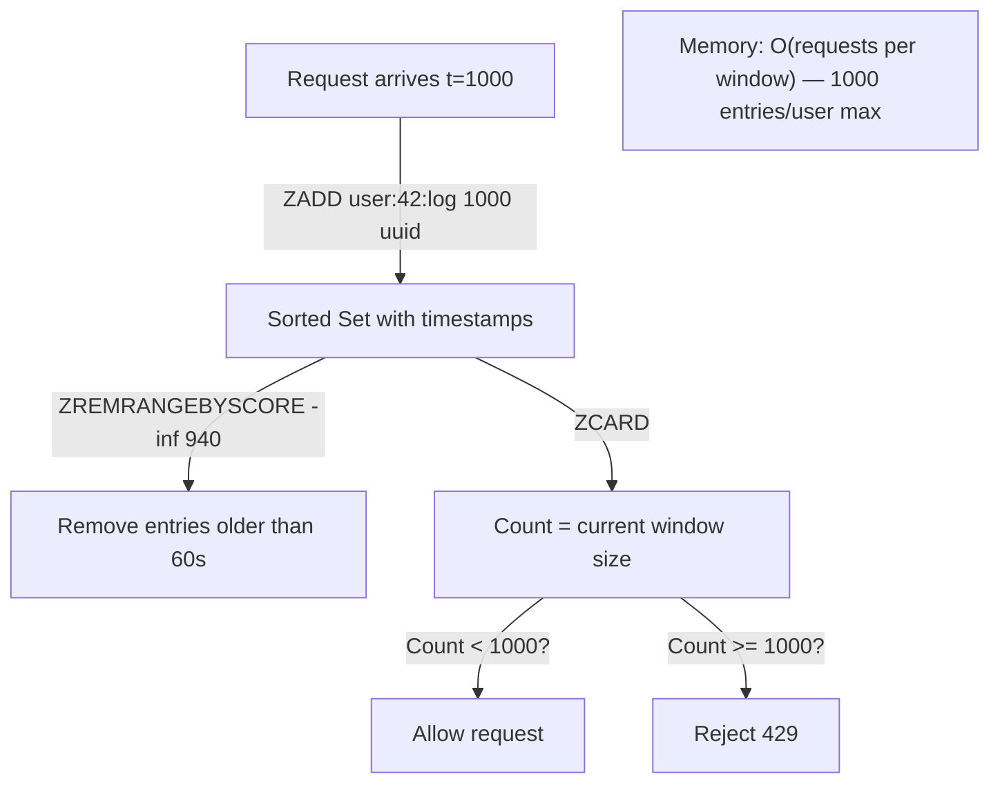

### Approach C — Sliding Window Counter (Recommended)

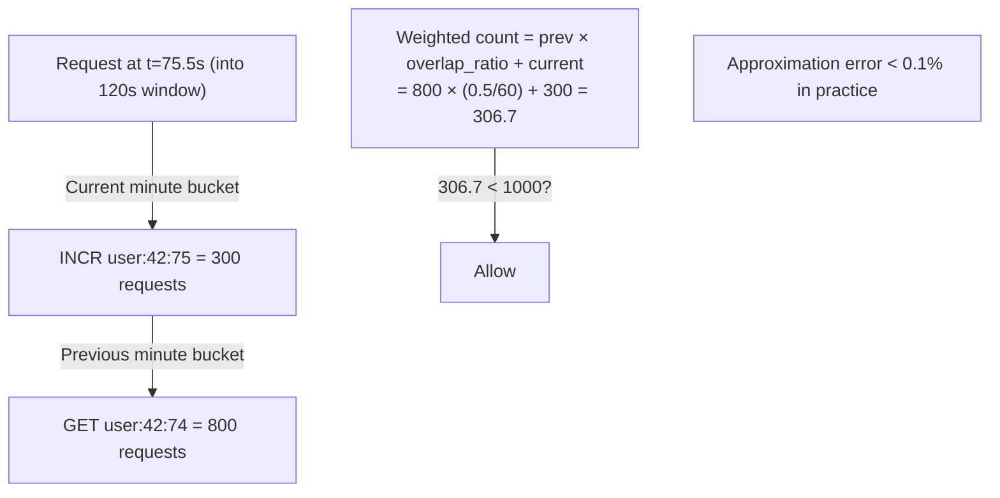

| Approach | Memory | Accuracy | Redis Ops/Request | Latency |
|----------|--------|----------|-------------------|---------|
| Fixed Window | O(1) | ±100% at boundary | 2 (INCR + EXPIRE) | <1ms |
| Sliding Window Log | O(N) per user | Exact | 3 (ZADD + ZREM + ZCARD) | 1–3ms |
| Sliding Window Counter | O(1) | ~99.9% | 3 (2×GET + INCR) | <1ms |

### Recommended Answer
Use **Sliding Window Counter** (also called sliding window log approximation): maintain two per-minute buckets (current and previous). Compute: `count = prev_count × (1 - elapsed_fraction) + current_count`. This approximation has <0.1% error for uniform traffic and uses only O(1) memory per user vs O(N) for exact sliding window log.

All Redis operations in a Lua script for atomicity:
```
-- Pseudo-code Lua script
current_key = "ratelimit:{user}:{current_minute}"
prev_key = "ratelimit:{user}:{prev_minute}"
current = INCR current_key
EXPIRE current_key 120
prev = GET prev_key or 0
elapsed_fraction = current_second / 60
weighted = prev × (1 - elapsed_fraction) + current
return weighted <= limit
```

### What a great answer includes
- [ ] Explain fixed window burst problem at boundary
- [ ] Sliding window log: exact but O(N) memory
- [ ] Sliding window counter: O(1) memory with <0.1% error
- [ ] Lua script for atomicity (no race between check and increment)
- [ ] 429 response with Retry-After header

### Pitfalls
- ❌ **Two separate GET + SET without Lua:** Race condition — two concurrent requests both read count=999, both allow, count becomes 1001. Lua script makes check+increment atomic.
- ❌ **No EXPIRE on rate limit keys:** Memory leak. Each user creates 2 keys every minute — without TTL, 100K users = 200K leaked keys per minute.

### Concept Reference
→ [Rate Limiting Patterns](../../../system-design/scalability/rate-limiting)

---

## Q6: How does Discord serve 100M+ messages/day with Redis?

**Role:** Staff | **Difficulty:** ⚫ | **Priority:** P2 | **Format:** Deep Dive

> **What the interviewer is testing:** Whether you understand how Discord uses Redis for presence tracking, channel last-read pointers, and hot message caching alongside Cassandra.

### Problem Constraints
| Dimension | Value |
|-----------|-------|
| Scale | 100M+ messages/day, 19M active servers (2023) |
| Online users | ~8M simultaneously at peak |
| Presence tracking | User online/offline/idle status |
| Read patterns | Last 50 messages per channel load (hot path) |

### Architecture Overview

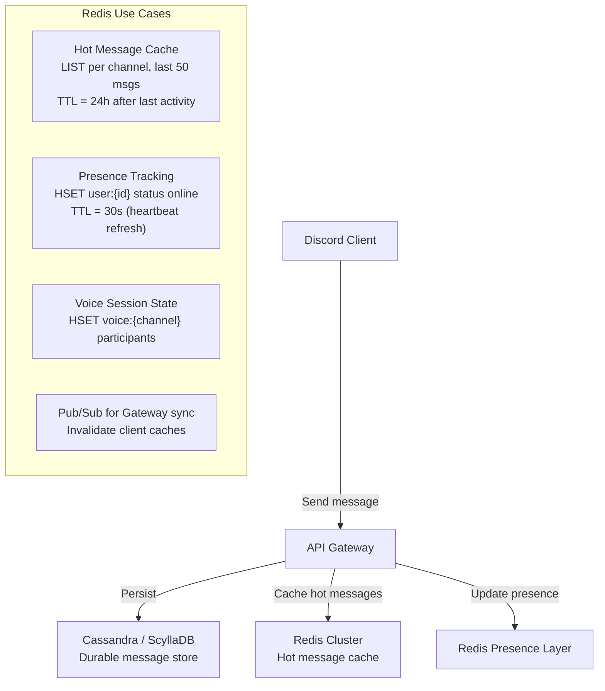

### Presence Tracking Pattern

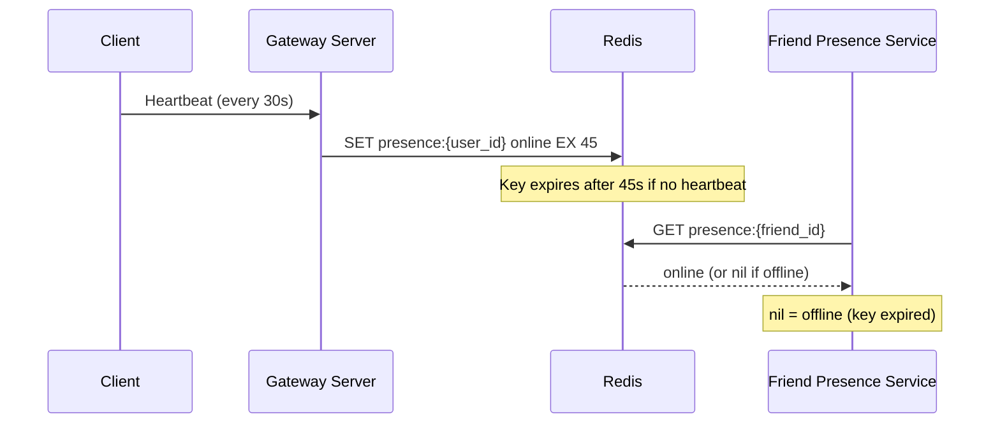

| Feature | Redis Role | Data Structure | TTL |
|---------|-----------|----------------|-----|
| Online presence | Heartbeat key | STRING with EX | 45s |
| Recent messages | Hot cache | LIST (LPUSH + LTRIM to 50) | 24h from last activity |
| Voice participants | Session state | HASH | Cleared on disconnect |
| Server member count | Approximate count | STRING (INCR/DECR) | No TTL |

### Recommended Answer
Discord uses Redis as the **hot path layer** on top of Cassandra (cold/durable storage). On channel open, Discord checks Redis for the last 50 messages (`LRANGE channel:{id}:messages 0 49`). If hot cache hit (24-hour window), it serves from Redis at ~1ms. On cache miss, it reads from Cassandra and warms the cache.

**Presence** is the most Redis-intensive feature: 8M concurrent users each send a heartbeat every 30 seconds. Each heartbeat does `SET presence:{user_id} {status} EX 45` — 267K SET operations/second. Keys auto-expire after 45s of no heartbeat, so offline detection requires no explicit delete. Friends list presence checks are bulk GETs in a pipeline.

The architecture evolved: initially a single Redis cluster, then sharded by user_id consistent hashing as user count scaled past 10M concurrent.

### What a great answer includes
- [ ] Redis as hot cache layer over Cassandra (not replacement)
- [ ] Presence tracking via TTL-expiring keys (heartbeat pattern)
- [ ] LIST data structure for recent messages (LPUSH + LTRIM)
- [ ] Quantify heartbeat write rate (267K SET/sec at 8M users)
- [ ] Shard evolution as scale grew

### Pitfalls
- ❌ **Treating Redis as the only message store:** Redis is the hot cache. Cassandra holds durable history. If Redis loses data, Cassandra is the source of truth.
- ❌ **Not LTRIM on message lists:** Without `LTRIM channel:{id}:messages 0 49` after each LPUSH, the list grows unbounded — OOM risk.

### Concept Reference
→ [Redis Clustering](../../../system-design/caching/redis-patterns)
