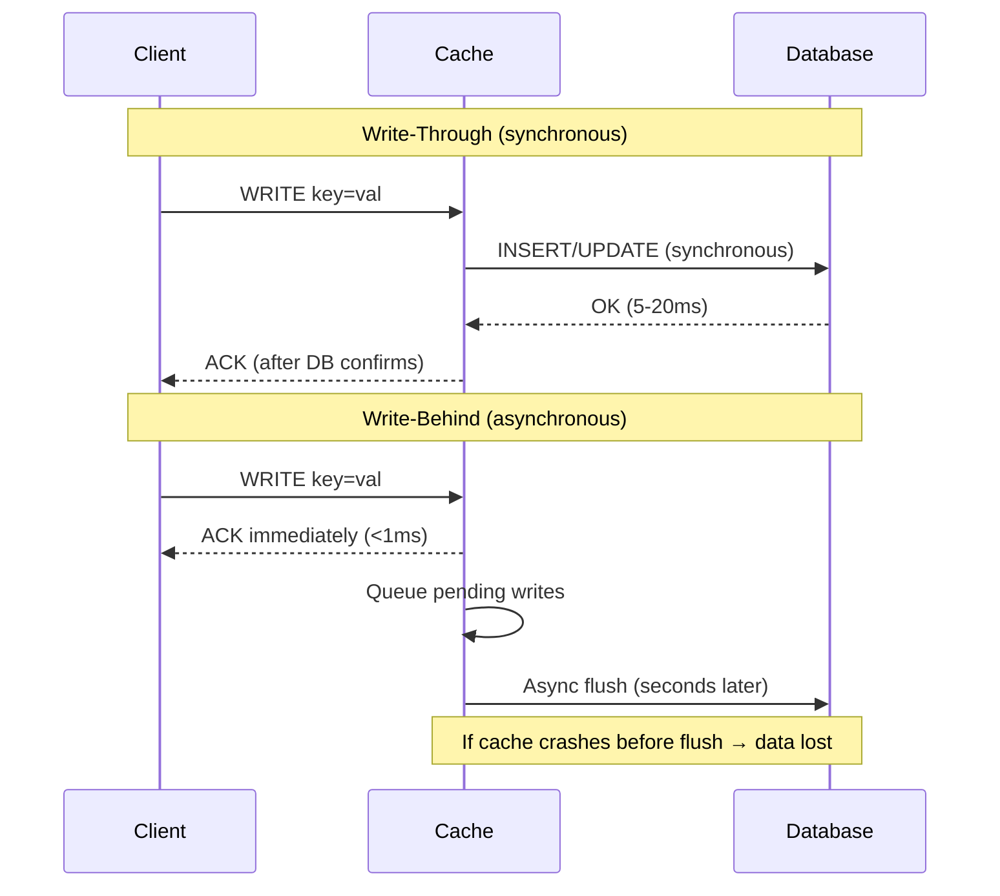
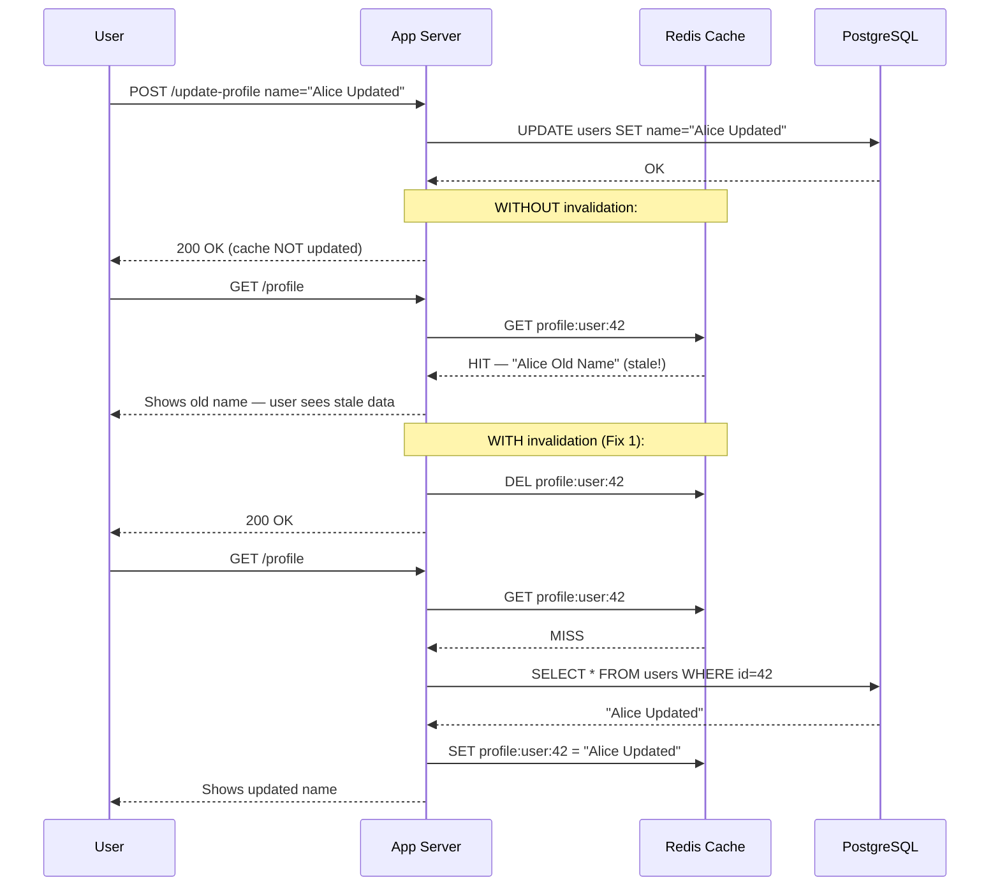
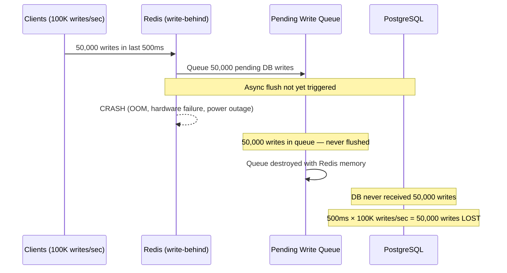
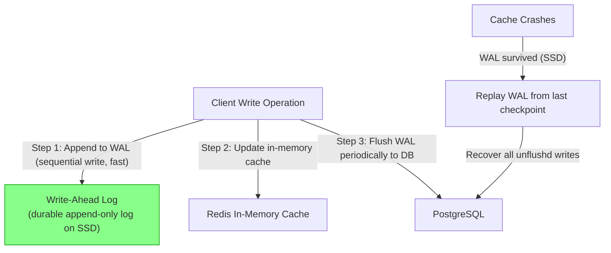
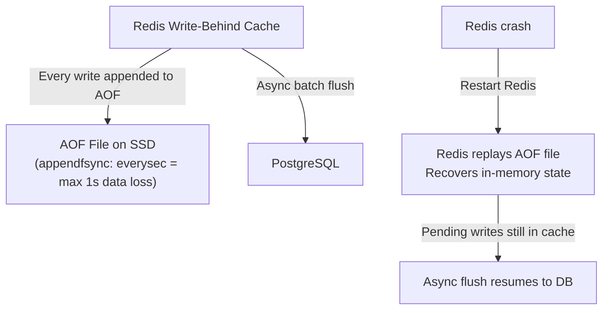
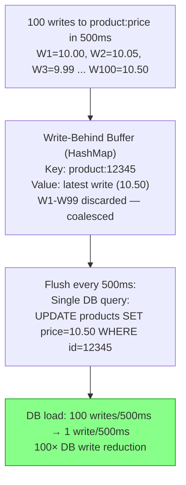
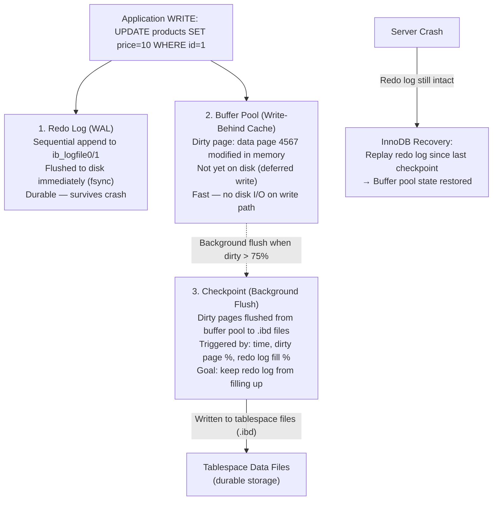
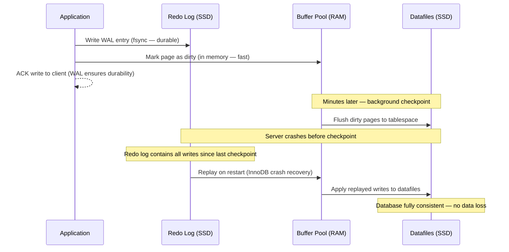

# Write-Behind & Write-Through Caching

5 questions covering write-path caching patterns from consistency fundamentals to MySQL InnoDB internals.

---

## Q1: Write-through vs write-behind (write-back) — durability and performance trade-offs?

**Role:** Mid | **Difficulty:** 🟡 | **Priority:** P0 | **Format:** Quick Answer

> **What the interviewer is testing:** Whether you understand the fundamental trade-off between synchronous write durability (write-through) and asynchronous write performance (write-behind), and when each is appropriate.

### Answer in 60 seconds
- **Write-through:** Every write goes to cache AND database synchronously before the response is returned to the client. Cache and DB are always in sync. Write latency = max(cache_write, DB_write) ≈ DB write latency (5–20ms). Zero data loss on crash — every acknowledged write is in the DB.
- **Write-behind (write-back):** Write goes to cache first; DB is updated asynchronously in the background (typically milliseconds to seconds later). Write latency = cache write latency (~1ms). Risk: if the cache crashes before the async write completes, the unwritten data is lost.
- **Performance difference:** A write-behind cache can sustain 10–100× higher write throughput than write-through because the DB (the bottleneck at 5–20ms per write) is no longer in the critical path.
- **Durability spectrum:** Write-through (full durability) → write-behind with WAL (near-full durability) → write-behind without WAL (risk of data loss) → no persistence (lose all on crash).
- **Choosing:** Write-through for financial transactions, user profile updates, anything where data loss is unacceptable. Write-behind for high-throughput metrics ingestion, audit logs, counters, analytics where losing a few seconds of data is tolerable.

### Diagram

### Pitfalls
- ❌ **Write-behind for financial data:** A payment acknowledged to the customer but not yet flushed to the DB is money in limbo. On cache crash, the payment is lost — unrecoverable. Always use write-through for financial writes.
- ❌ **Write-through without read-after-write guarantee:** If writes go to cache and DB, but reads go to a DB replica with 200ms lag, the user may not see their own write. Ensure reads route to the same DB primary that received the write.
- ❌ **Write-behind without acknowledging to the client that it's async:** If clients assume write-through durability but the system uses write-behind, any data loss scenario becomes a breach of contract. Document and communicate the durability guarantee.

### Concept Reference
→ [Caching Strategies](../../../01-databases/concepts/write-ahead-log)

---

## Q2: How does caching break read-your-writes consistency, and how do you fix it?

**Role:** Mid | **Difficulty:** 🟡 | **Priority:** P0 | **Format:** Quick Answer

> **What the interviewer is testing:** Whether you understand read-after-write consistency as a concrete user-visible issue, not just an abstract consistency model.

### Answer in 60 seconds
- **The problem:** User updates their profile. Write goes to DB primary. Cache (Redis) is not updated immediately (using cache-aside). User refreshes their profile page. Read hits the stale cache — shows the old profile. This is a read-your-writes (monotonic read) consistency violation.
- **User impact:** "Why doesn't my change show up?" is the #1 most-reported bug in systems using cache-aside without invalidation. It is invisible in automated tests (which typically skip cache).
- **Fix 1 — Cache invalidation on write:** After writing to DB, immediately delete the cache key (`DEL profile:user:42`). The next read will be a cache miss → fetches fresh data from DB → repopulates cache. Simple and correct. Trade-off: one extra DB read per write.
- **Fix 2 — Write-through on update:** When updating the profile, write the new value to cache AND DB simultaneously. The cache is immediately fresh — no miss on next read.
- **Fix 3 — Bypass cache for the same request:** After a write, include a parameter or session flag (`cache_bypass=true`) for the immediately following read. App server skips cache and reads from DB directly. TTL expiry and eventual consistency handle the cache refresh.
- **Fix 4 — Version-based cache keys:** Include a version number in the cache key: `profile:user:42:v5`. On write, increment version. Old cache key becomes unreachable (effectively invalidated). New key is a guaranteed miss on first access.

### Diagram

### Pitfalls
- ❌ **Relying on TTL for read-your-writes:** TTL of 60 seconds means the user sees stale data for up to 60 seconds after their own write. For any user-visible attribute (name, email, avatar), this is unacceptable. Explicit invalidation is required.
- ❌ **Invalidating before the DB write completes:** If `DEL cache:key` runs before `UPDATE` completes and the DB write fails, the cache is empty but the data was not changed — next read fetches old data, stores it back. Always invalidate *after* successful DB write.
- ❌ **Not invalidating in distributed scenarios:** If 3 app servers each have an in-process L1 cache, invalidating one server's cache does not invalidate the others. Use Redis pub/sub to broadcast invalidation to all app servers.

### Concept Reference
→ [Caching Strategies](../../../01-databases/concepts/write-ahead-log)

---

## Q3: What happens when a write-behind cache crashes — data loss scenario and mitigation?

**Role:** Senior | **Difficulty:** 🔴 | **Priority:** P1 | **Format:** Deep Dive

> **What the interviewer is testing:** Whether you can reason through the failure modes of write-behind caching and design appropriate durability safeguards.

### Problem Constraints
| Dimension | Value |
|-----------|-------|
| Write rate | 100K writes/sec |
| Async flush interval | 500ms (batched writes) |
| Cache server memory | 64GB Redis |
| Max data loss on crash | 0 (financial) or ≤5s (non-critical) |

### Failure Scenario — Data Loss Without Mitigation

### Mitigation A — Write-Ahead Log (WAL) for Cache

### Mitigation B — Redis AOF (Append-Only File)

| Mitigation | Max data loss | Write overhead | Complexity |
|------------|---------------|----------------|------------|
| No protection | 500ms × 100K = 50,000 writes | None | Low |
| Redis RDB snapshot | Minutes (between snapshots) | Low | Low |
| Redis AOF (everysec) | ≤1 second | Medium (+5% write latency) | Low |
| Redis AOF (always) | 0 | High (+50% write latency) | Medium |
| External WAL (Kafka) | 0 | Medium | High |

### Recommended Answer
For write-behind caches, the core risk is unacknowledged writes: you've told the client "OK" but haven't persisted to durable storage. Three mitigation levels:

**Level 1 — Redis AOF with `appendfsync everysec`:** Redis flushes its append-only file to disk every second. Max data loss = 1 second × write rate. For 100K writes/sec, that's 100K writes max loss. Acceptable for non-critical data; unacceptable for financial.

**Level 2 — Kafka as durable write-behind buffer:** Write to both Redis (cache) AND Kafka (durable log) before acknowledging to client. Background consumer reads from Kafka and flushes to DB. Kafka replication factor=3 provides durability. On Redis crash, consumer replays from last committed Kafka offset — zero data loss.

**Level 3 — Bounded queue with backpressure:** Set a max pending write queue depth (e.g., 100K entries). When queue is full, stop accepting writes — return 503 until the queue drains. This prevents unbounded data at risk.

### What a great answer includes
- [ ] Quantify the failure window: 500ms interval × 100K writes/sec = 50K writes at risk
- [ ] Redis AOF as the simple mitigation (1 second data loss)
- [ ] Kafka as the durable write-behind buffer for zero-loss
- [ ] Bounded queue depth with backpressure to limit exposure
- [ ] Different mitigation levels for different data criticality

### Pitfalls
- ❌ **"Redis is durable because it's in memory":** Memory is not durable. A power outage, kernel OOM kill, or hardware failure destroys in-memory state. Durability requires persistence to non-volatile storage.
- ❌ **Redis RDB snapshot as write-behind mitigation:** RDB snapshots happen every 5–15 minutes by default. 15 minutes × 100K writes/sec = 90M writes at risk. RDB is not a write-behind durability solution.
- ❌ **Not testing crash recovery:** Write-behind crash recovery is complex. Without regular chaos testing (Redis kill during load), the recovery path may be untested and broken when it matters.

### Concept Reference
→ [Caching Strategies](../../../01-databases/concepts/write-ahead-log)

---

## Q4: How does write coalescing in write-behind turn 100 writes into 1 DB write?

**Role:** Senior | **Difficulty:** 🔴 | **Priority:** P1 | **Format:** Quick Answer

> **What the interviewer is testing:** Whether you understand write coalescing as a key throughput optimisation in write-behind caches and can articulate when the optimisation is safe.

### Answer in 60 seconds
- **Write coalescing definition:** Multiple writes to the same key within the flush window are collapsed into a single DB write — only the final value is persisted. 100 `counter_increments` within 500ms become 1 `UPDATE counter SET value=100`.
- **How it works:** The write-behind buffer stores pending writes keyed by DB primary key. When a new write arrives for a key already in the buffer, it overwrites the buffered value. On flush, each unique key generates exactly 1 DB operation, regardless of how many in-memory updates it received.
- **Performance:** If a hot key is written 10,000 times/second and the flush interval is 100ms, the DB sees 1 write every 100ms for that key (10 writes/sec) instead of 10,000 writes/sec — 1,000× reduction in DB load.
- **When it's safe:** For last-write-wins semantics (product price updates, user profile changes, configuration values). If only the final value matters, intermediate values can be discarded.
- **When it's NOT safe:** For append semantics (bank transactions, audit logs, event streams). Each write must be individually persisted — coalescing would destroy the transaction history. Never use write coalescing for transactional data.
- **Implementation:** Use a hash map with key=db_row_key, value=pending_write_struct. Incoming write: `buffer[key] = new_value` (overwrites previous). Flush: iterate buffer, batch `UPDATE` all keys, clear buffer.

### Diagram

### Pitfalls
- ❌ **Coalescing audit log writes:** Each transaction must be individually recorded. Write coalescing for audit logs would produce a record showing only the final state, not the transaction history — a compliance violation.
- ❌ **Coalescing writes from different semantic operations:** If "increment stock" and "set stock to 5" arrive in the same flush window, coalescing only the last value is wrong — the increment was applied to an intermediate state that was discarded.
- ❌ **Flush window too long:** A 5-second flush window means the DB is at most 5 seconds stale, but it also means 5 seconds × 100K writes/sec = 500K writes in the buffer — significant memory consumption and data at risk if the cache crashes.

### Concept Reference
→ [Caching Strategies](../../../01-databases/concepts/write-ahead-log)

---

## Q5: How does the MySQL InnoDB buffer pool act as a write-behind cache?

**Role:** Staff | **Difficulty:** ⚫ | **Priority:** P2 | **Format:** Deep Dive

> **What the interviewer is testing:** Whether you understand InnoDB's internal write caching architecture — the buffer pool, dirty pages, checkpointing, and the WAL (redo log) that makes it safe.

### Problem Constraints
| Dimension | Value |
|-----------|-------|
| InnoDB buffer pool | 70–80% of available RAM (e.g., 56GB on 80GB server) |
| Write throughput | 50K writes/sec |
| Durability mechanism | Redo log (WAL) — written before buffer pool flush |
| Crash recovery time | <30 seconds for typical log sizes |

### InnoDB Write-Behind Architecture

### Why It Is Safe

| Component | Write Destination | Flush Timing | Purpose |
|-----------|-----------------|--------------|---------|
| Redo log (WAL) | SSD (sequential append) | Immediate (every write) | Crash safety |
| Buffer pool | RAM | Deferred (background) | Write performance |
| Tablespace files | SSD (random write) | Background checkpoint | Persistent state |
| Doublewrite buffer | SSD | Pre-flush | Torn page prevention |

### Recommended Answer
InnoDB's buffer pool is the canonical production-grade write-behind cache implementation. Its design reveals why write-behind caching is safe when paired with a WAL (Write-Ahead Log):

**Write path:** Every UPDATE/INSERT first appends a redo log entry (WAL) to `ib_logfile0/ib_logfile1` with an fsync — this is the durable write. Then the corresponding data page is updated in the buffer pool (in-memory only — a "dirty page"). The client receives ACK after the redo log fsync, not after the page is written to disk.

**Why this is safe:** If MySQL crashes with thousands of dirty pages unflushed, the redo log contains all changes since the last checkpoint. On restart, InnoDB replays the redo log from the last checkpoint — restoring the buffer pool state and then flushing to tablespace files. Zero data loss for committed transactions.

**Checkpoint pressure:** The background "dirty page flusher" runs continuously. When dirty pages exceed `innodb_max_dirty_pages_pct` (default 90%), flushing accelerates to prevent the redo log from filling up (redo log full = write stall). At `innodb_io_capacity=2000` (SSD), InnoDB can flush 2,000 IOPS in the background.

**Buffer pool as write coalescer:** If the same data page is updated 1,000 times before a checkpoint, the page is flushed to disk only once — identical to write coalescing. The redo log retains all 1,000 changes for crash recovery, but the tablespace I/O is just 1 write.

### What a great answer includes
- [ ] Explain the WAL (redo log) as the durability mechanism — not the buffer pool itself
- [ ] Dirty pages: data in memory not yet on disk — the write-behind buffer
- [ ] Checkpoint: background flush to bound redo log growth and free buffer pool
- [ ] Crash recovery: redo log replay from last checkpoint — zero data loss for committed transactions
- [ ] Buffer pool as implicit write coalescer: 1,000 updates to same page = 1 disk write

### Pitfalls
- ❌ **"InnoDB is unsafe because writes don't immediately go to disk":** The redo log is the safety net. Buffer pool deferral is intentional performance optimisation, not a durability weakness.
- ❌ **Setting `innodb_flush_log_at_trx_commit=2` without understanding the risk:** This delays redo log fsync to once/second — reduces write latency but means up to 1 second of committed transactions can be lost on OS crash (not just MySQL crash). Acceptable for replica servers, not for primaries handling financial data.
- ❌ **Not monitoring redo log utilisation:** If `innodb_log_file_size` is too small, the redo log fills quickly → checkpoint pressure → write stalls. Monitor `Innodb_log_waits` counter — any value > 0 indicates log stalls. Target: 0.

### Concept Reference
→ [Database Internals](../../../01-databases/concepts/write-ahead-log)
