# AWS Core Services — Interview Questions

10 questions covering compute, storage, messaging, networking, IAM, and a full SaaS architecture scenario.

---

## Q1: EC2 vs Lambda vs ECS vs EKS — when do you use each?
**Role:** Mid-level, Backend | **Difficulty:** 🟢 | **Priority:** P0 | **Format:** Quick Answer

> **What the interviewer is testing:** Whether you can match compute options to workload characteristics without defaulting to "just use Lambda for everything."

### Answer in 60 seconds
- **EC2:** Long-running processes, full OS control, GPU workloads, or when you need consistent compute capacity. Reserved instances save 40–60% vs on-demand for stable workloads.
- **Lambda:** Event-driven, short-burst functions (<15 min execution). Free tier: 1M requests/month. Cold start: 100–500ms for Node.js/Python, 1–3s for Java. Best for async processing, webhooks, scheduled jobs.
- **ECS (Elastic Container Service):** Managed container orchestration; simpler than EKS. Two modes: EC2 launch type (you manage nodes) or Fargate (serverless containers — no node management). Best for teams that know Docker but not Kubernetes.
- **EKS (Elastic Kubernetes Service):** Full Kubernetes; best when you need advanced scheduling, custom operators, or are migrating an existing K8s workload. Higher operational overhead than ECS.

### Diagram

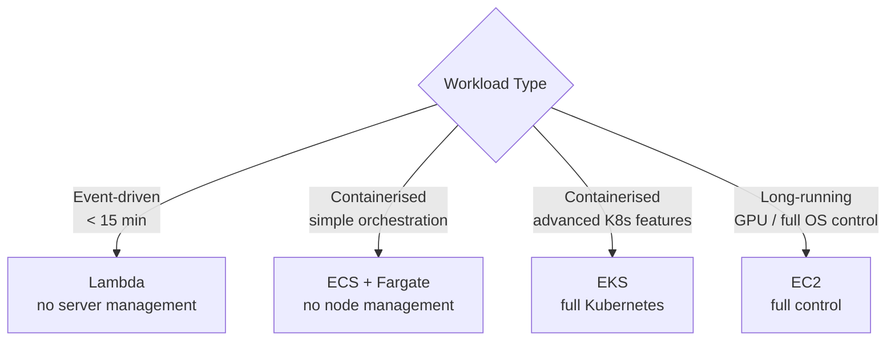

### Pitfalls
- ❌ **Lambda for high-throughput APIs:** 1,000 concurrent Lambdas = 1,000 cold starts; a persistent ECS service handles 10K RPS with far lower latency.
- ❌ **EKS for 3-service startup:** Kubernetes control plane + managed node groups = $150+/month minimum before you run a single container.

### Concept Reference
→ [AWS Quick Reference](../../../quick-reference/aws-cloud/)

---

## Q2: What are the S3 storage classes and when do you use each?
**Role:** Mid-level | **Difficulty:** 🟢 | **Priority:** P0 | **Format:** Quick Answer

> **What the interviewer is testing:** Cost optimisation awareness — S3 storage class choice can cut bills by 70–90% for cold data.

### Answer in 60 seconds
- **S3 Standard:** Frequently accessed data. 99.99% availability. $0.023/GB/month. No retrieval fee.
- **S3 Standard-IA (Infrequent Access):** Accessed ~monthly. 40% cheaper storage ($0.0125/GB) but $0.01/GB retrieval fee. Min 30-day storage charge.
- **S3 One Zone-IA:** Same as IA but single AZ (20% cheaper). Use for re-creatable data — thumbnails, transcoded media.
- **S3 Glacier Instant Retrieval:** Archived data accessed quarterly. ~68% cheaper than Standard. Millisecond retrieval.
- **S3 Glacier Flexible Retrieval:** Cold archive. Retrieval in minutes to 12 hours. ~72% cheaper. Use for compliance backups.
- **S3 Glacier Deep Archive:** Coldest tier, ~95% cheaper ($0.00099/GB). Retrieval in 12–48 hours. Use for 7-year regulatory retention.
- **S3 Intelligent-Tiering:** Automatically moves objects between tiers based on access pattern. $0.0025/1K objects monitoring fee. Best for unknown or changing access patterns.

### Diagram

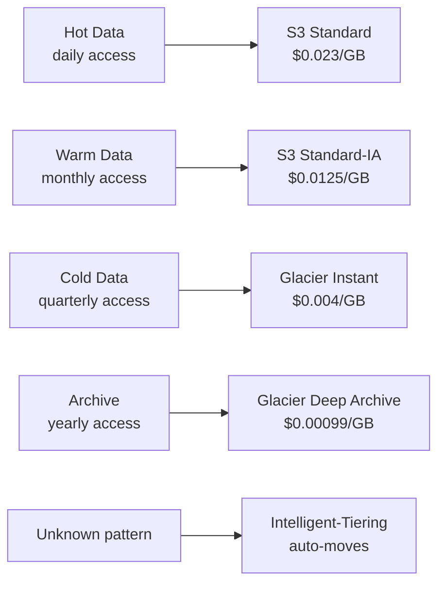

### Pitfalls
- ❌ **Using Standard for all data:** A 50TB audit log in Standard = $1,150/month; Glacier Deep Archive = $50/month — 95% saving.
- ❌ **Ignoring retrieval costs:** Glacier Flexible Retrieval bulk retrieval of 1TB = $2.50, but Expedited = $30 — retrieval tier matters.

### Concept Reference
→ [Cloud Cost Optimization](./cloud-cost-optimization)

---

## Q3: RDS vs Aurora vs DynamoDB — how do you choose for different workloads?
**Role:** Senior | **Difficulty:** 🟡 | **Priority:** P1 | **Format:** Deep Dive

> **What the interviewer is testing:** Whether you can reason about OLTP, OLAP, and NoSQL trade-offs and map them to actual AWS services.

### Problem Constraints
| Dimension | Value |
|-----------|-------|
| RDS max IOPS | 80,000 (io2 Block Express) |
| Aurora read scalability | Up to 15 read replicas, <100ms replica lag |
| DynamoDB single-digit ms | Guaranteed at any scale |
| Aurora Serverless v2 | Scales from 0.5 to 128 ACUs in seconds |
| DynamoDB hot partition limit | 3,000 RCU or 1,000 WCU per partition key |

### Approach A — RDS (PostgreSQL / MySQL)

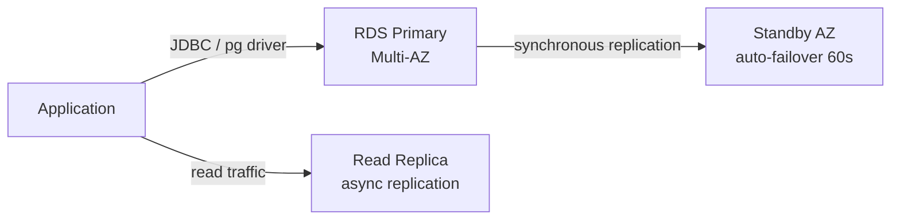

Best for: relational data with complex queries, existing SQL skills, <10TB data, teams that don't want to manage sharding. Multi-AZ provides automatic failover in ~60 seconds.

### Approach B — Aurora (MySQL / PostgreSQL compatible)

Shared distributed storage layer (6 copies across 3 AZs). Write to primary, up to 15 read replicas with <100ms lag. Aurora Global Database replicates cross-region in <1 second. 3× write throughput vs RDS MySQL. Aurora Serverless v2 scales automatically — useful for variable workloads.

### Approach C — DynamoDB (NoSQL key-value / document)

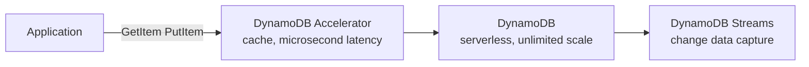

Best for: known access patterns (single-table design), >10M items, global tables, high write throughput (>50K writes/sec), serverless architectures. Bad for: ad-hoc queries, complex JOINs, data you don't fully understand yet.

| Dimension | RDS | Aurora | DynamoDB |
|-|-|-|-|
| Data model | Relational | Relational | Key-value / Document |
| Max storage | 64TB | 128TB (auto) | Unlimited |
| Read replicas | 5 | 15 | Global Tables |
| Latency | 1–5ms | 1–2ms | Single-digit ms |
| Failover | 60s Multi-AZ | 30s | Automatic |
| Cost model | Instance + storage | Instance + I/O | Read/Write units |
| Best for | General OLTP | High-throughput OLTP | Known access patterns |

### Recommended Answer
Default to Aurora PostgreSQL for new OLTP workloads (better than RDS for most cases). Use DynamoDB when access patterns are well-understood and scale is the primary concern. Avoid DynamoDB if you'll have ad-hoc query requirements.

### What a great answer includes
- [ ] Explains Aurora's shared distributed storage (not just "it's faster than RDS")
- [ ] Mentions DynamoDB hot partition problem and the need for good partition key design
- [ ] Knows Aurora Global Database for sub-1-second cross-region replication
- [ ] Considers Aurora Serverless v2 for variable workloads
- [ ] Discusses when NOT to use DynamoDB (unknown query patterns, complex aggregations)

### Pitfalls
- ❌ **"DynamoDB scales infinitely":** A hot partition key (e.g., userId for a viral post) hits the 3,000 RCU/partition limit — design partition keys to distribute load.
- ❌ **Choosing RDS for a new 100M-row, write-heavy table:** RDS single-writer becomes a bottleneck at sustained >10K writes/sec — Aurora or DynamoDB is better.

### Concept Reference
→ [AWS Quick Reference](../../../quick-reference/aws-cloud/)

---

## Q4: What is the difference between SQS, SNS, and EventBridge?
**Role:** Mid-level | **Difficulty:** 🟢 | **Priority:** P1 | **Format:** Quick Answer

> **What the interviewer is testing:** Event-driven architecture pattern recognition and the ability to choose the right AWS messaging primitive.

### Answer in 60 seconds
- **SQS (Simple Queue Service):** Point-to-point queue. One producer → one consumer group. Messages persist for up to 14 days. Standard queue: at-least-once delivery. FIFO queue: exactly-once, ordered. Best for: decoupling services, worker queues, job processing.
- **SNS (Simple Notification Service):** Fan-out pub/sub. One producer → multiple consumers (subscribers). Push-based — SNS delivers to SQS queues, Lambda, HTTP endpoints, email. Best for: broadcasting events to multiple consumers simultaneously.
- **EventBridge:** Event bus with content-based routing rules. Routes events to targets based on event content (JSON pattern matching). Integrates with 200+ AWS services and SaaS partners. Best for: event-driven architectures with complex routing logic.
- **SNS → SQS fan-out pattern:** SNS topic sends to multiple SQS queues — each service gets its own queue and processes independently.

### Diagram

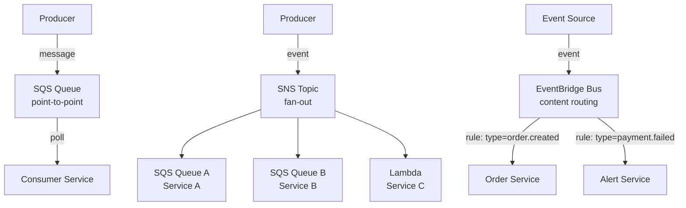

### Pitfalls
- ❌ **SQS for broadcast:** SQS delivers each message to one consumer — if two services need the same event, use SNS → SQS fan-out or EventBridge.
- ❌ **SNS for durable queuing:** SNS does not persist messages — if a subscriber is down, messages are lost. Always pair SNS with SQS for durability.

### Concept Reference
→ [AWS Quick Reference](../../../quick-reference/aws-cloud/)

---

## Q5: How do you design a VPC with public/private subnets, NAT gateway, and security groups?
**Role:** Senior | **Difficulty:** 🟡 | **Priority:** P1 | **Format:** Deep Dive

> **What the interviewer is testing:** Network security fundamentals in AWS — a senior engineer must be able to design a secure VPC without exposing private resources to the internet.

### Problem Constraints
| Dimension | Value |
|-----------|-------|
| VPC CIDR | /16 (65,536 IPs) — standard |
| Subnets per AZ | 1 public + 1 private (minimum 2 AZs) |
| NAT Gateway cost | $0.045/hr + $0.045/GB data |
| Security Group | Stateful firewall at instance level |
| NACL | Stateless firewall at subnet level |

### Approach A — Standard 3-Tier VPC

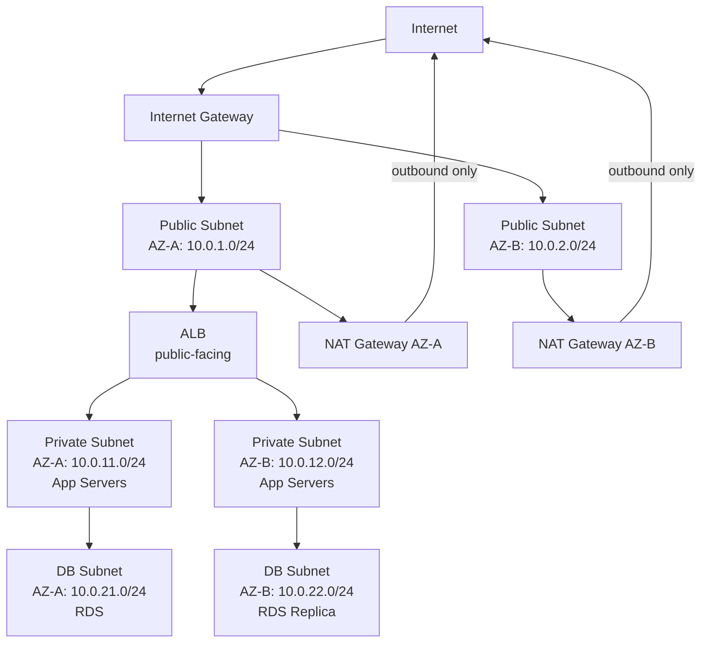

**Security Group design:**
- ALB SG: Inbound 443 from 0.0.0.0/0; outbound 8080 to App SG.
- App SG: Inbound 8080 from ALB SG only; outbound 5432 to DB SG + 443 to 0.0.0.0/0 (via NAT).
- DB SG: Inbound 5432 from App SG only; no outbound to internet.

### Approach B — VPC Endpoints (avoid NAT Gateway for AWS services)

Replace NAT Gateway traffic to S3/DynamoDB/SQS with VPC Gateway/Interface Endpoints. Eliminates $0.045/GB data transfer cost for AWS service traffic. S3 Gateway Endpoint is free.

| Dimension | Public Subnet | Private + NAT | Private + VPC Endpoint |
|-|-|-|-|
| Internet access | Yes | Outbound only | None (AWS services via endpoint) |
| Security | Low | Medium | High |
| Cost | Low | $0.045/hr per NAT | Gateway EP free; Interface EP $0.01/hr |
| Use case | Load balancers | App servers | DB, internal services |

### Recommended Answer
3-tier VPC: public (ALB, NAT GW), private (app servers), DB subnet. Security groups with source-to-source references (not CIDR ranges) for inter-tier rules. VPC Endpoints for S3/SQS to avoid NAT Gateway data charges.

### What a great answer includes
- [ ] Minimum 2 AZs for HA; separate NAT Gateway per AZ to avoid cross-AZ traffic charges
- [ ] Security groups referencing other SGs (not CIDR) for dynamic IP environments
- [ ] VPC Endpoints for AWS services — significant cost saving at scale
- [ ] VPC Flow Logs enabled for security auditing
- [ ] No public IPs on EC2 instances in private subnets

### Pitfalls
- ❌ **Single NAT Gateway:** If the AZ hosting the NAT GW fails, all private subnet instances lose internet access — one NAT GW per AZ.
- ❌ **Overly broad security groups (0.0.0.0/0 ingress):** A common audit finding; every ingress rule should reference a specific SG or /32 CIDR.

### Concept Reference
→ [AWS Quick Reference](../../../quick-reference/aws-cloud/)

---

## Q6: How does CloudFront + S3 work for static site hosting?
**Role:** Senior | **Difficulty:** 🟡 | **Priority:** P2 | **Format:** Quick Answer

> **What the interviewer is testing:** CDN architecture understanding and S3 security configuration for web delivery.

### Answer in 60 seconds
- **S3 bucket:** Store static assets (HTML, CSS, JS, images). Enable S3 Static Website Hosting OR keep it private and use CloudFront OAC (Origin Access Control) to grant CloudFront-only access.
- **CloudFront distribution:** Global CDN with 450+ PoPs. Cache TTL: default 24 hours. Cache hit rate target: >90%.
- **OAC (Origin Access Control):** Replaces OAI (Origin Access Identity). Signs requests from CloudFront to S3 using SigV4. S3 bucket policy denies all public access, only allows CloudFront OAC principal.
- **Custom domain:** Point Route53 ALIAS record to CloudFront distribution domain. ACM certificate (must be in us-east-1 for CloudFront).
- **Cache invalidation:** `aws cloudfront create-invalidation --paths "/*"` — costs $0.005 per path (first 1,000 free/month). Better to use content-hashed filenames to avoid invalidation.
- **Performance numbers:** CloudFront P95 latency from nearest PoP: 5–20ms. Origin request rate (cache miss): typically <10%.

### Diagram

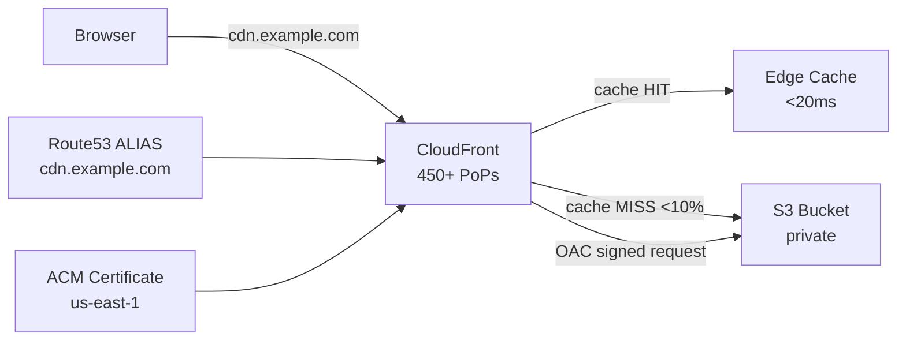

### Pitfalls
- ❌ **S3 Static Website Hosting with public bucket:** Public S3 buckets are a security liability — use CloudFront OAC with private bucket instead.
- ❌ **Invalidating `/*` on every deploy:** At 1,000+ paths this costs money and is slow (5–10 min); use content-hashed filenames (`app.abc123.js`) so old cached files expire naturally.

### Concept Reference

---

## Q7: What are the Route53 routing policies and when do you use each?
**Role:** Senior | **Difficulty:** 🟡 | **Priority:** P2 | **Format:** Quick Answer

> **What the interviewer is testing:** DNS-level traffic engineering knowledge for multi-region and HA architectures.

### Answer in 60 seconds
- **Simple:** Single resource, no health checks. Use for single-server dev/test environments.
- **Weighted:** Distribute traffic by percentage (80/20). Use for canary deployments or blue-green at DNS level. TTL 60s.
- **Latency-based:** Route to the AWS region with lowest latency for the user. Use for multi-region active-active deployments.
- **Failover:** Primary + secondary (standby). Route to secondary only if primary health check fails. Use for active-passive DR.
- **Geolocation:** Route by user country/continent. Use for data residency requirements (EU users → EU region).
- **Geoproximity:** Route by physical distance with bias (can expand/shrink the region's "catchment area"). Requires Traffic Flow.
- **Multivalue Answer:** Return up to 8 healthy records, each with health check. Client-side load balancing. Cheap alternative to an ELB for simple cases.

### Diagram

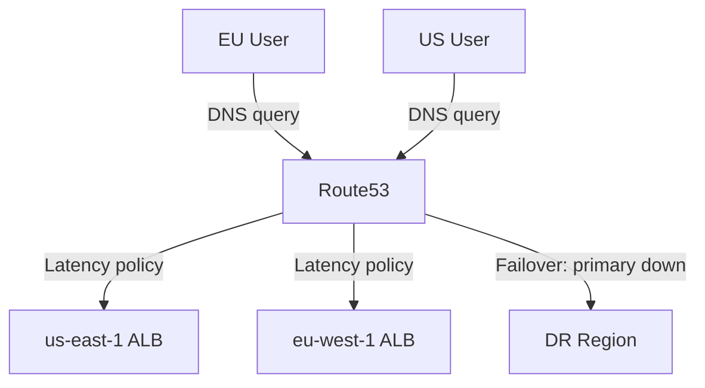

### Pitfalls
- ❌ **Failover with long TTL:** A 5-minute TTL means 5 minutes of downtime before DNS failover takes effect — set health check + failover records to TTL 60s.
- ❌ **Using Geolocation for latency optimisation:** Geolocation routes by country, not latency — a user in France might get routed to eu-west-1 even if us-east-1 is closer. Use Latency-based for performance.

### Concept Reference
→ [AWS Quick Reference](../../../quick-reference/aws-cloud/)

---

## Q8: How do you design IAM policies following least-privilege for a multi-account AWS setup?
**Role:** Staff | **Difficulty:** 🔴 | **Priority:** P2 | **Format:** Deep Dive

> **What the interviewer is testing:** Enterprise AWS security posture — multi-account strategy and the ability to implement least-privilege at scale.

### Problem Constraints
| Dimension | Value |
|-----------|-------|
| AWS accounts | 50–200 (one per team or environment) |
| IAM users | Zero (use SSO/identity federation) |
| Permission boundary | Prevent privilege escalation |
| Audit requirement | CloudTrail in all accounts, centralised |
| Cross-account access | IAM role assumption only |

### Approach A — AWS Organizations + AWS SSO (IAM Identity Center)

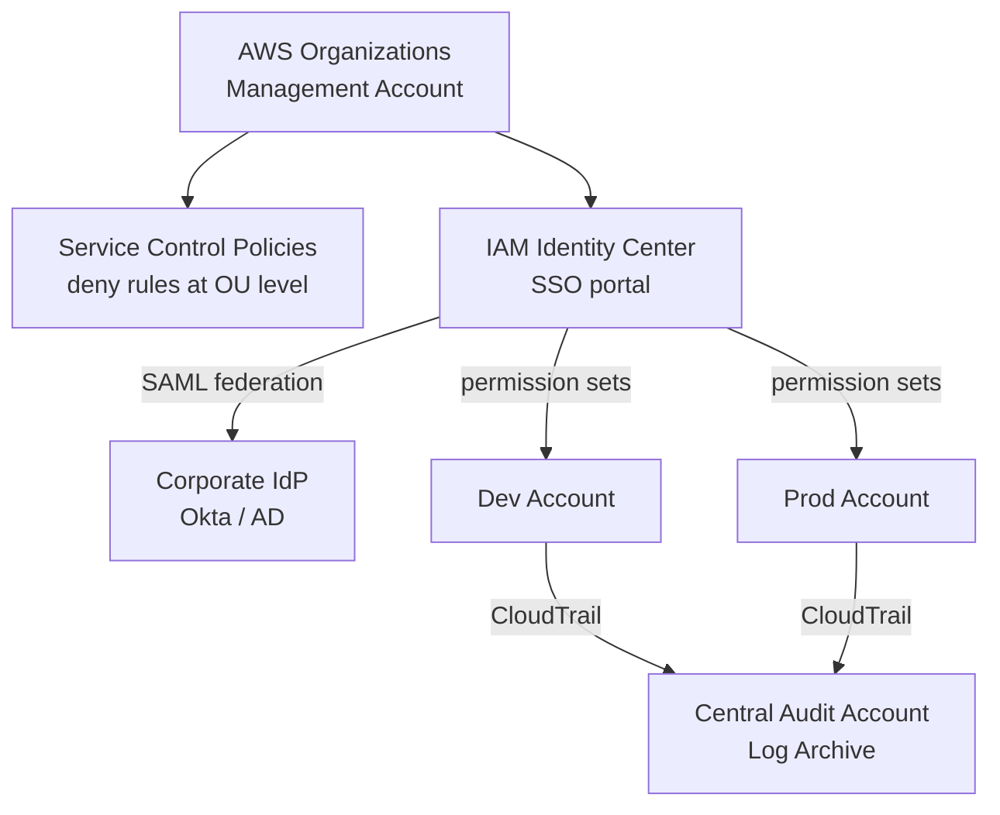

**Key components:**
- **Management account:** Only for billing and organization management. No workloads.
- **SCPs (Service Control Policies):** Applied at OU level. Deny guardrails — e.g., "deny all actions outside us-east-1 and eu-west-1" or "deny creating IAM users." Cannot be overridden by account admins.
- **Permission sets:** Defined in IAM Identity Center; assigned to groups from IdP. Materialise as IAM roles in each member account.
- **Permission boundaries:** Attached to roles to prevent them from creating roles with more privileges than their own.

### Approach B — Cross-Account Role Assumption

Service in Account A assumes a role in Account B. Trust policy on the role in Account B specifies the principal from Account A. MFA/condition keys can restrict when assumption is allowed.

| Dimension | IAM Users | SSO + Permission Sets | Cross-Account Roles |
|-|-|-|-|
| Long-lived credentials | Yes (risk) | No (session tokens) | No (assumed role) |
| Centralised audit | Difficult | Native | Per-account CloudTrail |
| Scalability to 100+ accounts | Very poor | Good | Good |
| Human access | Yes | Preferred | No (service-to-service) |
| Service access | Yes (access key) | No | Preferred |

### Recommended Answer
AWS Organizations with OUs + SCPs for guardrails; IAM Identity Center + IdP federation for human access; cross-account IAM role assumption for service-to-service; zero IAM users in member accounts; permission boundaries on all customer-managed roles.

### What a great answer includes
- [ ] SCPs as organisation-wide deny guardrails (cannot be overridden)
- [ ] Zero IAM users in member accounts — all access via SSO or role assumption
- [ ] Permission boundaries to prevent privilege escalation
- [ ] Centralised CloudTrail to a dedicated audit account (with deny-delete policy)
- [ ] Least-privilege review process: use IAM Access Analyzer to identify unused permissions after 90 days

### Pitfalls
- ❌ **Wildcard actions in policies (`Action: "*"`):** Grants every current and future AWS action — review tools like IAM Access Analyzer flag these as overly permissive.
- ❌ **No SCP guardrails:** Without SCPs, an account admin can create an IAM user with AdministratorAccess and bypass all controls.

### Concept Reference
→ [AWS Quick Reference](../../../quick-reference/aws-cloud/)

---

## Q9: How does Auto Scaling Group handle scale-in vs scale-out with cooldown periods?
**Role:** Staff | **Difficulty:** 🟡 | **Priority:** P2 | **Format:** Quick Answer

> **What the interviewer is testing:** Operational knowledge of ASG scaling mechanics and how to prevent thrashing.

### Answer in 60 seconds
- **Scale-out:** CloudWatch alarm triggers (e.g., CPUUtilization > 70% for 2 minutes). ASG launches new EC2 instances. Target tracking policy aims to maintain a metric at a target value (e.g., average CPU = 50%).
- **Scale-in:** CPUUtilization < 30% for 5 minutes triggers termination. ASG selects instance to terminate using termination policy (default: oldest launch template, then closest to billing hour).
- **Default cooldown (300 seconds):** After a scaling activity, ASG waits 300 seconds before evaluating another alarm. Prevents thrashing during metric stabilisation.
- **Instance warmup:** New instances take time to start handling traffic. During warmup period, their metrics are excluded from the aggregate — prevents premature scale-in right after scale-out.
- **Scaling protection:** Individual instances can be marked `ProtectedFromScaleIn` — prevents them from being terminated during scale-in (e.g., instance running a long job).

### Diagram

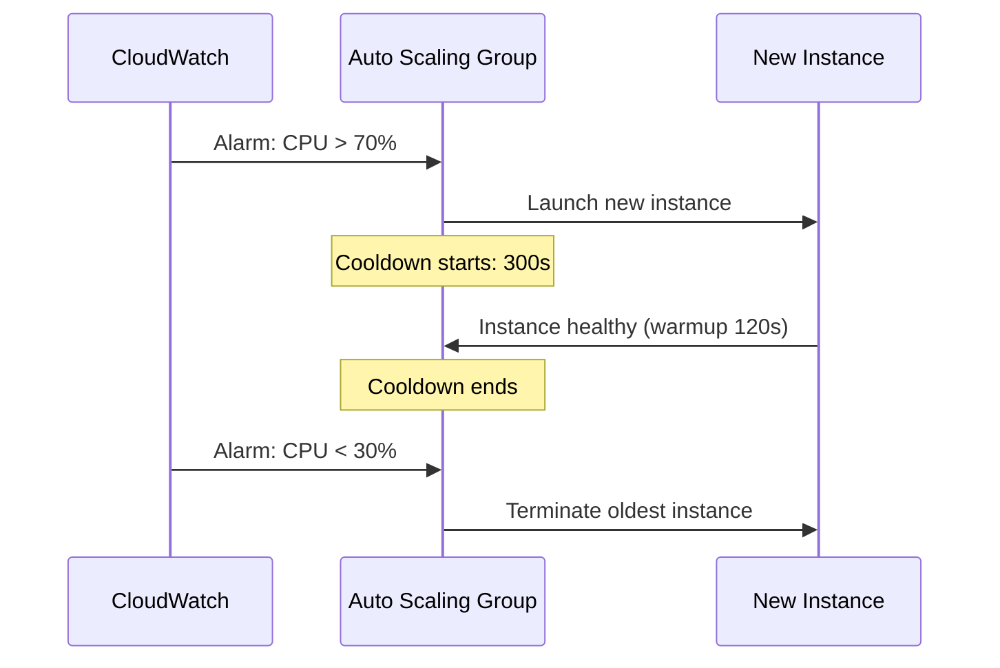

### Pitfalls
- ❌ **Scale-out cooldown too short:** A bursty workload that spikes every 2 minutes will keep triggering scale-out before new instances are fully warm — set cooldown ≥ your app startup time.
- ❌ **No instance warmup:** Without warmup, ASG counts a freshly-launched instance at 0% CPU — the aggregate drops, triggering premature scale-in while the new instance is still initialising.

### Concept Reference
→ [Cloud Cost Optimization](./cloud-cost-optimization)

---

## Q10: Design AWS architecture for a SaaS application with 100K users — compute, DB, caching, CDN, monitoring
**Role:** Senior | **Difficulty:** 🔴 | **Priority:** P1 | **Format:** Scenario
**Real Company:** Notion, Linear (SaaS on AWS with similar scale)

### The Brief
> "Design an AWS architecture for a B2B SaaS product launching next quarter. Projected: 100K active users, 10K concurrent users at peak, 50 API requests per user per minute. The team is 10 engineers, budget-conscious, and needs 99.9% uptime (8.7 hrs downtime/year)."

### Clarifying Questions
1. Single-region or multi-region? (99.9% can be achieved single-region with Multi-AZ)
2. Stateful or stateless backend? (impacts session design)
3. Read-heavy or write-heavy API mix? (impacts cache strategy)
4. Any regulatory data residency requirements?
5. Expected data volume — GB or TB?

### Back-of-Envelope Estimation
| Metric | Calculation | Result |
|-|-|-|
| Peak API RPS | 10K users × 50 req/min / 60 | ~8,300 RPS |
| DB connections | 8,300 RPS × 0.1 DB queries avg | ~830 queries/sec |
| Cache hit target | 70% cache hit | 830 × 0.3 = 250 DB queries/sec actual |
| EC2 sizing | 8,300 RPS / 500 RPS per m5.xlarge | ~17 instances → 20 with headroom |
| Monthly cost estimate | 20 × m5.xlarge + Aurora + ElastiCache | ~$3,500/month |

### High-Level Architecture

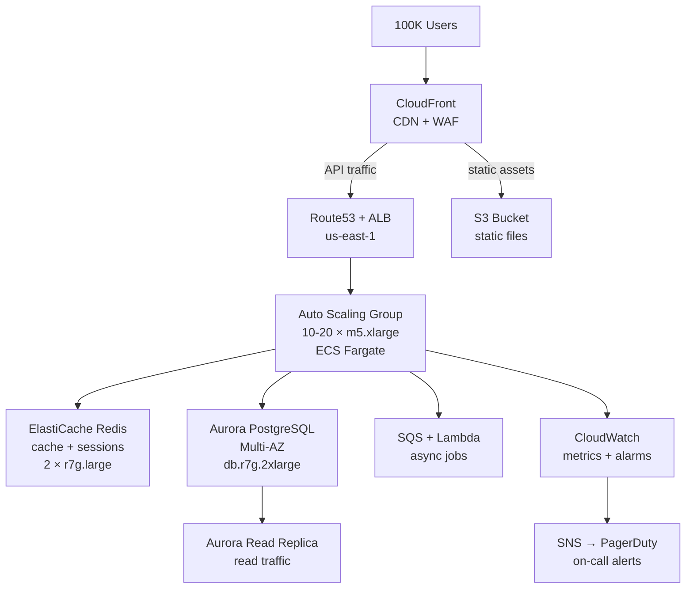

### Trade-off Decisions
| Decision | Option A | Option B | Chosen | Why |
|-|-|-|-|-|
| Compute | EC2 ASG | ECS Fargate | ECS Fargate | No node management; 10-engineer team |
| Database | RDS PostgreSQL | Aurora PostgreSQL | Aurora | 3× write throughput, 15 read replicas, faster failover |
| Caching | Memcached | ElastiCache Redis | Redis | Supports sessions, pub/sub, sorted sets |
| CDN | No CDN | CloudFront | CloudFront | Reduce latency + absorb DDoS at edge |
| Monitoring | Datadog ($) | CloudWatch + Grafana | CloudWatch + Grafana | Cost-effective for startup |

### Failure Modes
| Failure | Impact | Mitigation |
|-|-|-|
| AZ failure | 50% capacity loss | Multi-AZ ALB + ASG + Aurora Multi-AZ |
| DB primary failure | ~30s downtime | Aurora auto-failover <30s |
| Cache failure | DB load spike 3× | Cache-aside pattern; DB handles load; alert to add nodes |
| DDoS | API unavailable | CloudFront + AWS Shield Standard (free) + WAF rate limiting |
| Deployment failure | 503 errors during rollout | ECS rolling deploy with health check gate + 2-min rollback |

### Concept References
→ [AWS Quick Reference](../../../quick-reference/aws-cloud/)
