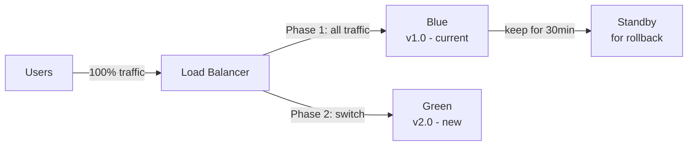
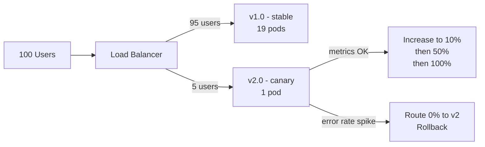
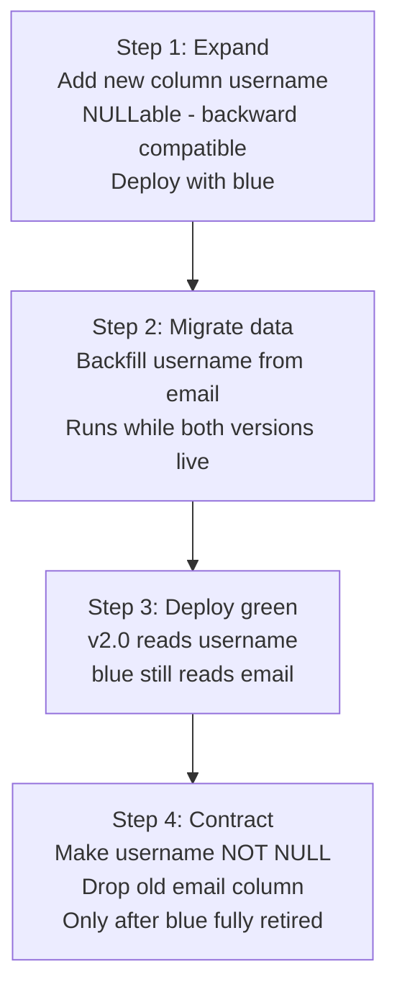
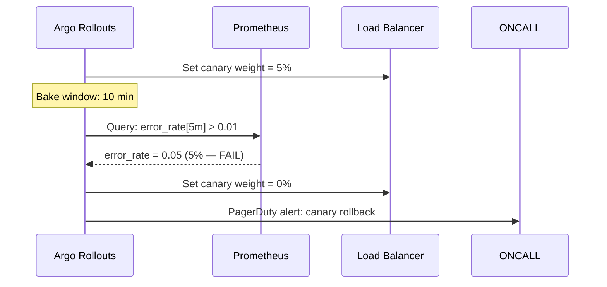
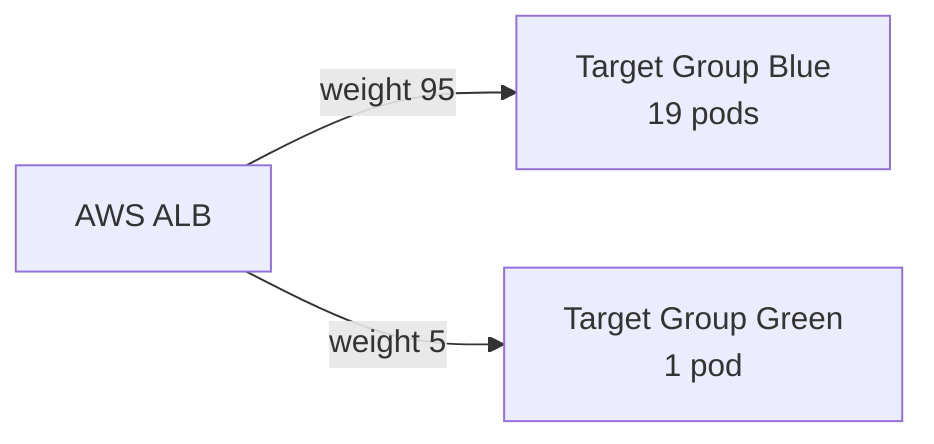
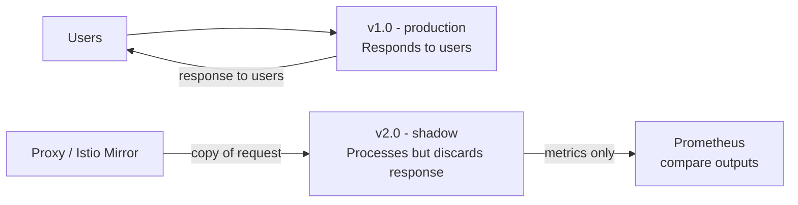
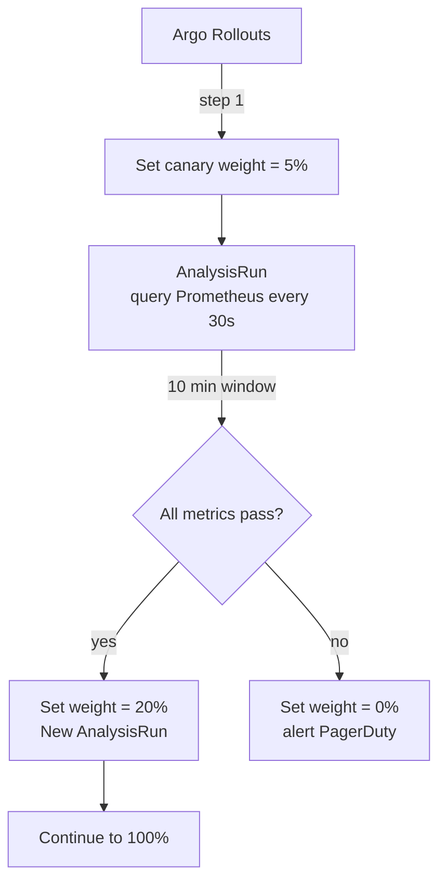
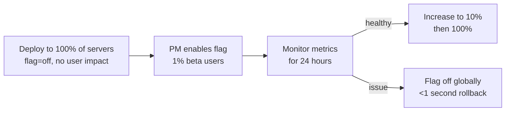
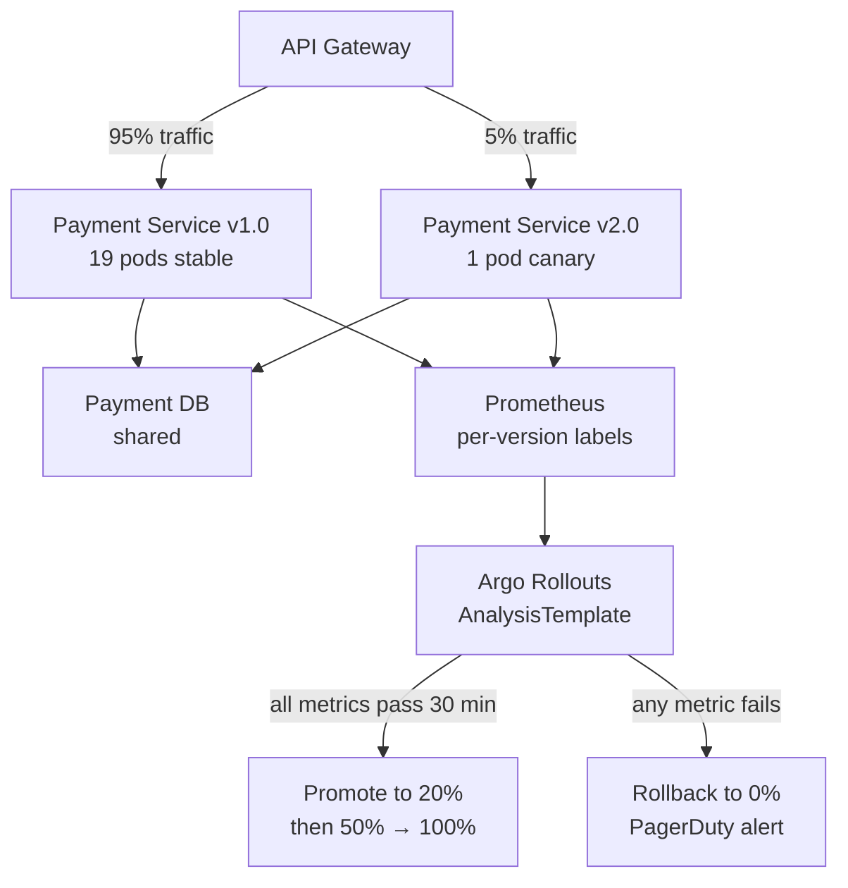

# Blue-Green & Canary Deployments — Interview Questions

10 questions covering deployment strategies, database migrations, traffic splitting, shadow launches, and Facebook/payment service design.

---

## Q1: What is a blue-green deployment and how does it achieve zero downtime?
**Role:** Mid-level, DevOps | **Difficulty:** 🟢 | **Priority:** P0 | **Format:** Quick Answer

> **What the interviewer is testing:** Understanding of the most fundamental zero-downtime deployment pattern before exploring more advanced strategies.

### Answer in 60 seconds
- **Blue-green:** Maintain two identical production environments — "blue" (current live) and "green" (new version). Deploy new version to green, run tests, then switch traffic from blue to green instantly.
- **Traffic switch mechanism:** DNS update (TTL ~60s), load balancer listener rule change (instant, <1s), or weighted routing policy.
- **Zero downtime:** Traffic switches atomically — no partial rollout. All users see either blue or green, never a mix.
- **Rollback:** Switch traffic back to blue in <1 second (load balancer) or ~60 seconds (DNS). Blue environment stays running for 15–30 minutes after switch to enable fast rollback.
- **Cost:** Requires ~2× capacity during deployment. With cloud autoscaling, spin up green on demand and terminate blue after bake period.

### Diagram



### Pitfalls
- ❌ **Not testing green before switch:** Deploy to green, run smoke tests first — don't switch traffic to an untested environment.
- ❌ **Terminating blue immediately after switch:** Keep blue running for at least 15–30 minutes to enable fast rollback if metrics degrade.

### Concept Reference
→ [CI/CD Pipeline Design](./cicd-pipeline-design)

---

## Q2: What is a canary deployment and how does it differ from blue-green?
**Role:** Mid-level | **Difficulty:** 🟢 | **Priority:** P1 | **Format:** Quick Answer

> **What the interviewer is testing:** Understanding of risk-reduction through progressive rollouts, and the trade-offs vs blue-green.

### Answer in 60 seconds
- **Canary deployment:** Route a small percentage of traffic (typically 1–5%) to the new version. Monitor metrics. If healthy, progressively increase: 1% → 10% → 50% → 100%. Named after "canary in a coal mine" — catch problems before full rollout.
- **vs Blue-Green:**
  - Blue-green: all-or-nothing switch. Faster, but full impact if the new version has a bug.
  - Canary: gradual, controlled exposure. Slower, but limits blast radius to 1–5% of users.
- **When to use canary:** User-facing features, payment flows, high-risk backend changes, new algorithms.
- **When to use blue-green:** Infrastructure changes, dependency upgrades, when you need instant rollback and have 2× capacity.
- **Metrics window:** Typically 10–30 minutes of canary traffic before deciding to proceed.

### Diagram



### Pitfalls
- ❌ **Canary without metrics analysis:** Deploying 5% without watching error rates and latency is just "rolling deployment" — the analysis is what makes it a canary.
- ❌ **Too small a canary sample:** 1% of 100 users = 1 user — statistically meaningless. Need at least 100 requests to the canary for valid error rate comparison.

### Concept Reference
→ [CI/CD Pipeline Design](./cicd-pipeline-design)

---

## Q3: How do you handle database migrations in a blue-green deployment?
**Role:** Senior | **Difficulty:** 🔴 | **Priority:** P1 | **Format:** Deep Dive

> **What the interviewer is testing:** The hardest part of zero-downtime deployments — incompatible DB schema changes are the #1 cause of deploy rollbacks.

### Problem Constraints
| Dimension | Value |
|-----------|-------|
| Problem | Blue and green run simultaneously against the same DB |
| Risk | Schema change incompatible with v1.0 code breaks blue |
| Rollback constraint | After migration runs, rollback may require reverse migration |
| Zero-downtime requirement | No table locks; no downtime during schema change |

### Approach A — Expand/Contract Pattern (Additive Migrations)



**Key principle:** Never make a schema change in the same deployment as a code change. Separate into 3 deploys: (1) additive schema, (2) dual-read code, (3) cleanup schema.

### Approach B — Feature-Toggled Dual Writes

New version writes to both old and new schema simultaneously. Old version continues to read from old schema. After full migration, remove the feature toggle and old schema.

### Approach C — PostgreSQL Online Schema Change Tools

Use `pg_repack` or `pglogical` for large table schema changes without locking. `pg_repack` rebuilds the table online in ~5% of the time of a standard `ALTER TABLE`. For MySQL: `pt-online-schema-change` or `gh-ost`.

| Dimension | Expand/Contract | Dual Write | Online DDL Tools |
|-|-|-|-|
| Complexity | Medium | High | Medium |
| Risk of data loss | Low | Low | Low |
| Applicable to | Any DB | Any DB | PostgreSQL/MySQL |
| Large table support | Slow (full scan) | Works | Best (<1% table lock) |
| Rollback | Easy (column nullable) | Easy (toggle off) | Difficult (no undo) |

### Recommended Answer
Expand/Contract is the standard answer. Explain the 3-deploy sequence. For large tables (>10M rows), mention pg_repack or gh-ost to avoid locking. For complex migrations, dual writes with feature flags.

### What a great answer includes
- [ ] Identifies that the core problem is two code versions sharing one DB
- [ ] Explains the expand/contract pattern with concrete column example
- [ ] Notes that destructive operations (DROP COLUMN) are always the last step, after old version is retired
- [ ] Mentions online schema change tools for large tables
- [ ] Discusses migration testing in staging on production-sized data

### Pitfalls
- ❌ **Deploying schema and code change together:** If the new column is NOT NULL and v1.0 code doesn't set it, every insert from v1.0 fails during the overlap period.
- ❌ **ALTER TABLE on a large table without online DDL:** `ALTER TABLE ADD COLUMN NOT NULL DEFAULT` on a 500M-row table can lock the table for 30+ minutes.

### Concept Reference
→ [CI/CD Pipeline Design](./cicd-pipeline-design)

---

## Q4: How do you implement automatic rollback in a canary deployment?
**Role:** Senior | **Difficulty:** 🟡 | **Priority:** P1 | **Format:** Quick Answer

> **What the interviewer is testing:** Whether you can define measurable rollback triggers — not just "if something goes wrong."

### Answer in 60 seconds
- **Rollback triggers (define specific thresholds):**
  - Error rate: canary 5xx rate > 1% (vs baseline <0.1%)
  - Latency: canary p99 > 500ms (vs baseline 200ms)
  - Business metric: canary checkout completion < 95% of baseline
  - Saturation: canary CPU > 90% sustained 2 minutes
- **Automated analysis:** Argo Rollouts + Prometheus metrics. Define `AnalysisTemplate` with metric queries. Argo Rollouts compares canary vs baseline and pauses/rolls back automatically.
- **Rollback action:** Set canary weight to 0%, scale down canary Pods, alert on-call via PagerDuty.
- **Bake time:** Define minimum observation window (e.g., 10 minutes at 5% before increasing to 20%).

### Diagram



### Pitfalls
- ❌ **Only monitoring error rate:** A canary that returns 200 but with 3× latency is also broken — include p99 latency in rollback triggers.
- ❌ **Rollback trigger too sensitive:** Transient 30-second spikes trigger unnecessary rollbacks — use a sustained threshold (e.g., error rate > 1% for 5 consecutive minutes).

### Concept Reference
→ [Observability](../../../system-design/scale-and-reliability/observability)

---

## Q5: How do you implement traffic splitting — at load balancer, DNS, or application level?
**Role:** Senior | **Difficulty:** 🟡 | **Priority:** P2 | **Format:** Deep Dive

> **What the interviewer is testing:** Understanding of the three layers where traffic can be split and the trade-offs of each approach.

### Problem Constraints
| Dimension | Value |
|-----------|-------|
| Traffic split accuracy | Load balancer: exact %; DNS: approximate (TTL-dependent) |
| Split granularity | Can split by user segment, not just random % |
| Stickiness requirement | Same user should not flip between versions mid-session |
| Rollback speed | Load balancer: <1s; DNS: 60s minimum |

### Approach A — Load Balancer Weighted Target Groups (AWS ALB)



AWS ALB supports weighted target groups natively. Instant weight changes via API. Sticky sessions (cookie-based) can ensure a user always hits the same version. Tools: AWS CodeDeploy, Argo Rollouts.

### Approach B — DNS-Level Splitting (Route53 Weighted Policy)

Route53 weighted routing: blue DNS record weight=95, green DNS record weight=5. Approximate split due to DNS caching (TTL). Not sticky at user level. Slower to change (TTL propagation). Use for multi-region, not for granular canary.

### Approach C — Application-Level Splitting (Feature Flags / Service Mesh)

Service mesh (Istio): `VirtualService` routes 5% of requests to v2 based on headers or random sampling. Supports user-segment routing (e.g., only beta users get v2). Feature flags (LaunchDarkly): split by user attributes, not just traffic percentage.

| Dimension | Load Balancer | DNS Weighted | Istio / Service Mesh |
|-|-|-|-|
| Granularity | Traffic % | Traffic % (approximate) | Header, user attribute, % |
| Stickiness | Cookie-based | None | Header-based |
| Rollback speed | <1 second | 60+ seconds | <1 second |
| User-level targeting | No | No | Yes |
| Cost | Free (ALB) | $0.50/policy | Service mesh overhead (~5% CPU) |

### Recommended Answer
Load balancer weighted routing for simple canary (most teams). Istio/service mesh for header-based routing (e.g., beta users or internal employees get new version first). DNS-level for multi-region A/B testing, not fine-grained canary.

### What a great answer includes
- [ ] Distinguishes traffic percentage split from user-segment targeting
- [ ] Explains session stickiness risk (user sees both versions mid-session)
- [ ] Knows AWS ALB weighted target groups as the practical tool
- [ ] Mentions Istio for sophisticated routing rules (header matching)
- [ ] Notes that DNS TTL makes DNS-level splitting imprecise for canary

### Pitfalls
- ❌ **DNS canary without sticky sessions:** A user can get blue on request 1 and green on request 2 — if v2 changed the session token format, the user gets logged out.
- ❌ **Istio without observability:** Service mesh is useless for canary without the metrics layer (Prometheus + Kiali) to see the split in action.

### Concept Reference
→ [Load Balancing](../../../system-design/fundamentals/load-balancing)

---

## Q6: What is a shadow deployment (dark launch) and when do you use it?
**Role:** Senior | **Difficulty:** 🟡 | **Priority:** P2 | **Format:** Quick Answer

> **What the interviewer is testing:** Knowledge of risk-free production validation techniques beyond canary.

### Answer in 60 seconds
- **Shadow deployment:** Mirror a copy of production traffic to a new version running in parallel. The new version processes requests but its responses are discarded — users only see v1 responses. No user impact.
- **Use cases:**
  - Validate a new algorithm's output against the current one without user risk.
  - Load-test a new service at production traffic volume before launch.
  - Test a new database query layer without affecting users.
- **Implementation:** Istio `VirtualService` traffic mirroring, AWS Lambda traffic duplication, or an Envoy proxy side-car.
- **Limitations:** Cannot test user-visible changes (UI, UX). Idempotency required — if v2 writes to DB, you'll have duplicate writes unless using a shadow database.
- **Named "dark launch"** by Facebook: new features deployed to production but invisible to users until explicitly enabled.

### Diagram



### Pitfalls
- ❌ **Shadow mode with DB writes:** Shadow service writing to production DB doubles your write load and corrupts data — use a shadow/test database for shadow deployments.
- ❌ **Ignoring shadow metrics:** Shadow deployment is only useful if you actively compare v2 metrics (latency, output differences) vs v1 — set up dashboards before launching shadow.

### Concept Reference
→ [Observability](../../../system-design/scale-and-reliability/observability)

---

## Q7: How does Facebook deploy code to 1% of users first before full rollout?
**Role:** Staff | **Difficulty:** 🔴 | **Priority:** P2 | **Format:** Quick Answer

> **What the interviewer is testing:** Understanding of the feature flag + percentage rollout pattern at hyperscale, including the organisational process.

### Answer in 60 seconds
- **GateKeeper (Facebook's internal system):** Feature flag service that controls which users see which features. Flags defined in a central service; evaluated per-request by the application.
- **Rollout process:** Feature deployed to 100% of servers with flag OFF. Engineers enable flag for: 1) Facebook employees (dogfooding), 2) 1% of users, 3) 10%, 4) 50%, 5) 100%.
- **User-level stickiness:** A user always gets the same experience — assignment based on `hash(user_id + feature_name) % 100`. Deterministic, no DB lookup per request.
- **Metrics monitoring:** Automated dashboards show error rate, latency, and engagement (likes, comments, shares) for flag=on vs flag=off cohorts. P50/P99 compared in real-time.
- **Fast rollback:** Flag turned off globally in <1 second — no redeployment needed. Impact: 0 users affected within one DNS TTL.
- **Scale:** Facebook evaluates billions of flag checks per second with microsecond overhead.

### Diagram

```mermaid
graph LR
  REQUEST[User Request] --> GK[GateKeeper\nevaluate flag]
  GK -->|hash(userId) % 100 < 1| NEW[New Feature\nflag=on for 1%]
  GK -->|hash(userId) % 100 >= 1| OLD[Current Feature\nflag=off for 99%]
  GK --> METRICS[Log cohort\nfor A/B analysis]
```

### Pitfalls
- ❌ **Random flag evaluation per request:** If the flag is re-evaluated randomly on each page load, a user sees a flickering UI that switches between old/new on each click — use deterministic hashing.
- ❌ **No holdback group:** Without a permanent 1% holdback (flag always=off), you can't measure long-term metric impact after full rollout — keep a holdback for A/B comparison.

### Concept Reference
→ [CI/CD Pipeline Design](./cicd-pipeline-design)

---

## Q8: How do you set up canary analysis to automatically detect a bad deployment?
**Role:** Staff | **Difficulty:** 🔴 | **Priority:** P2 | **Format:** Deep Dive

> **What the interviewer is testing:** Statistical rigour and tooling knowledge for automated deployment safety gates.

### Problem Constraints
| Dimension | Value |
|-----------|-------|
| Canary traffic | 5% of production |
| Analysis window | 10–30 minutes |
| Baseline | Current stable version (same % traffic for fair comparison) |
| False positive rate | <5% (don't rollback healthy deploys) |
| False negative rate | <1% (don't miss bad deploys) |

### Approach A — Argo Rollouts + Prometheus AnalysisTemplate



**AnalysisTemplate metrics:**
- `success-rate`: `sum(rate(http_requests_total{status!~"5.."}[5m])) / sum(rate(http_requests_total[5m]))` — must be > 0.99
- `latency-p99`: `histogram_quantile(0.99, rate(http_request_duration_bucket[5m]))` — must be < 500ms
- Compare canary pod metric vs baseline pod metric using label selectors

### Approach B — Statistical Analysis (Kayenta / Spinnaker)

Netflix Kayenta uses Mann-Whitney U test to compare canary vs baseline metric distributions. More statistically rigorous than threshold comparison — detects subtle degradations that threshold checks miss. Requires tuning of significance level (default: 0.05).

| Dimension | Threshold Comparison | Statistical (Kayenta) |
|-|-|-|
| Setup complexity | Low | High |
| False positive rate | Medium (spiky metrics) | Low (statistical tolerance) |
| Detects subtle degradation | No (only exceeds threshold) | Yes (distribution shift) |
| Required traffic | Low (100 requests) | Higher (1,000+ for significance) |
| Real-world use | Argo Rollouts (most teams) | Netflix, Spinnaker users |

### Recommended Answer
Argo Rollouts with a Prometheus AnalysisTemplate covering error rate and p99 latency — sufficient for 95% of teams. For critical services (payments), add business metric checks (transaction success rate). Kayenta for statistically rigorous analysis on high-traffic services.

### What a great answer includes
- [ ] Distinguishes canary group from baseline group (both instrumented)
- [ ] Names at least 3 metrics to monitor (error rate, p99 latency, business KPI)
- [ ] Explains the analysis window duration and why it matters (enough traffic for significance)
- [ ] Mentions the promotion vs rollback decision boundary
- [ ] Knows Argo Rollouts or Spinnaker as the implementation tool

### Pitfalls
- ❌ **Comparing canary to global average:** Global average mixes canary and baseline — create separate Prometheus labels for canary vs stable pods.
- ❌ **Bake time too short:** A 2-minute analysis window at 5% traffic may see only 50 requests — not enough to detect a 2% error rate increase statistically.

### Concept Reference
→ [Observability](../../../system-design/scale-and-reliability/observability)
→ [CI/CD Pipeline Design](./cicd-pipeline-design)

---

## Q9: How do feature flags replace deployment strategies for low-risk releases?
**Role:** Staff | **Difficulty:** 🟡 | **Priority:** P3 | **Format:** Quick Answer

> **What the interviewer is testing:** Nuanced understanding of when feature flags are superior to deployment strategies for controlling risk.

### Answer in 60 seconds
- **Feature flag as a deployment strategy:** Deploy code to 100% of servers with flag=off. Enable flag gradually (1% → 10% → 100%) without any infrastructure change or redeployment.
- **Advantages over canary/blue-green:**
  - Rollback in <1 second (toggle flag) vs 30–60 seconds for Kubernetes rollout undo.
  - Works at user segment level (premium users first, not random 5%).
  - Enables A/B testing — measure business impact, not just technical metrics.
  - No 2× capacity cost (unlike blue-green).
- **Limitations:**
  - Flag debt: old flags left in code create technical debt and testing complexity.
  - Not suitable for: infrastructure changes (server type), dependency upgrades, breaking API changes that don't align with flags.
  - Adds complexity to testing — must test flag=on and flag=off code paths.
- **Best use:** UI features, new algorithms, pricing changes, experimental features — anything that can be expressed as "show feature X to users in set Y."

### Diagram



### Pitfalls
- ❌ **Flags as a substitute for testing:** Feature flags reduce deployment risk but don't replace test coverage — the flag=off code path still needs tests.
- ❌ **Permanent flags:** A flag active for >6 months signals it should either be fully rolled out or removed — track flag age in your feature flag service.

### Concept Reference
→ [CI/CD Pipeline Design](./cicd-pipeline-design)

---

## Q10: Design a canary deployment strategy for a payment service — traffic split, metrics, rollback triggers
**Role:** Senior | **Difficulty:** 🔴 | **Priority:** P1 | **Format:** Scenario
**Real Company:** Stripe (deploys payment API changes with canary strategy)

### The Brief
> "You're deploying a critical change to the payment processing service that handles $1M/hour in transactions. The change modifies the fraud detection algorithm. Design the canary deployment: traffic split %, monitoring, rollback triggers, and the decision criteria for promoting to 100%."

### Clarifying Questions
1. What is the baseline error rate for the payment service? (sets rollback threshold)
2. What is the acceptable SLA degradation during canary? (<0.1% additional failures?)
3. What is the dollar impact per percentage point of error rate increase?
4. How long does a transaction take? (impacts analysis window — need enough transactions)
5. Who has authority to promote vs rollback? (automated or human decision)

### Back-of-Envelope Estimation
| Metric | Calculation | Result |
|-|-|-|
| Transaction rate | $1M/hr / $50 avg transaction | 20,000 transactions/hr = 333/min |
| 5% canary traffic | 333/min × 0.05 | ~17 transactions/min to canary |
| Analysis window for significance | 17 tx/min × 30 min | ~500 transactions (sufficient) |
| Max acceptable additional failures | 0.1% of 333/min | 0.33 failures/min extra |
| Dollar impact of 1% error increase | 333/min × 1% × $50 | $166/min = $10K/hr |

### High-Level Architecture



### Trade-off Decisions
| Decision | Option A | Option B | Chosen | Why |
|-|-|-|-|-|
| Initial canary % | 1% (safe) | 10% (faster) | 1% for 15 min then 5% | Payment: prioritise safety over speed |
| Rollback trigger | Error rate > 1% | Error rate > 0.1% above baseline | 0.1% above baseline | $10K/hr per 1% — low threshold warranted |
| Analysis tool | Manual monitoring | Argo Rollouts auto-analysis | Argo Rollouts | Human reaction time too slow for payment failures |
| Promotion authority | Auto after metrics pass | Human approval + metrics | Human approval + metrics | Regulatory/compliance: human sign-off on payment changes |
| Analysis window | 10 min (fast) | 60 min (thorough) | 30 min at each step | Balance between speed and statistical significance |

### Failure Modes
| Failure | Impact | Mitigation |
|-|-|-|
| Fraud model returns false positives | Legitimate transactions declined at 5% traffic | Error rate alert + human review queue spike |
| DB connection pool exhausted | All payment requests fail | Circuit breaker; canary pod has isolated connection pool |
| Canary pod OOM | 5% of traffic drops | Readiness probe removes pod from LB within 30s |
| Analysis false positive (metric spike) | Healthy deploy rolled back | 5-minute sustained threshold, not point-in-time |
| Fraud false negatives (new model too lenient) | Fraudulent transactions processed | Business metric: chargeback rate (delayed — monitor for 48 hrs post-rollout) |

### Concept References
→ [CI/CD Pipeline Design](./cicd-pipeline-design)
→ [Observability](../../../system-design/scale-and-reliability/observability)
→ [Load Balancing](../../../system-design/fundamentals/load-balancing)
