# CI/CD Pipeline Design — Interview Questions

10 questions covering CI vs CD, pipeline stages, parallel testing, secrets management, environment promotion, and Netflix-scale deployment.

---

## Q1: What is the difference between CI, CD (delivery), and CD (deployment)?
**Role:** Mid-level, DevOps | **Difficulty:** 🟢 | **Priority:** P0 | **Format:** Quick Answer

> **What the interviewer is testing:** Whether you can precisely define the three pipeline phases — a prerequisite for all deeper CI/CD questions.

### Answer in 60 seconds
- **Continuous Integration (CI):** Automatically build and test every code commit. Goal: detect integration errors within minutes. Typically runs unit tests, lint, static analysis. Target: <5 min feedback loop.
- **Continuous Delivery (CD — delivery):** Every build that passes CI is automatically packaged and deployable to production, but requires a **manual approval gate** before the actual deployment. Reduces release friction without removing human oversight.
- **Continuous Deployment (CD — deployment):** Fully automated — every green build goes to production **with no human gate.** Requires exceptional test coverage (>80% branch coverage), feature flags, and automated canary analysis.

### Diagram

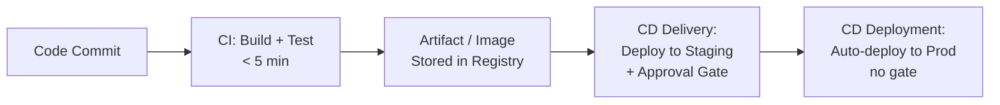

### Pitfalls
- ❌ **Calling all pipelines "CI/CD":** A pipeline that only builds but never deploys is just CI — knowing the distinction matters for architecture discussions.
- ❌ **Continuous Deployment without feature flags:** Shipping every commit to prod without the ability to disable a feature is how you cause 3am incidents.

### Concept Reference
→ [Blue-Green & Canary Deployments](./blue-green-canary-deployments)

---

## Q2: What are the typical stages of a CI/CD pipeline?
**Role:** Mid-level | **Difficulty:** 🟢 | **Priority:** P0 | **Format:** Quick Answer

> **What the interviewer is testing:** Whether you can design a pipeline that balances thoroughness with speed.

### Answer in 60 seconds
- **Stage 1 — Source:** Checkout code; validate branch protection rules.
- **Stage 2 — Build:** Compile / transpile; produce deterministic artifact (Docker image, JAR, binary).
- **Stage 3 — Unit Tests:** Fast isolated tests; target <2 min; gate: 0 failures.
- **Stage 4 — Static Analysis / SAST:** Lint, type check, secret scanning (detect-secrets, truffleHog), OWASP dependency check.
- **Stage 5 — Integration Tests:** Tests against real dependencies (DB, queue); target <5 min with Docker Compose or ephemeral namespaces.
- **Stage 6 — Container Scan:** Scan image for CVEs (Trivy, Snyk). Fail on Critical/High CVEs.
- **Stage 7 — Publish Artifact:** Push to container registry (ECR, GCR, GHCR) with immutable tag (`git-sha`).
- **Stage 8 — Deploy to Dev/Staging:** Auto-deploy; run smoke tests.
- **Stage 9 — Approval Gate (CD delivery) or Auto-promote (CD deployment).**
- **Stage 10 — Production Deploy:** Blue-green or canary; post-deploy health check.

### Diagram

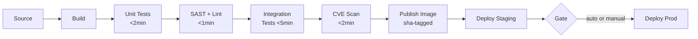

### Pitfalls
- ❌ **Putting E2E tests in the critical path:** Full Selenium/Cypress suites take 30–60 min; run them async in parallel while staging deploy proceeds.
- ❌ **Mutable image tags ("latest"):** `latest` can change between staging and production deploy, breaking immutable deployment guarantees.

### Concept Reference
→ [Blue-Green & Canary Deployments](./blue-green-canary-deployments)

---

## Q3: How do you implement parallel test execution to reduce pipeline time from 20min to 5min?
**Role:** Senior | **Difficulty:** 🟡 | **Priority:** P1 | **Format:** Deep Dive

> **What the interviewer is testing:** Whether you can re-architect a pipeline for speed without sacrificing reliability.

### Problem Constraints
| Dimension | Value |
|-----------|-------|
| Current pipeline time | 20 minutes (sequential) |
| Target pipeline time | 5 minutes |
| Test suite size | 2,000 unit tests + 200 integration tests |
| Available parallel workers | 8 (GitHub Actions, GitLab runners) |

### Approach A — Matrix Parallelism (Split by file/module)

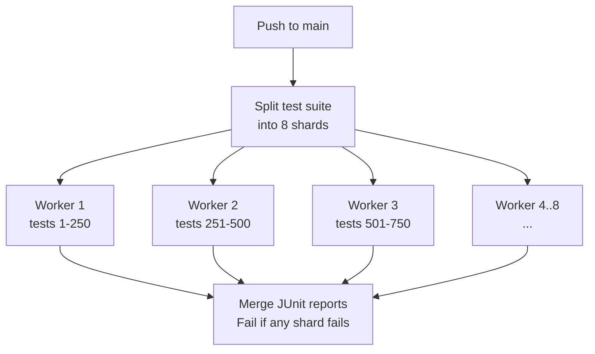

GitHub Actions: `strategy.matrix` with `--shard N/8` (Vitest/Jest). Test time: 20 min / 8 = ~2.5 min.

### Approach B — Stage Parallelism (Run independent stages simultaneously)

Run unit tests, SAST scan, and dependency audit concurrently in the same pipeline instead of sequentially. Each takes ~3 min independently but serial = 9 min.

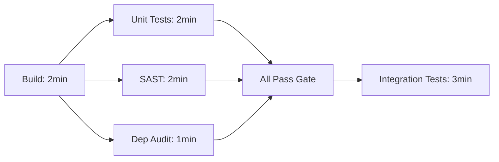

### Approach C — Test Result Caching + Change-based Test Selection

Cache test results by file hash. Only rerun tests for files that changed (affected test detection). Tools: Nx, Turborepo, Bazel. Can reduce test count by 70% on most commits.

| Dimension | Matrix Sharding | Stage Parallelism | Change-based Selection |
|-|-|-|-|
| Always-reliable | Yes | Yes | Risky without good dep graph |
| Speed gain | 8× on test stage | 3× overall | 70% reduction on common commits |
| Setup effort | Low | Medium | High (requires monorepo tooling) |
| Flakiness risk | Low | Low | Medium (missed deps) |

### Recommended Answer
Combine approaches: parallel stages (unit+SAST+security simultaneously) for quick wins, then matrix sharding for the test stage. Add result caching as a Phase 2 optimisation. Typical result: 20 min → 4–6 min.

### What a great answer includes
- [ ] Identifies that sequential stages are the root cause, not test speed
- [ ] Proposes specific tooling (jest --shard, GitHub Actions matrix)
- [ ] Addresses test isolation — shards must not share state/DB
- [ ] Mentions caching build artifacts between pipeline steps (~1 min saved)
- [ ] Defines the merge/join step and how failure in one shard fails the pipeline

### Pitfalls
- ❌ **Shared databases between parallel shards:** Two shards inserting the same test data causes race conditions and flaky tests — use ephemeral DBs per shard.
- ❌ **Ignoring flaky tests in sharded pipelines:** A 2% flaky test in 1 shard means 16% failure rate across 8 shards — fix flakiness before parallelising.

### Concept Reference
→ [Blue-Green & Canary Deployments](./blue-green-canary-deployments)

---

## Q4: How do you manage secrets in a CI/CD pipeline safely?
**Role:** Senior | **Difficulty:** 🟡 | **Priority:** P1 | **Format:** Quick Answer

> **What the interviewer is testing:** Security-first thinking around the most common source of credential leaks.

### Answer in 60 seconds
- **Never store secrets in source code or pipeline YAML.** Even in private repos — git history is permanent.
- **CI provider secrets store:** GitHub Actions Encrypted Secrets, GitLab CI Variables (masked), CircleCI Contexts. Secrets are injected as env vars; not printed in logs.
- **External secret manager (preferred for production):** AWS Secrets Manager, HashiCorp Vault, GCP Secret Manager. Pipeline authenticates via OIDC (not long-lived keys) to fetch secrets at runtime.
- **OIDC-based auth (best practice):** GitHub Actions supports OIDC — your pipeline gets a short-lived token to assume an AWS IAM role. No AWS_ACCESS_KEY_ID stored anywhere.
- **Secret scanning:** Run `detect-secrets` or `truffleHog` as a pre-commit hook and in CI to catch accidental commits.
- **Rotation:** Rotate all long-lived credentials every 90 days; prefer short-lived tokens (OIDC, STS AssumeRole) that expire in minutes.

### Diagram

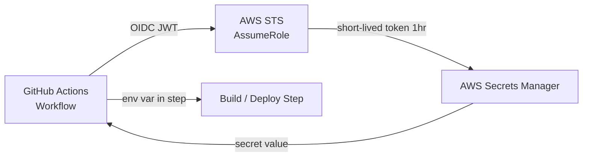

### Pitfalls
- ❌ **Logging secret env vars in debug mode:** `set -x` in bash scripts prints every variable including secrets — always use `set +x` around secret usage.
- ❌ **Hard-coded secrets in Dockerfile ENV layers:** Docker image layers are inspectable; env vars set during build appear in `docker history`.

### Concept Reference
→ [Infrastructure as Code](./infrastructure-as-code) for Vault integration in IaC

---

## Q5: How do you implement environment promotion (dev → staging → production)?
**Role:** Senior | **Difficulty:** 🟡 | **Priority:** P1 | **Format:** Deep Dive

> **What the interviewer is testing:** Understanding of promotion gates, configuration differences across environments, and immutable artifact discipline.

### Problem Constraints
| Dimension | Value |
|-----------|-------|
| Environments | dev, staging, prod (minimum) |
| Promotion trigger | Passing test gate + approval |
| Artifact strategy | Same image tag promoted — never rebuilt |
| Config difference | Only env-specific config changes (not code) |
| Rollback time target | <2 minutes |

### Approach A — GitOps Promotion (ArgoCD / Flux)

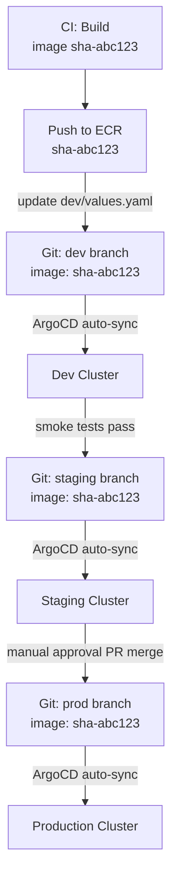

**Key principle:** Git is the single source of truth. Promoting = merging a PR or updating the image tag in the appropriate env values file. Rollback = reverting the Git commit.

### Approach B — Pipeline-Driven Promotion (Jenkins, GitHub Actions)

Sequential stages in one pipeline. Each environment is a stage with its own tests and gate. Artifact is the same Docker image tag throughout. Config injected per environment via Helm values or Kubernetes ConfigMaps.

| Dimension | GitOps (ArgoCD) | Pipeline-driven |
|-|-|-|
| Audit trail | Git history = full audit | Pipeline logs (harder to query) |
| Rollback | `git revert` — 30 sec | Re-run pipeline with old tag |
| Drift detection | ArgoCD shows diff in real-time | No native drift detection |
| Complexity | Medium (GitOps tooling) | Low (existing CI tooling) |
| Multi-cluster | Native | Manual per-cluster jobs |

### Recommended Answer
For new systems, GitOps with ArgoCD. Existing pipelines: add an explicit promotion job that updates the image tag in an env-specific Helm values file. Emphasise: same image tag across all environments — never rebuild for staging.

### What a great answer includes
- [ ] Immutable artifact principle: image built once, deployed everywhere
- [ ] Config separation: Helm values / ConfigMap per environment, not code branches
- [ ] Approval gate mechanism (PR merge, manual pipeline approval, or automated gate based on metrics)
- [ ] Rollback path: git revert or re-deploy previous image tag
- [ ] Environment parity: staging should mirror production size and data (anonymised)

### Pitfalls
- ❌ **Different Dockerfiles per environment:** Staging passes, prod fails because the build was different — one Dockerfile, one image.
- ❌ **No staging data parity:** Bugs that only appear at production data volume will be caught only in production.

### Concept Reference
→ [Blue-Green & Canary Deployments](./blue-green-canary-deployments)

---

## Q6: How do you implement automatic rollback when a deployment fails health checks?
**Role:** Senior | **Difficulty:** 🟡 | **Priority:** P2 | **Format:** Quick Answer

> **What the interviewer is testing:** Production engineering discipline around safe deployments and automated recovery.

### Answer in 60 seconds
- **Kubernetes Deployment:** Set `progressDeadlineSeconds: 120`. If new Pods don't reach Ready state within 120s, the Deployment controller marks it failed. Add a CI step: `kubectl rollout status --timeout=2m` — if it exits non-zero, run `kubectl rollout undo deployment/my-app`.
- **Health check gates:** Configure liveness (restart on failure) and readiness probes (remove from service on failure). Readiness probe must return HTTP 200 before traffic routes to new Pod.
- **Automated canary rollback:** Deploy to 5% of traffic, measure error rate and latency for 10 min. If error rate >1% or p99 >500ms, automated rollback. Tools: Argo Rollouts, Spinnaker Kayenta.
- **Rollback time:** `kubectl rollout undo` → <60 seconds for most Deployments.

### Diagram

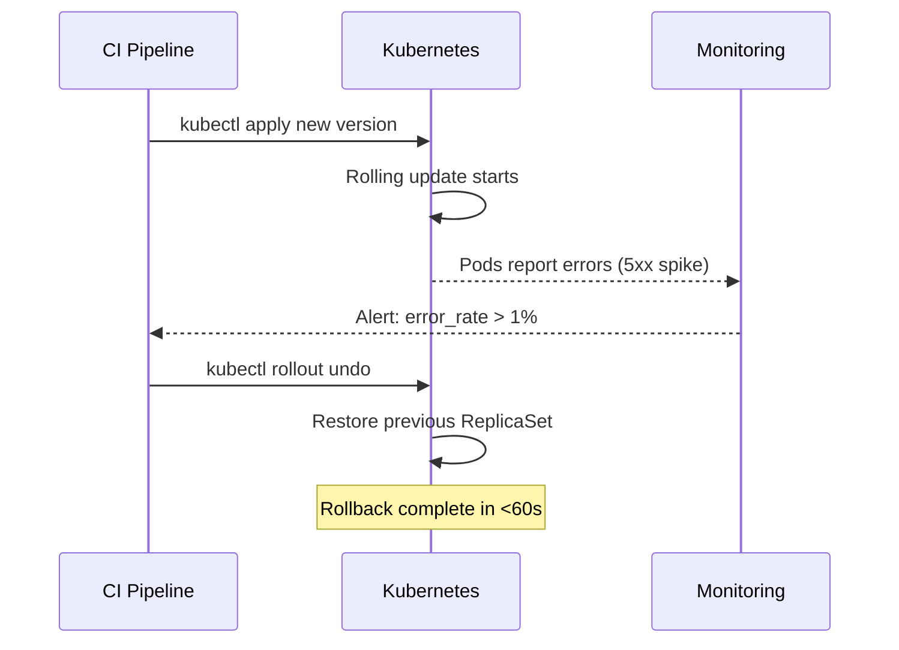

### Pitfalls
- ❌ **Rolling back without checking the rollback version:** `rollout undo` goes to the previous revision — if that was also bad (e.g., DB migration issue), you need to specify an explicit revision number.
- ❌ **Rollback doesn't fix DB migrations:** If the new code ran a non-backward-compatible migration, rolling back the code doesn't un-run the migration — design migrations to be backward-compatible.

### Concept Reference
→ [Blue-Green & Canary Deployments](./blue-green-canary-deployments)

---

## Q7: What is pipeline as code and what are the benefits (Jenkinsfile, GitHub Actions)?
**Role:** Senior | **Difficulty:** 🟡 | **Priority:** P2 | **Format:** Quick Answer

> **What the interviewer is testing:** Understanding of why infrastructure and pipelines should be version-controlled like application code.

### Answer in 60 seconds
- **Pipeline as code:** CI/CD pipeline definition stored in the repository alongside application code, not in a separate UI or server config.
- **Formats:** `Jenkinsfile` (Groovy DSL), `.github/workflows/*.yml` (GitHub Actions), `.gitlab-ci.yml`, `Dockerfile` + `buildspec.yml` (AWS CodeBuild).
- **Benefits:**
  - **Version control:** Pipeline changes are reviewed in PRs — no undocumented "UI clickops" changes.
  - **Reproducibility:** Any branch can have its own pipeline variation; feature branch can test a new pipeline stage without affecting main.
  - **Auditability:** `git blame` shows who changed the deployment step and why.
  - **Reusability:** GitHub Actions Reusable Workflows, Jenkins Shared Libraries — define once, use across 100 repos.
  - **Disaster recovery:** Recreate the entire CI/CD system from git — no server-side state.

### Diagram

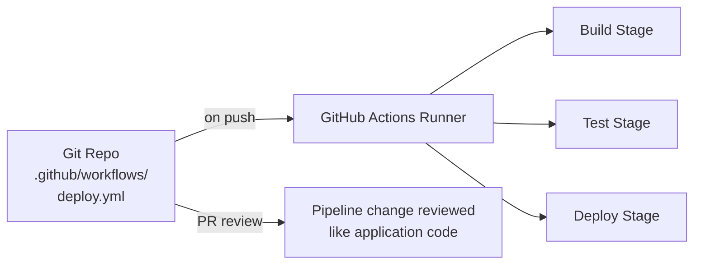

### Pitfalls
- ❌ **Secrets in pipeline YAML:** Even pipeline-as-code has a common mistake — `echo $SECRET` or hardcoded credentials in workflow files.
- ❌ **No reuse — copy-paste across 50 repos:** Updating a security scan step in 50 `.github/workflows` files manually is error-prone; use Reusable Workflows or composite actions.

### Concept Reference
→ [Infrastructure as Code](./infrastructure-as-code)

---

## Q8: How does Netflix deploy 100+ times per day safely?
**Role:** Staff | **Difficulty:** 🔴 | **Priority:** P2 | **Format:** Deep Dive

> **What the interviewer is testing:** Whether you understand the organisational and technical patterns required for high-frequency deployment at scale.

### Problem Constraints
| Dimension | Value |
|-----------|-------|
| Deployments per day | 100+ (across 1,000+ microservices) |
| Engineers | ~2,000 (each team deploys independently) |
| Availability target | 99.99% (52 min downtime/year) |
| Global users | 200M+ in 190 countries |

### Approach A — Spinnaker + Canary Analysis (Netflix OSS)

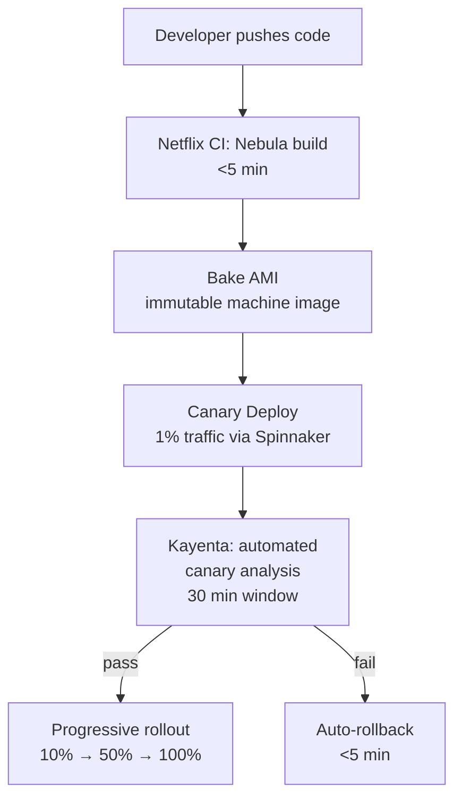

**Key Netflix practices:**
- **Immutable AMIs:** "Bake" a new AMI per build — never SSH and update a running instance. Rollback = terminate new ASG instances.
- **Spinnaker pipelines:** Defines multi-stage deployment as code; manages canary percentage, rollback triggers, and multi-region sequencing.
- **Kayenta:** Statistical canary analysis compares canary vs baseline on 100+ metrics. Automatically fails deployment if canary is statistically worse.
- **Feature flags:** LaunchDarkly and internal systems allow decoupling deploy from release — code is shipped dark, enabled for 0.1% → 1% → all users.
- **Chaos Engineering:** Chaos Monkey randomly terminates instances in production — every service must tolerate failures, making deployments safer.

### Approach B — Trunk-Based Development + Feature Flags

All engineers commit to `main` (no long-lived feature branches). Feature flags gate unfinished code. This eliminates merge conflicts and integration delays. Requires disciplined flag hygiene (remove flags within 2 weeks).

| Dimension | Canary + Spinnaker | Trunk + Feature Flags |
|-|-|-|
| Rollback mechanism | AMI rollback (<5min) | Toggle flag off (<1min) |
| Risk mitigation | Progressive traffic shift | Code always deployed, feature gated |
| Required test coverage | High (auto canary) | Very high (flag permutations) |
| Infrastructure cost | 2× capacity during canary | Normal (no extra instances) |

### Recommended Answer
Netflix combines: trunk-based development + immutable AMI bake + Spinnaker canary with Kayenta automated analysis + Chaos Engineering. The key insight is that high deployment frequency is only safe with automated rollback, statistical canary analysis, and feature flags.

### What a great answer includes
- [ ] Immutable infrastructure (AMI bake, not in-place updates)
- [ ] Statistical canary analysis (Kayenta) — not just error rate, but latency distribution
- [ ] Feature flags for deploy-vs-release decoupling
- [ ] Chaos Engineering as a prerequisite for deployment confidence
- [ ] Team autonomy: each team deploys independently without a release manager

### Pitfalls
- ❌ **"They just deploy more carefully":** Netflix deploys confidently because of automated rollback — speed and safety are not trade-offs with the right tooling.
- ❌ **Copying Spinnaker without the culture:** The tooling is open-source; the organisational discipline (trunk-based dev, mandatory canary analysis) is harder to replicate.

### Concept Reference
→ [Blue-Green & Canary Deployments](./blue-green-canary-deployments)

---

## Q9: How do you use feature flags in your CI/CD pipeline to decouple deploy from release?
**Role:** Staff | **Difficulty:** 🟡 | **Priority:** P2 | **Format:** Quick Answer

> **What the interviewer is testing:** Advanced deployment strategy understanding — feature flags as a first-class deployment primitive.

### Answer in 60 seconds
- **Deploy vs release:** Deploy = code on servers. Release = feature visible to users. Feature flags decouple these events.
- **Flag lifecycle:** Create flag → deploy code (flag=off) → test in production (flag=internal users) → gradual rollout (1% → 10% → 100%) → remove flag after 2 weeks.
- **Types:**
  - **Kill switch:** Instant disable in production without redeployment. P99 incident mitigation in <30 seconds.
  - **Percentage rollout:** Roll out to N% of users, increase if metrics are healthy.
  - **User targeting:** Enable for specific user IDs (beta testers, employees).
- **Tools:** LaunchDarkly, Unleash (open-source), AWS AppConfig, Flagsmith.
- **In CI/CD:** Pipeline deploys code with all flags off. Separate release process (PM/EM approval) flips the flag. If metrics degrade, flag off instantly — no redeployment needed.

### Diagram

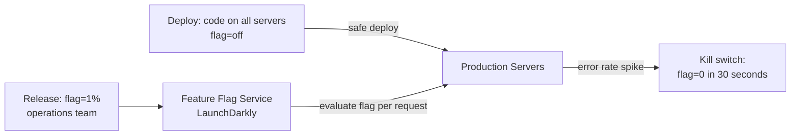

### Pitfalls
- ❌ **Flag debt:** Old flags never removed accumulate to 200+ flags with unknown interaction effects — enforce a TTL policy (flags removed within 14 days of full rollout).
- ❌ **Testing only with flag=on:** Test the flag=off path too — the code must be correct in both states.

### Concept Reference
→ [Blue-Green & Canary Deployments](./blue-green-canary-deployments)

---

## Q10: Design a CI/CD pipeline for a microservices app with 20 services — test, build, security scan, deploy
**Role:** Senior | **Difficulty:** 🔴 | **Priority:** P1 | **Format:** Scenario
**Real Company:** Spotify (500+ microservices, Backstage for developer portal)

### The Brief
> "You're the lead engineer at a 200-person startup with 20 backend microservices in a monorepo. Each service is a separate Docker container. The CTO asks you to design the CI/CD pipeline: every commit should run tests for affected services only, build and scan images, and deploy to staging automatically with production requiring manual approval."

### Clarifying Questions
1. Monorepo or polyrepo? (impacts change detection strategy)
2. Target deployment platform — Kubernetes on EKS, or serverless?
3. What languages? (test tooling, base image choices)
4. What is the target pipeline time? (affects parallelism investment)
5. Who approves production deploys? (approval workflow design)

### Back-of-Envelope Estimation
| Metric | Calculation | Result |
|-|-|-|
| Daily commits | 50 engineers × 4 commits/day | 200 commits/day |
| Pipeline time (sequential) | 20 services × 3 min/service | 60 min (unacceptable) |
| Pipeline time (parallel, affected only) | Avg 2 services per commit × 3 min | 3–6 min |
| Image storage | 20 services × 10 tags × 500MB | 100GB ECR per month |
| Scanner time | Trivy scan per image | ~45 seconds |

### High-Level Architecture

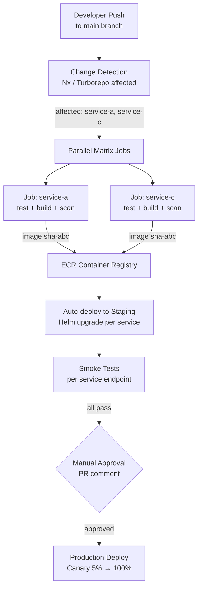

### Trade-off Decisions
| Decision | Option A | Option B | Chosen | Why |
|-|-|-|-|-|
| Monorepo CI | Run all 20 services | Affected-only (Nx) | Affected-only | 200 commits/day × 60 min = unsustainable |
| Image tagging | `latest` | `git-sha` immutable | `git-sha` | Reproducible deploys, easy rollback |
| Staging deploy | Spinnaker | Helm + ArgoCD | Helm + ArgoCD | Lighter, GitOps native |
| Production gate | Time-based | Manual approval + metrics | Manual + metrics | Risk balance for a growing team |
| Security scan | Snyk SaaS | Trivy (open-source) | Trivy | Cost-free, fast (~45s), good coverage |

### Failure Modes
| Failure | Impact | Mitigation |
|-|-|-|
| Change detection false negative | Modified service not tested | Dependency graph validation; e2e tests always run for shared libs |
| Registry push failure | Staging deploy blocked | Retry with exponential backoff; alert on 3 consecutive failures |
| Staging deploy timeout | Block on production gate | Auto-rollback staging; Slack alert to on-call |
| Approval gate bypassed | Untested code in prod | Branch protection + required approvals in GitHub |
| Canary metric spike | Bad code at 5% traffic | Argo Rollouts auto-pause + Slack alert with runbook link |

### Concept References
→ [Blue-Green & Canary Deployments](./blue-green-canary-deployments)
→ [Container Orchestration](./container-orchestration)
→ [Kubernetes Architecture](./kubernetes-architecture)
