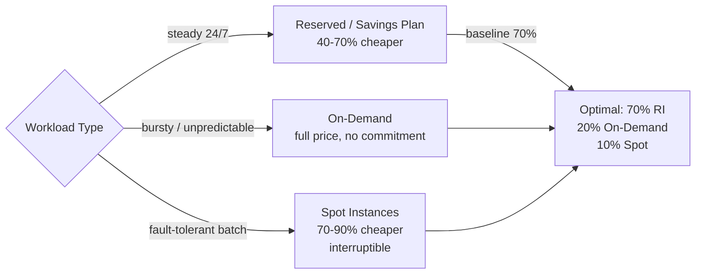
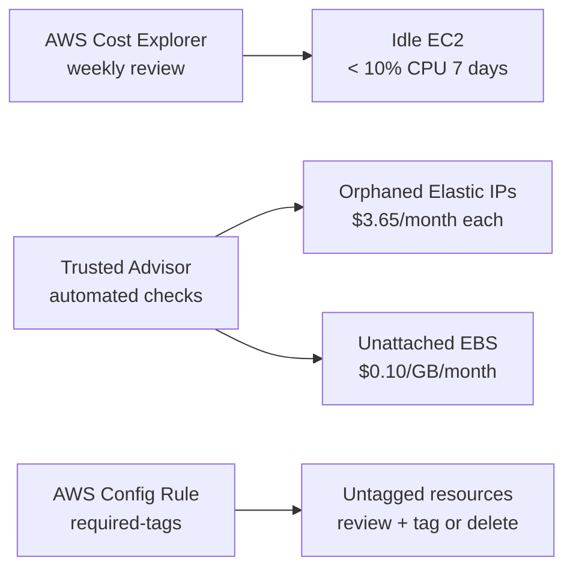
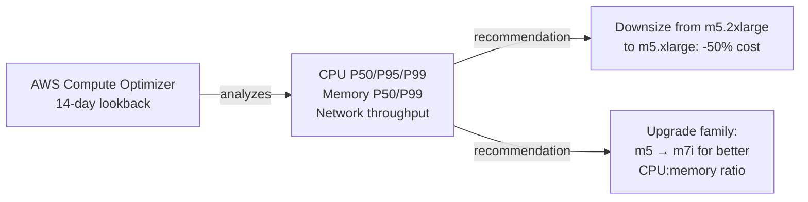
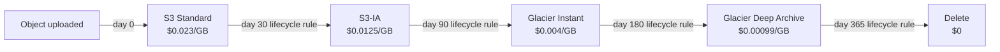
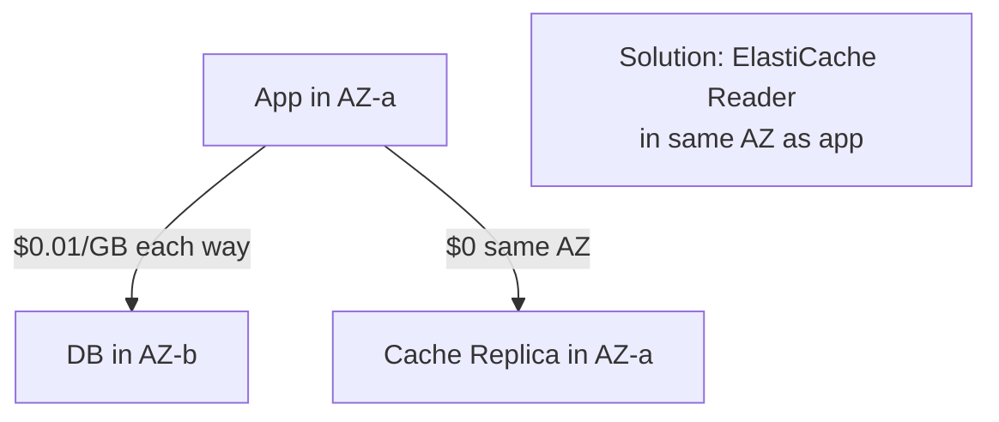
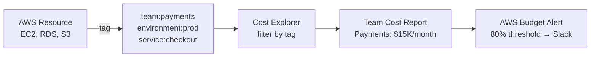
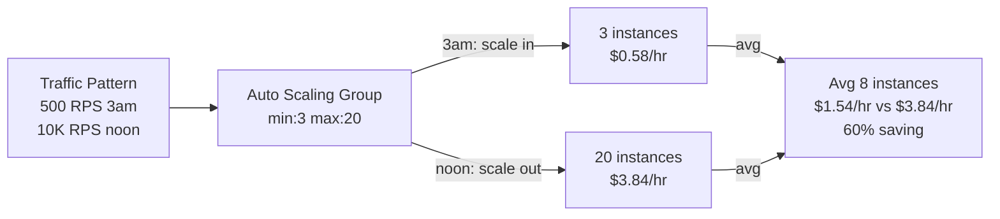
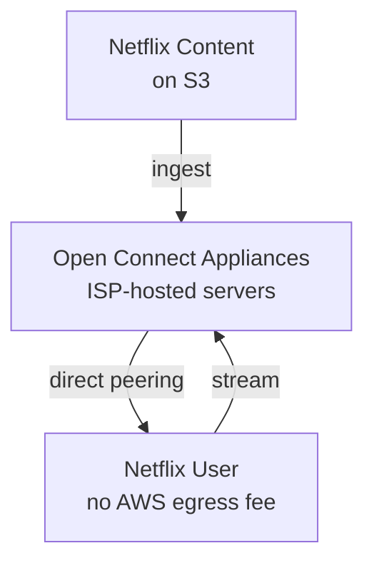
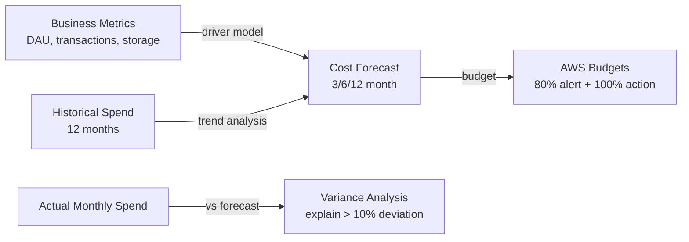
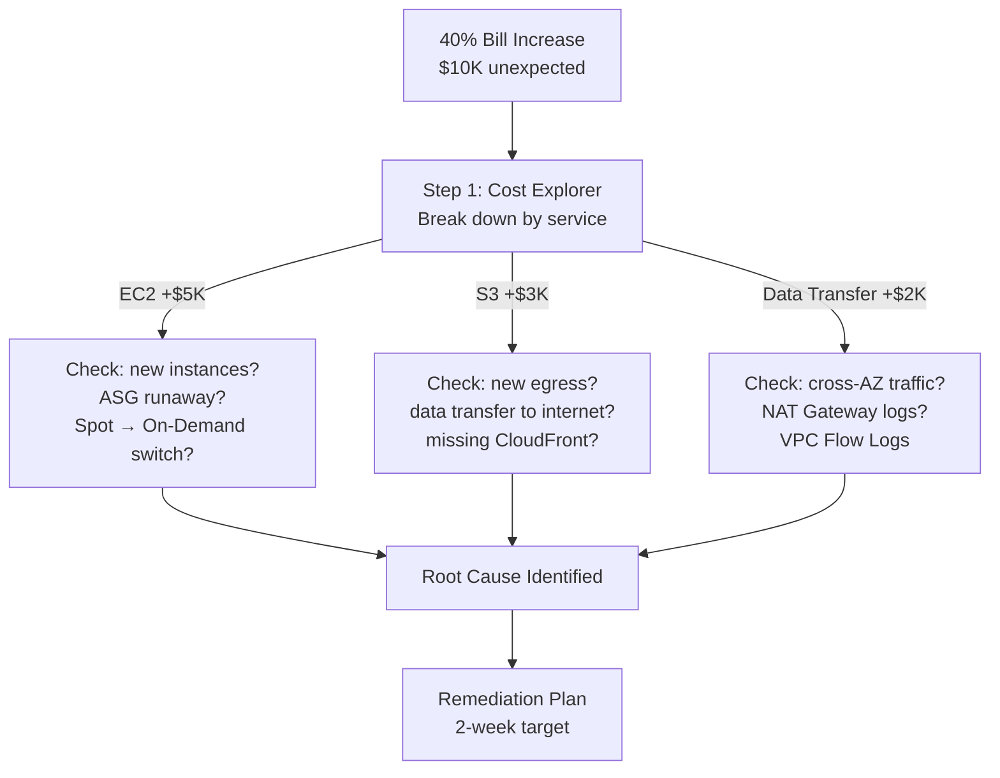

# Cloud Cost Optimization — Interview Questions

10 questions covering instance types, rightsizing, S3 lifecycle, data transfer costs, FinOps practices, auto-scaling economics, and Netflix-scale savings.

---

## Q1: What is the difference between Reserved, On-Demand, and Spot instances?
**Role:** Mid-level, DevOps | **Difficulty:** 🟢 | **Priority:** P0 | **Format:** Quick Answer

> **What the interviewer is testing:** Whether you understand the pricing model options and can match them to workload characteristics.

### Answer in 60 seconds
- **On-Demand:** Pay per hour/second, no commitment. Most expensive ($0.192/hr for m5.xlarge in us-east-1). Use for: unpredictable workloads, testing, short-lived jobs.
- **Reserved Instances (RI):** 1-year or 3-year commitment. 40–60% discount vs on-demand. Standard RI (locked to instance type/AZ) vs Convertible RI (can exchange for different type). Use for: stable baseline workloads running 24/7.
- **Savings Plans:** More flexible than RI. Compute Savings Plans apply to any EC2 instance family/region — 66% max discount. Instance Savings Plans for specific instance type — 72% max discount.
- **Spot Instances:** AWS sells spare capacity at 70–90% discount. Can be interrupted with 2-minute warning. Use for: batch jobs, stateless workers, CI/CD runners, ML training. Not for: databases, stateful services, user-facing APIs with no queue.

### Diagram

### Pitfalls
- ❌ **Buying RI before understanding baseline usage:** Reserve 100 m5.xlarge instances for a workload that runs at 40% utilisation — 60% of the RI commitment is wasted.
- ❌ **Running Spot for stateful databases:** A Spot RDS instance gets interrupted mid-transaction — use Spot only for stateless, fault-tolerant, re-runnable workloads.

### Concept Reference
→ [AWS Core Services](./aws-core-services)

---

## Q2: How do you identify and eliminate unused AWS resources?
**Role:** Mid-level | **Difficulty:** 🟢 | **Priority:** P1 | **Format:** Quick Answer

> **What the interviewer is testing:** Practical FinOps hygiene — idle resources are the easiest wins and a common interview topic.

### Answer in 60 seconds
- **AWS Cost Explorer:** Visualise spend by service, tag, account. Filter for resources with <5% utilisation over 30 days.
- **AWS Trusted Advisor:** Checks for idle EC2 (<10% CPU for 4+ days), unused Elastic IPs ($3.65/month each), unattached EBS volumes ($0.10/GB/month), old snapshots.
- **Specific waste categories:**
  - **Unattached EBS volumes:** Common after EC2 termination. `aws ec2 describe-volumes --filters Name=status,Values=available`
  - **Orphaned Elastic IPs:** $3.65/month each if unassociated. Easy $50–200/month saving.
  - **Idle NAT Gateways:** $0.045/hr = $33/month even with 0 traffic.
  - **Old RDS snapshots:** Automated retention often leaves 100+ snapshots; set policy to retain 7 days.
  - **Unused Load Balancers:** $16/month minimum; check for 0 target registrations.
- **Tag enforcement:** `aws config managed rule: required-tags` — resources without cost-allocation tags are flagged for review.

### Diagram

### Pitfalls
- ❌ **Deleting based on CPU alone:** A database at 5% CPU is not idle — it's appropriately sized for its read pattern. Check connections, query count, and business context.
- ❌ **No tagging from day 1:** Without cost-allocation tags, Cost Explorer shows "EC2: $10K" with no way to attribute it to a team or project — enforce tags in IaC and via SCP.

### Concept Reference
→ [Infrastructure as Code](./infrastructure-as-code) for tag enforcement via Terraform

---

## Q3: How do you right-size EC2 instances — what metrics do you look at?
**Role:** Senior | **Difficulty:** 🟡 | **Priority:** P1 | **Format:** Deep Dive

> **What the interviewer is testing:** Whether you can reduce instance costs without affecting performance — a core FinOps skill.

### Problem Constraints
| Dimension | Value |
|-----------|-------|
| Target CPU utilisation | 40–70% (leave headroom for spikes) |
| Target memory utilisation | 50–75% |
| Right-sizing tool | AWS Compute Optimizer (ML-powered, free) |
| Typical saving | 20–40% instance cost after rightsizing |
| Analysis period | 14 days minimum (capture weekly patterns) |

### Approach A — AWS Compute Optimizer

**Key metrics to analyse:**
- **CPU P99 (not P50):** An instance at P50 CPU 10% might spike to P99 90% — right-size to the peak, not the average.
- **Memory utilisation:** Requires CloudWatch agent or third-party tool (Datadog). OS-level metric not available by default in CloudWatch.
- **Network throughput:** Some workloads are network-bound — check if you're hitting the instance's network bandwidth ceiling.
- **EBS throughput:** `VolumeReadOps`, `VolumeWriteOps` — if maxing out EBS throughput, the instance is disk-bound, not compute-bound.

### Approach B — Instance Family Modernisation

Often the best "rightsizing" is not downsizing but changing generation. m5 → m7i (latest gen): same price, 30% better compute efficiency. c5 → c7g (Graviton3 ARM): 40% cheaper for same compute. Migration risk: application must compile for ARM (most Go, Python, Node.js apps work out of the box).

### Approach C — Containerisation as Rightsizing

Moving from dedicated EC2 per service to ECS/Kubernetes with resource requests/limits allows bin-packing multiple services on fewer, larger nodes. A 10-service deployment on 10 × m5.xlarge (10 nodes) → 10 services on 3 × m5.4xlarge (3 nodes) = 70% node cost reduction.

| Dimension | Downsize same family | Change to newer gen | Graviton (ARM) | Containerise |
|-|-|-|-|-|
| Saving | 20–50% | 0% cost, +30% perf | 40% cheaper | 50–70% node reduction |
| Risk | Medium (if undersized) | Low | Low-Medium (ARM compat) | High (migration effort) |
| Effort | Low | Low | Medium | High |

### Recommended Answer
Start with Compute Optimizer recommendations (free, immediate). Migrate eligible workloads to Graviton (40% cheaper). Long-term: containerise for bin-packing. Always analyse P99, not P50 CPU.

### What a great answer includes
- [ ] Uses P99 CPU (not average/P50) as the right-sizing signal
- [ ] Mentions memory utilisation requires CloudWatch agent (not default)
- [ ] Knows AWS Compute Optimizer as the native tool
- [ ] Raises Graviton ARM option (40% cheaper for compute-bound)
- [ ] Notes that rightsizing must account for traffic growth (don't cut too close)

### Pitfalls
- ❌ **Rightsizing based on CloudWatch CPU average:** Default CPU metric is average across all cores — an 8-core instance at 25% average might have one core at 100% causing application stalls.
- ❌ **Ignoring memory when downsizing compute:** Moving from m5.2xlarge (32GB RAM) to m5.xlarge (16GB RAM) on a JVM app with 24GB heap will cause OOM — check memory before compute.

### Concept Reference
→ [AWS Core Services](./aws-core-services)

---

## Q4: How do you optimize S3 costs — storage classes, lifecycle policies, intelligent tiering?
**Role:** Senior | **Difficulty:** 🟡 | **Priority:** P1 | **Format:** Quick Answer

> **What the interviewer is testing:** S3 cost management — S3 is often the largest line item for data-heavy applications.

### Answer in 60 seconds
- **Lifecycle policies:** Automatically transition or delete objects based on age. Example: `transition to S3-IA after 30 days → Glacier after 90 days → delete after 365 days`.
- **S3 Intelligent-Tiering:** For data with unknown or changing access patterns. Automatically moves objects between frequent/infrequent/archive tiers. Monitoring fee: $0.0025 per 1,000 objects. Break-even vs manual IA: ~100 objects with >30 days since last access.
- **Delete incomplete multipart uploads:** Often forgotten. A failed 10GB upload leaves the parts consuming storage. Set lifecycle rule: `abort incomplete multipart uploads after 7 days`.
- **Compress before storing:** JSON/CSV/log files compress 5–10×. Gzip or Parquet format for analytics data. 10TB of JSON → 1TB of Parquet = 90% storage saving.
- **Requester Pays:** For data shared externally, enable Requester Pays — requesters pay data transfer costs, not the bucket owner.
- **Numbers:** Standard: $0.023/GB. Glacier Deep Archive: $0.00099/GB. For 100TB of logs: Standard = $2,300/month, Glacier Deep Archive = $99/month.

### Diagram

### Pitfalls
- ❌ **No lifecycle policy on application logs:** S3 access logs and CloudTrail logs accumulate without a lifecycle policy — a 3-year-old account can have TBs of unneeded logs at Standard pricing.
- ❌ **S3 Intelligent-Tiering for small objects:** IT is not cost-effective for objects <128KB (monitoring fee exceeds savings). Only apply to objects >128KB.

### Concept Reference
→ [AWS Core Services](./aws-core-services)

---

## Q5: How do you reduce data transfer costs in AWS (biggest hidden cost)?
**Role:** Senior | **Difficulty:** 🔴 | **Priority:** P2 | **Format:** Deep Dive

> **What the interviewer is testing:** Awareness of AWS data transfer pricing, which consistently surprises teams and can dwarf compute costs.

### Problem Constraints
| Dimension | Value |
|-----------|-------|
| Inter-AZ transfer | $0.01/GB each way ($0.02/GB round-trip) |
| Internet egress | $0.09/GB (first 10TB) → $0.085/GB (next 40TB) |
| CloudFront egress | $0.0085/GB (90% cheaper than direct S3) |
| S3 VPC Endpoint | $0/GB (replaces NAT gateway for S3 traffic) |
| Cross-region transfer | $0.02/GB (varies by region pair) |

### Approach A — Eliminate Unnecessary Cross-AZ Traffic

ElastiCache: create a reader endpoint that prefers the replica in the same AZ. A service reading from cache across AZs 1TB/month = $20/month avoidable. At 100TB: $2,000/month.

### Approach B — CloudFront as Egress Optimizer

S3 direct egress: $0.09/GB. CloudFront egress: $0.0085/GB (90% cheaper). For 100TB/month public content delivery: S3 direct = $9,000; CloudFront = $850. CloudFront also reduces load on origin.

### Approach C — VPC Endpoints for AWS Service Traffic

Without VPC Endpoints, traffic from EC2 to S3/DynamoDB/SQS goes through a NAT Gateway at $0.045/GB. With VPC Gateway Endpoint (free for S3 and DynamoDB), traffic stays within AWS network at $0.

Example: Spark EMR cluster processing 1PB from S3 per month. Without endpoint: $45,000/month in NAT Gateway data charges. With S3 Gateway Endpoint: $0.

| Transfer type | Baseline cost | Optimisation | Saving |
|-|-|-|-|
| Public content (100TB/mo) | S3 egress $9,000 | CloudFront $850 | 91% |
| S3 from EC2 (100TB/mo) | NAT Gateway $4,500 | VPC Endpoint $0 | 100% |
| Cross-AZ cache reads (100TB/mo) | $2,000 | Same-AZ replica $0 | 100% |
| Cross-region replication (10TB/mo) | $200 | S3 Replication + Glacier source | 20% |

### Recommended Answer
Three levers: (1) CloudFront for all public egress — 91% saving. (2) VPC Endpoints for S3/DynamoDB — 100% of NAT costs eliminated. (3) Same-AZ ElastiCache read replicas — eliminates cross-AZ cache traffic. These three changes cover the vast majority of unexpected data transfer bills.

### What a great answer includes
- [ ] Knows inter-AZ transfer costs ($0.01/GB each direction)
- [ ] Explains VPC Gateway Endpoints are free and should always be enabled for S3/DynamoDB
- [ ] Compares CloudFront egress ($0.0085) vs direct S3 egress ($0.09)
- [ ] Mentions same-AZ ElastiCache reader endpoints
- [ ] Notes that PrivateLink (Interface Endpoints) cost $0.01/hr but save $0.045/GB for other AWS services

### Pitfalls
- ❌ **Ignoring NAT Gateway for AWS service traffic:** The most common surprise bill — a Data Engineering team running Spark on EMR pulling from S3 through a NAT Gateway can generate $50K+ bills in a month.
- ❌ **Using direct S3 for a public-facing download service:** S3 egress at $0.09/GB vs CloudFront at $0.0085/GB is a 10× cost difference — always put CloudFront in front of public content.

### Concept Reference
→ [AWS Core Services](./aws-core-services)

---

## Q6: What are cost allocation tags and how do you implement FinOps practices?
**Role:** Senior | **Difficulty:** 🟡 | **Priority:** P2 | **Format:** Quick Answer

> **What the interviewer is testing:** Organisational cost visibility — a key senior engineering concern.

### Answer in 60 seconds
- **Cost allocation tags:** Key-value pairs on AWS resources that appear in billing reports. Enable you to break down "EC2: $50K/month" into "Team: payments $15K, Team: search $10K, Env: staging $5K."
- **Required tags (enforce via SCP/AWS Config):** `team`, `environment`, `service`, `cost-center`. Resources without tags are unattributable — "FinOps dark matter."
- **FinOps practices:**
  - **Unit economics:** Cost per transaction, cost per user, cost per API call. Allows engineering teams to see the cost impact of their architecture decisions.
  - **Showback/chargeback:** Show teams their monthly cloud bill (showback) or charge it to their budget (chargeback). Drives cost-awareness.
  - **Budgets + alerts:** AWS Budgets: alert when a team exceeds $10K/month (80% threshold) and $12.5K (100% threshold).
  - **Weekly cost review:** Dedicated 30-min review of Cost Explorer anomalies every Monday.
- **FinOps maturity:** Crawl (cost visibility) → Walk (cost optimisation) → Run (unit economics, continuous optimisation).

### Diagram

### Pitfalls
- ❌ **Tags as metadata only:** Without activating cost allocation tags in Billing console, tags don't appear in Cost Explorer — activate them explicitly.
- ❌ **No retroactive tagging enforcement:** Untagged resources from 2 years ago remain invisible in billing forever — tag new resources via IaC and accept legacy dark matter.

### Concept Reference
→ [Infrastructure as Code](./infrastructure-as-code) for tag enforcement

---

## Q7: How does auto-scaling reduce idle capacity cost vs fixed-size fleet?
**Role:** Staff | **Difficulty:** 🟡 | **Priority:** P2 | **Format:** Quick Answer

> **What the interviewer is testing:** Understanding of the economic model of cloud autoscaling — not just how it works, but why it saves money.

### Answer in 60 seconds
- **Fixed fleet problem:** To handle 10K RPS peak traffic, you provision 20 × m5.xlarge. But at 3am, traffic drops to 500 RPS — 19 instances idle, paying $0.192 × 19 = $3.65/hr = $87/day for capacity you're not using.
- **Autoscaling solution:** Minimum 3 instances, maximum 20. At 3am: 3 instances ($0.58/hr). At peak: 20 instances ($3.84/hr). Average: 8 instances ($1.54/hr) — 60% cost reduction vs fixed fleet.
- **Savings calculation (concrete):** Fixed fleet 20 instances × $0.192 × 720 hrs/month = $2,765/month. Autoscaled average 8 instances = $1,106/month. Saving: $1,659/month ($20K/year).
- **Spot + ASG combo:** Use Spot for burst capacity (above baseline). Baseline 3 × On-Demand Reserved, burst 0–17 × Spot. Spot saves 70–90% on the variable portion.

### Diagram

### Pitfalls
- ❌ **High minimum capacity defeating autoscaling:** Setting `min: 15` out of conservatism means you pay for 15 instances 24/7 — analyse traffic patterns and reduce the minimum to the truly required floor.
- ❌ **Scale-in too aggressive:** Terminating instances too fast during traffic lulls can cause latency spikes when traffic resumes — scale-in should be slower than scale-out (longer cooldown).

### Concept Reference
→ [AWS Core Services](./aws-core-services)

---

## Q8: How does Netflix save ~$1B/year on AWS bills — specific techniques?
**Role:** Staff | **Difficulty:** 🔴 | **Priority:** P2 | **Format:** Deep Dive

> **What the interviewer is testing:** Real-world large-scale cloud cost optimisation and the discipline required to continuously optimise at hyperscale.

### Problem Constraints
| Dimension | Value |
|-----------|-------|
| Netflix AWS spend | Reported ~$1B+/year (est.) |
| Streaming bandwidth | Tens of petabytes per day |
| Instance fleet | Tens of thousands of EC2 instances |
| Encoding volume | Millions of video encoding jobs/month |

### Approach A — Open Connect CDN (Replace AWS Data Transfer)

Netflix built Open Connect — CDN appliances placed directly inside 1,000+ ISP data centres globally. Video streams from these appliances, not from AWS. Eliminates 90%+ of AWS data egress costs. At $0.09/GB and petabytes/day, this saves hundreds of millions per year.

### Approach B — Spot Instances for Video Encoding

Video encoding (FFmpeg transcoding) is embarrassingly parallel and fault-tolerant. A 2-minute interruption warning is sufficient to save work and resume. Netflix runs millions of encoding jobs on Spot — 70–90% cheaper than On-Demand.

### Approach C — Reserved + Savings Plans Optimisation

Netflix uses a combination of 3-year Convertible Reserved Instances for baseline and Compute Savings Plans for flexibility. ~70% of baseline fleet on committed pricing. Only 30% On-Demand for burst and experimentation.

### Approach D — Graviton (ARM) Migration

Netflix has migrated significant portions of their Java/Go services to Graviton (ARM) instances — 40% cheaper for same compute. Java and Go have excellent ARM support. Requires rebuilding Docker images for ARM64.

### Approach E — Chaos Engineering Reduces Over-Provisioning

Because Chaos Monkey proves services can handle instance failures, Netflix teams are confident running at 60–70% CPU utilisation. Teams that don't trust their resilience run at 30% to have "safety margin" — paying 2× for unused capacity. Confidence = lower safety buffers = lower cost.

| Technique | Estimated saving | Applicability |
|-|-|-|
| Open Connect CDN | Hundreds of millions/year | Netflix-specific (ISP relationships) |
| Spot for encoding | 70–90% on encoding compute | Any batch workload |
| Reserved + Savings Plans | 40–70% on baseline | Any stable workload |
| Graviton migration | 40% on compute | Any Linux app |
| Chaos Engineering → less over-provisioning | 20–30% buffer reduction | Any team |

### Recommended Answer
Netflix's biggest saving is Open Connect (CDN at ISP level). For others to emulate: Spot for batch/encoding, Reserved for baseline, Graviton migration, and Chaos Engineering to build confidence to run leaner.

### What a great answer includes
- [ ] Open Connect as the primary mechanism (not just AWS-native cost saving)
- [ ] Spot for encoding — explains why encoding is suitable for Spot
- [ ] Graviton migration with concrete 40% saving
- [ ] Chaos Engineering reducing over-provisioning safety buffers
- [ ] Notes that Netflix's scale justifies engineering investment that smaller companies can't replicate

### Pitfalls
- ❌ **"Netflix just uses more Reserved Instances":** RI optimisation is table stakes — the interesting insight is Open Connect and the cultural side (chaos engineering enabling confidence to run leaner).
- ❌ **Not knowing Graviton is 40% cheaper:** Graviton (ARM) is widely available since 2021 and offers compelling savings — not knowing it signals outdated AWS knowledge.

### Concept Reference
→ [AWS Core Services](./aws-core-services)

---

## Q9: How do you build a cloud cost forecasting model for budget planning?
**Role:** Staff | **Difficulty:** 🟡 | **Priority:** P3 | **Format:** Quick Answer

> **What the interviewer is testing:** Engineering leadership skill — planning and communicating infrastructure budgets.

### Answer in 60 seconds
- **Bottom-up forecasting:** Enumerate every resource type, current count, unit price, expected growth rate. Example: 20 EC2 m5.xlarge × $0.192/hr × 720 hrs × 1.15 (15% growth) = $3,180/month in 3 months.
- **Driver-based forecasting:** Model cost as a function of business metrics. "EC2 cost = $30 per 1,000 active users per month." If users grow from 100K to 200K, EC2 cost doubles. More reliable than extrapolating past spend.
- **AWS Cost Explorer Forecast:** ML-based 12-month forecast based on historical spend. Shows P50/P90 confidence intervals. Not reliable for new services or major architecture changes.
- **Anomaly Detection:** AWS Cost Anomaly Detection — ML detects unusual spend spikes and alerts within hours. Set up for each service or linked account.
- **Budget governance:** Set AWS Budgets at 80% (warning) and 100% (action — notify/block new resources) of monthly target.

### Diagram

### Pitfalls
- ❌ **Forecasting based only on past spend:** A new feature (video upload) can 10× S3 costs — past spend doesn't predict architectural changes. Always pair historical trend with feature roadmap review.
- ❌ **No unit economics model:** Without "cost per user" or "cost per transaction," engineers can't evaluate the cost impact of their architectural decisions — build this dashboard.

### Concept Reference
→ [AWS Core Services](./aws-core-services)

---

## Q10: Your AWS bill jumped 40% in one month — walk through how you diagnose and reduce it
**Role:** Senior | **Difficulty:** 🔴 | **Priority:** P1 | **Format:** Scenario
**Real Company:** Slack (had a $1M+ unexpected AWS bill from S3 data transfer)

### The Brief
> "Your company's AWS bill jumped from $25K to $35K in January (40% increase, $10K unexpected). No major feature launches. The CTO wants a root cause analysis and a plan to return to baseline within 2 weeks."

### Clarifying Questions
1. Which AWS services showed the increase? (Cost Explorer by service)
2. Did any new infrastructure deploy in December/January? (IaC changelog)
3. Did traffic increase? (ALB request count, user growth)
4. Are there any new data pipelines or batch jobs scheduled?
5. Are there cost allocation tags to attribute spend to teams?

### Back-of-Envelope Estimation
| Metric | Calculation | Result |
|-|-|-|
| Unexpected spend | $35K - $25K baseline | $10K delta |
| Per day | $10K / 31 days | $323/day extra |
| S3 data transfer at $0.09/GB | $323/day / $0.09 | 3,590 GB/day if S3 egress |
| EC2 instance equivalent | $323/day / ($0.192/hr × 24) | ~70 extra m5.xlarge instances |

### High-Level Diagnosis Process

### Trade-off Decisions
| Root Cause | Quick Fix (immediate) | Permanent Fix (2 weeks) |
|-|-|-|
| Runaway ASG scale-out | Set ASG max to reasonable limit | Fix scaling policy; add cost alarm |
| S3 egress missing CloudFront | Add CloudFront distribution | All public S3 routed via CloudFront |
| Cross-AZ cache traffic | Re-enable same-AZ ElastiCache endpoint | Add AZ affinity to app routing |
| Data pipeline without S3 VPC endpoint | Add S3 VPC Endpoint immediately | Terraform module for all new VPCs |
| Old test environment never terminated | Delete environment | Environment TTL policy + Slack reminder |

### Failure Modes (in the diagnosis itself)
| Failure | Impact | Mitigation |
|-|-|-|
| No cost tags | Can't attribute $10K to team/service | Accept for now; tag going forward |
| Bill not updated in real-time | Cost Explorer 24hr lag misleads | Cross-check with CloudWatch metrics |
| Fix in one service creates cost in another | Moving S3 to CloudFront reduces egress but adds CloudFront request costs | Verify CloudFront is net positive |
| Root cause is a new vendor data export | Ongoing contractual data transfer | Negotiate egress cost sharing; use S3 Transfer Acceleration |

### Concept References
→ [AWS Core Services](./aws-core-services)
→ [Infrastructure as Code](./infrastructure-as-code)
