# Container Orchestration — Interview Questions

10 questions covering containers vs VMs, Docker image layers, container networking, resource limits, sidecar pattern, security, service mesh, and Shopify's multi-tenant approach.

---

## Q1: What is the difference between a container and a VM?
**Role:** Mid-level, DevOps | **Difficulty:** 🟢 | **Priority:** P0 | **Format:** Quick Answer

> **What the interviewer is testing:** Fundamental understanding of container isolation before discussing orchestration.

### Answer in 60 seconds
- **VM:** Full OS virtualisation. Each VM runs a complete OS kernel via a hypervisor (VMware, KVM, Hyper-V). Startup time: 30–60 seconds. Memory overhead: 256MB–1GB per VM. Strong isolation (separate kernel).
- **Container:** OS-level virtualisation. Containers share the host kernel; isolated via Linux namespaces (PID, network, mount, UTS) and cgroups (resource limits). Startup time: 100–500ms. Memory overhead: few MB.
- **Key differences:**
  - Containers start 60–100× faster than VMs.
  - VMs provide stronger isolation (separate kernel) — relevant for multi-tenant security.
  - Containers are more portable — a Docker image runs identically on any Linux host.
  - VMs can run Windows on a Linux host; containers share the host OS kernel.

### Diagram

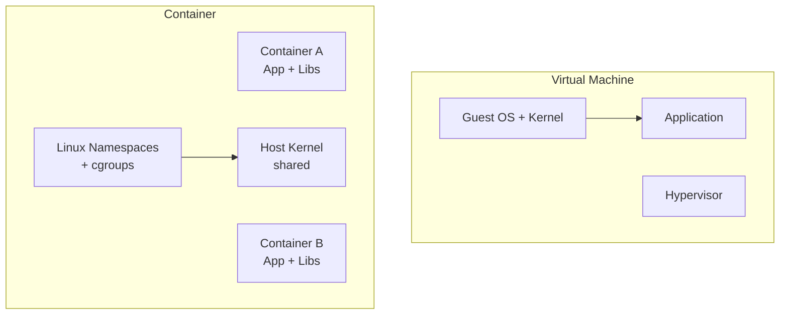

### Pitfalls
- ❌ **"Containers are fully isolated":** Containers share the host kernel — a kernel exploit can escape the container. VMs provide stronger security boundaries for high-security multi-tenant workloads (use gVisor or Kata Containers for kernel-level isolation).
- ❌ **Running stateful data in containers without persistent volumes:** Container filesystem is ephemeral — data is lost on container restart unless mounted to a persistent volume.

### Concept Reference
→ [Kubernetes Architecture](./kubernetes-architecture)

---

## Q2: How do Docker image layers work and why does layer caching matter?
**Role:** Mid-level | **Difficulty:** 🟢 | **Priority:** P0 | **Format:** Quick Answer

> **What the interviewer is testing:** Practical knowledge of Docker build optimisation — a daily concern for DevOps engineers.

### Answer in 60 seconds
- **Image layers:** Each Dockerfile instruction (FROM, RUN, COPY, ENV) creates an immutable layer. Layers are content-addressed SHA256 hashes. A final image = stack of layers.
- **Layer caching:** Docker caches each layer. If the instruction and its context haven't changed, Docker reuses the cached layer — skips re-running it. Cache is invalidated if any earlier layer changes.
- **Optimisation rule:** Put rarely-changing instructions first (OS dependencies), frequently-changing instructions last (application code). A `COPY . .` near the top invalidates the cache on every code change.
- **Layer sharing:** Multiple images sharing the same base layer (e.g., `node:20-alpine`) store only one copy on disk and in the registry — saves 500MB+ of redundant storage.
- **Multi-stage builds:** Use one stage to compile (includes compilers, dev deps), copy only the artifact to a final stage (no dev tools). Final image size: 50MB vs 500MB.

### Diagram

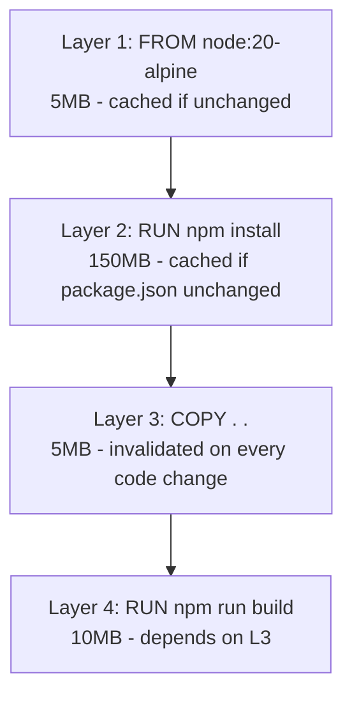

### Pitfalls
- ❌ **`COPY . .` before `npm install`:** Every code change invalidates the npm install layer — always `COPY package.json ./` + `RUN npm install` before `COPY . .` to cache node_modules.
- ❌ **Secrets in Docker build layers:** `RUN export API_KEY=xyz` leaves the key in the image layer history (`docker history` reveals it) — use build secrets (`--secret`) or inject at runtime.

### Concept Reference
→ [CI/CD Pipeline Design](./cicd-pipeline-design)

---

## Q3: How does container networking work — overlay networks, CNI, service discovery?
**Role:** Senior | **Difficulty:** 🔴 | **Priority:** P1 | **Format:** Deep Dive

> **What the interviewer is testing:** Understanding of the full network stack from container to external service, required for diagnosing production networking issues.

### Problem Constraints
| Dimension | Value |
|-----------|-------|
| Docker bridge network | Private 172.17.0.0/16 per host |
| Kubernetes Pod CIDR | Configurable; typically 10.0.0.0/16 |
| Overlay network overhead | VXLAN: ~50 bytes per packet; ~5% throughput overhead |
| Service DNS TTL | Kubernetes CoreDNS: 30 seconds |
| CNI plugins | Flannel (simple), Calico (network policy), Cilium (eBPF) |

### Approach A — Docker Bridge Networking (single host)

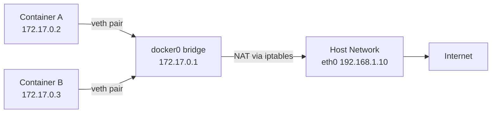

Each container gets a virtual ethernet interface (`veth`). Docker creates a software bridge (`docker0`). NAT translates container IPs to host IP for external traffic. Containers on the same bridge can communicate directly. Containers on different hosts cannot communicate (single-host limitation).

### Approach B — Kubernetes Overlay Networking (multi-host)

**Requirement:** Every Pod must reach every other Pod using Pod IP (no NAT). Achieved via:
- **Flannel (VXLAN):** Encapsulates Pod packets in UDP packets. Simple but adds ~50-byte header per packet. Good for small clusters.
- **Calico (BGP):** Advertises Pod CIDR routes via BGP. No encapsulation (lower overhead). Supports network policies (Layer 3/4 firewall rules).
- **Cilium (eBPF):** No iptables; programs eBPF maps in the kernel. Lowest overhead, Layer 7 network policies, Hubble observability.

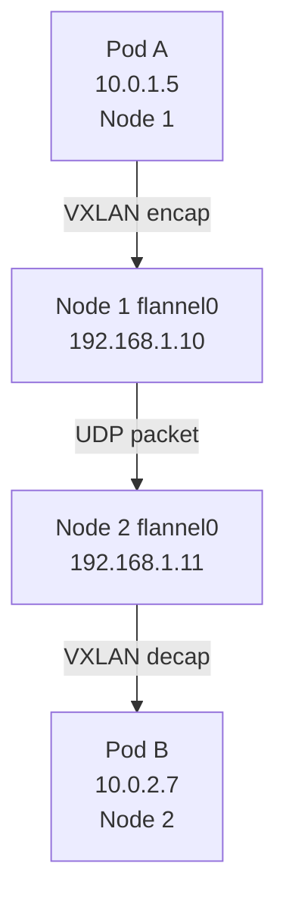

### Approach C — Service Discovery (CoreDNS)

Kubernetes CoreDNS resolves `<svc>.<ns>.svc.cluster.local` → ClusterIP. Pods have `/etc/resolv.conf` pointing to CoreDNS. kube-proxy programs iptables/IPVS to translate ClusterIP → Pod IP (load balanced).

| Dimension | Docker Bridge | Flannel VXLAN | Calico BGP | Cilium eBPF |
|-|-|-|-|-|
| Multi-host | No | Yes | Yes | Yes |
| Overhead | Minimal | ~5% (encap) | Minimal (no encap) | Minimal |
| Network Policy | No | No | Yes | Yes (Layer 7) |
| Complexity | Low | Low | Medium | Medium-High |
| Scale | Single host | 1,000 nodes | 5,000 nodes | 5,000+ nodes |

### Recommended Answer
Explain single-host Docker bridge → multi-host overlay (Flannel/Calico) → Kubernetes service discovery via CoreDNS. Mention CNI plugin choice is driven by network policy and scale requirements.

### What a great answer includes
- [ ] Explains veth pairs and bridge for single-host Docker
- [ ] Describes VXLAN encapsulation for multi-host overlay
- [ ] Knows that Kubernetes requires all Pods to reach all Pods without NAT
- [ ] Explains CoreDNS FQDN format `svc.ns.svc.cluster.local`
- [ ] Recommends Calico for network policy, Cilium for eBPF performance

### Pitfalls
- ❌ **Confusing Docker networks with Kubernetes networks:** Docker `docker network create` is not used in Kubernetes — CNI plugins manage Pod networking, not Docker.
- ❌ **Forgetting CoreDNS performance:** A misconfigured CoreDNS `ndots:5` causes 5 DNS lookups per hostname — add `ndots: 2` to Pod spec for external hosts.

### Concept Reference
→ [Kubernetes Architecture](./kubernetes-architecture)

---

## Q4: What is the difference between CPU requests and CPU limits in Kubernetes?
**Role:** Senior | **Difficulty:** 🟡 | **Priority:** P1 | **Format:** Quick Answer

> **What the interviewer is testing:** Resource model understanding — incorrect requests/limits cause OOMKills and CPU throttling, which are common production issues.

### Answer in 60 seconds
- **CPU Request:** Minimum CPU guaranteed to the container by the scheduler. Used by the scheduler to decide which node has enough capacity. Expressed in millicores (1000m = 1 CPU core).
- **CPU Limit:** Maximum CPU the container can use. If the process exceeds the limit, the Linux kernel throttles it (CFS throttling) — the container doesn't die, it just gets slower.
- **Memory Request:** Minimum memory; used for scheduling.
- **Memory Limit:** Maximum memory. If exceeded, the container is OOMKilled (process dies) — memory is not compressible.
- **Best practice:** Set requests to P50 usage; set limits to 2–3× requests. Avoid setting CPU limits for latency-sensitive services (throttling causes p99 spikes). Do set memory limits to prevent OOM cascades.

### Diagram

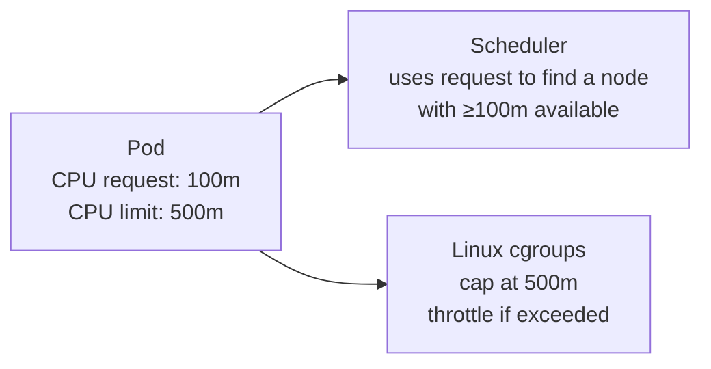

### Pitfalls
- ❌ **No resource requests set:** Without requests, the scheduler places Pods randomly — a node can be oversubscribed, causing all Pods to contend for CPU.
- ❌ **CPU limit = CPU request (1:1):** At 1:1 ratio, any CPU burst is throttled immediately — set limits at 2–4× requests to allow bursting.

### Concept Reference
→ [Kubernetes Architecture](./kubernetes-architecture)

---

## Q5: What is the sidecar pattern and how does it enable service mesh?
**Role:** Senior | **Difficulty:** 🟡 | **Priority:** P2 | **Format:** Deep Dive

> **What the interviewer is testing:** Understanding of the sidecar pattern as the foundation of service mesh — required for Istio/Envoy discussions.

### Problem Constraints
| Dimension | Value |
|-----------|-------|
| Sidecar CPU overhead | Envoy proxy: 50–100m CPU per Pod |
| Sidecar memory | Envoy: 50–100MB per Pod |
| Latency added | <1ms per hop (Envoy) |
| Mutual TLS | Automatic cert rotation every 24 hours |

### Approach A — Sidecar Pattern (application container + proxy container in one Pod)

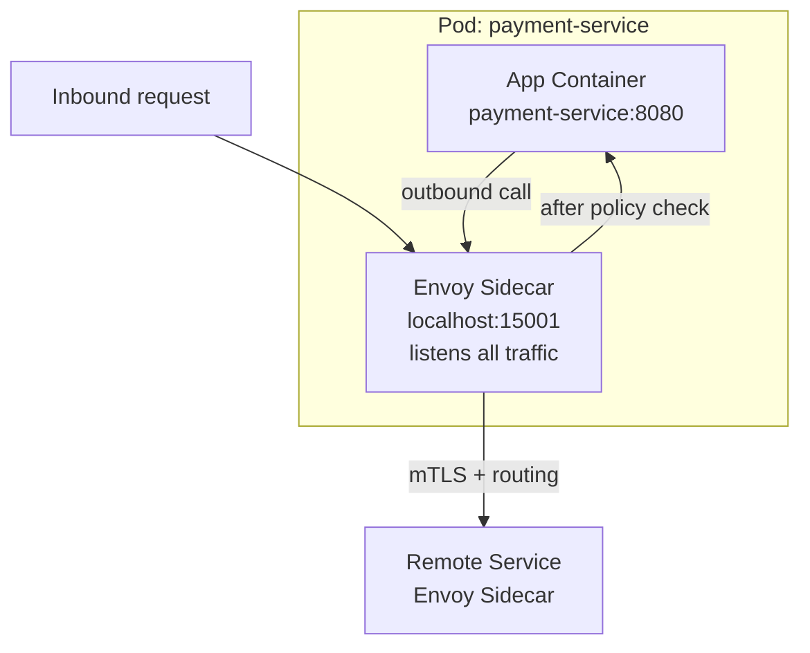

**What Envoy sidecar handles transparently:**
- mTLS: Encrypts all Pod-to-Pod traffic; certificates managed by the mesh control plane (Istiod).
- Retries: Automatic retry on 503; configurable retry count and backoff.
- Timeout: Per-route timeout enforcement.
- Circuit breaker: If a downstream service exceeds error threshold, trips circuit.
- Observability: Emits request metrics (latency, status codes) to Prometheus without app code changes.
- Traffic routing: Percentage-based traffic splitting for canary deployments.

### Approach B — eBPF-based service mesh (Cilium Service Mesh)

No sidecar proxy; eBPF programs loaded in the kernel handle mTLS and observability. Lower overhead (~30% less CPU than Envoy sidecar). Requires Cilium CNI (cannot mix with Calico/Flannel).

| Dimension | No service mesh | Istio/Envoy sidecar | Cilium eBPF mesh |
|-|-|-|-|
| mTLS | No | Yes (auto) | Yes (auto) |
| Observability | App-level only | Automatic L7 metrics | Automatic L7 metrics |
| CPU overhead | 0 | 50–100m per Pod | ~30m per Pod |
| Canary routing | No | Yes | Yes |
| Complexity | Low | High (Istio CRDs) | Medium |
| Sidecars | None | 1 per Pod | None |

### Recommended Answer
Sidecar pattern: one Envoy proxy per Pod injected by the mesh control plane; intercepts all inbound/outbound traffic transparently (iptables redirect). Provides mTLS, retries, timeouts, circuit breaking, and observability without application code changes. Trade-off: 50–100m CPU and 50–100MB RAM per Pod.

### What a great answer includes
- [ ] Explains that traffic is intercepted via iptables init-container, not application configuration
- [ ] Lists at least 4 capabilities added by the sidecar (mTLS, retries, circuit breaker, observability)
- [ ] Knows the overhead numbers (50–100m CPU, 50–100MB RAM per sidecar)
- [ ] Mentions automatic certificate rotation as a key security benefit
- [ ] Compares sidecar mesh vs eBPF mesh for modern clusters

### Pitfalls
- ❌ **"Service mesh replaces application-level error handling":** The sidecar handles transient network failures but not application-level errors (business logic failures, data validation) — app still needs its own error handling.
- ❌ **Deploying Istio without understanding overhead:** 100 Pods × 100m CPU = 10 additional CPUs for Envoy sidecars — budget for this before enabling mesh.

### Concept Reference
→ [Kubernetes Architecture](./kubernetes-architecture)
→ [Microservices Migration](../../../system-design/scale-and-reliability/microservices-migration)

---

## Q6: How do you secure a container — non-root user, read-only filesystem, seccomp?
**Role:** Senior | **Difficulty:** 🟡 | **Priority:** P2 | **Format:** Quick Answer

> **What the interviewer is testing:** Container security hardening knowledge — a must-have for any production Kubernetes deployment.

### Answer in 60 seconds
- **Non-root user:** `runAsNonRoot: true` in Pod `securityContext`. Most container exploits escalate privileges as root. Dockerfile: `USER 1000` before `CMD`.
- **Read-only root filesystem:** `readOnlyRootFilesystem: true`. Prevents attackers from writing malware to the container filesystem. Use `emptyDir` volumes for writable tmp paths.
- **Drop capabilities:** `capabilities.drop: ["ALL"]`; add back only needed (e.g., `NET_BIND_SERVICE` for port <1024). Default Docker container has ~14 capabilities including `NET_RAW` (can craft raw packets).
- **Seccomp profile:** Restricts system calls available to the container. `RuntimeDefault` profile blocks 300+ dangerous syscalls. `Strict` profile blocks all but ~40 syscalls.
- **No privilege escalation:** `allowPrivilegeEscalation: false` prevents `sudo` or `setuid` binaries inside the container.
- **Image scanning:** Scan with Trivy or Snyk in CI. Block images with Critical CVEs.

### Diagram

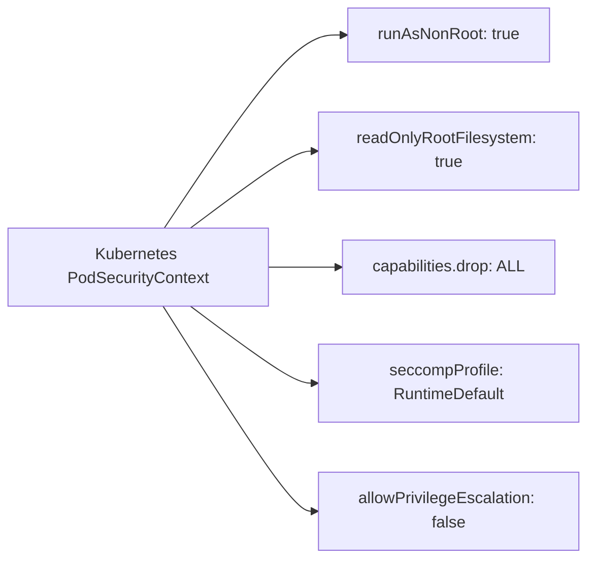

### Pitfalls
- ❌ **Running as root "just to make it work":** A process running as root inside a container can exploit a kernel vulnerability to escape to the host — non-root is non-negotiable for production.
- ❌ **Ignoring image base vulnerability:** A well-configured securityContext on a container with 200 CVEs in the OS layer is still vulnerable — minimise base image (`distroless` or `scratch`).

### Concept Reference
→ [Kubernetes Architecture](./kubernetes-architecture)

---

## Q7: What is Istio and what does a service mesh give you beyond plain Kubernetes?
**Role:** Staff | **Difficulty:** 🟡 | **Priority:** P2 | **Format:** Quick Answer

> **What the interviewer is testing:** Ability to articulate the value proposition of a service mesh and when the overhead is justified.

### Answer in 60 seconds
- **Istio:** Open-source service mesh with Envoy proxy sidecars and Istiod control plane. Manages certificate lifecycle, traffic routing, and telemetry.
- **What Kubernetes gives you:** Service discovery (DNS), load balancing (ClusterIP), ingress routing.
- **What Istio adds:**
  - **mTLS everywhere:** Pod-to-Pod traffic encrypted without application changes. Certificates auto-rotated every 24 hours.
  - **Traffic management:** Percentage-based routing (canary), header-based routing, fault injection for testing.
  - **Retry / timeout / circuit breaker:** At network level, not in application code.
  - **Observability:** Distributed traces, per-service request metrics (latency, error rate, saturation) with zero app instrumentation.
  - **Authorisation policies:** L7 policy: "service-a can only call GET /api/v1/users on service-b."
- **When NOT to use:** Small clusters (<10 services), teams without Kubernetes expertise, when the 10% CPU overhead is unacceptable.

### Diagram

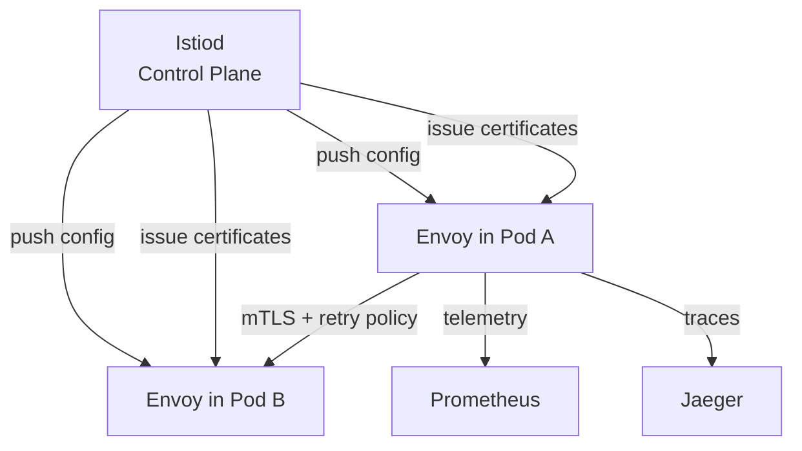

### Pitfalls
- ❌ **Enabling Istio on every namespace immediately:** Start with one namespace in permissive mode (no mTLS enforcement), tune performance, then expand — a big-bang rollout causes widespread latency spikes.
- ❌ **Assuming Istio replaces Kubernetes Network Policies:** Istio AuthorizationPolicy operates at L7; Kubernetes NetworkPolicy operates at L3/4 — use both in defence-in-depth.

### Concept Reference
→ [Container Orchestration — sidecar pattern](./container-orchestration)

---

## Q8: How does Shopify run containers at scale — multi-tenant Kubernetes pods?
**Role:** Staff | **Difficulty:** 🔴 | **Priority:** P2 | **Format:** Deep Dive

> **What the interviewer is testing:** Real-world large-scale Kubernetes operations, multi-tenancy patterns, and the trade-offs of pod-per-tenant vs shared infrastructure.

### Problem Constraints
| Dimension | Value |
|-----------|-------|
| Shopify merchants | 2M+ merchants on shared infrastructure |
| Traffic pattern | Black Friday: 100× normal traffic in hours |
| Isolation requirement | Merchant A's traffic spike must not affect Merchant B |
| Kubernetes clusters | Multiple large clusters (1,000+ nodes per cluster) |

### Approach A — Namespace Isolation (Shopify's approach)

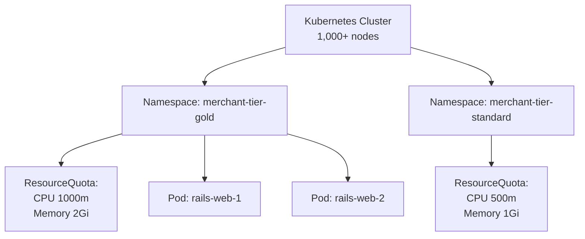

Shopify runs its Rails monolith as a multi-tenant application — all merchants share the same Rails codebase, same Pods. Multi-tenancy is handled at the application layer (tenant ID), not at the Pod layer. Kubernetes provides resource quotas and LimitRanges per namespace (Gold/Standard tiers).

### Approach B — Pod-per-Merchant (dedicated pods)

Each merchant gets dedicated Pods. Strong isolation. But 2M merchants × 1 Pod = 2M Pods — not operationally feasible. Used only for enterprise/large merchants with dedicated deployments.

### Approach C — Vertical Pod Autoscaler + Predictive Scaling for Flash Sales

Shopify uses predictive scaling: merchants request "flash sale" capacity in advance; Shopify pre-scales the cluster before the sale starts (avoids cold start latency during scale-out).

| Dimension | Shared multi-tenant Pods | Namespace isolation | Dedicated Pods per tenant |
|-|-|-|-|
| Isolation | App-level only | Resource quota | Full |
| Scale (# tenants) | Millions | Thousands | Hundreds |
| Noisy neighbour | Yes (mitigated by quotas) | Partial | No |
| Cost efficiency | Very high | High | Low |
| Complexity | Application | Platform | Platform × tenants |

### Recommended Answer
Shopify's scale requires application-level multi-tenancy (all merchants in the same Pods) with resource quotas per tier. True Pod-per-merchant only works at hundreds of tenants, not millions. For Black Friday: predictive scaling rather than reactive autoscaling.

### What a great answer includes
- [ ] Distinguishes application-level multi-tenancy from infrastructure-level isolation
- [ ] Explains ResourceQuota and LimitRange as namespace-level controls
- [ ] Addresses noisy-neighbour problem (one merchant consuming all node CPU)
- [ ] Discusses PodDisruptionBudget for maintenance-safe deployments at scale
- [ ] Mentions cluster autoscaler + Karpenter for node-level scaling

### Pitfalls
- ❌ **"Just add more Pods for every merchant":** At 2M merchants, Pod-per-tenant means 2M Pods minimum — etcd can't handle 2M objects in the same cluster efficiently.
- ❌ **No priority classes:** Without PriorityClass, a batch job can evict production Pods during scale-in — define `system-critical`, `high`, `low` priority classes.

### Concept Reference
→ [Kubernetes Architecture](./kubernetes-architecture)
→ [Microservices Migration](../../../system-design/scale-and-reliability/microservices-migration)

---

## Q9: How do you scan container images for vulnerabilities in a CI/CD pipeline?
**Role:** Staff | **Difficulty:** 🟡 | **Priority:** P3 | **Format:** Quick Answer

> **What the interviewer is testing:** Supply chain security awareness and practical tooling knowledge.

### Answer in 60 seconds
- **When to scan:** After `docker build`, before `docker push` to registry. Catch CVEs before they reach production.
- **Tools:** Trivy (open-source, ~45s per scan), Snyk Container (SaaS, policy enforcement), Amazon ECR enhanced scanning (Snyk-powered, free in ECR), Grype (open-source alternative to Trivy).
- **What Trivy scans:** OS packages (Alpine, Ubuntu), language packages (npm, pip, Go modules), misconfigurations (Dockerfile best practices), secrets (accidentally baked into layers).
- **Policy:** Fail CI on Critical CVEs; warn on High; ignore Medium/Low unless older than 30 days. Use `.trivyignore` for accepted false positives.
- **Registry scanning:** ECR/GCR scan images on push and on new CVE disclosure — running containers can be vulnerable even if they passed CI scan 3 months ago.
- **Base image pinning:** Pin to a specific digest (`node:20-alpine@sha256:abc...`) to prevent a base image update from introducing new vulnerabilities between CI runs.

### Diagram

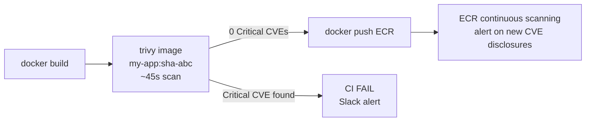

### Pitfalls
- ❌ **Scanning only at build time:** A vulnerability disclosed 6 months later won't be caught unless you also scan running images — enable registry continuous scanning.
- ❌ **Blocking on all severities:** Blocking on Medium CVEs in a base image you can't upgrade immediately will halt all deployments — define a pragmatic policy (Critical = block, High = 7-day SLA to fix).

### Concept Reference
→ [CI/CD Pipeline Design](./cicd-pipeline-design)

---

## Q10: Design a container platform for 50 microservices — orchestration, networking, secrets, observability
**Role:** Senior | **Difficulty:** 🔴 | **Priority:** P1 | **Format:** Scenario
**Real Company:** Airbnb (moved 50+ services from VMs to Kubernetes)

### The Brief
> "Your team is migrating 50 microservices from bare VMs to containers. Design the container platform: choice of orchestrator, networking model, secrets management, observability stack, and image security pipeline. The platform must support 20 engineering teams with minimal DevOps overhead."

### Clarifying Questions
1. Cloud provider? (EKS vs GKE vs self-managed)
2. Current observability stack? (migrate Datadog or adopt Prometheus?)
3. Any compliance requirements? (PCI, HIPAA — affects secrets and network policy)
4. Monorepo or polyrepo? (impacts image build strategy)
5. Current team Kubernetes expertise level? (affects complexity vs managed service decision)

### Back-of-Envelope Estimation
| Metric | Calculation | Result |
|-|-|-|
| Pods per service | 3 replicas avg × 50 services | 150 Pods baseline |
| Peak pods | 150 × 3× scale headroom | 450 Pods peak |
| Node sizing | 450 Pods / 30 Pods per m5.xlarge | 15 nodes; target 20 with headroom |
| CPU per sidecar (Istio) | 450 Pods × 75m CPU | ~34 CPU cores for Istio overhead |
| Network policies | 50 services × avg 5 allowed callers | 250 NetworkPolicy rules |

### High-Level Architecture

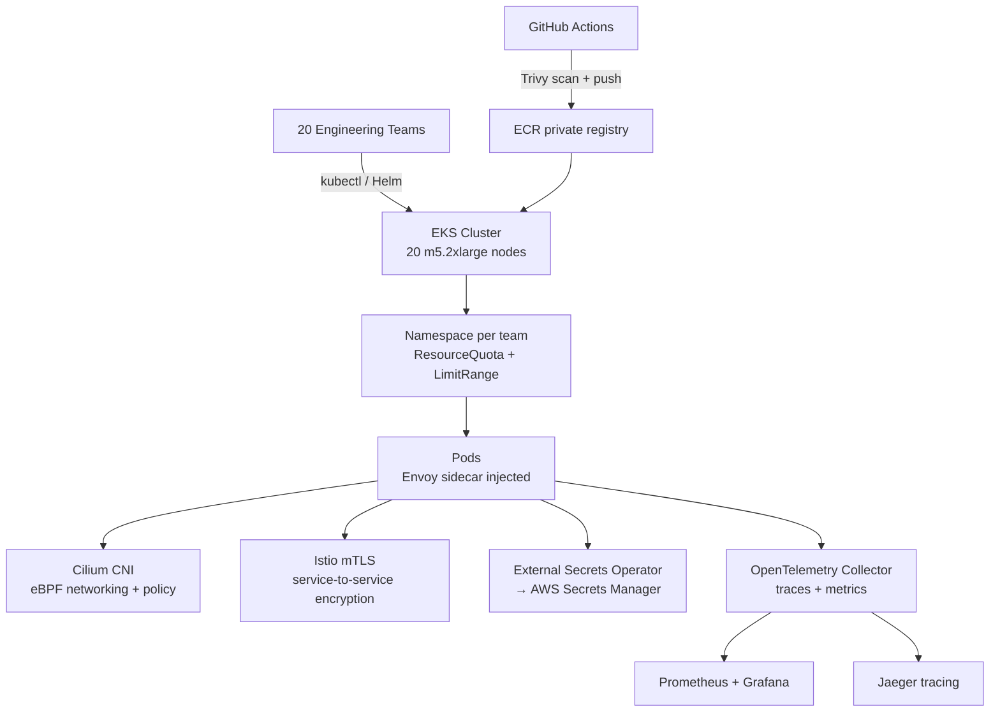

### Trade-off Decisions
| Decision | Option A | Option B | Chosen | Why |
|-|-|-|-|-|
| Orchestrator | Self-managed K8s | EKS managed | EKS | No control plane ops; 20-team scale |
| Networking | Calico | Cilium eBPF | Cilium | eBPF performance + L7 network policy |
| Service mesh | Istio | Linkerd | Istio | Richer traffic management for canary deployments |
| Secrets | K8s Secrets + KMS | External Secrets Operator | ESO + Secrets Manager | Centralised rotation, not in etcd |
| Observability | Datadog (SaaS) | Prometheus + Grafana | Prometheus + Grafana | Cost; team owns the stack |
| Image scanning | Manual | Trivy in CI + ECR scan | Both | Defence in depth |

### Failure Modes
| Failure | Impact | Mitigation |
|-|-|-|
| Node failure | ~15 Pods evicted | PodDisruptionBudget + multi-AZ node groups |
| Istio control plane failure | mTLS certs expire after 24hrs | Istio HA mode (3 Istiod replicas); cert expiry alert |
| ECR quota exceeded | CI fails to push images | Lifecycle policies: retain last 20 tags per repo |
| Secrets Manager outage | Pod restarts can't fetch new secrets | Cache secrets in ESO; don't fail pod startup on cache hit |
| CVE in base image | All 50 services vulnerable | ECR continuous scanning + auto-PR to bump base image |

### Concept References
→ [Kubernetes Architecture](./kubernetes-architecture)
→ [CI/CD Pipeline Design](./cicd-pipeline-design)
→ [Observability](../../../system-design/scale-and-reliability/observability)
