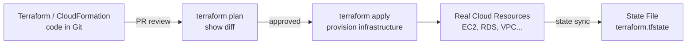
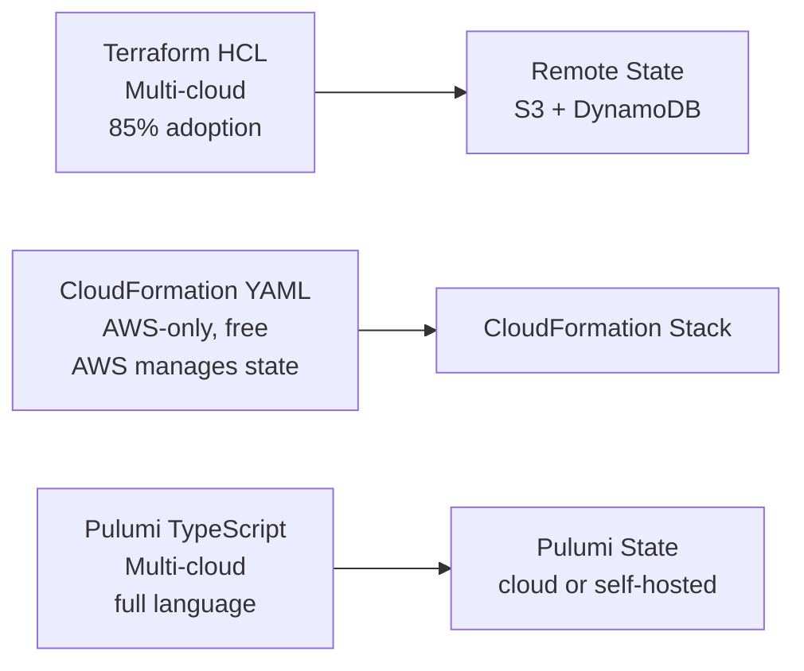
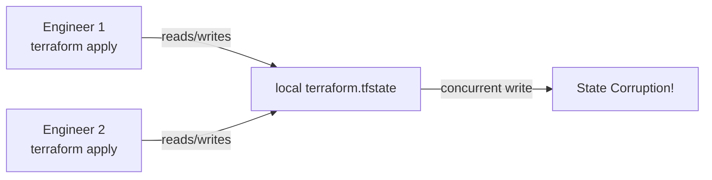
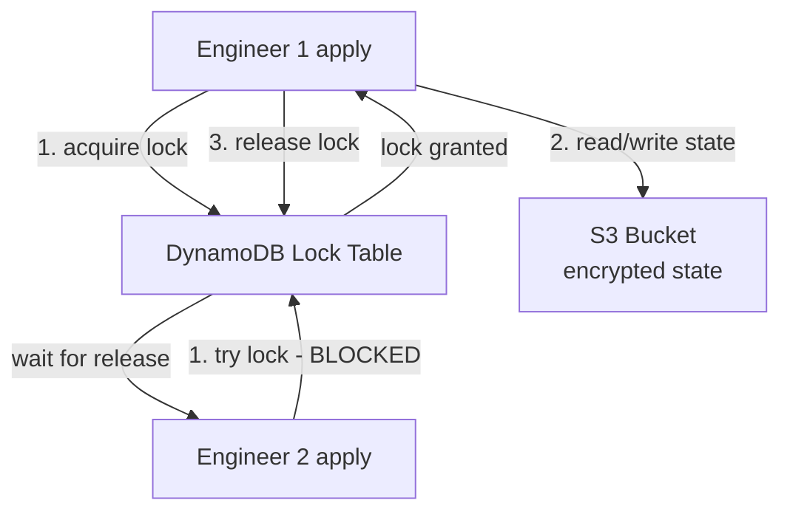
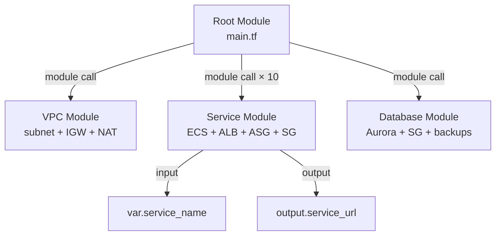
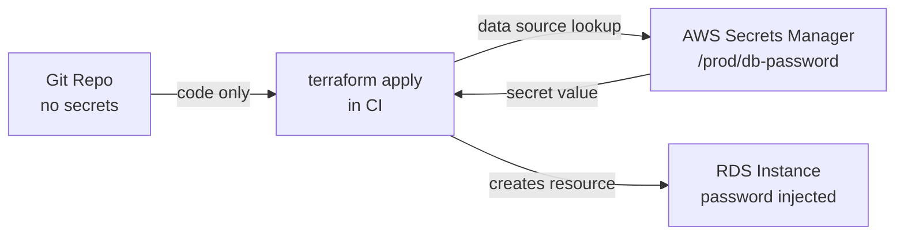
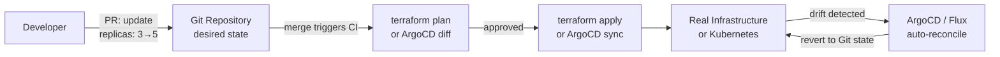
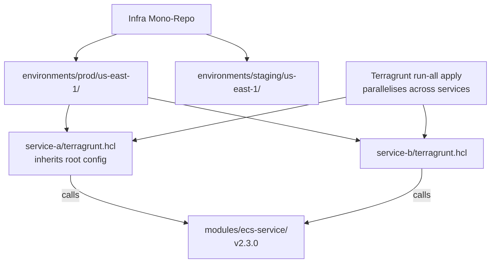
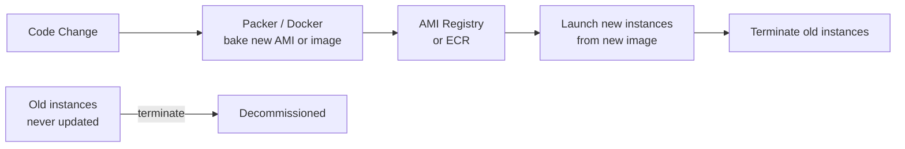
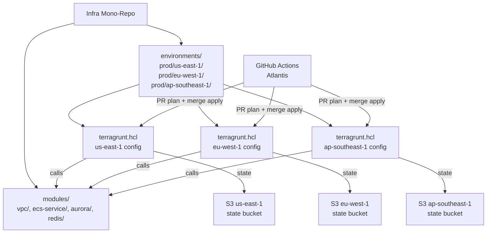

# Infrastructure as Code — Interview Questions

10 questions covering IaC fundamentals, Terraform state management, module design, drift detection, secrets in IaC, and GitOps.

---

## Q1: What is Infrastructure as Code and what problems does it solve?
**Role:** Mid-level, DevOps | **Difficulty:** 🟢 | **Priority:** P0 | **Format:** Quick Answer

> **What the interviewer is testing:** Whether you can articulate the value proposition of IaC beyond "it's automated."

### Answer in 60 seconds
- **Definition:** Defining and managing infrastructure (servers, networks, databases) using declarative or imperative code, stored in version control, applied by automation.
- **Problems solved:**
  - **Snowflake servers:** Manually configured servers diverge over time — you can't recreate them. IaC produces identical environments on demand.
  - **No audit trail:** "Who opened port 22 to the world?" — git blame on Terraform code answers this; clicking in a console does not.
  - **Environment parity:** Dev, staging, prod should be identical except for size/data. IaC enforces parity with the same code and different variable files.
  - **Disaster recovery:** Recreate an entire AWS account from code in 20 minutes instead of 3 days of console clicking.
  - **Peer review:** Infrastructure changes go through PR review like application code — catches security issues before apply.

### Diagram



### Pitfalls
- ❌ **"IaC means no manual changes":** IaC is only effective if the team disciplines itself to *never* make manual console changes — one console click can cause state drift that blocks future applies.
- ❌ **Not storing state remotely:** Local `terraform.tfstate` means only one engineer can work on infrastructure at a time; file loss = unknown state.

### Concept Reference
→ [CI/CD Pipeline Design](./cicd-pipeline-design)

---

## Q2: What is the difference between Terraform, CloudFormation, and Pulumi?
**Role:** Mid-level | **Difficulty:** 🟢 | **Priority:** P1 | **Format:** Quick Answer

> **What the interviewer is testing:** Awareness of the IaC landscape and ability to choose the right tool for the context.

### Answer in 60 seconds
- **Terraform (HCL):** Multi-cloud, declarative. Providers for 3,000+ services. State managed separately (S3 + DynamoDB). Open-source core + Terraform Cloud (paid). Most widely adopted (85% of IaC job postings mention it).
- **CloudFormation (YAML/JSON):** AWS-native, free, tightly integrated (stack events, drift detection). Cannot manage non-AWS resources. Verbose YAML; complex nested stacks. No state file concept — AWS manages state.
- **Pulumi (TypeScript/Python/Go):** General-purpose programming language for IaC — loops, conditions, functions are native. Multi-cloud. State stored in Pulumi Cloud or self-hosted. Best for complex logic that HCL struggles with.
- **CDK (AWS CDK):** AWS-specific Pulumi-like tool. Write TypeScript/Python that synthesises to CloudFormation. Best for AWS-only shops that want programming language expressiveness.

### Diagram



### Pitfalls
- ❌ **Choosing CloudFormation for multi-cloud:** CloudFormation cannot manage GCP or Azure resources — locked in from day 1.
- ❌ **Choosing Pulumi for a YAML-comfortable team:** Pulumi requires programming language proficiency; HCL Terraform is more accessible to ops-focused teams.

### Concept Reference
→ [CI/CD Pipeline Design](./cicd-pipeline-design)

---

## Q3: How does Terraform manage state and what problems does remote state solve?
**Role:** Senior | **Difficulty:** 🟡 | **Priority:** P1 | **Format:** Deep Dive

> **What the interviewer is testing:** Understanding of the most operationally critical aspect of Terraform — state management failures are the #1 cause of Terraform incidents.

### Problem Constraints
| Dimension | Value |
|-----------|-------|
| State file size | Typically 1MB–50MB per workspace |
| Concurrent apply risk | Two applies simultaneously = state corruption |
| State lock timeout | Default: indefinite wait (configurable) |
| Remote state backend options | S3 + DynamoDB, Terraform Cloud, GCS, Azure Blob |

### Approach A — Local State (development only)



Problems: no collaboration, no locking, file can be lost, sensitive outputs stored locally.

### Approach B — Remote State with Locking (S3 + DynamoDB)



**S3 remote backend config:**
- Bucket: versioning enabled (state history for rollback)
- Encryption: SSE-S3 or SSE-KMS (state contains resource IDs and sometimes secrets)
- DynamoDB table: `LockID` attribute, used for atomic lock acquisition

**State data contains:**
- All resource IDs and attributes from the last `apply`
- Outputs (can include sensitive values — use `sensitive = true`)
- Module dependencies

### Approach C — Terraform Workspaces for Environment Isolation

Each workspace has its own state file (`env:/dev/terraform.tfstate`, `env:/prod/terraform.tfstate`). Allows reusing the same configuration with different variable sets. Alternative: separate directories per environment (more explicit, less "magic").

| Dimension | Local State | S3 + DynamoDB | Terraform Cloud |
|-|-|-|-|
| Collaboration | Single engineer | Team | Team + UI |
| Locking | None | DynamoDB | Built-in |
| Versioning | None | S3 versioning | Full history |
| Secret in state | Plaintext locally | Encrypted at rest | Encrypted |
| Cost | Free | ~$0 (pennies) | Free tier then paid |

### Recommended Answer
Always use remote state in S3 with DynamoDB locking for teams. Enable S3 versioning and KMS encryption. Keep state per-environment in separate workspaces or separate backends. Never commit `.tfstate` to git.

### What a great answer includes
- [ ] Explains what the state file contains and why it's sensitive
- [ ] Describes the locking mechanism and what happens without it
- [ ] Mentions S3 versioning as a state rollback mechanism
- [ ] Knows about `terraform state` commands for manual state manipulation
- [ ] Understands `data "terraform_remote_state"` for cross-module state sharing

### Pitfalls
- ❌ **Committing tfstate to git:** State contains resource IDs, private IPs, and potentially secret values — a common security incident source.
- ❌ **One state file for all resources:** A state file covering 500 resources means every plan operation is slow and a single bad apply can affect unrelated resources — use Terragrunt or separate state per service.

### Concept Reference
→ [CI/CD Pipeline Design](./cicd-pipeline-design)

---

## Q4: What is Terraform module design and when do you extract a module?
**Role:** Senior | **Difficulty:** 🟡 | **Priority:** P1 | **Format:** Quick Answer

> **What the interviewer is testing:** Code organisation discipline — IaC modules are the equivalent of functions/classes in application code.

### Answer in 60 seconds
- **Module:** A reusable Terraform configuration with inputs (variables), outputs, and resources. Called with `module "name" { source = "..." }`.
- **Extract a module when:**
  - Same pattern repeated 3+ times (e.g., "an ECS service with ALB, target group, and auto scaling" created for 20 services).
  - A component crosses team boundaries (shared VPC, shared security groups).
  - You want to enforce standards (every S3 bucket must have versioning and encryption — embed in the module).
- **Module sources:** Local `./modules/`, Terraform Registry (`hashicorp/vpc/aws`), private Git repos.
- **Module versioning:** Pin module version with `?ref=v1.2.0` on git sources or version constraints on registry modules — prevents surprise breaking changes.
- **Principle:** A root module should read like "what" infrastructure exists. A module should hide "how" it's implemented.

### Diagram



### Pitfalls
- ❌ **One mega-module for everything:** A module with 50 resources creates tight coupling — changes to one resource require careful analysis of all consumers.
- ❌ **No output pinning:** If a module doesn't export necessary outputs (e.g., security group ID), calling modules must hard-code IDs, defeating the purpose.

### Concept Reference
→ [Infrastructure as Code — state management](./infrastructure-as-code)

---

## Q5: How do you detect and handle infrastructure drift in Terraform?
**Role:** Senior | **Difficulty:** 🟡 | **Priority:** P2 | **Format:** Deep Dive

> **What the interviewer is testing:** Operational maturity — real-world infrastructure always drifts, and you need a strategy.

### Problem Constraints
| Dimension | Value |
|-----------|-------|
| Drift definition | Real infra state ≠ Terraform state |
| Common causes | Manual console changes, AWS auto-updates, out-of-band scripts |
| Detection frequency | Daily plan in CI recommended |
| Risk | Undetected drift → next apply overwrites manual fix or fails |

### Approach A — terraform plan as a Drift Detection Mechanism

```mermaid
graph LR
  CRON[Scheduled CI Job\ndaily at 6am] --> PLAN[terraform plan\n-detailed-exitcode]
  PLAN -->|exit code 2 = diff| ALERT[Slack alert\n"Drift detected in prod"]
  PLAN -->|exit code 0 = no diff| OK[No action]
  ALERT --> REVIEW[Engineer reviews\nmanual or revert]
```

`terraform plan -detailed-exitcode`: exit 0 = no changes, exit 1 = error, exit 2 = changes detected.

### Approach B — Dedicated Drift Detection Tools

- **driftctl:** Scans cloud resources against Terraform state; reports unmanaged resources and modified attributes. More comprehensive than `terraform plan` (catches resources Terraform doesn't know about).
- **CloudFormation Drift Detection:** Built-in; shows per-resource property drift in AWS console.
- **Infracost:** Cost-focused drift detection — alerts when resources change in ways that affect cost.

### Approach C — Prevent Drift at the Source

SCPs or IAM policies that deny direct console modifications in production; all changes must go through Terraform (GitOps enforcement). AWS Config rules detect out-of-band changes and trigger Lambda to revert or alert.

| Dimension | terraform plan schedule | driftctl | Console lock (SCPs) |
|-|-|-|-|
| Detects unmanaged resources | No (only managed) | Yes | Prevents creation |
| Detects attribute drift | Yes | Yes | Prevents modification |
| Auto-remediation | No | No | Prevents (proactive) |
| Cost | Free | Open-source | Free |

### Recommended Answer
Run `terraform plan -detailed-exitcode` in CI daily; alert on exit code 2. For production, combine with SCPs to prevent direct console modification. Use driftctl monthly for a full audit of unmanaged resources.

### What a great answer includes
- [ ] Defines drift clearly (actual ≠ desired state)
- [ ] Explains `terraform refresh` updates state from real infra (useful but dangerous — overwrites desired state)
- [ ] Knows `-detailed-exitcode` flag for automated detection
- [ ] Distinguishes between drift in managed resources vs unmanaged resources
- [ ] Addresses the remediation decision: apply to fix drift vs import the manual change

### Pitfalls
- ❌ **Running terraform refresh blindly:** `refresh` overwrites your Terraform state with current cloud reality — if someone deleted a resource manually, refresh removes it from state without recreating it.
- ❌ **Ignoring drift in staging:** Staging drift often predicts prod drift — fix it everywhere or it becomes a pattern.

### Concept Reference
→ [CI/CD Pipeline Design](./cicd-pipeline-design)

---

## Q6: How do you manage secrets in IaC without storing them in git?
**Role:** Senior | **Difficulty:** 🟡 | **Priority:** P2 | **Format:** Quick Answer

> **What the interviewer is testing:** Security discipline — IaC secrets in git is one of the most common cloud security incidents.

### Answer in 60 seconds
- **Never hardcode secrets in `.tf` files or `terraform.tfvars`.** Git history is permanent — even a deleted secret is retrievable.
- **External secret injection:** Pass secrets as environment variables (`TF_VAR_db_password`) set by CI from a secrets manager at pipeline execution time.
- **AWS Secrets Manager / HashiCorp Vault data source:** Terraform reads the secret at plan/apply time using a `data` source. The secret value never touches the codebase.
- **SOPS (Mozilla):** Encrypt `terraform.tfvars` using AWS KMS or GPG keys. Store encrypted file in git. Decrypt at apply time. Key rotation is manageable.
- **Vault dynamic secrets:** Terraform Vault provider generates short-lived DB credentials on demand — no long-lived password to store at all.

### Diagram



### Pitfalls
- ❌ **`TF_VAR_*` in CI logs:** Terraform prints variable values in plan output — mark sensitive variables with `sensitive = true` in Terraform to suppress output.
- ❌ **Storing secrets in Terraform outputs:** Outputs are stored in state — even `sensitive = true` outputs are stored in plaintext in the state file; encrypt state with KMS.

### Concept Reference
→ [CI/CD Pipeline Design](./cicd-pipeline-design)

---

## Q7: What is GitOps and how does it apply to infrastructure management?
**Role:** Staff | **Difficulty:** 🟡 | **Priority:** P2 | **Format:** Quick Answer

> **What the interviewer is testing:** Understanding of the operational model where Git is the single source of truth for both application and infrastructure state.

### Answer in 60 seconds
- **GitOps (Weaveworks, 2017):** Operational model where: 1) all desired system state is declared in Git, 2) an agent continuously reconciles actual state to match Git, 3) the only way to change the system is via a Git commit.
- **For infrastructure (Terraform/Pulumi):** Changes go through PR → CI runs plan → approved → merged → CI runs apply. No direct `terraform apply` from laptops.
- **For Kubernetes (ArgoCD / Flux):** Agent watches a Git repo. When `deployment.yaml` changes in Git, ArgoCD applies it to the cluster within ~3 minutes. If someone manually patches a Deployment, ArgoCD reverts it to match Git.
- **Benefits:** Full audit log (git history = who changed what and why), self-healing (drift reverted automatically), rollback = `git revert`.

### Diagram



### Pitfalls
- ❌ **GitOps without branch protection:** If anyone can push to `main`, the "Git = source of truth" promise is broken — enforce required reviews and signed commits.
- ❌ **Storing secrets in the GitOps repo:** GitOps repos are often more broadly accessible than application code; use External Secrets Operator or Sealed Secrets to reference secrets, not store them.

### Concept Reference
→ [CI/CD Pipeline Design](./cicd-pipeline-design)

---

## Q8: How does Stripe manage infrastructure at scale with Terraform across 100+ AWS accounts?
**Role:** Staff | **Difficulty:** 🔴 | **Priority:** P2 | **Format:** Deep Dive

> **What the interviewer is testing:** Architectural thinking about IaC at enterprise scale — module governance, state management strategy, and team topology.

### Problem Constraints
| Dimension | Value |
|-----------|-------|
| AWS accounts | 100+ (Stripe has 1,000+ engineers) |
| State isolation | One state per account per service (1,000s of state files) |
| Module registry | Private Terraform registry or git tags |
| Apply pipeline | All applies via CI — no local `terraform apply` |
| PCI DSS compliance | Immutable audit log for all infra changes |

### Approach A — Terragrunt for DRY Multi-Account Management



Terragrunt adds: DRY backend config (one remote state config inherited by all), `run-all` for parallel applies, dependency graph between state files.

### Approach B — Atlantis for PR-Based Apply Governance

Atlantis runs as a Kubernetes Deployment. When a PR touches `.tf` files, Atlantis posts a `terraform plan` output as a PR comment. Merging the PR triggers `terraform apply` automatically. Full audit trail in GitHub PR history.

| Dimension | Manual apply | Atlantis | Terraform Cloud |
|-|-|-|-|
| Apply from laptop | Yes (risky) | No | No |
| Audit trail | None | GitHub PR | Terraform Cloud UI |
| Cost | Free | Self-hosted | $20/user/month |
| Multi-account | Manual credential management | Workspace credentials | Cloud workspaces |
| RBAC | None | GitHub branch protection | Terraform Cloud teams |

### Recommended Answer (Stripe-style)
Mono-repo of Terraform modules + Terragrunt for environment/account config. Private module registry with semantic versioning. Atlantis for PR-triggered plans and applies. One state file per service per account. All state in S3 with KMS encryption. SCPs prevent direct console changes.

### What a great answer includes
- [ ] State isolation strategy at scale (not one giant state file)
- [ ] Module versioning with breaking-change governance
- [ ] No local applies in production — all changes via CI (Atlantis or similar)
- [ ] Separate IAM roles per account assumed via CI OIDC
- [ ] Dependency management between state files (Terragrunt dependency blocks)

### Pitfalls
- ❌ **One state file for all accounts/services:** A single state corruption event can brick your entire infrastructure management capability.
- ❌ **Unpinned module versions:** Teams using `source = "git::...?ref=main"` break when another team updates the shared module.

### Concept Reference
→ [CI/CD Pipeline Design](./cicd-pipeline-design)
→ [AWS Core Services](./aws-core-services)

---

## Q9: What is immutable infrastructure and how does it reduce configuration drift?
**Role:** Staff | **Difficulty:** 🟡 | **Priority:** P3 | **Format:** Quick Answer

> **What the interviewer is testing:** Understanding of a key reliability pattern used by Netflix, HashiCorp, and cloud-native teams.

### Answer in 60 seconds
- **Mutable infrastructure:** Servers are updated in place (SSH + apt-get, Chef/Puppet/Ansible). Over time, each server diverges from its neighbours — "snowflake servers." Reproduction is impossible.
- **Immutable infrastructure:** Servers are never modified after creation. To update: build a new AMI/container image, launch new instances, terminate old ones. Every running instance is identical to the image it was launched from.
- **Benefits:**
  - Zero configuration drift — running state always matches the baked image.
  - Rollback = terminate new instances, launch previous AMI (30–60 seconds).
  - Predictable behaviour — staging and production run the exact same image.
- **Implementation:** Packer builds AMIs; Docker builds container images. CI pipeline: code change → build new image → deploy → terminate old.

### Diagram



### Pitfalls
- ❌ **SSH access to immutable servers:** If engineers can SSH and patch servers, immutability is an illusion — disable SSH in production; use SSM Session Manager for break-glass access.
- ❌ **Treating databases as immutable:** Databases store state — they cannot be replaced like stateless app servers. Immutable infrastructure applies to compute, not storage.

### Concept Reference
→ [Blue-Green & Canary Deployments](./blue-green-canary-deployments)

---

## Q10: Design the IaC strategy for a 3-region SaaS deployment — module structure, state, secrets, CI integration
**Role:** Senior | **Difficulty:** 🔴 | **Priority:** P1 | **Format:** Scenario
**Real Company:** Datadog (global SaaS on AWS, multi-region IaC)

### The Brief
> "Your SaaS application needs to expand from 1 to 3 AWS regions (us-east-1, eu-west-1, ap-southeast-1) for latency and data residency reasons. Design the Terraform IaC strategy: how do you structure modules, manage state, handle region-specific config, integrate with CI/CD, and keep secrets secure?"

### Clarifying Questions
1. Same infrastructure in all regions, or region-specific variations? (impacts module parameterisation)
2. Single AWS account or multi-account? (impacts state backend organisation)
3. Which CI platform? (impacts Atlantis vs GitHub Actions choice)
4. Data residency requirements? (EU data must stay in eu-west-1 — impacts DB config)
5. Who approves production regional deployments? (approval workflow)

### Back-of-Envelope Estimation
| Metric | Calculation | Result |
|-|-|-|
| Terraform state files | 3 regions × 8 services | 24 state files |
| Module count | Shared modules: VPC, ECS, Aurora, Redis, ALB | 5 shared modules |
| CI apply time per region | 24 resources × 10s avg | ~4 min per region |
| Total deploy time (sequential) | 3 regions × 4 min | 12 min; parallel = 4 min |

### High-Level Architecture



### Trade-off Decisions
| Decision | Option A | Option B | Chosen | Why |
|-|-|-|-|-|
| State location | Central S3 bucket | Regional S3 buckets | Regional | Data residency; avoid cross-region state access |
| Secrets | env vars in CI | Vault / Secrets Manager | Secrets Manager per region | Regional isolation; no SPOF |
| Deployment order | All 3 regions parallel | Sequential (US → EU → AP) | Sequential with 15 min bake | Validate US before EU/AP; canary region approach |
| Module sharing | Copy-paste per region | Shared modules + Terragrunt | Shared modules | DRY; one bug fix in one place |
| Apply trigger | Manual | Atlantis (PR merge) | Atlantis | Full audit; no laptop applies |

### Failure Modes
| Failure | Impact | Mitigation |
|-|-|-|
| US region apply fails | EU/AP not deployed | Sequential deployment stops; alert; fix before proceeding |
| State lock stuck | Cannot apply in any env | DynamoDB TTL on lock; `force-unlock` runbook |
| Module breaking change | All 3 regions break simultaneously | Semantic versioning; test module in staging before upgrading prod |
| Secrets Manager unavailable | Apply fails (data source error) | Cache secret in CI env var as fallback; alert |
| Accidental `terraform destroy` | Resources deleted | Require `CONFIRM_DESTROY=yes` env var; Sentinel/OPA policy denies destroy in prod |

### Concept References
→ [CI/CD Pipeline Design](./cicd-pipeline-design)
→ [AWS Core Services](./aws-core-services)
