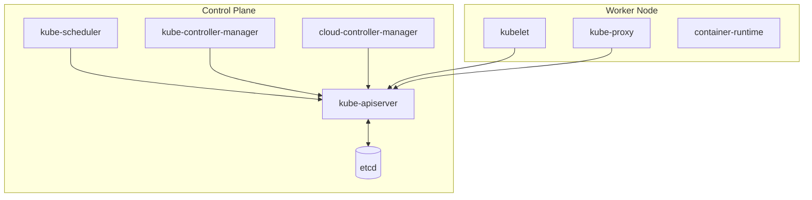
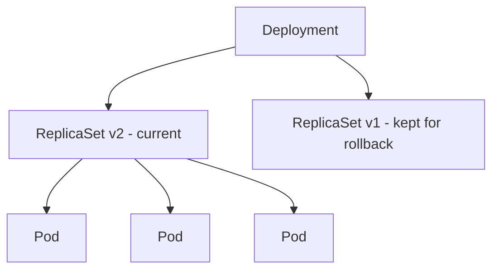
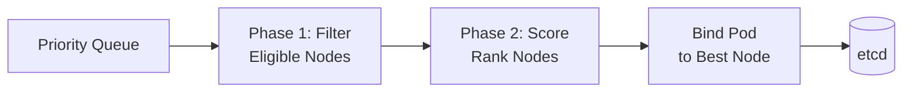
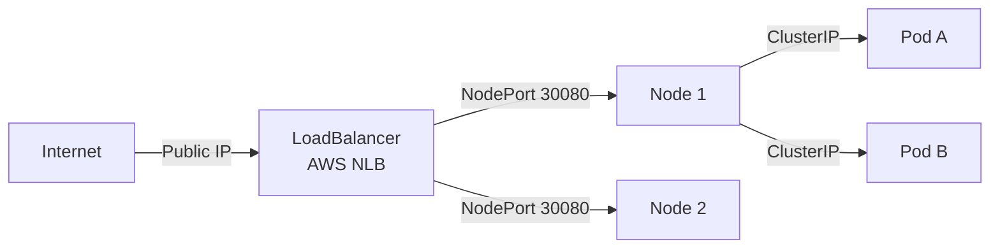
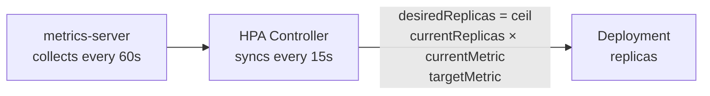
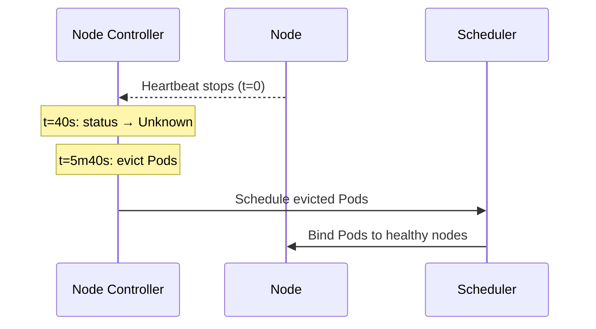
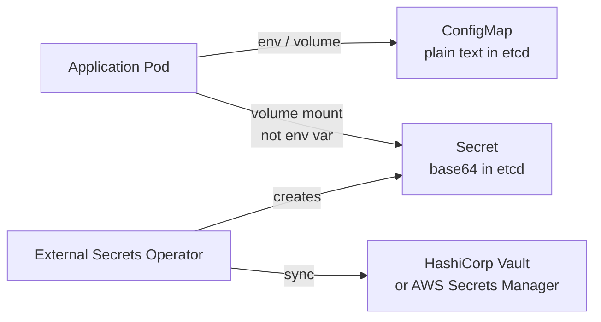
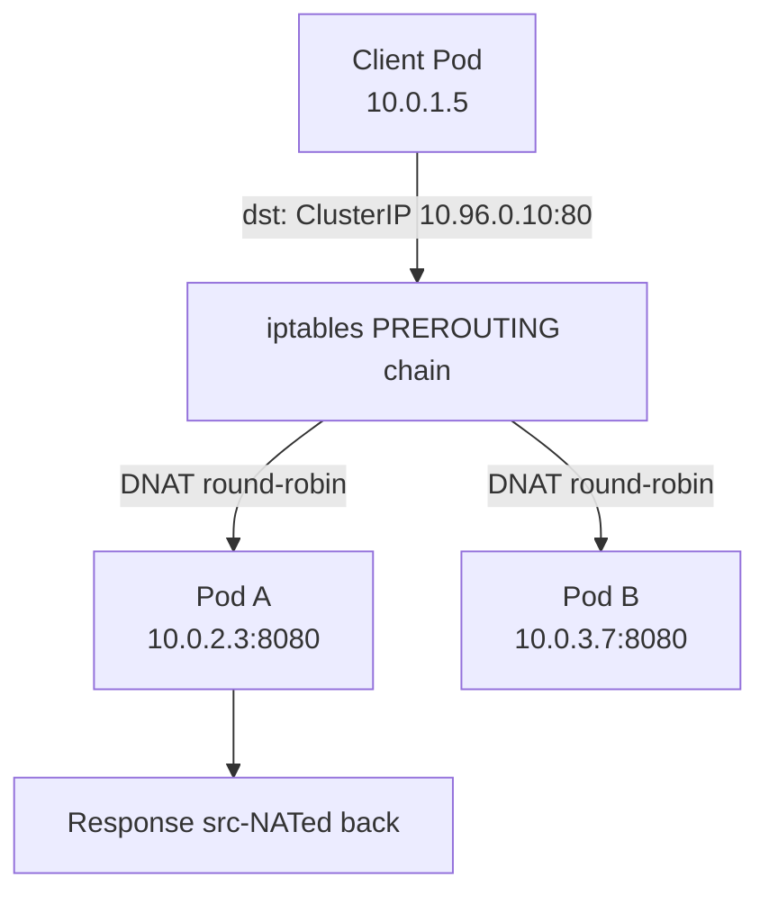
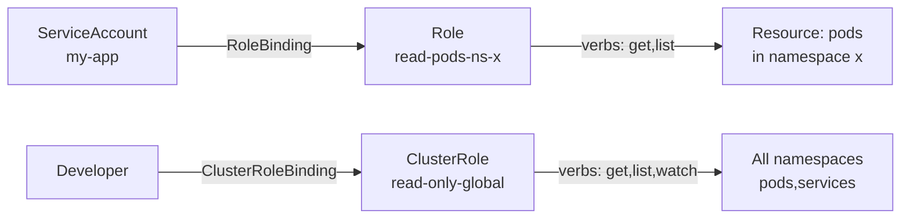
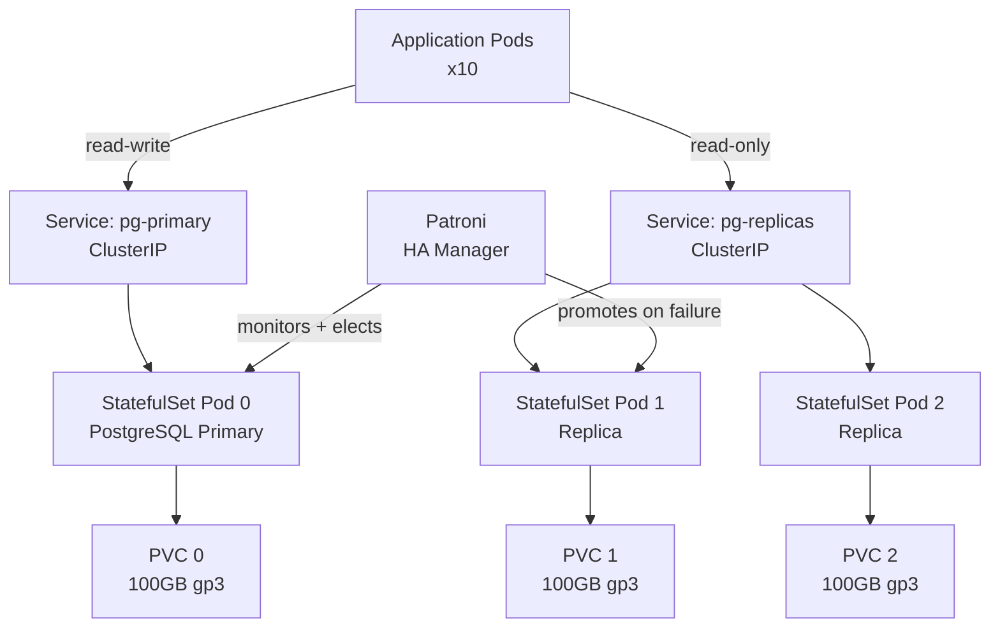

# Kubernetes Architecture — Interview Questions

10 questions covering control plane internals, scheduling, networking, autoscaling, and stateful workloads.

---

## Q1: What are the Kubernetes control plane components and what does each do?
**Role:** Mid-level, DevOps | **Difficulty:** 🟢 | **Priority:** P0 | **Format:** Quick Answer

> **What the interviewer is testing:** Whether you understand the separation of concerns in the control plane before claiming Kubernetes expertise.

### Answer in 60 seconds
- **kube-apiserver:** Single entry point for all control plane operations; validates and persists all cluster state to etcd. Handles ~10K requests/sec in large clusters.
- **etcd:** Distributed key-value store holding all cluster state; uses Raft consensus; recommended to run 3 or 5 nodes for HA. Typical clusters store <100MB of state.
- **kube-scheduler:** Watches for unscheduled Pods, scores candidate nodes (resources, affinity, taints), and binds Pod to best node. Runs scheduling in ~1ms per Pod.
- **kube-controller-manager:** Runs 30+ control loops (Deployment controller, ReplicaSet controller, Node controller, etc.) each reconciling desired vs actual state.
- **cloud-controller-manager:** Cloud-provider-specific controller for LoadBalancer services, PersistentVolumes, and node lifecycle on AWS/GCP/Azure.

### Diagram

### Pitfalls
- ❌ **"etcd is just a database":** etcd split-brain or disk latency above 10ms causes the entire cluster to stall — treat it as the most critical component.
- ❌ **Forgetting cloud-controller-manager:** Post-1.20 it is separate from kube-controller-manager; not knowing this signals you haven't worked with a real managed cluster.

### Concept Reference
→ [AWS Core Services](./aws-core-services) for managed EKS control plane specifics

---

## Q2: What is the difference between a Pod, ReplicaSet, and Deployment?
**Role:** Mid-level | **Difficulty:** 🟢 | **Priority:** P0 | **Format:** Quick Answer

> **What the interviewer is testing:** Understanding of the Kubernetes object hierarchy and why you almost never create Pods directly.

### Answer in 60 seconds
- **Pod:** Smallest schedulable unit; 1+ containers sharing a network namespace and PID namespace. Ephemeral — if a Pod dies, it stays dead unless something recreates it.
- **ReplicaSet:** Ensures N identical Pod replicas are running at all times. Replaces dead Pods automatically. Selector-based, not aware of Pod history.
- **Deployment:** Wraps a ReplicaSet and adds rolling update logic. Keeps history of ReplicaSets (default: 10 revisions) to enable rollback. You use Deployment 99% of the time.

### Diagram

### Pitfalls
- ❌ **Creating bare Pods in production:** If the node fails, a bare Pod is not rescheduled — always use Deployments.
- ❌ **Confusing ReplicaSet with ReplicationController:** RC is the legacy v1 object; RS supports set-based selectors. Never use RC in new code.

### Concept Reference
→ [Container Orchestration](./container-orchestration) for image layer and runtime details

---

## Q3: How does the Kubernetes scheduler decide which node to place a Pod on?
**Role:** Senior | **Difficulty:** 🟡 | **Priority:** P1 | **Format:** Deep Dive

> **What the interviewer is testing:** Whether you understand the two-phase scheduling pipeline and can reason about placement failures in production.

### Problem Constraints
| Dimension | Value |
|-----------|-------|
| Cluster size | 5,000 nodes (max per cluster) |
| Scheduling latency target | <1ms for most Pods |
| Pending Pod timeout | Configurable; default no hard limit |
| Throughput | ~1,000 Pods/sec in batch mode |

### Approach A — Default kube-scheduler Two-Phase Pipeline

**Phase 1 — Filtering (hard constraints):**
- NodeSelector / NodeAffinity labels
- Resource fit: `requests.cpu` + `requests.memory` ≤ node allocatable
- Taints and tolerations
- Pod affinity / anti-affinity topology keys
- PVC availability (volume zone matching)

**Phase 2 — Scoring (soft preferences, 0–100):**
- `LeastAllocated`: prefer nodes with most free resources (default weight)
- `InterPodAffinity`: boost score for nodes satisfying affinity rules
- `ImageLocality`: prefer nodes that already have the container image cached
- `NodeResourcesFit`: penalise nodes close to resource limit

| Dimension | Phase 1 Filter | Phase 2 Score |
|-|-|-|
| Failure effect | Pod goes Pending | Pod lands on lower-preference node |
| Extensibility | FilterPlugin | ScorePlugin |
| Examples | Resource, Taint, Affinity | LeastAllocated, ImageLocality |

### Approach B — Custom Scheduler / Scheduler Extenders
Register an HTTP webhook; kube-scheduler calls it during filter/score phases. Used for GPU scheduling, topology-aware placement, spot-instance preference.

### Recommended Answer
Default kube-scheduler covers 95% of use cases. Explain filter → score → bind phases with 2–3 concrete examples (node affinity, resource fit). Mention custom schedulers for GPU or specialised workloads.

### What a great answer includes
- [ ] Explains the two-phase pipeline (filter eliminates, score ranks)
- [ ] Names at least 3 filter plugins with their effect
- [ ] Explains what happens when no node passes filter (Pod stays Pending with `Insufficient cpu` event)
- [ ] Mentions `topologySpreadConstraints` for zone-aware placement (added 1.19)
- [ ] Notes that scheduler is pluggable since 1.15 (Scheduling Framework)

### Pitfalls
- ❌ **"Scheduler uses CPU usage":** Scheduler uses declared `requests`, not actual utilisation — a Pod requesting 100m on a 60%-utilised node will still land there if allocatable capacity allows.
- ❌ **Forgetting volume zone binding:** A PVC bound to `us-east-1a` forces the Pod to a node in the same AZ — a common production puzzle.

### Concept Reference
→ [Container Orchestration](./container-orchestration)

---

## Q4: What is the difference between ClusterIP, NodePort, and LoadBalancer services?
**Role:** Mid-level | **Difficulty:** 🟢 | **Priority:** P1 | **Format:** Quick Answer

> **What the interviewer is testing:** Basic Kubernetes networking knowledge required before deeper cloud or CNI questions.

### Answer in 60 seconds
- **ClusterIP (default):** Virtual IP reachable only within the cluster. kube-proxy programs iptables rules to load-balance to Pod endpoints. Port range: 10.0.0.0/8 by default.
- **NodePort:** Exposes service on every node's IP at a static port (30000–32767). External traffic → `NodeIP:NodePort` → ClusterIP → Pod. Rarely used in production (port management is painful).
- **LoadBalancer:** Provisions a cloud provider load balancer (AWS NLB/ALB, GCP LB). External IP is assigned within ~30 seconds. Costs money per service — 1 LB per service unless you use an Ingress controller.
- **ExternalName:** DNS CNAME alias — no proxying. Used to route to external services by name.
- **Ingress (not a service type):** Layer-7 HTTP routing rule; requires an Ingress controller (nginx, traefik, AWS ALB Ingress) that itself uses a LoadBalancer service.

### Diagram

### Pitfalls
- ❌ **Using NodePort in production:** Exposes every node to external traffic; firewall management becomes a nightmare at scale.
- ❌ **One LoadBalancer per service:** At 20 services you pay for 20 cloud LBs — use an Ingress controller instead.

### Concept Reference
→ [Load Balancing](../../../system-design/fundamentals/load-balancing)

---

## Q5: How does HPA (Horizontal Pod Autoscaler) work — what metrics does it use?
**Role:** Senior | **Difficulty:** 🟡 | **Priority:** P1 | **Format:** Deep Dive

> **What the interviewer is testing:** Whether you understand the feedback loop, metric types, and stabilisation windows that prevent thrashing.

### Problem Constraints
| Dimension | Value |
|-----------|-------|
| Default sync period | 15 seconds |
| Scale-up stabilisation | 0s (immediate by default) |
| Scale-down stabilisation | 300s (5 min default — prevents thrashing) |
| Max scale-up per period | Double replicas or +4, whichever is larger |
| Min/Max replicas | Configurable; HPA will not cross these bounds |

### Approach A — CPU/Memory Metrics (v1 / resource metrics)

Formula: `desiredReplicas = ceil(currentReplicas × (currentMetric / targetMetric))`

Example: 3 replicas, current CPU = 90%, target = 50% → `ceil(3 × 90/50)` = 6 replicas.

### Approach B — Custom Metrics (v2 — Prometheus Adapter, KEDA)

Supports arbitrary metrics: requests per second, queue depth, Kafka lag, custom business metrics. Requires Prometheus Adapter or KEDA (event-driven autoscaler). KEDA can scale to zero — HPA cannot.

| Dimension | CPU/Memory (v1) | Custom Metrics (v2) | KEDA |
|-|-|-|-|
| Metric source | metrics-server | Prometheus Adapter | Any event source |
| Scale-to-zero | No | No | Yes |
| Lag-based scaling | No | Kafka via adapter | Native |
| Complexity | Low | Medium | Medium |

### Recommended Answer
Explain the 15s feedback loop with the ceiling formula for CPU metrics. Note the 5-minute scale-down stabilisation window. For production, advocate custom metrics (queue depth, RPS) over raw CPU because CPU is a lagging indicator.

### What a great answer includes
- [ ] States the 15-second sync period and 5-minute scale-down window
- [ ] Writes the desiredReplicas formula with a concrete example
- [ ] Distinguishes v1 (CPU) from v2 (custom metrics)
- [ ] Mentions KEDA for scale-to-zero or event-driven workloads
- [ ] Notes that VPA (Vertical Pod Autoscaler) resizes CPU/memory requests instead

### Pitfalls
- ❌ **Autoscaling on memory alone:** Memory is not compressible — a Pod with a memory leak will cause OOMKill before HPA has time to scale.
- ❌ **No PodDisruptionBudget with HPA:** Scale-down can terminate all Pods of a small deployment simultaneously without a PDB.

### Concept Reference
→ [Observability](../../../system-design/scale-and-reliability/observability)

---

## Q6: How does Kubernetes handle a node failure — what happens to the Pods?
**Role:** Senior | **Difficulty:** 🟡 | **Priority:** P2 | **Format:** Quick Answer

> **What the interviewer is testing:** Understanding of the node lifecycle, eviction timeline, and why graceful shutdown matters.

### Answer in 60 seconds
- **Node controller** checks node health every 5 seconds via heartbeat (NodeStatus update from kubelet).
- After **40 seconds** with no heartbeat, node status becomes `Unknown`.
- After **5 minutes** (default `pod-eviction-timeout`), node controller marks Pods on that node for deletion and reschedules them onto healthy nodes.
- **Total downtime window:** Up to ~5 min 40 sec before Pods restart elsewhere — critical for SLA design.
- **Stateful workloads (StatefulSets):** Pods are not automatically deleted when node is Unknown to prevent split-brain on stateful apps — manual intervention or `kubectl delete pod --force` required.

### Diagram

### Pitfalls
- ❌ **Expecting instant failover:** The 5-minute eviction timeout means stateless Pods can be down for ~6 minutes — design readiness probes and client retry logic accordingly.
- ❌ **StatefulSet split-brain:** Force-deleting a StatefulSet Pod on an Unknown node without confirming the node is truly dead can cause two Pods with the same identity writing to the same storage.

### Concept Reference
→ [Microservices Migration](../../../system-design/scale-and-reliability/microservices-migration)

---

## Q7: What is the difference between ConfigMap and Secret — how are they secured?
**Role:** Senior | **Difficulty:** 🟡 | **Priority:** P2 | **Format:** Quick Answer

> **What the interviewer is testing:** Security awareness around Kubernetes secret management, including the known weaknesses of native Secrets.

### Answer in 60 seconds
- **ConfigMap:** Non-sensitive configuration data (feature flags, app config). Stored in etcd as plain text. Size limit: 1MB. Mounted as files or env vars.
- **Secret:** Sensitive data (passwords, tokens, TLS certs). Stored in etcd **base64-encoded, not encrypted by default.** Same 1MB limit.
- **Securing Secrets:**
  - Enable etcd encryption at rest (`EncryptionConfiguration` with AES-256-GCM or KMS provider).
  - Use an external secret manager: AWS Secrets Manager + External Secrets Operator, or HashiCorp Vault with the Vault Agent sidecar.
  - RBAC: Restrict `get`/`list` on `secrets` — `list` returns all values.
  - Avoid mounting Secrets as env vars (appear in `kubectl describe pod` and crash dumps); prefer volume mounts.

### Diagram

### Pitfalls
- ❌ **"Secrets are encrypted":** Base64 is encoding, not encryption. Without etcd encryption at rest anyone with etcd access can read all Secrets.
- ❌ **Mounting secrets as env vars:** Env vars are visible in `/proc/<pid>/environ`, crash dumps, and `kubectl describe pod` output.

### Concept Reference
→ [AWS Core Services](./aws-core-services) for AWS Secrets Manager integration

---

## Q8: How does Kubernetes networking work — CNI plugins, kube-proxy, service discovery?
**Role:** Staff | **Difficulty:** 🔴 | **Priority:** P2 | **Format:** Deep Dive

> **What the interviewer is testing:** Deep understanding of the network data path — required for diagnosing production connectivity issues and choosing between CNI plugins.

### Problem Constraints
| Dimension | Value |
|-----------|-------|
| Pod CIDR | /16 per cluster (65K IPs) — configurable |
| Service CIDR | /12 by default (1M virtual IPs) |
| Max Pods per node | 110 (default); 250 with tuning |
| iptables rules per 10K services | ~160K rules — becomes a bottleneck |
| IPVS mode rule complexity | O(1) lookup vs O(n) iptables chain |

### Approach A — iptables mode (default kube-proxy)

kube-proxy watches the API server for Service/Endpoint changes and programs iptables rules. Pros: no extra daemon. Cons: O(n) rule scan; 10K services = 160K rules causing noticeable latency.

### Approach B — IPVS mode kube-proxy

Uses Linux Virtual Server kernel module with a hash table. O(1) service lookup. Supports more LB algorithms (rr, lc, sh, dh). Required for clusters with >1,000 services.

### Approach C — eBPF-based CNI (Cilium)

Bypasses iptables entirely using eBPF programs attached at the network layer. Provides Layer-7 network policies, mTLS, observability via Hubble. 40% lower latency vs iptables at 10K services.

| Dimension | iptables | IPVS | Cilium eBPF |
|-|-|-|-|
| Lookup complexity | O(n) | O(1) | O(1) |
| Network policy | Layer 3/4 only | Layer 3/4 only | Layer 7 |
| Observability | None native | None native | Hubble flows |
| mTLS | No | No | Yes (Cilium) |
| Maturity | Stable | Stable | Production (2022+) |

**DNS-based Service Discovery:**
CoreDNS (replaces kube-dns since 1.13) resolves `<service>.<namespace>.svc.cluster.local` to ClusterIP. Pods get CoreDNS as their `/etc/resolv.conf` nameserver.

### Recommended Answer
Explain Pod-to-Pod (CNI overlay/underlay), then Service-to-Pod (kube-proxy iptables/IPVS), then DNS discovery (CoreDNS). For large clusters, recommend IPVS or Cilium.

### What a great answer includes
- [ ] Distinguishes Pod network (CNI) from Service network (kube-proxy)
- [ ] Explains why iptables degrades at >1K services and recommends IPVS
- [ ] Mentions CoreDNS and the FQDN format for service discovery
- [ ] Knows at least one CNI plugin (Flannel, Calico, Cilium) and its trade-offs
- [ ] Explains Network Policies as Layer 3/4 firewall rules evaluated by CNI

### Pitfalls
- ❌ **Confusing CNI with kube-proxy:** CNI handles Pod-to-Pod routing; kube-proxy handles Service VIP translation — they are independent layers.
- ❌ **Ignoring DNS caching:** A missing `ndots:5` tuning in large clusters causes 5 DNS lookups per hostname resolution — a measurable latency tax.

### Concept Reference
→ [Container Orchestration](./container-orchestration)

---

## Q9: How does Kubernetes RBAC control who can access what?
**Role:** Staff | **Difficulty:** 🟡 | **Priority:** P2 | **Format:** Quick Answer

> **What the interviewer is testing:** Security posture and ability to implement least-privilege in a multi-tenant cluster.

### Answer in 60 seconds
- **Subjects:** User, Group, ServiceAccount — who is acting.
- **Verbs:** get, list, watch, create, update, patch, delete — what action.
- **Resources:** pods, secrets, deployments — what object type.
- **Role:** Namespaced; grants verbs on resources within one namespace.
- **ClusterRole:** Cluster-wide; also used for non-namespaced resources (nodes, PVs).
- **RoleBinding / ClusterRoleBinding:** Attaches a Role to a Subject.
- **Key rule:** Deny by default — no Role = no access. RBAC is additive only (no deny rules).
- **Audit tip:** `kubectl auth can-i --list --as=system:serviceaccount:default:my-sa` enumerates what a ServiceAccount can do.

### Diagram

### Pitfalls
- ❌ **Granting `cluster-admin` to app ServiceAccounts:** A compromised Pod can then delete all workloads — a common supply-chain attack pivot.
- ❌ **Forgetting `list` exposes all data:** `list secrets` returns all Secret values in a namespace, not just names.

### Concept Reference
→ [AWS Core Services](./aws-core-services) for IAM-to-RBAC mapping with AWS EKS

---

## Q10: Design a Kubernetes deployment for a stateful application (PostgreSQL) with HA and persistent storage
**Role:** Senior | **Difficulty:** 🔴 | **Priority:** P1 | **Format:** Scenario
**Real Company:** GitLab (self-managed PostgreSQL on Kubernetes)

### The Brief
> "Your team wants to run PostgreSQL in Kubernetes for a SaaS application serving 50K users. The DBA requires: zero data loss on node failure, automatic failover within 60 seconds, persistent storage surviving Pod restarts, and rolling upgrades without downtime."

### Clarifying Questions
1. Are we running primary-only or primary + read replicas? (impacts StatefulSet replica count)
2. Which cloud provider? (determines StorageClass — gp3 on AWS, pd-ssd on GCP)
3. What is the RPO? (zero data loss = synchronous replication required)
4. Is Patroni/Stolon/CloudNativePG acceptable, or raw PostgreSQL StatefulSet?
5. What backup strategy — WAL streaming to S3?

### Back-of-Envelope Estimation
| Metric | Calculation | Result |
|-|-|-|
| Storage per node | 50K users × 50KB avg row size × 10 tables | ~25GB + indexes → 100GB PVC |
| IOPS needed | 50K users × 10 writes/min / 60 = ~8K writes/sec | gp3 baseline 3K IOPS; provision 8K IOPS |
| Failover window | Patroni TTL 30s + election + DNS propagation | ~45–60 seconds |
| Network replication lag | Synchronous replication overhead | +2–5ms write latency |

### High-Level Architecture

### Trade-off Decisions
| Decision | Option A | Option B | Chosen | Why |
|-|-|-|-|-|
| HA operator | Raw StatefulSet | CloudNativePG operator | CloudNativePG | Built-in switchover, backup, monitoring |
| Replication mode | Async (fast) | Sync (safe) | Sync | Zero data loss requirement |
| Storage | NFS/ReadWriteMany | Block storage gp3/ReadWriteOnce | Block gp3 | Lower latency, no NFS split-brain |
| Backup | pg_dump cron | WAL-G streaming to S3 | WAL-G | Point-in-time recovery, <5min RPO |
| Upgrade strategy | Delete + recreate | Rolling (StatefulSet updateStrategy) | Rolling ordered | No downtime; replicas updated first |

### Failure Modes
| Failure | Impact | Mitigation |
|-|-|-|
| Primary node failure | 45–60s failover via Patroni election | Synchronous replica; Patroni TTL=30s |
| PVC corruption | Data loss if no backup | WAL-G to S3 every 5 min; daily base backup |
| etcd loss (Patroni DCS) | No leader election possible | Run Patroni DCS on dedicated etcd, not cluster etcd |
| Rolling upgrade failure | Old+new version mismatch | PodDisruptionBudget maxUnavailable=1; canary replica first |
| Split-brain | Two primaries write simultaneously | Patroni fencing via `pg_ctl stop` before promoting replica |

### Concept References
→ [Container Orchestration](./container-orchestration)
→ [AWS Core Services](./aws-core-services)
