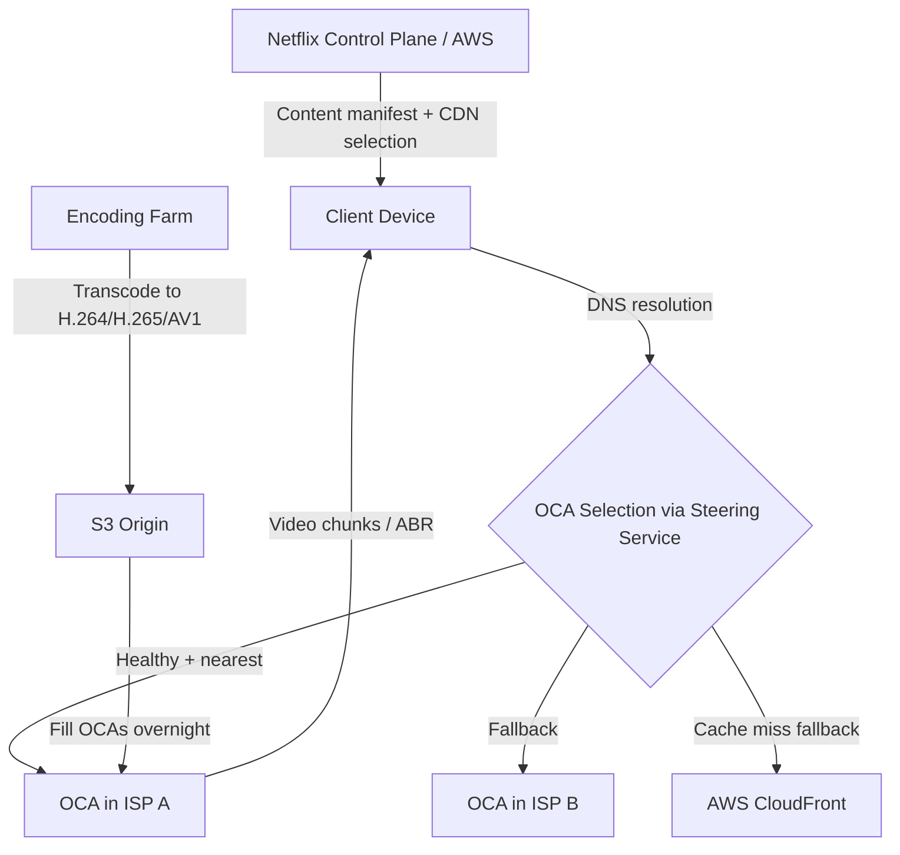
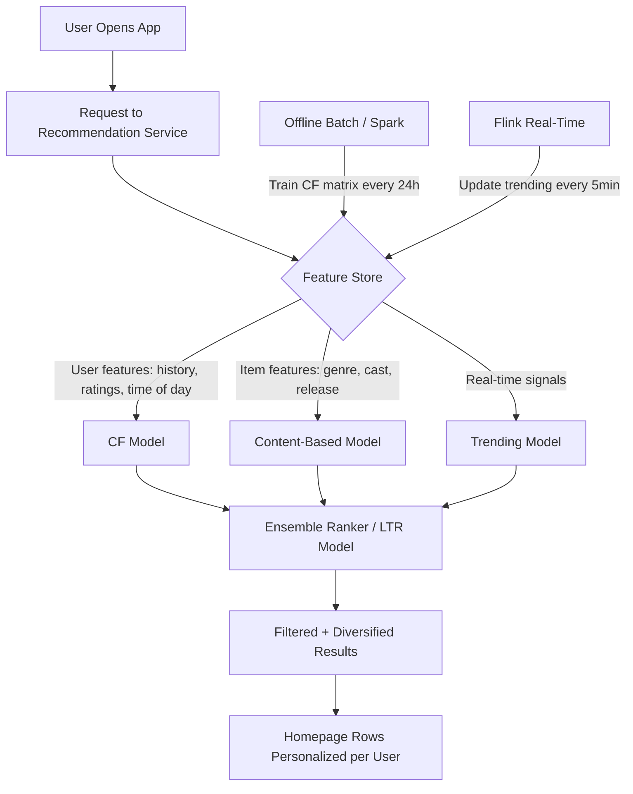
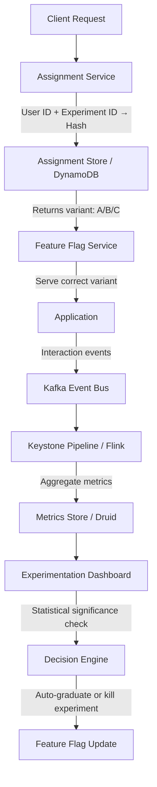
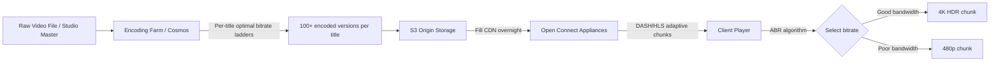
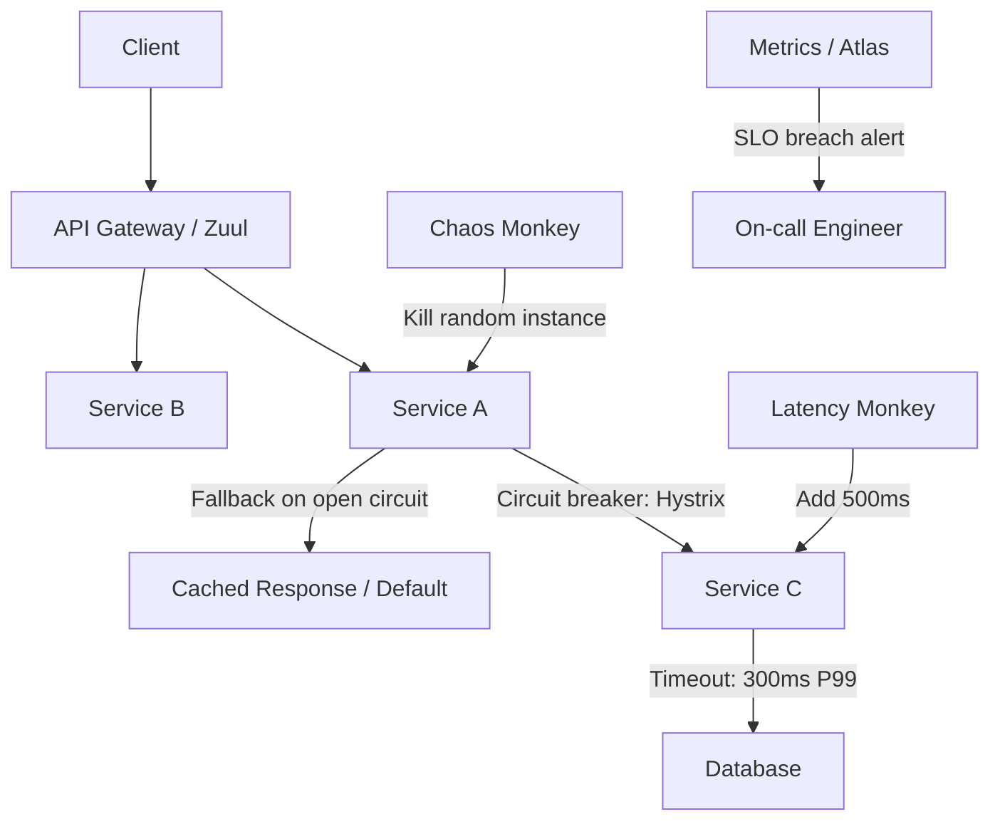
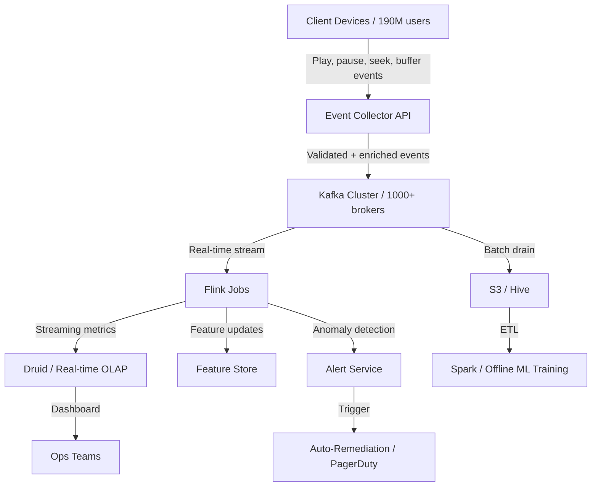
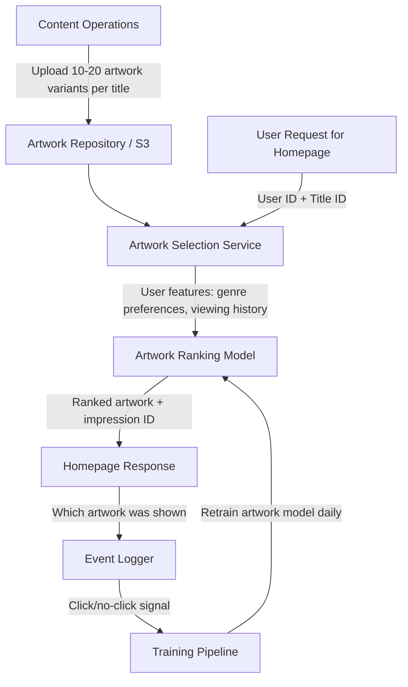

# Netflix System Design Interview Guide

> **Scale context**: 190M+ subscribers, 15% of global internet bandwidth during peak hours, 200+ microservices, 1 billion+ API calls per day, content streamed in 190 countries.

---

## 1. The Netflix Interview Loop

Netflix typically runs **4–5 rounds** focused on:

1. **Phone screen** — 45 min, one system design or coding question
2. **System design round 1** — Distributed systems, data pipelines, or real-time processing
3. **System design round 2** — Product design with scale constraints (streaming, recommendations)
4. **Behavioral** — Leadership principles, "tell me about a time you dealt with failure"
5. **Architecture deep-dive** (senior+) — Multi-region, chaos engineering, observability

### What Netflix Cares About

| Theme | Why It Matters | Interview Signal |
|-------|---------------|-----------------|
| **Chaos Engineering** | They invented it (Chaos Monkey, 2011) | Do you design for failure, not against it? |
| **Resilience patterns** | 200+ services must degrade gracefully | Bulkheads, circuit breakers, fallbacks |
| **Data at scale** | 500B+ events/day from viewing activity | Can you design event-driven data pipelines? |
| **Personalization** | 75% of watch time from recommendations | Do you understand collaborative filtering + ML serving? |
| **Microservices** | 200+ services, full team ownership | Conway's law, API contracts, service mesh |

### The #1 Mistake Candidates Make

**Not knowing Netflix Open Connect** — their proprietary CDN embedded directly inside ISP infrastructure worldwide. Netflix does NOT primarily use AWS CloudFront or Akamai for streaming. They place appliances at ISPs so that popular content is cached within the ISP's own network, reducing bandwidth costs and latency. If you design their CDN as "use CloudFront," you've lost the signal.

---

## 2. Top 10 Netflix System Design Questions

---

### Question 1: Design Netflix's Content Delivery Network (Open Connect)

**Scale**: 190M subscribers, 15% of global internet bandwidth, peaks at 3+ Tbps

**The question**: "Netflix needs to deliver video to 190 million subscribers globally with < 50ms buffering. How do you design the CDN?"

#### Netflix-Specific Insight: Open Connect Appliances (OCAs)

Netflix runs their own CDN by partnering with ISPs to place **Open Connect Appliances** within ISP data centers. When you watch Netflix in Mumbai, the video comes from a box inside Jio's network, not from a Netflix data center.

```
User (Mumbai) → Jio ISP → Open Connect Appliance (inside Jio) → Video stream
                            ↑
                      Popular content pre-loaded
                      Cache hit rate: ~95%
```

**Key decisions**:

| Decision | Choice | Reason |
|----------|--------|--------|
| CDN model | ISP-embedded appliances | Eliminates last-mile latency, reduces bandwidth cost |
| Content placement | Proactive pre-positioning | Popular titles pushed overnight, not on first request |
| Fallback | AWS CloudFront | Long-tail content, cache misses |
| Cache strategy | Popularity-based LRU per region | Top 10,000 titles cover ~95% of traffic |

**Architecture**:



**Common interview mistake**: Designing this as "put CloudFront in every region." The insight is that Netflix moved the CDN INSIDE the ISPs, eliminating the peering hop entirely.

**Follow-up questions**:
- How do you handle ISP agreements and placement decisions?
- How do you proactively pre-position content vs. reactive caching?
- What happens when an OCA fails mid-stream? (ABR switches to backup OCA seamlessly)

---

### Question 2: Design Netflix's Recommendation Engine

**Scale**: 190M users, 15,000+ titles, 75% of watch time driven by recommendations

**The question**: "How would you design the system that generates personalized recommendations for Netflix's homepage?"

#### Netflix-Specific Insight: Multiple Overlapping Algorithms

Netflix doesn't use one algorithm — they blend 10+ algorithms and use A/B testing to weight them:

- **Collaborative Filtering** (CF): Users with similar taste watch similar things
- **Content-Based Filtering**: Based on what you already watched
- **Trending Now**: Real-time popularity signals
- **Because you watched X**: Direct item-to-item similarity
- **Top Picks for You**: Personalized ranking of top content
- **Continue Watching**: Resume signals + churn prediction



**Key design decisions**:

| Layer | Technology | Why |
|-------|-----------|-----|
| Offline training | Apache Spark on EMR | Matrix factorization, 190M x 15K matrix |
| Feature store | Netflix Hollow + S3 | Read-optimized, full dataset in memory |
| Model serving | TensorFlow Serving | Sub-10ms inference |
| A/B testing layer | Netflix experimentation platform | Which algorithm blends perform better? |
| Real-time features | Apache Kafka + Flink | Trending, just-watched signals |

**Scale numbers**:
- Matrix factorization: 190M users × 15,000 titles = 2.85 billion cells
- Serving latency target: < 100ms P99 for homepage load
- A/B tests running simultaneously: 300+ at any given time

**Common mistake**: Designing recommendations as a single CF model. Netflix uses a multi-stage ranking pipeline with dozens of specialized models contributing to a final ensemble.

---

### Question 3: Design Netflix's A/B Testing Platform

**Scale**: 300+ simultaneous experiments, 190M users, statistical significance at massive scale

**The question**: "Netflix runs hundreds of A/B tests simultaneously. Design the experimentation platform."

#### Netflix-Specific Insight: Experimentation at Scale

Netflix is famous for A/B testing literally everything — thumbnail images, recommendation algorithms, UI layouts, autoplay behavior, even the compression quality of videos.

**Key challenges**:
1. **Assignment consistency**: User in experiment group A must ALWAYS see variant A, across devices
2. **Mutual exclusion**: User shouldn't be in two conflicting experiments
3. **Statistical power**: Need enough users per variant to reach significance
4. **Novelty effects**: Users behave differently with new features for first few days

**Architecture**:



**Assignment design**:
- Use consistent hashing: `hash(user_id + experiment_id) mod 100 < traffic_percentage`
- Stored in fast key-value store (EVCache/Memcached) for sub-ms lookup
- Buckets pre-allocated to avoid hotspots

**Statistical analysis**:
- Uses sequential testing (not fixed-horizon) to enable early stopping
- Metrics tracked: viewing hours, retention D7/D30, satisfaction scores (thumbs)
- False discovery rate (FDR) controlled across 300+ simultaneous tests

---

### Question 4: Design Netflix's Video Streaming Pipeline

**Scale**: 100M+ hours streamed daily, 15% of global internet bandwidth, 190 countries

**The question**: "How does Netflix encode, store, and stream a movie to a user?"

#### Netflix-Specific Insight: Per-Title and Per-Scene Encoding

Netflix doesn't use one-size-fits-all encoding. They use **per-title optimization** (2015) and **per-scene optimization** (2018) to find the optimal bitrate/quality tradeoff for each piece of content.



**Encoding details**:
- Formats: H.264, H.265 (HEVC), AV1 (most efficient, newest)
- Resolution ladder: 240p → 360p → 480p → 720p → 1080p → 1080p HDR → 4K HDR
- Per-title: analyze content complexity, assign optimal bitrate per quality level
- Per-scene: action scenes get more bits than static dialog scenes
- Result: same visual quality at 20–40% lower bitrate vs. one-size-fits-all

**Adaptive Bitrate (ABR) streaming**:
- Uses MPEG-DASH (Dynamic Adaptive Streaming over HTTP)
- Chunk size: 2–10 seconds per segment
- Client monitors bandwidth, switches resolution every chunk
- Buffer target: 30+ seconds pre-loaded

---

### Question 5: Design Netflix's Chaos Engineering Architecture

**Scale**: 200+ microservices, 1 billion+ API calls/day — everything must degrade gracefully

**The question**: "Netflix invented Chaos Engineering. How would you architect a system that continuously tests production resilience?"

#### Netflix-Specific Insight: The Simian Army

Netflix runs actual failure injection in production, not just staging:

| Tool | What It Kills |
|------|--------------|
| Chaos Monkey | Random EC2 instances |
| Chaos Gorilla | Entire AWS availability zones |
| Chaos Kong | Entire AWS regions |
| Latency Monkey | Injects artificial latency between services |
| Doctor Monkey | Checks instance health metrics, removes unhealthy |
| Janitor Monkey | Cleans up unused AWS resources |
| Security Monkey | Audits security group configurations |
| Conformity Monkey | Checks services conform to best practices |

**Architecture for resilient services at Netflix**:



**Key resilience patterns Netflix pioneered**:

1. **Circuit Breaker** (Hystrix): After N failures, open circuit and serve fallback for 30s
2. **Bulkhead**: Isolate thread pools per downstream service, failures don't cascade
3. **Timeout**: Every RPC has a hard timeout (300ms for most API calls)
4. **Fallback hierarchy**: Fresh data → cached data → degraded experience → error page
5. **Region failover**: Traffic shifts from us-east-1 to eu-west-1 in < 5 minutes

**Design principle**: "Failure is inevitable. Design for graceful degradation, not failure prevention."

---

### Question 6: Design the Keystone Real-Time Data Pipeline

**Scale**: 500 billion+ events per day, 30+ petabytes of data processed

**The question**: "Every play, pause, seek, and network switch is logged. How do you process 500B events/day in real-time?"

#### Netflix-Specific Insight: Keystone is Their Event Backbone

Keystone is Netflix's internal event streaming and processing platform built on Kafka + Flink.



**Event categories**:
- **Playback events**: play, pause, seek, buffer, quality change, error
- **UI events**: hover, click, impression, scroll
- **Infrastructure events**: service health, latency, error rates
- **Business events**: subscription, cancellation, payment

**Throughput numbers**:
- Ingestion: 500B+ events/day = ~6M events/second peak
- Kafka throughput: 40 MB/s per partition
- End-to-end latency: < 30 seconds for real-time dashboards

---

### Question 7: Design Netflix's Content Encoding System

Already covered in Question 4 (Streaming Pipeline). For a standalone question:

**Key additional detail** — Netflix's Cosmos encoding platform:
- Distributed over AWS spot instances (cheap, can be preempted)
- Each title generates 1,200+ encoded video renditions
- Total storage: 100+ petabytes of encoded content
- Re-encoding: When a new codec (AV1) is available, all 15,000 titles get re-encoded

---

### Question 8: Design Netflix's Personalization System at Scale

**Scale**: 190M users, personalized thumbnails, row ordering, and title ranking

**The question**: "Beyond recommendations, Netflix personalizes the thumbnail images shown for each title per user. Design this system."

#### Netflix-Specific Insight: Artwork Personalization

Netflix shows different thumbnail images for the SAME title to different users based on what drives engagement. A user who watches romantic comedies sees a thumbnail of the romantic subplot. An action fan sees the action sequence.



**This is a classic multi-armed bandit + contextual bandit problem**:
- Exploration: show less-seen artwork to gather data (10% of traffic)
- Exploitation: show best-performing artwork (90% of traffic)
- Context: user's mood (late night vs. afternoon), history, device type

---

### Question 9: Design Netflix's Multi-Region Architecture

**Scale**: 190 countries, 3 primary AWS regions (us-east-1, eu-west-1, ap-northeast-1)

**The question**: "Netflix needs to survive the loss of an entire AWS region. How do you architect for this?"

#### Key Design Decisions

| Decision | Choice | Rationale |
|----------|--------|-----------|
| Active-active or active-passive? | **Active-active** | Both regions serve traffic simultaneously |
| Data replication | **Cassandra multi-region** | Cross-region async replication for user data |
| Session state | **Stateless services + JWT** | No session affinity needed |
| Regional failover | **< 5 min via Route 53** | DNS-based traffic shifting with health checks |
| Streaming | **OCA in region** | Content already at edge, region failover doesn't affect streams |

**Multi-region data challenges**:
- User viewing history: eventual consistency OK (Cassandra async replication)
- Active streams: streamed from OCA directly, doesn't route through region
- Payments: Strong consistency required, Stripe handles globally

---

### Question 10: Design Netflix's Observability Platform at Scale

**Scale**: 200+ services, 1B+ API calls/day, need sub-minute anomaly detection

**The question**: "How do you monitor 200+ microservices and detect issues before users notice?"

#### Netflix's Observability Stack

| Layer | Tool | Purpose |
|-------|------|---------|
| Metrics | Atlas (in-house) | Time-series DB, 1B+ metrics/day |
| Distributed tracing | Zipkin (open-source, Netflix created) | Request tracing across 200 services |
| Logging | S3 + Elasticsearch | Structured logs, query-able |
| Alerting | Automated Canary Analysis (ACA) | Deploy → auto-check → rollback |
| Anomaly detection | Atlas + ML | Auto-detect deviations from baseline |

**Automated Canary Analysis (ACA)**:
- Deploy new version to 1% of traffic
- Compare error rates, latency, business metrics vs. baseline
- If anomaly detected within 30 min, auto-rollback
- If healthy, progressively roll out to 10% → 50% → 100%

---

## 3. Netflix-Specific Technical Topics to Know

### EVCache (Netflix's Distributed Cache)
- Memcached-based, deployed across AWS regions
- Replicates writes to all regions, reads local
- Used for: API responses, session data, recommendation results
- Scale: Billions of requests/day, sub-millisecond reads

### Zuul (API Gateway)
- Open-sourced by Netflix
- Handles: routing, auth, rate limiting, A/B testing assignment
- Written in Java, runs on every Netflix server
- Processes 1B+ API calls/day

### Hystrix (Circuit Breaker Library)
- Open-sourced by Netflix
- Wraps every RPC call with timeout + circuit breaker
- Provides thread pool isolation (bulkhead pattern)
- Dashboard shows real-time circuit state

### Eureka (Service Discovery)
- Open-sourced by Netflix
- Every service registers itself
- Clients query Eureka to find healthy instances
- Peer-to-peer replication for high availability

---

## 4. Behavioral Questions at Netflix

### "Freedom and Responsibility" Culture
Netflix's famous culture deck. They hire senior people and give autonomy. Questions probe:

- "Tell me about a time you made a significant architectural decision without waiting for consensus."
- "Describe a time when you had to roll back a production deployment."
- "Tell me about a system you designed that failed. What did you learn?"

### Chaos Engineering Mindset
- "How do you design for failure in your current role?"
- "Walk me through how you'd test the resilience of a critical service."
- "What's your approach to incident response and post-mortems?"

---

## 5. Interview Preparation Checklist

### Must-Know Topics
- [ ] Netflix Open Connect CDN architecture
- [ ] Chaos Engineering principles (Chaos Monkey, Simian Army)
- [ ] Microservices patterns: circuit breaker, bulkhead, service mesh
- [ ] Recommendation systems: collaborative filtering, matrix factorization
- [ ] Adaptive bitrate streaming (ABR / MPEG-DASH)
- [ ] A/B testing at scale: assignment consistency, statistical analysis
- [ ] Event streaming: Kafka + Flink patterns
- [ ] Multi-region active-active architecture

### Questions to Ask Your Interviewer
- "How does Netflix's chaos engineering culture influence day-to-day development decisions?"
- "What percentage of the recommendation homepage is driven by real-time vs. offline signals?"
- "How does the team decide when to invest in in-house tooling vs. using open-source or commercial solutions?"

---

## 6. Key Numbers to Memorize

| Metric | Number |
|--------|--------|
| Subscribers | 190M+ |
| Peak internet bandwidth | 15% globally |
| Watch time from recommendations | 75% |
| Microservices count | 200+ |
| Daily API calls | 1 billion+ |
| Events processed per day | 500 billion+ |
| A/B tests simultaneously | 300+ |
| Content storage | 100+ petabytes |
| OCA cache hit rate | ~95% |
| Peak streaming throughput | 3+ Tbps |

---

## 7. Common Mistakes in Netflix Interviews

1. **Not knowing Open Connect**: Saying "use CloudFront" ignores Netflix's biggest infrastructure investment.
2. **Single recommendation algorithm**: Netflix uses an ensemble of 10+ algorithms. One model = wrong answer.
3. **Ignoring chaos engineering**: If you don't mention resilience patterns, you're missing Netflix's core philosophy.
4. **Stateful services**: Netflix is obsessive about statelessness. Stateful designs raise red flags.
5. **Not discussing fallbacks**: Every API must have a fallback. "Return an error" is not a Netflix-grade answer.
6. **Forgetting multi-region**: Any production design that's single-region won't pass at Netflix's scale.

---

## References

- 📖 [Netflix Tech Blog — Simian Army (Chaos Engineering)](https://netflixtechblog.com/the-netflix-simian-army-16e57fbab116)
- 📖 [Netflix Open Connect CDN](https://openconnect.netflix.com/en/)
- 📖 [Netflix Recommendation System (Part 1)](https://netflixtechblog.com/netflix-recommendations-beyond-the-5-stars-part-1-55838468f429)
- 📖 [Netflix Keystone Real-Time Pipeline](https://netflixtechblog.com/keystone-real-time-stream-processing-platform-a3ee651812a)
- 📖 [Netflix Per-Title Video Encoding](https://netflixtechblog.com/per-title-encode-optimization-7e99442b62a2)
- 📖 [Netflix Artwork Personalization](https://netflixtechblog.com/artwork-personalization-c589f074ad76)
- 📺 [Netflix Architecture — High Scalability](https://www.youtube.com/watch?v=psQzyFfsUGU)
- 📚 [Hystrix Circuit Breaker](https://github.com/Netflix/Hystrix/wiki)
