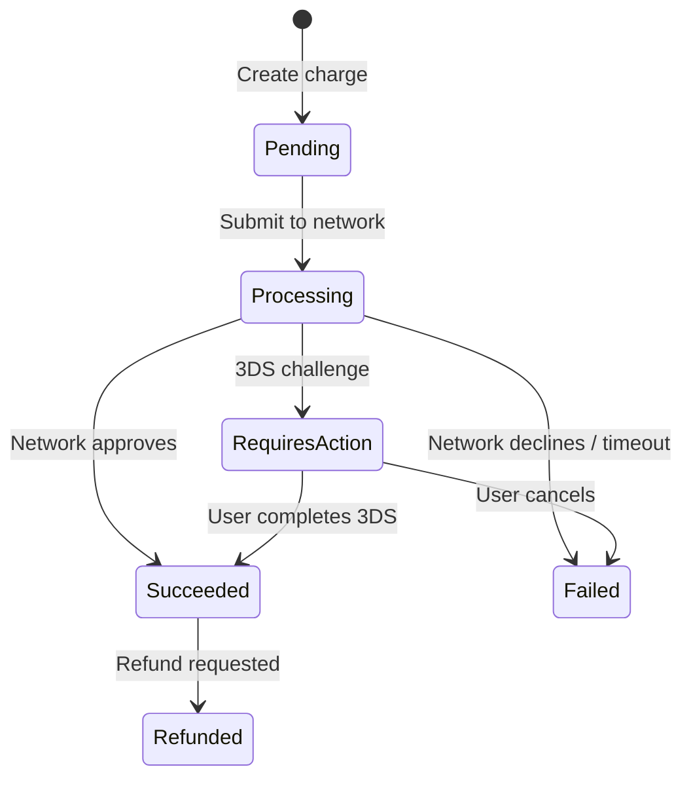
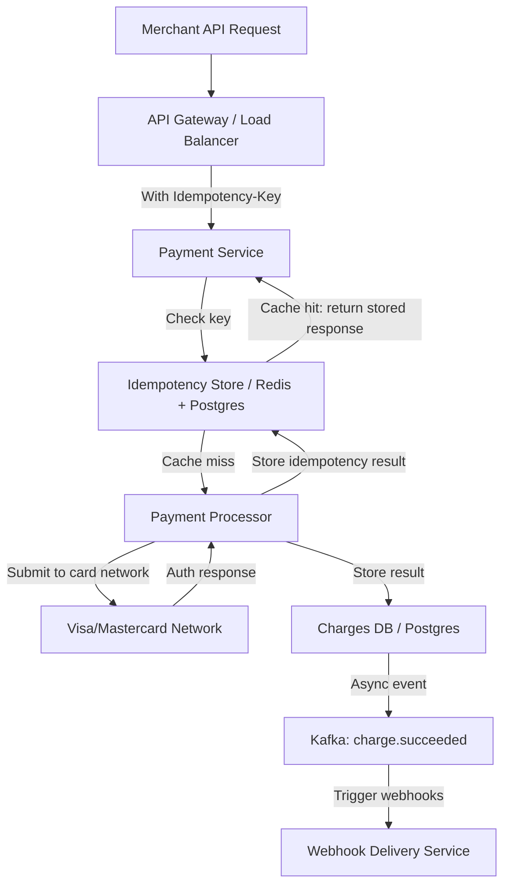
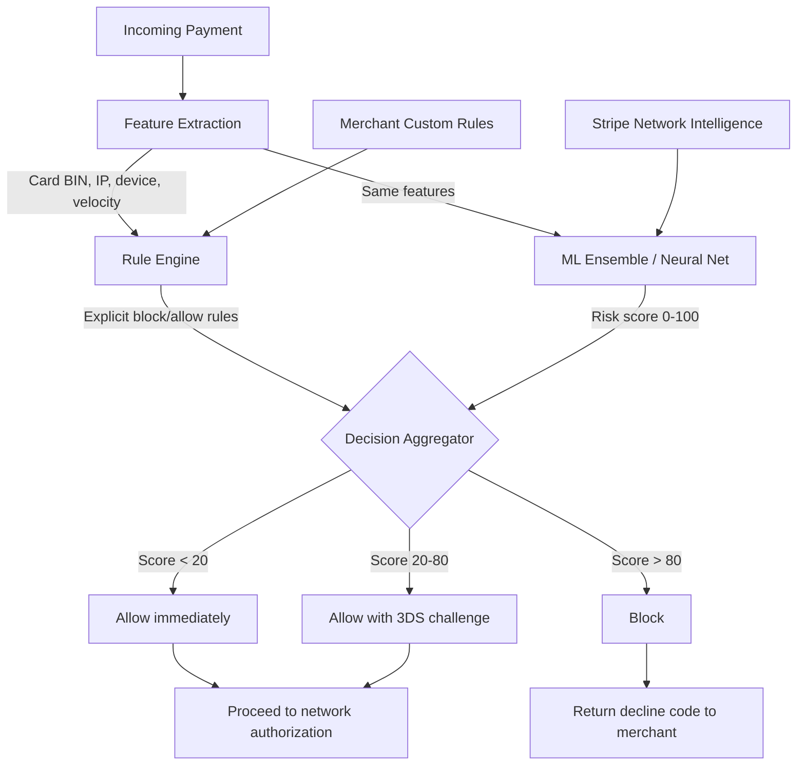
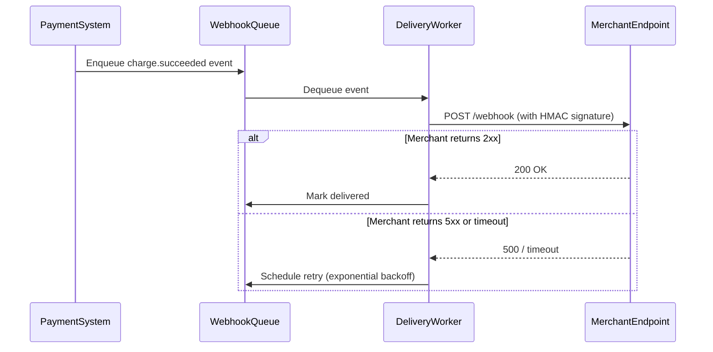
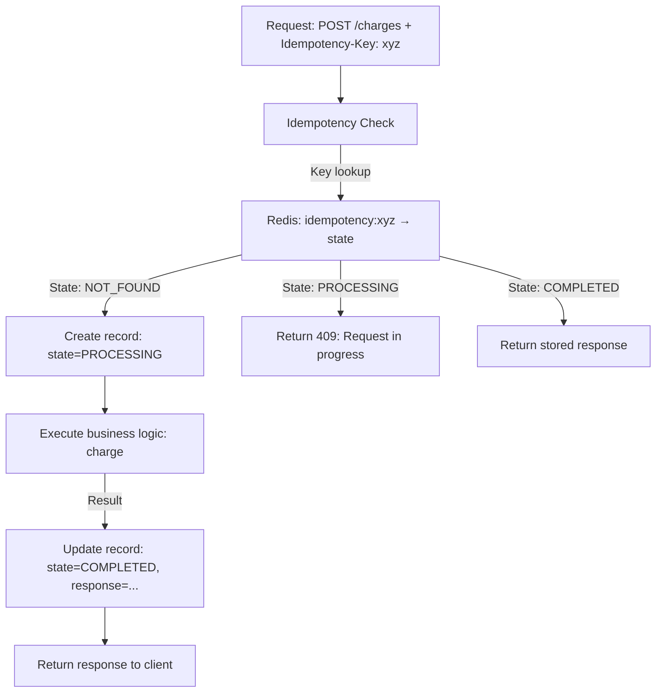
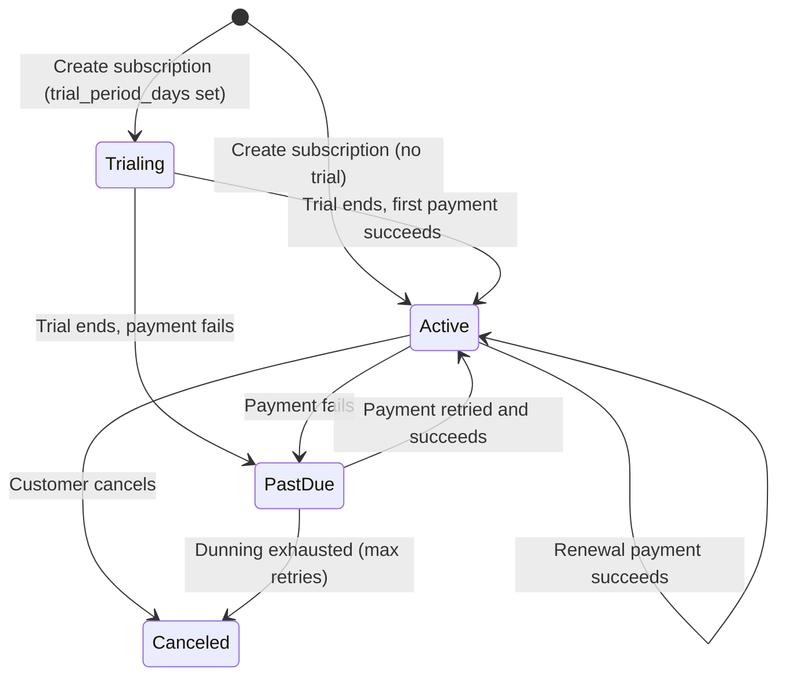
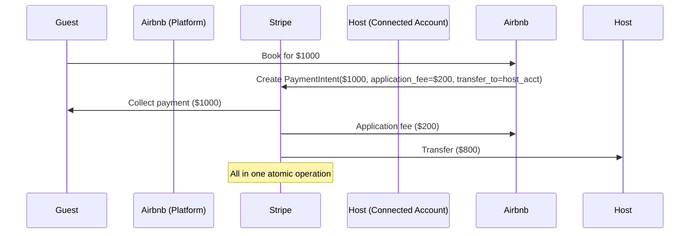
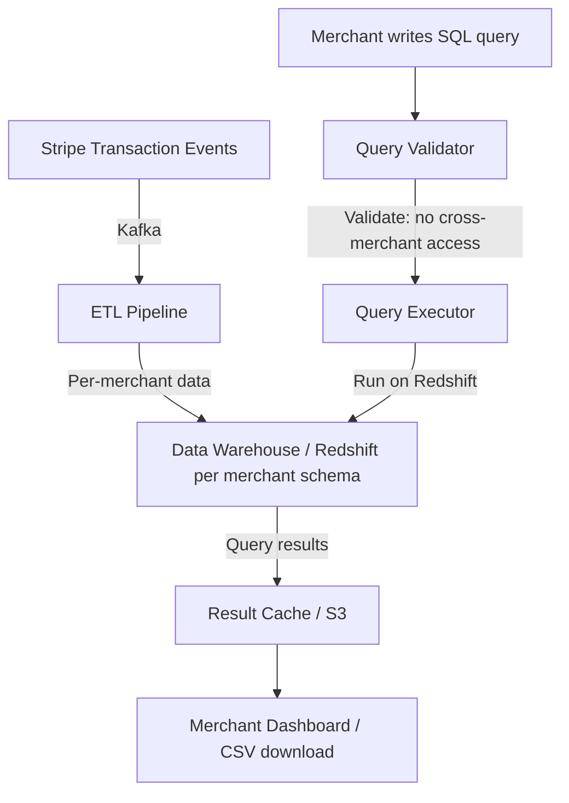
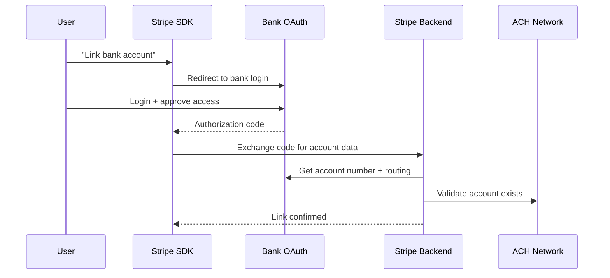
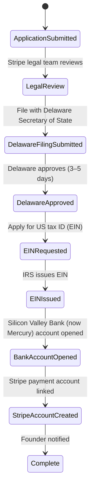

# Stripe System Design Interview Guide

> **Scale context**: 250B+ in total payment volume annually, 3.1M+ companies use Stripe, 135+ currencies, payments infrastructure for Amazon, Lyft, Shopify, Zoom. API uptime SLA: 99.99%. Money cannot be lost, duplicated, or miscounted — correctness is the north star.

---

## 1. The Stripe Interview Loop

Stripe typically runs **4–5 rounds** with heavy emphasis on API design and financial system correctness:

1. **Phone screen** — 45 min, system design or coding problem (often API design or financial logic)
2. **System design round 1** — Core financial systems: payment processing, idempotency, retries
3. **System design round 2** — Developer-facing: API design, webhook delivery, SDK design
4. **Behavioral** — "Tell me about a time correctness mattered more than speed"
5. **Architecture deep-dive** (senior+) — Compliance, multi-currency, global infrastructure

### What Stripe Cares About

| Theme | Why It Matters | Interview Signal |
|-------|---------------|-----------------|
| **Correctness above all** | Double charges = regulatory incident, user trust lost | Do you design for exactly-once semantics? |
| **API design** | Stripe's core product IS the API | Do you think about developer ergonomics? |
| **Idempotency** | Network retries must not cause double charges | Is idempotency a first-class design concern? |
| **Developer experience** | "It just works" is Stripe's brand | Are your APIs intuitive, consistent, well-documented? |
| **Financial compliance** | PCI-DSS, SOC 2, AML, KYC obligations | Do you understand financial regulatory requirements? |

### The #1 Mistake Candidates Make

**Designing payment systems without idempotency** — This is the cardinal sin at Stripe. If a payment request is retried due to a network timeout (extremely common), a system without idempotency will charge the customer twice. A double charge is not just a bug — it's a regulatory incident, a support nightmare, and potential legal liability. Every Stripe engineer knows: `POST /payments` must be idempotent. If you don't mention idempotency keys in a payment system design, you've failed the core test.

---

## 2. Top 10 Stripe System Design Questions

---

### Question 1: Design Stripe's Payment Processing System

**Scale**: 250B+ in payment volume/year, 99.99% uptime, < 500ms P99 latency, exactly-once semantics

**The question**: "A merchant wants to charge a customer $100. Design the system that processes this payment safely."

#### Stripe-Specific Insight: Idempotency Keys + State Machine

Every charge in Stripe is modeled as a **state machine** with idempotency at every transition.



**Idempotency key design**:

```
POST /v1/charges
Idempotency-Key: charge_idem_abc123  ← Client generates this UUID
Content-Type: application/json

{
  "amount": 10000,
  "currency": "usd",
  "customer": "cus_xyz"
}
```

Server logic:
```
1. Hash idempotency key + endpoint + request body
2. Check idempotency store: has this key been processed?
   YES → Return stored response (don't process again)
   NO  → Process charge, store result with idempotency key (TTL: 24h)
3. Return result
```

**Architecture**:



**The retry protocol** (critical):
- Client retry with SAME `Idempotency-Key` → same response, no duplicate charge
- Client retry with NEW `Idempotency-Key` → new charge (this is the client's bug)
- Stripe recommends: exponential backoff with jitter, max 3 retries, same key

**Correctness guarantees**:
- Idempotency store is written BEFORE submitting to card network
- If server crashes after network submit but before writing DB: idempotency store has "processing" state, webhook reconciliation handles it
- Two-phase write: idempotency record → card network → charge record (if all fail, compensating transaction)

---

### Question 2: Design Stripe Radar (Fraud Detection)

**Scale**: Billions of transactions/year, < 100ms fraud decision, false positive rate < 0.1%

**The question**: "How does Stripe detect fraudulent transactions in real time without blocking legitimate payments?"

#### Stripe-Specific Insight: Radar Rules + ML Ensemble

Stripe Radar has two layers:
1. **Rule engine** (Stripe's rules + merchant custom rules): Deterministic, transparent, explainable
2. **ML models** (neural network ensemble): Learns patterns across all Stripe merchants



**Network Intelligence** (Stripe's key advantage):
- Stripe sees transactions across 3M+ merchants
- A card that frauded merchant A can be blocked at merchant B milliseconds later
- This cross-merchant signal is impossible to replicate without Stripe's network scale

**Feature engineering** (within 100ms budget):
- Card features: BIN country, card type (prepaid = higher risk), issuing bank
- User features: email reputation, IP geolocation, device fingerprint
- Velocity: how many charges on this card in last hour/day?
- Behavioral: is this purchase time/amount typical for this customer?
- Merchant risk: merchant category code (MCC) inherent risk

**Merchant-configurable rules** (Radar for Fraud Teams):
```
# Custom rules merchants can write:
block if :card_country: != :ip_country: and :amount: > 500
review if :is_prepaid_card: and :amount: > 100
allow if :customer: is in :trusted_customers_list:
```

**False positive trade-off**:
- False positive = blocking a legitimate transaction → merchant loses sale → merchant churns Stripe
- False negative = allowing fraud → chargeback → financial loss + regulatory risk
- Stripe optimizes for false positive rate < 0.1% while maintaining fraud catch rate

---

### Question 3: Design Stripe's Webhook Delivery System

**Scale**: Billions of webhook events/year, at-least-once delivery, configurable retry, ordering guarantees

**The question**: "Stripe sends webhook events when a payment succeeds. How do you design a reliable webhook delivery system?"

#### Stripe-Specific Insight: At-Least-Once with Idempotency Expectation

Stripe explicitly tells developers: "Webhook handlers must be idempotent because events may be delivered more than once." This is a design choice — they guarantee delivery, not exactly-once.



**Retry schedule** (Stripe's actual behavior):
- Attempt 1: Immediately
- Attempt 2: 5 minutes after failure
- Attempt 3: 30 minutes
- Attempt 4: 2 hours
- Attempt 5: 5 hours
- ...continues with exponential backoff
- Maximum: 72 hours total retry window
- After 72 hours: event marked as failed, available in dashboard for manual replay

**HMAC signature** (security):
```
Stripe-Signature: t=1614566400,v1=abc123def456...
```
- `t` = timestamp (prevents replay attacks)
- `v1` = HMAC-SHA256(stripe_secret, t + "." + payload)
- Merchant verifies signature before processing

**Ordering challenge**:
- Stripe does NOT guarantee ordered delivery (retry of event 5 may arrive before event 6)
- Events include `created` timestamp for ordering
- Idempotency handles re-delivery of same event
- Merchant must design for out-of-order and duplicate events

**Webhook endpoint design** (what Stripe teaches merchants):
```python
# CORRECT: Return 200 immediately, process async
@app.route('/webhook', methods=['POST'])
def webhook():
    payload = request.data
    sig_header = request.headers.get('Stripe-Signature')
    
    # 1. Verify signature
    stripe.WebhookSignature.verify_header(payload, sig_header, secret)
    
    # 2. Enqueue for async processing (return 200 fast!)
    queue.enqueue(process_webhook, payload)
    
    return '', 200  # Return 200 BEFORE processing to avoid timeout

# WRONG: Process synchronously → times out → Stripe retries → duplicate processing
```

---

### Question 4: Design Stripe's API Idempotency System

**Scale**: Millions of API requests/day, idempotency window: 24 hours, correctness required

**The question**: "Design the idempotency system that Stripe uses to prevent duplicate charges across all API endpoints."

#### Technical Deep Dive

Idempotency system requirements:
1. Same request (same key + same endpoint + same body) → same response, no side effects
2. If request is in-flight: return 409 Conflict (request in progress)
3. If request completed: return original response without re-executing
4. TTL: 24 hours (after which key can be reused, but Stripe recommends unique keys per charge)

**Storage architecture**:



**Distributed lock design** (prevent concurrent execution of same key):
```
1. SETNX idempotency:xyz:lock 1 EX 30  → acquire lock
2. If lock acquired: proceed with business logic
3. If lock not acquired (409): another request is processing same key
4. After business logic: store result, release lock
```

**Edge case: crash between network call and result storage**:
- Stripe writes idempotency record as "PROCESSING" BEFORE calling card network
- If server crashes after card network call but before marking COMPLETE:
  - On retry: key shows PROCESSING → 409 to client → reconciliation job detects stuck processing states and checks card network for the actual outcome

**Why separate storage (Redis + Postgres)**:
- Redis: fast in-memory lookup for hot keys (last few hours of traffic)
- Postgres: durable storage for audit, dispute resolution, 24h retention

---

### Question 5: Design Stripe's Billing and Subscription System

**Scale**: Millions of subscriptions, 135+ currencies, complex proration, invoice generation

**The question**: "Stripe Billing manages subscriptions for SaaS companies. Design the subscription billing engine."

#### Subscription State Machine



**Invoice generation**:
- At billing period end: calculate invoice amount
- Line items: subscription price + any metered usage charges + proration (plan upgrades mid-period)
- Invoice preview: merchants can show customers what they'll owe

**Proration** (the tricky part):
```
Customer upgrades from $10/month → $20/month on day 15 of 30-day billing period

Remaining days in period: 15/30 = 50%
Credit for unused $10 plan: $10 × 50% = $5 credit
Charge for new $20 plan: $20 × 50% = $10 charge
Net proration charge: $10 - $5 = $5

Next month's invoice: $20 (full month, no proration)
```

**Dunning (failed payment recovery)**:
- Day 0: First attempt
- Day 3: First retry
- Day 5: Second retry
- Day 7: Third retry + email to customer
- Day 14: Final attempt + cancellation warning
- Day 21: Subscription canceled

**Timezone handling** (deceptively hard):
- Merchant is in US, customer is in Australia
- "Bill on the 1st of each month" — whose timezone? Customer's? Merchant's? UTC?
- Stripe uses UTC internally, but lets merchants configure billing cycle per subscription

---

### Question 6: Design Stripe Connect (Marketplace Payments)

**Scale**: Marketplace platform with sellers receiving payouts, split payments, multiple parties

**The question**: "Airbnb uses Stripe Connect. When a guest pays $1000, Stripe needs to pay Airbnb $1000 minus fees, then Airbnb pays the host $800. Design this."

#### Stripe-Specific Insight: Three-Party Payment Flow

Stripe Connect models three types of marketplace architectures:

| Model | Who gets the money? | Who has API access? | Example |
|-------|--------------------|--------------------|---------|
| **Standard** | Connected account (seller) directly | Seller has Stripe dashboard | Independent retailers |
| **Express** | Platform handles payouts | Simplified seller onboarding | Lyft driver payouts |
| **Custom** | Platform has full control | Platform builds own UI | Shopify |



**Compliance complexity with Connect**:
- Stripe runs KYC (Know Your Customer) on each connected account (host, seller)
- AML (Anti-Money Laundering) checks on payouts
- Tax reporting: 1099-K forms for sellers exceeding $600/year (US)
- PCI scope: platform doesn't touch raw card data → PCI scope reduced

**Payout timing**:
- US: Standard 2-business-day payout, Instant Payout (1% fee, arrives in minutes)
- International: 2–7 business days, varies by country
- Negative balance handling: Stripe can debit connected account for chargebacks

---

### Question 7: Design Stripe Sigma (Analytics on Payment Data)

**Scale**: Billions of transactions, SQL interface for merchants, sub-60-second queries

**The question**: "Stripe Sigma lets merchants run SQL queries on their own transaction data. Design this."

#### Technical Architecture

Stripe Sigma provides merchants a SQL environment to query their own Stripe data (charges, customers, disputes, payouts) with near-real-time freshness (data available within 1 hour of transaction).



**Multi-tenant data isolation** (critical for financial data):
- Each merchant has their own Redshift schema: `merchant_abc.charges`, `merchant_abc.customers`
- Row-level security: queries automatically scoped to merchant's own data
- No cross-merchant JOINs possible (enforced at query parse level)

**Query constraints** (to prevent runaway queries):
- Max query timeout: 5 minutes
- Max rows returned: 1M per query
- CPU/memory quotas per merchant tier
- Expensive aggregations pre-computed nightly (e.g., monthly revenue totals)

---

### Question 8: Design Stripe Financial Connections (Bank Account Linking)

**Scale**: Link bank accounts for ACH payments, instant verification, 10,000+ financial institutions

**The question**: "Stripe Financial Connections lets users link their bank account. Design the bank aggregation and verification system."

#### Two Verification Methods

| Method | Time | Accuracy | Technical Approach |
|--------|------|----------|-------------------|
| Micro-deposits | 1–3 business days | High | Send $0.01, $0.02 to account → user confirms amounts |
| Instant verification | Seconds | High | OAuth with bank → read account number from API |

**Instant verification flow** (Plaid/Finicity integration or direct bank OAuth):



**Regulatory concerns**:
- NACHA rules: verification required before ACH debit
- User consent: explicit authorization to debit account
- Revocation: user can revoke access at any time (CFPB regulation)
- Data retention: account number stored encrypted, masked in API responses (`****1234`)

---

### Question 9: Design Stripe Terminal (In-Person Payments)

**Scale**: Physical card reader + Stripe API, offline capability required, EMV chip compliance

**The question**: "Stripe Terminal enables in-person card-present payments. How do you design a system where the card reader, merchant POS, and Stripe backend are all coordinated?"

#### Card-Present vs. Card-Not-Present

| Aspect | Card-Not-Present (Online) | Card-Present (Terminal) |
|--------|--------------------------|------------------------|
| Fraud liability | Stripe/issuer | Merchant (if no EMV) |
| Authentication | 3DS, CVV, address | EMV chip, PIN, signature |
| Chargeback rate | 0.5–1% | < 0.1% |
| Connectivity required | Always | Offline capability needed |

**Offline mode** (critical for retail):
- Terminal stores transactions locally when internet down
- Syncs to Stripe when connectivity restored
- Risk: Stripe takes offline risk (authorizes without bank check)
- Stripe caps offline authorization: < $50 per transaction, < $200 per terminal per day

**EMV chip flow**:
```
1. Card inserted → EMV chip generates cryptogram (unique per transaction)
2. Terminal reads cryptogram + card data
3. Send to Stripe → forward to card network
4. Network decrypts cryptogram (validates card wasn't cloned)
5. Issuer approves/declines
6. Response returned to terminal in < 3 seconds
```

---

### Question 10: Design Stripe Atlas (Company Formation)

**Scale**: 50,000+ companies formed, legal + banking + payment rails bundled, 150+ countries

**The question**: "Stripe Atlas lets a startup in India form a US Delaware C-Corp online. Design the workflow system."

#### Multi-System Orchestration



**Long-running workflow design** (key interview insight):
- Each step can take days (Delaware: 3–5 days, IRS EIN: 1–4 weeks)
- Use a **durable workflow engine** (like Temporal or Stripe's internal equivalent)
- State persisted to DB at each step — system survives restarts
- Human-in-the-loop: legal review step requires Stripe staff action
- Idempotent retries for each step if API calls fail

---

## 3. Stripe-Specific Technical Topics to Know

### Idempotency (Most Important)
- Every mutating API call must accept `Idempotency-Key` header
- Keys stored in Redis (hot) + Postgres (durable) with 24h TTL
- Client must generate UUID per logical operation
- Same key + same endpoint = same response, no side effects

### Event-Driven Architecture
- Every state change produces an event (charge.succeeded, customer.created, etc.)
- Events stored in Kafka
- Webhooks are the external-facing delivery of these events
- Internal consumers (fraud, billing, analytics) also consume from Kafka

### Distributed Transactions (No 2PC)
- Stripe avoids distributed transactions (too slow, too fragile)
- Instead: Sagas pattern with compensating transactions
- If payment succeeds but webhook delivery fails: events are durable, will retry
- If payout fails after charge succeeds: compensation job reconciles

### PCI-DSS Compliance
- Card numbers (PANs) never stored in plaintext
- Tokenization: raw card number → Stripe token (tok_xxx) at collection
- Token stored in Stripe's PCI-compliant vault
- Merchant API never sees raw card number after tokenization

### Strong Customer Authentication (SCA)
- EU PSD2 regulation requires two-factor auth for card payments
- 3D Secure (3DS) flow: after card entry, redirect to bank for OTP
- Stripe handles the 3DS orchestration transparently for merchants
- Some transactions exempt: low value (< €30), merchant-initiated (subscriptions)

---

## 4. Behavioral Questions at Stripe

### Stripe's Engineering Principles
- "Correctness first, then performance" — money cannot be wrong
- "Developer experience is a product feature" — the API IS the product
- "Think in systems" — second-order effects matter in financial systems

### Common behavioral questions:
- "Tell me about a time when you had to ensure a system was absolutely correct even at the cost of performance."
- "Describe a situation where you designed an API and then had to maintain backwards compatibility."
- "Walk me through how you'd handle a production incident where duplicate charges were being issued."
- "Tell me about a time you had to balance developer ergonomics with system safety."

---

## 5. Interview Preparation Checklist

### Must-Know Topics
- [ ] Idempotency keys: design, storage, edge cases, TTL
- [ ] Payment state machine: pending → processing → succeeded/failed
- [ ] Webhook delivery: at-least-once, retry schedules, HMAC verification
- [ ] Saga pattern for distributed financial transactions
- [ ] PCI-DSS: tokenization, what data is/isn't stored
- [ ] Fraud detection: rule engine + ML ensemble, cross-merchant network intelligence
- [ ] Subscription billing: state machine, proration, dunning
- [ ] Stripe Connect: standard/express/custom models, marketplace flows
- [ ] 3DS/SCA for EU compliance
- [ ] Idempotent API design principles

### Questions to Ask Your Interviewer
- "How does Stripe handle the case where a charge is authorized but the confirm step fails — is the authorization released automatically?"
- "What's the philosophy around how much of the payment complexity Stripe exposes vs. abstracts for developers?"
- "How does Stripe think about the tradeoff between adding new API features and maintaining backwards compatibility for existing integrations?"

---

## 6. Key Numbers to Memorize

| Metric | Number |
|--------|--------|
| Annual payment volume | 250B+ |
| Merchants using Stripe | 3.1M+ |
| Currencies supported | 135+ |
| API uptime SLA | 99.99% |
| Payment API P99 latency | < 500ms |
| Fraud decision latency | < 100ms |
| Webhook retry window | 72 hours |
| Idempotency key TTL | 24 hours |
| Offline Terminal limit | $50/txn, $200/day |
| Max subscription retry attempts (dunning) | ~4–5 over 3 weeks |

---

## 7. Common Mistakes in Stripe Interviews

1. **No idempotency in payment design**: The single biggest failure. Always mention `Idempotency-Key` for any payment mutation.
2. **Synchronous webhook processing**: Saying "process webhook synchronously in the HTTP handler" ignores timeout risk and return-200-fast requirements.
3. **Storing raw card numbers**: Never design a system that stores PANs. Tokenization is mandatory. PCI-DSS compliance requires this.
4. **Ignoring chargebacks**: Every payment system must design for chargebacks. Dispute handling workflow is a real design concern.
5. **Not mentioning SCA/3DS**: If designing for EU payments, Strong Customer Authentication is legally required.
6. **Single-region payment database**: Payments require high availability. Mention multi-region setup with synchronous replication for financial data.
7. **Missing the "developer experience" angle**: Stripe's differentiator is DX. In API design questions, discuss: clear naming, consistent error codes, comprehensive documentation, versioning strategy.
8. **Forgetting backwards compatibility**: Stripe's API is versioned and never breaks existing integrations. Any API design must address backwards compatibility and API versioning.

---

## 8. Stripe API Design Principles (Know These Cold)

Stripe's API is widely considered the gold standard for developer experience. Key principles:

### 1. Consistent Resource Naming
```
GET    /v1/charges          # list
POST   /v1/charges          # create
GET    /v1/charges/{id}     # retrieve
POST   /v1/charges/{id}     # update (not PUT, to allow partial updates)
POST   /v1/charges/{id}/refunds  # sub-resource action
```

### 2. Idempotency Headers (not URL params)
- `Idempotency-Key: <uuid>` in HTTP header, not `?idempotency_key=` in URL
- Headers for transport concerns, body for data

### 3. Expanding Related Objects
```
GET /v1/charges/{id}?expand[]=customer&expand[]=payment_method
# Returns charge with nested customer and payment_method objects
# Default: just IDs are returned (no expansion = faster, smaller payload)
```

### 4. Versioned API
```
Stripe-Version: 2024-06-20
# Sent by client, server routes to correct API version
# New versions never break existing clients (old version still supported)
# Version dates (not v1/v2 numbers) → forces clients to explicitly opt into changes
```

### 5. Error Design
```json
{
  "error": {
    "type": "card_error",
    "code": "card_declined",
    "decline_code": "insufficient_funds",
    "message": "Your card has insufficient funds.",
    "param": "card"
  }
}
```
- Machine-readable `code` for programmatic handling
- Human-readable `message` for display
- `param` tells which field caused the error

---

## References

- 📖 [Stripe Engineering — Idempotency Keys and The Request Pattern](https://stripe.com/blog/idempotency)
- 📖 [Stripe Engineering — Radar ML Fraud Detection](https://stripe.com/blog/radar-ml)
- 📖 [Stripe Engineering — Webhooks Best Practices](https://stripe.com/blog/webhooks-best-practices)
- 📖 [Stripe Engineering — Incremental Schema Changes](https://stripe.com/blog/online-migrations)
- 📚 [Stripe API Reference Documentation](https://stripe.com/docs/api)
- 📚 [Stripe Connect Documentation](https://stripe.com/docs/connect)
- 📺 [Designing a Payment System — System Design Interview](https://www.youtube.com/watch?v=olfaBgJrUBI)
- 📖 [Stripe Engineering Blog](https://stripe.com/blog/engineering)
