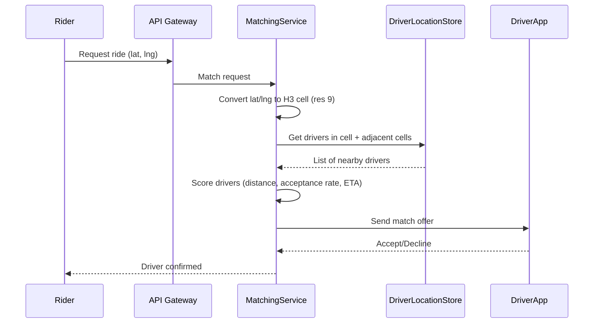
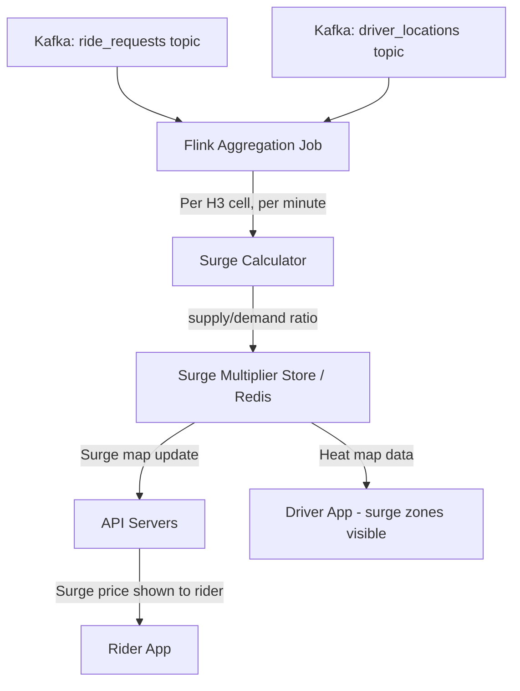
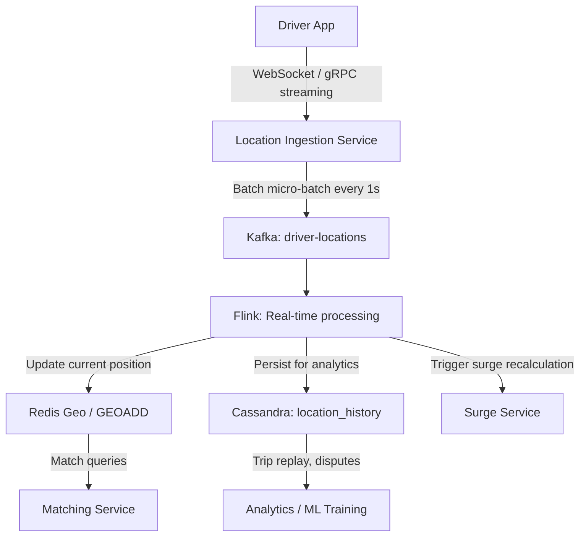
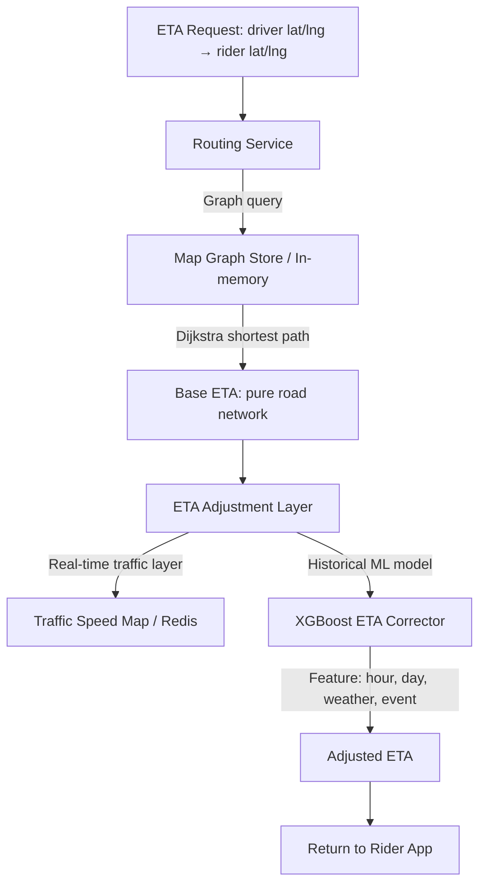
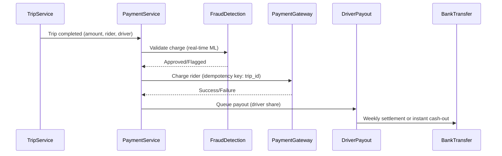
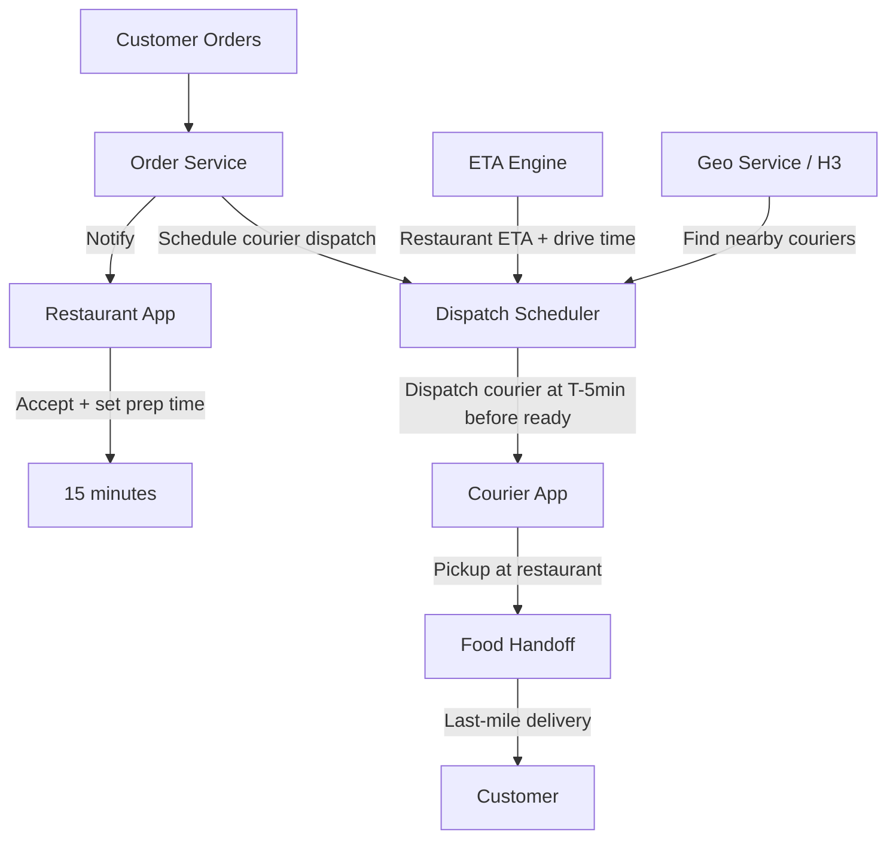
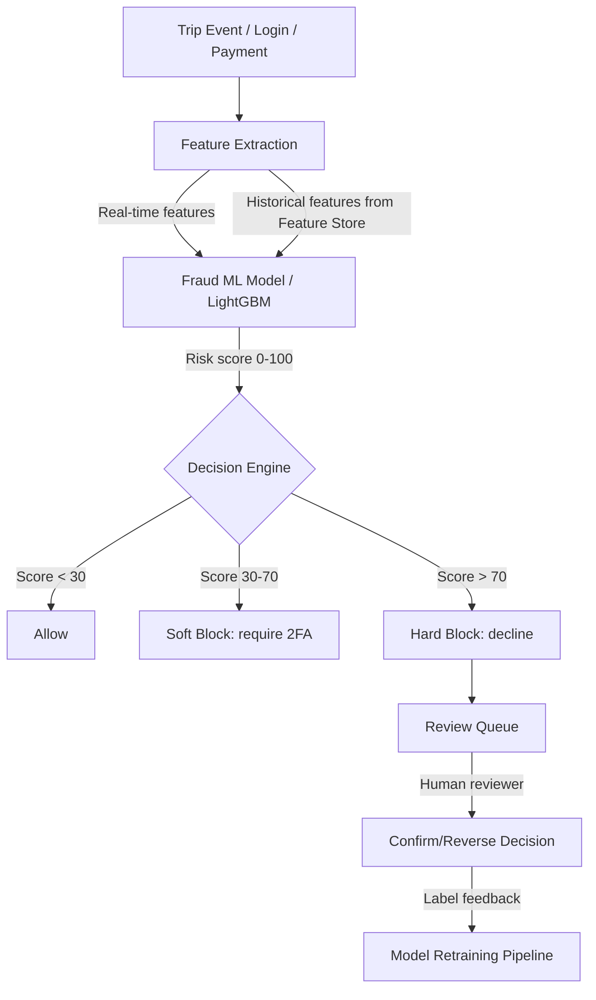
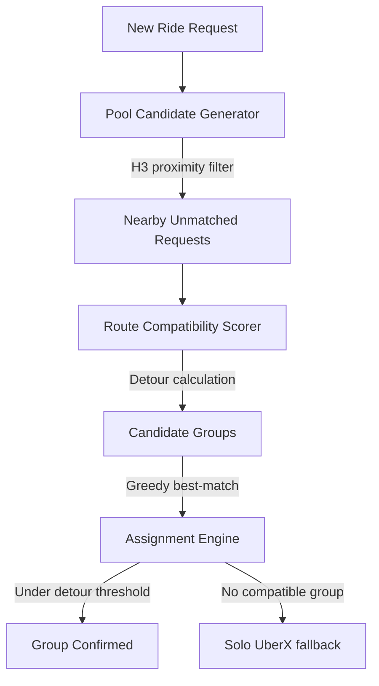
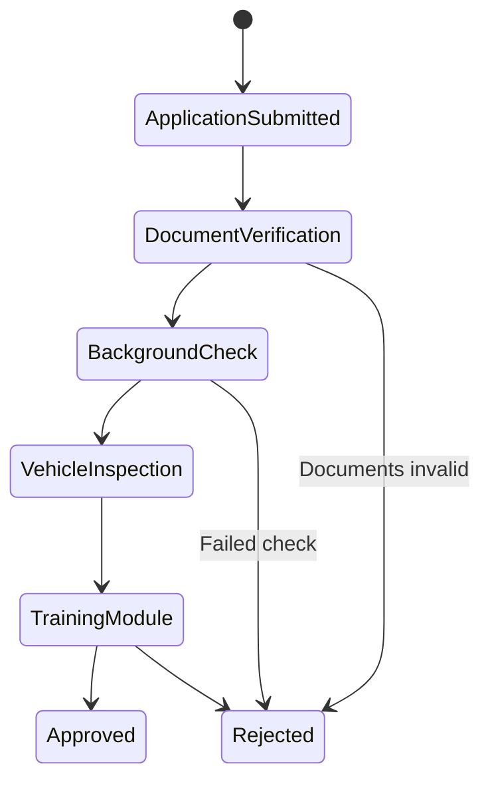

# Uber System Design Interview Guide

> **Scale context**: 5M+ trips per day, 3M+ active drivers, operations in 10,000+ cities across 70+ countries, < 500ms ride matching latency requirement, 15M+ location updates per second at peak.

---

## 1. The Uber Interview Loop

Uber typically runs **4–5 rounds** focused on:

1. **Phone screen** — 45 min, one system design or coding problem (often graph/geospatial)
2. **System design round 1** — Core platform: ride matching, location tracking, or ETA
3. **System design round 2** — Data-heavy: fraud detection, analytics, or recommendation (UberEats)
4. **Behavioral** — "Tell me about a time you built something at scale with tight latency constraints"
5. **Architecture deep-dive** (senior+) — Geo-distributed consistency, multi-region failover

### What Uber Cares About

| Theme | Why It Matters | Interview Signal |
|-------|---------------|-----------------|
| **< 500ms matching latency** | Users abandon if matching takes > 2s | Do you understand in-memory geo indexing? |
| **Geo-distributed consistency** | Driver location must be accurate to 10 meters | Can you handle write-heavy geo workloads? |
| **Real-time processing** | Location updates, surge, ETA all real-time | Kafka + Flink/Spark Streaming competency |
| **Fault tolerance** | A city losing its matching service = revenue loss | Circuit breakers, region isolation |
| **Scale per city** | Each city is an independent unit of scale | Sharding by geo region, not user ID |

### The #1 Mistake Candidates Make

**Not knowing Uber's H3 geospatial indexing library** — Uber open-sourced H3, a hexagonal hierarchical geospatial indexing system. Uber uses hexagonal cells (not squares, not circles) to divide the world into tiles for surge pricing, demand forecasting, and ride matching. Saying "use a grid" or "use lat/lng ranges" shows you don't know the production solution.

---

## 2. Top 10 Uber System Design Questions

---

### Question 1: Design Uber's Ride Matching System

**Scale**: 5M trips/day, < 500ms matching latency, 3M active drivers globally

**The question**: "A user opens Uber and requests a ride. How do you match them to the best available driver in under 500 milliseconds?"

#### Uber-Specific Insight: H3 Hexagonal Grid + In-Memory Geo Index

Uber partitions the world into hexagonal cells using H3 at multiple resolutions:
- **Resolution 8**: ~0.74 km² cells (city neighborhood level)
- **Resolution 9**: ~0.1 km² cells (block level, used for matching)
- **Resolution 12**: Fine-grained, used for precise pickup points

Why hexagons over squares? Equal distance to all neighbors. In a square grid, corner neighbors are √2 times farther than edge neighbors. Hexagons eliminate this distortion.



**Driver location store architecture**:

| Option | Read Latency | Write Throughput | Notes |
|--------|-------------|-----------------|-------|
| PostgreSQL + PostGIS | 50–200ms | 10k/s | Too slow for real-time |
| Redis + Geospatial | **1–5ms** | 100k/s | Uber's choice for hot data |
| Cassandra | 5–15ms | 500k/s | Used for history, not real-time |

**Redis Geo commands used**:
```
GEOADD drivers:city:london driver_id lng lat
GEORADIUS drivers:city:london rider_lng rider_lat 5 km ASC COUNT 20
```

**Matching algorithm steps**:
1. Convert rider location to H3 cell
2. Query Redis for drivers in cell + 1–2 rings of adjacent cells
3. Filter by: available status, vehicle type, rating threshold
4. Score by: estimated pickup time, historical acceptance rate
5. Send offer to top-scored driver, wait 10s, then offer to next

**Latency budget** (total < 500ms):
- H3 cell computation: < 1ms
- Redis geo query: 5–10ms
- Driver scoring + ranking: 10–20ms
- Network to driver app + response: 200–400ms
- Total: ~250–430ms

---

### Question 2: Design Uber's Surge Pricing Algorithm

**Scale**: Real-time per-H3-cell supply/demand balancing, triggers in < 1 minute

**The question**: "How does Uber calculate and apply surge pricing in real time?"

#### Uber-Specific Insight: Per-Cell Supply/Demand Ratio

Surge is calculated per H3 cell (resolution 8, ~0.74 km²) every ~1 minute:

```
surge_multiplier = f(demand / supply)

Where:
  demand = ride requests in last N minutes in cell
  supply = available drivers in cell
  f() = piecewise function: if D/S > 2.0 → 1.5x surge, > 3.0 → 2.0x surge, etc.
```



**Key design decisions**:
- H3 resolution 8 for surge zones (neighbor cells can have different surge)
- Sliding window aggregation (last 5 minutes) smooths spikes
- Surge shown to driver as heat map → incentivizes repositioning to high-demand areas
- Surge capped at regulatory limits per city (some cities have 2x caps)
- Surge notified to rider BEFORE booking (consent required in most markets)

**Warm-up period**: When a new city launches, historical data is thin. Use ML to predict surge from events (concerts, rain, Friday night).

---

### Question 3: Design Uber's Driver Location Tracking System

**Scale**: 3M+ active drivers, 15M+ location updates/second at peak, < 5s staleness

**The question**: "Every active driver sends their GPS location every 4 seconds. How do you store and query this at scale?"

#### Architecture



**Connection management** (the hard part):
- 3M drivers × 1 connection each = 3M persistent WebSocket connections
- Each connection server handles 50,000 connections (load balanced)
- 60 servers needed for WebSocket tier
- Heartbeat every 30s to detect disconnected drivers

**Location update pipeline**:
- Driver app: GPS update every 4 seconds
- Batched at client to reduce connection overhead: send every 4s
- Server-side: micro-batch in Kafka, process every 1 second
- Redis GEOADD: O(log N) per update, supports 100k ops/sec per shard
- Total Redis capacity needed: 3M drivers × 4/sec updates = 12M/s → 120 Redis shards

**Staleness handling**:
- If no update for 30s → mark driver as "potentially offline"
- If no update for 60s → remove from matching pool
- Separate heartbeat channel from location channel

---

### Question 4: Design Uber's ETA Calculation System

**Scale**: 5M+ ETA requests/day, < 200ms response time, accurate within 15%

**The question**: "When a rider sees '4 minutes away,' how does Uber calculate that?"

#### Uber-Specific Insight: Graph-Based Routing + ML Correction

Pure Dijkstra on a map graph gives theoretical shortest time. Real ETA blends:

1. **Map graph routing** (Dijkstra/A*): road network, speed limits, turn penalties
2. **Real-time traffic** (from driver GPS traces): actual speeds per road segment
3. **Historical patterns** (ML): "Friday 6pm on this road is always slower"
4. **Driver-specific factors**: acceptance patterns, current traffic density



**Map graph design**:
- Nodes: road intersections (~300M globally)
- Edges: road segments (~600M) with attributes: length, speed limit, road type
- Stored in-memory on routing servers (compressed graph: ~50GB)
- Updated every 15 minutes with real-time traffic signals

**Traffic speed data sources**:
- Uber's own driver GPS traces (most accurate, from 3M drivers)
- HERE Maps / Google Maps commercial data (supplementary)
- Historical patterns stored in Cassandra per road segment per time bin

---

### Question 5: Design Uber's Payment Processing System

**Scale**: 5M+ trips/day, payments in 70+ countries, multiple currencies, fraud detection

**The question**: "A trip completes. How does Uber charge the rider and pay the driver?"

#### Key Design Considerations



**Critical: Idempotency**

Payment service uses `trip_id` as idempotency key. If charge fails and retries, same `trip_id` prevents double-charge.

**International payment complexity**:
- 70+ countries = 70+ payment methods (cards, wallets, cash, UPI in India)
- Currency conversion at point of charge
- Regulatory: PCI-DSS compliance, local data residency requirements
- Driver payout timing: weekly in US, daily in India (local regulations)

**Pre-authorization vs. post-trip charge**:
- Uber pre-authorizes ~$1 at ride start (validates card is active)
- Actual charge at trip end (actual fare)
- Surge re-authorization if surge changes mid-trip (controversial UX decision)

---

### Question 6: Design UberEats Food Delivery System

**Scale**: 900,000+ restaurants, 6M+ delivery partners, 1B+ annual orders

**The question**: "Design the system that coordinates between a customer, restaurant, and delivery driver for food orders."

#### Three-Sided Marketplace Challenge

Unlike ride-sharing (two parties: rider + driver), UberEats has three: customer + restaurant + courier. Each has different time constraints:

- Customer: wants food in 30 min
- Restaurant: needs order immediately, has variable prep time
- Courier: needs to arrive at restaurant after food is ready (not before)



**Key difference from ride-sharing**: Courier dispatch is delayed (wait for food to be ready). This requires:
- Accurate restaurant prep time estimation (ML model per restaurant)
- Predicted pickup time = now + prep_time - courier_drive_time
- Dispatch courier when: predicted_arrival_time = food_ready_time

**Stacking orders** (efficiency optimization):
- One courier picks up from multiple restaurants, delivers to multiple customers
- Optimization problem: minimize total delivery time across all orders in batch
- Solved with constrained optimization / heuristic matching

---

### Question 7: Design Uber's Fraud Detection System

**Scale**: 5M trips/day, < 50ms fraud decision, 99.9% accuracy requirement

**The question**: "How does Uber detect fraudulent trips in real time?"

#### Fraud Types at Uber

| Fraud Type | Example | Detection Signal |
|-----------|---------|----------------|
| Fake trips | Driver + accomplice fake rides | GPS trace looks suspicious (stationary) |
| Account takeover | Stolen credentials used | Login from new device + new location |
| Payment fraud | Stolen credit card | Card decline rate, card type, purchase pattern |
| Driver fraud | Manipulating GPS to increase fare | GPS velocity, path deviation |
| Promo abuse | Creating fake accounts for promo codes | IP fingerprint, device fingerprint |



**Real-time feature engineering**:
- Device fingerprint (device ID, browser, OS)
- Velocity: number of accounts from same IP/device last hour
- Location: is payment card's billing address in same country as trip?
- Behavioral: typical ride patterns (time of day, neighborhoods)
- Network: IP reputation, VPN detection

**Model latency budget** (must be < 50ms to not block payment):
- Feature extraction from Redis: 5ms
- Model inference (LightGBM, in-memory): 2ms
- Decision lookup: 1ms
- Total: < 10ms (well within budget)

---

### Question 8: Design UberPool Grouping Optimization

**Scale**: Multiple riders on shared routes, optimize for: cost savings vs. detour time

**The question**: "UberPool groups multiple riders in one car to reduce cost. How do you optimize route grouping?"

#### Optimization Problem

Given N ride requests with (origin, destination, departure_time):
- Group into car-loads of 2–4 riders
- Minimize: total detour time for all riders
- Constraint: no rider's trip extended by more than 33%

This is a **vehicle routing problem (VRP)** — NP-hard in general. Uber uses heuristics:



**Greedy algorithm**:
1. For new request R, find all pending requests within 5km H3 radius
2. For each candidate pair (R, Ri): calculate combined route using Routing Service
3. Check: detour for R ≤ 33% and detour for Ri ≤ 33%
4. If both satisfied: group them, assign to nearest compatible driver

---

### Question 9: Design Uber's Maps Routing Updates System

**Scale**: 600M+ road segments globally, traffic updates every 15 minutes, map updates daily

**The question**: "How does Uber keep its routing maps up to date with real-time traffic and road changes?"

#### Two Update Streams

1. **Real-time traffic**: Speed per road segment, updated every 15 minutes from driver GPS
2. **Map structure updates**: New roads, closures, one-way changes, updated daily from HERE/OpenStreetMap + Uber's own detection

**Real-time traffic pipeline**:
```
Driver GPS trace → Kafka → Map Matching (snap GPS to road) →
Speed computation per segment → Redis time-series cache →
Routing service reads on each ETA request
```

**Map structure updates**:
- Daily batch: download HERE Maps delta, apply to routing graph
- Zero-downtime update: blue-green deployment of routing graph
- Version routing: old graph serves existing sessions, new graph serves new requests

---

### Question 10: Design Uber's Driver Onboarding System

**Scale**: 3M+ active drivers, onboarding varies by country (background check complexity)

**The question**: "How does Uber onboard a new driver across 70+ countries with different regulatory requirements?"

#### Regulatory Complexity Matrix

| Region | Requirements | Check Time |
|--------|-------------|-----------|
| US | Background check (Checkr), DMV, insurance | 3–5 days |
| UK | TfL license, DBS check | 1–4 weeks |
| India | RTO registration, police verification | 3–7 days |
| EU | Local taxi license, GDPR data handling | Varies |

**Workflow engine design** (key insight: use a state machine):



**State machine advantages**:
- Each step can fail/retry independently
- State persisted in DB — resume from failure
- Different workflow graphs per country
- Async: background check (3 days) doesn't block training module

---

## 3. Uber-Specific Technical Topics to Know

### H3 Hexagonal Geospatial Index
- Open-sourced by Uber (2018)
- 15 resolution levels, resolution 9 = ~0.1 km² cells
- Each cell is addressable by a unique 64-bit integer
- Used for: surge pricing zones, demand forecasting, dispatch optimization
- Why hexagons: equal neighbor distances, no singularity at poles

### Schemaless / Docstore
- Uber's internal multi-master database (Cassandra-based)
- Used for trip data, user profiles
- Supports: column updates, row-level transactions, secondary indexes

### Ringpop / TChannel
- Uber's service mesh for consistent hashing across stateful services
- Each matching service "owns" a set of H3 cells
- Consistent hashing ensures requests for a cell always go to the same server

### AresDB (Real-Time Analytics)
- Open-sourced by Uber (2019)
- GPU-accelerated OLAP database
- Used for real-time analytics dashboards: trip counts, revenue per city

---

## 4. Behavioral Questions at Uber

### Uber's Engineering Principles
- "Move fast, but safely" — high velocity with chaos engineering
- "Own the outcome" — end-to-end ownership, no handoffs
- "Earn trust through transparency"

### Common behavioral questions:
- "Tell me about a system you built that needed to be reliable under 500ms latency constraints."
- "Describe a time you made a geo-distributed system more resilient."
- "Walk me through a production incident you led. What was your incident response process?"
- "Tell me about a time you balanced correctness vs. speed in a system design."

---

## 5. Interview Preparation Checklist

### Must-Know Topics
- [ ] H3 hexagonal geospatial indexing (Uber's open-source library)
- [ ] Redis Geo commands: GEOADD, GEORADIUS
- [ ] WebSocket connection management at 3M+ concurrent connections
- [ ] Surge pricing: supply/demand ratio per geo cell
- [ ] Ride matching: in-memory geo index, scoring algorithm
- [ ] ETA calculation: graph routing + ML correction
- [ ] Real-time stream processing: Kafka + Flink
- [ ] Multi-country payment processing + idempotency
- [ ] Fraud detection: real-time ML scoring under 50ms

### Questions to Ask Your Interviewer
- "How does Uber handle the transition from H3 cells at city boundaries for cross-city trips?"
- "What percentage of UberPool trips actually match vs. fall back to solo rides?"
- "How does Uber handle GPS spoofing by drivers to manipulate surge zones?"

---

## 6. Key Numbers to Memorize

| Metric | Number |
|--------|--------|
| Daily trips | 5M+ |
| Active drivers | 3M+ |
| Location updates/sec peak | 15M+ |
| Matching latency target | < 500ms |
| Countries of operation | 70+ |
| Cities | 10,000+ |
| Daily ETA requests | 5M+ |
| Restaurants (UberEats) | 900,000+ |
| Annual UberEats orders | 1B+ |
| Fraud decision latency | < 50ms |
| Max rider detour (UberPool) | 33% |

---

## 7. Common Mistakes in Uber Interviews

1. **Not knowing H3**: Saying "use a lat/lng bounding box" or "divide into squares" misses Uber's key infrastructure.
2. **Ignoring WebSocket scale**: 3M persistent connections require specialized server design. Don't design this as HTTP polling.
3. **Synchronous matching**: If you make matching fully synchronous, you can't hit 500ms. The offer flow must be async.
4. **Single-region design**: Uber is geo-distributed by nature. City clusters should be isolated for fault tolerance.
5. **Not mentioning idempotency in payments**: Double charges are catastrophic. Always mention idempotency keys.
6. **Forgetting driver incentives in surge**: Surge pricing exists to incentivize driver supply. The design must show the heat map to drivers.
7. **Static ETAs**: ETA must incorporate real-time traffic signals. Static road graph = wrong answer.

---

## References

- 📖 [Uber Engineering — H3: Uber's Hexagonal Hierarchical Spatial Index](https://eng.uber.com/h3/)
- 📖 [Uber Engineering — Real-Time Push Platform](https://eng.uber.com/real-time-push-platform/)
- 📖 [Uber Engineering — AresDB: GPU-Powered Real-Time Analytics](https://eng.uber.com/aresdb/)
- 📖 [Uber Engineering — Michelangelo ML Platform](https://eng.uber.com/michelangelo-machine-learning-platform/)
- 📖 [H3 Open Source Library](https://github.com/uber/h3)
- 📺 [Uber's Distributed Systems — InfoQ](https://www.youtube.com/watch?v=kb-m2fasdDY)
- 📚 [Uber Engineering Blog](https://eng.uber.com/)
