# Connection Pooling

10 questions covering connection pool mechanics, PgBouncer, RDS Proxy, pool exhaustion, and serverless connection management.

---

## Q1: What is connection pooling and why is it necessary?

**Role:** Mid | **Difficulty:** 🟡 Mid | **Priority:** P0 | **Format:** Quick Answer

> **What the interviewer is testing:** Whether you understand that database connections are expensive OS-level resources and pooling is required for any production application.

### Answer in 60 seconds
- **Problem:** Each PostgreSQL connection costs ~5–10MB RAM and a backend process; at 10K concurrent app threads, direct connections would consume 50–100GB RAM on the DB server
- **Solution:** A connection pool maintains N pre-established connections to the DB; application threads borrow a connection, execute a query, and return it within milliseconds
- **Typical configuration:** A Node.js app with 10 pods × 20 pool connections = 200 DB connections total (vs 10K if each request opened a connection)
- **Without pooling:** PostgreSQL max_connections defaults to 100; any more concurrent queries fail with "connection refused"

### Diagram

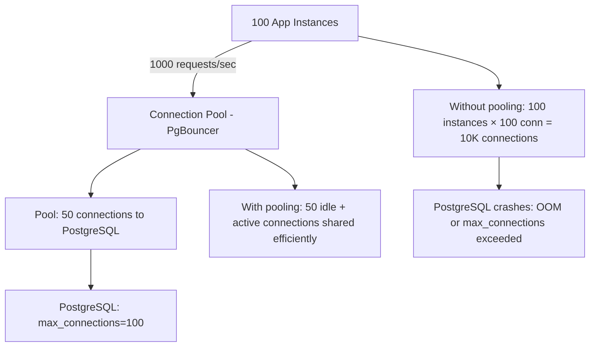

### Pitfalls
- ❌ **Setting pool size too high:** Increasing pool size beyond PostgreSQL's optimal concurrency (usually cores × 2) causes context-switching overhead — more connections ≠ more throughput
- ❌ **Not accounting for connection pool overhead in capacity planning:** Each PgBouncer proxy process uses ~5MB RAM; at 10 PgBouncer instances, that's 50MB overhead — negligible but worth knowing

### Concept Reference

---

## Q2: What happens when you exhaust your database connection pool?

**Role:** Mid | **Difficulty:** 🟡 Mid | **Priority:** P0 | **Format:** Quick Answer

> **What the interviewer is testing:** Whether you understand the cascading failure pattern when connection pools are exhausted and can describe the user-visible impact.

### Answer in 60 seconds
- **Immediate effect:** New requests queue waiting for a connection to become available — queue depth grows, p99 latency spikes
- **Cascade effect:** Slow queries hold connections longer → pool exhausted → upstream services time out → circuit breakers open → cascading failures across multiple services
- **User impact:** API returns 503 or timeout errors; at peak traffic, this looks like a total outage even though the DB is fine
- **Detection:** Monitor `pool_size - pool_available` (PgBouncer: `SHOW POOLS`); alert when available < 10% of pool size

### Diagram

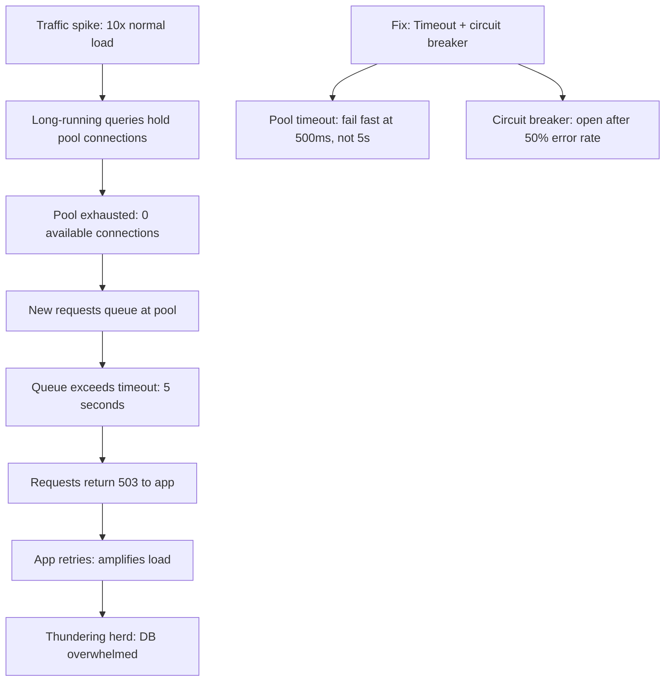

### Pitfalls
- ❌ **Infinite pool wait timeout:** A 30-second wait timeout means connections queue for 30s before failing — use 500ms to fail fast and trigger circuit breakers sooner
- ❌ **No pool monitoring:** Pool exhaustion is silent until users complain — add alerts on `pool_available < 20%` and `pool_wait_time > 100ms`

### Concept Reference

---

## Q3: How does PgBouncer work and what pooling modes does it offer?

**Role:** Senior | **Difficulty:** 🔴 Senior | **Priority:** P0 | **Format:** Deep Dive

> **What the interviewer is testing:** Whether you know PgBouncer's three pooling modes and can select the right one based on transaction semantics and performance requirements.

### Problem Constraints
| Dimension | Value |
|-----------|-------|
| App connections | 2,000 |
| DB max_connections | 200 |
| Average query time | 5ms |
| Transactions per second | 10,000 |

### PgBouncer Architecture

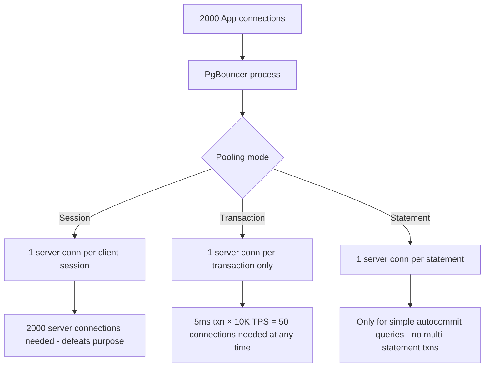

### Pooling Mode Comparison

| Mode | Connection Held | Server Conns Needed | Restrictions |
|------|----------------|---------------------|--------------|
| Session | Entire client session | 1:1 ratio (no pooling benefit) | None |
| Transaction | During one transaction only | TPS × avg_txn_time = ~50 | No SET, advisory locks, or LISTEN |
| Statement | Single statement duration | Lowest possible | Autocommit only, no transactions |

### Transaction Mode Deep Dive

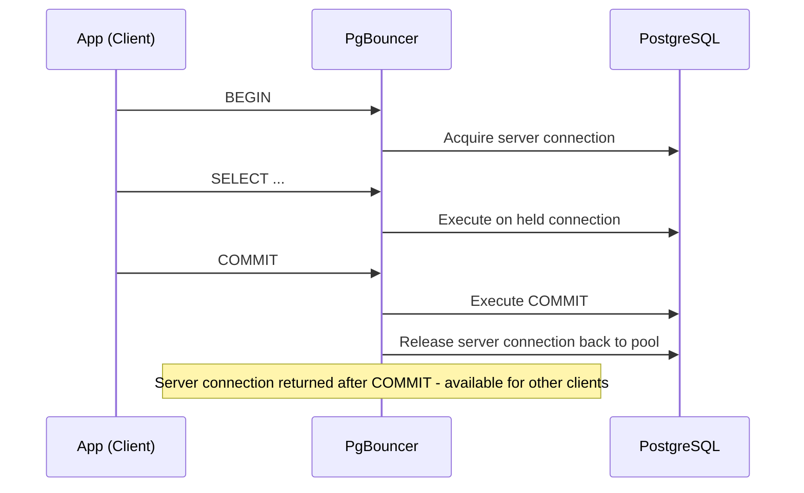

### Recommended Answer
Use **transaction mode** for most OLTP workloads — it multiplexes 2,000 client connections onto ~50–100 server connections (based on avg transaction time). The key restriction: PostgreSQL session-level features (`SET LOCAL`, advisory locks, `LISTEN/NOTIFY`, prepared statements) don't work in transaction mode because the server connection changes between transactions.

### What a great answer includes
- [ ] Pool size formula: pool_size = max_server_connections / avg_transaction_ms × 1000 (ms per second)
- [ ] Session mode use cases: migrations, schema changes, long-running maintenance tasks
- [ ] Transaction mode incompatibilities: no prepared statements (use `pgbouncer_prepared_statement_support` or disable)
- [ ] PgBouncer monitoring: `SHOW POOLS`, `SHOW STATS`, `SHOW CLIENTS` for real-time pool health

### Pitfalls
- ❌ **Using session mode thinking it's simpler:** Session mode means 1 server connection per client session — with 2,000 app connections you need 2,000 server connections, exceeding max_connections
- ❌ **Using prepared statements with transaction mode:** Prepared statements are session-scoped in PostgreSQL; transaction mode changes server connections, causing "prepared statement does not exist" errors

### Concept Reference

---

## Q4: What is the optimal connection pool size formula?

**Role:** Mid | **Difficulty:** 🟡 Mid | **Priority:** P1 | **Format:** Quick Answer

> **What the interviewer is testing:** Whether you know the HikariCP/PgBouncer formula and understand why more connections isn't always better.

### Answer in 60 seconds
- **HikariCP formula:** `pool_size = ((core_count × 2) + effective_spindle_count)` — for a 4-core DB server with SSD (spindle=1): pool = 4×2+1 = 9 connections
- **Empirical insight:** Beyond a certain pool size, DB CPU context-switching overhead exceeds the benefit of parallelism — adding connections reduces throughput
- **Starting point:** 10 connections per application instance; monitor DB CPU and adjust
- **PostgreSQL specific:** Total connections across all pools must be < `max_connections` (default 100); leave headroom for admin connections (`superuser_reserved_connections=3`)

### Diagram

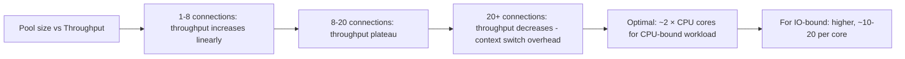

### Pitfalls
- ❌ **Setting pool_size=100 because max_connections=100:** 100 active connections all waiting for I/O saturates the kernel scheduler — start with 10-20 and benchmark
- ❌ **Same pool size for all services:** A heavy analytics service needs larger pools than a simple CRUD service — size per service based on actual query duration

### Concept Reference

---

## Q5: How do you handle connection pool exhaustion gracefully under load?

**Role:** Senior | **Difficulty:** 🔴 Senior | **Priority:** P1 | **Format:** Deep Dive

> **What the interviewer is testing:** Whether you have a multi-layer defense strategy (fail fast, circuit breaker, caching) for pool exhaustion rather than just increasing pool size.

### Problem Constraints
| Dimension | Value |
|-----------|-------|
| Normal load | 500 req/sec |
| Traffic spike | 5,000 req/sec (10x) |
| Pool size | 50 connections |
| Target | Graceful degradation, not total failure |

### Defense in Depth

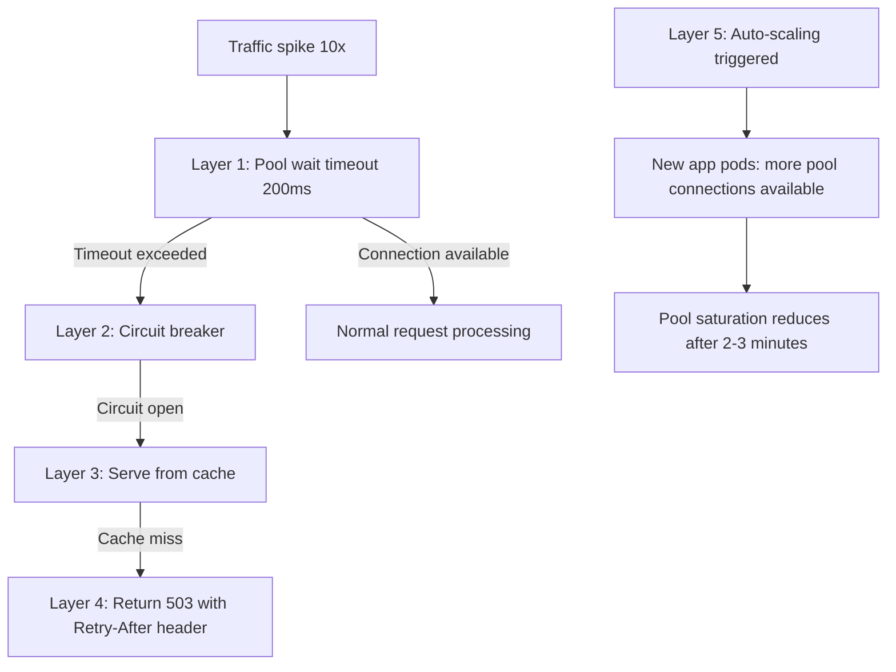

| Layer | Mechanism | Response Time | User Impact |
|-------|-----------|--------------|-------------|
| 1 — Fail fast | Pool timeout 200ms | Immediate | Fast error, not slow timeout |
| 2 — Circuit breaker | Open after 50% error rate | Immediate | No DB load during outage |
| 3 — Stale cache | Redis fallback | <5ms | Slightly stale data |
| 4 — Graceful 503 | Retry-After header | Immediate | User retries after 30s |
| 5 — Scale out | Kubernetes HPA | 2–3 minutes | Resolves underlying issue |

### Recommended Answer
Implement all 5 layers. A 200ms pool timeout fails fast instead of queuing for 30 seconds. Circuit breakers stop hammering an overwhelmed DB. Redis stale-cache serves 80% of read traffic even during DB degradation. Graceful 503 with Retry-After tells clients when to come back. Auto-scaling addresses the root cause within minutes.

### What a great answer includes
- [ ] Circuit breaker state machine: closed → open → half-open (test one request) → closed
- [ ] Redis stale-while-revalidate: serve cached response immediately, refresh in background
- [ ] Retry-After header: `503 Service Unavailable` + `Retry-After: 30` — instructs clients not to hammer
- [ ] Bulkhead pattern: separate connection pools for critical vs non-critical operations

### Pitfalls
- ❌ **No timeout on pool wait:** Default pool wait timeout in some libraries is infinite — under load, all threads block indefinitely causing full application freeze
- ❌ **Circuit breaker without half-open state:** A circuit breaker that never tests recovery keeps the circuit open even after the DB recovers — add half-open state with test request every 30s

### Concept Reference

---

## Q6: What is connection multiplexing and how does it differ from pooling?

**Role:** Senior | **Difficulty:** 🔴 Senior | **Priority:** P1 | **Format:** Quick Answer

> **What the interviewer is testing:** Whether you understand the distinction between sharing connections across clients (pooling) and sharing a single connection for multiple requests simultaneously (multiplexing).

### Answer in 60 seconds
- **Connection pooling:** N client connections share M server connections (M << N); each client borrows a connection sequentially — one query at a time per server connection
- **Connection multiplexing:** A single server connection handles multiple concurrent queries in a pipelined fashion — analogous to HTTP/2 stream multiplexing over a single TCP connection
- **PostgreSQL reality:** PostgreSQL doesn't support true query multiplexing on one connection (one query at a time per connection); multiplexing is used in the connection layer (e.g., RDS Proxy holds fewer actual connections but pipelines requests)
- **Practical difference:** Multiplexing reduces connection count more aggressively than pooling; RDS Proxy can handle 1,000 app connections with 50 DB connections using multiplexing

### Diagram

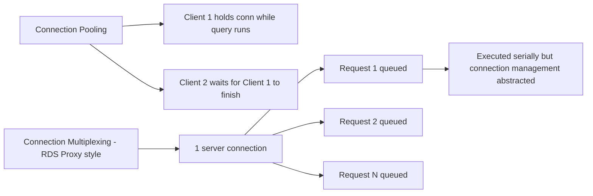

### Pitfalls
- ❌ **Conflating Redis pipeline with DB multiplexing:** Redis pipelines batch commands over one connection — true parallelism; PostgreSQL "multiplexing" is sequential pipelining — different performance profiles
- ❌ **Expecting multiplexing to improve throughput per connection:** Multiplexing reduces connection overhead, not query execution time — DB throughput is still bounded by server CPU

### Concept Reference

---

## Q7: How do you monitor connection pool health metrics?

**Role:** Senior | **Difficulty:** 🔴 Senior | **Priority:** P2 | **Format:** Quick Answer

> **What the interviewer is testing:** Whether you know the specific metrics for healthy pool operation and what thresholds should trigger alerts.

### Answer in 60 seconds
- **Key metrics:** Active connections (in use), idle connections (available), waiting connections (queued), pool utilization % (active/pool_size)
- **Alert thresholds:** Pool utilization > 80% = warning; > 95% = critical (exhaustion imminent); average wait time > 50ms = investigate
- **PgBouncer metrics:** `SHOW POOLS` shows cl_active, cl_waiting, sv_active, sv_idle, sv_used; `SHOW STATS` shows avg_query_time, total_xact_count
- **PostgreSQL metrics:** `SELECT count(*) FROM pg_stat_activity WHERE state = 'active'` gives current active queries; `pg_stat_activity.wait_event_type` shows what connections are waiting on

### Diagram

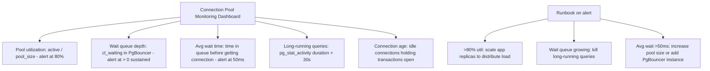

### Pitfalls
- ❌ **Only monitoring total connection count:** Total connections can be healthy while a subset of long-running queries hold all active slots — monitor wait queue separately
- ❌ **No idle-in-transaction tracking:** A connection idle-in-transaction holds locks but appears idle — track `pg_stat_activity WHERE state = 'idle in transaction'` and alert at duration > 60s

### Concept Reference

---

## Q8: How does RDS Proxy handle connection pooling for serverless?

**Role:** Staff | **Difficulty:** ⚫ Staff | **Priority:** P2 | **Format:** Deep Dive

> **What the interviewer is testing:** Whether you understand the specific problem AWS Lambda creates for databases (connection storms) and how RDS Proxy addresses it with connection multiplexing and IAM pinning.

### Problem Constraints
| Dimension | Value |
|-----------|-------|
| Lambda concurrency | 1,000 simultaneous invocations |
| Each Lambda's pool size | 1 connection (stateless) |
| Without RDS Proxy | 1,000 DB connections on every cold start wave |
| PostgreSQL max_connections | 200 |

### RDS Proxy Architecture

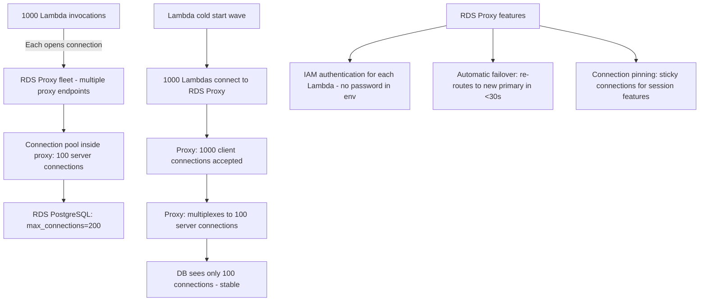

| Feature | RDS Proxy | PgBouncer |
|---------|-----------|-----------|
| Managed by | AWS | Self-managed |
| IAM auth | Yes (Lambda-native) | No |
| Cost | ~$0.015/hr per vCPU-hr | Free (EC2 cost only) |
| Failover handling | Automatic, <30s | Manual reconfiguration |
| Transaction mode | Yes | Yes |
| Session pinning | Yes (for SET commands) | Manual configuration |

### Recommended Answer
RDS Proxy is purpose-built for serverless Lambda workloads — it absorbs 1,000 simultaneous Lambda connections and multiplexes them to a fixed pool of server connections. The DB sees a stable connection count regardless of Lambda concurrency spikes. Key RDS Proxy feature: **connection pinning** — when a Lambda uses session-level features (SET, temporary tables), RDS Proxy pins that client to one server connection for the session duration.

### What a great answer includes
- [ ] Why Lambda can't use traditional pools: Lambda is stateless — each invocation initializes a new connection; the connection lives only for the invocation
- [ ] RDS Proxy cost model: pay per vCPU-hour of the DB instance, ~25% overhead
- [ ] Connection pinning gotcha: session-level commands cause pinning, reducing multiplexing benefit — avoid session SET commands in Lambda
- [ ] Comparison to Supavisor (Supabase): cloud-native alternative to PgBouncer with protocol-level multiplexing

### Pitfalls
- ❌ **Not setting connection timeout in Lambda:** Lambda without RDS Proxy that can't get a connection will wait until the 15-minute Lambda timeout — always set query_timeout=5s
- ❌ **Using RDS Proxy and still opening large pools per Lambda:** If each Lambda allocates pool_size=10, RDS Proxy's client side is 10K connections — keep Lambda pool_size=1 when using RDS Proxy

### Concept Reference

---

## Q9: How do you handle prepared statement caching with pooling?

**Role:** Staff | **Difficulty:** ⚫ Staff | **Priority:** P2 | **Format:** Quick Answer

> **What the interviewer is testing:** Whether you know the prepared statement and connection pool incompatibility and the standard workarounds.

### Answer in 60 seconds
- **Problem:** Prepared statements are session-scoped in PostgreSQL — they're tied to a specific server connection; in transaction-mode pooling, the server connection changes between transactions, so prepared statements from the previous connection don't exist
- **Error:** `ERROR: prepared statement "s1" does not exist` — classic PgBouncer transaction-mode symptom
- **Solutions:** (1) Use `prepared_statements=false` in JDBC/psycopg2 to disable client-side prepared statement caching; (2) Use extended query protocol with `?` parameters (unnamed prepared statements, not cached across connections); (3) Use PgBouncer session mode for services that rely on prepared statements
- **ORMs:** Most modern ORMs (Prisma, SQLAlchemy) have a `pgbouncer` mode that disables prepared statement caching automatically

### Diagram

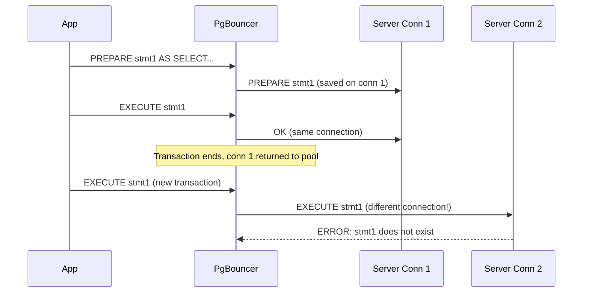

### Pitfalls
- ❌ **Discovering this in production:** Prepared statement errors in PgBouncer transaction mode only appear if the app actually uses prepared statements — some ORMs enable them by default; test with PgBouncer in staging
- ❌ **Switching to session mode to fix it:** Session mode eliminates the pooling benefit — use `prepared_statements=false` in the app driver instead

### Concept Reference

---

## Q10: Your API gets intermittent "too many connections" during traffic spikes — diagnose and fix

**Role:** Senior | **Difficulty:** 🔴 Senior | **Priority:** P1 | **Format:** Scenario
**Real Company:** Common Node.js / PostgreSQL production incident

### The Brief
> "Your team just launched a viral feature. API error rate jumped to 15%, all errors are 'too many connections to the server' from PostgreSQL. Normal traffic is 200 req/sec; current traffic is 2,000 req/sec. Walk through your incident response."

### Clarifying Questions to Ask First
1. Are you using a connection pool library (pg-pool, knex) or opening connections per request?
2. How many app instances are running and what is each instance's pool size?
3. What is PostgreSQL's max_connections setting?
4. Is PgBouncer or any proxy in the architecture?

### Back-of-Envelope Estimation
| Metric | Normal | Spike | Problem |
|--------|--------|-------|---------|
| App instances | 5 pods | 5 pods (not scaled yet) | Fixed |
| Pool size per pod | 20 | 20 | Fixed |
| Total connections | 100 | 100 | At max |
| Req/sec per pod | 40 | 400 | Queries queuing |
| Avg query time | 10ms | 50ms (DB under load) | Slower queries hold conns longer |

### High-Level Architecture

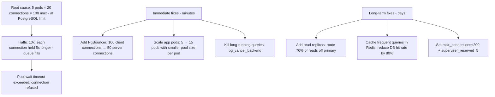

### Trade-off Decisions
| Decision | Option A | Option B | Chosen | Why |
|----------|----------|----------|--------|-----|
| Immediate fix | Increase max_connections | Add PgBouncer | Add PgBouncer | max_connections increase degrades DB stability; PgBouncer multiplexes safely |
| Scale strategy | Scale DB vertically | Scale app horizontally | Scale app first | App scaling adds more pool connections; DB vertical scale takes >15 min |
| Long-running queries | Kill manually | Set statement_timeout | statement_timeout=30s | Automatic; prevents future accumulation |

### Failure Modes
| Failure | Impact | Mitigation |
|---------|--------|------------|
| PgBouncer becomes SPOF | All connections fail | Deploy 2+ PgBouncer instances behind HAProxy |
| Scaling pods increases total pool connections | max_connections still exceeded | Reduce per-pod pool size when scaling out |
| statement_timeout too aggressive | Legitimate long queries killed | Monitor slow query log; adjust timeout per query type |

