# Database Backup & Recovery

6 questions covering RPO/RTO fundamentals, backup types, point-in-time recovery, backup verification, geo-redundancy, and AWS RDS automated backup.

---

## Q1: What are RPO and RTO, and how do they drive backup strategy decisions?

**Role:** Junior | **Difficulty:** 🟢 Junior | **Priority:** P0 | **Format:** Quick Answer

> **What the interviewer is testing:** Whether you can translate business requirements (how much data loss is acceptable, how fast must we recover) into concrete backup design decisions — not just define the acronyms.

### Answer in 60 seconds
- **RPO (Recovery Point Objective):** Maximum acceptable data loss measured in time — RPO = 5 minutes means you can afford to lose at most 5 minutes of data; if the last backup is 4 hours old when a failure occurs, that violates a 5-minute RPO
- **RTO (Recovery Time Objective):** Maximum acceptable downtime measured in time — RTO = 1 hour means the system must be fully operational within 1 hour of a failure event
- **How they drive backup strategy:** Lower RPO requires more frequent backups (continuous WAL streaming beats hourly snapshots); lower RTO requires faster restore mechanisms (hot standby beats restoring from S3)
- **Real-world anchors:** E-commerce checkout: RPO=1 min, RTO=15 min; internal analytics: RPO=24 hrs, RTO=48 hrs — wildly different architectures, radically different costs

### Diagram

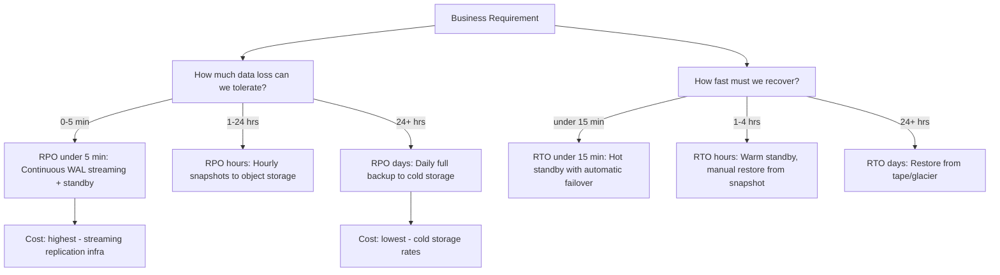

### Key Numbers to Memorize
| RPO Target | Required Mechanism | Typical Cost |
|------------|-------------------|--------------|
| 0 seconds (zero data loss) | Synchronous replication | 2-3x primary cost |
| Under 5 min | Continuous WAL archiving + streaming replica | 1.5-2x primary cost |
| Under 1 hr | Hourly snapshots | +20-30% primary cost |
| 24 hrs | Daily full backup | Minimal |

### Pitfalls
- ❌ **Setting RPO/RTO without business buy-in:** Engineering chooses RPO=1 min, which costs $50K/month extra — always let the business quantify the cost of downtime first, then design to the agreed SLA
- ❌ **Confusing RPO with backup frequency:** If backups run every hour but take 50 minutes to complete, your actual RPO may be closer to 110 minutes in a worst-case scenario, not 60 minutes

### Concept Reference
→ [Transactions, ACID, and BASE](./transactions-acid-base)

---

## Q2: Full vs incremental vs WAL-based continuous backup — when to use each

**Role:** Mid | **Difficulty:** 🟡 Mid | **Priority:** P0 | **Format:** Quick Answer

> **What the interviewer is testing:** Whether you understand the trade-off triangle of storage cost, restore complexity, and RPO achievability across the three main backup strategies.

### Answer in 60 seconds
- **Full backup:** Complete copy of every data file; restore is a single step; a 2 TB database takes 2 TB of storage per backup and may take 4-8 hours to complete — run weekly, not daily
- **Incremental backup:** Only blocks changed since the last full or incremental backup; a 2 TB DB with 5% daily churn produces 100 GB/day increments; restore requires: apply full, then replay each increment in sequence — adds restore complexity
- **WAL-based continuous backup (PITR):** PostgreSQL streams Write-Ahead Log segments (each 16 MB by default) to object storage continuously; achieves RPO of 5 minutes or less; restore replays WAL to any point in time
- **Production practice:** Most production databases use full backup weekly + WAL archiving daily — the combination gives PITR capability without extreme restore complexity

### Diagram

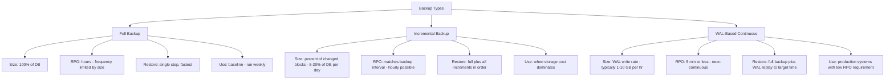

### Comparison Table

| Dimension | Full | Incremental | WAL Continuous |
|-----------|------|-------------|----------------|
| Storage per day (2 TB DB, 5% churn) | 2 TB | 100 GB | 5-50 GB |
| RPO achievable | Hours | 1 hr | 5 min |
| Restore steps | 1 | N+1 | 2 (base + WAL replay) |
| Restore time (2 TB) | 4-8 hr | 2-10 hr | 1-4 hr + replay time |
| Restore complexity | Low | High | Medium |

### Pitfalls
- ❌ **Relying solely on incremental backups without periodic full backups:** If any increment in the chain is corrupted, the entire restore chain fails — always anchor chains with weekly full backups
- ❌ **Underestimating WAL volume at high write rates:** A database writing 500 MB/sec generates 1.8 TB of WAL per hour — budget S3 storage and bandwidth costs before enabling WAL archiving

### Concept Reference
→ [Transactions, ACID, and BASE](./transactions-acid-base)

---

## Q3: How does Point-in-Time Recovery (PITR) work with PostgreSQL WAL archiving?

**Role:** Senior | **Difficulty:** 🔴 Senior | **Priority:** P1 | **Format:** Deep Dive

> **What the interviewer is testing:** Whether you understand the PostgreSQL WAL archiving mechanism end-to-end and can describe how to recover to a specific timestamp after data corruption or accidental deletion.

### Problem Constraints
| Dimension | Value |
|-----------|-------|
| Database size | 500 GB PostgreSQL |
| WAL segment size | 16 MB (default) |
| Write rate | 50 MB/sec peak, 10 MB/sec average |
| Recovery target | Restore to state at 14:37:00 before accidental DROP TABLE at 14:42:00 |

### How WAL Archiving Works

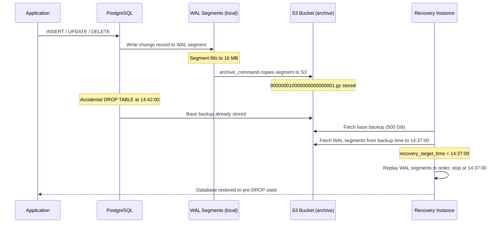

### PITR Recovery Flow

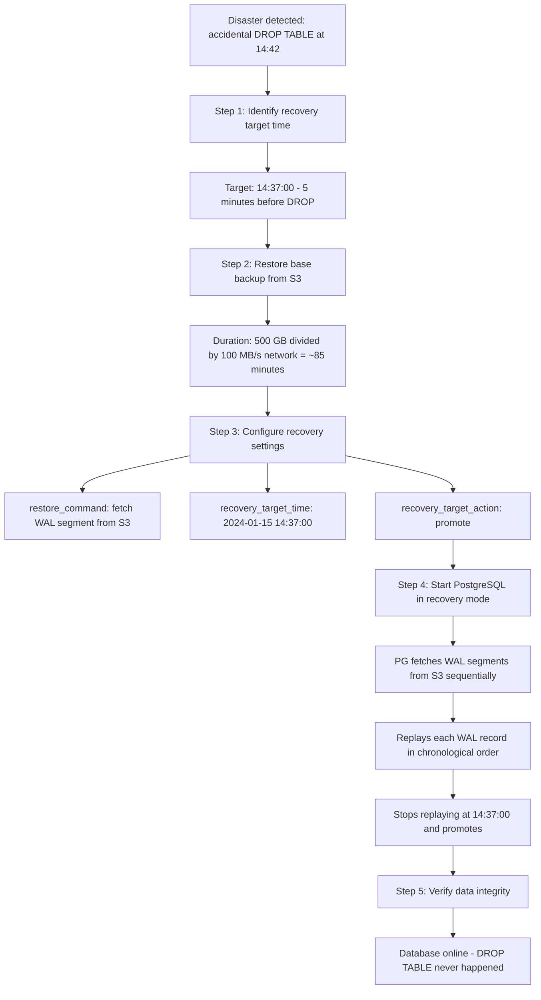

### Key Numbers

| Metric | Value |
|--------|-------|
| WAL segment size | 16 MB (default, tunable via wal_segment_size) |
| WAL segments per hour at 10 MB/s | ~3.75 segments (60 MB) |
| Archive lag (default) | Segment archived when full or after archive_timeout (set to 60s for low RPO) |
| PITR recovery speed | WAL replay at ~3-5x write-time speed |
| Effective RPO with archive_timeout=60s | ~1-2 minutes |

### What a great answer includes
- [ ] archive_command triggers WAL archiving when a segment is full (16 MB) or when archive_timeout elapses — whichever comes first
- [ ] recovery_target_time vs recovery_target_lsn — LSN-based recovery is more precise for programmatic restore
- [ ] Base backup frequency matters: WAL replay from a 7-day-old base backup means replaying 7 days of WAL — keep base backups fresh (daily or every few days)
- [ ] Continuous archiving gap risk: if archive_command fails silently, WAL segments accumulate locally and may fill disk — monitor pg_stat_archiver.failed_count

### Pitfalls
- ❌ **Setting archive_timeout to 0 (disabled):** WAL segment only archives when full — at low write rates a segment may stay open for hours, giving an effective RPO of hours instead of minutes; always set archive_timeout = 60 for production
- ❌ **Not testing PITR before you need it:** The first time you discover your archive_command was silently failing is not during a disaster recovery — test restore monthly with a real WAL replay to a throwaway instance

### Concept Reference
→ [Transactions, ACID, and BASE](./transactions-acid-base)

---

## Q4: How do you test a backup — minimum verification for recoverability?

**Role:** Senior | **Difficulty:** 🔴 Senior | **Priority:** P1 | **Format:** Deep Dive

> **What the interviewer is testing:** Whether you understand that an untested backup is not a backup — and whether you can describe a practical, automated verification pipeline that proves recoverability without disrupting production.

### Problem Constraints
| Dimension | Value |
|-----------|-------|
| Database size | 200 GB |
| Backup frequency | Daily full + continuous WAL |
| Recovery team | On-call DBA |
| Target | Prove every backup is recoverable before the next one runs |

### The Backup Verification Pipeline

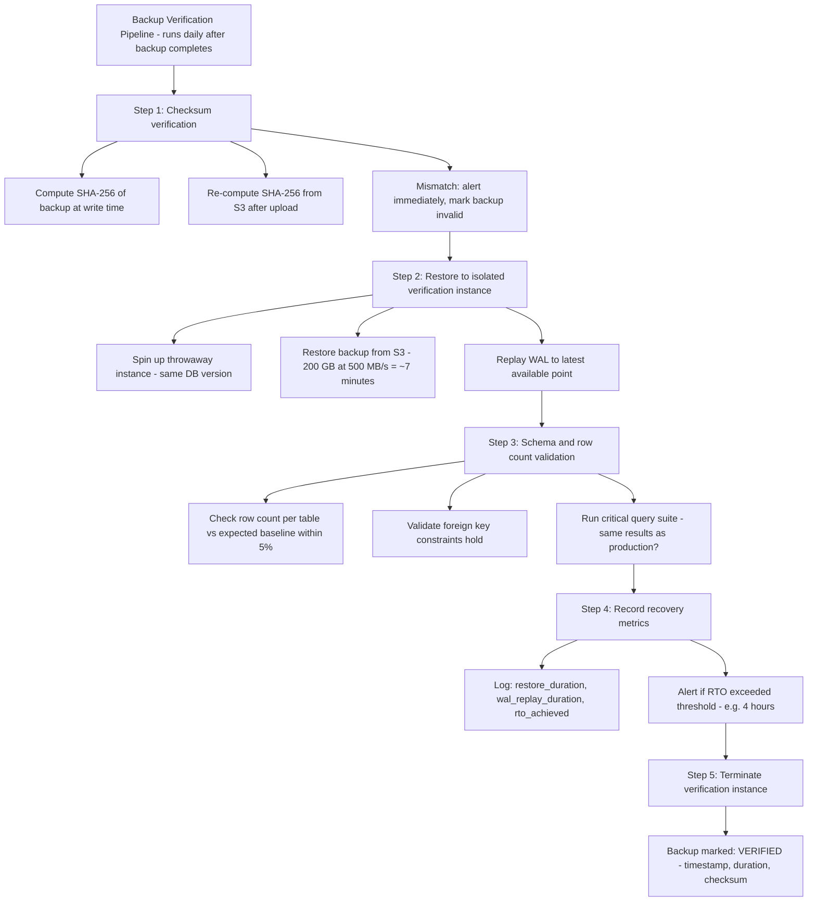

### Minimum Verification Checklist

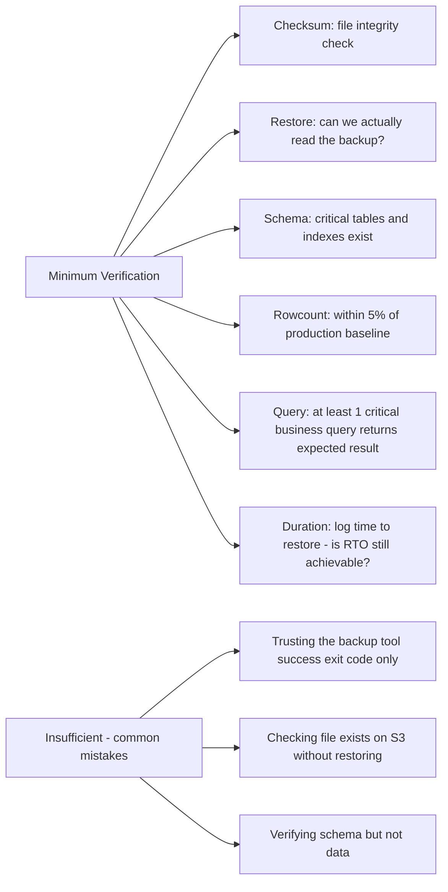

### Verification Frequency and Cost

| Verification Level | Frequency | What It Catches | Cost |
|-------------------|-----------|-----------------|------|
| Checksum | Every backup | Corruption in transit | Negligible |
| Schema restore | Weekly | Missing WAL segments, wrong DB version | Low |
| Full restore + data validation | Monthly | Silent data corruption, index corruption | Medium |
| Full PITR drill (restore to past timestamp) | Quarterly | Operator error in recovery runbook | High |

### Recommended Answer
The minimum viable backup test: restore the backup to a throwaway instance, verify the schema has the expected tables, run one row-count query per critical table, and log the total restore duration. Automate this pipeline to run after every backup. Alert on failure. A backup that has never been restored is a liability, not an asset — post-mortems at GitHub (2012), GitLab (2017), and Roblox (2021) all involved backups that existed but could not be restored in time.

### Pitfalls
- ❌ **Treating a successful pg_dump exit code as proof of recoverability:** pg_dump can complete with exit 0 and produce a file that fails to restore due to encoding issues, missing extensions, or incompatible PostgreSQL versions
- ❌ **Restoring to the same server as production for backup test:** A disk failure that corrupts the primary also corrupts a "test restore" on the same disk — always restore to a separate physical or cloud instance

### Concept Reference
→ [Transactions, ACID, and BASE](./transactions-acid-base)

---

## Q5: Geo-redundant backup and the 3-2-1 backup rule

**Role:** Senior | **Difficulty:** 🔴 Senior | **Priority:** P1 | **Format:** Deep Dive

> **What the interviewer is testing:** Whether you know the 3-2-1 rule as an industry-standard backup durability principle, can map it to cloud infrastructure, and understand why geo-redundancy protects against region-level failures that same-region replication cannot.

### Problem Constraints
| Dimension | Value |
|-----------|-------|
| Database | 1 TB PostgreSQL on AWS us-east-1 |
| Requirement | Survive complete region failure |
| RPO | 15 minutes |
| RTO | 2 hours |

### The 3-2-1 Rule

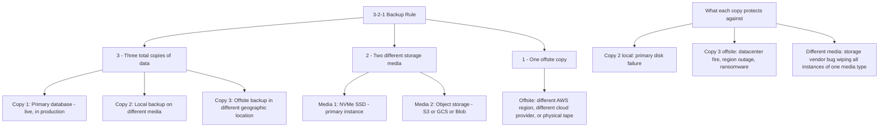

### Cloud Implementation of 3-2-1

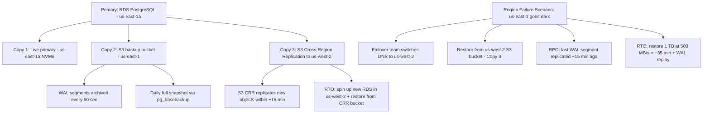

### Why Same-Region Replication is Not Enough

| Threat | Same-Region Replica | 3-2-1 with Offsite Copy |
|--------|--------------------|-----------------------|
| Single disk failure | Protected | Protected |
| AZ failure | Protected (multi-AZ) | Protected |
| Full region power failure | NOT protected | Protected |
| Region-wide ransomware | NOT protected | Protected (offsite isolated) |
| Accidental DROP TABLE | NOT protected (replicates immediately) | Protected (PITR from offsite WAL) |
| S3 bucket deletion | NOT protected (same bucket) | Protected (CRR to another region) |

### Cost Estimate (1 TB database)

| Component | Cost Estimate |
|-----------|--------------|
| S3 same-region backup (1 TB + 30 days WAL) | ~$25/month |
| S3 Cross-Region Replication transfer to us-west-2 | ~$20/month |
| S3 storage in us-west-2 (same volume) | ~$25/month |
| Total geo-redundant backup overhead | ~$70/month |

### What a great answer includes
- [ ] Ransomware as a primary threat that geo-redundancy solves: attackers encrypt or delete all copies they can reach — offsite immutable backup (S3 Object Lock) is the last line of defense
- [ ] Immutable backups: enable S3 Object Lock with COMPLIANCE mode — prevents deletion even by the account owner for the retention period
- [ ] Testing the cross-region restore path separately from the primary region path — disaster is not the time to discover the restore IAM role lacks permissions in us-west-2

### Pitfalls
- ❌ **Counting a read replica as a backup copy:** A streaming replica replicates DROP TABLE and data corruption instantly — it is a high-availability mechanism, not a backup; the 3-2-1 rule counts only copies that have independent write protection
- ❌ **Storing the encryption key for backup files in the same region as the backup:** If the region fails, the key is inaccessible and the backup is unreadable — store KMS keys in a separate region or use a multi-region KMS key

### Concept Reference
→ [Transactions, ACID, and BASE](./transactions-acid-base)

---

## Q6: AWS RDS automated backup — achieving RPO=5 min with minimal performance impact

**Role:** Staff | **Difficulty:** ⚫ Staff | **Priority:** P2 | **Format:** Deep Dive

> **What the interviewer is testing:** Whether you understand the RDS automated backup internals (snapshot + transaction log shipping), can explain how it achieves near-continuous RPO, and know how to tune it without degrading application performance.

### Problem Constraints
| Dimension | Value |
|-----------|-------|
| Database | RDS PostgreSQL 15, Multi-AZ, db.r6g.4xlarge |
| Workload | 10,000 TPS peak, 3,000 TPS average |
| RPO target | 5 minutes |
| Backup window constraint | No more than 5% I/O degradation during business hours |

### How RDS Automated Backup Works

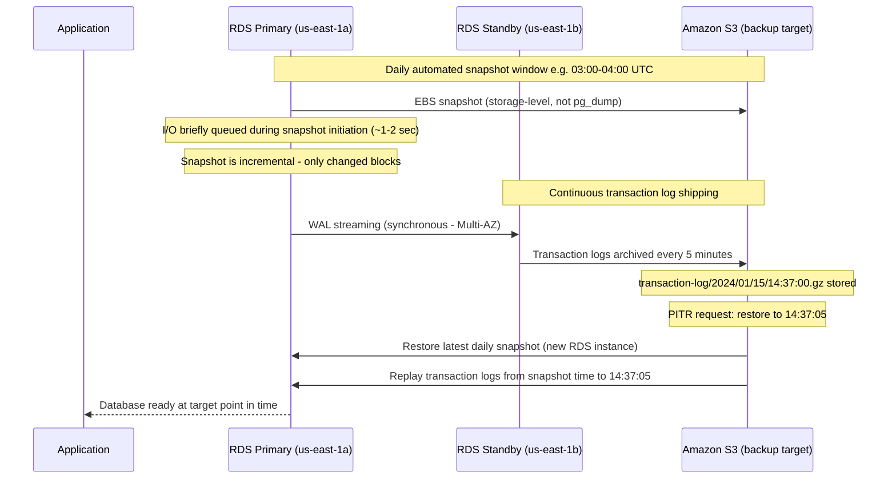

### RDS Backup Architecture

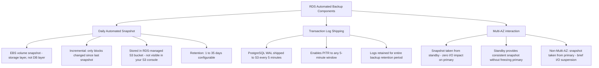

### Performance Impact Tuning

| Scenario | I/O Impact | Mitigation |
|----------|-----------|------------|
| Multi-AZ snapshot | ~0% on primary | Snapshot from standby |
| Single-AZ snapshot | 1-2 sec I/O suspend at initiation | Schedule in off-peak window |
| WAL log shipping | ~2-5% additional write I/O | Unavoidable; tune max_wal_size |
| Cross-Region backup enabled | +5-15% write I/O for CRR | Enable only if RPO requires it |

### PITR Restore Procedure on RDS

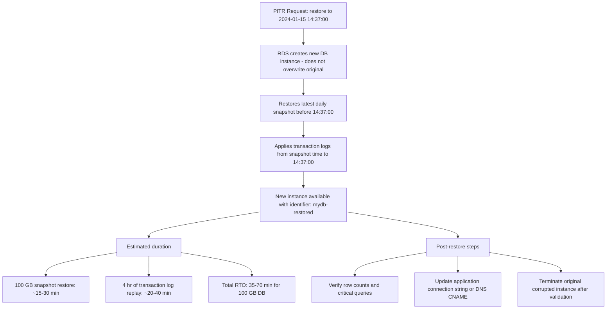

### Key RDS Backup Numbers to Memorize

| Parameter | Value |
|-----------|-------|
| Transaction log shipping interval | 5 minutes (fixed, not configurable) |
| Effective RPO with automated backup | 5 minutes |
| Backup retention max | 35 days |
| Snapshot storage cost (RDS-managed) | Free up to DB size; $0.095/GB-month beyond |
| Cross-region snapshot copy | ~$0.02/GB transfer + destination storage |
| PITR new instance creation time (100 GB) | 35-70 minutes |

### What a great answer includes
- [ ] Multi-AZ eliminates snapshot I/O impact: RDS takes the snapshot from the standby, not the primary — this is one of the strongest arguments for enabling Multi-AZ beyond HA
- [ ] Transaction log shipping interval is 5 minutes and cannot be changed: if the business requires RPO under 5 min, RDS automated backup alone is insufficient — must add Aurora (continuous log) or self-managed streaming replication
- [ ] RDS backup vs manual snapshot: manual snapshots are not deleted when the instance is deleted; automated backups are deleted — create a final manual snapshot before decommissioning

### Pitfalls
- ❌ **Deleting the RDS instance before creating a final manual snapshot:** Deleting an RDS instance with automated backups enabled offers a prompt to create a final snapshot — skipping this permanently loses all backups since automated backups are tied to the instance lifecycle
- ❌ **Assuming PITR restores in-place:** RDS PITR always creates a new DB instance — the original instance is unchanged; this is by design, but teams miss it and wonder why the connection string did not change automatically
- ❌ **Relying on RDS automated backup for cross-region DR without enabling cross-region snapshot copy:** Automated backups stay in the primary region by default; a full region failure makes them inaccessible — explicitly enable cross-region automated backup copy in RDS settings

### Concept Reference
→ [Transactions, ACID, and BASE](./transactions-acid-base)
