# Database Backup & Recovery

6 questions covering RPO vs RTO, backup types, PITR with WAL archiving, backup testing, geo-redundancy and the 3-2-1 rule, and AWS RDS automated backup internals.

---

## Q1: What is RPO vs RTO — how do they drive backup strategy decisions?

**Role:** Mid | **Difficulty:** 🟡 Mid | **Priority:** P0 | **Format:** Quick Answer

> **What the interviewer is testing:** Whether you can define RPO and RTO precisely, explain who sets them (business, not engineering), and map specific values to specific backup technologies.

### Answer in 60 seconds
- **RPO (Recovery Point Objective):** Maximum acceptable data loss — how far back in time can you afford to restore from? RPO=0 means zero data loss (synchronous replication required); RPO=1hr means up to 1 hour of transactions can be lost
- **RTO (Recovery Time Objective):** Maximum acceptable downtime — how long can the service be down before restoring? RTO=5min means the system must be serving traffic again within 5 minutes of a failure
- **Who sets them:** Business stakeholders set RPO/RTO based on revenue impact — an e-commerce site losing $10,000/minute of downtime has RTO=1min; a nightly analytics pipeline can tolerate RTO=4hr
- **Technology mapping:** RPO=0 → synchronous multi-region replication; RPO=5min → WAL shipping + PITR; RPO=24hr → daily full backup; RTO=1min → standby with automatic failover; RTO=4hr → restore from backup to new instance

### Diagram

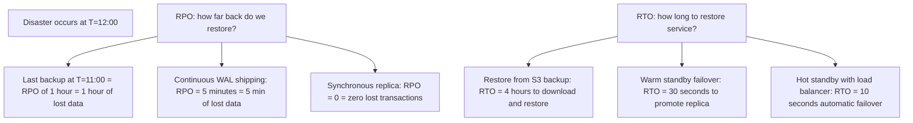

### RPO/RTO Technology Matrix

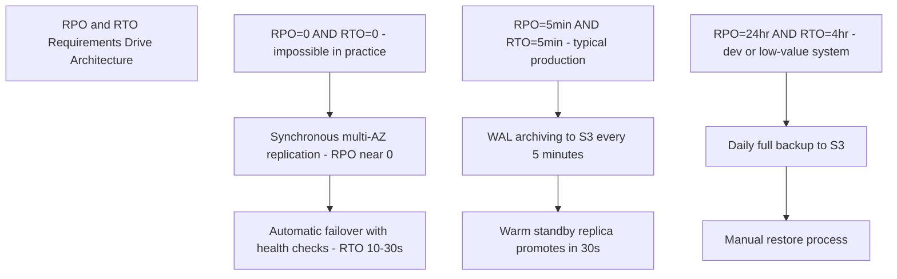

| RPO Requirement | Backup Technology | Monthly Cost (RDS) |
|-----------------|------------------|-------------------|
| 0 seconds | Synchronous multi-AZ replica | +100% (2x instance) |
| 5 minutes | WAL archiving + warm standby | +50% (standby + S3) |
| 1 hour | Hourly snapshots + S3 | +10% (S3 storage) |
| 24 hours | Daily full backup | +5% (S3 storage only) |

| RTO Requirement | Technology | Time to Recovery |
|-----------------|------------|-----------------|
| <30 seconds | Automatic failover to hot standby | 10–30 seconds |
| <5 minutes | Promote warm standby | 1–5 minutes |
| <1 hour | Restore latest snapshot to new instance | 15–60 minutes |
| <4 hours | Full restore from offsite backup | 1–4 hours |

### Pitfalls
- ❌ **Setting RPO=0 without understanding cost:** Synchronous replication means every write waits for at least one remote acknowledgment — adds 50–100ms write latency for cross-AZ; this is often unacceptable for write-heavy workloads; agree on RPO=5min and save 40ms per write
- ❌ **Conflating RTO with failover time:** RTO includes detection time + failover time + DNS propagation time + application reconnect time; a replica that promotes in 30 seconds may have an effective RTO of 5 minutes after accounting for health check interval (60s) + DNS TTL (300s)

### Concept Reference
→ [SQL vs NoSQL](../../../system-design/storage-and-databases/sql-vs-nosql)

---

## Q2: What is the difference between full, incremental, and WAL-based (continuous) backups?

**Role:** Mid | **Difficulty:** 🟡 Mid | **Priority:** P0 | **Format:** Quick Answer

> **What the interviewer is testing:** Whether you understand backup types, their storage and restore cost trade-offs, and when each is appropriate.

### Answer in 60 seconds
- **Full backup:** Copy of the entire database at a point in time; restore is simple (just restore this one file); storage cost = full DB size; typically taken weekly or daily; PostgreSQL: `pg_basebackup`; MySQL: `mysqldump` or Percona XtraBackup
- **Incremental backup:** Only the data changed since the last backup (full or incremental); storage = only delta bytes; restore requires replay of full + all incrementals in sequence; if one incremental is corrupt, the chain breaks
- **WAL-based (continuous) backup:** Archive WAL (Write-Ahead Log) files as they are generated — every 16MB WAL segment is shipped to S3; restore = full backup + replay all WAL files from that point; enables Point-in-Time Recovery (PITR) to any second in history
- **Real numbers:** 500GB database: full backup = 500GB/day; incremental = ~2GB/day (0.4% change rate); WAL archive = ~10GB/day (typical write-heavy workload)

### Diagram

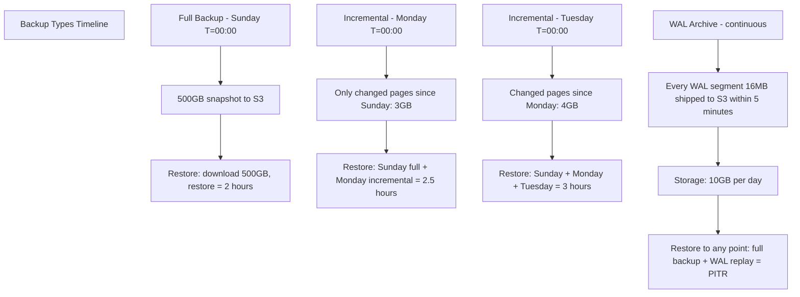

### Restore Complexity Comparison

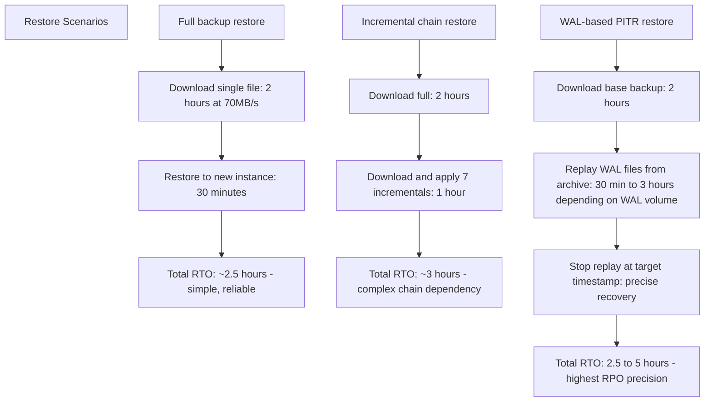

| Backup Type | Storage/Day | Restore Time | RPO | Use Case |
|-------------|-------------|--------------|-----|----------|
| Full (daily) | 500GB | 2–4 hours | 24 hours | Simple systems, low write rate |
| Full + incremental | 5–20GB | 2–6 hours | 24 hours | Large DBs, limited storage budget |
| WAL continuous | 10–50GB | 3–6 hours | 5 minutes | Production, PITR required |
| Full + WAL combined | 500GB + 10GB/day | 2–5 hours | 5 minutes | Production best practice |

### Pitfalls
- ❌ **Storing only incremental backups without a recent full backup:** If the base full backup is corrupted, the entire incremental chain is unrecoverable; always keep at least 2 recent full backups; test the restore of the chain weekly
- ❌ **Assuming WAL archive alone is sufficient:** WAL files replayed from genesis would take weeks for a 500GB database — you need a base backup as the starting point, then WAL replay only covers the delta from that base

### Concept Reference
→ [SQL vs NoSQL](../../../system-design/storage-and-databases/sql-vs-nosql)

---

## Q3: How do you achieve point-in-time recovery (PITR) with PostgreSQL WAL archiving?

**Role:** Senior | **Difficulty:** 🔴 Senior | **Priority:** P1 | **Format:** Deep Dive

> **What the interviewer is testing:** Whether you understand the complete PITR setup — base backup, WAL archiving to S3, and the recovery process to a specific timestamp after a destructive event.

### Problem Constraints
| Dimension | Value |
|-----------|-------|
| Scenario | Developer runs `DELETE FROM orders WHERE status='completed'` — drops 20M rows — mistake without WHERE refinement |
| Time of mistake | 14:32:00 UTC |
| RPO target | Recover to 14:31:00 UTC (1 minute before mistake) |
| Database size | 300GB |
| WAL archive lag | < 5 minutes (WAL shipped to S3 every 5 min) |

### PITR Setup

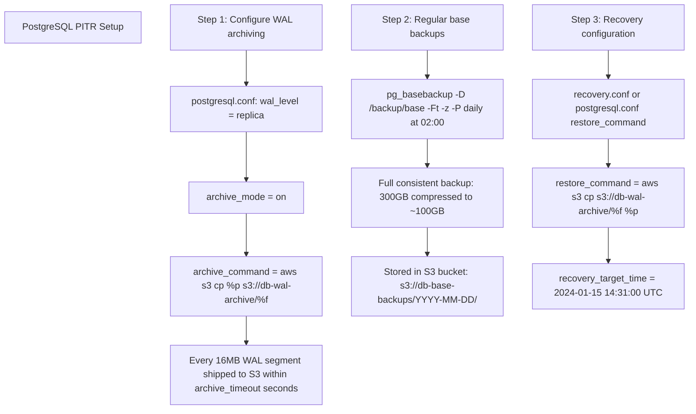

### PITR Recovery Process

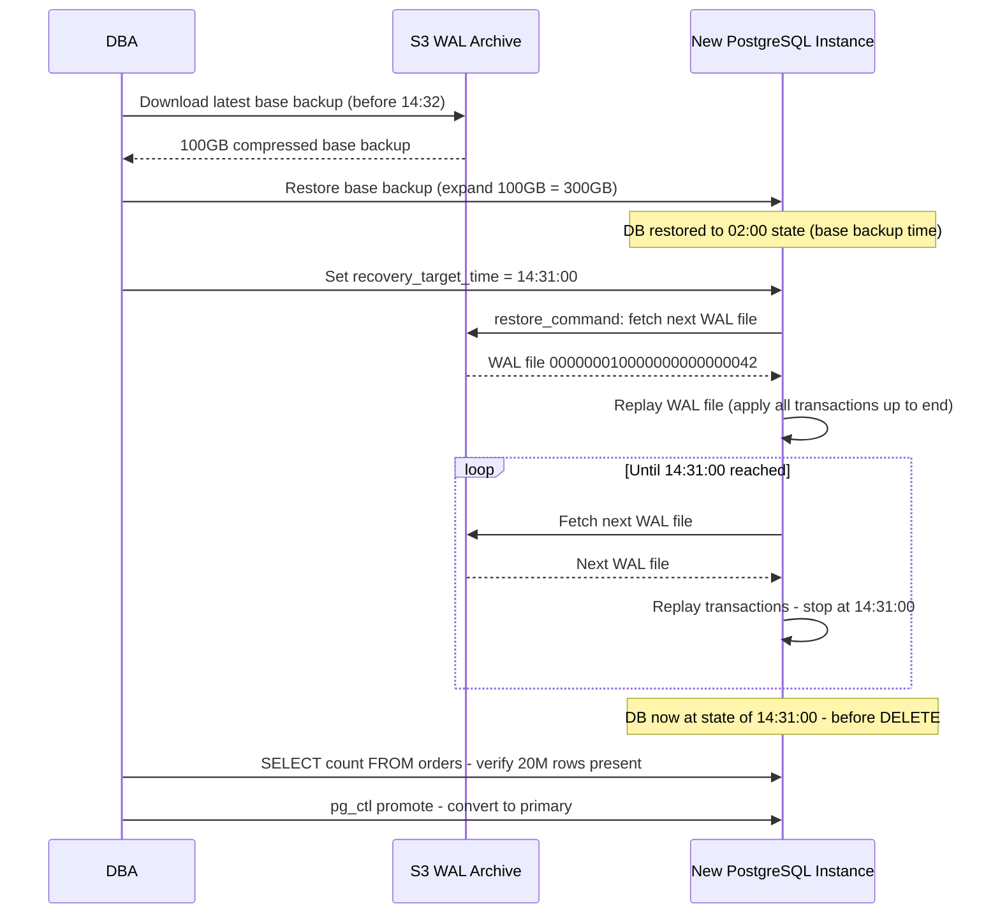

### Recovery Target Options

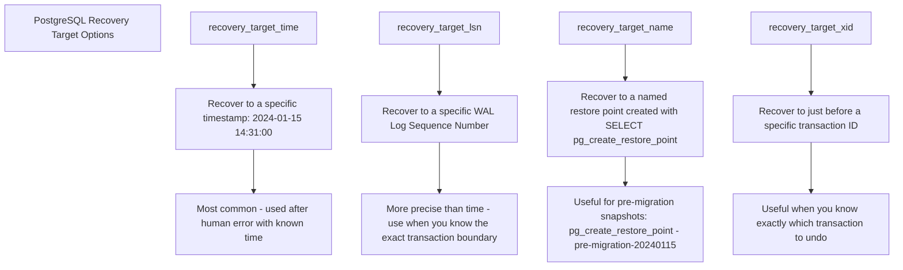

### Pitfalls
- ❌ **Setting `archive_timeout` too high:** Default `archive_timeout=0` means WAL is only archived when a segment fills (16MB, which could take hours on a low-write system); set `archive_timeout=300` (5 minutes) to ensure WAL is shipped even if not full — otherwise RPO can be hours, not minutes
- ❌ **Not testing PITR recovery before you need it:** A WAL archive that is incomplete or corrupted is only discovered during a crisis; run a monthly PITR test to a separate instance and verify row counts match expected state

### Concept Reference
→ [SQL vs NoSQL](../../../system-design/storage-and-databases/sql-vs-nosql)

---

## Q4: How do you test a backup — what is the minimum test to verify recoverability?

**Role:** Senior | **Difficulty:** 🔴 Senior | **Priority:** P1 | **Format:** Quick Answer

> **What the interviewer is testing:** Whether you understand that an untested backup is not a backup — you need a concrete, repeatable restore test procedure with a pass/fail criterion.

### Answer in 60 seconds
- **The fundamental principle:** A backup is only verified when you have successfully restored it and confirmed data integrity — storing a backup file without testing it is false confidence
- **Minimum viable test:** (1) Restore backup to a separate test instance; (2) verify DB starts and is queryable; (3) run a checksum query (`SELECT count(*), max(updated_at) FROM critical_table`) and compare to production at backup time; (4) spot-check 5–10 critical rows by known ID
- **Schedule:** Weekly restore test for production DBs; monthly full PITR test simulating a disaster scenario with a timestamp target
- **Automated testing:** CI/CD pipeline triggers weekly restore test; alerts if restore fails or row counts deviate >0.1% from expected; test result is a mandatory metric on ops dashboard

### Diagram

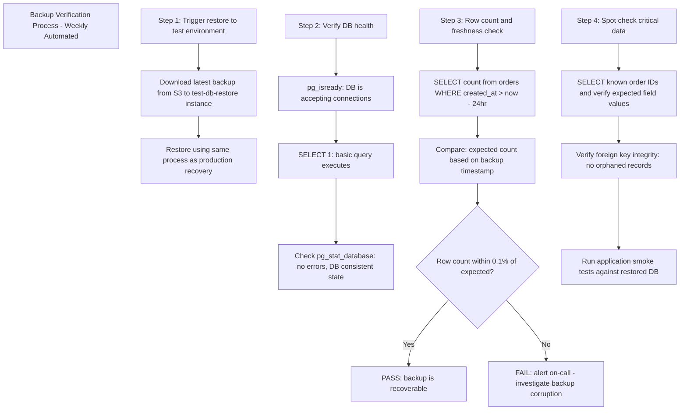

### Backup Test Automation Architecture

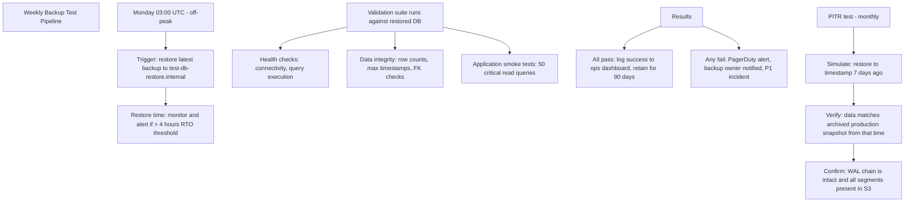

### Test Failure Causes and Fixes

| Failure Type | Symptom | Root Cause | Fix |
|-------------|---------|------------|-----|
| Backup file corrupt | MD5 checksum mismatch | S3 bit rot, upload error | Enable S3 object integrity checking, verify on upload |
| WAL gap in PITR chain | Recovery stops at T=X, cannot reach T=Y | WAL segment missing from archive | Check `archive_status` on source DB, re-archive missing segment |
| Row count mismatch >1% | Fewer rows than expected | Backup captured mid-transaction | Use consistent backup (`pg_basebackup --checkpoint=fast`) |
| DB starts but app fails | Connection string errors | DB name or user different in backup | Document restore runbook with all connection parameters |

### Pitfalls
- ❌ **Testing backup by checking file size only:** A 100GB backup file that is corrupt internally will fail to restore; file size check is not a validity check — only an actual restore confirms recoverability
- ❌ **Restoring to the same server as production for backup test:** Restoring over production to test the backup destroys production — always use a separate, isolated test environment; never test restores in place on a running system

### Concept Reference
→ [SQL vs NoSQL](../../../system-design/storage-and-databases/sql-vs-nosql)

---

## Q5: What is geo-redundant backup and why does the 3-2-1 backup rule matter?

**Role:** Senior | **Difficulty:** 🔴 Senior | **Priority:** P1 | **Format:** Quick Answer

> **What the interviewer is testing:** Whether you know the 3-2-1 rule as a widely accepted minimum standard for backup redundancy and can explain what geo-redundancy protects against.

### Answer in 60 seconds
- **3-2-1 rule:** Keep **3** copies of data, on **2** different storage media types, with **1** copy offsite; this ensures a single failure (disk failure, datacenter fire, ransomware) cannot destroy all copies simultaneously
- **Geo-redundant backup:** Storing backup copies in geographically separate regions — e.g., primary DB in US-East-1, backups in US-East-1 and US-West-2; a US-East-1 region outage cannot destroy both copies
- **What it protects against:** Regional cloud outages (full AZ or region failure); ransomware that encrypts DB and backup in same region; accidental deletion of backup in one region
- **Real numbers:** AWS S3 standard has 99.999999999% (11 nines) durability in one region; adding cross-region replication raises protection against regional disaster to astronomically unlikely

### Diagram

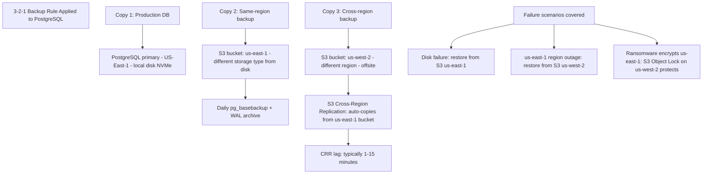

### S3 Geo-Redundant Backup Architecture

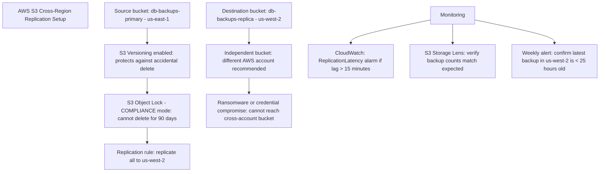

### Disaster Recovery Scenarios

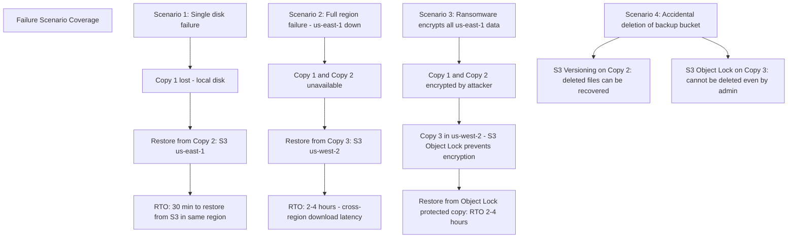

### Pitfalls
- ❌ **Storing backup in same region as production without cross-region copy:** AWS us-east-1 has had multi-hour full-region outages (December 2021); S3 in us-east-1 was affected; backups in the same region as the failure are unavailable when you need them most
- ❌ **Not enabling S3 Object Lock (WORM) on backup buckets:** Ransomware attackers who compromise AWS credentials can delete S3 objects; Object Lock in COMPLIANCE mode prevents deletion for the retention period even by the root account — without it, a compromised credential can delete all backups

### Concept Reference
→ [SQL vs NoSQL](../../../system-design/storage-and-databases/sql-vs-nosql)

---

## Q6: How does AWS RDS automated backup achieve RPO=5min with minimal performance impact?

**Role:** Staff | **Difficulty:** ⚫ Staff | **Priority:** P2 | **Format:** Deep Dive

> **What the interviewer is testing:** Whether you understand RDS automated backup internals — specifically how continuous WAL streaming achieves 5-minute RPO without impacting primary instance performance.

### Problem Constraints
| Dimension | Value |
|-----------|-------|
| RDS instance | db.r6g.8xlarge, 32 vCPU, 256GB RAM, 10TB gp3 storage |
| Write workload | 5,000 writes/sec, 200MB/s WAL generation rate |
| RPO target | 5 minutes |
| Performance budget | < 5% overhead on primary instance |

### RDS Backup Architecture

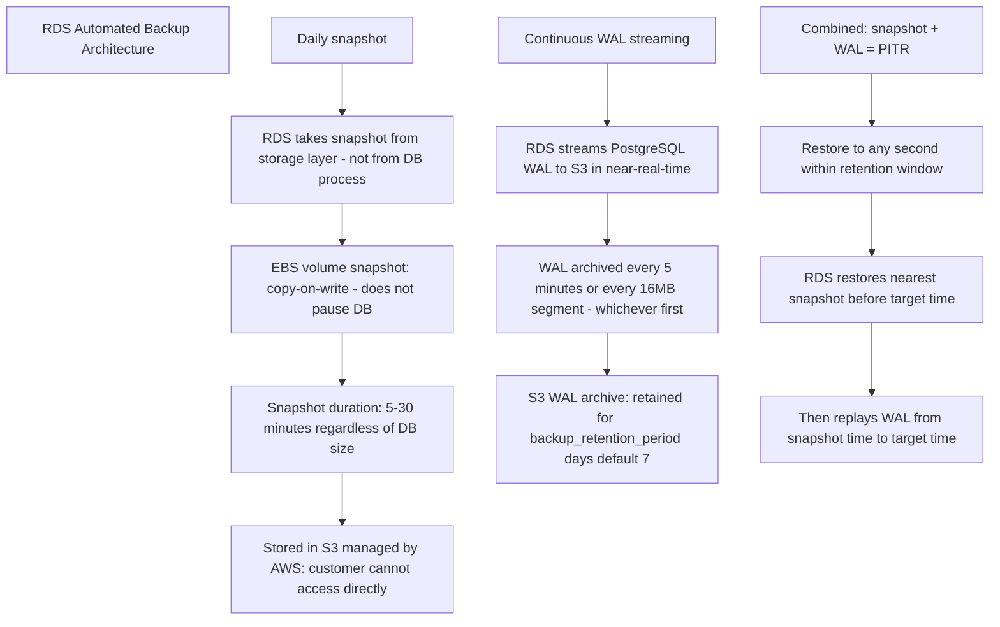

### Performance Impact Minimization

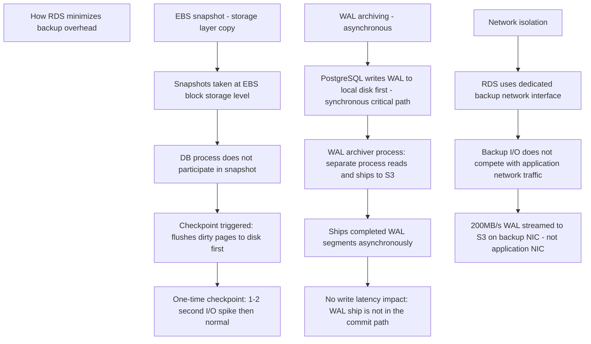

### PITR Restore Process on RDS

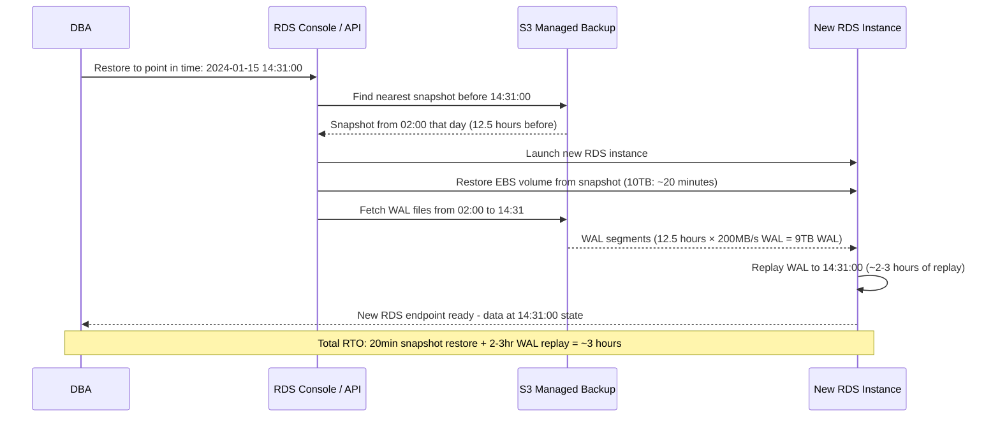

### RDS Backup Retention and Cost

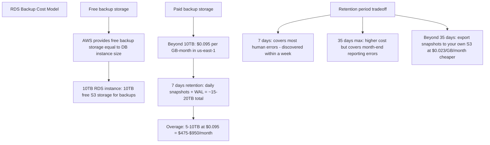

| RDS Backup Feature | Default | Configurable |
|--------------------|---------|-------------|
| Backup window | AWS chosen | Yes — set maintenance window |
| Retention period | 7 days | 0–35 days |
| RPO | 5 minutes | Cannot improve (WAL limit) |
| RTO (PITR) | 2–6 hours | No — depends on WAL volume |
| Cross-region backup | Disabled | Yes — extra cost |
| Encryption | Enabled with RDS KMS key | Yes — bring your own KMS key |

### What a great answer includes
- [ ] EBS snapshot vs `pg_basebackup`: RDS uses EBS storage-layer snapshots (milliseconds to initiate, copy-on-write) — not `pg_basebackup` (which reads all data pages and takes minutes to hours); this is why RDS snapshots don't block the DB
- [ ] WAL stream lag: RDS archives WAL every 5 minutes *minimum* — if the DB is very low-write, a WAL segment may not fill for 30 minutes; the 5-minute RPO assumes sufficient write volume to trigger the 5-minute archive; verify with `archive_timeout`-equivalent in RDS parameter group
- [ ] Multi-AZ interaction: RDS Multi-AZ keeps a synchronous standby; backups are taken from the standby in MySQL/MariaDB (zero overhead to primary); PostgreSQL Multi-AZ backups may still use the primary in some configurations — check AWS documentation for your engine version
- [ ] Export to S3 for longer retention: `aws rds export-snapshot-to-s3` exports a snapshot to Parquet files in your own S3 bucket — can query with Athena, and storage is $0.023/GB vs $0.095/GB for RDS managed storage

### Pitfalls
- ❌ **Setting backup_retention_period=0 to save cost:** Setting retention to 0 disables automated backups entirely — including PITR; if a developer deletes production data, you have zero recovery options; minimum production setting is 7 days
- ❌ **Relying only on RDS automated backups for compliance:** AWS manages automated backup storage and you cannot verify the restore procedure end-to-end through the console; for compliance (SOC 2, HIPAA), document and demonstrate a successful restore annually; use `aws rds restore-db-instance-to-point-in-time` in a test environment

### Concept Reference
→ [SQL vs NoSQL](../../../system-design/storage-and-databases/sql-vs-nosql)
