# Database Consistency Models

6 questions covering strong vs eventual vs causal consistency, linearizability, read-your-writes, session consistency, CockroachDB serializable isolation, and CRDTs.

---

## Q1: What is the difference between strong consistency, eventual consistency, and causal consistency?

**Role:** Mid | **Difficulty:** 🟡 Mid | **Priority:** P0 | **Format:** Quick Answer

> **What the interviewer is testing:** Whether you can define each model with a concrete example and explain the latency-consistency trade-off — not just recite definitions.

### Answer in 60 seconds
- **Strong consistency:** Every read returns the most recently written value; all nodes see writes in the same order; requires coordination on every write (consensus); adds 50–200ms RTT for geo-distributed systems
- **Eventual consistency:** Writes propagate asynchronously; replicas converge to the same state given no new writes; reads may return stale data for seconds to minutes; used by DynamoDB, Cassandra by default
- **Causal consistency:** If operation A causes operation B, all nodes see A before B; unrelated operations may arrive in any order; more consistency than eventual, less than strong; used by MongoDB causal sessions, Facebook TAO
- **Real numbers:** Strong consistency → 150ms cross-region RTT; eventual consistency → <5ms local read but up to 500ms stale; causal consistency → ~20ms with vector clocks

### Diagram

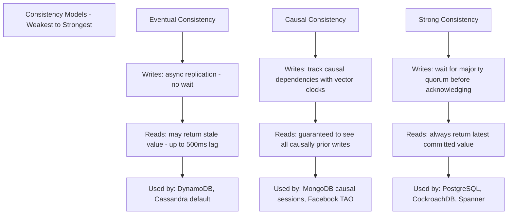

### Trade-off Table

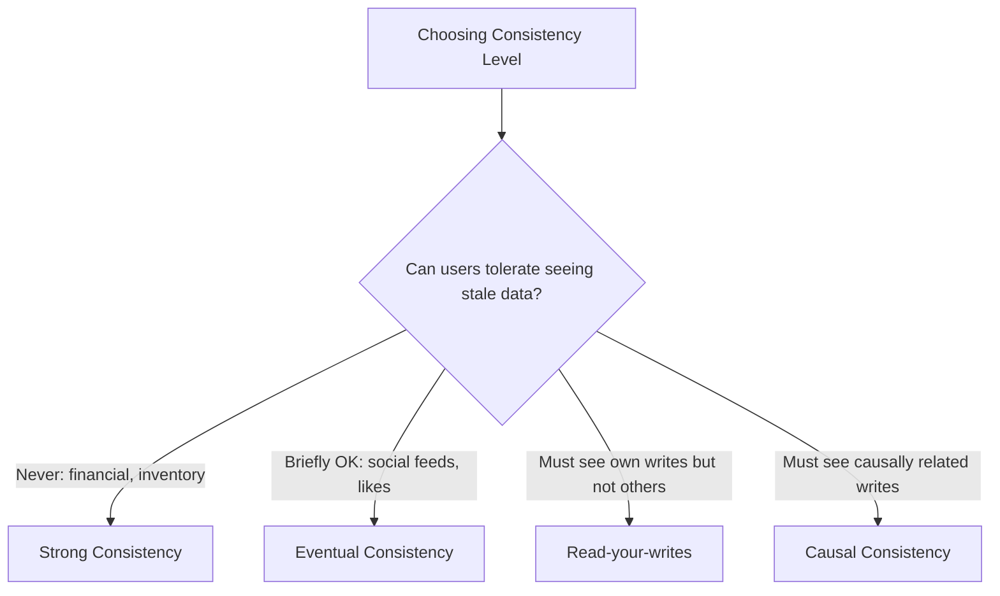

| Model | Read Latency | Write Latency | Stale Read Risk | System Examples |
|-------|-------------|---------------|-----------------|-----------------|
| Strong | 5–200ms (regional) | 50–200ms (geo) | Zero | PostgreSQL, Spanner, CockroachDB |
| Causal | 5–30ms | 20–50ms | No (for causal chain) | MongoDB causal, Facebook TAO |
| Eventual | 1–5ms | 1–5ms | Yes (up to minutes) | DynamoDB, Cassandra, Redis replicas |

### Pitfalls
- ❌ **Assuming eventual consistency means "eventually correct":** Eventual consistency says replicas *converge* — it does NOT guarantee correctness if there are conflicting writes; last-write-wins may silently drop data
- ❌ **Choosing strong consistency for all use cases:** A social media "likes" counter doesn't need strong consistency — using eventual consistency saves 150ms per write at the cost of ±1 like lag, which is unnoticeable to users

### Concept Reference
→ [SQL vs NoSQL](../../../system-design/storage-and-databases/sql-vs-nosql)

---

## Q2: What does linearizability mean — why is it the gold standard for distributed consistency?

**Role:** Senior | **Difficulty:** 🔴 Senior | **Priority:** P0 | **Format:** Deep Dive

> **What the interviewer is testing:** Whether you understand linearizability precisely — not as a synonym for "strong consistency" but as the specific formal property that makes distributed systems behave like a single machine.

### Problem Constraints
| Dimension | Value |
|-----------|-------|
| Nodes | 3 replicas across 2 data centers |
| Network RTT between DCs | 80ms |
| Concurrent clients | 1,000 reads/writes per second |
| Consistency requirement | Every read returns the latest write, regardless of which replica serves it |

### What Linearizability Means

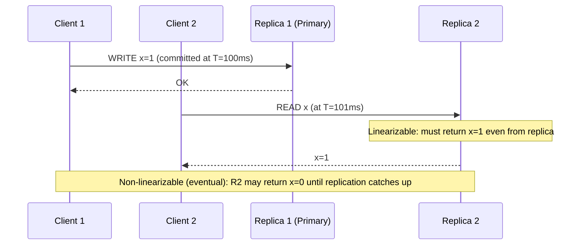

### Linearizability vs Sequential Consistency

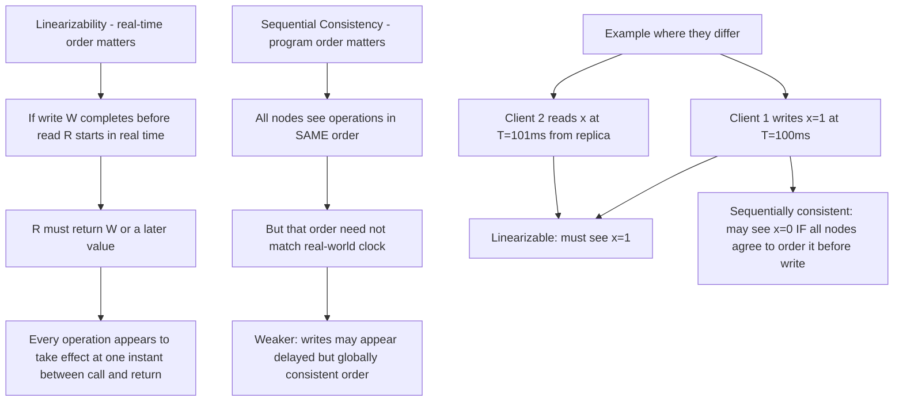

### Implementation Cost

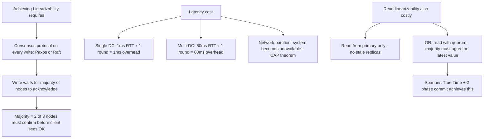

| Property | Linearizable | Sequential | Eventual |
|----------|-------------|------------|---------|
| Real-time ordering | Yes | No | No |
| Global order agreement | Yes | Yes | Eventually |
| Availability on partition | No (CAP) | No | Yes |
| Write latency | High (consensus) | Medium | Low |
| Real systems | etcd, Zookeeper, Spanner | Older distributed DBs | Cassandra, DynamoDB |

### What a great answer includes
- [ ] CAP theorem connection: linearizability = Consistency in CAP — you must sacrifice it or Availability during network partition
- [ ] Why etcd/Zookeeper use it: configuration, leader election, distributed locks require linearizability — a wrong leader election can destroy a cluster
- [ ] Spanner's True Time: Google's TrueTime API provides bounded clock uncertainty (±7ms) — Spanner uses commit-wait to ensure linearizability across globally distributed nodes
- [ ] Read path: linearizable reads must read from the primary or use quorum reads — stale replica reads violate linearizability

### Pitfalls
- ❌ **Equating linearizability with ACID:** ACID transactions can be non-linearizable; a database can be linearizable without full ACID — they are orthogonal properties (linearizability is about cross-client ordering; ACID is about transaction atomicity)
- ❌ **Implementing linearizable reads by reading from the primary without lease:** Primary may be a stale ex-primary after a leader election — use lease-based reads (Raft ReadIndex) to ensure you're reading from the actual current leader

### Concept Reference
→ [SQL vs NoSQL](../../../system-design/storage-and-databases/sql-vs-nosql)

---

## Q3: What is read-your-writes consistency and how does it affect caching strategies?

**Role:** Senior | **Difficulty:** 🔴 Senior | **Priority:** P1 | **Format:** Quick Answer

> **What the interviewer is testing:** Whether you understand the specific consistency guarantee users expect — you always see your own writes — and the cache invalidation challenge it creates.

### Answer in 60 seconds
- **Definition:** After a client performs a write, all subsequent reads by the SAME client return that write or a later value; other clients may still see the old value (eventual consistency for them)
- **Why it matters:** Users who submit a form and immediately reload the page must see their own submission — otherwise they assume the write failed and submit again (double write)
- **Implementation options:** (1) Route same user to same replica (sticky sessions); (2) piggyback write timestamp on response, reject reads from replicas lagging behind that timestamp; (3) always read from primary for 5 seconds after a write
- **Cache interaction:** If user writes to DB and cache serves stale data, read-your-writes is violated; fix with write-through cache or short TTL (500ms) after user's own writes

### Diagram

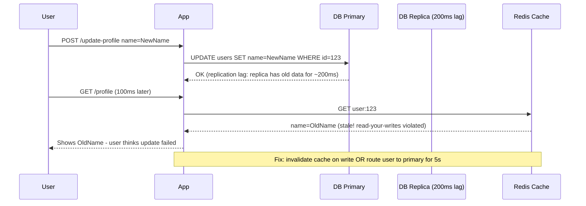

### Cache Strategy Fix

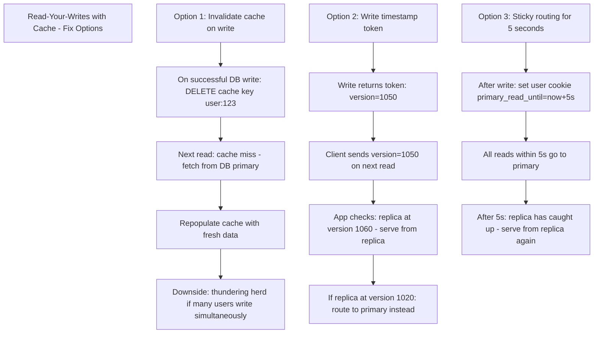

### Pitfalls
- ❌ **Using cache TTL of 60s after user writes:** A 60-second stale window means users see old data for a full minute after their own update — use 500ms or invalidate explicitly
- ❌ **Routing all reads to primary to guarantee read-your-writes:** This defeats the purpose of read replicas — 100% of read traffic hits the primary; use one of the targeted strategies above

### Concept Reference
→ [SQL vs NoSQL](../../../system-design/storage-and-databases/sql-vs-nosql)

---

## Q4: What is session consistency — how does DynamoDB implement it?

**Role:** Senior | **Difficulty:** 🔴 Senior | **Priority:** P1 | **Format:** Quick Answer

> **What the interviewer is testing:** Whether you understand session consistency as a practical middle ground between eventual and strong consistency and can explain DynamoDB's specific mechanism.

### Answer in 60 seconds
- **Session consistency:** Within a single client session, reads are guaranteed to reflect all writes made in that same session; across sessions (different users), eventual consistency applies
- **Stronger than eventual:** Eventual consistency allows any replica to serve reads; session consistency guarantees reads within a session see the same or newer state than the last write
- **DynamoDB implementation:** By default DynamoDB reads are eventually consistent (fastest/cheapest); to get session consistency use `ConsistentRead=true` on reads — DynamoDB routes read to the partition leader (primary) which has the latest committed write
- **Token approach:** DynamoDB Global Tables use a replication token — write returns a global version number; subsequent reads include this token to wait for replicas to catch up before serving
- **Cost:** Consistent reads cost 2x read capacity units vs eventually consistent reads; latency increases by ~5ms for cross-AZ coordination

### Diagram

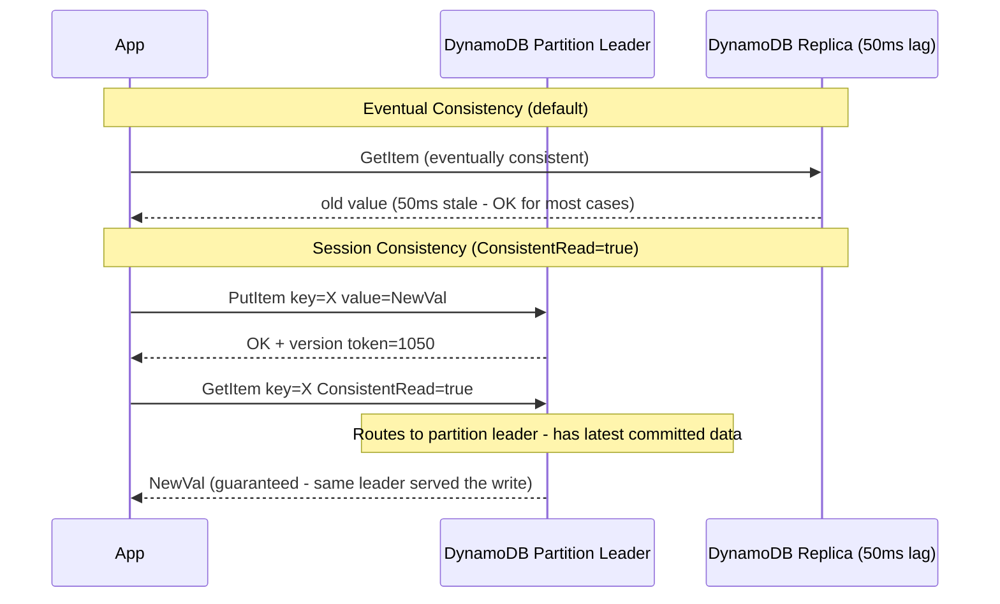

### DynamoDB Consistency Options Comparison

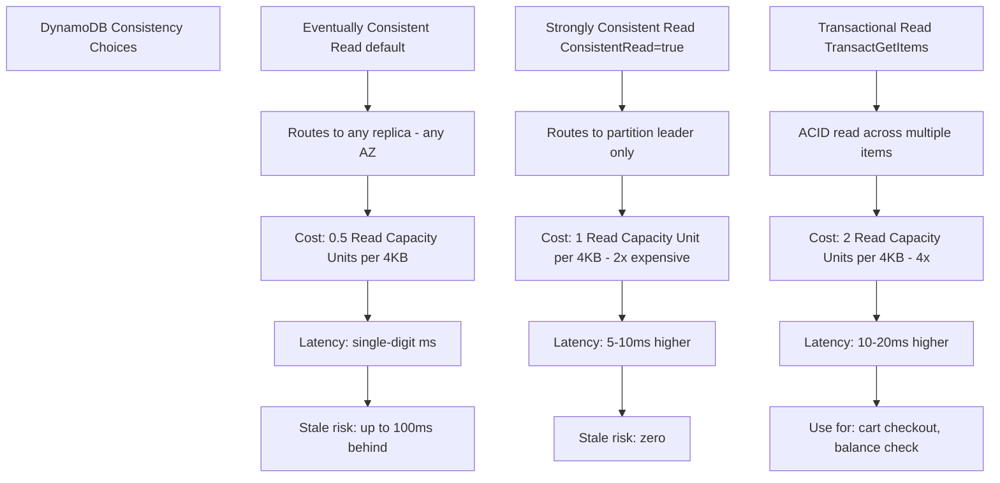

### Pitfalls
- ❌ **Using ConsistentRead=true everywhere to be safe:** 2x capacity cost on read-heavy tables doubles the bill; use consistent reads only where session consistency is required (e.g., right after a user write), not for analytics or search queries
- ❌ **Assuming DynamoDB Streams give session consistency:** DynamoDB Streams are eventually consistent; a consumer reading a stream may process events out of order relative to the write — use DynamoDB Transactions for true session consistency across multiple items

### Concept Reference
→ [SQL vs NoSQL](../../../system-design/storage-and-databases/sql-vs-nosql)

---

## Q5: How does CockroachDB achieve serializable isolation across geo-distributed nodes?

**Role:** Staff | **Difficulty:** ⚫ Staff | **Priority:** P1 | **Format:** Deep Dive

> **What the interviewer is testing:** Whether you understand how modern distributed databases achieve both ACID and geo-distribution using consensus protocols — not just that "it uses Raft."

### Problem Constraints
| Dimension | Value |
|-----------|-------|
| Nodes | 9 nodes across 3 regions: US-East, EU-West, APAC |
| Replication | 3 replicas per range (Raft consensus) |
| Isolation | Serializable (strictest) |
| Target write latency | p99 < 200ms cross-region |

### Architecture Overview

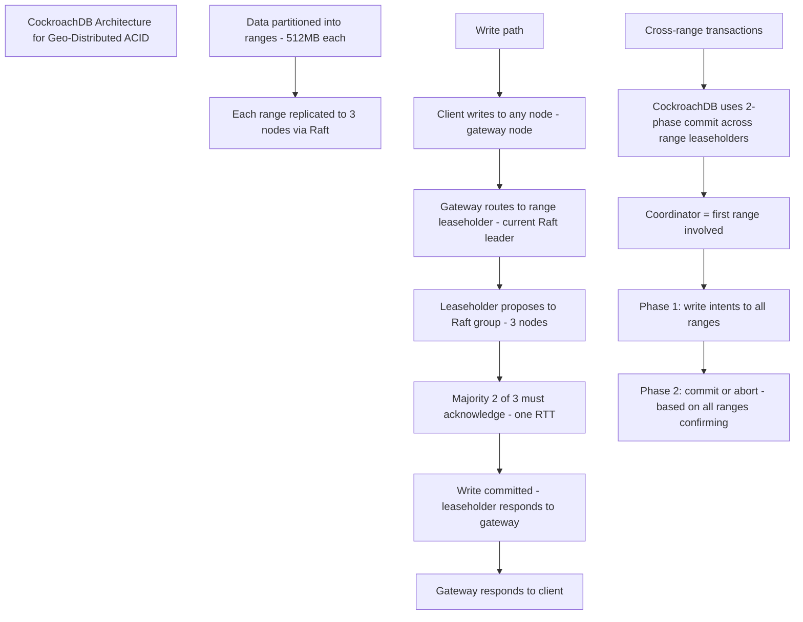

### Serializable Isolation via HLC

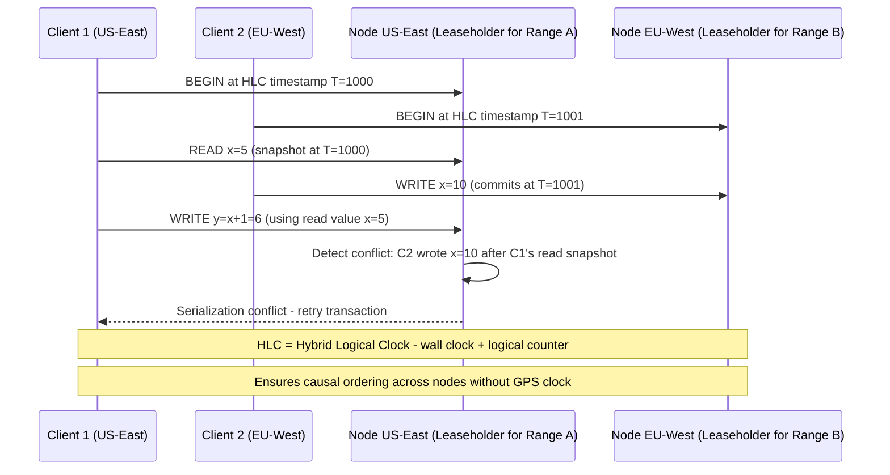

### Leaseholder and Raft

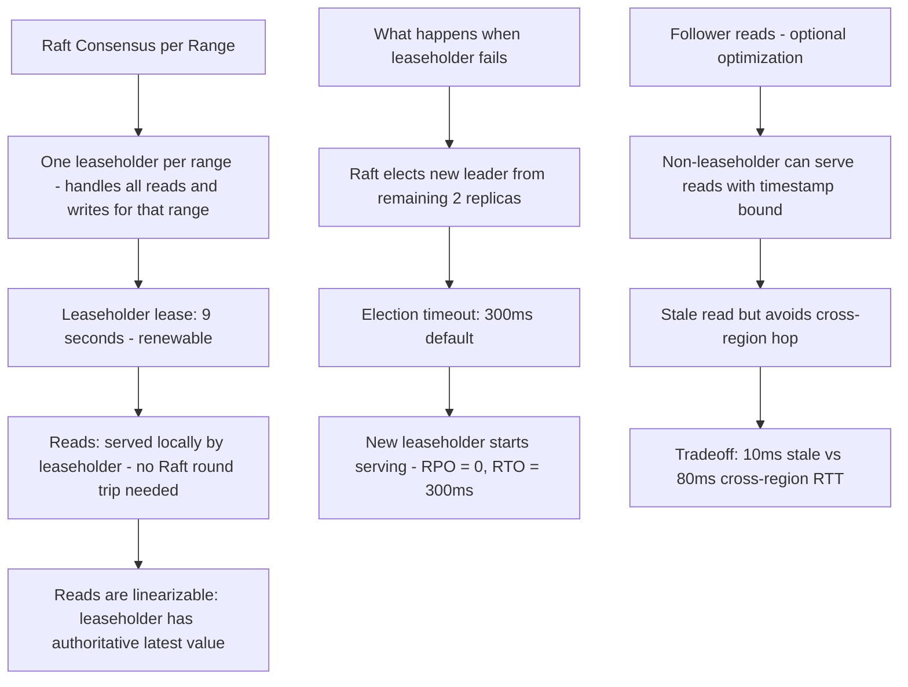

| Dimension | PostgreSQL | CockroachDB | Google Spanner |
|-----------|-----------|------------|----------------|
| Isolation | Serializable (SSI) | Serializable (HLC + SSI) | Serializable (TrueTime) |
| Distribution | Single-node or Citus | Native multi-region | Native global |
| Clock mechanism | System clock | Hybrid Logical Clock | GPS + atomic clocks (TrueTime) |
| Cross-region write latency | N/A (single node) | ~80–200ms | ~100–200ms |
| Automatic failover | Patroni/external | Built-in Raft | Built-in Paxos |

### What a great answer includes
- [ ] HLC (Hybrid Logical Clock): combines wall clock with logical counter — ensures causality without GPS; CockroachDB's alternative to Spanner's TrueTime
- [ ] Write intents: CockroachDB writes "intents" (provisional records) during 2PC; readers encountering an intent wait or push the conflicting transaction
- [ ] Leaseholder placement: you can configure leaseholder preference per region to minimize read latency (e.g., EU users' leaseholders prefer EU nodes)
- [ ] Follower reads: setting `AS OF SYSTEM TIME -10s` allows reads from any follower — trades 10 seconds staleness for avoiding cross-region hop

### Pitfalls
- ❌ **Assuming Raft alone gives serializable isolation:** Raft provides consensus for replication (durability + linearizability per range); serializable isolation across ranges requires the additional SSI (Serializable Snapshot Isolation) layer on top
- ❌ **Placing all leaseholders in one region for simplicity:** Majority of writes go cross-region for all other-region clients — co-locate leaseholders with the primary writer region; use multi-region table configuration for globally even traffic

### Concept Reference
→ [SQL vs NoSQL](../../../system-design/storage-and-databases/sql-vs-nosql)

---

## Q6: What is CRDT and how does it achieve eventual consistency without coordination?

**Role:** Staff | **Difficulty:** ⚫ Staff | **Priority:** P2 | **Format:** Deep Dive

> **What the interviewer is testing:** Whether you understand CRDTs as a mathematical solution to conflict-free merging — where convergence is guaranteed by data structure design, not coordination protocols.

### Problem Constraints
| Dimension | Value |
|-----------|-------|
| System | Collaborative document editor — Google Docs style |
| Nodes | 5 geo-distributed replicas |
| Requirement | All replicas converge to the same document state |
| Constraint | No coordination on writes — full availability |

### What Makes a CRDT

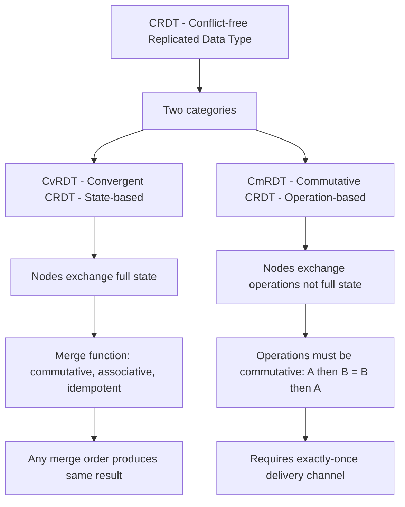

### CRDT Examples

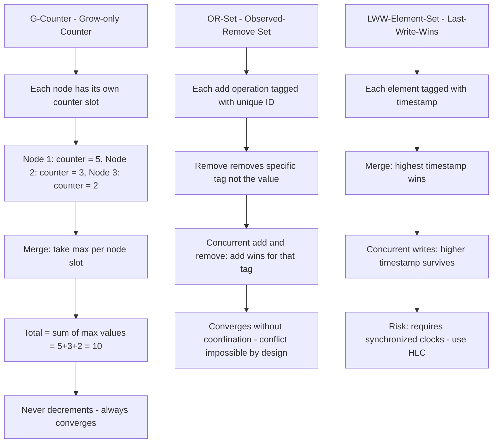

### Collaborative Editing with CRDT

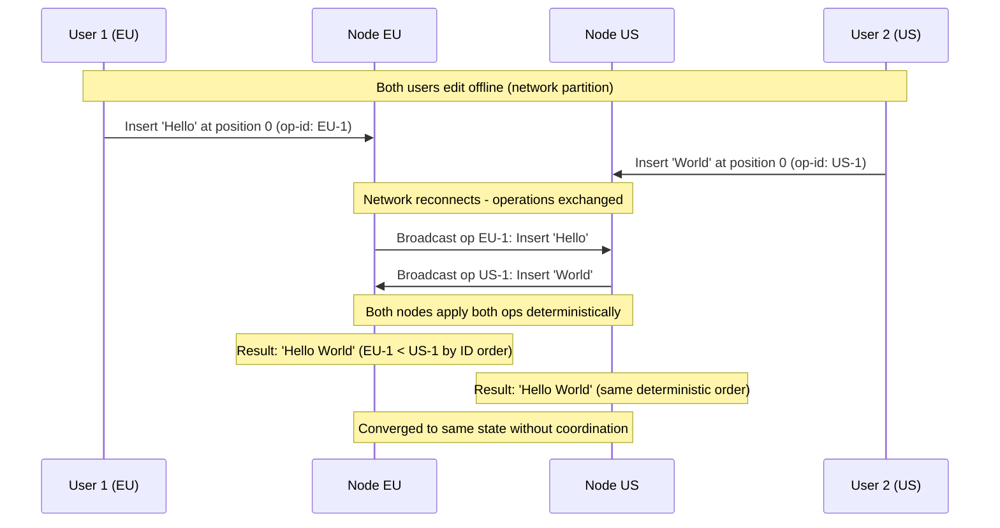

| CRDT Type | Use Case | Convergence Guarantee | Real Systems |
|-----------|----------|----------------------|--------------|
| G-Counter | View counts, analytics | Max-merge per node | Redis, Riak |
| PN-Counter | Inventory (add/remove) | G-Counter pairs | Riak, Cassandra counters |
| OR-Set | Shopping cart, tags | Unique-ID tagged ops | Amazon Dynamo |
| LWW-Register | User profile, settings | Last timestamp wins | Cassandra cells |
| RGA (Sequence) | Collaborative text | Unique position IDs | Google Docs, Figma |

### What a great answer includes
- [ ] Mathematical foundation: CRDTs form a join-semilattice — any merge order produces the same least-upper-bound result; this is the formal guarantee of convergence
- [ ] Trade-offs: CRDTs sacrifice rich semantics — a G-Counter can never decrement; OR-Set "add wins" over concurrent removes may surprise users who expect remove to be final
- [ ] Tombstones: OR-Set and sequence CRDTs accumulate tombstones for removed elements — garbage collection requires coordination (the only coordination in a CRDT system)
- [ ] Figma uses RGA (Replicated Growable Array) for collaborative vector editing — each shape insertion/deletion is a CRDT operation; no server round-trip needed for real-time collaboration

### Pitfalls
- ❌ **Choosing CRDTs for financial data:** CRDTs are eventually consistent by design — two concurrent withdrawals from the same account could both succeed; financial systems need strong consistency, not CRDTs
- ❌ **Ignoring tombstone accumulation:** An OR-Set CRDT that processes 1M add/remove operations over 6 months accumulates 1M tombstones — without garbage collection, memory grows unbounded; plan GC with a coordinator election phase

### Concept Reference
→ [SQL vs NoSQL](../../../system-design/storage-and-databases/sql-vs-nosql)
