# Database Migrations at Scale

10 questions covering zero-downtime schema changes, expand-contract pattern, online schema change tools, and managing migrations in microservices.

---

## Q1: How do you add a column to a 100M row table without downtime?

**Role:** Mid | **Difficulty:** 🟡 Mid | **Priority:** P0 | **Format:** Quick Answer

> **What the interviewer is testing:** Whether you know that `ALTER TABLE ADD COLUMN` takes an exclusive lock on large tables and can describe safe alternatives.

### Answer in 60 seconds
- **Naive approach:** `ALTER TABLE orders ADD COLUMN discount_pct DECIMAL` — takes an exclusive lock, blocking all reads and writes for minutes on a 100M row table
- **Safe approach (PostgreSQL 11+):** `ALTER TABLE orders ADD COLUMN discount_pct DECIMAL DEFAULT NULL` — adding a nullable column with no default is instant (no rewrite required in PG11+)
- **Safe approach with default (PostgreSQL 11+):** `ALTER TABLE orders ADD COLUMN discount_pct DECIMAL DEFAULT 0.0` — PG11+ stores the default in catalog, no table rewrite, instant
- **Older versions:** Use expand-contract: add nullable column → backfill in batches → add NOT NULL constraint with `NOT VALID` → `VALIDATE CONSTRAINT` separately

### Diagram

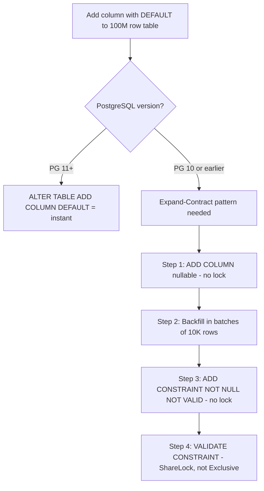

### Pitfalls
- ❌ **`ALTER TABLE ADD COLUMN NOT NULL` without default on large table:** Even in PG11+, adding NOT NULL without a default still rewrites the table to verify every row — use `NOT VALID` constraint pattern
- ❌ **Backfilling without batching:** `UPDATE orders SET discount_pct = 0` on 100M rows creates a 100M row transaction — holds locks, fills WAL, crashes replicas; always batch in 1K–10K row increments

### Concept Reference

---

## Q2: What is the expand-contract migration pattern?

**Role:** Senior | **Difficulty:** 🔴 Senior | **Priority:** P0 | **Format:** Deep Dive

> **What the interviewer is testing:** Whether you know the canonical 4-phase pattern for zero-downtime schema changes that require backward compatibility across multiple deploys.

### Problem Constraints
| Dimension | Value |
|-----------|-------|
| Goal | Rename column `user_name` → `username` |
| Table size | 50M rows |
| Deployment strategy | Blue-green, zero downtime |
| Rollback requirement | Must be able to roll back any deploy |

### Expand Phase (add new)

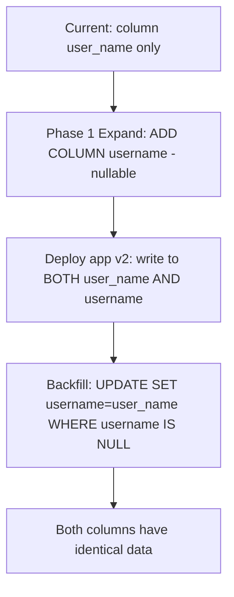

### Contract Phase (remove old)

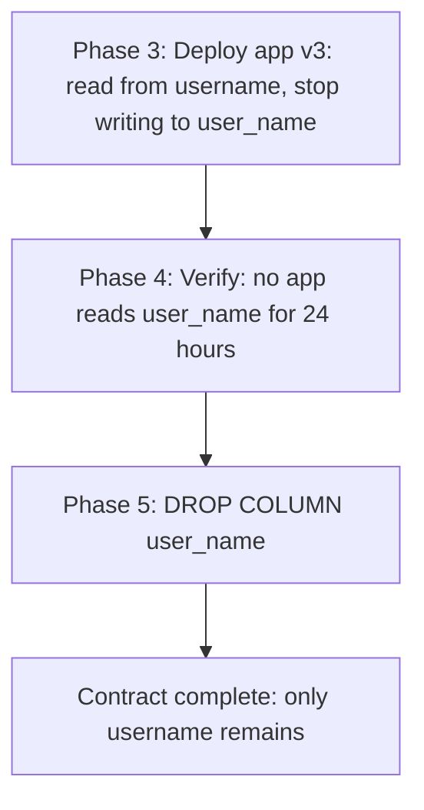

### Full Phase Timeline

| Phase | Schema | App Version | Duration |
|-------|--------|-------------|----------|
| 1. Add column | Both columns exist | v1 reads old, writes old | Minutes |
| 2. Backfill | Both columns identical | v1 reads old, writes old | Hours |
| 3. Migrate app | Both columns exist | v2 reads new, writes both | 1 deploy cycle |
| 4. Verify | Both columns exist | v2 confirmed working | 24–48 hours |
| 5. Drop old | New column only | v3 reads new only | Minutes |

### Recommended Answer
Expand-contract is the only safe pattern for column renames/type changes on live tables with zero downtime. It requires 2–3 deployment cycles spread over days. The key insight: the database schema must be backward compatible with N-1 app versions at all times (for rollback).

### What a great answer includes
- [ ] Dual-write period: both old and new columns written simultaneously for full backward/forward compat
- [ ] Backfill batching: 10K rows per batch with 100ms sleep between batches to limit DB load
- [ ] NOT VALID constraint trick: add NOT NULL constraint as NOT VALID first, then VALIDATE (avoids exclusive lock)
- [ ] Monitoring: confirm zero reads to old column before dropping (pg_stat_user_tables track_io_timing)

### Pitfalls
- ❌ **Skipping the dual-write phase:** If old app version is running during migration and only writes to old column, new column falls out of sync — must write to both
- ❌ **Dropping old column before verified:** A rollback after dropping old column requires the expand step again — keep old column for 2+ weeks after migration is confirmed

### Concept Reference

---

## Q3: How do you run a zero-downtime schema migration?

**Role:** Mid | **Difficulty:** 🟡 Mid | **Priority:** P1 | **Format:** Quick Answer

> **What the interviewer is testing:** Whether you can list the specific operations that are lock-free in PostgreSQL and those that require the expand-contract pattern.

### Answer in 60 seconds
- **Safe (lock-free) operations:** ADD COLUMN with nullable/default (PG11+), CREATE INDEX CONCURRENTLY, DROP INDEX CONCURRENTLY, ADD CONSTRAINT NOT VALID
- **Unsafe (exclusive lock) operations:** ADD COLUMN NOT NULL without default (pre-PG11), DROP COLUMN, RENAME COLUMN, ALTER COLUMN TYPE, ADD UNIQUE CONSTRAINT
- **Rule of thumb:** If an operation requires rewriting or validating existing rows, it takes an exclusive lock
- **Tool assistance:** `strong_migrations` Ruby gem / `django-zero-downtime-migrations` auto-detects unsafe operations and suggests safe alternatives

### Diagram

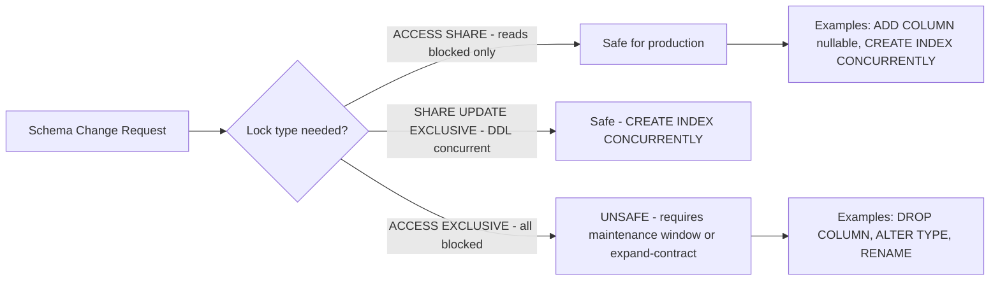

### Pitfalls
- ❌ **`CREATE INDEX` without CONCURRENTLY:** `CREATE INDEX` takes a ShareLock blocking all writes; `CREATE INDEX CONCURRENTLY` takes 3 passes with weaker locks — always use CONCURRENTLY in production
- ❌ **Running unsafe migrations from ORM auto-migration:** Django `makemigrations` or Rails `db:migrate` can generate `ALTER COLUMN TYPE` — always review generated SQL before running on production

### Concept Reference

---

## Q4: How does GitHub handle schema migrations on a 50TB database?

**Role:** Senior | **Difficulty:** 🔴 Senior | **Priority:** P1 | **Format:** Deep Dive

> **What the interviewer is testing:** Whether you can describe GitHub's gh-ost tool and the principles behind online schema change tools.

### Problem Constraints
| Dimension | Value |
|-----------|-------|
| Table size | 50TB, billions of rows |
| Write rate | 50K writes/sec |
| Acceptable lag increase | < 5 seconds replication lag |
| Migration duration | Hours to days |

### gh-ost Architecture

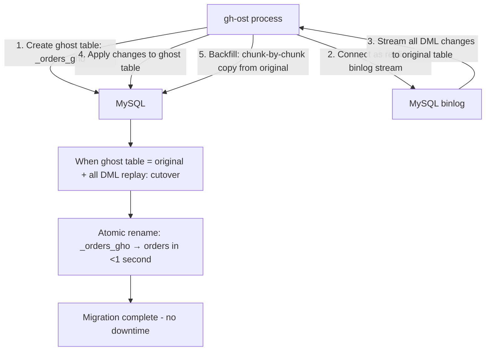

| Dimension | pt-online-schema-change | gh-ost |
|-----------|------------------------|--------|
| Mechanism | Triggers on original table | Binlog stream parsing |
| Trigger overhead | 10-30% write slowdown | Minimal |
| Throttling | Configurable | Fine-grained (lag-based) |
| Pause/resume | No | Yes |
| Test-on-replica | No | Yes |
| GitHub use | Legacy | Current standard |

### How gh-ost Avoids Table Locks

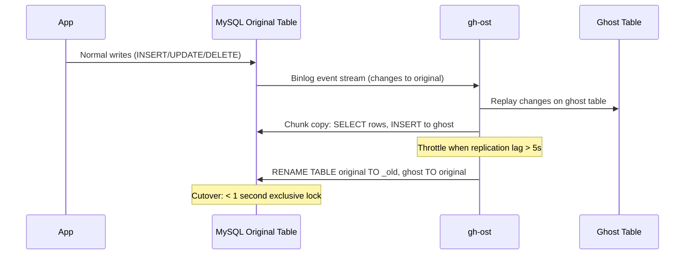

### Recommended Answer
gh-ost is the gold standard for large MySQL schema migrations. It uses binlog replication (not triggers) to maintain a ghost copy, enabling pause/resume, fine-grained throttling, and test-on-replica. The only exclusive lock is the final rename, which takes <1 second. GitHub migrates their 50TB production tables using gh-ost regularly.

### What a great answer includes
- [ ] Lag-based throttling: gh-ost pauses chunk copies when replica lag exceeds threshold, preventing migration from degrading replication
- [ ] Postpone flag: migration waits at cutover point until operator manually approves — useful for peak traffic avoidance
- [ ] Test-on-replica: run full migration on a replica first to estimate duration and impact
- [ ] Binary log position tracking: gh-ost never misses a change even when paused

### Pitfalls
- ❌ **Using ALTER TABLE directly on 50TB table:** Even a simple nullable column add pre-PG11 or any column change in MySQL requires a full table rebuild — hours of exclusive lock
- ❌ **Not testing chunk size:** Default chunk size 1000 rows; on a 50TB table at 50K writes/sec, too-large chunks cause replication lag spikes — tune based on row size and write rate

### Concept Reference

---

## Q5: When would you use pt-online-schema-change vs gh-ost?

**Role:** Senior | **Difficulty:** 🔴 Senior | **Priority:** P1 | **Format:** Quick Answer

> **What the interviewer is testing:** Whether you know the specific limitations of each tool and can make an informed choice.

### Answer in 60 seconds
- **pt-online-schema-change (pt-osc):** Uses triggers on the original table to capture changes during migration; simpler to set up; adds 10–30% write overhead from trigger execution; cannot be paused
- **gh-ost:** Reads MySQL binlog as a replica to capture changes; no trigger overhead; supports pause/resume; requires binary log access; more complex setup
- **Choose pt-osc when:** Quick migration on a small/medium table, limited infrastructure access (can't connect as MySQL replica), team already familiar with Percona toolkit
- **Choose gh-ost when:** Large tables (>10GB), high write rate (>1K writes/sec), need pause/resume capability, want lag-based throttling, production-critical tables

### Diagram

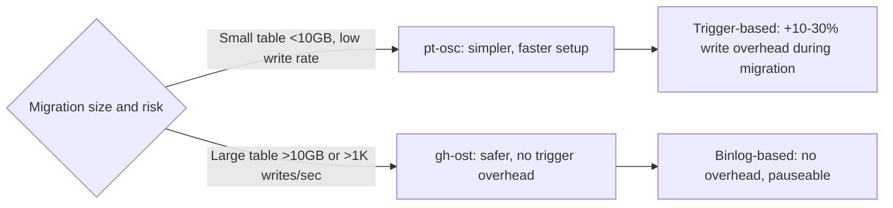

### Pitfalls
- ❌ **pt-osc on tables with very high write rates:** Triggers add latency to every write during migration — at 10K writes/sec, 30% overhead means 3K extra queries/sec processing triggers
- ❌ **gh-ost without binary log format = ROW:** gh-ost requires `binlog_format=ROW`; if set to STATEMENT, gh-ost cannot parse changes correctly

### Concept Reference

---

## Q6: How do you handle failed migrations in production?

**Role:** Senior | **Difficulty:** 🔴 Senior | **Priority:** P2 | **Format:** Quick Answer

> **What the interviewer is testing:** Whether you have a concrete rollback strategy and can explain why some migrations are harder to roll back than others.

### Answer in 60 seconds
- **Preventive:** Always run `BEGIN; migration SQL; ROLLBACK;` first in a test environment to verify SQL is valid before production
- **Forward-only migrations:** Some changes can't be rolled back (DROP TABLE, DROP COLUMN with data loss) — use expand-contract instead
- **Tooling rollback:** Flyway/Liquibase support `undo` migrations — write a matching undo script for every migration
- **Incident response:** If migration causes immediate production issues, apply undo migration; if partial migration is in progress (gh-ost running), terminate the process — ghost table is left behind and can be cleaned up manually

### Diagram

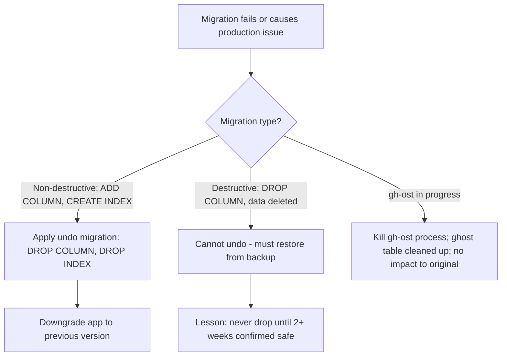

### Pitfalls
- ❌ **Running migrations without an undo script:** Every migration that goes to production should have a tested undo script — write it before the migration, not after the incident
- ❌ **Not versioning database state:** Without Flyway/Liquibase version tracking, you can't determine which migrations have been applied on which environment — use migration version numbering always

### Concept Reference

---

## Q7: How do you migrate 500M rows to a new table schema without downtime?

**Role:** Staff | **Difficulty:** ⚫ Staff | **Priority:** P2 | **Format:** Deep Dive

> **What the interviewer is testing:** Whether you can design a multi-phase live data migration for a fundamentally different schema (not just an additive column).

### Problem Constraints
| Dimension | Value |
|-----------|-------|
| Rows | 500M rows |
| Current schema | events(id, user_id, data JSON) |
| Target schema | events_v2(id, user_id, event_type, payload) — JSON split |
| Write rate | 5K writes/sec |
| Downtime budget | Zero |

### Migration Architecture

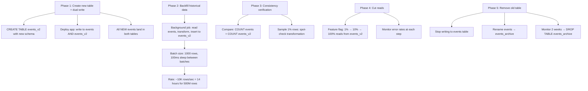

| Phase | Duration | Risk | Rollback |
|-------|----------|------|----------|
| 1. Dual write | 30 min | Low | Remove dual write |
| 2. Backfill | 14 hours | Medium (I/O) | Stop job, no harm |
| 3. Verify | 1 hour | Low | N/A |
| 4. Cut reads | 1 day | Medium | Flip feature flag |
| 5. Remove old | 2 weeks later | Very low | Restore from archive |

### Recommended Answer
Dual-write + incremental backfill is the only safe approach for 500M row migrations. Never attempt big-bang migrations. The backfill must be rate-limited (10K rows/sec max, with sleep between batches) to avoid I/O saturation. Consistency verification before cutting reads is mandatory.

### What a great answer includes
- [ ] Idempotent backfill: if the job crashes and restarts, use `INSERT INTO events_v2 ... ON CONFLICT (id) DO NOTHING` to avoid duplicates
- [ ] Backfill rate limiting: monitor primary DB CPU during backfill; reduce batch size if CPU > 70%
- [ ] Data transformation testing: test transform logic on 1M rows before starting full backfill
- [ ] Old table cleanup: keep as archive for 2+ weeks before dropping — critical for rollback

### Pitfalls
- ❌ **Backfilling from primary at full speed:** 500M inserts at max speed saturates IOPS, spikes WAL replication, delays replicas — always rate-limit with sleep between batches
- ❌ **Skipping consistency check:** Transformation bugs in backfill (wrong JSON parsing) go undetected until reads are cut — 1% sample verification catches 99% of logic errors

### Concept Reference

---

## Q8: How do you version database schemas in a microservices environment?

**Role:** Staff | **Difficulty:** ⚫ Staff | **Priority:** P2 | **Format:** Quick Answer

> **What the interviewer is testing:** Whether you know the standard patterns for schema version tracking and the challenges of coordinating migrations across independently deployed services.

### Answer in 60 seconds
- **Each service owns its schema:** Migrations for Service A's database are in Service A's repository — no shared migration repo
- **Version tracking:** Each database has a `schema_migrations` table; Flyway/Liquibase/golang-migrate records which version is applied; services check on startup
- **Forward-compatible migration rule:** A new service version's schema must be readable by the previous service version — enables blue-green deployments where old and new versions run simultaneously
- **Coordination challenge:** Service A's migration must land before Service A's new code; use init container or startup check: `wait for schema version V5 before starting pod`

### Diagram

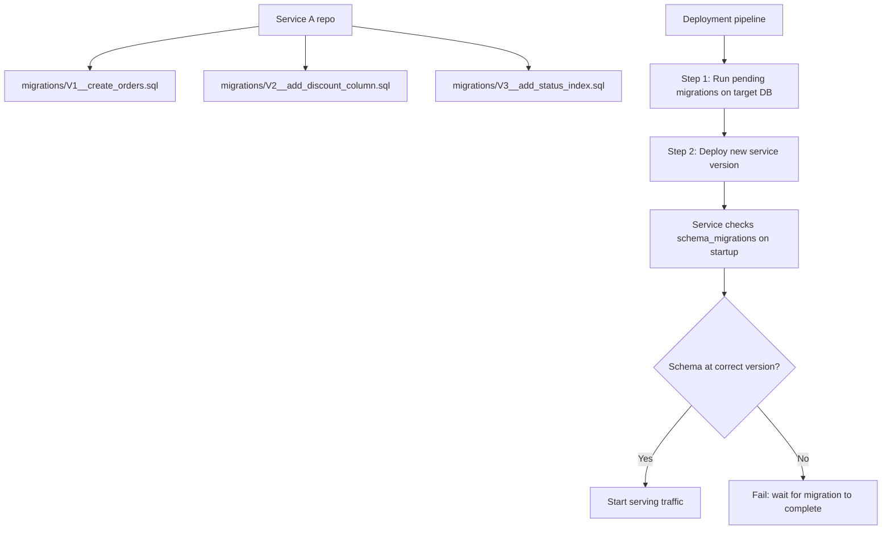

### Pitfalls
- ❌ **Shared migration database across services:** If Service A and B share one PostgreSQL schema, their migrations step on each other — each service must have its own database or schema namespace
- ❌ **Running migrations from application code at startup:** If 10 pods all start simultaneously, 10 processes try to run the same migration — use a leader election or init container to run migrations once

### Concept Reference

---

## Q9: How does Stripe manage schema evolution across hundreds of microservices?

**Role:** Staff | **Difficulty:** ⚫ Staff | **Priority:** P3 | **Format:** Quick Answer

> **What the interviewer is testing:** Whether you can reason about schema governance patterns at large company scale.

### Answer in 60 seconds
- **API contract first:** Stripe treats API request/response schemas as contracts — database schema changes must not break any existing API version, which can be active for years
- **Additive-only changes:** New columns and tables are additive; removals are never done until all API versions that reference the field are sunset (often 12–18 months)
- **Shadow writes:** New schema fields are written by both old and new code paths simultaneously during transition periods — Stripe has maintained some fields as "shadow columns" for years
- **Database schema registry:** Each service has a versioned schema definition; CI validates that no migration breaks backward compatibility (drops non-nullable columns, changes types)

### Diagram

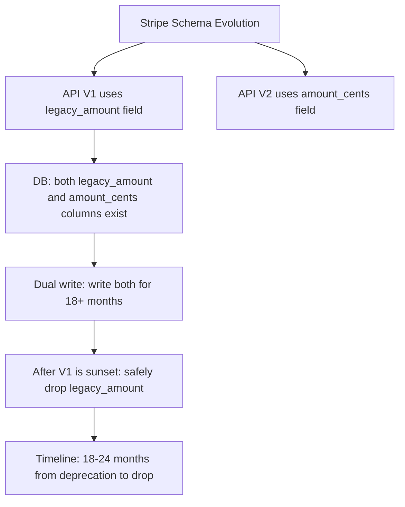

### Pitfalls
- ❌ **Deprecating columns without a sunset timeline:** Announcing deprecation without removing API version support means the column lives forever — set a firm end-of-life date for old API versions
- ❌ **Not automating backward-compat checking:** Manual review of every migration is error-prone at 100+ services — automated CI that validates schema changes against API contracts catches regressions

### Concept Reference

---

## Q10: Add a NOT NULL column with default to a 200M row live table — walk through your approach

**Role:** Senior | **Difficulty:** 🔴 Senior | **Priority:** P1 | **Format:** Scenario
**Real Company:** PostgreSQL-specific migration pattern used at Shopify, GitHub, GitLab

### The Brief
> "Product needs: add `is_archived BOOLEAN NOT NULL DEFAULT false` to the `orders` table with 200M rows. This table gets 5K writes/sec. Walk through exactly how you do this without taking the site down."

### Clarifying Questions to Ask First
1. What PostgreSQL version is running? (PG11+ changes the answer significantly)
2. Are there replicas, and what is current replication lag?
3. What is the deployment process — can you do 2 separate deployments?
4. Is there a maintenance window available as a fallback?

### Back-of-Envelope Estimation
| Metric | Value |
|--------|-------|
| Row size estimate | 200M × ~500 bytes = 100GB table |
| `ALTER TABLE` duration (naive) | 100GB table rewrite = 20–60 minutes |
| Lock duration (naive) | 20–60 minutes exclusive lock = site down |
| PG11+ approach | Catalog update only = <1 second |
| Backfill duration (if needed) | 200M rows at 50K/sec = 67 minutes |

### High-Level Architecture

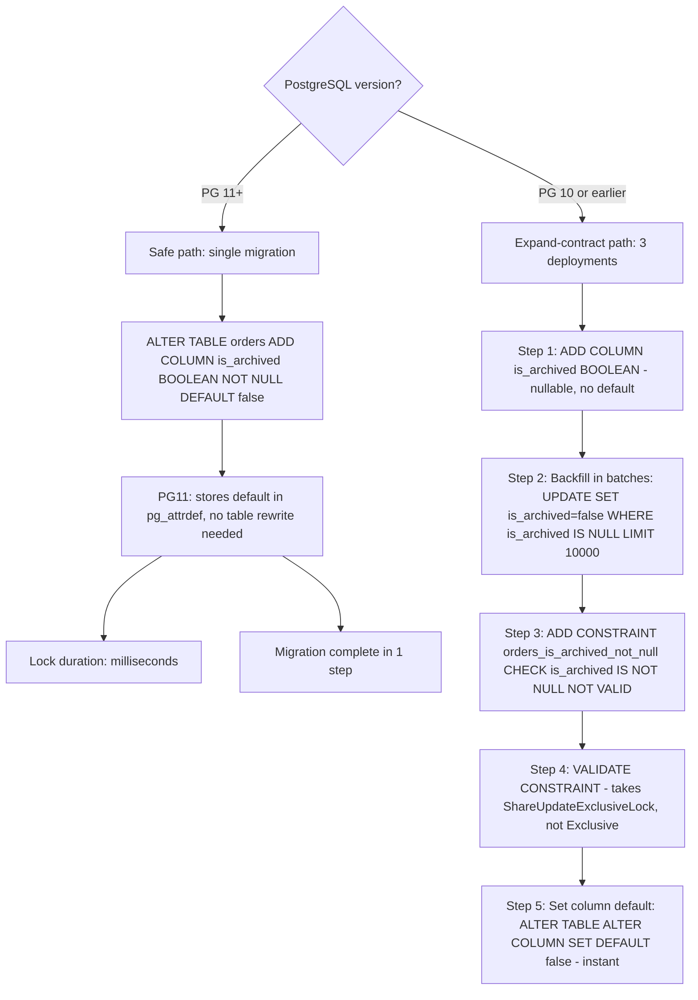

### Trade-off Decisions
| Decision | Option A | Option B | Chosen | Why |
|----------|----------|----------|--------|-----|
| PG11+ approach | Single ALTER | Expand-contract | Single ALTER | PG11 handles this natively and safely |
| PG10 backfill rate | Max speed | Rate-limited 10K/batch | Rate-limited | 5K writes/sec + unconstrained backfill = I/O saturation |
| NOT VALID constraint | Skip | Use it | Use it | Avoids full table scan with exclusive lock on constraint add |
| Replicas | Ignore lag | Monitor and throttle | Monitor | Backfill generates WAL; replicas may lag; throttle if lag > 10s |

### Failure Modes
| Failure | Impact | Mitigation |
|---------|--------|------------|
| Lock wait timeout during ALTER | Migration fails, retry needed | Set `lock_timeout='3s'` to fail fast rather than wait indefinitely |
| Backfill stalls midway | Partial migration state | Backfill is idempotent — restart from where it stopped |
| Replica lag grows during backfill | Reads from replicas 60s stale | Pause backfill when lag > 10s; resume when lag < 2s |

