# Database Replication Patterns

10 questions covering synchronous vs asynchronous replication, read replicas, binlog replication, leader election, and real-world replication challenges.

---

## Q1: What is the difference between synchronous and asynchronous replication?

**Role:** Mid | **Difficulty:** 🟡 Mid | **Priority:** P0 | **Format:** Quick Answer

> **What the interviewer is testing:** Whether you understand the fundamental durability-latency trade-off and can pick the right mode for a given consistency requirement.

### Answer in 60 seconds
- **Synchronous:** Primary waits for at least one replica to acknowledge the write before returning success — zero data loss on primary failure, but +1–5ms latency per write
- **Asynchronous:** Primary returns success immediately; replica applies changes later — minimal write latency impact, but up to seconds of data loss if primary fails before replication completes
- **Semi-synchronous (MySQL):** Primary waits for one replica to acknowledge receiving the binlog event, not applying it — balance between the two
- **Real numbers:** PostgreSQL synchronous_commit=on adds ~2ms RTT to each write; async replication adds 0ms but replication lag can reach 10–30 seconds under heavy write load

### Diagram

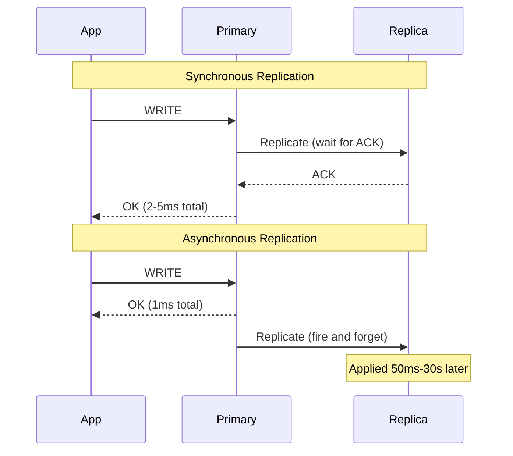

### Pitfalls
- ❌ **Using async replication for financial data:** If primary fails before replica catches up, committed transactions are lost — use synchronous for money, async for analytics
- ❌ **Forcing all replicas synchronous:** If 3 replicas are all synchronous, a single slow replica blocks every write — use "any 1 of N" semi-sync

### Concept Reference
→ [Database Replication](../../../system-design/storage-and-databases/database-replication)

---

## Q2: What is a read replica and when should you use it?

**Role:** Mid | **Difficulty:** 🟡 Mid | **Priority:** P0 | **Format:** Quick Answer

> **What the interviewer is testing:** Whether you understand read scaling and the consistency trade-offs of reading from replicas.

### Answer in 60 seconds
- **Definition:** A read-only copy of the primary database that receives changes via replication — queries that don't need fresh data are directed here
- **When to use:** Read:write ratio exceeds 4:1, primary CPU exceeds 60% during read-heavy periods, analytics queries interfere with transactional workloads
- **Typical configuration:** 1 primary + 2–3 replicas; primary handles writes + critical reads, replicas handle reports, dashboards, search indexing jobs
- **Latency numbers:** AWS RDS read replica replication lag is typically 20–100ms in the same region; 200–500ms cross-region

### Diagram

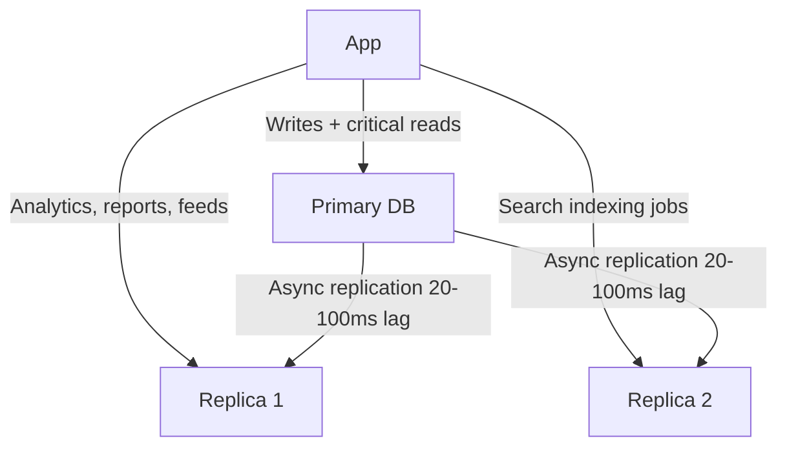

### Pitfalls
- ❌ **Reading user's own writes from replica:** After a user updates their profile, reading from a replica with 100ms lag shows stale data — route write-then-read to primary for 1–2 seconds (read-your-writes consistency)
- ❌ **Using replicas for transactions:** A replica that falls 10 seconds behind due to a large write means reads are 10 seconds stale — monitor replica lag as a key SLI

### Concept Reference
→ [Database Replication](../../../system-design/storage-and-databases/database-replication)

---

## Q3: How does MySQL binlog replication work and what are its failure modes?

**Role:** Senior | **Difficulty:** 🔴 Senior | **Priority:** P0 | **Format:** Deep Dive

> **What the interviewer is testing:** Whether you understand the internal mechanics of MySQL replication at the binary log level, enabling you to diagnose real replication failures.

### Problem Constraints
| Dimension | Value |
|-----------|-------|
| Write rate | 5,000 writes/sec |
| Replica count | 4 replicas |
| Acceptable lag | < 5 seconds |
| Binlog retention | 7 days |

### How Binlog Replication Works

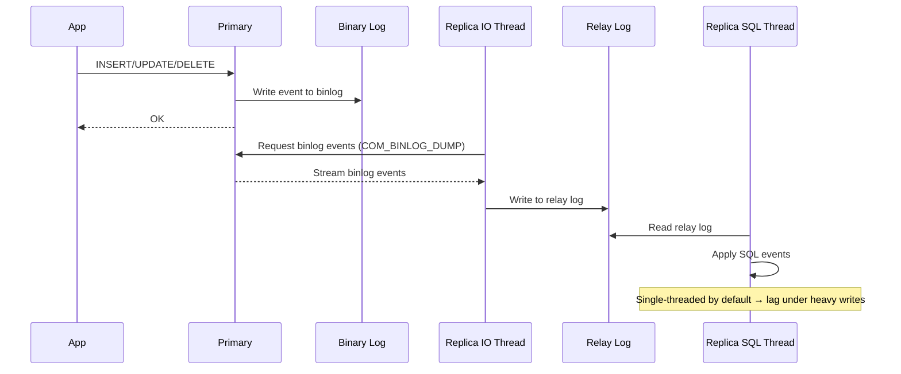

### Failure Modes

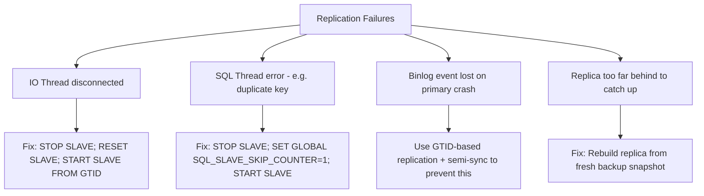

| Failure Mode | Cause | Detection | Fix |
|--------------|-------|-----------|-----|
| IO Thread stops | Network disconnect, primary restart | `SHOW SLAVE STATUS\G` → IO_Running: No | `START SLAVE;` |
| SQL Thread error | Schema mismatch, constraint violation | `Last_SQL_Error` not empty | Fix error, skip event, or rebuild |
| Replication lag growing | Single-threaded SQL thread bottleneck | `Seconds_Behind_Master` > threshold | Enable parallel replication (MySQL 5.7+) |
| Data divergence | SQL skip events, silent errors | `pt-table-checksum` mismatch | `pt-table-sync` to resync diverged tables |

### Recommended Answer
MySQL GTID replication (Global Transaction Identifiers) is the modern standard — enables automatic failover and replica re-pointing without manual binary log position tracking. Enable parallel replication (`slave_parallel_workers=8`) for high-write workloads to prevent SQL thread lag. Use `pt-table-checksum` weekly to detect silent data divergence.

### What a great answer includes
- [ ] GTID vs binlog position replication — GTID enables automatic failover tools like Orchestrator/Patroni
- [ ] Parallel replication configuration (by schema or by commit-group for better parallelism)
- [ ] Semi-synchronous replication to prevent data loss on primary crash
- [ ] Monitoring: `Seconds_Behind_Master`, relay log size, IO/SQL thread status

### Pitfalls
- ❌ **Skipping SQL errors in production:** `SET GLOBAL SQL_SLAVE_SKIP_COUNTER=1` to skip a duplicate key error leaves replica diverged — always investigate root cause
- ❌ **Not using GTID for new setups:** Manual binlog position tracking for failover is error-prone; GTID enables automated tools

### Concept Reference
→ [Database Replication](../../../system-design/storage-and-databases/database-replication)

---

## Q4: What is replication lag and how does it affect read-after-write consistency?

**Role:** Mid | **Difficulty:** 🟡 Mid | **Priority:** P1 | **Format:** Quick Answer

> **What the interviewer is testing:** Whether you can identify where replication lag creates user-visible inconsistency and design around it.

### Answer in 60 seconds
- **Definition:** Replication lag is the time difference between a write being committed on the primary and becoming visible on the replica — typically 20ms–30s depending on write rate and replica capacity
- **Read-after-write problem:** User updates their avatar → write goes to primary → read immediately routes to replica → replica shows old avatar → user thinks update failed
- **Solutions:** (1) Route read to primary for 1–2 seconds after a write using a sticky session token; (2) Track a replication position and wait for replica to reach it; (3) Use sync replication for this specific user
- **Measuring lag:** `SHOW SLAVE STATUS` → `Seconds_Behind_Master`; AWS CloudWatch `ReplicaLag` metric; alert at >5 seconds

### Diagram

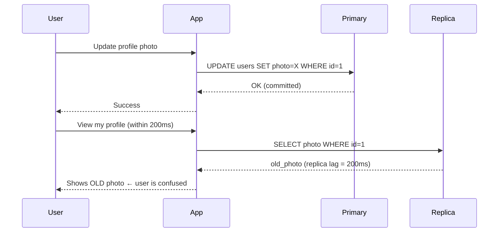

### Pitfalls
- ❌ **Always reading from primary to avoid lag:** This defeats the purpose of replicas — only route reads that require recency (user's own writes) to primary
- ❌ **Not monitoring replica lag:** Replication lag can silently grow during a write spike, serving stale data to thousands of users before anyone notices

### Concept Reference
→ [Database Replication](../../../system-design/storage-and-databases/database-replication)

---

## Q5: How do you implement leader election when the primary DB fails?

**Role:** Senior | **Difficulty:** 🔴 Senior | **Priority:** P1 | **Format:** Deep Dive

> **What the interviewer is testing:** Whether you understand the split-brain problem and can describe a safe leader election mechanism with concrete failover times.

### Problem Constraints
| Dimension | Value |
|-----------|-------|
| RTO target | < 30 seconds |
| RPO target | < 1 second |
| Replicas | 3 |
| Split-brain tolerance | Zero |

### Approach A — VIP Failover (simple, higher RTO)

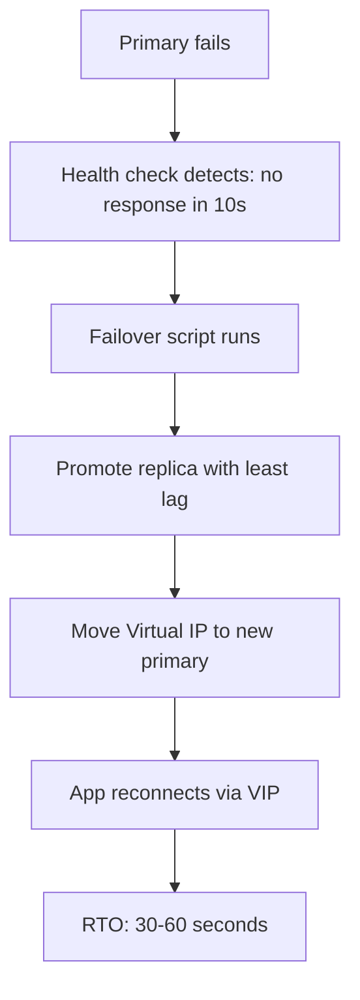

### Approach B — Patroni / Orchestrator (recommended)

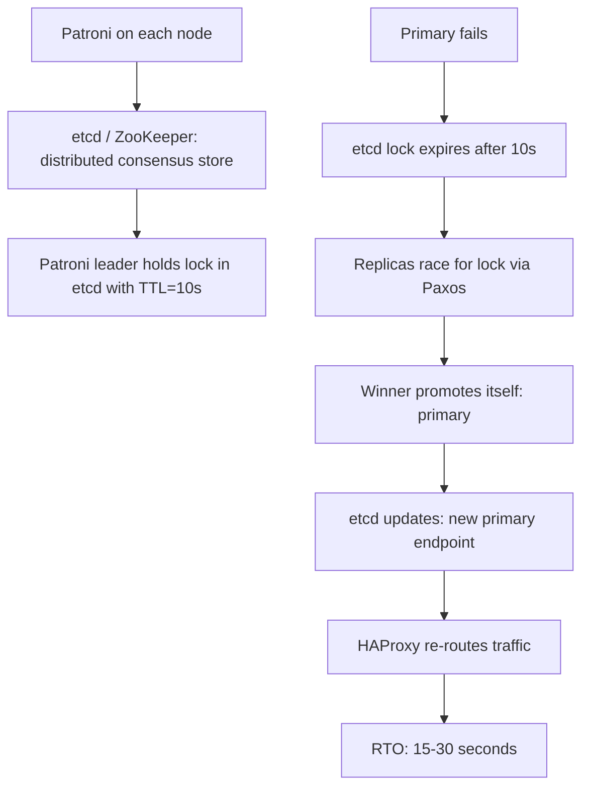

| Dimension | VIP Failover | Patroni |
|-----------|-------------|---------|
| RTO | 30–60s | 15–30s |
| RPO | Seconds (async) | <1s (sync replica) |
| Split-brain prevention | Weak (needs STONITH) | Strong (distributed lock) |
| Operational complexity | Low | Medium |
| Automation | Semi-manual | Fully automated |

### Recommended Answer
Use **Patroni with etcd** for PostgreSQL — etcd's Raft consensus prevents split-brain (two nodes both thinking they're primary). The TTL-based lock ensures the old primary automatically releases leadership after failure. Configure one synchronous replica for RPO=0; promote that replica first. AWS RDS Multi-AZ uses a similar managed approach with <60s failover.

### What a great answer includes
- [ ] Split-brain definition: two nodes both accepting writes simultaneously, creating diverged data
- [ ] STONITH (Shoot The Other Node In The Head): fencing mechanism that power-cycles the failed primary before promotion
- [ ] Patroni configuration: `synchronous_mode: true` ensures zero data loss failover
- [ ] Post-failover: old primary must be rebuilt as replica, not allowed to rejoin as primary

### Pitfalls
- ❌ **Promoting replica without fencing:** If primary isn't truly dead (just network-partitioned), you now have two primaries accepting writes
- ❌ **Promoting replica with highest lag:** Should promote the replica with least lag (or the designated synchronous replica) to minimize RPO

### Concept Reference
→ [Database Replication](../../../system-design/storage-and-databases/database-replication)

---

## Q6: What is multi-primary replication and when would you use it?

**Role:** Senior | **Difficulty:** 🔴 Senior | **Priority:** P1 | **Format:** Quick Answer

> **What the interviewer is testing:** Whether you understand the conflict resolution problem that makes multi-primary replication complex and rarely appropriate.

### Answer in 60 seconds
- **Definition:** Multiple database nodes each accepting writes simultaneously, with changes replicated to all other primaries — enables local writes in multiple regions
- **Use case:** Multi-region active-active deployment where write latency matters (e.g., users in US and EU must both write with <50ms latency)
- **The conflict problem:** Two users concurrently update the same row on different primaries — last-write-wins (by timestamp) can lose data; conflict resolution logic is application-specific
- **When to use:** Geographic distribution where each region writes mostly its own data (e.g., regional inventory systems); rarely appropriate for shared global data

### Diagram

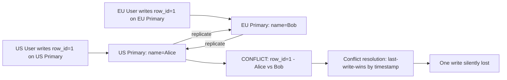

### Pitfalls
- ❌ **Multi-primary for a global user table:** Any user update can conflict with another region — last-write-wins causes silent data loss; use single-primary with regional read replicas instead
- ❌ **Underestimating operational complexity:** Conflict detection, resolution logic, and monitoring for split-brain make multi-primary 10x harder to operate than single-primary

### Concept Reference
→ [Database Replication](../../../system-design/storage-and-databases/database-replication)

---

## Q7: How does PostgreSQL streaming replication compare to logical replication?

**Role:** Senior | **Difficulty:** 🔴 Senior | **Priority:** P2 | **Format:** Deep Dive

> **What the interviewer is testing:** Whether you know both PostgreSQL replication modes and can select the appropriate one for version upgrades, selective replication, and CDC.

### Problem Constraints
| Dimension | Value |
|-----------|-------|
| Use case | Zero-downtime major version upgrade |
| Table count | 500 tables |
| Acceptable lag during cutover | < 1 second |

### Streaming Replication (Physical)

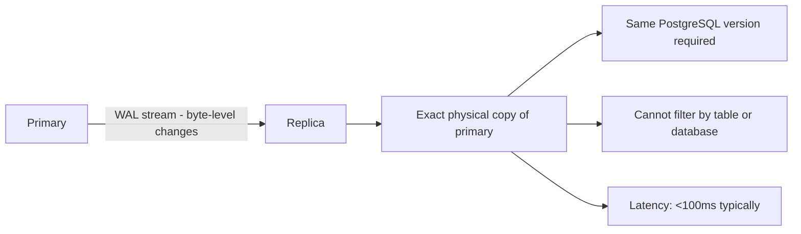

### Logical Replication

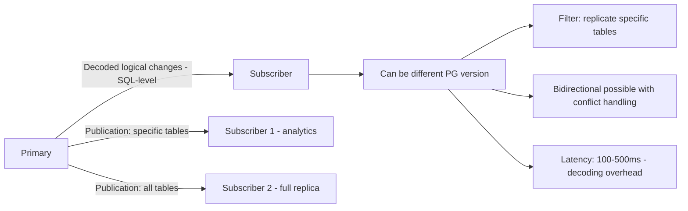

| Dimension | Streaming (Physical) | Logical |
|-----------|---------------------|---------|
| Cross-version | No (same version only) | Yes (PG 10+) |
| Selective tables | No (all or nothing) | Yes (per-table publication) |
| DDL replication | Yes (automatic) | No (DDL must be run manually) |
| Latency | <100ms | 100–500ms |
| Setup complexity | Low | Medium |
| Use case | HA standby, read replicas | Version upgrade, CDC, selective sync |

### Recommended Answer
Use **streaming replication** for HA standbys and read replicas (simplest, lowest latency, automated failover). Use **logical replication** for major version upgrades (PG 14 → PG 16 without downtime: set up logical replica on new version, migrate traffic when caught up) and for selective data streaming to analytics systems.

### What a great answer includes
- [ ] Zero-downtime upgrade path using logical replication: old version publishes, new version subscribes
- [ ] Logical replication limitation: DDL changes (ALTER TABLE) don't replicate — must apply manually to subscriber
- [ ] Replication slot: prevents WAL cleanup until subscriber catches up — monitor slot lag to avoid disk fill
- [ ] pg_logical_emit_message for tracking custom events through the logical stream

### Pitfalls
- ❌ **Not monitoring replication slots:** An idle logical replication slot causes WAL accumulation on primary — disk fills, primary crashes
- ❌ **Using logical replication as HA standby:** Cannot promote logical subscriber as primary with zero data loss (no built-in failover tooling)

### Concept Reference
→ [Database Replication](../../../system-design/storage-and-databases/database-replication)

---

## Q8: How do you handle the phantom read problem in replicated databases?

**Role:** Staff | **Difficulty:** ⚫ Staff | **Priority:** P2 | **Format:** Quick Answer

> **What the interviewer is testing:** Whether you understand phantom reads as an isolation problem distinct from replication lag, and can identify their interaction with replicated databases.

### Answer in 60 seconds
- **Phantom read definition:** Within a single transaction, a second range query returns rows that weren't there in the first query because another concurrent transaction inserted rows — an isolation problem, not a replication problem
- **Replication interaction:** Reading from two different replicas within one "logical read" can return inconsistent snapshots — Replica A at T=100, Replica B at T=95; range query spanning both returns phantoms
- **Solution for replicas:** Use session pinning (pin a user session to one replica) or read from primary for transactions requiring range-query consistency
- **Isolation-level solution:** SERIALIZABLE isolation prevents phantom reads at the cost of 50–80% throughput reduction; REPEATABLE READ prevents them within a single connection

### Diagram

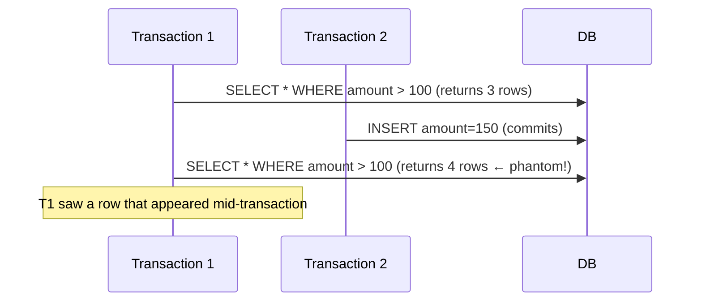

### Pitfalls
- ❌ **Confusing phantom reads with dirty reads:** Dirty reads are uncommitted data; phantom reads are committed data inserted by another transaction mid-read — different isolation levels fix each
- ❌ **Using SERIALIZABLE everywhere:** SERIALIZABLE isolation serializes all transactions — a 5x throughput reduction for a problem that affects <1% of queries

### Concept Reference
→ [Database Replication](../../../system-design/storage-and-databases/database-replication)

---

## Q9: How does CockroachDB achieve multi-region replication with <100ms latency?

**Role:** Staff | **Difficulty:** ⚫ Staff | **Priority:** P2 | **Format:** Quick Answer

> **What the interviewer is testing:** Whether you understand how CockroachDB's Raft consensus and follower reads achieve geo-distributed consistency without the typical latency penalty.

### Answer in 60 seconds
- **Raft consensus:** Each range (64MB data chunk) has a Raft group of 3–5 replicas across regions; writes require quorum (2/3 agree) — write latency = 1 cross-region RTT (~60–100ms US-EU)
- **Follower reads:** Reads can be served from the nearest replica at a timestamp slightly in the past (closed timestamp, typically 4.8 seconds behind) — read latency = local <5ms
- **Non-voting replicas:** CockroachDB v21+ supports non-voting replicas in additional regions for fast reads without increasing write quorum size
- **Leaseholder placement:** The Raft leaseholder (serves all reads and coordinates writes) can be pinned to a specific region using `ALTER TABLE ... CONFIGURE ZONE` to reduce write RTT for that region's users

### Diagram

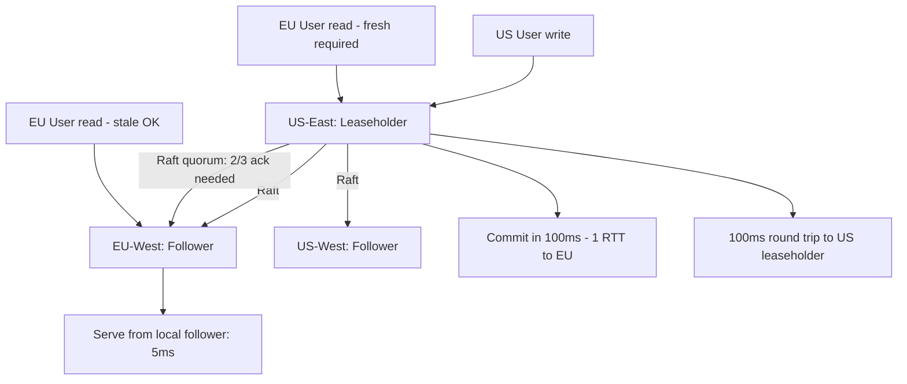

### Pitfalls
- ❌ **Expecting <10ms writes globally:** Cross-region writes in CockroachDB require Raft quorum across regions — speed of light physics applies; US-EU is 70ms minimum RTT
- ❌ **Not using follower reads for read-heavy workloads:** Default reads go to leaseholder; `AS OF SYSTEM TIME follower_read_timestamp()` enables local replica reads — 10x latency improvement for tolerable staleness

### Concept Reference
→ [Database Replication](../../../system-design/storage-and-databases/database-replication)

---

## Q10: Your read replicas are 30 seconds behind during peak traffic — diagnose and fix

**Role:** Senior | **Difficulty:** 🔴 Senior | **Priority:** P1 | **Format:** Scenario
**Real Company:** Modeled on common PostgreSQL/MySQL production incidents

### The Brief
> "It's 2pm on Black Friday. Your monitoring alerts: read replica lag has hit 30 seconds and is growing. Your e-commerce app reads product inventory and order status from replicas. Customers are seeing stale inventory and old order statuses. Walk me through your diagnosis and fix."

### Clarifying Questions to Ask First
1. Which database (MySQL or PostgreSQL) and what replication type (streaming, logical, binlog)?
2. What changed at peak traffic vs normal — write volume, query complexity, or both?
3. Is lag growing on all replicas or just one?
4. Is the replica's SQL thread running or stopped?

### Back-of-Envelope Estimation
| Metric | Normal | Current | Delta |
|--------|--------|---------|-------|
| Primary write rate | 1K TPS | 8K TPS (8x Black Friday) | +7K TPS |
| Replica SQL thread | Single-threaded: 2K TPS max | Same | Bottleneck found |
| Replica lag | 0.5s | 30s + growing | SQL thread saturated |
| Impact | 0 users affected | 30s stale inventory | Revenue risk |

### High-Level Architecture

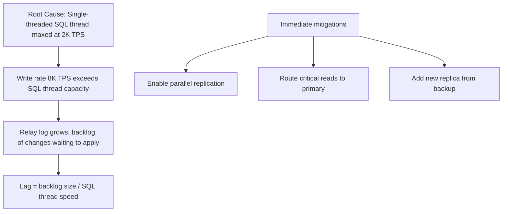

### Trade-off Decisions
| Decision | Option A | Option B | Chosen | Why |
|----------|----------|----------|--------|-----|
| Immediate fix | Enable parallel replication | Route reads to primary | Route reads to primary | Parallel replication takes 5 min to reconfigure; primary routing is instant |
| Permanent fix | Parallel replication | Larger replica instance | Both | Parallel first, then right-size |
| Inventory reads | Keep on replica | Move to primary | Move to primary | Stale inventory causes oversells — critical |
| Order status reads | Keep on replica | Move to primary | Keep on replica | 30s stale order status is tolerable |

### Failure Modes
| Failure | Impact | Mitigation |
|---------|--------|------------|
| Primary overloaded after re-routing reads | Primary CPU >90%, write latency spikes | Add connection pool limit; cache inventory in Redis |
| Parallel replication causes row-order conflicts | SQL thread error, replication stops | Use `slave_parallel_type=LOGICAL_CLOCK` (safer than DATABASE) |
| Replica never catches up (8K TPS > any single replica) | Permanent lag | Scale up replica instance; add more replicas behind load balancer |

### Concept References
→ [Database Replication](../../../system-design/storage-and-databases/database-replication)
→ [Caching Strategies](../../../system-design/fundamentals/caching-strategies)
