# Database Sharding Deep Dive

10 questions covering sharding strategies, hotspots, cross-shard queries, re-sharding, and real-world implementations.

---

## Q1: What is database sharding and when do you need it?

**Role:** Mid | **Difficulty:** 🟡 Mid | **Priority:** P0 | **Format:** Quick Answer

> **What the interviewer is testing:** Whether you understand sharding as a last resort after exhausting vertical scaling and read replicas, not a default choice.

### Answer in 60 seconds
- **Definition:** Splitting one logical database table into multiple physical databases (shards), each owning a subset of rows — e.g., users 1–10M on shard 1, 10M–20M on shard 2
- **When you need it:** Single-node write throughput exceeds ~10K TPS, table exceeds ~1TB (index stops fitting in RAM), or vertical scaling costs exceed horizontal scaling costs
- **Cost of sharding:** Cross-shard queries become expensive, foreign keys don't work across shards, transactions span multiple nodes requiring 2PC, operational complexity multiplies by shard count
- **Try first:** Read replicas handle read scale; connection pooling handles connection limits; vertical scaling (128-core, 4TB RAM machines exist) — exhaust these before sharding

### Diagram

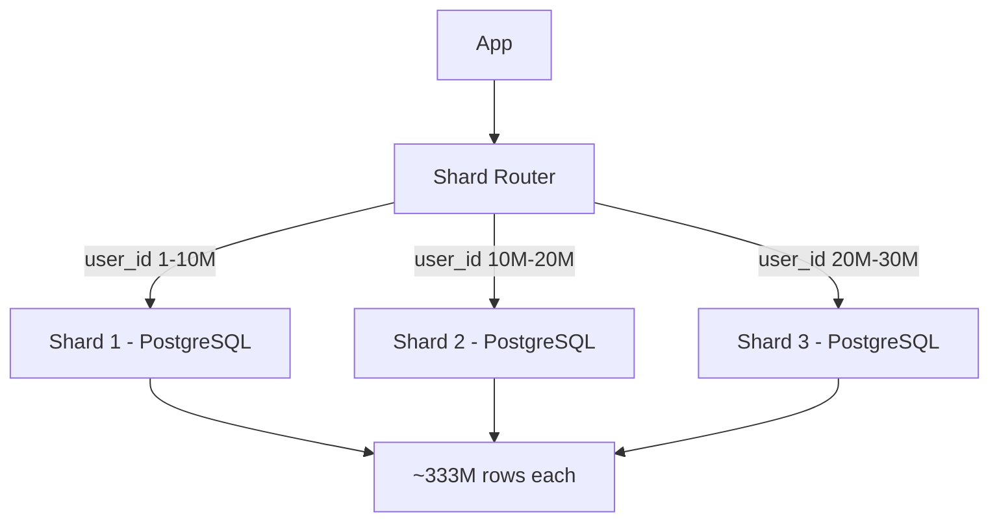

### Pitfalls
- ❌ **Sharding too early:** Airbnb ran on a single MySQL node for years; premature sharding adds months of engineering work for zero user benefit
- ❌ **Not defining a shard key first:** The shard key determines everything — cross-shard join frequency, hotspot risk, re-shard difficulty

### Concept Reference

---

## Q2: Compare sharding strategies: range vs hash vs directory-based

**Role:** Senior | **Difficulty:** 🔴 Senior | **Priority:** P0 | **Format:** Deep Dive

> **What the interviewer is testing:** Whether you can select the right sharding strategy for a given access pattern and articulate the trade-offs with specific failure scenarios.

### Problem Constraints
| Dimension | Value |
|-----------|-------|
| Data volume | 10B rows, 50TB |
| Write throughput | 100K writes/sec |
| Read pattern | Mostly by user_id; some by date range |
| Re-shard frequency | Ideally never |

### Approach A — Range-Based Sharding

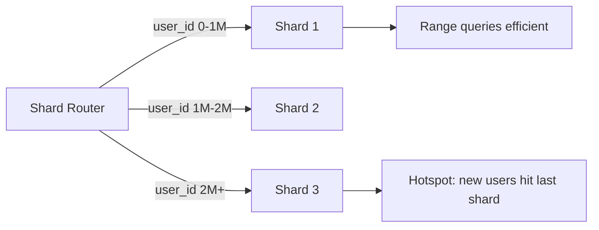

### Approach B — Hash-Based Sharding

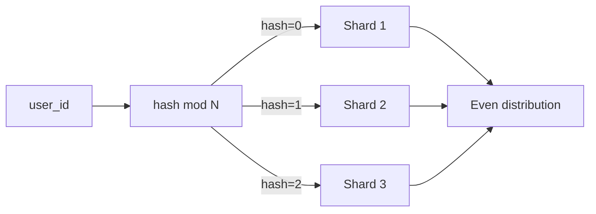

### Approach C — Directory-Based Sharding

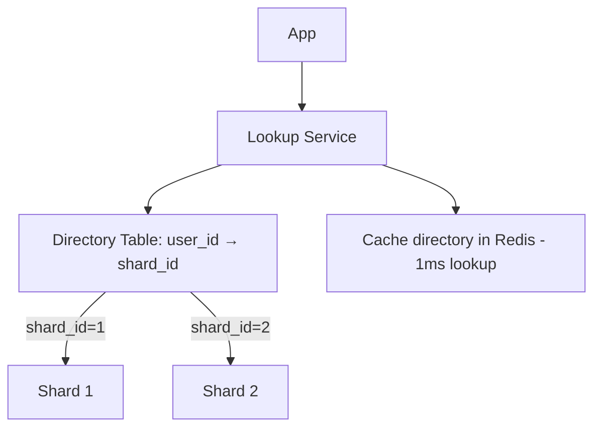

| Dimension | Range | Hash | Directory |
|-----------|-------|------|-----------|
| Distribution | Uneven (sequential writes hotspot) | Even | Configurable |
| Range queries | Efficient (same shard) | Scatter-gather | Configurable |
| Re-shard ease | Split range (easy) | Rehash all data (hard) | Move row, update directory |
| Hotspot risk | High (new data on last shard) | Low | Low |
| Lookup overhead | Zero | Zero | 1 extra lookup (~1ms with cache) |
| Flexibility | Low | Medium | High |

### Recommended Answer
**Hash-based** for uniform write workloads (user events, messages). **Range-based** for time-series data queried by time window. **Directory-based** when you need maximum flexibility to move data or when tenants map 1:1 to shards. Instagram uses hash sharding on user_id; Cassandra uses consistent hashing internally.

### What a great answer includes
- [ ] Hotspot analysis: range sharding on timestamp means all writes hit the latest shard
- [ ] Consistent hashing (Approach B variant) reduces re-shard impact from O(N) to O(1/N) of data moved
- [ ] Directory lookup caching strategy (Redis with 60s TTL, fallback to DB)
- [ ] Multi-shard reads for hash: 3 shards = 3 parallel queries + merge, p99 = max of 3 latencies

### Pitfalls
- ❌ **Range sharding on created_at for high-write tables:** Every new row goes to the last shard — 100% hotspot, rest idle
- ❌ **Hash sharding when range queries are frequent:** "Get all orders for user in last 30 days" hits all N shards if orders are hashed by order_id instead of user_id

### Concept Reference

---

## Q3: What is a hotspot shard and how do you prevent it?

**Role:** Mid | **Difficulty:** 🟡 Mid | **Priority:** P1 | **Format:** Quick Answer

> **What the interviewer is testing:** Whether you understand that bad shard key choice causes uneven load that defeats the purpose of sharding.

### Answer in 60 seconds
- **Definition:** A shard receiving disproportionate read/write traffic — e.g., celebrity user with 100M followers, or a timestamp-keyed table where all writes hit the latest shard
- **Detection:** Monitor per-shard CPU and IOPS — a hotspot shard runs at 90% CPU while others run at 10%
- **Prevention strategies:** Choose shard key with high cardinality and even distribution (user_id hash, not category_id); add a random suffix to the shard key for extreme cases (user_id + random 0-9 spreads writes to 10 shards)
- **Mitigation after the fact:** Use a directory-based lookup to manually move hot rows to a dedicated shard; add a read replica specifically for the hot shard

### Diagram

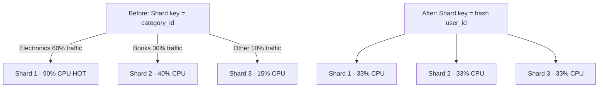

### Pitfalls
- ❌ **Using low-cardinality shard keys:** Sharding on country_code with only 195 possible values means many countries end up on the same shard — US alone would overload one shard
- ❌ **Ignoring read hotspots:** Read replicas help for read-heavy hot shards, but write hotspots require re-sharding or key redesign

### Concept Reference

---

## Q4: How do you handle cross-shard queries and joins?

**Role:** Senior | **Difficulty:** 🔴 Senior | **Priority:** P1 | **Format:** Deep Dive

> **What the interviewer is testing:** Whether you understand that cross-shard queries are the biggest operational cost of sharding and know patterns to avoid them.

### Problem Constraints
| Dimension | Value |
|-----------|-------|
| Shards | 16 shards |
| Cross-shard query latency | p99 < 200ms |
| Scatter-gather fan-out | 16 parallel queries |

### Approach A — Scatter-Gather

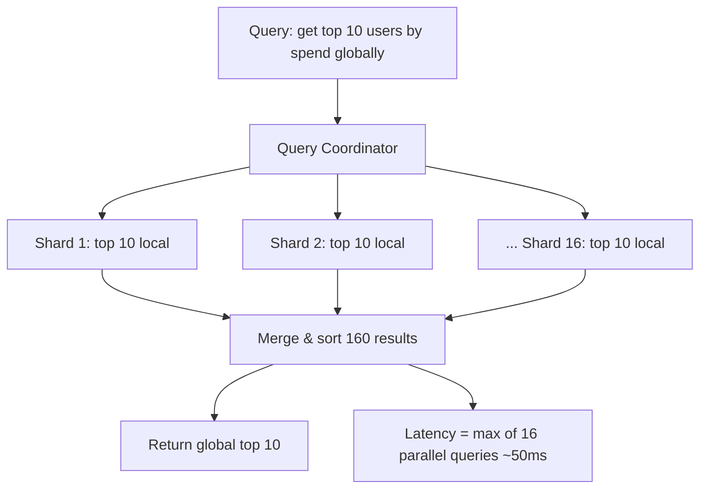

### Approach B — Denormalized Summary Table

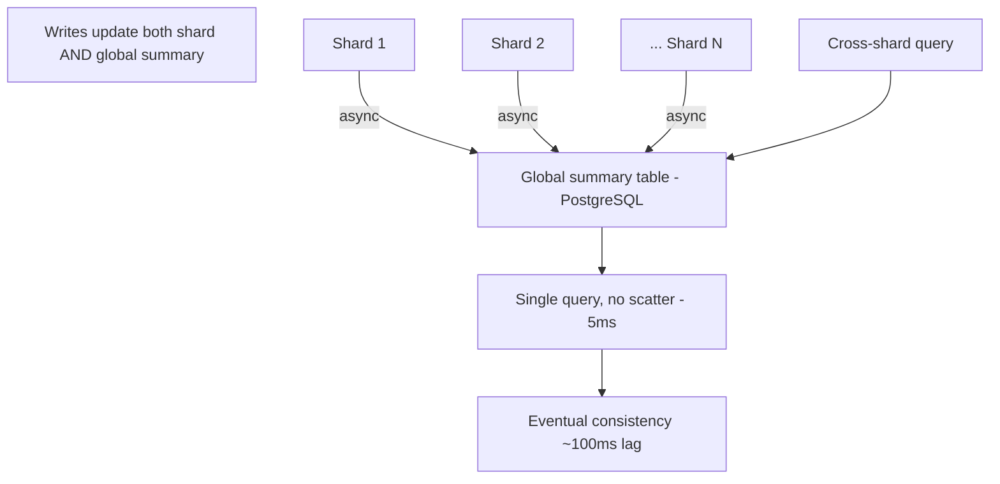

| Dimension | Scatter-Gather | Denormalized Summary |
|-----------|---------------|---------------------|
| Consistency | Strong | Eventual (100ms lag) |
| Query latency | 50–200ms | 5–10ms |
| Data duplication | None | Moderate |
| Write overhead | None | +1 async write |
| Query flexibility | Any ad-hoc query | Only pre-planned summaries |

### Recommended Answer
Design shard keys to **co-locate related data** — all of a user's data on the same shard eliminates cross-shard user queries entirely. For global aggregations (leaderboards, analytics), use a denormalized summary table updated asynchronously. Only use scatter-gather as a last resort for infrequent admin queries.

### What a great answer includes
- [ ] Co-location as primary defense (user_id as first component of all shard keys in that domain)
- [ ] Scatter-gather implementation detail: parallel fan-out, merge sort, timeout handling (reject if >3 shards timeout)
- [ ] Global secondary index alternative (DynamoDB GSI handles this at managed-service level)
- [ ] Materialized view / pre-aggregation for analytics queries

### Pitfalls
- ❌ **Scatter-gather for user-facing queries:** A product search across 16 shards at p99=200ms each means p99 total = 200ms but average degrades with any slow shard
- ❌ **Joining across shards in application layer:** Fetching 10K rows from shard A then 10K from shard B and joining in memory is an N+1 at scale — use co-location or denormalization

### Concept Reference

---

## Q5: How do you re-shard without downtime when a shard grows too large?

**Role:** Senior | **Difficulty:** 🔴 Senior | **Priority:** P1 | **Format:** Quick Answer

> **What the interviewer is testing:** Whether you have a concrete plan for the operational reality that shards grow and need splitting.

### Answer in 60 seconds
- **Trigger:** A shard exceeds ~500GB or its p99 write latency exceeds SLA — monitor shard size weekly
- **Process:** Use consistent hashing to split the shard; create shard 1A and 1B from shard 1; backfill 50% of rows to new shard while old shard still serves traffic
- **Zero-downtime technique:** Dual-write to both shards during migration; backfill historical data; use feature flag to cut reads to new shards; verify consistency; remove old shard
- **Pinterest approach:** They pre-split shards — allocate 4096 logical shards from day 1 mapped to 8 physical shards; re-shard by remapping logical-to-physical without moving data

### Diagram

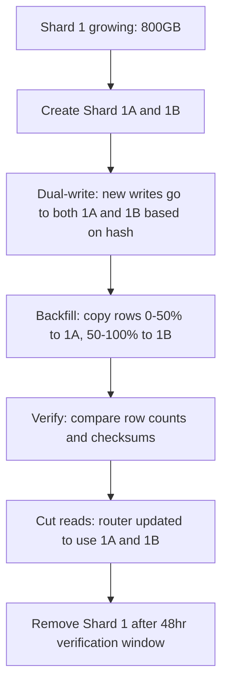

### Pitfalls
- ❌ **Re-sharding under load:** Running a backfill at full speed on a hot shard causes I/O contention — rate-limit the backfill to use <20% of shard I/O capacity
- ❌ **Not pre-allocating logical shards:** Physical re-sharding requires data movement; logical-to-physical remapping only updates a routing table — plan for this from day 1

### Concept Reference

---

## Q6: How does Instagram shard their PostgreSQL databases?

**Role:** Senior | **Difficulty:** 🔴 Senior | **Priority:** P2 | **Format:** Quick Answer

> **What the interviewer is testing:** Whether you can describe a real production sharding architecture with specific technical details.

### Answer in 60 seconds
- **Shard key:** user_id — all data for a user (photos, comments, likes, follows) lives on the same shard, enabling join-free user profile loads
- **Shard count:** Thousands of logical shards mapped to ~100 physical PostgreSQL instances; logical shards allow re-sharding by remapping without data movement
- **Routing layer:** A Python sharding library maps user_id to logical shard, then to physical host — <1ms overhead
- **Scale:** Instagram handled 1B+ users with this approach; each physical shard was a PostgreSQL primary + 1 replica
- **Reference:** Instagram Engineering Blog: "Sharding & IDs at Instagram" (2012) — still widely cited

### Diagram

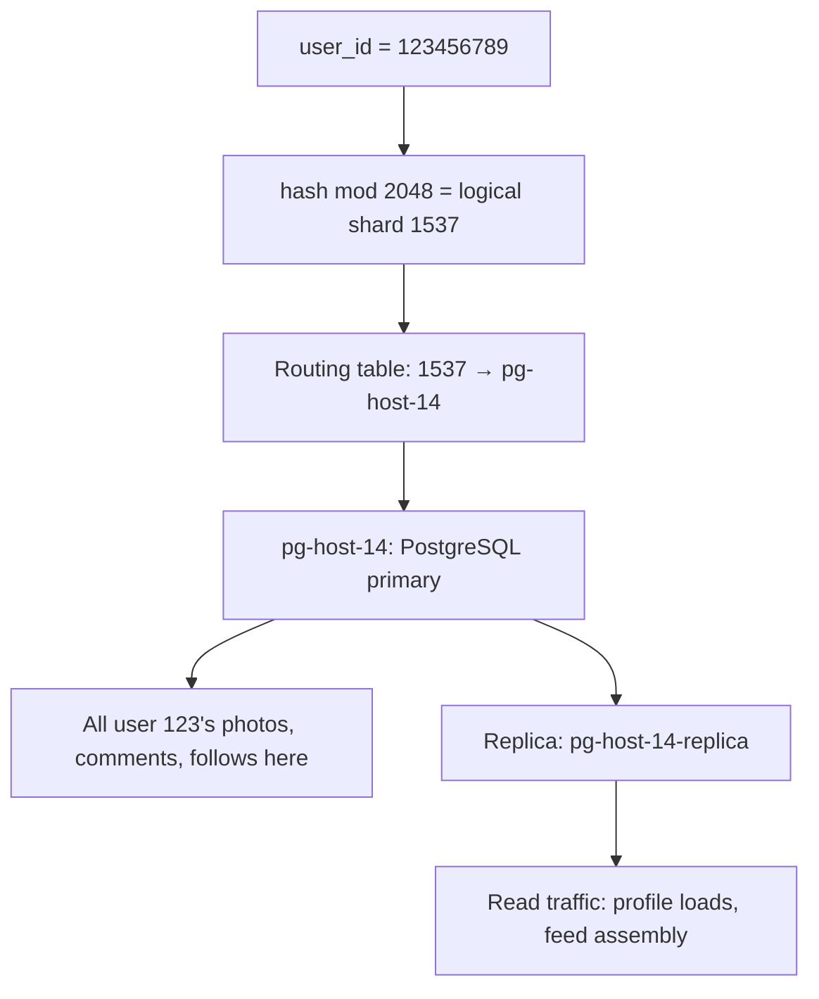

### Pitfalls
- ❌ **Sharding on media_id instead of user_id:** "Get all photos by user" would require scatter-gather across all shards — Instagram's choice ensures user data is co-located
- ❌ **Too few logical shards:** Instagram uses 2048 logical shards for 100 physical machines; if they used 100 logical shards, future splits require data movement

### Concept Reference

---

## Q7: How do you implement distributed transactions across shards?

**Role:** Staff | **Difficulty:** ⚫ Staff | **Priority:** P2 | **Format:** Deep Dive

> **What the interviewer is testing:** Whether you understand the cost of 2PC across shards and know when to use saga patterns instead.

### Problem Constraints
| Dimension | Value |
|-----------|-------|
| Shards involved | 2–4 per transaction |
| Transaction latency budget | p99 < 500ms |
| Failure rate target | <0.01% transactions lost |

### Approach A — Two-Phase Commit (2PC)

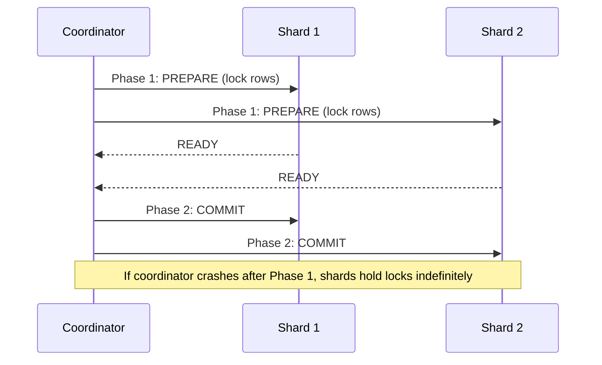

### Approach B — Saga Pattern (Compensating Transactions)

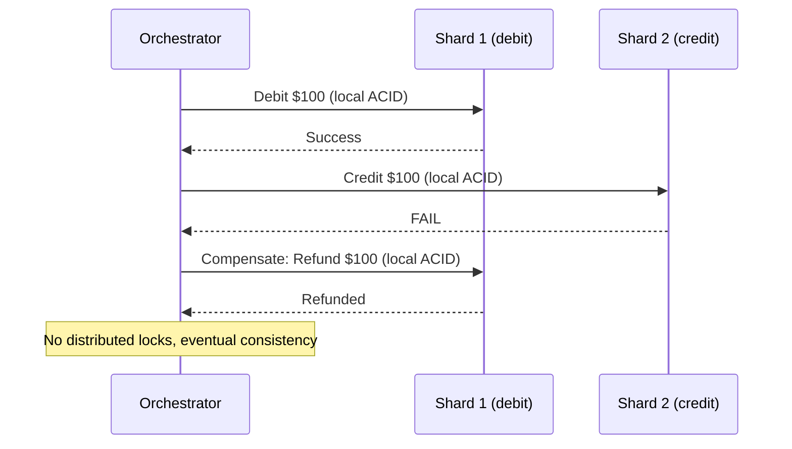

| Dimension | 2PC | Saga |
|-----------|-----|------|
| Consistency | Strong (ACID across shards) | Eventual |
| Availability | Low (blocks on coordinator failure) | High |
| Latency overhead | 2× RTT per shard | 1× RTT per step |
| Failure handling | Manual coordinator recovery | Compensating transactions |
| Use case | Financial ledger updates | Order fulfillment, multi-step workflows |

### Recommended Answer
Avoid distributed transactions across shards where possible — redesign data model to keep related data on same shard. When unavoidable, use **saga pattern** for long-running business processes (order fulfillment) and **2PC** only for strict financial atomicity with a clear coordinator recovery strategy. Google Spanner and CockroachDB implement distributed ACID without 2PC overhead using Paxos consensus.

### What a great answer includes
- [ ] Shard co-location as first defense (eliminates 80% of cross-shard transaction need)
- [ ] 2PC coordinator failure recovery: write-ahead log on coordinator, timeout + retry
- [ ] Saga compensating transaction idempotency (replay-safe with idempotency keys)
- [ ] Spanner/CockroachDB as managed alternatives that eliminate this problem

### Pitfalls
- ❌ **2PC without coordinator recovery plan:** If coordinator fails after Phase 1, shards hold locks until manually resolved — plan for this with WAL-based recovery
- ❌ **Saga without idempotent compensations:** If the compensation step is retried, double-refund is worse than the original failure

### Concept Reference

---

## Q8: What is consistent hashing's role in sharding?

**Role:** Staff | **Difficulty:** ⚫ Staff | **Priority:** P2 | **Format:** Quick Answer

> **What the interviewer is testing:** Whether you understand that consistent hashing minimizes data movement during re-sharding by assigning each key to the nearest shard on a ring.

### Answer in 60 seconds
- **Problem with simple hash mod N:** Adding a shard changes N, invalidating (N-1)/N of all key assignments — massive data movement
- **Consistent hashing solution:** Place shards on a virtual ring (0 to 2^32); each key maps to the nearest shard clockwise — adding a shard only reassigns ~1/N of keys
- **Virtual nodes:** Each physical shard has 100–150 virtual nodes on the ring; improves distribution evenness — Cassandra uses this for its token ring
- **Re-shard impact:** With 10 shards, adding 1 shard moves only 10% of data (vs 90% with simple modulo)

### Diagram

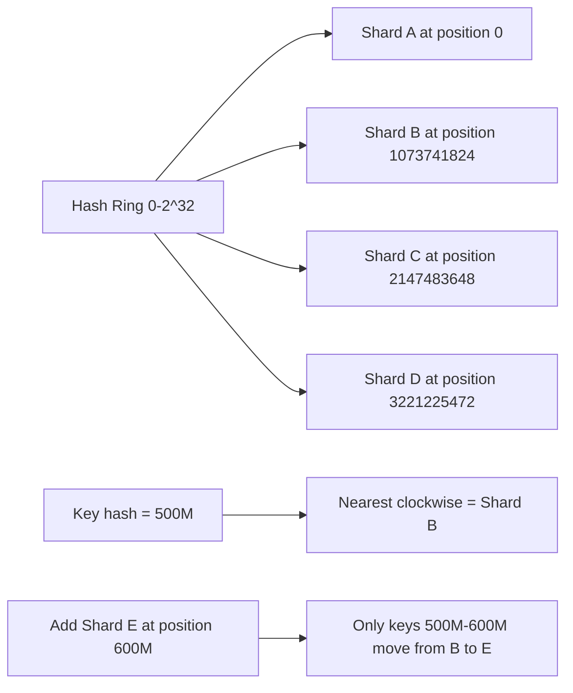

### Pitfalls
- ❌ **Too few virtual nodes:** With 1 virtual node per shard, distribution is uneven by design — use 100–150 virtual nodes per shard
- ❌ **Ignoring hot virtual nodes:** A virtual node handling a celebrity user's data still creates a hotspot — consistent hashing distributes shards, not traffic

### Concept Reference

---

## Q9: How does Vitess (YouTube's MySQL sharding layer) work?

**Role:** Staff | **Difficulty:** ⚫ Staff | **Priority:** P3 | **Format:** Quick Answer

> **What the interviewer is testing:** Whether you know production sharding middleware and can describe its architecture at a component level.

### Answer in 60 seconds
- **What it is:** Vitess is an open-source sharding middleware for MySQL that adds horizontal scaling, connection pooling, and query routing without changing application SQL
- **VTTablet:** A sidecar process per MySQL instance that manages connections and rewrites queries for sharded execution
- **VTGate:** A stateless proxy that receives app queries, parses SQL, determines target shards, and fans out queries
- **Shard routing:** Vitess uses a VSchema (virtual schema) that defines which columns are shard keys — queries filtered on shard key go to 1 shard; others fan out
- **Adoption:** YouTube, Slack, GitHub, Square use Vitess; PlanetScale is a managed Vitess service

### Diagram

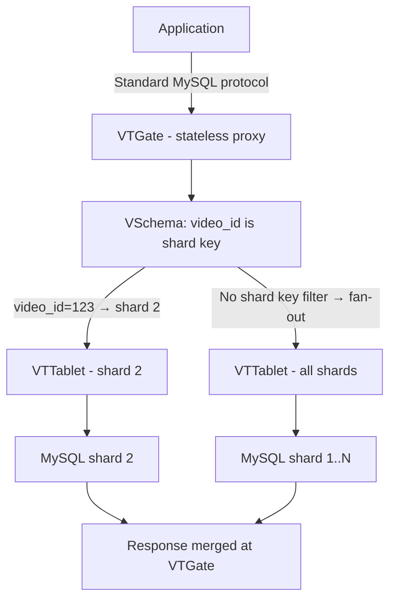

### Pitfalls
- ❌ **Expecting Vitess to make all queries fast:** Queries without shard key in WHERE clause still fan out to all shards — query optimization is still required
- ❌ **Ignoring VSchema design:** VSchema must match your access patterns — wrong shard key in VSchema is as bad as wrong shard key in native sharding

### Concept Reference

---

## Q10: Your single PostgreSQL table has 500M rows and reads are degrading — design a sharding strategy

**Role:** Senior | **Difficulty:** 🔴 Senior | **Priority:** P0 | **Format:** Scenario
**Real Company:** Modeled on Instagram, Pinterest, Shopify PostgreSQL sharding decisions

### The Brief
> "You're the lead engineer at a growing SaaS platform. Your primary `events` table has 500M rows, 1.2TB on disk. Read p99 has degraded from 20ms to 800ms over the past 3 months. The table has columns: event_id, user_id, tenant_id, event_type, created_at, payload (JSONB). What's your sharding strategy?"

### Clarifying Questions to Ask First
1. What is the primary read pattern — by user_id, tenant_id, or time range?
2. What is the current write rate and peak write TPS?
3. Is multi-tenant isolation required (can tenants share a shard)?
4. What is the acceptable downtime budget for migration?
5. Is the read degradation from index size or lock contention?

### Back-of-Envelope Estimation
| Metric | Calculation | Result |
|--------|-------------|--------|
| Row size | 1.2TB / 500M | ~2.4KB avg per row |
| Write rate | If 500M rows in 12 months | ~13 writes/sec avg |
| Index size | tenant_id + created_at index | ~50GB (doesn't fit in 32GB RAM) |
| Target shard size | 500GB max per shard | Need 3 shards minimum |
| 3-year projection | 500M rows/year × 3 | 1.5B rows → 12 shards needed |

### High-Level Architecture

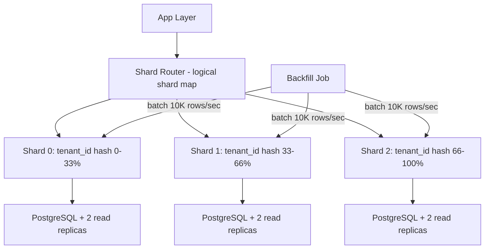

### Trade-off Decisions
| Decision | Option A | Option B | Chosen | Why |
|----------|----------|----------|--------|-----|
| Shard key | user_id | tenant_id | tenant_id | Tenant isolation; most queries filter by tenant |
| Strategy | Hash | Range | Hash | Even distribution; no sequential hotspot |
| Migration | Big bang | Dual-write + backfill | Dual-write | Zero downtime |
| Logical shards | 3 physical | 256 logical → 3 physical | 256 logical | Future-proof; remap without data move |
| Read replicas | 1 per shard | 2 per shard | 2 per shard | Read-heavy workload; 3:1 read/write ratio |

### Failure Modes
| Failure | Impact | Mitigation |
|---------|--------|------------|
| Shard router is SPOF | All reads fail | Deploy router as stateless cluster behind load balancer |
| Hot tenant on one shard | Shard CPU saturation | Directory-based routing; move hot tenant to dedicated shard |
| Backfill job crashes | Partial migration | Idempotent backfill with checkpoint; restart from last checkpoint |
| Shard 1 primary fails | 33% of writes fail | Automated failover to replica in <30s; use Patroni or RDS Multi-AZ |

