# Document Databases

10 questions covering document DB use cases, embedding vs referencing, ACID transactions, aggregation pipelines, sharding, and multi-region patterns.

---

## Q1: What is a document database and when to use MongoDB over PostgreSQL?

**Role:** Mid | **Difficulty:** 🟡 Mid | **Priority:** P0 | **Format:** Quick Answer

> **What the interviewer is testing:** Whether you can identify the document shape and access patterns that favor MongoDB, without defaulting to it for all NoSQL needs.

### Answer in 60 seconds
- **Document DB:** Stores data as JSON/BSON documents — each document is self-contained with nested fields, arrays, and sub-documents; no schema enforcement by default
- **MongoDB wins when:** Data is hierarchically structured (user profile with nested address, preferences, payment methods), schema varies per record (product catalog where electronics have different fields than books), reads are predominantly by document ID
- **PostgreSQL wins when:** Strong relational integrity required (FK constraints), ad-hoc queries across multiple entities, ACID transactions spanning multiple documents/collections
- **Scale threshold:** MongoDB handles 100K reads/sec on a 3-node replica set; with sharding, 1M+ reads/sec — comparable to PostgreSQL with replicas

### Diagram

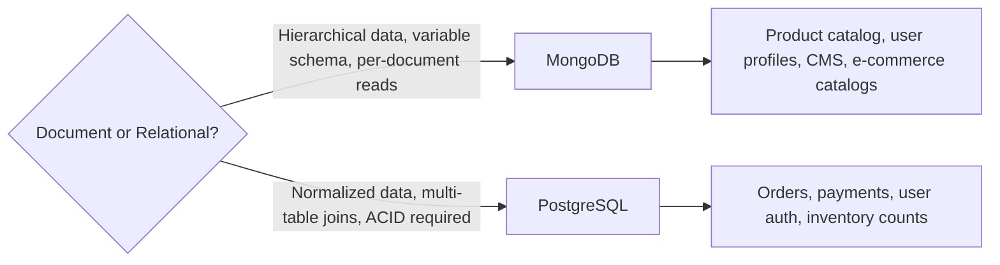

### Pitfalls
- ❌ **MongoDB for relational data:** Storing order items inside the order document then querying "all orders containing product X" requires scanning every order — no efficient join
- ❌ **Embedding unbounded arrays:** Storing all comments in a post document — MongoDB's 16MB document limit causes failures at ~50K comments per post

### Concept Reference

---

## Q2: How do you model one-to-many relationships in a document DB?

**Role:** Mid | **Difficulty:** 🟡 Mid | **Priority:** P1 | **Format:** Quick Answer

> **What the interviewer is testing:** Whether you understand the embed vs reference trade-off and can apply it based on read patterns and cardinality.

### Answer in 60 seconds
- **Embed (denormalize):** Put child documents inside the parent — e.g., store user's last 3 addresses embedded in the user document; fast reads (one lookup), but duplicates data and limits child count
- **Reference (normalize):** Store child IDs in the parent or parent ID in each child — like a SQL foreign key; requires multiple queries but handles unbounded children
- **Rule of thumb:** Embed when cardinality is bounded (<100 children) and children are always read with the parent; reference when children are queried independently or can grow unboundedly

### Diagram

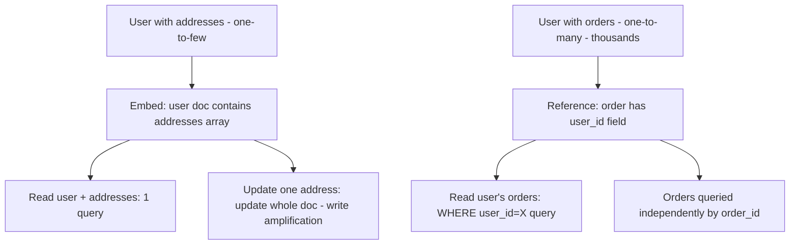

### Pitfalls
- ❌ **Embedding all orders inside user document:** A user with 10,000 orders hits MongoDB's 16MB document limit — always reference for unbounded one-to-many
- ❌ **Referencing everything like SQL:** MongoDB's strength is embedding; over-referencing creates N+1 queries (load user, then N separate loads for each reference)

### Concept Reference

---

## Q3: How does MongoDB handle ACID transactions in a distributed cluster?

**Role:** Senior | **Difficulty:** 🔴 Senior | **Priority:** P1 | **Format:** Deep Dive

> **What the interviewer is testing:** Whether you know MongoDB's multi-document transaction model (added in 4.0), its limitations, and when to use it vs single-document operations.

### Problem Constraints
| Dimension | Value |
|-----------|-------|
| Collections involved | 2 (orders + inventory) |
| Transaction type | Multi-document ACID |
| Write rate | 10K TPS |
| Latency budget | p99 < 100ms |

### Single-Document ACID (always available)

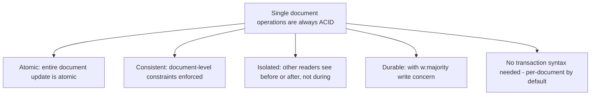

### Multi-Document Transactions (MongoDB 4.0+)

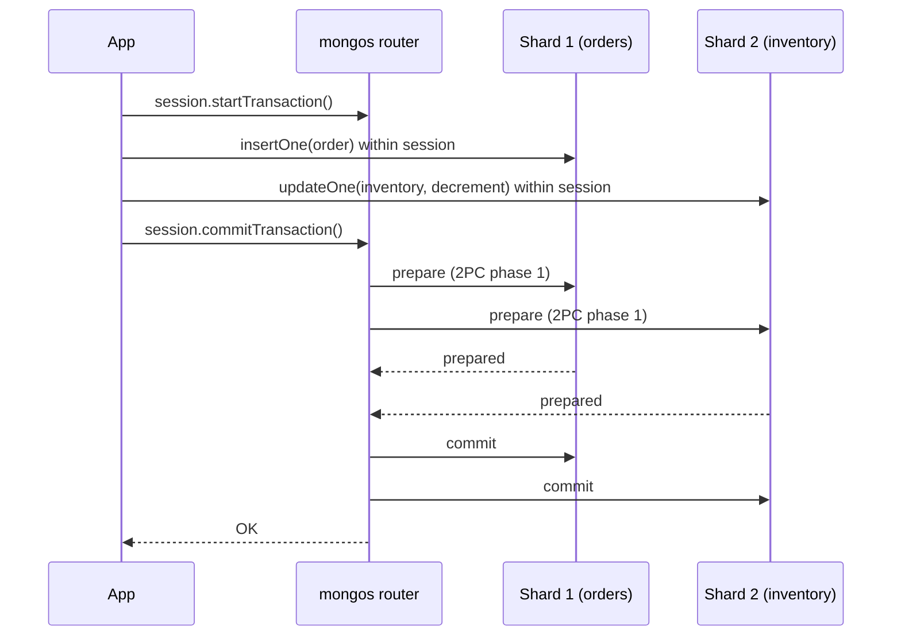

| Dimension | Single-Document | Multi-Document Transaction |
|-----------|----------------|---------------------------|
| ACID | Yes (always) | Yes (MongoDB 4.0+) |
| Performance overhead | None | 2–5x write cost |
| Cross-shard | N/A | Yes (2PC overhead) |
| Max transaction size | 16MB doc limit | 16MB total across all docs |
| Timeout | None | 60 seconds default |

### Recommended Answer
Design to avoid multi-document transactions whenever possible — restructure the document model to make the critical operation single-document atomic. When unavoidable (order + inventory deduction in separate collections), use MongoDB 4.0+ multi-document transactions with `w:majority` write concern. Transactions incur 2–5x write cost and a 16MB total size limit across all modified documents.

### What a great answer includes
- [ ] Single-document atomicity as the primary design target (no transaction overhead)
- [ ] w:majority write concern: transactions require this for durability guarantee
- [ ] Cross-shard transactions (MongoDB 4.2+): require mongos coordinator, use 2PC, higher latency
- [ ] 16MB limit applies to the total size of all documents modified in one transaction

### Pitfalls
- ❌ **Using multi-document transactions as default:** Every simple insert/update should not use transactions — the 2–5x overhead will kill throughput; transactions are for the exceptional cases
- ❌ **Transactions without session handling:** If session.commitTransaction() is never called (app crash), MongoDB auto-aborts after 60 seconds — design for transaction timeout recovery

### Concept Reference

---

## Q4: Embedding documents vs referencing — trade-offs?

**Role:** Senior | **Difficulty:** 🔴 Senior | **Priority:** P1 | **Format:** Quick Answer

> **What the interviewer is testing:** Whether you can apply the embedding vs referencing decision matrix based on cardinality, update frequency, and query patterns.

### Answer in 60 seconds
- **Embed for:** Data always read together (user + address), bounded cardinality (<100 children), child data rarely updated independently, snapshot semantics acceptable (embed historical order price, not live product price)
- **Reference for:** Unbounded cardinality (user → orders), data accessed and updated independently (product catalog referenced by many orders), shared data (multiple orders referencing same product)
- **Read cost:** Embedded = 1 query; Referenced = 1 + N queries for N relationships (N+1 problem) mitigated by `$lookup` (aggregation join) or application-level batch loading
- **Write cost:** Embedded = full document rewrite on any field change; Referenced = update only the specific document

### Diagram

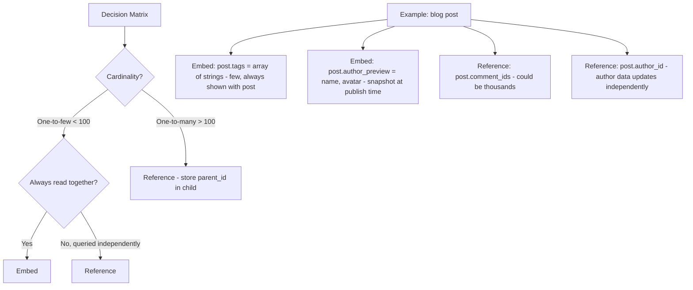

### Pitfalls
- ❌ **Embedding for shared data:** If product price is embedded in every order document, updating the price requires updating millions of order documents — reference the product and store the historical price at time of order as a separate field
- ❌ **Referencing everything for "normalization":** MongoDB's strength is embedding; over-normalization creates application-level joins that are slower than embedded reads

### Concept Reference

---

## Q5: How does MongoDB's aggregation pipeline work?

**Role:** Senior | **Difficulty:** 🔴 Senior | **Priority:** P2 | **Format:** Deep Dive

> **What the interviewer is testing:** Whether you understand MongoDB's stage-based aggregation model and can design a pipeline for common analytics queries.

### Problem Constraints
| Dimension | Value |
|-----------|-------|
| Collection | orders (50M documents) |
| Query | Top 10 customers by total spend, last 30 days |

### Pipeline Architecture

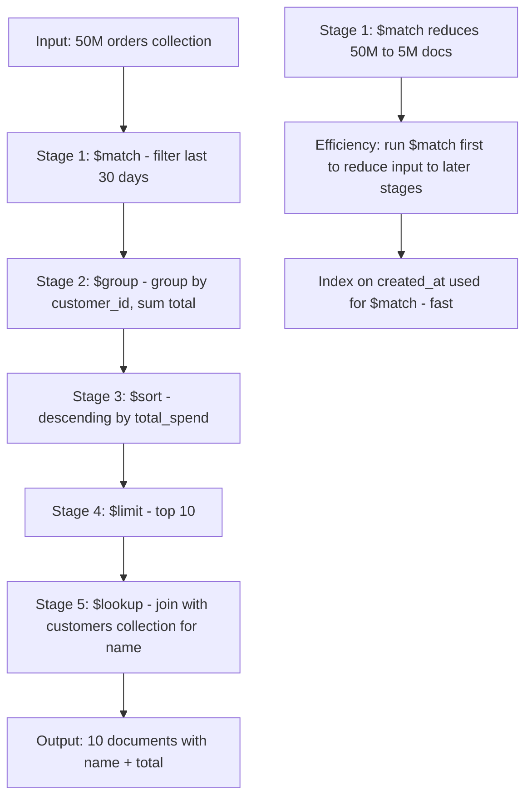

### Key Pipeline Stages

| Stage | Purpose | Performance Note |
|-------|---------|-----------------|
| `$match` | Filter documents | Put first; uses indexes |
| `$group` | Aggregate with accumulators | Requires memory; watch allowDiskUse |
| `$sort` | Sort results | Index-backed if matching index |
| `$lookup` | Left outer join to another collection | Expensive; use sparingly |
| `$project` | Select/reshape fields | Reduces document size for subsequent stages |
| `$unwind` | Flatten array field to one doc per element | Multiplies document count |

### Recommended Answer
Design pipelines with `$match` first to reduce document count before expensive stages like `$group` and `$lookup`. Ensure indexes exist on `$match` filter fields. For large group-bys, set `allowDiskUse: true` to spill to disk when memory limit (100MB) is exceeded. Use `$lookup` sparingly — it's an application-level join that can be slow for large collections.

### What a great answer includes
- [ ] Pipeline optimization order: $match (filter) → $project (trim fields) → $group (aggregate) → $sort
- [ ] allowDiskUse: required for $group on collections >100MB that don't fit in memory
- [ ] Index usage: $match uses indexes; $sort can use indexes if on the same indexed field; $group does not use indexes
- [ ] `explain("executionStats")` on aggregation to verify index usage

### Pitfalls
- ❌ **$lookup on large collections without an index:** `$lookup` joins from one collection to another — if the foreign collection doesn't have an index on the join field, it's a full collection scan per document
- ❌ **$unwind before $match:** Unwinding an array before filtering multiplies document count — always filter first to minimize unwind output

### Concept Reference

---

## Q6: How do you handle schema evolution in a document database?

**Role:** Senior | **Difficulty:** 🔴 Senior | **Priority:** P2 | **Format:** Quick Answer

> **What the interviewer is testing:** Whether you understand the lack of schema enforcement in MongoDB and have strategies for managing multiple document versions in production.

### Answer in 60 seconds
- **MongoDB's flexibility:** No schema enforcement by default — old documents and new documents can coexist in the same collection with different shapes
- **Version field pattern:** Add a `schema_version` field to every document; application code handles each version: `if doc.schema_version == 1: transform; if doc.schema_version == 2: use directly`
- **Lazy migration:** Old documents are transformed on read (no backfill needed); on write, always write the latest schema version — collection gradually migrates over time
- **Eager migration:** Background job reads all documents and rewrites in new schema; faster but requires more I/O and risk of partial migration

### Diagram

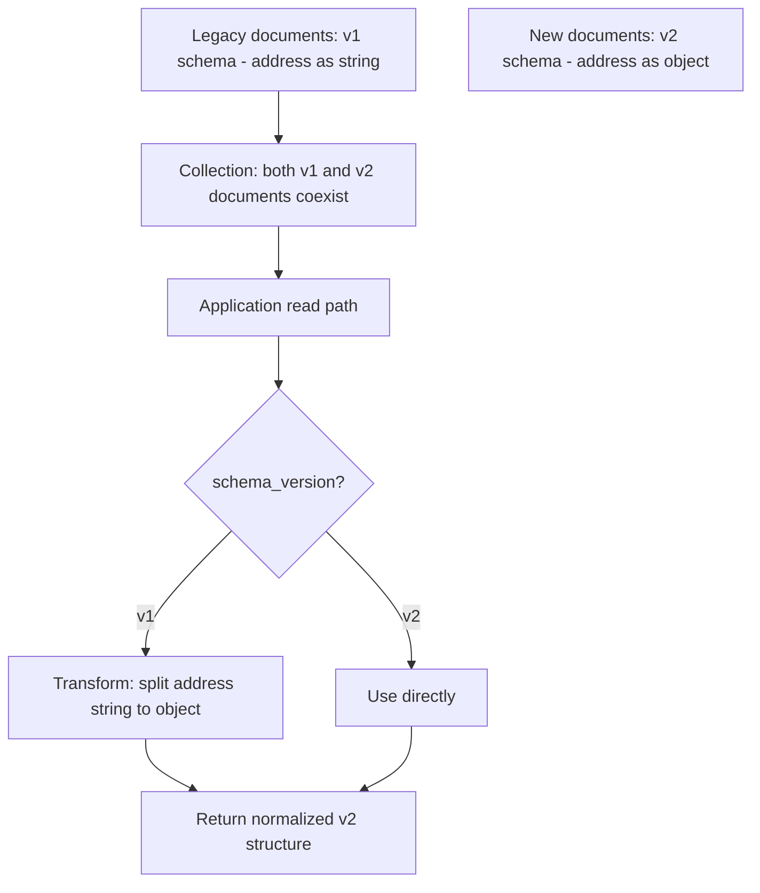

### Pitfalls
- ❌ **No schema version tracking:** Without version fields, code can't distinguish old from new documents — a field that was a string in v1 and an object in v2 causes type errors
- ❌ **Relying on schema enforcement for data integrity:** MongoDB schema validation (`$jsonSchema`) can enforce structure, but app-level validation is still needed — don't assume the DB catches all invalid data

### Concept Reference

---

## Q7: How does MongoDB Atlas handle global multi-region reads?

**Role:** Staff | **Difficulty:** ⚫ Staff | **Priority:** P2 | **Format:** Quick Answer

> **What the interviewer is testing:** Whether you understand MongoDB Atlas's global cluster architecture and the read preference and zone configuration that enables low-latency global reads.

### Answer in 60 seconds
- **Atlas Global Clusters:** Data sharded across regions; each zone (e.g., US-East, EU-West, AP-Southeast) holds a subset of shards; writes go to the zone's primary, reads serve from local zone
- **Zone sharding:** Documents are assigned to zones based on a shard key range — e.g., users with `region=us` land on US zone shards, `region=eu` on EU zone shards; reads are always local
- **Read preference:** `nearest` reads from the closest replica set member (same datacenter) — typically <5ms local read vs 100ms+ cross-region
- **Writes:** Still routed to the primary shard; if user is in EU but their shard's primary is in US, writes are 100ms+ — design zone sharding to minimize cross-zone writes

### Diagram

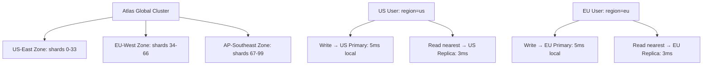

### Pitfalls
- ❌ **Global cluster without zone-aware shard key:** If shard key doesn't include region, US and EU users' data mixes across all zones — cross-region reads for EU users hitting US shards (100ms latency)
- ❌ **Expecting sub-millisecond cross-region writes:** Speed of light constraints mean US-EU writes are 70ms minimum RTT — design shard keys so each user's writes stay in their home region

### Concept Reference

---

## Q8: How would you shard a MongoDB collection for multi-tenant SaaS?

**Role:** Staff | **Difficulty:** ⚫ Staff | **Priority:** P2 | **Format:** Deep Dive

> **What the interviewer is testing:** Whether you can design a MongoDB sharding strategy that provides tenant isolation, even data distribution, and efficient per-tenant queries.

### Problem Constraints
| Dimension | Value |
|-----------|-------|
| Tenants | 10,000 companies |
| Documents per tenant | 10K–10M (variable) |
| Query pattern | 95% filtered by tenant_id |
| Write rate | 100K writes/sec peak |

### Shard Key Options

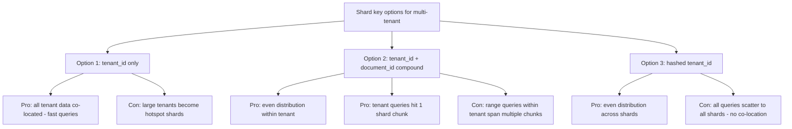

### Recommended Architecture

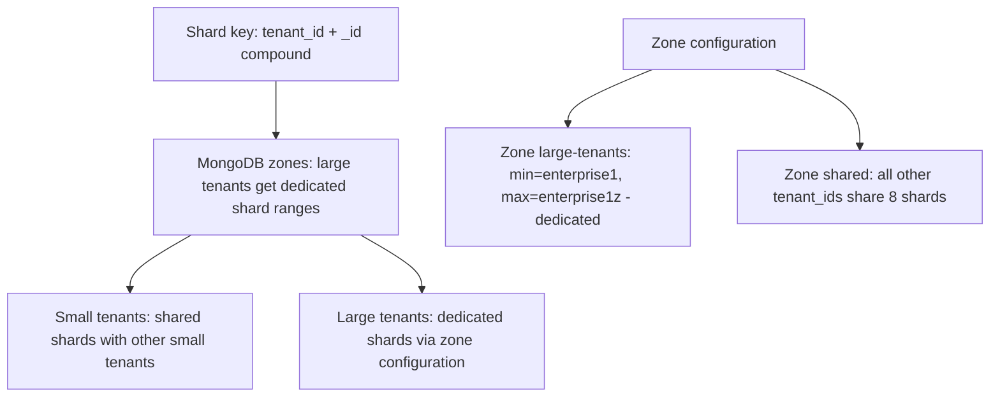

| Shard Key | Distribution | Query Efficiency | Hotspot Risk |
|-----------|-------------|-----------------|-------------|
| tenant_id only | Uneven (large tenants) | Excellent (1 shard) | High for large tenants |
| tenant_id + _id | Good | Good (bounded range per tenant) | Low |
| Hashed tenant_id | Perfect | Poor (scatter-gather) | None |

### Recommended Answer
Use `tenant_id + _id` compound shard key — tenant_id provides routing for per-tenant queries (most queries), and _id ensures even distribution of documents within each tenant's chunk range. Use MongoDB zone sharding to give large tenants their own dedicated shard ranges, preventing them from causing hotspots shared with small tenants.

### What a great answer includes
- [ ] Zone sharding for large tenant isolation: assign enterprise customer IDs to a dedicated zone
- [ ] Chunk splitting: MongoDB automatically splits large chunks; monitor chunk distribution with `sh.status()`
- [ ] Query pattern validation: verify 95% of queries include tenant_id in filter before committing to shard key
- [ ] Migrations: adding tenant_id to a shard key on existing collection requires resharding (MongoDB 5.0+ supports online resharding)

### Pitfalls
- ❌ **Hashed shard key for multi-tenant:** `hashed(tenant_id)` distributes perfectly but means every tenant query becomes a scatter-gather across all shards — 10x latency increase
- ❌ **Compound shard key without tenant_id first:** `_id + tenant_id` distributes randomly — tenant_id must be first in compound key for query routing to work

### Concept Reference

---

## Q9: How does Cosmos DB partitioning differ from MongoDB?

**Role:** Staff | **Difficulty:** ⚫ Staff | **Priority:** P3 | **Format:** Quick Answer

> **What the interviewer is testing:** Whether you understand Cosmos DB's partition key model and how it maps differently to MongoDB's shard key approach.

### Answer in 60 seconds
- **Cosmos DB:** Partition key is mandatory on every container; each logical partition maps to a physical partition (max 20GB); every query without the partition key does a cross-partition scan at higher cost and latency
- **MongoDB:** Shard key is optional (sharding is opt-in); non-sharded collections work normally on a single mongod; sharding is an explicit scale-out decision
- **Cosmos throughput model:** RU/s (Request Units) provisioned per container or per partition key; hot partitions exceed their RU allocation and get throttled with 429 errors
- **Key practical difference:** Cosmos DB requires upfront partition key design for scale (can't be changed); MongoDB shard key can be chosen later and changed with online resharding (MongoDB 5+)

### Diagram

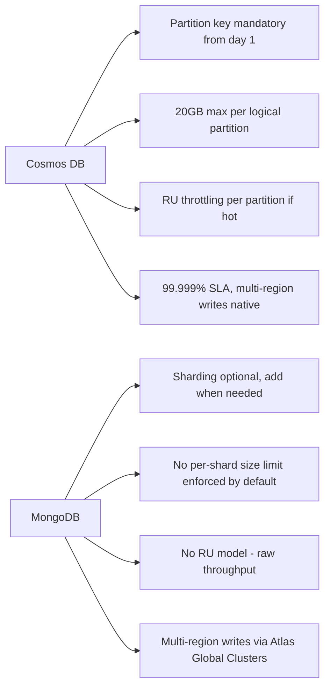

### Pitfalls
- ❌ **Wrong Cosmos DB partition key:** Using timestamp as partition key means all recent writes go to one partition — hot partition, 429 throttling, application errors
- ❌ **Cosmos DB partition key with low cardinality:** Using `country_code` (195 values) as partition key for a 10TB container means ~50GB per country partition — exceeds 20GB limit for large countries

### Concept Reference

---

## Q10: Store user profiles with highly variable nested attributes — design the schema

**Role:** Senior | **Difficulty:** 🔴 Senior | **Priority:** P1 | **Format:** Scenario
**Real Company:** Modeled on LinkedIn profile storage, Salesforce custom fields

### The Brief
> "You're designing the storage for user profiles on a professional network. Each user type (developer, designer, sales rep, executive) has completely different profile fields. Developers have programming languages, GitHub links, and open source projects. Designers have portfolio links and tool expertise. Sales reps have quota attainment and industry verticals. Design a MongoDB schema that handles this variability."

### Clarifying Questions to Ask First
1. What queries are most common — lookup by user_id or search by specific field values?
2. Are field names known in advance or truly dynamic (user-defined custom fields)?
3. Do users ever switch between types?
4. What is the read:write ratio for profiles?

### Back-of-Envelope Estimation
| Metric | Value |
|--------|-------|
| Users | 50M |
| Avg profile size | 5KB |
| Total storage | 50M × 5KB = 250GB |
| Profile reads/sec | 500K (high, everyone views profiles) |
| Profile writes/sec | 5K (low, users update infrequently) |

### High-Level Architecture

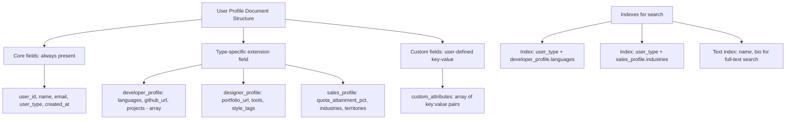

### Trade-off Decisions
| Decision | Option A | Option B | Chosen | Why |
|----------|----------|----------|--------|-----|
| Schema approach | Single collection, type-specific fields | Separate collections per user type | Single collection | Easier profile lookup; type-specific indexes handle query routing |
| Extension storage | Embedded sub-document | Reference to separate collection | Embedded | Profile always read together; <10KB total |
| Custom fields | Free-form object | Typed key-value array | Typed array | Array allows indexing by field name; free-form object limits queryability |
| Search | MongoDB text search | Elasticsearch | Elasticsearch | Full-text and faceted search at scale; MongoDB text index doesn't handle complex queries |

### Failure Modes
| Failure | Impact | Mitigation |
|---------|--------|------------|
| Very large profile (user embeds 1000 projects) | 16MB document limit | Limit array length in application code; move to reference model at >100 items |
| Missing type-specific field on read | Null pointer in application | Default empty sub-document in all profiles; application handles null fields |
| Slow search without index | Full collection scan | Ensure compound indexes on user_type + type-specific fields; test with `explain()` |

