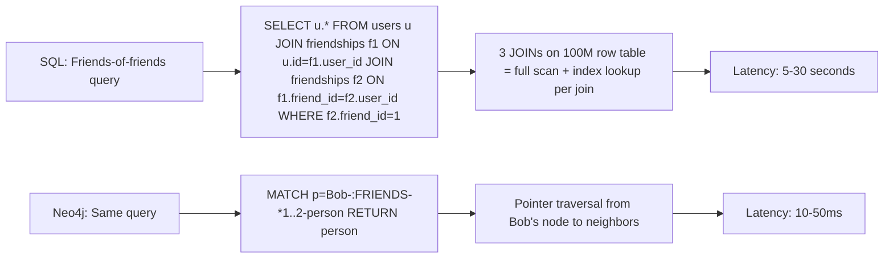
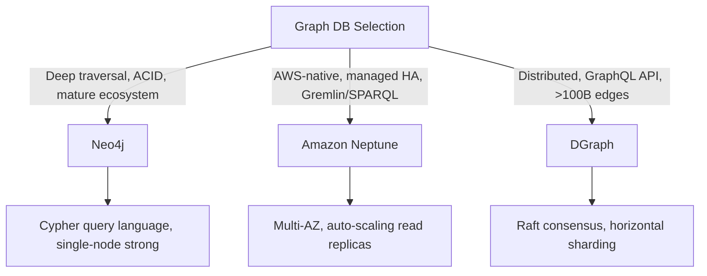
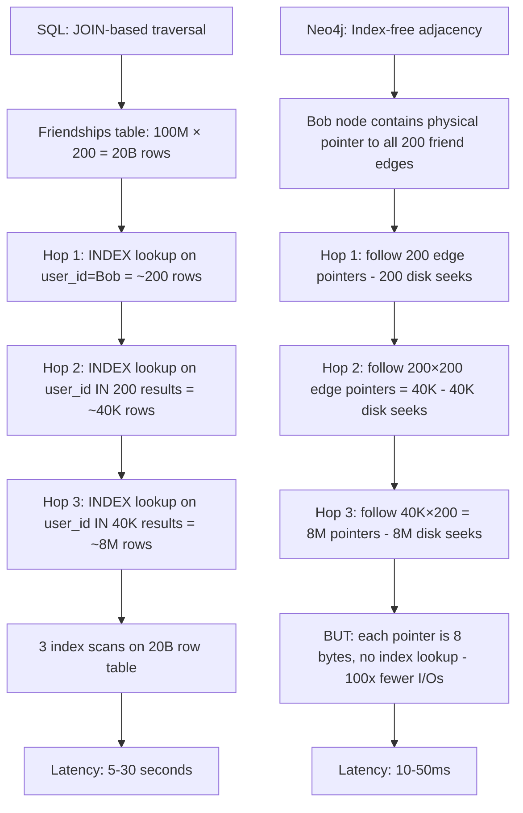
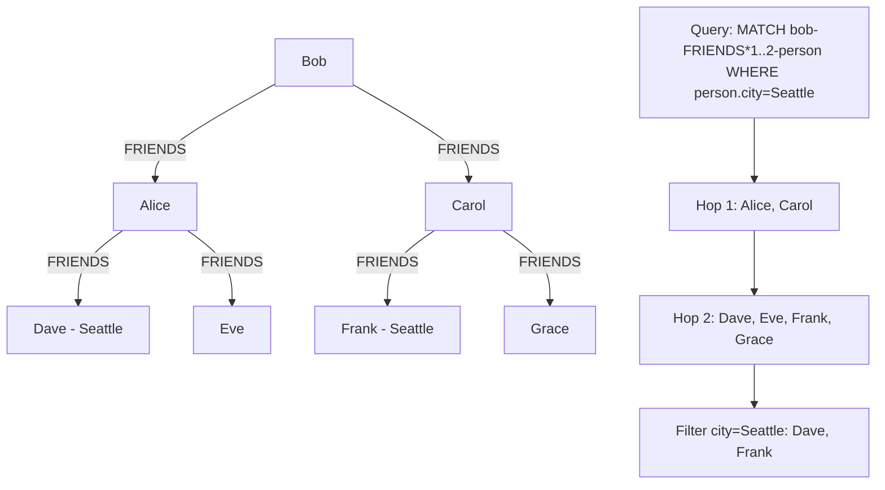
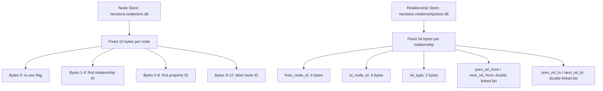
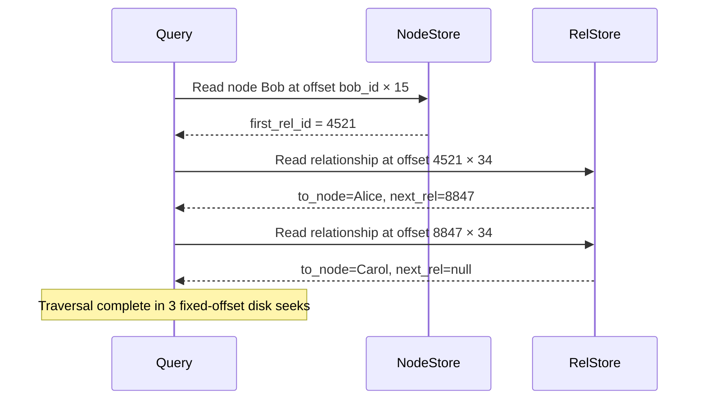
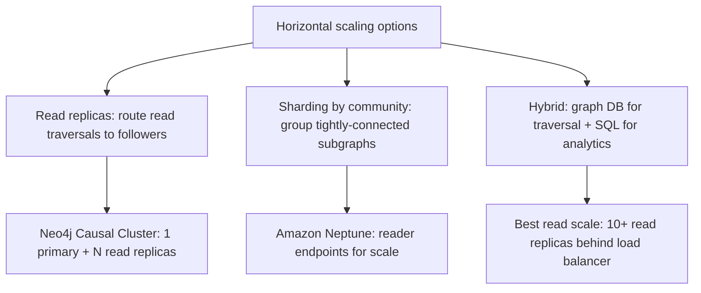
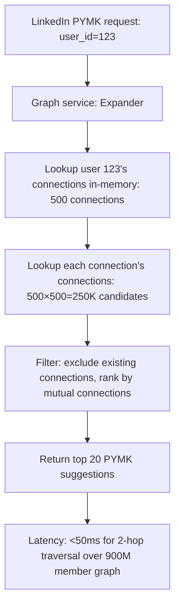
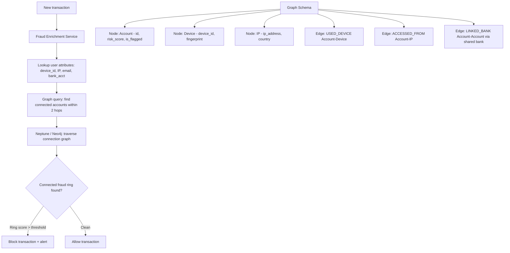
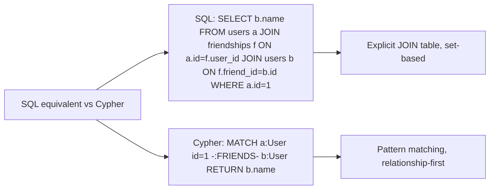

# Graph Databases

10 questions covering graph DB use cases, traversal performance, storage models, horizontal scaling, and real-world applications like fraud detection and social networks.

---

## Q1: What is a graph database and when is it better than relational?

**Role:** Mid | **Difficulty:** 🟡 Mid | **Priority:** P1 | **Format:** Quick Answer

> **What the interviewer is testing:** Whether you can identify the specific query pattern (multi-hop relationship traversal) where graph DBs outperform SQL joins by orders of magnitude.

### Answer in 60 seconds
- **Definition:** A database that stores data as nodes (entities) and edges (relationships), optimized for traversing multi-hop relationship paths
- **When graph wins:** "Find all friends of friends of Bob who live in Seattle" — SQL requires 3 self-joins on a users table, each full table scan; Neo4j traverses edges directly from Bob's node, O(k) per hop where k is average connections
- **Performance gap:** SQL self-join on 10M users × 3 hops = ~billions of row comparisons; Neo4j = ~thousands of edge traversals — 1000x+ faster for deep queries
- **When SQL wins:** Simple key-value lookups, aggregations over all rows, complex analytical queries — graph DBs don't outperform on queries that aren't relationship-centric

### Diagram



### Pitfalls
- ❌ **Using graph DB for simple CRUD:** User accounts, orders, and products don't require multi-hop traversal — adding Neo4j for a standard SaaS app adds operational complexity without benefit
- ❌ **Assuming graph DB scales infinitely:** Most graph DBs (Neo4j community, single-instance) are not natively distributed; horizontal scaling requires specific editions or managed services

### Concept Reference
→ [SQL vs NoSQL](../../../system-design/storage-and-databases/sql-vs-nosql)

---

## Q2: What is the difference between Neo4j, Amazon Neptune, and DGraph?

**Role:** Mid | **Difficulty:** 🟡 Mid | **Priority:** P1 | **Format:** Quick Answer

> **What the interviewer is testing:** Whether you know the key operational and technical differences between the major graph database options.

### Answer in 60 seconds
- **Neo4j:** Most mature, largest community; Cypher query language; single-node performance best-in-class; Neo4j Enterprise for clustering; ACID transactions; ~4B nodes on 256GB RAM
- **Amazon Neptune:** Fully managed AWS service; supports both property graph (Gremlin) and RDF (SPARQL); multi-AZ HA built-in; horizontal read replicas; best choice for AWS-native workloads
- **DGraph:** Open-source, natively distributed; GraphQL-native API; built for horizontal scale; less mature than Neo4j; good for Kubernetes deployments with 100B+ edges
- **Rule:** Neo4j for single-tenant apps with deep traversal; Neptune for AWS-managed with HA requirements; DGraph for distributed graph at scale

### Diagram



### Pitfalls
- ❌ **Choosing Neptune assuming it scales like DynamoDB:** Neptune scales read replicas but writes go to single primary — not designed for 1M+ writes/sec like DynamoDB
- ❌ **Neo4j for geographically distributed graph:** Neo4j Fabric (sharding) is complex; for truly distributed global graphs, Neptune or DGraph is a better fit

### Concept Reference
→ [SQL vs NoSQL](../../../system-design/storage-and-databases/sql-vs-nosql)

---

## Q3: How do graph databases traverse relationships faster than SQL JOINs?

**Role:** Senior | **Difficulty:** 🔴 Senior | **Priority:** P1 | **Format:** Deep Dive

> **What the interviewer is testing:** Whether you understand index-free adjacency — the fundamental reason graph DBs are faster for traversal than relational JOIN operations.

### Problem Constraints
| Dimension | Value |
|-----------|-------|
| Users | 100M |
| Average connections | 200 per user |
| Query | 3-hop friend-of-friend |

### Index-Free Adjacency



### Key Difference

| Dimension | SQL JOIN | Index-Free Adjacency |
|-----------|----------|---------------------|
| Hop cost | O(log N) per index lookup | O(1) per pointer follow |
| N = table size | Grows with 20B rows | Fixed: only follow adjacent edges |
| 3-hop cost | O(k × log N) per hop | O(k) per hop |
| 10M user dataset | 10M index rows to search | Only 200 neighbors to follow |

### Recommended Answer
Neo4j's index-free adjacency stores physical pointers from each node directly to its adjacent nodes on disk. Traversal never scans the entire relationship table — it follows pre-computed pointers. At each hop, the cost is proportional to k (average connections), not N (total nodes). This makes traversal O(k^depth) vs SQL's O(N × k^depth).

### What a great answer includes
- [ ] Index-free adjacency vs B-tree index: index lookup is O(log N) regardless of result size; pointer follows are O(1)
- [ ] Database of local exploration: graph DBs excel when you're exploring a neighborhood of the graph, not aggregating across all nodes
- [ ] Supernode problem: nodes with millions of connections (celebrity users) still cause performance issues even in graph DBs — require special handling
- [ ] Neo4j's native graph storage: node records and relationship records are fixed-size (15 bytes each), enabling fast offset calculations

### Pitfalls
- ❌ **Expecting graph DBs to be fast for global aggregations:** "Count all users by country" requires scanning all nodes — graph DBs are not faster than SQL for full-graph analytics; use a data warehouse for aggregations
- ❌ **Underestimating the supernode problem:** A celebrity with 1M followers creates a 1M-edge traversal at hop 1 — graph DBs can still be slow for supernode traversal without pagination or filtering

### Concept Reference
→ [SQL vs NoSQL](../../../system-design/storage-and-databases/sql-vs-nosql)

---

## Q4: How would you model friend-of-friend queries in a graph DB?

**Role:** Senior | **Difficulty:** 🔴 Senior | **Priority:** P2 | **Format:** Quick Answer

> **What the interviewer is testing:** Whether you can design a graph schema and write a traversal query with appropriate depth limits and filters.

### Answer in 60 seconds
- **Node model:** `(:User {id, name, city, created_at})` — each user is a node with properties
- **Edge model:** `(:User)-[:FOLLOWS]->(:User)` for directed (Twitter-style) or `(:User)-[:FRIENDS {since}]-(:User)` for undirected (Facebook-style)
- **Query:** `MATCH (bob:User {id: 123})-[:FRIENDS*1..2]-(person:User {city: 'Seattle'}) RETURN DISTINCT person`
- **Performance guard:** Always bound traversal depth (`*1..2` not `*` unbounded) — unbounded traversal on a 100M user graph can run indefinitely; also LIMIT results

### Diagram



### Pitfalls
- ❌ **Unbounded traversal depth:** `MATCH (a)-[:FRIENDS*]-(b)` with no depth limit can traverse the entire graph — always use `*1..3` with explicit max depth
- ❌ **Storing relationship properties in nodes:** Relationship properties (friendship start date, weight) belong on the edge, not duplicated on each node — graph DBs are designed for relationship properties

### Concept Reference
→ [SQL vs NoSQL](../../../system-design/storage-and-databases/sql-vs-nosql)

---

## Q5: How does Neo4j store graph data on disk for efficient traversal?

**Role:** Senior | **Difficulty:** 🔴 Senior | **Priority:** P2 | **Format:** Deep Dive

> **What the interviewer is testing:** Whether you understand Neo4j's fixed-size record format that enables O(1) pointer-based traversal.

### Problem Constraints
| Dimension | Value |
|-----------|-------|
| Users | 1B nodes |
| Relationships | 10B edges |
| Node record size | 15 bytes |
| Relationship record size | 34 bytes |

### Storage Format



### Traversal Using Fixed-Size Records



### What a great answer includes
- [ ] Fixed-size records enable O(1) disk offset calculation: `offset = id × record_size`
- [ ] Doubly-linked list of relationships: each relationship points to prev/next relationship for both its start and end nodes
- [ ] Property store: properties are stored separately in a linked list — not in the node/relationship record itself
- [ ] Label store: node labels (`:User`, `:Product`) stored as IDs; traversal by label uses a label index

### Pitfalls
- ❌ **Assuming Neo4j stores data as adjacency lists in memory:** Neo4j uses fixed-size disk records with O(1) address calculation — it's a disk-based storage engine, not an in-memory graph
- ❌ **Not understanding why fixed-size records matter:** Variable-size records would require scanning to find a specific record by ID; fixed-size allows direct offset access

### Concept Reference
→ [SQL vs NoSQL](../../../system-design/storage-and-databases/sql-vs-nosql)

---

## Q6: How do you scale a graph database horizontally?

**Role:** Staff | **Difficulty:** ⚫ Staff | **Priority:** P2 | **Format:** Quick Answer

> **What the interviewer is testing:** Whether you understand that graph partitioning is fundamentally harder than key-value sharding due to relationship cross-partition edges.

### Answer in 60 seconds
- **The problem:** Unlike key-value sharding where a key maps cleanly to one shard, graph edges can connect nodes on different shards — cross-shard edge traversals become expensive network calls
- **Graph partitioning:** Algorithms like METIS try to minimize cross-partition edges; a social network partitioned by user_id will still have many cross-shard friendships because friendships don't respect shard boundaries
- **Practical solutions:** (1) Read replicas (not sharding): scale reads by adding read-only Neo4j followers; (2) Denormalize locally relevant data to avoid cross-shard reads; (3) For global-scale, use DGraph (natively distributed with Raft)
- **Scale ceiling:** Single Neo4j instance handles ~4B nodes and ~40B relationships with 256GB RAM; beyond that, architectural redesign is required

### Diagram



### Pitfalls
- ❌ **Expecting naive key-based sharding to work:** Splitting users A-M on Shard 1 and N-Z on Shard 2 — a friendship between Alice and Zara becomes a cross-shard edge, requiring network hop for every traversal
- ❌ **Graph sharding for write scale:** Read replicas help read scale; write scale for graphs is fundamentally limited by the need for consistent traversal across shards — design to minimize write rate at the graph layer

### Concept Reference
→ [SQL vs NoSQL](../../../system-design/storage-and-databases/sql-vs-nosql)

---

## Q7: How does LinkedIn use graph DBs for "People You May Know"?

**Role:** Staff | **Difficulty:** ⚫ Staff | **Priority:** P3 | **Format:** Quick Answer

> **What the interviewer is testing:** Whether you know LinkedIn's real-time graph infrastructure (Expander/LIquid) and can extrapolate architecture principles.

### Answer in 60 seconds
- **Problem:** 900M+ members, each with hundreds of connections — "People You May Know" requires 2-hop traversal over a 100B+ edge graph in real time
- **LinkedIn's approach:** Custom in-memory graph service called "Expander" — the social graph is stored entirely in RAM across a cluster of machines; each traversal stays in memory
- **Scale numbers:** LinkedIn's social graph (~40B connections) fits in ~320GB RAM (8 bytes × 40B); distributed across 100 nodes = 3.2GB per node
- **Why not Neo4j at this scale:** Neo4j is disk-based; 40B edges on disk with network hop traversal is too slow; in-memory enables <50ms 2-hop traversal across 900M members

### Diagram



### Pitfalls
- ❌ **Assuming LinkedIn runs Neo4j at production scale:** LinkedIn built a custom in-memory graph service — off-the-shelf graph DBs don't meet their latency requirements at 900M members
- ❌ **Underestimating RAM requirements:** 40B edges × 8 bytes = 320GB — this is feasible with a 100-node cluster but requires careful memory management and sharding strategy

### Concept Reference
→ [SQL vs NoSQL](../../../system-design/storage-and-databases/sql-vs-nosql)

---

## Q8: Design a fraud detection system using graph traversal for connected accounts

**Role:** Senior | **Difficulty:** 🔴 Senior | **Priority:** P2 | **Format:** Scenario
**Real Company:** Modeled on PayPal, Stripe, and Square fraud detection systems

### The Brief
> "You're designing a fraud detection system for a payment platform. Fraudsters create multiple fake accounts connected by shared device IDs, IP addresses, and bank accounts. Design a graph-based system to identify fraud rings in real time."

### Clarifying Questions to Ask First
1. What is the transaction volume — how many transactions per second?
2. What is the acceptable false-positive rate for fraud detection?
3. Do we need real-time blocking (sub-100ms) or near-real-time flagging (seconds)?
4. What connection types are available — device ID, IP, bank account, phone, email?

### Back-of-Envelope Estimation
| Metric | Calculation | Result |
|--------|-------------|--------|
| Transactions/sec | 50K TPS | 50K fraud checks/sec |
| Users per fraud ring | 5–50 connected accounts | 2–3 hop traversal |
| Graph size | 100M users, 500M edges | ~4GB RAM for index |
| Fraud ring detection latency | < 200ms | Requires in-memory graph |

### High-Level Architecture



### Trade-off Decisions
| Decision | Option A | Option B | Chosen | Why |
|----------|----------|----------|--------|-----|
| Graph DB choice | Neo4j | Amazon Neptune | Neptune | Managed HA; AWS-native; Gremlin API |
| Detection timing | Real-time (<100ms) | Async (1-5 sec) | Async for most | 100ms graph traversal hard at 50K TPS; async for batch scoring |
| False positive handling | High recall (flag more) | High precision (flag less) | Tunable threshold | Start conservative, tune based on dispute rate |
| Ring depth | 1 hop | 3 hops | 2 hops | 1 hop misses rings; 3 hops too slow (exponential) |

### Failure Modes
| Failure | Impact | Mitigation |
|---------|--------|------------|
| Graph DB latency spike | Fraud checks timeout, transactions proceed | Circuit breaker: if graph >500ms, proceed with rule-based only |
| False positives on shared IP | Legitimate users at coffee shop flagged | Weight edge types: shared bank = high risk; shared public IP = low risk |
| Graph DB primary fails | No fraud enrichment | Read replica serves traversals; writes resume after failover |

### Concept References
→ [SQL vs NoSQL](../../../system-design/storage-and-databases/sql-vs-nosql)

---

## Q9: What is Cypher query language and how does it compare to SQL?

**Role:** Staff | **Difficulty:** ⚫ Staff | **Priority:** P2 | **Format:** Quick Answer

> **What the interviewer is testing:** Whether you understand Cypher's pattern-matching syntax and can write basic traversal queries, distinguishing it from SQL's set-based operations.

### Answer in 60 seconds
- **Cypher:** Neo4j's declarative graph query language — uses ASCII art patterns like `(a)-[:FOLLOWS]->(b)` to describe the subgraph to match
- **Key difference from SQL:** SQL describes what rows to return from flat tables; Cypher describes the graph pattern to match — relationships are first-class citizens, not join conditions
- **Common patterns:** `MATCH (u:User)-[:FRIENDS*1..3]-(other) WHERE u.id=1 RETURN other` — find all users within 3 friendship hops from user 1
- **Aggregations:** `MATCH (u)-[:ORDERED]->(o:Order) RETURN u.id, count(o) as order_count ORDER BY order_count DESC` — works similarly to SQL GROUP BY

### Diagram



### Pitfalls
- ❌ **Using `MATCH (a)-[:*]-(b)` without depth limit:** Unbounded `*` traversal will attempt to match every path in the graph — always specify max depth like `*1..3`
- ❌ **Not using relationship direction in queries:** `(a)-[:FOLLOWS]-(b)` matches both directions; `(a)-[:FOLLOWS]->(b)` matches only outgoing follows — direction matters for directed graphs like Twitter

### Concept Reference
→ [SQL vs NoSQL](../../../system-design/storage-and-databases/sql-vs-nosql)

---

## Q10: How would you detect a cycle in a 1B-node social graph efficiently?

**Role:** Staff | **Difficulty:** ⚫ Staff | **Priority:** P3 | **Format:** Quick Answer

> **What the interviewer is testing:** Whether you know that naive BFS/DFS on a 1B-node graph is infeasible and can describe distributed cycle detection algorithms.

### Answer in 60 seconds
- **Naive BFS (don't say this):** O(V+E) traversal on a 1B-node graph visits every node — takes hours, not feasible for real-time
- **Distributed approach:** Partition graph into communities using Louvain algorithm; detect cycles within communities first (most cycles are local); only cross-boundary checks for inter-community cycles
- **For social fraud rings specifically:** A "cycle" of interest is typically 4–10 nodes; use depth-limited DFS (max_depth=5) from high-risk nodes flagged by other signals — not full-graph cycle detection
- **Pregel/Spark GraphX:** For batch cycle detection, use Pregel's superstep model — each node propagates its ID to neighbors; if a node receives its own ID, a cycle exists; runs in O(diameter) supersteps

### Diagram

```mermaid
graph TD
  A[Detect cycles in 1B-node graph]
  A --> B{Real-time or batch?}
  B -->|Real-time specific node| C[Depth-limited DFS from target: max_depth=5]
  B -->|Batch full graph| D[Pregel superstep: propagate node ID through edges]
  C --> E[O(k^5) where k=avg connections: fast for low depth]
  D --> F[O(diameter × edges) across distributed cluster]
  D --> G[Apache Spark GraphX or Giraph for 1B nodes]
  F --> H[Each superstep: nodes update + propagate - parallel across 1000 workers]
```

### Pitfalls
- ❌ **Proposing DFS without depth limit:** Unbounded DFS from one node in a social graph can visit the entire connected component (billions of nodes) before backtracking
- ❌ **Not mentioning the problem is likely domain-specific:** "Detect a cycle in a 1B-node graph" is usually a fraud ring detection problem — clarify depth and size constraints before proposing a general algorithm

### Concept Reference
→ [SQL vs NoSQL](../../../system-design/storage-and-databases/sql-vs-nosql)
