# Indexing Strategies

10 questions covering index types, composite indexes, covering indexes, query planning, and real-world index optimization.

---

## Q1: What is a database index and why does it speed up queries?

**Role:** Junior | **Difficulty:** 🟢 Junior | **Priority:** P0 | **Format:** Quick Answer

> **What the interviewer is testing:** Whether you understand the fundamental data structure behind indexes and can explain the O(log N) vs O(N) trade-off.

### Answer in 60 seconds
- **Definition:** A separate data structure (usually a B-tree) that maintains a sorted copy of one or more columns, enabling binary search instead of full table scan
- **Speed improvement:** Full table scan on 10M rows = 10M comparisons; B-tree index = ~24 comparisons (log2 of 10M)
- **Write cost:** Every INSERT/UPDATE/DELETE must also update the index — writes are 20–50% slower with each additional index
- **Physical analogy:** An index is like a book's index — without it, you read every page; with it, you jump directly to the page number

### Diagram

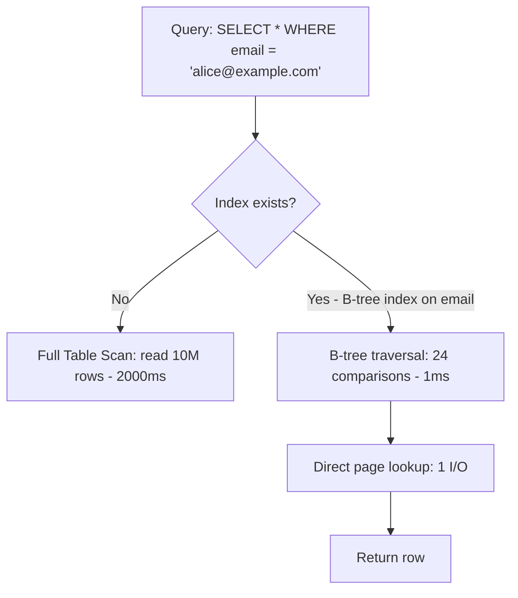

### Pitfalls
- ❌ **Indexing every column:** Each index consumes 10–50% of table size on disk and slows every write — only index columns in WHERE, JOIN, and ORDER BY clauses of frequent queries
- ❌ **Forgetting that NULL values behave differently:** PostgreSQL excludes NULLs from B-tree indexes by default; queries on nullable columns may still scan

### Concept Reference

---

## Q2: What is the difference between B-tree, hash, and full-text indexes?

**Role:** Mid | **Difficulty:** 🟡 Mid | **Priority:** P0 | **Format:** Quick Answer

> **What the interviewer is testing:** Whether you can match index type to query operator (=, >, LIKE, full-text search).

### Answer in 60 seconds
- **B-tree (default):** Sorted tree structure — supports equality (`=`), range (`>`, `<`, `BETWEEN`), and prefix (`LIKE 'abc%'`) — general purpose, handles 95% of use cases
- **Hash:** Hash table — O(1) equality lookups only, no range queries, no ordering — useful for exact-match joins; PostgreSQL hash indexes are WAL-logged since PG10
- **Full-text (GIN/GiST in PG):** Inverted index — tokenizes text into terms, enables `to_tsquery` searches across millions of documents in <50ms; not useful for equality/range
- **GIN vs GiST:** GIN is faster for reads (lookup time), GiST is faster for writes and supports fuzzy matching (trigrams)

### Diagram

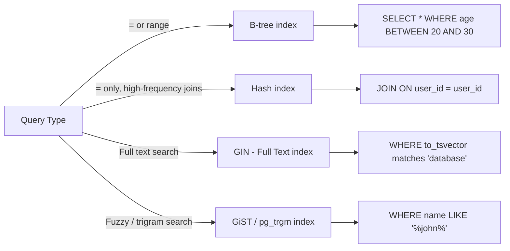

### Pitfalls
- ❌ **Using B-tree for LIKE '%term%' (suffix match):** B-tree index cannot be used for leading-wildcard patterns — use pg_trgm trigram index or full-text search instead
- ❌ **Hash index for range queries:** Hash index on created_at is useless for `WHERE created_at > now() - interval '7 days'` — B-tree is required for range

### Concept Reference

---

## Q3: How do composite indexes work and why does column ordering matter?

**Role:** Senior | **Difficulty:** 🔴 Senior | **Priority:** P0 | **Format:** Deep Dive

> **What the interviewer is testing:** Whether you understand the leftmost prefix rule and can design composite indexes for real multi-column queries.

### Problem Constraints
| Dimension | Value |
|-----------|-------|
| Table | orders (50M rows) |
| Hot queries | Filter by tenant_id + status + created_at |
| Write rate | 10K inserts/sec |

### How Composite Index Works

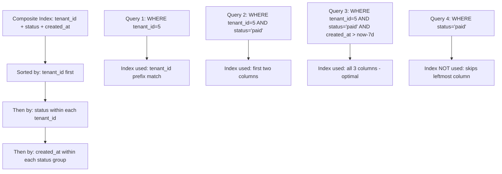

### Column Order Decision Matrix

| Query Pattern | Optimal Index |
|---------------|--------------|
| `WHERE a = ? AND b = ?` | (a, b) or (b, a) — equally good |
| `WHERE a = ? AND b > ?` | (a, b) — equality before range |
| `WHERE a > ? AND b = ?` | (b, a) — equality before range |
| `WHERE a = ? ORDER BY b` | (a, b) — avoids sort step |
| `WHERE a = ?` frequent, `WHERE a = ? AND b = ?` occasional | (a, b) covers both via prefix |

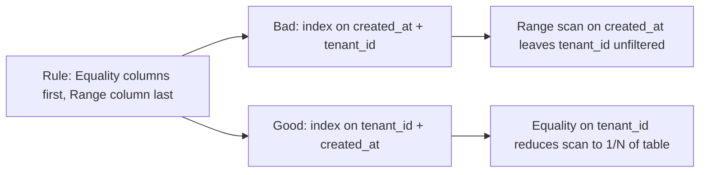

### What a great answer includes
- [ ] Leftmost prefix rule: index (a, b, c) can serve queries on (a), (a,b), (a,b,c) — not (b) or (c) alone
- [ ] Equality before range: put all equality-filter columns before range-filter columns in index definition
- [ ] Index coverage: if query only needs indexed columns, index-only scan avoids heap access (5–10x faster)
- [ ] Selectivity matters: most selective column first to reduce scanned rows early

### Pitfalls
- ❌ **Range column first in composite index:** `(created_at, tenant_id)` for a query `WHERE tenant_id=5 AND created_at > now-7d` wastes the index — reverse the order
- ❌ **Duplicate single-column indexes after adding composite:** If you add `(tenant_id, status)`, the single-column `(tenant_id)` index is now redundant — remove it to save write overhead

### Concept Reference

---

## Q4: Index scan vs full table scan — when does the DB choose each?

**Role:** Mid | **Difficulty:** 🟡 Mid | **Priority:** P1 | **Format:** Quick Answer

> **What the interviewer is testing:** Whether you understand that the query planner may ignore an index when row selectivity is low, and you can predict this behavior.

### Answer in 60 seconds
- **Index scan chosen when:** Query filters to <5–15% of rows — I/O cost of random page reads for those rows < sequential scan of full table
- **Full table scan chosen when:** Query returns >15–20% of rows — sequential scan of all pages is faster than thousands of random I/O operations from index pointers
- **Rule of thumb:** `SELECT * WHERE status='active'` on a table where 80% are active → planner chooses full scan; same query where 2% are active → planner uses index
- **Statistics dependency:** PostgreSQL updates column statistics via AUTOVACUUM — stale statistics cause wrong plan choice; run `ANALYZE table` after bulk loads

### Diagram

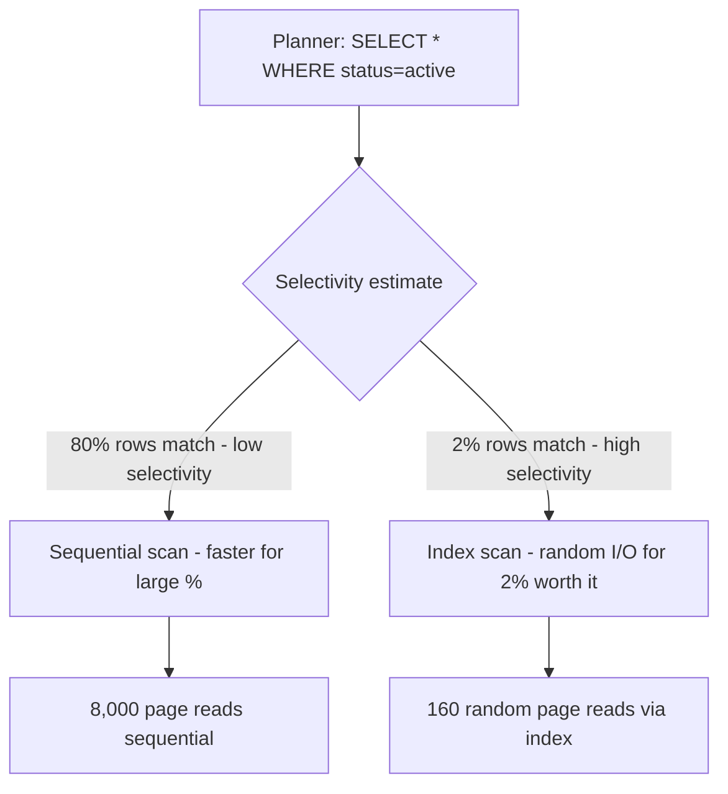

### Pitfalls
- ❌ **Expecting planner to always use your index:** A newly added index won't be used until `ANALYZE` refreshes statistics; a bulk insert of 10M rows needs manual `ANALYZE` to update estimates
- ❌ **Forcing index use with hints when planner is right:** If 60% of rows match, the planner's choice of full scan is correct — forcing index use makes it slower

### Concept Reference

---

## Q5: What are covering indexes and when should you use them?

**Role:** Mid | **Difficulty:** 🟡 Mid | **Priority:** P1 | **Format:** Quick Answer

> **What the interviewer is testing:** Whether you know that including additional columns in an index enables index-only scans that avoid heap table access entirely.

### Answer in 60 seconds
- **Definition:** An index that includes all columns a query needs — the DB can answer the query from the index alone without accessing the table (heap) at all
- **Speed gain:** Index-only scan avoids 1 random I/O per row for heap access — typically 5–10x faster than regular index scan for read-heavy queries
- **PostgreSQL syntax:** `CREATE INDEX idx ON orders (tenant_id, created_at) INCLUDE (status, amount)` — tenant_id and created_at are index keys; status and amount are stored in leaf
- **When to use:** Frequently run queries where the query reads only a few columns, especially on large tables where heap access is expensive

### Diagram

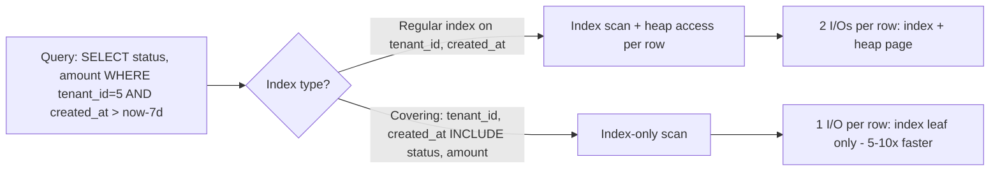

### Pitfalls
- ❌ **Covering too many columns:** Including 10 columns in an index doubles its size and slows every write — only include columns for the 2–3 most critical queries
- ❌ **Not checking visibility map:** PostgreSQL index-only scans still access the heap if the visibility map shows the page might have dead tuples — ensure regular VACUUM runs

### Concept Reference

---

## Q6: How do you diagnose a slow query and decide if an index will help?

**Role:** Senior | **Difficulty:** 🔴 Senior | **Priority:** P1 | **Format:** Deep Dive

> **What the interviewer is testing:** Whether you have a systematic diagnosis process using EXPLAIN ANALYZE output, not just guessing that an index is needed.

### Problem Constraints
| Dimension | Value |
|-----------|-------|
| Query time | 8 seconds (from application logs) |
| Table size | 20M rows, 40GB |
| Target time | < 100ms |

### Diagnosis Process

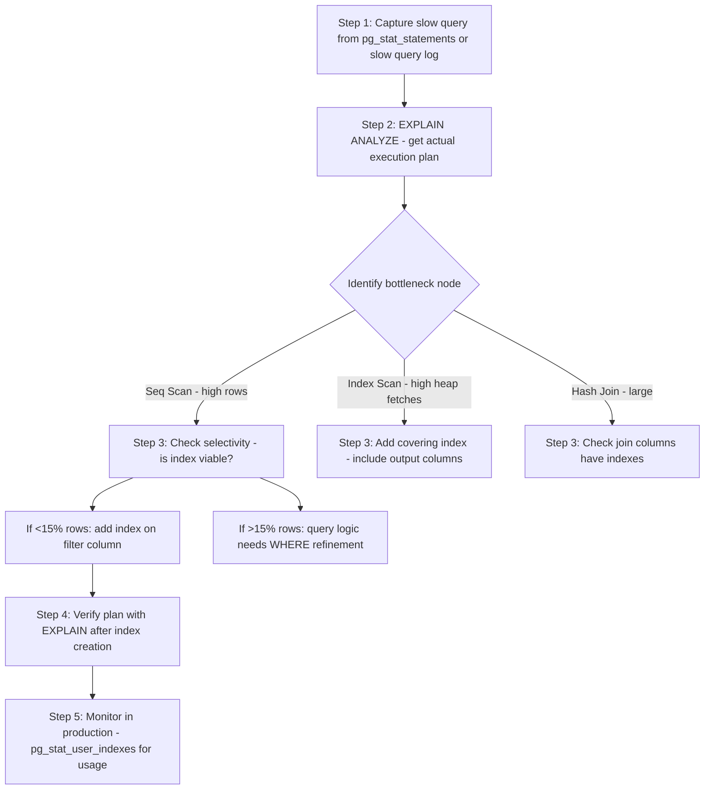

### Reading EXPLAIN Output

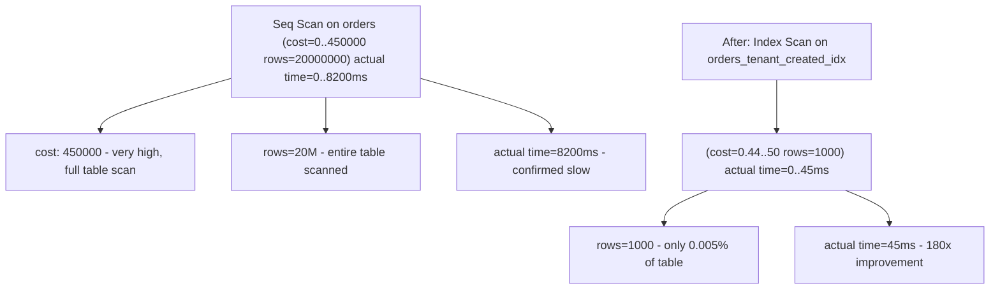

| EXPLAIN indicator | Meaning | Action |
|------------------|---------|--------|
| `Seq Scan` on large table | No usable index | Add index on filter columns |
| `rows=` estimate far from actual | Stale statistics | `ANALYZE table_name` |
| `Sort` with high cost | No index for ORDER BY | Add index matching ORDER BY |
| `Hash Join` with large build side | Missing FK index | Add index on FK column |
| `Index Scan` + many `heap fetches` | Not a covering index | Add `INCLUDE` columns |

### Recommended Answer
1. Use `EXPLAIN (ANALYZE, BUFFERS)` to get actual execution stats. 2. Find the highest-cost node. 3. Check if it's a sequential scan on a large table. 4. Verify selectivity (if <10% rows filtered, index helps). 5. Create index and re-run EXPLAIN to confirm plan changes. 6. Verify index is used in production via `pg_stat_user_indexes`.

### What a great answer includes
- [ ] `pg_stat_statements` as source of top slow queries by total_time (not just single execution)
- [ ] `EXPLAIN (ANALYZE, BUFFERS)` shows buffer cache hits vs disk reads — critical for understanding I/O
- [ ] Cost units in PostgreSQL are arbitrary (sequential page read = 1.0 by default) — compare relative, not absolute
- [ ] Verify index is actually used after creation — planner may still choose seq scan if statistics are stale

### Pitfalls
- ❌ **Running EXPLAIN without ANALYZE:** `EXPLAIN` shows estimated plan; `EXPLAIN ANALYZE` runs the query and shows actual times — estimates can be wildly wrong
- ❌ **Adding index without checking write impact:** A heavily written table with 10 existing indexes takes 50% longer to write — measure write latency before and after

### Concept Reference

---

## Q7: What is index bloat and how do you prevent it in PostgreSQL?

**Role:** Senior | **Difficulty:** 🔴 Senior | **Priority:** P2 | **Format:** Quick Answer

> **What the interviewer is testing:** Whether you understand PostgreSQL's MVCC model creates dead tuples in indexes and know how to manage index bloat operationally.

### Answer in 60 seconds
- **Definition:** Index pages that contain pointers to dead (deleted or updated) tuples — the index grows but doesn't shrink automatically; queries must skip dead entries
- **Cause:** PostgreSQL MVCC keeps old tuple versions for concurrent transaction visibility; VACUUM removes heap dead tuples but `VACUUM` only marks index pages for reuse, not reclaims disk
- **Detection:** `pgstattuple` extension: `SELECT leaf_fragmentation FROM pgstattuple('index_name')` — >50% fragmentation indicates bloat
- **Fix:** `REINDEX CONCURRENTLY index_name` (PG 12+) rebuilds the index online without blocking reads/writes; `VACUUM FULL` reclaims disk but locks the table

### Diagram

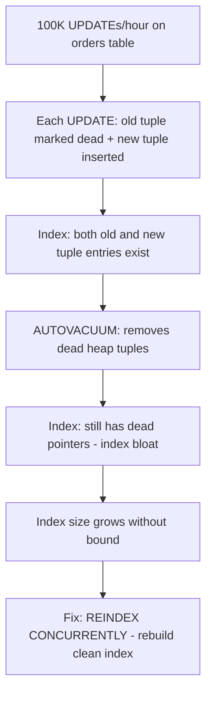

### Pitfalls
- ❌ **Disabling autovacuum on busy tables:** Some teams disable autovacuum thinking it's causing performance issues — this causes unbounded bloat; tune `autovacuum_vacuum_cost_delay` instead
- ❌ **Using REINDEX without CONCURRENTLY on production:** `REINDEX index_name` locks the table exclusively — use `REINDEX CONCURRENTLY` (PG 12+) to avoid blocking all reads

### Concept Reference

---

## Q8: How does PostgreSQL's query planner decide between multiple indexes?

**Role:** Staff | **Difficulty:** ⚫ Staff | **Priority:** P2 | **Format:** Deep Dive

> **What the interviewer is testing:** Whether you understand the cost-based optimizer, statistics, and how to influence planner decisions when they're wrong.

### Problem Constraints
| Dimension | Value |
|-----------|-------|
| Table | events (100M rows) |
| Indexes | 5 indexes on different columns |
| Query | Filter on 3 columns |

### How the Planner Evaluates Multiple Indexes

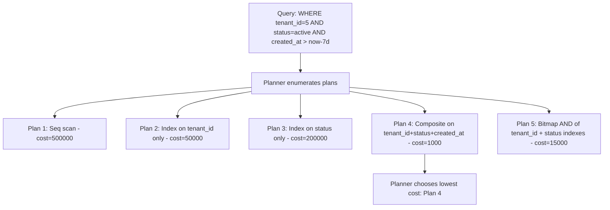

| Plan Type | When Chosen | Cost Model |
|-----------|------------|------------|
| Seq scan | High selectivity or no indexes | Pages × seq_page_cost |
| Index scan | Low selectivity, index exists | Pages × random_page_cost |
| Bitmap index scan | Medium selectivity | Build bitmap, then heap access in order |
| Index-only scan | Covering index available | Index leaf pages only |
| Bitmap AND | Two moderate indexes better together | Bitmap intersection |

### When the Planner Chooses Wrong
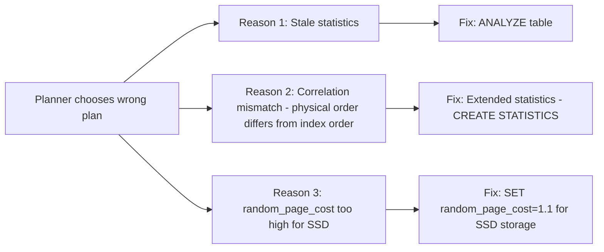

### Recommended Answer
The PostgreSQL planner is cost-based — it estimates the cost of every feasible plan using column statistics (from `pg_statistic`) and chooses the cheapest. Tune `random_page_cost` to 1.1–1.5 for SSD storage (default 4.0 is calibrated for spinning disk). Use `CREATE STATISTICS` for correlated columns. Add `pg_hint_plan` only as a last resort for planner bugs.

### What a great answer includes
- [ ] `pg_statistic` as source of column statistics (n_distinct, histogram, correlation)
- [ ] `random_page_cost` tuning: SSD = 1.1, NVMe = 1.0, spinning disk = 4.0
- [ ] Extended statistics for correlated columns (e.g., city and zip_code always correlate)
- [ ] `enable_seqscan=off` as debugging tool (not for production) to force index scan and compare

### Pitfalls
- ❌ **Blindly adding query hints:** `pg_hint_plan` hints bypass the planner — a schema change or data distribution shift can make the forced plan catastrophically wrong
- ❌ **Trusting EXPLAIN without ANALYZE:** Planner estimates can be 100x off with stale statistics; always compare estimated vs actual rows

### Concept Reference

---

## Q9: How do partial indexes reduce size and improve write performance?

**Role:** Staff | **Difficulty:** ⚫ Staff | **Priority:** P2 | **Format:** Quick Answer

> **What the interviewer is testing:** Whether you know that indexes can include a WHERE clause to index only a subset of rows, making them smaller and faster to maintain.

### Answer in 60 seconds
- **Definition:** A partial index includes only rows matching a predicate — `CREATE INDEX idx ON orders (user_id) WHERE status = 'pending'` — only pending orders are indexed
- **Size reduction:** If 99% of orders are 'completed' and 1% are 'pending', a partial index on 'pending' is 100x smaller than a full index on status+user_id
- **Write performance:** Inserts/updates that don't match the partial index predicate don't update the index at all — 5–20% write improvement for high-write tables where most writes don't match
- **Use cases:** Active records only (status='active', deleted_at IS NULL), unprocessed jobs, flagged items — any column with very skewed distribution

### Diagram

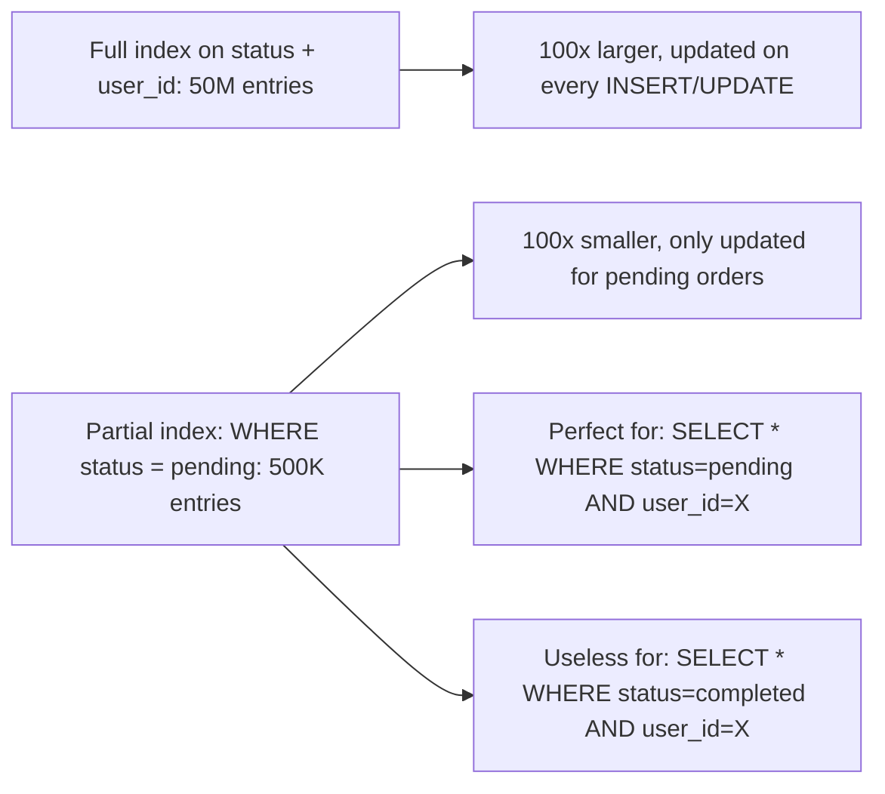

### Pitfalls
- ❌ **Partial index predicate not matching query WHERE clause:** PostgreSQL only uses a partial index if the query's WHERE clause implies the index predicate — `WHERE status='pending'` must appear explicitly
- ❌ **Partial index on high-cardinality subset:** If 50% of rows match the predicate, the partial index isn't much smaller — use full composite index instead

### Concept Reference

---

## Q10: A query joining 3 tables takes 8 seconds — walk through your optimization process

**Role:** Mid | **Difficulty:** 🟡 Mid | **Priority:** P0 | **Format:** Scenario
**Real Company:** Common PostgreSQL/MySQL production scenario

### The Brief
> "You're oncall. A query that powers the order management dashboard is timing out after 8 seconds. It joins: orders (50M rows), order_items (200M rows), and customers (5M rows). Users are getting 504 errors. Walk through your optimization process step by step."

### Clarifying Questions to Ask First
1. When did this start — was it always slow or did it regress?
2. What data volume was present when the query was written vs now?
3. Do you have an EXPLAIN plan from before the regression?
4. Can you temporarily direct the dashboard to a replica while you fix this?

### Back-of-Envelope Estimation
| Metric | Value |
|--------|-------|
| orders × order_items join size | 50M × 200M = potential 10B row product |
| Expected join output | ~200M (4 items per order avg) |
| Indexes needed | orders.customer_id, order_items.order_id |
| Index size for 200M FK column | ~3.2GB (8 bytes × 200M × 2 for B-tree) |

### High-Level Architecture

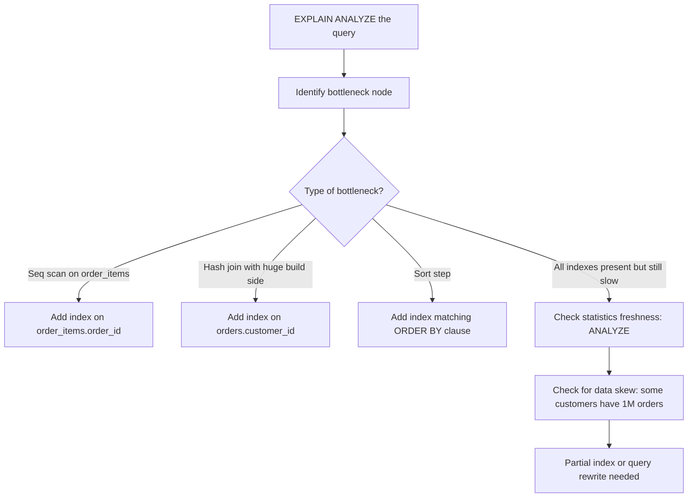

### Trade-off Decisions
| Decision | Option A | Option B | Chosen | Why |
|----------|----------|----------|--------|-----|
| Immediate relief | Add index | Query hint | Add index | Index helps all future queries; hint helps only this one |
| Schema change | Denormalize customer_name into orders | Keep normalized | Denormalize | Avoids the customer join entirely; customer name rarely changes |
| Dashboard query | Aggregate in real-time | Pre-compute summary table | Pre-compute | 8s query → 50ms lookup; refresh every 5 minutes |
| Short-term | Route to replica | Fix on primary | Route to replica | Prevents 504s while index is built with CONCURRENTLY |

### Failure Modes
| Failure | Impact | Mitigation |
|---------|--------|------------|
| CREATE INDEX locks table | All writes blocked | Use `CREATE INDEX CONCURRENTLY` |
| New index not used (stale stats) | No improvement | `ANALYZE orders, order_items, customers` after index creation |
| Query is fundamentally a bad design | Index doesn't help enough | Materialized view refreshed every 5 minutes |

