# Multi-Tenancy Database Patterns

6 questions covering the 3 isolation patterns, Row-Level Security, noisy neighbor handling, zero-downtime migration, GDPR deletion, and Salesforce's 150K-tenant architecture.

---

## Q1: What are the 3 multi-tenancy patterns (shared DB + schema, shared DB + tables, isolated DB)?

**Role:** Mid | **Difficulty:** 🟡 Mid | **Priority:** P0 | **Format:** Quick Answer

> **What the interviewer is testing:** Whether you can explain each pattern with its cost, isolation level, and the business scenario that drives each choice — not just name them.

### Answer in 60 seconds
- **Shared DB, shared tables (Silo model):** All tenants in the same tables, rows tagged with `tenant_id`; cheapest, highest density (10,000+ tenants per DB); lowest isolation — one bug leaks all tenants' data; used by Shopify, Slack
- **Shared DB, separate schemas:** Each tenant gets their own PostgreSQL schema within one DB; medium isolation — separate object namespaces; 100–1,000 tenants per DB; used by Heroku Postgres add-ons
- **Isolated DB per tenant:** Each tenant has a completely separate DB instance; strongest isolation; most expensive (1 RDS instance per tenant = $50–500/month each); used by enterprise SaaS with compliance requirements (SOC 2, HIPAA per-tenant)

### Diagram

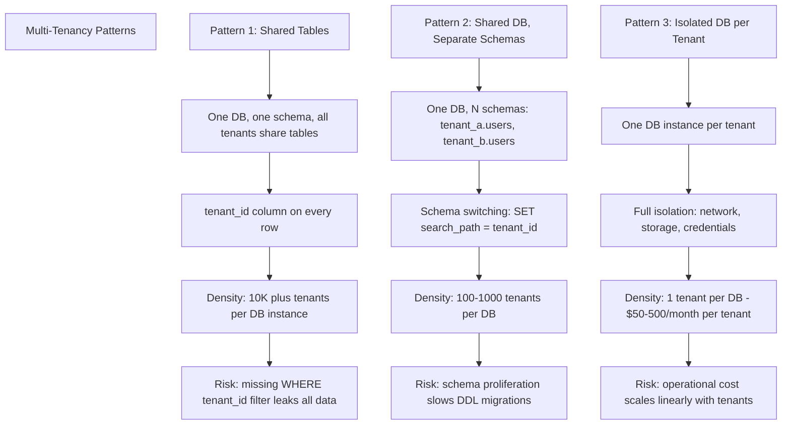

### Decision Matrix

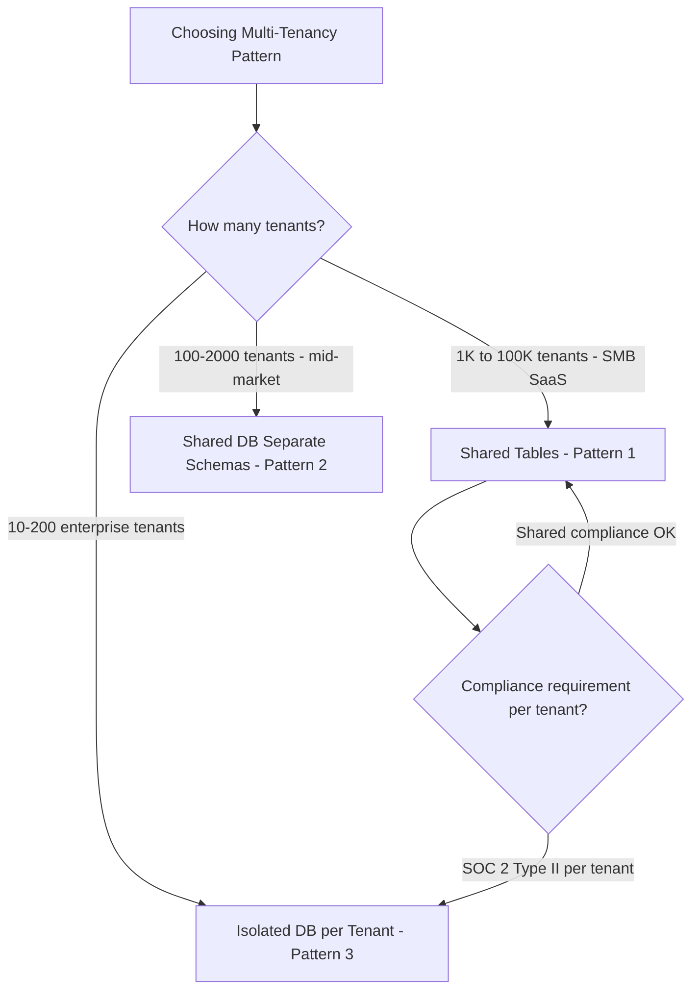

| Dimension | Shared Tables | Shared DB, Separate Schemas | Isolated DB |
|-----------|--------------|----------------------------|------------|
| Tenant density | 10,000+/DB | 100–1,000/DB | 1/DB |
| Isolation | Low (app-enforced) | Medium (schema namespace) | High (full DB boundary) |
| Monthly cost per tenant | ~$0.001 | ~$0.10 | $50–$500 |
| DDL migration speed | Single migration | N migrations (one per tenant) | N migrations + orchestration |
| Cross-tenant query support | Easy (admin analytics) | Hard (cross-schema joins) | Very hard (cross-DB) |
| Data leak risk | High (missing tenant_id filter) | Medium (schema escape bug) | Low (network isolation) |

### Pitfalls
- ❌ **Starting with isolated DB per tenant to feel safe:** If you acquire 10,000 tenants, you need 10,000 DB instances — $5M/month at $500/instance; most SaaS businesses cannot sustain this cost
- ❌ **Choosing separate schemas thinking it's as cheap as shared tables:** Every new tenant requires a schema creation + full DDL migration — adding 100 tenants per day means 100 schema migrations per day; operational overhead grows fast

### Concept Reference
→ [SQL vs NoSQL](../../../system-design/storage-and-databases/sql-vs-nosql)

---

## Q2: How do you prevent data leakage between tenants using Row-Level Security (RLS)?

**Role:** Mid | **Difficulty:** 🟡 Mid | **Priority:** P0 | **Format:** Quick Answer

> **What the interviewer is testing:** Whether you know PostgreSQL Row-Level Security as a database-enforced guarantee — not just an application-layer convention — and understand why it's safer than `WHERE tenant_id = ?`.

### Answer in 60 seconds
- **Problem with app-level tenant filter:** Every query requires `WHERE tenant_id = :current_tenant` — one developer forgets it, one query bug, one ORM misconfiguration = cross-tenant data leak affecting all tenants
- **RLS solution:** PostgreSQL policy on the table enforces tenant isolation at the DB level — even if the app forgets `WHERE tenant_id`, the DB silently filters to the current tenant's rows
- **Setup:** `ALTER TABLE orders ENABLE ROW LEVEL SECURITY` + `CREATE POLICY tenant_isolation ON orders USING (tenant_id = current_setting('app.current_tenant_id')::uuid)`; app sets `SET app.current_tenant_id = 'tenant-123'` at connection start
- **Performance:** RLS adds a predicate to every query automatically — same performance as manually adding `WHERE tenant_id = ?`; no additional overhead if `tenant_id` is indexed

### Diagram

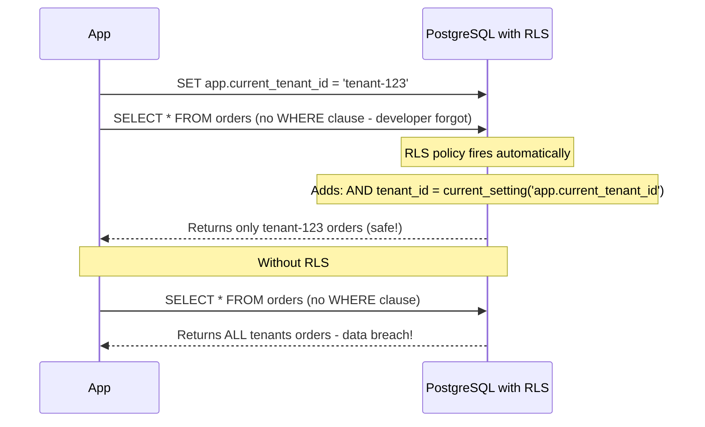

### RLS Policy Setup

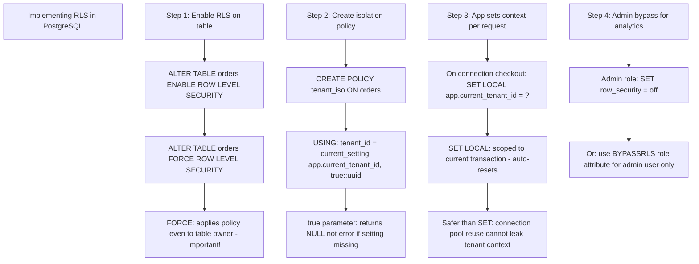

### RLS Performance Impact

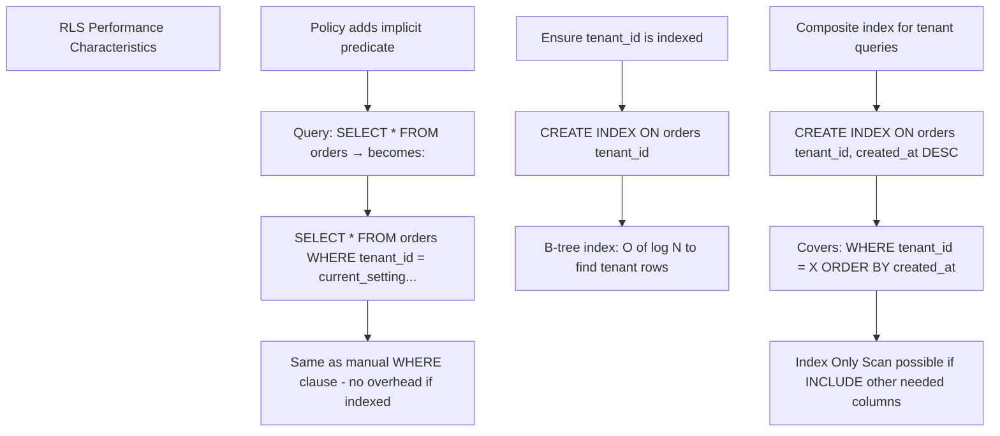

### Pitfalls
- ❌ **Not using `FORCE ROW LEVEL SECURITY`:** By default, table owners bypass RLS — the DB admin or migration user can accidentally see all tenant data; use `FORCE ROW LEVEL SECURITY` to apply the policy to everyone
- ❌ **Using `SET` instead of `SET LOCAL` in connection pools:** `SET app.current_tenant_id = 'X'` persists for the entire connection; if the connection is returned to the pool and reused by tenant Y, tenant Y's queries run with tenant X's context — always use `SET LOCAL` (transaction-scoped)

### Concept Reference
→ [SQL vs NoSQL](../../../system-design/storage-and-databases/sql-vs-nosql)

---

## Q3: How do you handle a "noisy neighbor" tenant using 80% of DB resources?

**Role:** Senior | **Difficulty:** 🔴 Senior | **Priority:** P1 | **Format:** Deep Dive

> **What the interviewer is testing:** Whether you have concrete strategies to isolate and throttle one overactive tenant without impacting the rest of the tenants sharing the database.

### Problem Constraints
| Dimension | Value |
|-----------|-------|
| Shared DB | 5,000 tenants on one PostgreSQL instance |
| Noisy tenant | Tenant X runs 500 concurrent queries, using 80% CPU |
| Other tenants | Experiencing 10x latency increase (from 20ms to 200ms) |
| Goal | Restore normal performance within 30 minutes |

### Short-Term Mitigation

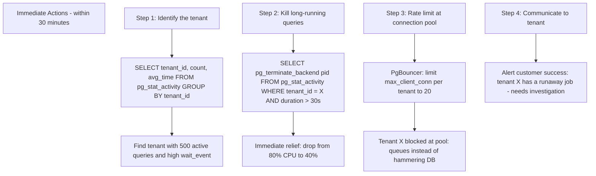

### Long-Term Architecture Fix

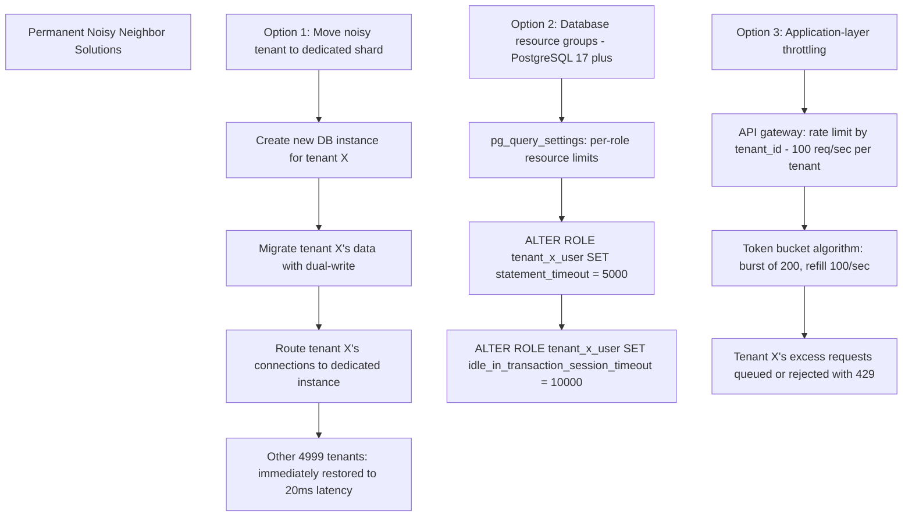

### Monitoring Setup to Prevent Recurrence

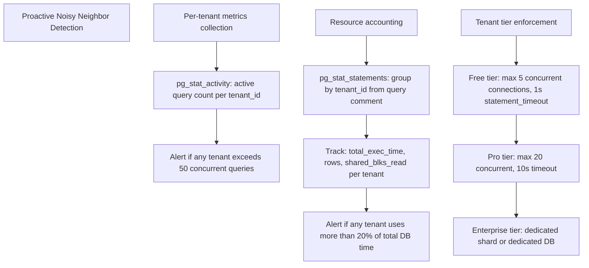

| Strategy | Time to Fix | Cost | Isolation Quality |
|----------|-------------|------|------------------|
| Kill long queries | 1 minute | Zero | Temporary |
| PgBouncer connection limit | 10 minutes | Zero | Good |
| Statement timeout per role | 10 minutes | Zero | Good |
| API rate limiting | 1 hour | Low | Good |
| Move to dedicated shard | 1–4 hours | Medium ($50–500/month) | Excellent |

### Pitfalls
- ❌ **Setting global `statement_timeout` to fix one tenant:** A global 5-second timeout kills legitimate long-running queries (reports, analytics) from other tenants — set per-role timeouts only for the problematic tenant
- ❌ **Not having per-tenant resource attribution:** If you can't identify which tenant is causing CPU spikes, you can't throttle them — add tenant_id as a query comment (`/* tenant_id=X */`) from day one so pg_stat_statements groups by tenant

### Concept Reference
→ [SQL vs NoSQL](../../../system-design/storage-and-databases/sql-vs-nosql)

---

## Q4: How do you migrate a single-tenant schema to multi-tenant without downtime?

**Role:** Senior | **Difficulty:** 🔴 Senior | **Priority:** P1 | **Format:** Deep Dive

> **What the interviewer is testing:** Whether you have a concrete zero-downtime migration plan involving dual-write, backfill, and cutover — not just "add a tenant_id column."

### Problem Constraints
| Dimension | Value |
|-----------|-------|
| Current state | Single-tenant PostgreSQL, 50M rows in `orders` table |
| Goal | Add `tenant_id` to every table; enable multi-tenant |
| Downtime budget | Zero (24/7 service) |
| Migration window | Complete within 2 weeks |

### Migration Plan

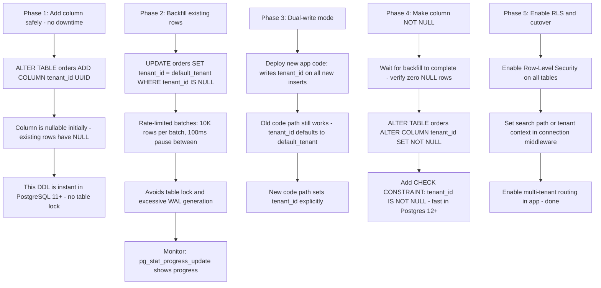

### Backfill Safety Pattern

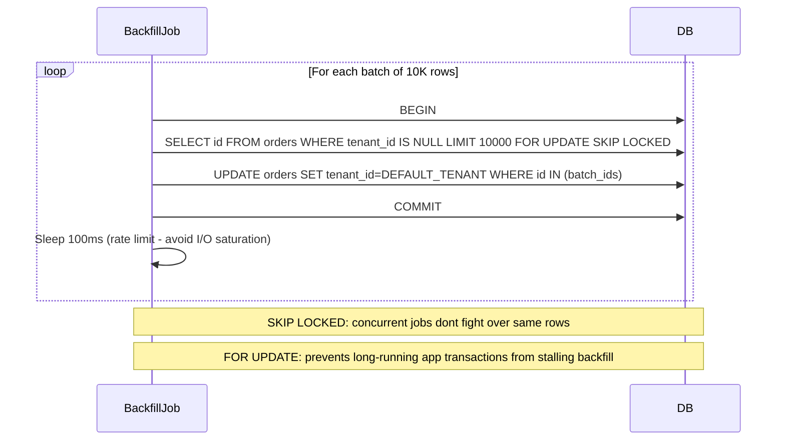

### Rollback Plan

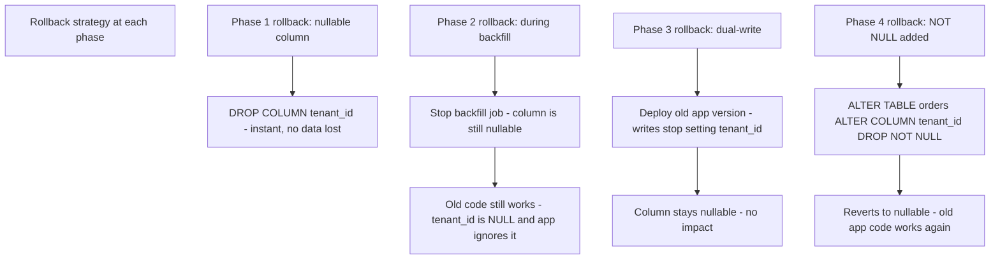

### Pitfalls
- ❌ **Running `ALTER TABLE ADD COLUMN NOT NULL DEFAULT value` on a large table:** In PostgreSQL before version 11, this rewrites the entire table and holds a lock for hours on 50M rows; in PostgreSQL 11+, column defaults are stored in catalog and the rewrite is avoided — always add nullable first, backfill, then add NOT NULL
- ❌ **Not using `SKIP LOCKED` in the backfill job:** Without SKIP LOCKED, multiple parallel backfill workers try to lock the same rows and serialize — `SKIP LOCKED` lets each worker grab a non-contended batch, enabling 4x parallel backfill speed

### Concept Reference
→ [SQL vs NoSQL](../../../system-design/storage-and-databases/sql-vs-nosql)

---

## Q5: How do you implement tenant-specific data retention and GDPR deletion?

**Role:** Senior | **Difficulty:** 🔴 Senior | **Priority:** P1 | **Format:** Quick Answer

> **What the interviewer is testing:** Whether you can design a deletion pipeline that satisfies "right to erasure" (GDPR Article 17) within the 30-day legal deadline and handles cascades across microservices.

### Answer in 60 seconds
- **GDPR Article 17 requirement:** Delete all personal data within 30 days of a deletion request; must cover all systems — DB, backups, analytics, search indexes, audit logs
- **Soft delete first:** Mark the tenant as `deleted_at=now()` immediately; this stops new data ingestion and hides the tenant from the UI while the hard delete is scheduled
- **Hard delete pipeline:** Asynchronous job processes each table in dependency order; deletes all rows with `tenant_id=X`; verifies deletion with row count check; marks tables complete in a deletion manifest
- **Backup handling:** Backups cannot be selectively deleted; document in privacy policy that backup data is retained for up to 90 days but inaccessible and overwritten within the backup rotation window

### Diagram

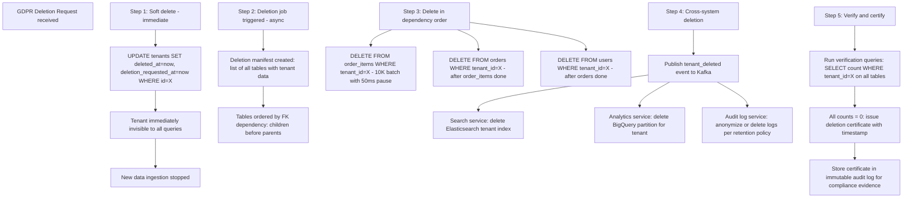

### Retention Policy Architecture

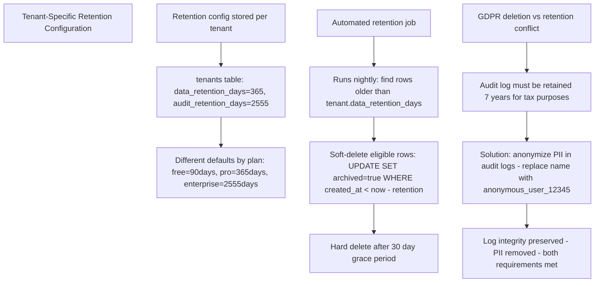

### Pitfalls
- ❌ **Deleting rows with `DELETE FROM table WHERE tenant_id=X` in one statement:** On a table with 50M rows for tenant X, this holds a huge transaction lock and generates massive WAL — always batch delete in 10,000-row chunks with pauses
- ❌ **Forgetting derived data in analytics and search:** GDPR covers all systems that store personal data — deleting from PostgreSQL while leaving the tenant's data in Elasticsearch, S3 data lake, and BI warehouse is a GDPR violation; the Kafka event approach ensures all consumers handle deletion

### Concept Reference
→ [SQL vs NoSQL](../../../system-design/storage-and-databases/sql-vs-nosql)

---

## Q6: How does Salesforce serve 150K tenants with shared Oracle databases?

**Role:** Staff | **Difficulty:** ⚫ Staff | **Priority:** P2 | **Format:** Quick Answer

> **What the interviewer is testing:** Whether you can describe a real production multi-tenant architecture that handles enterprise-scale isolation on shared infrastructure — with specific technical details.

### Answer in 60 seconds
- **Scale:** 150,000+ tenants (orgs), billions of records, Oracle RAC clusters shared across thousands of tenants per pod
- **Metadata-driven schema:** Salesforce does not create actual Oracle tables per tenant; instead, a generic `Data` table with columns `val0` through `val500` stores all tenant data; a `Fields` metadata table maps tenant-defined field names to column slots
- **Tenant isolation:** Every row in every table has an `OrgId` column; all queries are automatically filtered by `OrgId = :current_org_id` via query rewriting in the Salesforce application tier
- **Pods:** Tenants are grouped into "pods" — Oracle RAC clusters of ~3 nodes; each pod serves 5,000–10,000 tenants; a pod failure affects only its tenants (blast radius isolation)
- **Elasticity:** Adding a new tenant is a metadata operation — insert a row into tenant registry, assign to a pod; no DDL migration, no table creation

### Salesforce Architecture

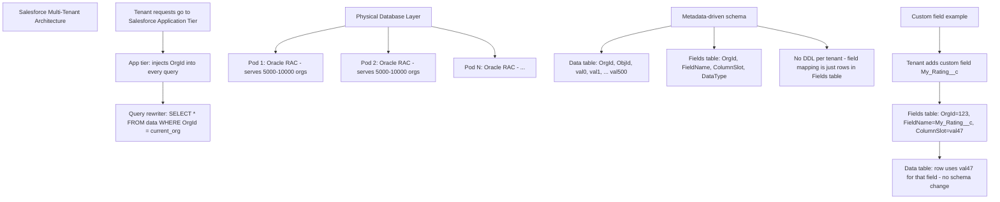

### Universal Polymorphic Table Trade-offs

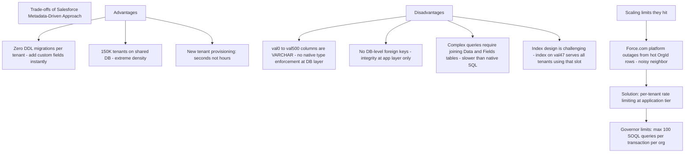

### Pod Architecture

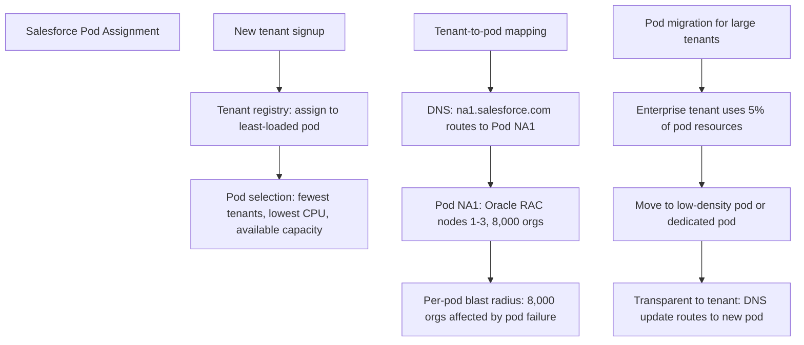

### What a great answer includes
- [ ] The EAV (Entity-Attribute-Value) model: Salesforce's `val0–val500` is a form of EAV — a common but controversial pattern for dynamic schemas; the alternative is JSON columns (PostgreSQL JSONB), which Salesforce avoids for legacy Oracle compatibility
- [ ] Governor limits as architectural necessity: without the 100-SOQL-query governor limit, one tenant's Apex code could exhaust pod resources; governor limits are enforced at the application tier, not DB layer
- [ ] Why Oracle and not PostgreSQL: Salesforce was built in 2000 on Oracle; migrating 150K tenants' data from Oracle to any other DB is a multi-year project with enormous risk — legacy lock-in at architectural scale
- [ ] Hyperforce: Salesforce's newer infrastructure runs on public cloud (AWS, Azure, GCP) with a redesigned multi-tenant stack using modern PostgreSQL-based storage; legacy pods remain Oracle

### Pitfalls
- ❌ **Copying Salesforce's EAV model for a new SaaS product:** EAV was the right choice in 2000 without JSONB support; today, PostgreSQL JSONB with GIN indexes gives tenant-defined dynamic schemas with proper typing and indexing at far lower complexity
- ❌ **Ignoring governor limits as a product design requirement:** If you build shared infrastructure without per-tenant rate limits, one enterprise customer's scheduled batch job will degrade all other tenants — governor limits are not just a feature, they are a necessity for shared infrastructure

### Concept Reference
→ [SQL vs NoSQL](../../../system-design/storage-and-databases/sql-vs-nosql)
