# Query Optimization

7 questions covering EXPLAIN output, N+1 queries, index strategies, join optimization, query plan caching, and PostgreSQL planner internals.

---

## Q1: How do you use EXPLAIN to understand why a query is slow?

**Role:** Mid | **Difficulty:** 🟡 Mid | **Priority:** P0 | **Format:** Quick Answer

> **What the interviewer is testing:** Whether you can read a query execution plan and identify the specific node causing the slowdown — not just "add an index."

### Answer in 60 seconds
- **EXPLAIN:** Shows the planned execution strategy — which indexes the planner chose, join order, estimated row counts; no query is actually executed
- **EXPLAIN ANALYZE:** Runs the query and shows actual vs estimated rows, actual time per node — the key diagnostic tool
- **Critical fields:** `Seq Scan` means full table scan (bad for large tables); `Index Scan` uses an index; `Bitmap Heap Scan` uses index then fetches pages in disk order; `cost=X..Y` shows estimated cost; `rows=N` shows estimated row count
- **Mismatch diagnosis:** If `rows=10` (estimated) vs `actual rows=500000`, the planner has bad statistics — run `ANALYZE tablename` to refresh
- **Slowest node:** Look for nodes with highest `actual time` — fix those first; a `Seq Scan` on a 50M-row table with `actual time=0.020..18340` is the bottleneck

### Diagram

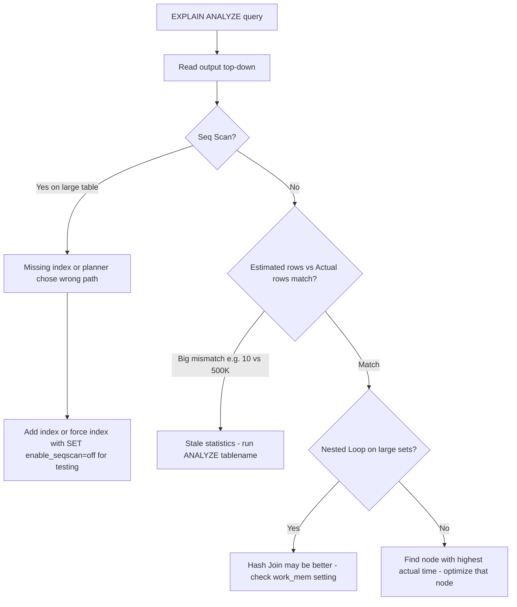

### EXPLAIN Output Reference

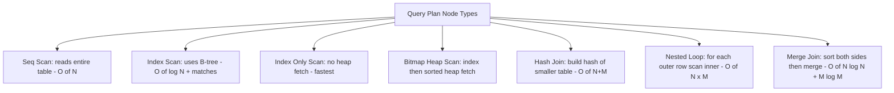

### Key Numbers
| Node Type | When Used | Relative Cost |
|-----------|-----------|---------------|
| Index Only Scan | Covering index — no heap access | 1x (baseline) |
| Index Scan | Index exists, moderate selectivity | 2–5x |
| Bitmap Heap Scan | Low-selectivity index, multiple indexes combined | 3–8x |
| Seq Scan | No usable index, or planner prefers it for >30% table reads | 10–1000x on large tables |

### Pitfalls
- ❌ **Using EXPLAIN without ANALYZE:** EXPLAIN alone shows the *plan* with estimated costs — only `EXPLAIN ANALYZE` shows actual execution time and row counts; a plan that looks good can still be slow
- ❌ **Ignoring row count mismatches:** If estimated rows=10 but actual rows=500,000, the planner made a catastrophically wrong join order or index decision; fix statistics with `ANALYZE`, not the query

### Concept Reference

---

## Q2: What is the N+1 query problem and how do you detect and fix it?

**Role:** Mid | **Difficulty:** 🟡 Mid | **Priority:** P0 | **Format:** Quick Answer

> **What the interviewer is testing:** Whether you understand the most common ORM-related performance antipattern and can identify it in production.

### Answer in 60 seconds
- **Definition:** Fetching N records then executing 1 additional query per record = N+1 total queries; e.g., fetch 100 blog posts then run 100 separate queries to get each post's author
- **Detection:** Query count spike — a page that should need 2-3 queries suddenly executes 101 queries; use slow query log, ORM debug logging, or APM tools (Datadog, New Relic) to see per-request query counts
- **Fix in ORMs:** Use `JOIN` (eager loading) — Rails: `Post.includes(:author)`; Django: `Post.objects.select_related('author')`; JPA: `@EntityGraph` or `JOIN FETCH`; this reduces 101 queries to 1
- **Impact:** 100 rows × 1ms each = 100ms added latency; at 1000 rows × 5ms DB RTT = 5 seconds per request

### Diagram

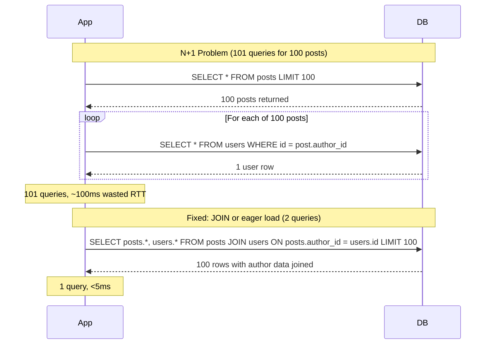

### Detection Checklist

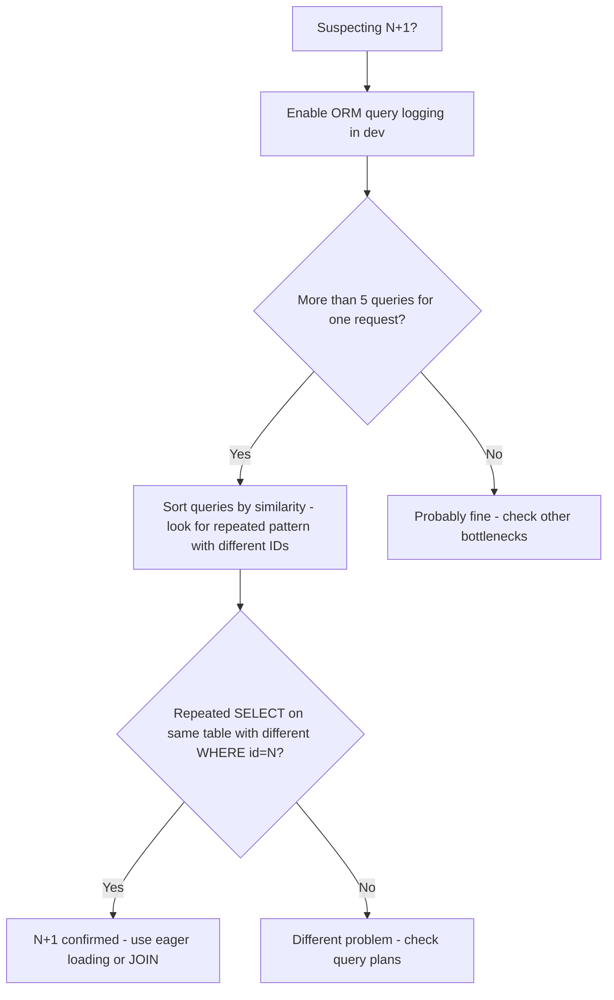

### Pitfalls
- ❌ **Fixing N+1 by adding a cache per ID:** Caching `get_user(id)` reduces DB load but still executes N function calls and N cache lookups — batch with `get_users_by_ids([id1, id2...])` using `WHERE id IN (...)` instead
- ❌ **Eager loading everything always:** Over-eager loading 10 related tables when you only need 1 causes a massive JOIN returning far more data than needed — profile first, then eager load only what the endpoint uses

### Concept Reference

---

## Q3: How do you optimize a query that scans 100M rows to return 10 results?

**Role:** Senior | **Difficulty:** 🔴 Senior | **Priority:** P1 | **Format:** Deep Dive

> **What the interviewer is testing:** Whether you can systematically diagnose and fix a large-table query using indexes, query rewrites, and partitioning — not just "add an index."

### Problem Constraints
| Dimension | Value |
|-----------|-------|
| Table size | 100M rows, ~200GB |
| Query goal | Return top 10 by score for a given category |
| Current p99 | 45 seconds (full table scan) |
| Target p99 | < 100ms |

### Approach A — Composite Index

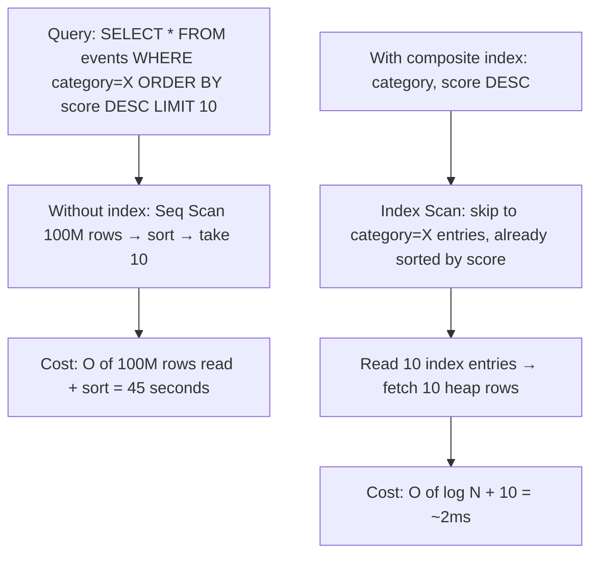

### Approach B — Partial Index

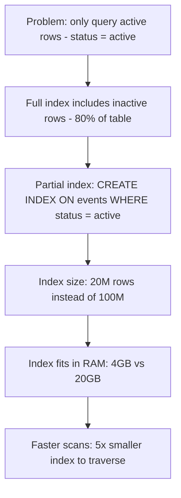

### Approach C — Table Partitioning

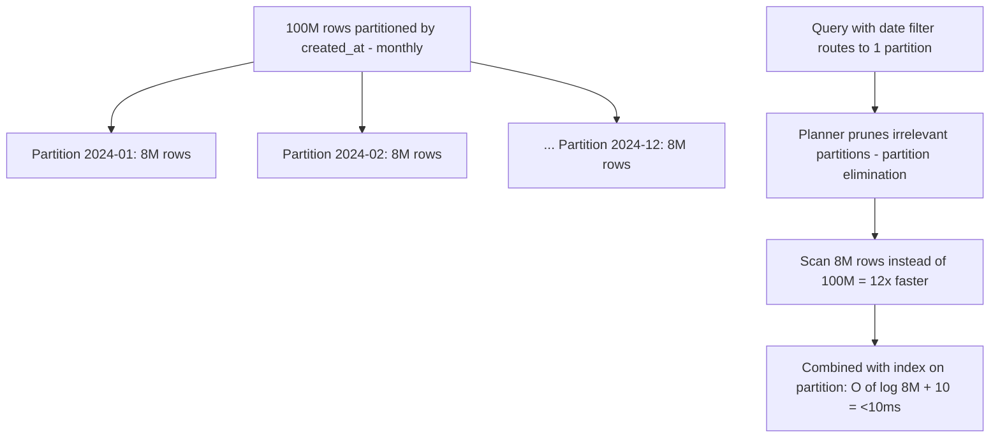

| Approach | Index Size | Query Time | Best For |
|----------|------------|------------|----------|
| No index | 0 | 45s (seq scan) | Never on large tables |
| Composite index (category, score) | ~8GB | ~2ms | Queries filtering by category |
| Partial index (WHERE active) | ~1.6GB | ~1ms | Queries with fixed WHERE condition |
| Partitioning + index | ~0.6GB per partition | <10ms | Time-series, archive old data |

### Recommended Answer
Add a **composite index** on `(category, score DESC)` to avoid the sort and let PostgreSQL use an index-only scan. If the table is append-heavy (logs, events), add **range partitioning by created_at** to enable partition pruning. Partial indexes help when most queries target a subset (e.g., `status='active'`).

### What a great answer includes
- [ ] Composite index column order matters: filter columns first (category), then sort column (score DESC)
- [ ] LIMIT pushdown: PostgreSQL stops scanning the index after finding 10 matching rows — no full index scan needed
- [ ] covering index: include all SELECT columns in the index to enable Index Only Scan (zero heap access)
- [ ] `pg_stat_user_indexes` to check index usage: an index with `idx_scan=0` after 30 days is unused and wastes write overhead

### Pitfalls
- ❌ **Adding an index on only the ORDER BY column:** `CREATE INDEX ON events(score)` doesn't help if the WHERE clause on `category` still requires a heap scan of 100M rows first
- ❌ **Not measuring index size vs RAM:** An index larger than RAM causes disk thrashing — a 20GB index on a server with 16GB RAM is slower than no index for some queries; right-size with partial indexes

### Concept Reference

---

## Q4: When does a covering index eliminate a table scan entirely?

**Role:** Senior | **Difficulty:** 🔴 Senior | **Priority:** P1 | **Format:** Quick Answer

> **What the interviewer is testing:** Whether you understand Index Only Scan and can design covering indexes to eliminate heap access entirely.

### Answer in 60 seconds
- **Covering index:** An index that includes all columns referenced by a query (WHERE, ORDER BY, SELECT) — the query engine never needs to access the actual table heap
- **Trigger:** PostgreSQL uses `Index Only Scan` when (1) all needed columns are in the index, (2) the visibility map shows the page is all-visible (no dead tuples need MVCC check)
- **How to create:** `CREATE INDEX ON orders (customer_id, status) INCLUDE (amount, created_at)` — `INCLUDE` adds non-key columns for covering purposes only
- **Impact:** Eliminates random I/O to heap pages; for a query touching 100K rows, reduces I/O by 80–95%; reduces p99 from 200ms to 8ms in typical OLTP workloads

### Diagram

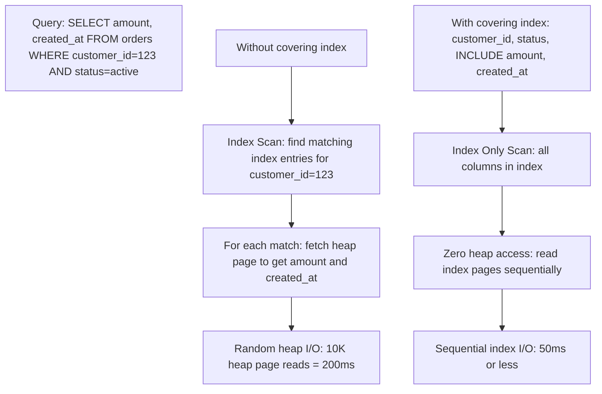

### Visibility Map Interaction

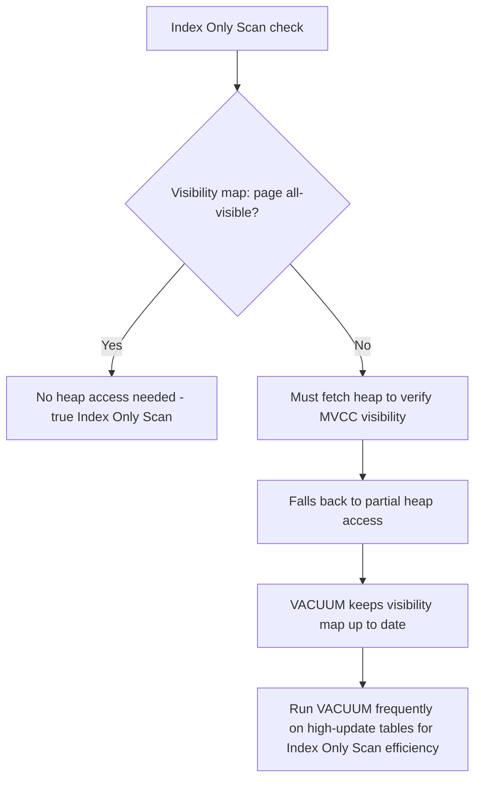

### Pitfalls
- ❌ **Including too many columns in the index:** A covering index with 8 columns is nearly as wide as the table row itself — write overhead doubles, index no longer fits in RAM; cover only the hot queries
- ❌ **Expecting Index Only Scan on tables with high UPDATE rate:** Frequent updates invalidate the visibility map — PostgreSQL falls back to heap checks, negating the Index Only Scan benefit; run AUTOVACUUM more aggressively

### Concept Reference

---

## Q5: How do you optimize a join between a 10M-row and 100-row table?

**Role:** Senior | **Difficulty:** 🔴 Senior | **Priority:** P1 | **Format:** Quick Answer

> **What the interviewer is testing:** Whether you understand join algorithm selection and can guide the planner to the right choice with accurate statistics and proper indexes.

### Answer in 60 seconds
- **Correct algorithm:** Hash join — build a hash table from the small 100-row table in memory (fits entirely in `work_mem`), probe with each row from the 10M-row table; total cost = O(100 + 10M) = near-linear on the large table
- **Wrong choice (Nested Loop):** For each of 10M rows, look up the 100-row table — O(10M × log 100) = acceptable IF the inner table is indexed, but planner sometimes picks this when statistics are stale
- **Planner guidance:** Ensure statistics are fresh (`ANALYZE`); set `work_mem` high enough for the hash table (100 rows × avg row size = trivially small); check EXPLAIN to confirm Hash Join is chosen
- **Real numbers:** Hash join on 10M × 100 = ~2s; Nested Loop with bad plan = ~15s; index scan on large table joining to small table = ~300ms

### Diagram

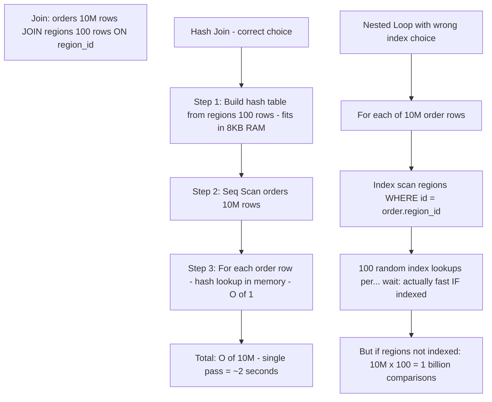

### When Planner Gets It Wrong

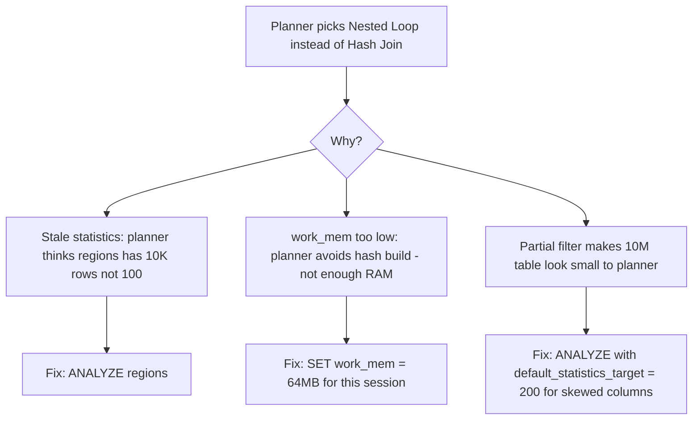

### Pitfalls
- ❌ **Indexing the small table's join column assuming it helps:** An index on `regions.id` (100 rows) saves microseconds; the planner may still choose a full scan of regions to build a hash — the large table's join column index is what matters for Nested Loop
- ❌ **Lowering `work_mem` globally:** Setting `work_mem=4MB` forces the planner to avoid hash joins on anything larger than 4MB — one large report query then spills to disk and takes 10x longer; set `work_mem` per-session for heavy queries

### Concept Reference

---

## Q6: What is query plan caching and when does it hurt (parameter sniffing)?

**Role:** Senior | **Difficulty:** 🔴 Senior | **Priority:** P1 | **Format:** Deep Dive

> **What the interviewer is testing:** Whether you understand that cached query plans optimize for the first set of parameters and can be catastrophically wrong for different data distributions.

### Problem Constraints
| Dimension | Value |
|-----------|-------|
| Table | orders — 50M rows |
| Customer A | 2 orders (0.000004% of rows) |
| Customer B | 8M orders (16% of rows) |
| Cached plan optimized for | Customer A's data distribution |

### How Plan Caching Works

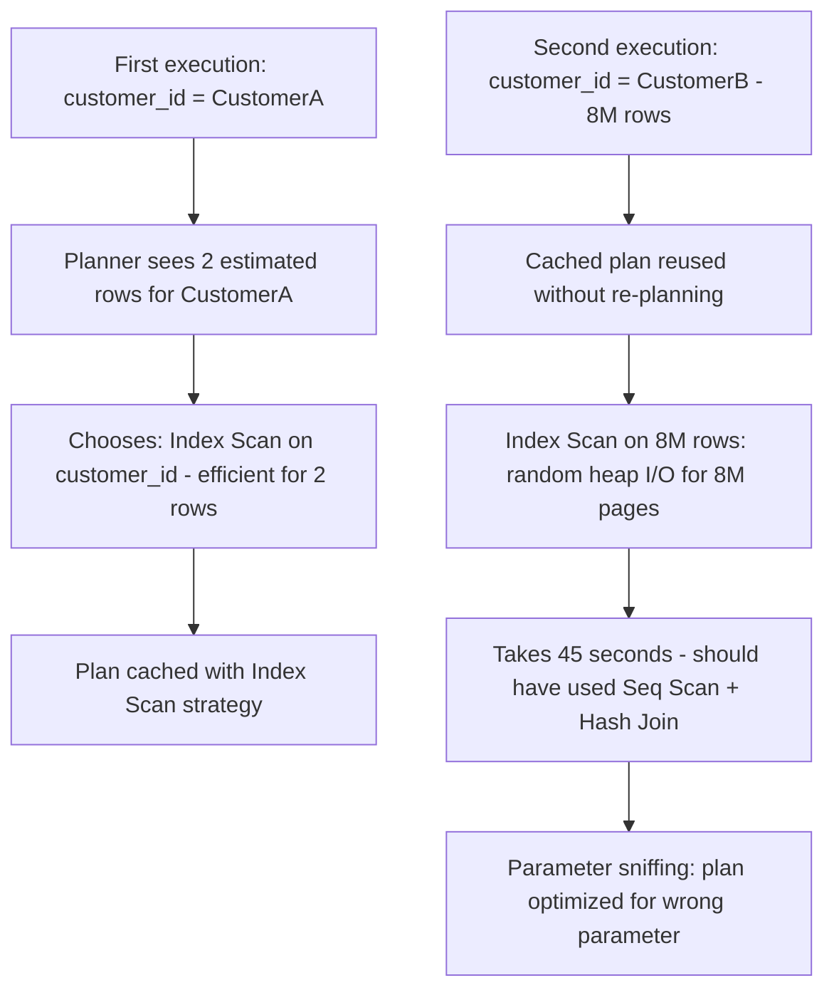

### Fix Strategies

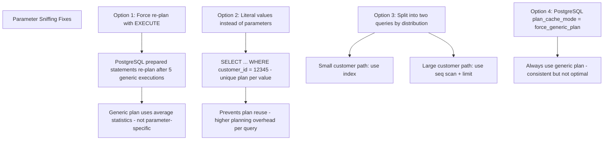

| Strategy | Pros | Cons |
|----------|------|------|
| Let PostgreSQL re-plan (default) | Auto-adapts after 5 executions | 5 slow executions before correction |
| Literal values | Optimal plan per parameter | Higher parse/plan overhead per query |
| Application-level routing | Full control over plan choice | More application complexity |
| `plan_cache_mode=force_custom_plan` | Always optimal per parameter | Re-planning overhead on every execution |

### Recommended Answer
PostgreSQL's prepared statement planner runs a generic plan after 5 parameter-specific executions. For highly skewed data (some customers have 100x more data than others), force custom plans per execution with `plan_cache_mode = force_custom_plan` for the critical query, or split the code path in the application layer based on customer tier.

### What a great answer includes
- [ ] SQL Server's parameter sniffing is worse: caches the first plan permanently until `sp_recompile` or manual clearing
- [ ] PostgreSQL threshold: after 5 executions with specific parameters, PostgreSQL switches to a generic plan — different from SQL Server's permanent cache
- [ ] Detection: query takes 2ms for one customer_id, 45s for another — same query, same index, different plan suitability
- [ ] Hint: `pg_stat_statements` shows queries with high variance in execution time — flag for parameter sniffing investigation

### Pitfalls
- ❌ **Blaming the index when parameter sniffing is the cause:** The index is correct; the cached plan that chose it for all parameter values is wrong — don't drop or rebuild the index
- ❌ **Setting `force_custom_plan` globally:** Re-planning every prepared statement on every execution adds 1–5ms overhead per query — apply only to queries with skewed data distributions

### Concept Reference

---

## Q7: How does PostgreSQL's planner choose between hash join, nested loop, and merge join?

**Role:** Staff | **Difficulty:** ⚫ Staff | **Priority:** P2 | **Format:** Deep Dive

> **What the interviewer is testing:** Whether you understand the cost model the PostgreSQL planner uses and can predict or influence join algorithm selection.

### Problem Constraints
| Dimension | Value |
|-----------|-------|
| Table A | 10M rows, 5GB |
| Table B | 100K rows, 50MB |
| Join type | Equi-join on user_id |
| `work_mem` | 64MB |

### Join Algorithm Decision Tree

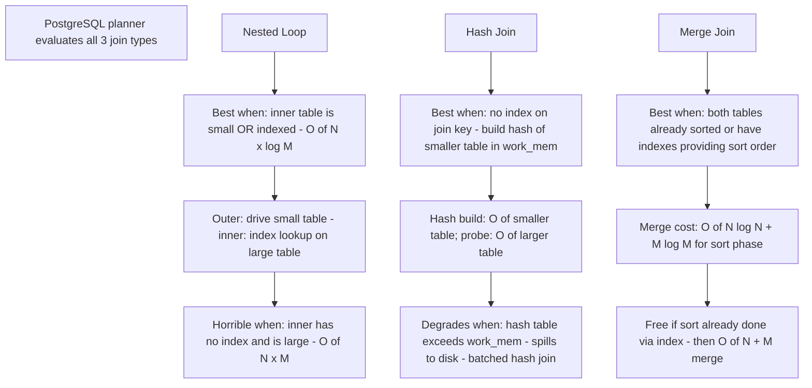

### Cost Model Visualization

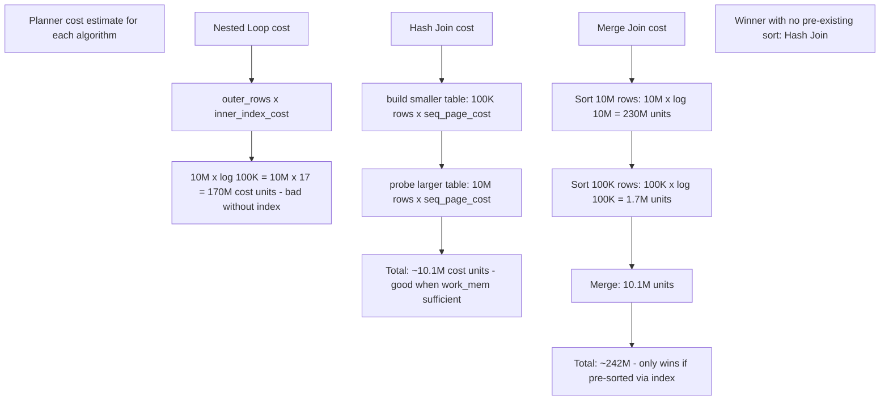

### Influencing the Planner

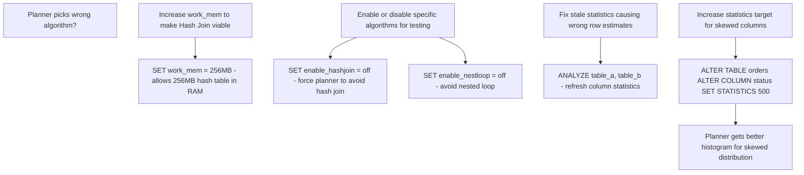

| Algorithm | Time Complexity | Memory | Best Scenario |
|-----------|----------------|--------|---------------|
| Nested Loop | O(N × log M) with index | Minimal | Small outer, indexed inner |
| Hash Join | O(N + M) | O(smaller table) | Large tables, no pre-sort |
| Merge Join | O(N log N + M log M) | O(sort buffer) | Pre-sorted or indexed join cols |

### What a great answer includes
- [ ] `seq_page_cost` vs `random_page_cost`: PostgreSQL defaults to `random_page_cost=4` — tuning this to `1.1` for SSD changes which algorithm wins; SSDs have near-equal random/sequential cost
- [ ] Hash join batching: when hash table exceeds `work_mem`, PostgreSQL splits into batches and reads table multiple times — each batch doubling = 2x extra I/O
- [ ] `enable_*` parameters are for debugging only, not production hints — use `pg_hint_plan` extension for production query hints
- [ ] Planner statistics: `pg_stats` view shows column statistics; `correlation` near 1.0 means data is physically ordered — merge join benefits most from high correlation

### Pitfalls
- ❌ **Setting random_page_cost=4 (default) on SSD storage:** Default assumes HDD random I/O is 4x slower than sequential; SSD random I/O is 1.1x slower — keeping 4.0 causes planner to under-value index scans and choose seq scans instead
- ❌ **Disabling hash joins globally to fix one query:** `SET enable_hashjoin = off` at the session level makes all joins in that session avoid hash join — fix statistics or adjust `work_mem` instead; disabling algorithms globally degrades unrelated queries

### Concept Reference
