# SQL vs NoSQL Decisions

10 questions covering when to use relational vs non-relational databases, ACID vs BASE, and polyglot persistence.

---

## Q1: When do you choose SQL vs NoSQL?

**Role:** Junior / Backend | **Difficulty:** 🟢 Junior | **Priority:** P0 | **Format:** Quick Answer

> **What the interviewer is testing:** Whether you understand the fundamental trade-offs and can apply them to a concrete scenario rather than defaulting to one technology.

### Answer in 60 seconds
- **Choose SQL when:** Data has clear relationships, you need ACID guarantees, queries are ad-hoc and unpredictable — PostgreSQL handles ~10K TPS on a single node
- **Choose NoSQL when:** You need horizontal scale beyond ~5TB, schema is highly variable, access patterns are known and simple — DynamoDB handles 10M+ RPS at Amazon
- **Key signal:** If you're joining more than 3 tables in every hot query, SQL's relational model is working against you at scale
- **Operational reality:** SQL has 50+ years of tooling (backups, migrations, ORMs); NoSQL ecosystems are younger and more operationally complex

### Diagram

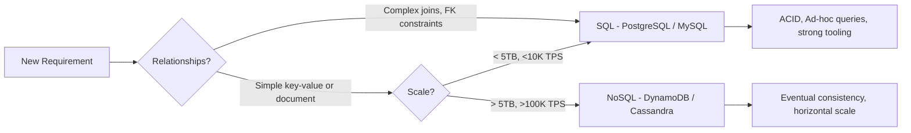

### Pitfalls
- ❌ **Choosing NoSQL by default for new projects:** Most apps never exceed PostgreSQL's limits — premature NoSQL adds operational complexity without benefit
- ❌ **Ignoring query patterns:** SQL is designed for flexible queries; NoSQL forces you to design schema around access patterns — changing patterns later requires data migrations

### Concept Reference

---

## Q2: What are the ACID properties and why do they matter?

**Role:** Mid / Backend | **Difficulty:** 🟡 Mid | **Priority:** P0 | **Format:** Quick Answer

> **What the interviewer is testing:** Whether you can explain ACID concretely with failure scenarios, not just recite the acronym.

### Answer in 60 seconds
- **Atomicity:** All operations in a transaction succeed or all are rolled back — a bank transfer either moves money in both accounts or neither (no partial deduction)
- **Consistency:** A transaction brings the DB from one valid state to another — a constraint preventing negative balances is enforced at transaction boundary
- **Isolation:** Concurrent transactions behave as if they ran serially — two users booking the last seat don't both succeed (depends on isolation level)
- **Durability:** Once committed, a transaction survives crashes — PostgreSQL uses Write-Ahead Logging (WAL) to ensure durability with ~1ms fsync overhead

### Diagram

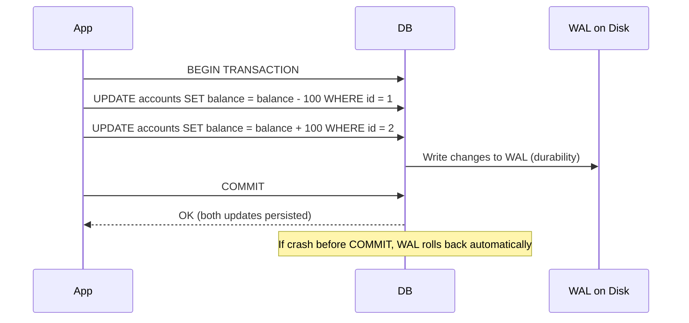

### Pitfalls
- ❌ **Assuming NoSQL has no consistency:** DynamoDB offers strong consistency per-item; it's cross-item transactions that are limited
- ❌ **Ignoring isolation level cost:** SERIALIZABLE isolation is fully ACID-safe but can reduce throughput by 50-80% due to lock contention

### Concept Reference

---

## Q3: How do you design a schema for multi-tenant SaaS with both SQL and NoSQL?

**Role:** Senior | **Difficulty:** 🔴 Senior | **Priority:** P0 | **Format:** Deep Dive

> **What the interviewer is testing:** Your ability to combine SQL for transactional data and NoSQL for flexible/high-volume data, with data isolation between tenants.

### Problem Constraints
| Dimension | Value |
|-----------|-------|
| Tenants | 500 companies |
| Records per tenant | 10K–10M (varies 1000x) |
| Query latency SLA | p99 < 100ms |
| Write throughput | 50K events/sec peaks |

### Approach A — Shared SQL for all data

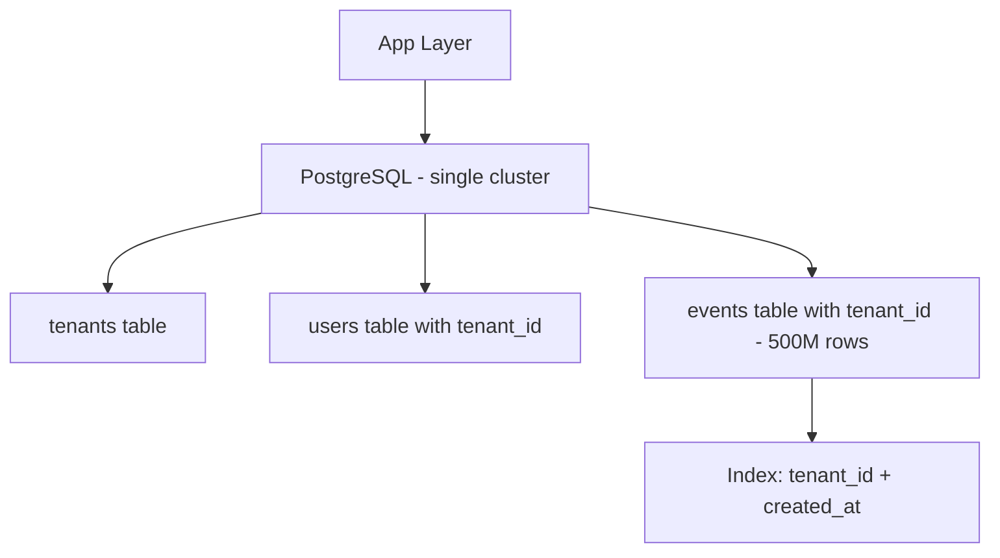

| Dimension | Approach A (Shared SQL) | Approach B (SQL + NoSQL) |
|-----------|------------------------|--------------------------|
| Operational complexity | Low | Medium |
| Query flexibility | High | Medium (NoSQL restricted) |
| Write throughput | ~10K TPS max | 500K+ TPS |
| Tenant isolation | Row-level (tenant_id) | Schema + physical isolation |
| Cost at 10M events/day | Low (single DB) | Medium (two systems) |

### Approach B — SQL for core, NoSQL for high-volume events

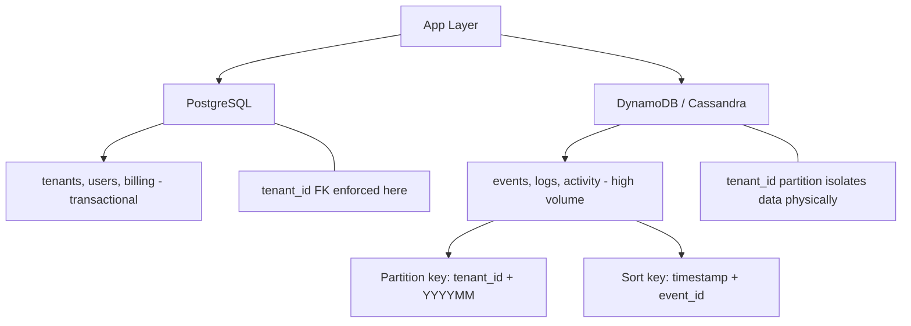

### Recommended Answer
Use **Approach B** for SaaS at scale: PostgreSQL for user/billing/config data where ACID and ad-hoc queries matter, and DynamoDB/Cassandra for event-driven data that grows unboundedly. The partition key in NoSQL provides natural tenant isolation. Small SaaS (<1M rows total) should start with Approach A to reduce complexity.

### What a great answer includes
- [ ] Tenant isolation strategy in both databases (tenant_id as first-class citizen in every query)
- [ ] Access pattern analysis before choosing NoSQL schema (know your 3 most common queries)
- [ ] Migration path from shared SQL to polyglot as tenant count grows past 100
- [ ] Connection pool sizing — 500 tenants × 10 connections = 5,000 connections, requires PgBouncer

### Pitfalls
- ❌ **Storing transactional data in NoSQL:** Order totals, billing records, and refunds need ACID — DynamoDB transactions are limited to 25 items and have 2x cost
- ❌ **No tenant_id in every index:** Missing tenant_id as first column in composite indexes means full scans across all tenants' data

### Concept Reference

---

## Q4: When would you use a document DB vs relational DB?

**Role:** Mid | **Difficulty:** 🟡 Mid | **Priority:** P1 | **Format:** Quick Answer

> **What the interviewer is testing:** Whether you can identify the specific access patterns and data shapes that favor document databases.

### Answer in 60 seconds
- **Document DB wins when:** Data is naturally hierarchical (user profile with nested addresses, preferences, history), schema varies per record (product catalog with different attributes per category), reads are predominantly by primary key
- **Relational wins when:** You need cross-document joins, data is heavily normalized (one source of truth per entity), ad-hoc analytics queries are frequent
- **Concrete example:** An e-commerce product catalog (10M SKUs, each with different attributes) fits MongoDB well; the order and payment tables belong in PostgreSQL
- **Scale threshold:** MongoDB handles 100K reads/sec on a sharded cluster; PostgreSQL handles ~50K reads/sec with read replicas

### Diagram

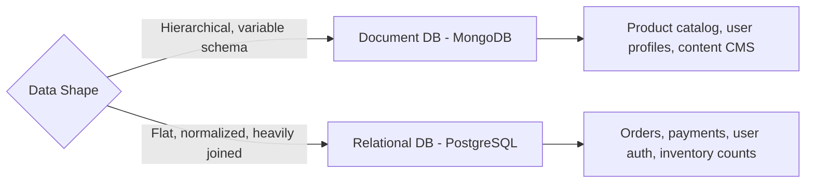

### Pitfalls
- ❌ **Using document DB for relational data:** Storing order items inside the order document then querying by item — requires scanning every order, no efficient join
- ❌ **Embedding unbounded arrays:** Embedding all comments inside a post document; MongoDB's 16MB document limit causes failures at ~50K comments

### Concept Reference

---

## Q5: What is BASE consistency and when is it acceptable?

**Role:** Mid | **Difficulty:** 🟡 Mid | **Priority:** P1 | **Format:** Quick Answer

> **What the interviewer is testing:** Whether you understand the practical implications of eventual consistency and can identify which business scenarios tolerate it.

### Answer in 60 seconds
- **BASE stands for:** Basically Available, Soft state, Eventually consistent — DynamoDB, Cassandra, and most NoSQL systems operate here by default
- **Basically Available:** The system responds (possibly with stale data) even during partial failures — availability over consistency per CAP theorem
- **Soft state:** The system state may change over time even without new input (replicas converging)
- **Eventually consistent:** Given no new writes, all replicas converge to the same value — Cassandra converges in milliseconds to seconds under normal conditions
- **Acceptable for:** Social media likes/views (off by 1000 is fine), product view counts, recommendation scores, activity feeds — anything where stale data doesn't cause financial or safety harm

### Diagram

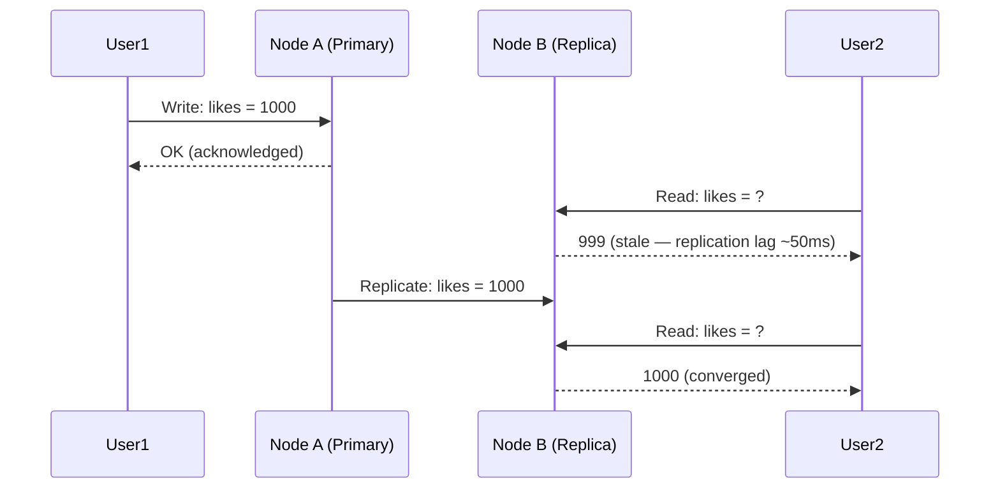

### Pitfalls
- ❌ **Using BASE for financial transactions:** A bank balance update with eventual consistency can show wrong balance, enabling overdrafts — always use ACID for money
- ❌ **Assuming "eventually" means fast:** Under network partition, Cassandra replication can lag seconds to minutes — design your UX for this

### Concept Reference

---

## Q6: How do you migrate from SQL to NoSQL without downtime?

**Role:** Senior | **Difficulty:** 🔴 Senior | **Priority:** P1 | **Format:** Deep Dive

> **What the interviewer is testing:** Your ability to plan a live, zero-downtime data migration between fundamentally different storage models.

### Problem Constraints
| Dimension | Value |
|-----------|-------|
| Table size | 200M rows, 500GB |
| Current write rate | 5,000 writes/sec |
| Downtime budget | 0 (SLA: 99.99%) |
| Migration window | 2–4 weeks |

### Approach A — Big Bang Migration (not recommended)

### Approach B — Dual-Write with Backfill (recommended)

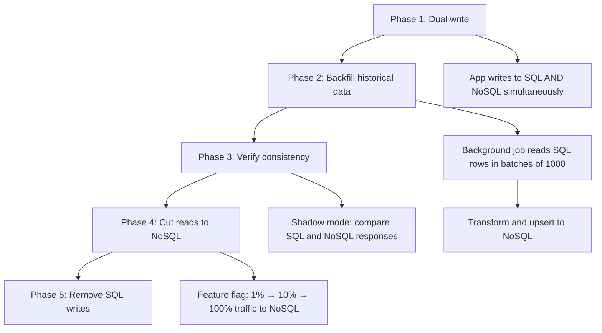

| Dimension | Approach A (Big Bang) | Approach B (Dual-Write) |
|-----------|----------------------|------------------------|
| Downtime | Hours–days | Zero |
| Risk | Very high | Low (rollback at any phase) |
| Duration | 1 day | 2–4 weeks |
| Complexity | Low | High |
| Data consistency | Point-in-time snapshot | Continuous verification |

### Recommended Answer
Always use **Approach B** (dual-write + backfill) for live systems. Dual writes start immediately after deploying new app code. The backfill job processes at ~10K rows/sec with rate limiting to avoid SQL overload. Shadow mode comparison catches 100% of schema transformation bugs before any user is affected. Use feature flags to gradually shift reads. Never delete SQL data until NoSQL has been primary for 2+ weeks.

### What a great answer includes
- [ ] Dual-write strategy with write ordering (write SQL first, NoSQL second for consistency during transition)
- [ ] Backfill rate limiting to avoid CPU saturation on source DB
- [ ] Consistency verification: hash comparison on 1% sample of records
- [ ] Rollback plan at each phase (can revert in <5 minutes by flipping feature flag)
- [ ] Data schema transformation logic (SQL columns → document fields)

### Pitfalls
- ❌ **Writing NoSQL first in dual-write:** If SQL write fails, NoSQL has phantom data — always write canonical store first
- ❌ **No consistency checks:** Silent data corruption during migration is hard to detect without automated diffing

### Concept Reference

---

## Q7: When is Cassandra better than DynamoDB?

**Role:** Senior | **Difficulty:** 🔴 Senior | **Priority:** P1 | **Format:** Quick Answer

> **What the interviewer is testing:** Whether you understand operational trade-offs between self-managed and managed NoSQL, not just feature differences.

### Answer in 60 seconds
- **Cassandra wins when:** Write throughput exceeds 1M writes/sec (cheaper than DynamoDB at that scale), you need custom compaction strategies, multi-cloud or on-prem deployment is required
- **DynamoDB wins when:** You want zero operational burden, traffic is spiky (auto-scaling handles 0 to 1M RPS in minutes), team is small
- **Cost crossover:** DynamoDB costs ~$1.25/M writes; Cassandra on EC2 is ~$0.10/M writes at scale but requires DBA expertise
- **Latency:** Both achieve p99 < 10ms for single-partition reads; Cassandra allows tunable consistency (ONE = fastest, ALL = slowest); DynamoDB offers eventual or strong per-request

### Diagram

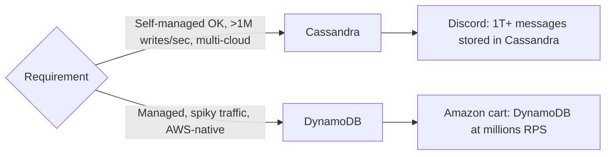

### Pitfalls
- ❌ **Choosing Cassandra without operational expertise:** Cassandra requires tuning compaction, heap GC, and repair cycles — without a DBA it becomes a liability
- ❌ **Ignoring DynamoDB's 400KB item limit:** Large items (video metadata, documents) will hit this limit and require splitting

### Concept Reference

---

## Q8: How do you handle polyglot persistence (multiple DB types)?

**Role:** Senior | **Difficulty:** 🔴 Senior | **Priority:** P2 | **Format:** Quick Answer

> **What the interviewer is testing:** Whether you can architect a system with multiple specialized databases and manage the consistency and operational complexity that introduces.

### Answer in 60 seconds
- **Pattern:** Each service owns one database type optimized for its access patterns — user service uses PostgreSQL (ACID), search uses Elasticsearch, session store uses Redis, activity feed uses Cassandra
- **Data sync:** Use event streaming (Kafka) to propagate changes across databases — a user update writes to PostgreSQL, publishes to Kafka, consumers update Elasticsearch and Redis
- **Consistency boundary:** Each database is eventually consistent with others; design APIs to tolerate up to 1-2 second lag between systems
- **Operational cost:** Each DB type adds monitoring, backup, upgrade, and on-call burden — justify with concrete performance requirements, not speculation

### Diagram

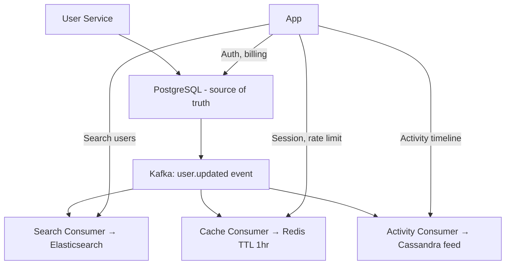

### Pitfalls
- ❌ **Synchronous cross-DB writes in one request:** Writing to PostgreSQL + Elasticsearch in the same API call — one failure leaves systems inconsistent; use async Kafka instead
- ❌ **Polyglot without clear data ownership:** Two services writing to the same Elasticsearch index causes schema conflicts and ownership ambiguity

### Concept Reference

---

## Q9: How does Airbnb use MySQL and HBase together?

**Role:** Staff | **Difficulty:** ⚫ Staff | **Priority:** P2 | **Format:** Deep Dive

> **What the interviewer is testing:** Whether you can reason about real-world polyglot architectures based on published engineering decisions, and extrapolate principles to novel scenarios.

### Problem Constraints
| Dimension | Value |
|-----------|-------|
| Listings | 7M+ active listings |
| Availability calendar rows | Billions (365 days × 7M listings) |
| Search queries | Millions/day with geo + date filters |
| Booking writes | ~100K/day, strictly ACID |

### Architecture

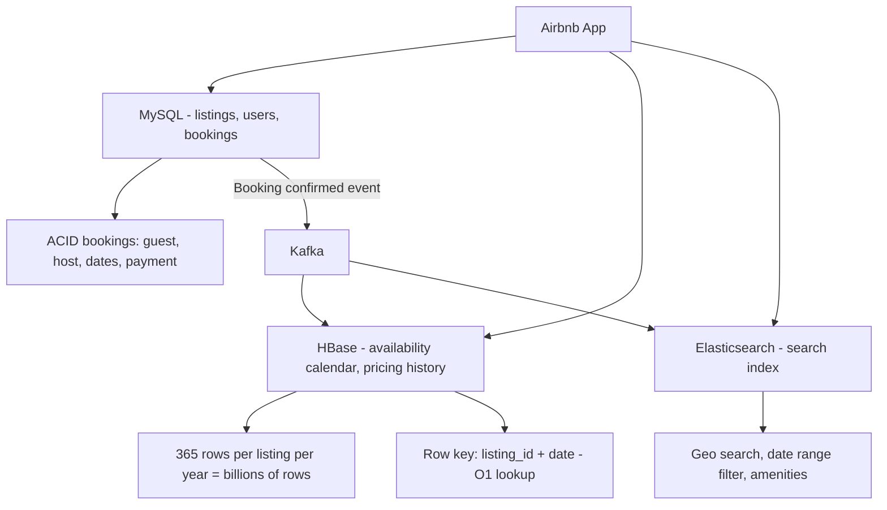

| Dimension | MySQL | HBase |
|-----------|-------|-------|
| Data type | Structured, relational | Wide-column, sparse |
| Writes | ~100K bookings/day | ~1M availability updates/day |
| Reads | Ad-hoc joins | Predictable key lookups |
| Scale ceiling | ~5TB comfortably | Petabytes |
| ACID | Yes | No (row-level atomicity only) |

### Recommended Answer
Airbnb uses MySQL for the booking transaction (guest, host, listing FK, payment — requires ACID across tables). HBase stores the availability calendar because each listing has 365 date entries and there are 7M listings — that's 2.5 billion rows, ideal for HBase's wide-column model. The row key `listing_id + date` gives O(1) lookups for availability checks. Elasticsearch handles the search index (geo bounding box + date filter + amenities).

### What a great answer includes
- [ ] Row key design for HBase (listing_id prefix for co-location of same listing's dates)
- [ ] ACID boundary: MySQL owns the booking transaction; HBase is updated asynchronously after commit
- [ ] Failure scenario: If HBase update fails after MySQL commit, Kafka retry ensures eventual consistency
- [ ] Engineering blog reference: Airbnb's architecture uses similar patterns described in their tech blog

### Pitfalls
- ❌ **Storing availability in MySQL:** 2.5B rows in MySQL with date-range queries causes table scans even with indexes — HBase's design is purpose-built for this
- ❌ **Updating HBase synchronously in booking transaction:** HBase failure would roll back MySQL booking — decouple via Kafka for resilience

### Concept Reference

---

## Q10: How do you evaluate a new database for 10x traffic growth?

**Role:** Staff | **Difficulty:** ⚫ Staff | **Priority:** P3 | **Format:** Quick Answer

> **What the interviewer is testing:** Whether you have a structured evaluation framework for database selection under load, not just a list of features.

### Answer in 60 seconds
- **Step 1 — Characterize current load:** p50/p99 latency, read/write ratio, query patterns (point lookups vs range vs aggregation), data size growth rate
- **Step 2 — Project 10x:** Current 1K TPS → 10K TPS; current 500GB → 5TB; identify which dimension breaks first (CPU? disk IOPS? network?)
- **Step 3 — Benchmark the candidate:** Use production-representative data and query mix; run at 10x load for 1 hour; measure p99.9 (not just p50)
- **Step 4 — Evaluate operability:** Backup/restore time, upgrade procedure, monitoring ecosystem, team expertise — a 30% faster DB with zero operator knowledge is often worse than a slower familiar one
- **Step 5 — Cost model:** At 10x, calculate total cost of ownership including storage, compute, licensing, and engineering hours for migration

### Diagram

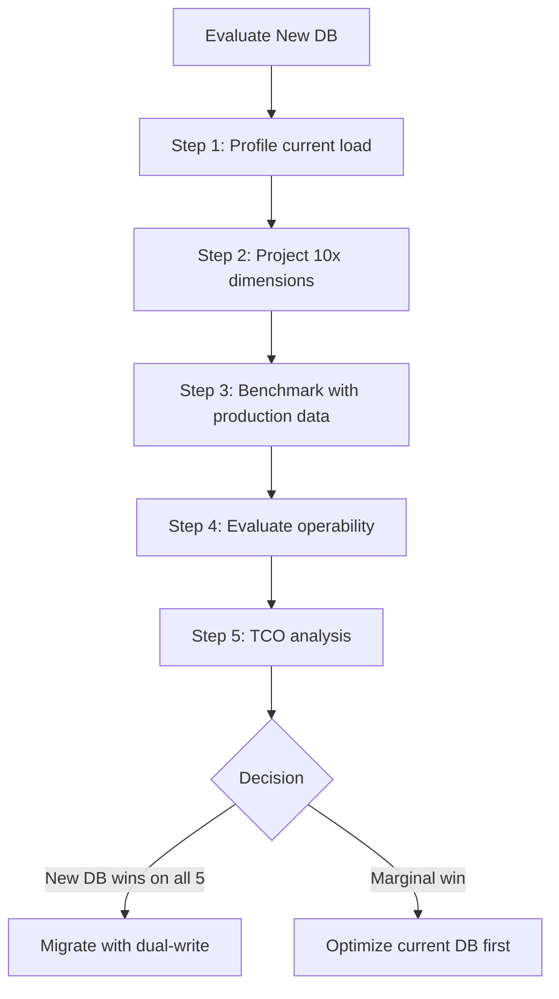

### Pitfalls
- ❌ **Benchmarking with synthetic data:** TPC-C or sysbench results don't reflect your skewed key distribution or query patterns — use a snapshot of production data
- ❌ **Ignoring migration cost in evaluation:** A 2x faster DB with 6 months of migration work may be worse than a 1.5x faster DB achievable in 2 weeks via read replica promotion

### Concept Reference
