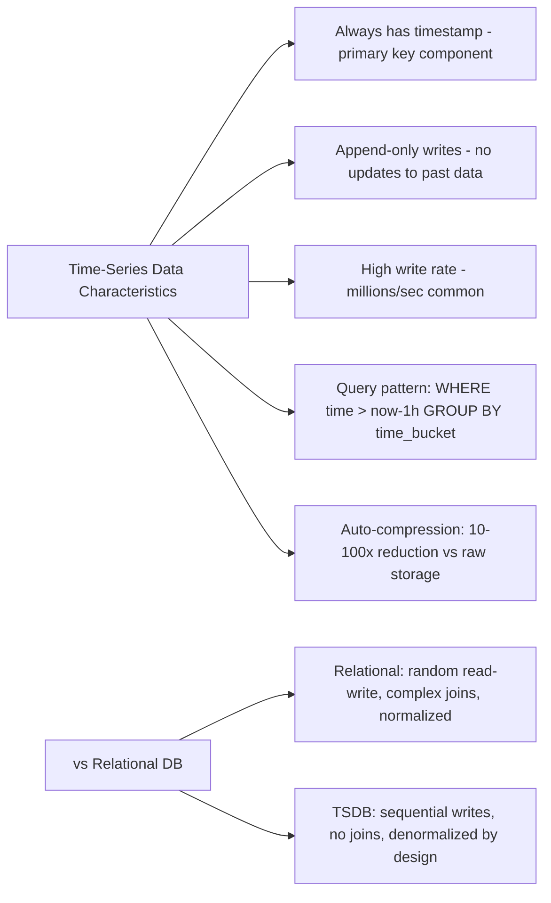
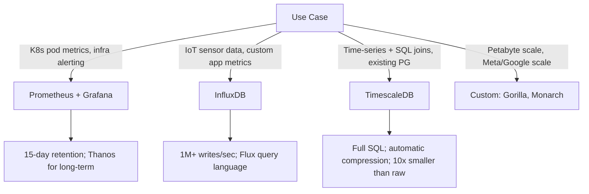
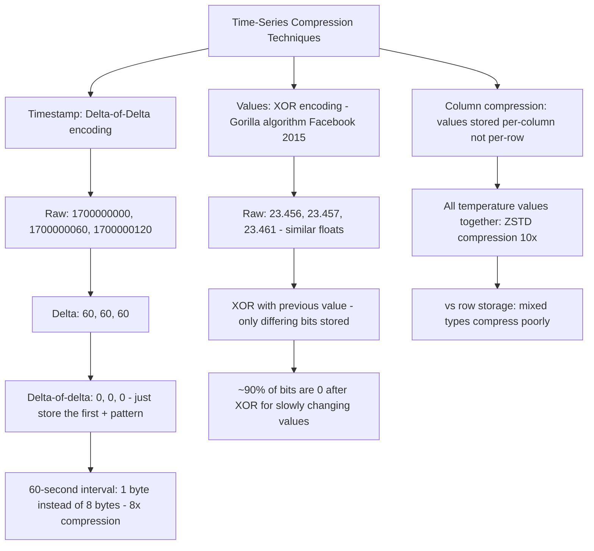
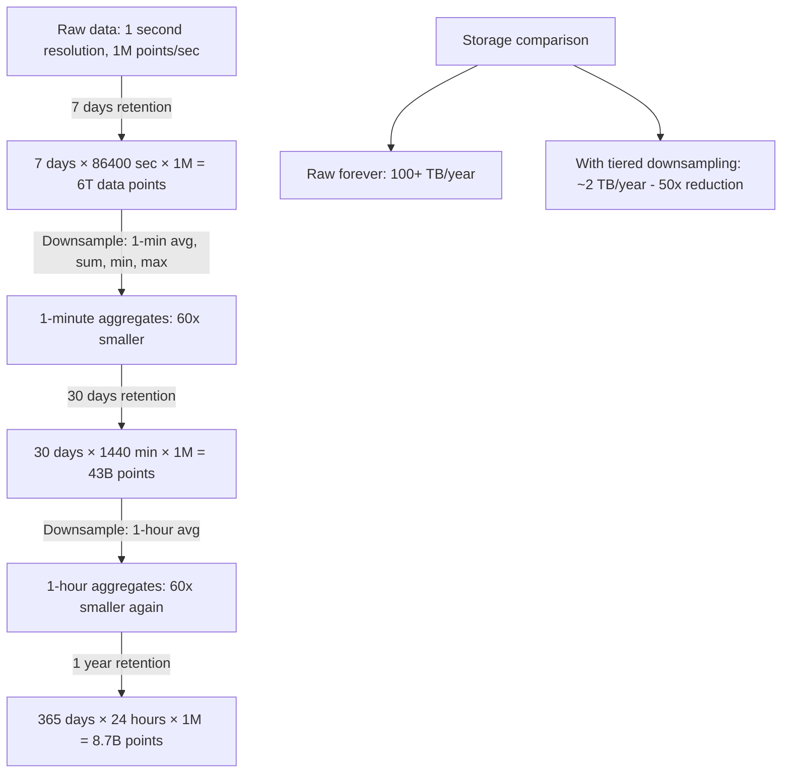
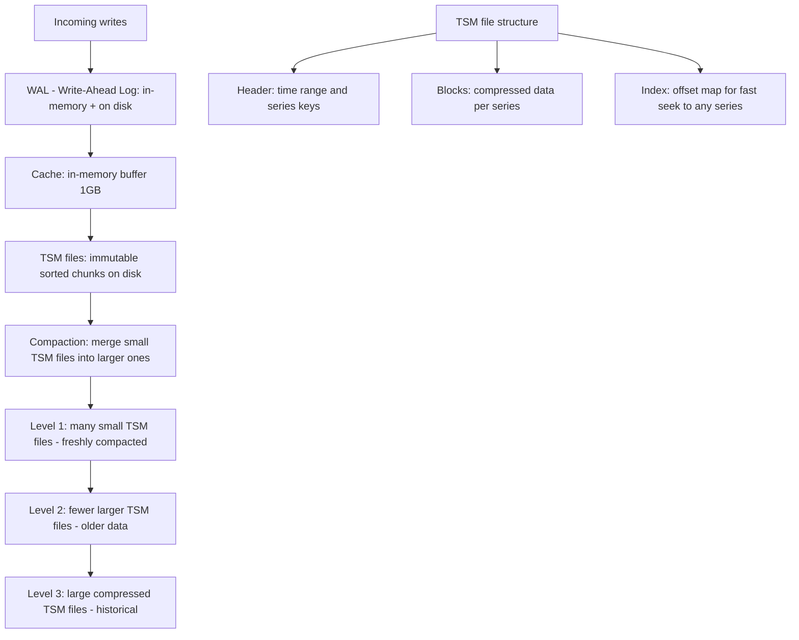
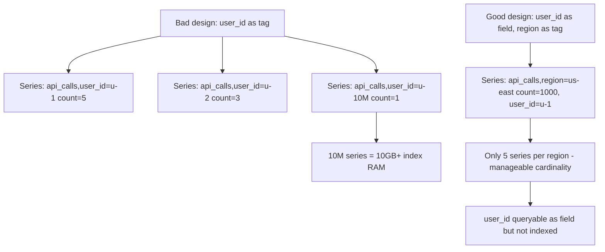
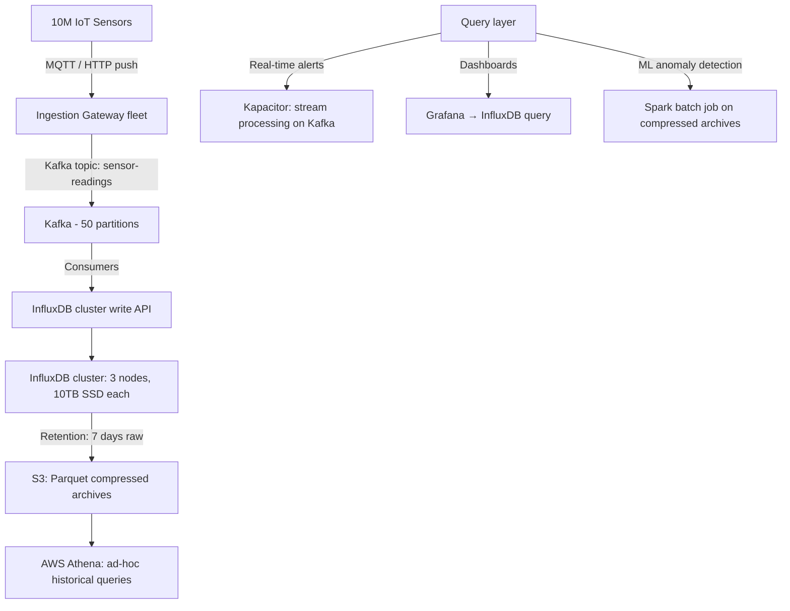
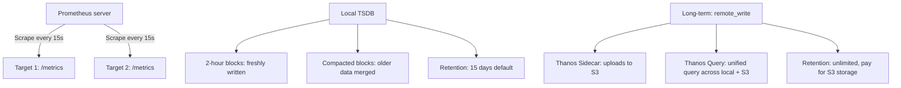
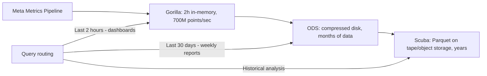
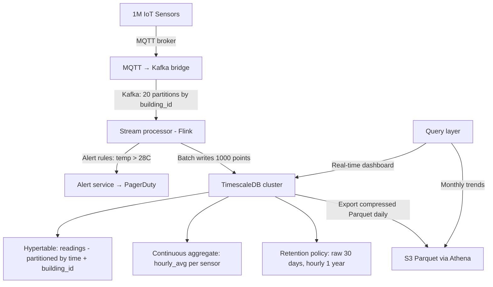

# Time-Series Databases

10 questions covering TSDBs vs relational, compression, downsampling, high-cardinality, and real-world IoT and metrics systems.

---

## Q1: What is a time-series database and how does it differ from a relational DB?

**Role:** Mid | **Difficulty:** 🟡 Mid | **Priority:** P0 | **Format:** Quick Answer

> **What the interviewer is testing:** Whether you understand that TSDBs are optimized for append-only, time-ordered, compressed data with a specific query pattern (time range + aggregation).

### Answer in 60 seconds
- **Time-series DB:** Optimized for storing sequences of timestamped measurements — every row has a timestamp; writes are append-only in time order; queries are almost always time-range + aggregation
- **Key differences from relational:** No updates (append-only); automatic data compression (10–100x vs raw); native time-bucketing functions; automatic retention policies; no joins
- **When to use TSDB:** Metrics, monitoring, IoT sensor data, financial tick data — any data where time is the primary dimension and you need fast range aggregations
- **Numbers:** InfluxDB handles 1M+ data points/sec on a single node; TimescaleDB (PostgreSQL extension) handles 500K inserts/sec; Prometheus scrapes 1M+ metrics/sec

### Diagram

### Pitfalls
- ❌ **Storing time-series data in PostgreSQL without TimescaleDB:** Standard PostgreSQL tables with a `created_at` column and manual indexes work for <1M rows/day; at 10M+ rows/day, query times degrade badly without TimescaleDB's hypertables and compression
- ❌ **Using TSDB for transactional data:** TSDBs lack ACID transactions and foreign keys — don't store user accounts or orders in InfluxDB

### Concept Reference
→ [SQL vs NoSQL](../../../system-design/storage-and-databases/sql-vs-nosql)

---

## Q2: When would you use InfluxDB vs Prometheus vs TimescaleDB?

**Role:** Mid | **Difficulty:** 🟡 Mid | **Priority:** P1 | **Format:** Quick Answer

> **What the interviewer is testing:** Whether you can match specific use cases to the right time-series tool.

### Answer in 60 seconds
- **Prometheus:** Pull-based scraping of HTTP `/metrics` endpoints; built-in alerting (AlertManager); ~15-day default retention; ideal for Kubernetes/microservices monitoring; local storage, not designed for long-term
- **InfluxDB:** Push-based writes at high throughput; purpose-built TSDB; InfluxQL/Flux query languages; good for IoT, custom events, application metrics; cloud version for managed scale
- **TimescaleDB:** PostgreSQL extension — full SQL support on time-series; best when you need complex joins, existing PostgreSQL knowledge, or mixing time-series with relational data; handles 500K inserts/sec
- **Rule of thumb:** Prometheus for K8s/infra metrics; InfluxDB for custom application telemetry; TimescaleDB when you need SQL joins or already run PostgreSQL

### Diagram

### Pitfalls
- ❌ **Using Prometheus as the long-term metrics store:** Prometheus local storage is designed for short-term (15 days); use Thanos or Cortex for long-term Prometheus data at scale
- ❌ **InfluxDB for relational queries:** InfluxDB does not support JOINs — if your metrics need to be correlated with user data via joins, use TimescaleDB instead

### Concept Reference
→ [SQL vs NoSQL](../../../system-design/storage-and-databases/sql-vs-nosql)

---

## Q3: How do time-series databases compress data to reduce storage by 10-100x?

**Role:** Senior | **Difficulty:** 🔴 Senior | **Priority:** P1 | **Format:** Deep Dive

> **What the interviewer is testing:** Whether you know the specific compression algorithms TSDBs use (delta-of-delta, XOR, run-length encoding) and why they're so effective for time-series data.

### Problem Constraints
| Dimension | Value |
|-----------|-------|
| Raw data rate | 1M data points/sec |
| Uncompressed size | 16 bytes/point × 1M = 16MB/sec = 1.37TB/day |
| Target compressed size | 10–100x reduction |

### Compression Algorithms

### Compression Ratios by Data Type

| Data Pattern | Algorithm | Compression Ratio |
|--------------|-----------|-------------------|
| Regular timestamps (60s intervals) | Delta-of-delta | 8–16x |
| Slowly changing floats (temperature) | Gorilla XOR | 10–20x |
| Integer counters | Delta encoding | 5–10x |
| String tags (region, host) | Dictionary encoding | 20–50x |
| Combined | All algorithms | 10–100x total |

### Recommended Answer
Time-series compression works because time-series data has high redundancy: timestamps are regularly spaced (delta-of-delta encodes to near-zero), values change slowly (XOR encoding of similar floats has mostly zero bits), and tags are repeated (dictionary encoding). Facebook's Gorilla paper (2015) demonstrated 12x compression on production metrics data, reducing 1TB to 83GB.

### What a great answer includes
- [ ] Gorilla paper reference: Facebook's 2015 VLDB paper that describes XOR-based float compression
- [ ] Column-oriented storage: values of the same metric stored together compress better than row-oriented
- [ ] Chunk compression: InfluxDB and TimescaleDB compress whole chunks (time ranges) rather than individual rows
- [ ] Trade-off: compressed data requires decompression for queries — recent data often kept uncompressed for fast writes

### Pitfalls
- ❌ **Assuming compression is free:** Compressed chunks require decompression at query time — recent data in TSDBs is often uncompressed for low-latency writes; compression kicks in after a configurable period (e.g., 7 days)
- ❌ **High-cardinality tags defeating compression:** Dictionary encoding of tags only works when cardinality is low — using UUIDs as tag values (10M unique values) eliminates dictionary compression benefit

### Concept Reference
→ [SQL vs NoSQL](../../../system-design/storage-and-databases/sql-vs-nosql)

---

## Q4: What is downsampling and how do you implement it for long-term storage?

**Role:** Senior | **Difficulty:** 🔴 Senior | **Priority:** P1 | **Format:** Quick Answer

> **What the interviewer is testing:** Whether you understand that raw 1-second data from 2 years ago is rarely needed and downsampling reduces storage cost while preserving trends.

### Answer in 60 seconds
- **Definition:** Aggregating high-resolution data into lower-resolution summaries — e.g., 1-second raw data aggregated to 1-minute averages, then 1-hour averages for long-term storage
- **Retention tiers:** Raw: 7 days; 1-min aggregates: 30 days; 1-hour aggregates: 1 year; 1-day aggregates: 5 years — storage reduction of 60× compared to keeping all raw data
- **Implementation:** Continuous aggregates in TimescaleDB auto-compute materialized views as new data arrives; InfluxDB's Tasks/Kapacitor for scheduled downsampling; Prometheus recording rules
- **Data loss:** Downsampling loses the ability to query at sub-minute resolution for old data — design retention tiers based on actual query needs, not theoretical completeness

### Diagram

### Pitfalls
- ❌ **Downsampling without keeping min/max:** Storing only the average loses spike information — always keep MIN, MAX, and PERCENTILE aggregates alongside mean to detect anomalies
- ❌ **Not accounting for query pattern before setting retention:** If SLA requires 90-day p99 latency analysis at 1-minute resolution, your downsampling policy can't drop 1-minute aggregates after 30 days

### Concept Reference
→ [SQL vs NoSQL](../../../system-design/storage-and-databases/sql-vs-nosql)

---

## Q5: How does InfluxDB's TSM storage engine work?

**Role:** Senior | **Difficulty:** 🔴 Senior | **Priority:** P2 | **Format:** Deep Dive

> **What the interviewer is testing:** Whether you understand InfluxDB's Time-Structured Merge Tree (TSM) and how it optimizes for write throughput and read performance on time-ordered data.

### Problem Constraints
| Dimension | Value |
|-----------|-------|
| Write rate | 1M points/sec |
| Series cardinality | 1M unique tag combinations |
| Compaction frequency | Background continuous |

### TSM Architecture

### TSM vs LSM Comparison

| Dimension | LSM Tree (RocksDB/Cassandra) | TSM Tree (InfluxDB) |
|-----------|------------------------------|---------------------|
| Key structure | Arbitrary keys | Time + series key (sorted by time) |
| Compaction strategy | Size-tiered or leveled | Time-based: old data compacted more aggressively |
| Read optimization | Bloom filters | Time range index |
| Write path | WAL → MemTable → SSTable | WAL → Cache → TSM |
| Deletion mechanism | Tombstones | TSI (Time Series Index) tombstones |

### Recommended Answer
TSM is InfluxDB's purpose-built storage engine, inspired by LSM trees but optimized for time-ordered data. The key optimization: data is sorted by series key + timestamp, enabling efficient range scans for time-based queries. Background compaction merges TSM files and applies compression, gradually converting recent high-resolution data to heavily compressed historical archives.

### What a great answer includes
- [ ] Series cardinality impact: high series cardinality (1M unique tag combos) creates large TSI (Time Series Index) — can cause memory pressure and slow queries
- [ ] Compaction tiers: Level 0 (recent, less compressed) → Level 4 (old, maximum compression)
- [ ] WAL and cache: writes go to WAL for durability, cache for low-latency reads; sync'd to TSM periodically
- [ ] Shard: InfluxDB divides data into shards by time window (e.g., 1 week per shard); old shards are closed and can be archived

### Pitfalls
- ❌ **High series cardinality causing OOM:** 10M unique tag combinations in TSI index can consume 10GB+ RAM — monitor series cardinality with `SHOW SERIES CARDINALITY`; alert at >1M
- ❌ **Not tuning cache size for write throughput:** Default cache is 1GB; at 1M writes/sec with large point sizes, cache evicts too frequently — increase `cache-max-memory-size` to 4–8GB

### Concept Reference
→ [SQL vs NoSQL](../../../system-design/storage-and-databases/sql-vs-nosql)

---

## Q6: How do you handle high-cardinality in time-series data?

**Role:** Senior | **Difficulty:** 🔴 Senior | **Priority:** P2 | **Format:** Quick Answer

> **What the interviewer is testing:** Whether you understand that high-cardinality tags (UUIDs, user IDs as tags) are the #1 performance killer in TSDBs.

### Answer in 60 seconds
- **Problem:** A tag with 10M unique values (e.g., user_id as a tag) creates 10M separate series in InfluxDB — each series has its own index entry; 10M series consumes 10–50GB RAM for indexes alone
- **Detection:** `SHOW SERIES CARDINALITY` in InfluxDB; alert at >1M series per measurement
- **Solutions:** (1) Move high-cardinality values from tags to fields — fields are not indexed; (2) Use a separate lookup table: store user_id→user_name in PostgreSQL, query TSDB by numeric metric only; (3) Pre-aggregate before writing: instead of storing per-user events, store per-region counts
- **Rule:** Tags should be low-cardinality (<10,000 unique values); use fields for high-cardinality identifiers

### Diagram

### Pitfalls
- ❌ **Using request_id or trace_id as a tag:** Trace IDs are UUID-level cardinality (billions per day) — store traces in a dedicated trace store (Jaeger, Tempo), not a TSDB
- ❌ **Ignoring cardinality until the TSDB OOMs:** InfluxDB will consume available RAM proportional to series cardinality; monitor cardinality on new metric ingestion pipelines before they reach production scale

### Concept Reference
→ [SQL vs NoSQL](../../../system-design/storage-and-databases/sql-vs-nosql)

---

## Q7: How would you design a time-series DB for 10M IoT sensors?

**Role:** Staff | **Difficulty:** ⚫ Staff | **Priority:** P2 | **Format:** Deep Dive

> **What the interviewer is testing:** Whether you can architect a complete time-series ingestion and query system at IoT scale with appropriate data modeling, ingestion, and retention tiers.

### Problem Constraints
| Dimension | Value |
|-----------|-------|
| Sensors | 10M devices |
| Reporting interval | Every 10 seconds |
| Metrics per report | 5 (temp, humidity, battery, signal, status) |
| Write rate | 10M / 10s × 5 = 5M data points/sec |
| Query pattern | Real-time alerts, hourly aggregations, anomaly detection |

### Architecture

| Layer | Technology | Scale |
|-------|-----------|-------|
| Ingestion gateway | Go services, stateless | 5M writes/sec |
| Message queue | Kafka, 50 partitions | Decouple ingest from DB write |
| TSDB | InfluxDB cluster | 3 nodes, horizontal scale |
| Alerts | Kapacitor / Flink | Sub-second latency |
| Historical | S3 + Athena | Petabytes, cost-effective |

### Recommended Answer
The key design decisions: (1) Use Kafka between ingest and TSDB to absorb traffic spikes and enable replay; (2) Partition sensors by sensor_id to ensure writes are distributed; (3) Use device_type as a tag (low cardinality: ~100 types) not device_id (high cardinality: 10M); (4) Stream alerts via Kafka before writing to TSDB for <1s alert latency; (5) Downsample to S3/Parquet after 7 days for cost-effective long-term storage.

### What a great answer includes
- [ ] Cardinality management: device_id as a field (not tag) to avoid 10M-series cardinality explosion
- [ ] Kafka buffer sizing: Kafka retains 7 days of data — can replay to TSDB if cluster fails
- [ ] Write batching: batch 1000 points per InfluxDB write API call for 10x throughput improvement
- [ ] Hot/cold storage split: hot (7 days) in InfluxDB for fast queries; cold (years) in S3 Parquet for cheap storage

### Pitfalls
- ❌ **Writing 5M points/sec directly to InfluxDB without Kafka:** Without Kafka, a TSDB restart loses all in-flight data; Kafka provides durability and replay capability
- ❌ **Using device_id as a tag for 10M devices:** 10M series cardinality = 10GB+ TSI index per node — index OOM kills the cluster

### Concept Reference
→ [SQL vs NoSQL](../../../system-design/storage-and-databases/sql-vs-nosql)

---

## Q8: How does Prometheus handle data scraping intervals and retention?

**Role:** Staff | **Difficulty:** ⚫ Staff | **Priority:** P2 | **Format:** Quick Answer

> **What the interviewer is testing:** Whether you know Prometheus's pull-based model, TSDB internals, and standard patterns for long-term storage.

### Answer in 60 seconds
- **Scraping model:** Prometheus pulls metrics from targets via HTTP GET `/metrics` every `scrape_interval` (default 15s); each target exposes metrics in the Prometheus exposition format
- **Local TSDB:** Prometheus stores data in 2-hour blocks on local disk; blocks are compacted; default retention is 15 days / 10GB
- **Chunked blocks:** Each 2-hour block contains compressed time series; chunks are ~128 bytes per series per block for typical cardinality
- **Long-term storage:** Prometheus 2.0+ supports remote_write to Thanos, Cortex, or Victoria Metrics for petabyte-scale long-term retention while keeping local Prometheus for fast recent queries

### Diagram

### Pitfalls
- ❌ **Not setting appropriate scrape_interval:** 1-second scrape interval on 10K targets = 10K HTTP requests/second from Prometheus — CPU saturation; 15s is default for a reason
- ❌ **Running Prometheus without Thanos/Cortex for long-term:** Single Prometheus for 6+ months of data requires >1TB local disk and no HA; Thanos adds object storage + multi-replica query

### Concept Reference
→ [SQL vs NoSQL](../../../system-design/storage-and-databases/sql-vs-nosql)

---

## Q9: How does Meta store and query petabytes of time-series metrics?

**Role:** Staff | **Difficulty:** ⚫ Staff | **Priority:** P3 | **Format:** Quick Answer

> **What the interviewer is testing:** Whether you know the Gorilla paper and Scuba/ODS systems and can extrapolate principles for hyper-scale time-series.

### Answer in 60 seconds
- **Gorilla (2015):** In-memory TSDB that compresses 2 hours of data per time series into ~1.37 bytes/point using delta-of-delta timestamps + XOR float encoding; serves 10M+ time series from RAM with <1ms query latency
- **ODS (Operational Data Store):** Meta's long-term metrics system storing petabytes; Gorilla is the hot tier (2 hours), ODS is the warm tier (months), Scuba is for interactive analytics
- **Key scale numbers:** Gorilla serves 700M+ data points/second at Meta; each Gorilla node stores ~4 hours of data for ~10M time series in ~10GB RAM
- **Lesson for interviews:** Separate hot (in-memory), warm (compressed disk), cold (object storage) tiers by access frequency — the access pattern is highly temporal (recent data 100x more queried)

### Diagram

### Pitfalls
- ❌ **Applying Gorilla's architecture to a 100-node company:** Gorilla is optimized for running 10M+ series in RAM — most companies don't need in-memory TSDBs; InfluxDB/Prometheus are more appropriate
- ❌ **Ignoring the tiered access pattern:** Fetching all historical data for every query is expensive; routing queries to the cheapest storage tier that has the required resolution is the key optimization

### Concept Reference
→ [SQL vs NoSQL](../../../system-design/storage-and-databases/sql-vs-nosql)

---

## Q10: Store 1M IoT temperature readings/minute — design the storage and query system

**Role:** Senior | **Difficulty:** 🔴 Senior | **Priority:** P1 | **Format:** Scenario
**Real Company:** Modeled on smart building IoT deployments (Siemens, Honeywell, Google Nest)

### The Brief
> "You're building the storage backend for a smart building platform. 10,000 buildings, 100 sensors per building = 1M sensors total. Each sensor sends temperature, humidity, and CO2 every 60 seconds. Design the storage and query system to support: real-time alerts, per-floor dashboards (last hour), monthly trend reports."

### Clarifying Questions to Ask First
1. What is the data retention requirement — how long must raw data be kept?
2. What is the real-time alert latency requirement — sub-second or acceptable at 60s?
3. Do buildings need to be queried in isolation, or are cross-building comparisons needed?
4. What is the expected number of concurrent dashboard users?

### Back-of-Envelope Estimation
| Metric | Calculation | Result |
|--------|-------------|--------|
| Write rate | 1M sensors × 3 metrics / 60s | 50K data points/sec |
| Daily raw data | 50K × 86400 × 8 bytes | ~34GB/day raw |
| Compressed (10x) | 34GB / 10 | ~3.4GB/day |
| 1-year retention | 3.4GB × 365 | ~1.2TB/year |
| Query load | 10K buildings × 5 dashboard users | 50K concurrent queries peak |

### High-Level Architecture

### Trade-off Decisions
| Decision | Option A | Option B | Chosen | Why |
|----------|----------|----------|--------|-----|
| Storage engine | InfluxDB | TimescaleDB | TimescaleDB | Need SQL joins with building metadata |
| Alert delivery | Query TSDB every 60s | Kafka stream rules | Kafka stream | Sub-second alert latency without DB polling |
| Long-term storage | Keep in TimescaleDB | Export to S3 Parquet | Export to S3 | 10x cheaper; monthly queries don't need fast TSDB |
| Cardinality | sensor_id as tag | sensor_id as field | sensor_id as field | 1M unique IDs = high-cardinality problem; use building_id as tag |

### Failure Modes
| Failure | Impact | Mitigation |
|---------|--------|------------|
| TimescaleDB primary fails | 5-10min gap in dashboard data | Streaming replication replica; Patroni auto-failover in <30s |
| Kafka lag grows | Alerts delayed | Monitor consumer lag; scale stream processors |
| IoT sensor offline 1 hour | Gap in data | Sensor client buffers locally and replays on reconnect |

### Concept References
→ [SQL vs NoSQL](../../../system-design/storage-and-databases/sql-vs-nosql)
