# Transactions, ACID, and BASE

10 questions covering ACID properties, isolation levels, MVCC, optimistic concurrency, and distributed transactions.

---

## Q1: Explain ACID with a concrete bank transfer example

**Role:** Junior | **Difficulty:** 🟢 Junior | **Priority:** P0 | **Format:** Quick Answer

> **What the interviewer is testing:** Whether you can map abstract ACID properties to failure scenarios in a real transaction, not just recite the acronym.

### Answer in 60 seconds
- **Atomicity:** Transfer $100 from Alice to Bob — if the debit succeeds but credit fails, the entire transaction is rolled back; Alice keeps her $100; no money is created or lost
- **Consistency:** Constraints enforce that no account goes negative; the transaction takes DB from one valid state (Alice=$500, Bob=$200) to another (Alice=$400, Bob=$300)
- **Isolation:** Concurrent transfers from Alice's account don't see each other's intermediate state — Alice can't be double-debited by two concurrent transactions
- **Durability:** Once committed, the transfer survives a server crash — PostgreSQL WAL ensures the commit record is flushed to disk before returning OK

### Diagram

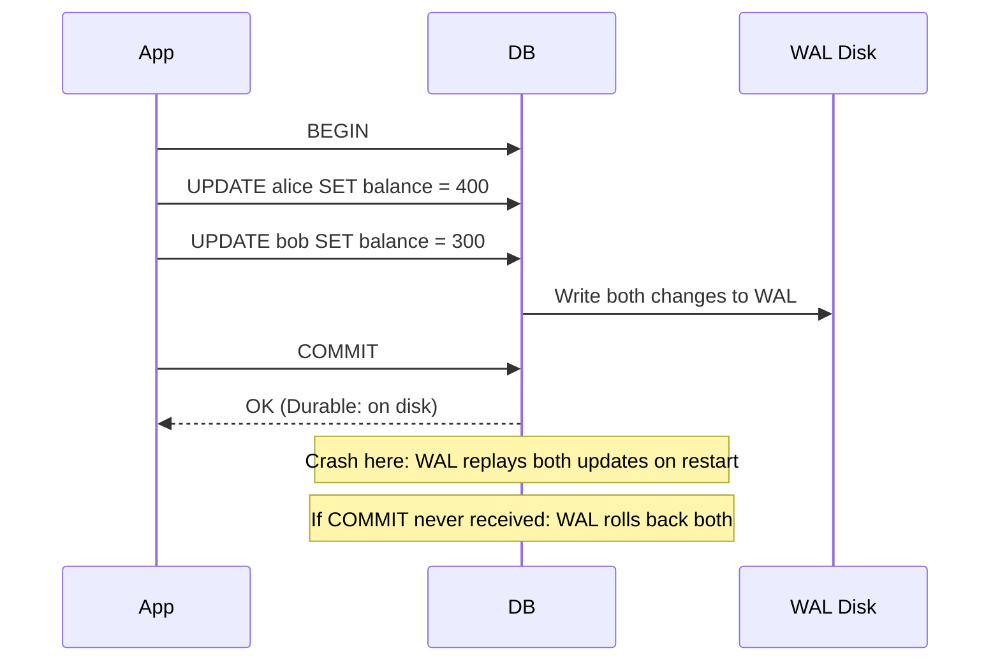

### Pitfalls
- ❌ **Confusing Consistency with Integrity:** ACID Consistency means constraints are satisfied at transaction boundaries — it does NOT mean replicas are in sync (that's a different type of consistency)
- ❌ **Assuming Isolation means full serialization by default:** PostgreSQL default isolation is READ COMMITTED — allows non-repeatable reads; SERIALIZABLE prevents all anomalies but reduces throughput

### Concept Reference

---

## Q2: What is an isolation level and what problems does each level prevent?

**Role:** Mid | **Difficulty:** 🟡 Mid | **Priority:** P0 | **Format:** Quick Answer

> **What the interviewer is testing:** Whether you can match isolation levels to anomalies they prevent and understand the throughput cost of each level.

### Answer in 60 seconds
- **READ UNCOMMITTED:** Reads uncommitted data from other transactions (dirty reads); theoretically possible but MySQL/PG don't implement it this way
- **READ COMMITTED (PostgreSQL default):** Prevents dirty reads; allows non-repeatable reads (a row read twice in one transaction may change between reads)
- **REPEATABLE READ:** Prevents dirty reads and non-repeatable reads; allows phantom reads (a range query may return different rows on second execution)
- **SERIALIZABLE:** Prevents all anomalies including phantom reads; implemented via predicate locking or SSI — reduces throughput by 50–80%

### Diagram

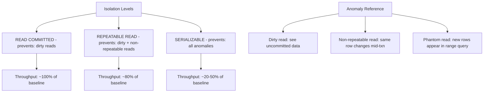

### Pitfalls
- ❌ **Using SERIALIZABLE for all transactions:** Booking confirmation needs SERIALIZABLE; reading a user profile does not — scope serializable isolation to only the transactions that need it
- ❌ **Assuming REPEATABLE READ prevents phantoms in PostgreSQL:** PostgreSQL's REPEATABLE READ uses snapshot isolation which actually prevents most phantoms in practice, but SERIALIZABLE is the only standard guarantee

### Concept Reference

---

## Q3: How do MVCC databases handle concurrent transactions?

**Role:** Senior | **Difficulty:** 🔴 Senior | **Priority:** P0 | **Format:** Deep Dive

> **What the interviewer is testing:** Whether you understand Multi-Version Concurrency Control — that readers don't block writers and writers don't block readers, and why this is key to PostgreSQL/MySQL InnoDB performance.

### Problem Constraints
| Dimension | Value |
|-----------|-------|
| Concurrent transactions | 1,000/sec |
| Read:write ratio | 9:1 |
| Isolation level | READ COMMITTED (default) |

### How MVCC Works

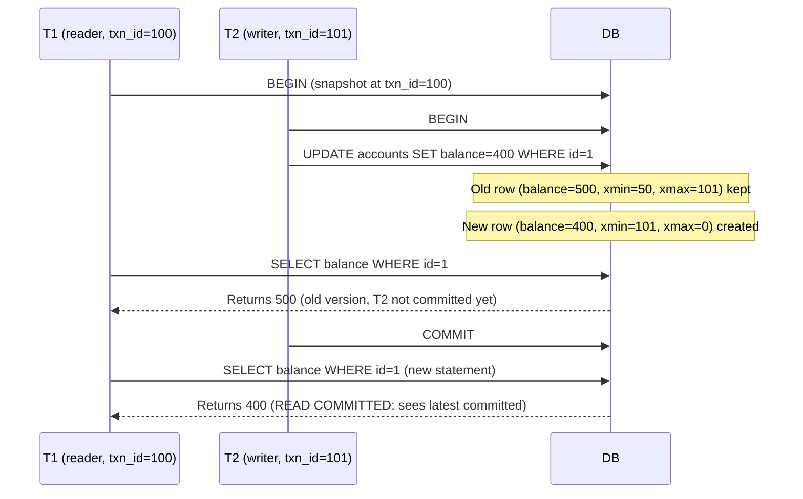

### Key MVCC Mechanics

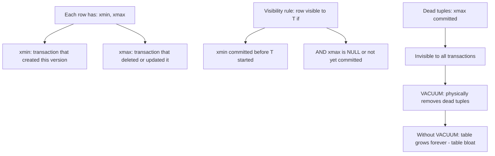

| Property | MVCC Behavior |
|----------|--------------|
| Read blocks write? | No — readers see old version |
| Write blocks read? | No — readers see old version |
| Write blocks write? | Yes — competing updates to same row |
| Storage cost | 2x row versions during active update |
| Cleanup cost | VACUUM required to reclaim dead tuples |

### Recommended Answer
MVCC maintains multiple row versions — each transaction sees a consistent snapshot based on when it started. This enables concurrent reads and writes without locking, which is why PostgreSQL can handle 10,000+ concurrent connections efficiently. The cost is dead tuple accumulation requiring AUTOVACUUM.

### What a great answer includes
- [ ] xmin/xmax visibility rule (the actual mechanism, not just the concept)
- [ ] Why VACUUM is critical: dead tuples from MVCC cause table bloat and eventually transaction ID wraparound
- [ ] MVCC vs lock-based: lock-based systems (DB2, older Oracle) block readers on write — MVCC systems don't
- [ ] Write-write conflict: MVCC doesn't eliminate write conflicts — two concurrent UPDATEs to the same row still result in one waiting

### Pitfalls
- ❌ **Thinking MVCC eliminates all locking:** MVCC eliminates read-write locks; write-write conflicts still cause row-level locking
- ❌ **Disabling AUTOVACUUM:** MVCC dead tuples accumulate without VACUUM — disabling AUTOVACUUM causes table bloat and eventually transaction ID wraparound (requires emergency VACUUM FREEZE)

### Concept Reference

---

## Q4: What is a phantom read, dirty read, and non-repeatable read?

**Role:** Mid | **Difficulty:** 🟡 Mid | **Priority:** P1 | **Format:** Quick Answer

> **What the interviewer is testing:** Whether you can give precise definitions with examples that distinguish these three anomalies.

### Answer in 60 seconds
- **Dirty read:** Transaction T1 reads data written by uncommitted T2; T2 rolls back — T1 now has data that never officially existed; prevented by READ COMMITTED+
- **Non-repeatable read:** T1 reads a row, T2 commits an update to that row, T1 reads the same row again — gets different value mid-transaction; prevented by REPEATABLE READ+
- **Phantom read:** T1 runs a range query, T2 inserts a new row matching that range and commits, T1 runs the range query again — new row appears; prevented by SERIALIZABLE only
- **Real-world impact:** Non-repeatable read causes wrong inventory deduction; phantom read causes double-booking of the last seat

### Diagram

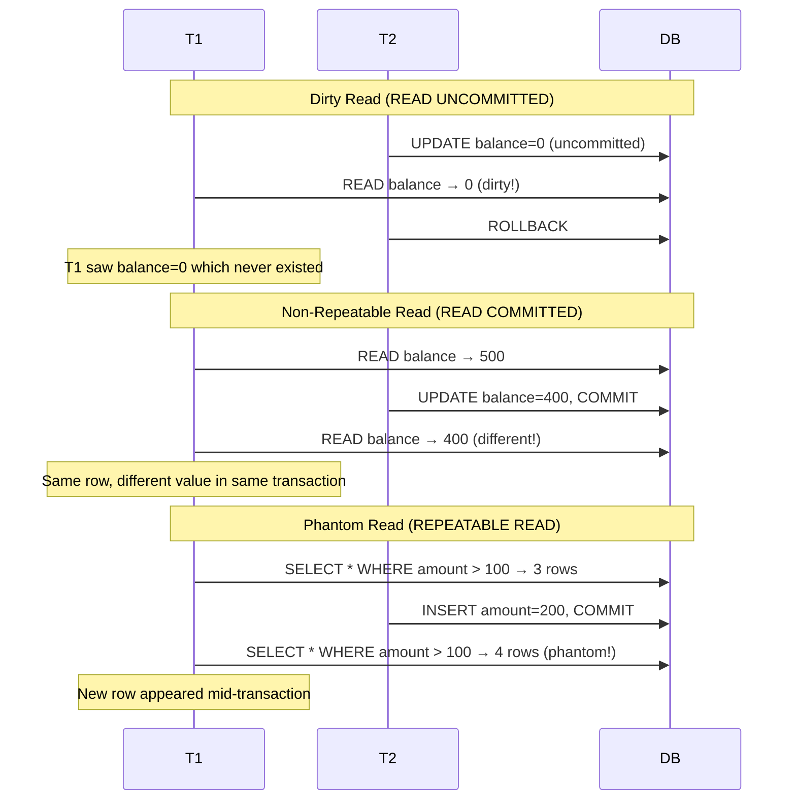

### Pitfalls
- ❌ **Confusing phantom reads with non-repeatable reads:** Non-repeatable = same row changes value; phantom = new rows appear in a range — the isolation fix is different
- ❌ **Assuming PostgreSQL REPEATABLE READ allows phantoms:** PostgreSQL's REPEATABLE READ snapshot isolation prevents most phantoms in practice (via snapshot), but the SQL standard says REPEATABLE READ should allow them

### Concept Reference

---

## Q5: When would you use SERIALIZABLE isolation and what is the cost?

**Role:** Senior | **Difficulty:** 🔴 Senior | **Priority:** P1 | **Format:** Deep Dive

> **What the interviewer is testing:** Whether you can identify scenarios that require serializable isolation and quantify the throughput trade-off.

### Problem Constraints
| Dimension | Value |
|-----------|-------|
| Use case | Airline seat booking |
| Concurrent booking requests | 500/sec |
| Seats available | 1 per flight |
| Acceptable double-booking rate | 0 |

### When Serializable is Required

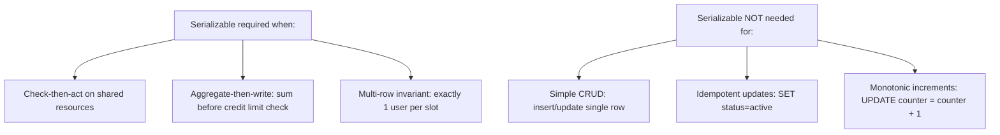

### Cost of Serializable

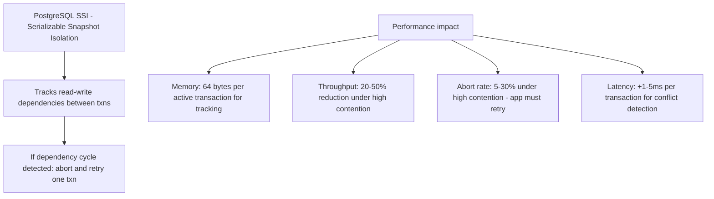

| Isolation | Throughput | Abort Rate | Use When |
|-----------|------------|------------|----------|
| READ COMMITTED | Baseline 100% | ~0% | Default CRUD |
| REPEATABLE READ | ~80% | ~1% | Consistent reports |
| SERIALIZABLE | 20–50% | 5–30% | Financial, booking, inventory |

### Recommended Answer
Use SERIALIZABLE only for transactions that have a true check-then-act pattern on shared data: seat booking, inventory deduction, credit limit checks, unique resource allocation. The application must handle `SQLSTATE 40001` (serialization failure) with retry logic. For all other transactions, lower isolation levels with explicit SELECT FOR UPDATE on specific rows are more efficient.

### What a great answer includes
- [ ] SSI (Serializable Snapshot Isolation) in PostgreSQL vs traditional 2PL-based serializable
- [ ] Retry logic requirement: serialization failures must be caught and retried in application code
- [ ] SELECT FOR UPDATE as alternative: explicit locking on specific rows with READ COMMITTED — simpler, less aborts, but more deadlock risk
- [ ] Scope: run SERIALIZABLE for the critical path only, not for the entire connection

### Pitfalls
- ❌ **Using SERIALIZABLE without retry logic:** SQLSTATE 40001 errors bubble up as exceptions to users — the app must catch and retry serialization failures automatically
- ❌ **Serializable for all reads:** Reads in a serializable transaction also track dependencies — use it only for transactions that both read and write shared state

### Concept Reference

---

## Q6: How do you implement optimistic concurrency control without locking?

**Role:** Senior | **Difficulty:** 🔴 Senior | **Priority:** P1 | **Format:** Quick Answer

> **What the interviewer is testing:** Whether you know OCC as an alternative to pessimistic locking that reduces contention when conflicts are rare.

### Answer in 60 seconds
- **Pattern:** Add a `version` or `updated_at` column to each row; read it with the data; include it in the UPDATE WHERE clause; if 0 rows updated, another writer modified it first — retry
- **When to use:** Low-conflict scenarios where reads >> writes; pessimistic locking (SELECT FOR UPDATE) would hold locks too long (e.g., user editing a form for minutes)
- **Conflict rate matters:** OCC performs better than pessimistic locking when conflict rate < 5%; above 20% conflicts, retry overhead exceeds lock wait overhead
- **Real example:** Stripe uses version fields on API objects; Etsy uses OCC for cart updates

### Diagram

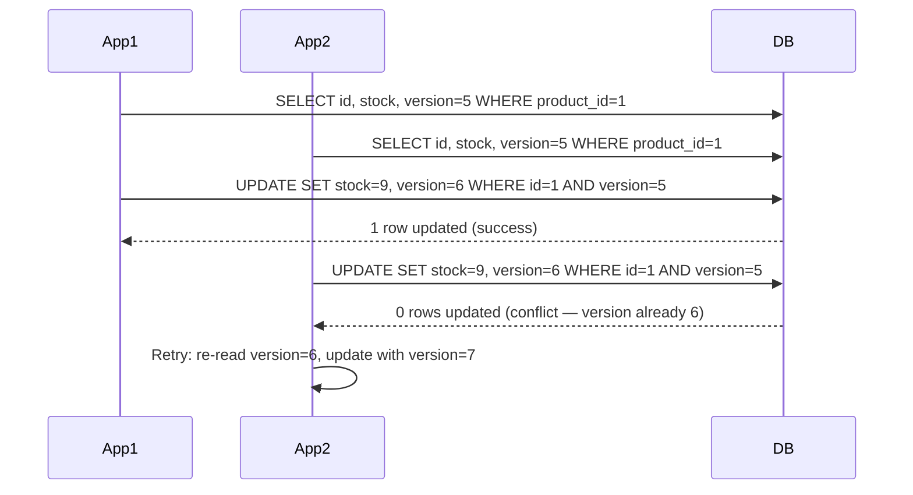

### Pitfalls
- ❌ **OCC in high-contention scenarios:** A flash sale with 10K concurrent requests buying the last item causes 9,999 retries — use pessimistic locking (SELECT FOR UPDATE) or atomic decrement instead
- ❌ **Not indexing the version column:** The WHERE clause includes version — ensure the index includes it for efficient conflict detection

### Concept Reference

---

## Q7: How does PostgreSQL implement MVCC under the hood?

**Role:** Senior | **Difficulty:** 🔴 Senior | **Priority:** P2 | **Format:** Quick Answer

> **What the interviewer is testing:** Whether you understand PostgreSQL-specific MVCC internals including xmin/xmax, transaction ID wraparound, and VACUUM's role.

### Answer in 60 seconds
- **Row versioning:** Each physical row tuple has `xmin` (creating transaction ID) and `xmax` (deleting/updating transaction ID) — a row is visible to T if xmin < T.txn_id and (xmax=0 or xmax > T.txn_id)
- **Transaction ID (XID):** 32-bit counter — wraps around after ~2.1 billion transactions; PostgreSQL must run VACUUM FREEZE before wraparound to mark rows with a frozen xmin, preventing visibility confusion
- **pg_clog / pg_xact:** PostgreSQL maintains a commit log that maps each XID to committed/aborted/in-progress — visibility check looks up xmin in pg_xact
- **Dead tuple cleanup:** VACUUM scans tables, marks dead tuples (where xmax is a committed transaction) as free space — AUTOVACUUM does this automatically based on dead tuple count threshold

### Diagram

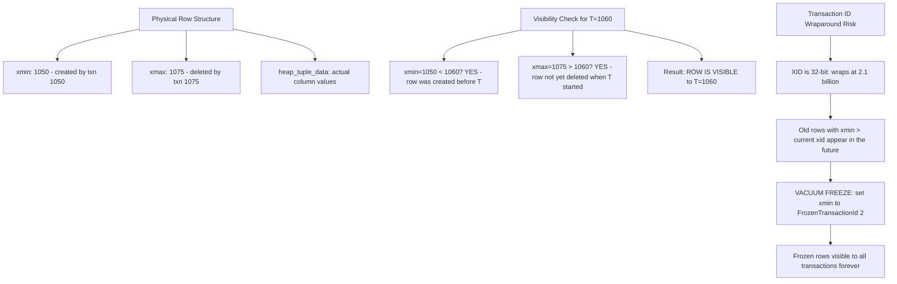

### Pitfalls
- ❌ **Ignoring transaction ID wraparound warnings:** PostgreSQL will shut down automatically when approaching XID wraparound to prevent data corruption — monitor `pg_stat_user_tables.n_dead_tup` and `age(relfrozenxid)`
- ❌ **Not understanding why VACUUM can't always reclaim space:** VACUUM marks pages as free but doesn't return disk space to OS; `VACUUM FULL` reclaims disk but locks table — only use VACUUM FULL during maintenance windows

### Concept Reference

---

## Q8: How do you design a distributed transaction across PostgreSQL + Redis + Kafka?

**Role:** Staff | **Difficulty:** ⚫ Staff | **Priority:** P2 | **Format:** Deep Dive

> **What the interviewer is testing:** Whether you understand that true ACID across heterogeneous systems is impractical and know the saga/outbox patterns as alternatives.

### Problem Constraints
| Dimension | Value |
|-----------|-------|
| Systems | PostgreSQL (orders) + Redis (inventory cache) + Kafka (events) |
| Requirement | Order creation must update all 3 atomically |
| Failure tolerance | Zero lost orders |

### Approach A — 2PC across all systems (not recommended)

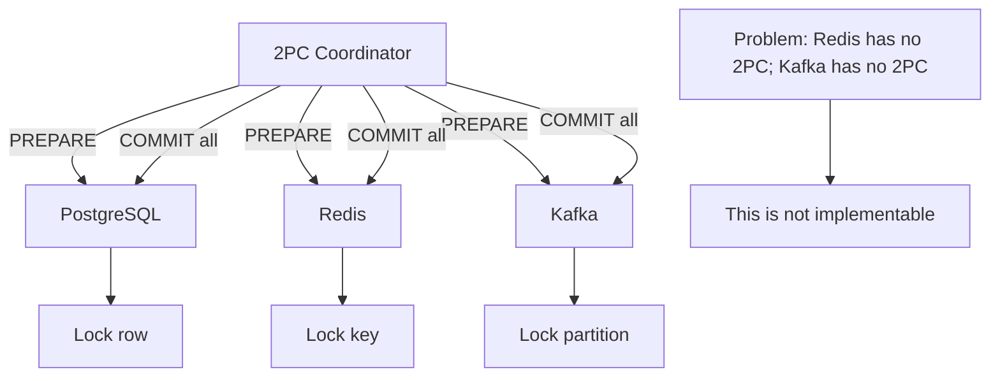

### Approach B — Outbox Pattern (recommended)

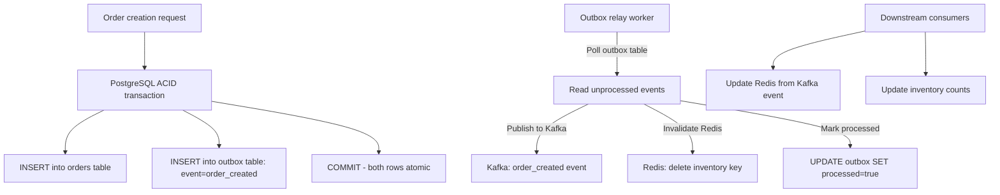

| Dimension | 2PC | Outbox Pattern |
|-----------|-----|----------------|
| Atomicity | Strong (if supported) | Eventual (~100ms) |
| Implementability | Impossible across Redis+Kafka | Fully implementable |
| Complexity | Very high | Medium |
| Failure recovery | Manual coordinator recovery | Auto-retry via Kafka |
| Data loss risk | Coordinator crash loses state | Zero (outbox in PostgreSQL) |

### Recommended Answer
Use the **Outbox pattern**: write the event to the same PostgreSQL transaction as the business operation. The outbox relay reads committed events and publishes to Kafka and invalidates Redis. This guarantees exactly-once delivery (idempotency key) and zero event loss because the outbox is part of the ACID PostgreSQL transaction.

### What a great answer includes
- [ ] Why 2PC is impossible with Redis (no XA support) and unreliable with Kafka (producer idempotency ≠ 2PC)
- [ ] Outbox relay idempotency: Kafka deduplication using event_id as idempotency key
- [ ] Redis cache invalidation vs update: invalidate (delete) is safer than update (avoids stale write ordering)
- [ ] At-least-once delivery: outbox relay may republish; consumers must be idempotent

### Pitfalls
- ❌ **Writing to Kafka before PostgreSQL COMMIT:** Kafka publish succeeds but PostgreSQL rolls back — Kafka has a phantom event; consumers process an order that doesn't exist
- ❌ **Not making Kafka consumers idempotent:** Outbox relay will retry on failure — consumers receive the same event twice; must handle duplicate order_created events gracefully

### Concept Reference

---

## Q9: What is the difference between 2PL and MVCC?

**Role:** Staff | **Difficulty:** ⚫ Staff | **Priority:** P2 | **Format:** Quick Answer

> **What the interviewer is testing:** Whether you understand the fundamental philosophical difference between lock-based (2PL) and version-based (MVCC) concurrency control.

### Answer in 60 seconds
- **2PL (Two-Phase Locking):** Acquiring phase — transaction acquires all needed locks; releasing phase — releases them at commit; reads block writes and vice versa; strong consistency, lower concurrency
- **MVCC:** Each write creates a new version; readers see a consistent snapshot without locking any rows; readers never block writers, writers never block readers; implemented by PostgreSQL, MySQL InnoDB, Oracle
- **Key difference:** 2PL is pessimistic (assume conflict, lock proactively); MVCC is optimistic for reads (assume no conflict, use versioning)
- **Throughput:** MVCC achieves 3–10x higher read throughput than 2PL under concurrent workloads because reads are never blocked

### Diagram

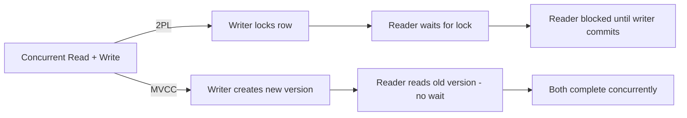

### Pitfalls
- ❌ **Thinking MVCC eliminates all locking:** MVCC eliminates read-write conflicts; write-write conflicts (two transactions updating same row) still require row-level locks even in MVCC systems
- ❌ **Assuming all databases use MVCC:** DB2 and SQL Server traditionally use lock-based (2PL); PostgreSQL, MySQL InnoDB, Oracle use MVCC — database selection matters for workload type

### Concept Reference

---

## Q10: You have a race condition causing double inventory deductions — fix it without table locks

**Role:** Senior | **Difficulty:** 🔴 Senior | **Priority:** P1 | **Format:** Scenario
**Real Company:** Common e-commerce platform challenge (Amazon, Shopify, eBay)

### The Brief
> "Your inventory service has a bug: two concurrent order requests for the same product both succeed when only 1 item is in stock. The current code reads inventory, checks if > 0, then deducts. Fix this race condition without locking the entire inventory table."

### Clarifying Questions to Ask First
1. What database are you using (PostgreSQL / MySQL)?
2. Is the inventory check and deduction in a single service or across microservices?
3. Can you tolerate occasional oversell with compensation, or must it be zero oversell?
4. What is the expected concurrency level — 10 concurrent requests or 10,000?

### Back-of-Envelope Estimation
| Metric | Value |
|--------|-------|
| Race window | Time between SELECT and UPDATE: ~1ms |
| Concurrent requests | 100/sec for same popular SKU |
| Probability of race without fix | 1 - (1 - 0.001)^100 ≈ 10% of requests could race |
| Target | 0 oversells |

### High-Level Architecture

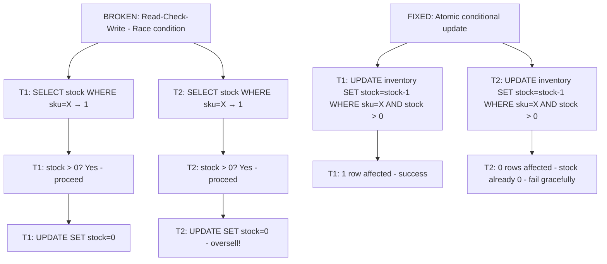

### Trade-off Decisions
| Decision | Option A | Option B | Chosen | Why |
|----------|----------|----------|--------|-----|
| Locking strategy | SELECT FOR UPDATE (row lock) | Atomic conditional update | Atomic update | No explicit lock; single statement; same atomicity guarantee |
| Redis optimization | Check Redis before DB | Go straight to DB | Redis check first | Redis decrement is atomic; reduces DB load by 90% |
| Oversell tolerance | Zero oversell | Allow 1% oversell with compensation | Zero oversell | Requirement: refunds are expensive and damage trust |
| High concurrency | Queued reservation system | Optimistic retry | Queued reservation | At >1K req/sec per SKU, retry storms cause cascading load |

### Failure Modes
| Failure | Impact | Mitigation |
|---------|--------|------------|
| DB and Redis out of sync | Redis shows stock > 0 but DB = 0 | Use Redis as cache only; DB atomic update is source of truth |
| Redis DECR race | Redis goes to -1 | Check after decrement: if stock < 0, INCR back and reject |
| High retry rate under flash sale | 10K retries overload DB | Queue-based reservation with distributed lock (Redis SETNX) |

